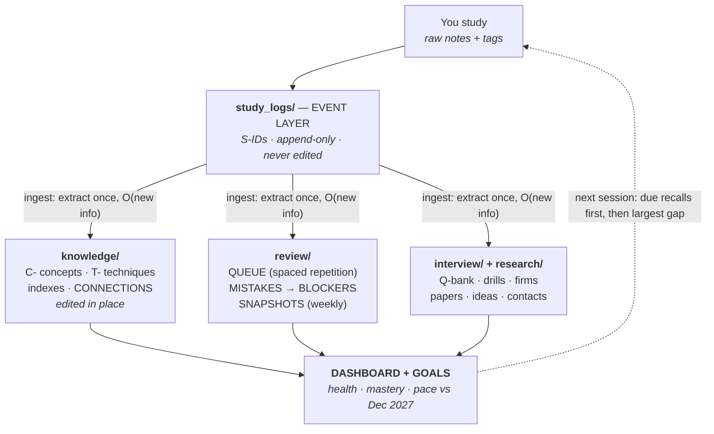

# QUANT_TRACKER

A two-layer knowledge system for quant prep — targeting **Quantitative Research roles, MFE, and Quant PhD admissions, December 2027**.

Not a notes folder. The architecture separates *what happened* (immutable event logs) from *what's true now* (an editable knowledge graph), with control loops for retention, errors, and pace wired between them. Every update costs O(new information) — the system never requires rereading its own history to function.

## Data flow

## Layout

| Path | Role |
|---|---|
| `SYSTEM.md` | **Read first.** Architecture, ID scheme, ingest protocols, worked example |
| `DASHBOARD.md` | 2-minute status: health lights, domain mastery, resume positions |
| `GOALS.md` | Dec 2027 outcomes, back-cast milestones, pace floors (≥10h / ≥5 sessions per week) |
| `ARCHITECTURE_CHANGELOG.md` | Append-only record of every structural change (v2.0 → current) |
| `study_logs/` | Event layer — one append-only log per *source* (Green Book, Leetcode, …) |
| `knowledge/` | Knowledge layer — one file per concept, organized by *domain*; typed edges; `techniques/` for proof techniques; `CONNECTIONS.md` for cross-domain links |
| `review/` | Retention engine — spaced-repetition `QUEUE.md` (single source of review state), `MISTAKES.md` (root causes, auto-escalation at 3 recurrences), `BLOCKERS.md`, weekly `SNAPSHOTS.md` |
| `interview/` | Question bank (Q-IDs), timed `DRILL_RESULTS.md`, `FIRM_PROFILES.md` |
| `research/` | `READING_LOG.md` (P-IDs), `IDEAS.md` (R-IDs), `CONTACTS.md` (dated next actions — letters pillar) |

## Usage

**After studying:** append raw notes (duration, source, tags `[STRUGGLE]` `[INSIGHT]` `[NEEDS_RECALL]` `[INTERVIEW]`) and run Full Ingest per `SYSTEM.md`. Commit: `git commit -m "S-YYYY-MM-DD-n: topic"` and push.

**Starting a session:** DASHBOARD health → due queue recalls (recall *before* opening the file) → new material at the largest mastery-vs-goals gap.

**Cadence:** weekly snapshot · monthly milestone review · quarterly recalibration. Dates live in `GOALS.md` § Review Schedule.

## Invariants

Logs are append-only; mistakes are never deleted; one concept, one file, referenced by ID; counters derived, never stored; review history lives in QUEUE.md only; structural changes go through the changelog; no fabricated data — metrics reflect logged work only.
