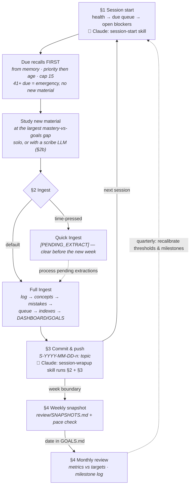

# USAGE.md — Exact Commands & Prompts

> Copy-paste playbook. Two kinds of "commands": **prompts** you give the AI (in a chat with the study_tracker folder selected) and **git commands** you run in Terminal. Nothing else is required.
>
> **Using Claude Code?** The project skills in `.agents/skills/` replace the hand-pasted prompts marked with a 🧩 note below: say "start a session" (→ `session-start`) or "wrap up" (→ `session-wrapup`) and the skill runs the same protocol. The raw prompts stay here on purpose — the scribe workflow (§2b/§2c) and every prompt block work with **any** LLM.

**Sections:** [§0 The cycle](#0-the-study-cycle-at-a-glance) · [§1 Session start](#1-start-a-study-session-new-chat) · [§2 Ingest](#2-ingest-after-studying-the-core-loop) (2b [scribe](#2b-studying-with-a-separate-llm-make-it-your-scribe), 2c [post-recall review](#2c-post-recall-review-with-a-scribe)) · [§3 Commit](#3-commit-after-every-ingest-terminal) · [§4 Periodic reviews](#4-periodic-reviews) · [§5 Other situations](#5-other-situations) · [§6 Honesty rules](#6-rules-that-keep-the-system-honest)

## 0. The study cycle at a glance

How the pieces below chain together across a study cycle. (The *data-flow* view — which files feed which — is the diagram in `README.md`; this is the *usage* view: what you do, in order.)



## 1. Start a study session (new chat)

*🧩 Claude Code: the `session-start` skill does this — just say "start a session". Any other AI: paste the prompt.*

Select the study_tracker folder, then paste:

```
Read SYSTEM.md, GOALS.md, then DASHBOARD.md, due rows in review/QUEUE.md, and open
BLOCKERS. Run the session start protocol: give me my due recalls (priority
then age, cap 15), then a study recommendation.
```

Do the recalls *from memory* before opening any concept file. Report results in the same chat:

```
Recall results: {item} pass, {item} fail (what went wrong), ...
```

The AI updates QUEUE rows and last-review lines.

## 2. Ingest after studying (the core loop)

In the same chat (or a new one — include the session-start prompt first if new), paste raw notes:

```
Ingest this session.
Duration: {min} | Effort: {1–5} | Source: {book/site + chapter/problem ref}
{raw notes, verbatim — keep your confusion in, tag as you go:}
[STRUGGLE] [INSIGHT] [NEEDS_RECALL] [INTERVIEW]
```

The AI runs Full Ingest per SYSTEM.md (log → concepts/techniques → mistakes → queue → indexes → DASHBOARD/GOALS). It will ask before writing if anything is ambiguous — answer, don't let it guess.

**Short on time?** Say `Quick ingest` instead — notes get logged with `[PENDING_EXTRACT]`. Clear pending extractions within the week:

```
Process all pending extractions from DASHBOARD.
```

*🧩 Claude Code: the `session-wrapup` skill runs the ingest, updates the okf/ live state if anything structural changed, and commits (§3) — say "wrap up the session" with your raw notes.*

### 2b. Studying with a separate LLM? Make it your scribe

*This workflow is deliberately AI-agnostic — it is how any non-Claude LLM (a tutoring chat, a different model) feeds the tracker without losing data in translation.*

If you study alongside a different AI (tutoring, working problems), paste this **at the start** of that session. It makes that AI compile the ingest message for you, so nothing is lost in translation:

```
Read SYSTEM.md, GOALS.md, then DASHBOARD.md, due rows in review/QUEUE.md, and open BLOCKERS. 

You are my study scribe. Alongside helping me study, track this session and
— when I say "generate the ingest message" — produce ONE copy-paste block in
EXACTLY this format:

Ingest this session.
Duration: {min} | Effort: {1–5} | Source: {book/site + chapter/problem ref}
{my notes}

Rules for {my notes}:
1. First person, my words. Reconstruct from what I actually said and did —
   lightly cleaned, never paraphrased into generic summaries. Mistakes, dead
   ends, and confusion MUST stay in: they are the most valuable data.
2. Append these tags inline where they apply:
   [STRUGGLE]     — anything I got wrong, blanked on, or fought with;
                    state specifically what went wrong
   [INSIGHT]      — a trick, intuition, or connection worth keeping
   [NEEDS_RECALL] — anything I failed or said I should re-drill
   [INTERVIEW]    — problems with quant-interview flavor; include the
                    full problem statement
3. Distinguish what I derived from what YOU explained to me. If you taught it
   and I only followed along, write "explained to me, not yet reproduced
   [NEEDS_RECALL]" — do not phrase your work as my understanding.
4. Exact references (chapter, page, problem #) when known. Never invent a
   reference, duration, time, or result — ask me for anything missing.
5. Before outputting, ask me three things: duration, effort (1–5), and any
   struggle I haven't mentioned. One ingest block per source; two sources =
   two blocks.
```

Then paste the generated block into a tracker chat (with the study_tracker folder selected) — it goes through the normal Full Ingest.

**Studying a textbook?** Send the relevant block below as your next message immediately after the scribe prompt.

*Linear Algebra — Linear Algebra Done Right, 4th ed. (Sheldon Axler, 2024):*

```
We are studying Linear Algebra Done Right, 4th edition by Sheldon Axler today — specifically [Chapter / Section X: Title].
Source log: LOG_LinAlg
Domain: LINALG

Session structure:
- 5 min orient: locating where this section sits and what theorem it heads toward
- 30 min active read: copying definitions + plain-English gloss + one example and one non-example per definition; reading each theorem statement until clear; skimming proofs for strategy only (induction? contradiction? construction?) — not mastering proofs
- 15 min problem attempts: 1–2 easiest exercises; getting stuck is fine and expected
- 10 min closed-book wrap-up: summary from memory + explicit list of what confused me

Track throughout: every definition I copy (and my gloss), examples and non-examples I produce, each theorem statement and its proof strategy, problems I attempt (including dead ends and stucks), and everything I flag as confusing at wrap-up. Do not paraphrase my confusion away — confusion at wrap-up is ingest data.
```

*Stochastics — Introduction to Stochastic Processes, 2nd ed. (Gregory F. Lawler):*

```
We are studying Introduction to Stochastic Processes, 2nd edition by Gregory F. Lawler today — specifically [Chapter / Section X: Title].
Source log: LOG_Stochastics
Domain: STOCH

Session structure:
- 5 min orient: locating where this section sits and what theorem it heads toward
- 30 min active read: copying definitions + plain-English gloss + one example and one non-example per definition; reading each theorem statement until clear; skimming proofs for strategy only (induction? contradiction? construction?) — not mastering proofs
- 15 min problem attempts: 1–2 easiest exercises; getting stuck is fine and expected
- 10 min closed-book wrap-up: summary from memory + explicit list of what confused me

Track throughout: every definition I copy (and my gloss), examples and non-examples I produce, each theorem statement and its proof strategy, problems I attempt (including dead ends and stucks), and everything I flag as confusing at wrap-up. Do not paraphrase my confusion away — confusion at wrap-up is ingest data.
```

**Active recall with a scribe?** After answering all due recall items, send this to trigger the summary:

```
Generate the recall results summary now. For each item we covered, produce ONE copy-paste block in exactly this format:

Recall results: [date]
- {item name} ({ID}): PASS / FAIL — {what went wrong, or "clean"}
[repeat for each item]
New mistakes: {describe any root-cause mistakes surfaced, or "none"}
New insights: {any [INSIGHT]-worthy connections, or "none"}

Rules:
1. FAIL if I blanked, got it partially, needed prompting, or gave an incomplete proof.
   PASS only if cold and complete. Do not soften fails — the queue scheduler depends on honest results.
2. List mistakes and insights separately at the end, not inline, so the tracker can decide
   whether an ingest is warranted.
3. Never invent a result. If you're unsure how I answered, ask me before outputting.
```

Paste the output into the tracker chat — the tracker updates QUEUE rows and last-review lines, and flags if any mistake warrants a targeted ingest.

**Why rule 3 exists:** the tracker's mastery scores and queue admissions are built from what *you* can do. An LLM's clean explanation pasted as your own notes would inflate mastery and corrupt the review system at its source.

### 2c. Post-recall review with a scribe

After a heavy recall session (many fails), open a scribe chat to work through each failure in depth. This is for understanding and reinforcement — the tracker has already updated the queue; this session does not re-score anything.

Paste this prompt, then paste your recall results block at the bottom:

```
Read SYSTEM.md, GOALS.md, then DASHBOARD.md, due rows in review/QUEUE.md, and open BLOCKERS.

You are my study scribe for a post-recall review. I just finished active recall — results below.
Work through each FAIL with me in order:
1. Ask me to attempt the item again from scratch (cold, no hints).
2. If I reproduce it correctly: mark it as "reproduced cold on re-attempt" — this is mastery movement.
3. If I fail again: show me the correct derivation or answer step by step, then ask me to reproduce only the specific step that broke down.
4. Flag any new mistake or insight that surfaces. Distinguish what I reproduced from what you explained.
5. Say "ready for next?" and wait for my signal before moving on.

The queue has already been updated by the tracker — do NOT re-score or adjust any queue rows.

When I say "generate the review ingest":
- If anything new emerged (new insight, new mistake root cause, or a cold re-attempt that shows real movement), produce ONE copy-paste block:

  Ingest this session.
  Duration: {min} | Effort: {1–5} | Source: review
  {what I demonstrated or learned — [STRUGGLE] for new mistakes, [INSIGHT] for connections, note cold re-attempts explicitly}

- If nothing new emerged, say "review complete — no new ingest needed."

Recall results:
{paste the recall results block from the tracker here}
```

Paste any resulting ingest block into the tracker chat for a standard full ingest.

## 3. Commit after every ingest (Terminal)

```bash
cd ~/Downloads/study_tracker
git add -A && git commit -m "S-YYYY-MM-DD-n: {topic}" && git push
```

Architecture changes use `arch: {what}` as the message — and are recorded in `okf/` (a `changes/s-NNN.md` + `log.md` line; see `.agents/skills/edit-okf/SKILL.md`). Never force-push.

## 4. Periodic reviews

**Weekly** (end of study week):

```
Run the weekly review: append a snapshot to review/SNAPSHOTS.md, update the
DASHBOARD pointer and pace metrics, flag queue backlog trend, confirm pending
extractions are zero.
```

**Monthly** (due date in GOALS.md § Review Schedule):

```
Run the monthly review per SYSTEM.md: GOALS checklist + Progress Metrics vs
targets, DRILL_RESULTS trends, overdue contacts (next action date < today),
append a Milestone Review Log entry, set the next review date.
```

**Quarterly:** same prompt with "quarterly" — adds threshold/milestone recalibration and a CONNECTIONS.md pattern review.

Commit reviews too: `git commit -m "arch: monthly review YYYY-MM"`.

## 5. Other situations

| Situation | Prompt |
|---|---|
| Timed drill block done | `Log this drill block in DRILL_RESULTS: {type, Q-IDs, scores, times}` |
| Read a paper | `Ingest paper: {title, authors, takeaways, depth}` → P-ID |
| Research idea struck | `Log research idea: {one line, origin}` → R-ID |
| Met/emailed a contact | `Update CONTACTS: {name, what happened, next action + date}` |
| Queue feels overloaded | `Check overflow thresholds and tell me which mode we're in` |
| Changing the system itself | `Propose this as an architecture change` → okf/ decision + change record first (🧩 Claude: `edit-okf` skill) |

## 6. Rules that keep the system honest

- Recalls before new material, every session. 41+ due = emergency: no new material.
- Never edit `study_logs/` history or delete mistakes — status changes only.
- Mastery scores honest (5 = prove cold). A fail is data.
- If the AI ever writes review history anywhere but QUEUE.md, or stores a counter, stop it — single-source rules are the integrity guarantee.
- A review that isn't logged didn't happen. A session that isn't committed isn't safe.
