# Linear Algebra Done Right

fourth edition
13 December 2025
© 2024 Sheldon Axler

## Sheldon Axler

Comments, corrections, and suggestions about this book are most welcome.

Please send them to linear@axler.net.

The print version of this book is published by Springer.

Open Access This book is licensed under the terms of the Creative Commons Attribution-NonCommercial 4.0 International License (https://creativecommons.org/licenses/by-nc/4.0), which permits any noncommercial use, sharing, adaptation, distribution and reproduction in any medium or format, as long as you give appropriate credit to original author and source, provide a link to the Creative Commons license, and indicate if changes were made.

The images or other third party material in this book are included in the book's Creative Commons license, unless indicated otherwise in a credit line to the material. If material is not included in the book's Creative Commons license and your intended use is not permitted by statutory regulation or exceeds the permitted use, you will need to obtain permission directly from the

permitted by statutory regulation or exceeds the permitted use, you will need to obtain permission directly from the copyright holder.

$$F_n = \frac{1}{\sqrt{5}} \left[ \left( \frac{1+\sqrt{5}}{2} \right)^n - \left( \frac{1-\sqrt{5}}{2} \right)^n \right]$$

# <span id="page-1-1"></span><span id="page-1-0"></span>*About the Author*

Sheldon Axler received his undergraduate degree from Princeton University, followed by a PhD in mathematics from the University of California at Berkeley.

As a postdoctoral Moore Instructor at MIT, Axler received a university-wide teaching award. He was then an assistant professor, associate professor, and professor at Michigan State University, where he received the first J. Sutherland Frame Teaching Award and the Distinguished Faculty Award.

Axler received the Lester R. Ford Award for expository writing from the Mathematical Association of America in 1996, for a paper that eventually expanded into this book. In addition to publishing numerous research papers, he is the author of six mathematics textbooks, ranging from freshman to graduate level. Previous editions of this book have been adopted as a textbook at over 375 universities and colleges and have been translated into three languages.

Axler has served as Editor-in-Chief of the *Mathematical Intelligencer* and Associate Editor of the *American Mathematical Monthly*. He has been a member of the Council of the American Mathematical Society and of the Board of Trustees of the Mathematical Sciences Research Institute. He has also served on the editorial board of Springer's series Undergraduate Texts in Mathematics, Graduate Texts in Mathematics, Universitext, and Springer Monographs in Mathematics.

Axler is a Fellow of the American Mathematical Society and has been a recipient of numerous grants from the National Science Foundation.

Axler joined San Francisco State University as chair of the Mathematics Department in 1997. He served as dean of the College of Science & Engineering from 2002 to 2015, when he returned to a regular faculty appointment as a professor in the Mathematics Department.


*The author and his cat Moon.*

*Cover equation*: Formula for the th Fibonacci number. Exercise [21](#page-187-0) in Section [5D](#page-176-0) uses linear algebra to derive this formula.

# *Contents*

| About the Author<br>v<br>Preface for Students<br>xii<br>Preface for Instructors<br>xiii<br>Acknowledgments<br>xvii                |  |                                                                                                                                             |
|-----------------------------------------------------------------------------------------------------------------------------------|--|---------------------------------------------------------------------------------------------------------------------------------------------|
|                                                                                                                                   |  | Chapter 1<br>Vector Spaces<br>1                                                                                                             |
|                                                                                                                                   |  | 𝑛<br>𝑛<br>1A<br>and<br>2<br>𝐑<br>𝐂<br>Complex Numbers<br>2<br>Lists<br>5<br>𝑛<br>6<br>𝐅<br>Digression on Fields<br>10<br>Exercises 1A<br>10 |
|                                                                                                                                   |  | 1B<br>Definition of Vector Space<br>12<br>Exercises 1B<br>16                                                                                |
| 1C<br>Subspaces<br>18<br>Sums of Subspaces<br>19<br>Direct Sums<br>21<br>Exercises 1C<br>24                                       |  |                                                                                                                                             |
| Chapter 2<br>Finite-Dimensional Vector Spaces<br>27                                                                               |  |                                                                                                                                             |
| 2A<br>Span and Linear Independence<br>28<br>Linear Combinations and Span<br>28<br>Linear Independence<br>31<br>Exercises 2A<br>37 |  |                                                                                                                                             |

| 2B                       | Bases<br>39                                                                                                                                                                                                                       |
|--------------------------|-----------------------------------------------------------------------------------------------------------------------------------------------------------------------------------------------------------------------------------|
|                          | Exercises 2B<br>42                                                                                                                                                                                                                |
| 2C                       | Dimension<br>44<br>Exercises 2C<br>48                                                                                                                                                                                             |
| Chapter 3<br>Linear Maps | 51                                                                                                                                                                                                                                |
| 3A                       | Vector Space of Linear Maps<br>52<br>Definition and Examples of Linear Maps<br>52<br>Algebraic Operations on<br>ℒ(𝑉,<br>55<br>𝑊)<br>Exercises 3A<br>57                                                                            |
| 3B                       | Null Spaces and Ranges<br>59<br>Null Space and Injectivity<br>59<br>Range and Surjectivity<br>61<br>Fundamental Theorem of Linear Maps<br>62<br>Exercises 3B<br>66                                                                |
| 3C                       | Matrices<br>69<br>Representing a Linear Map by a Matrix<br>69<br>Addition and Scalar Multiplication of Matrices<br>71<br>Matrix Multiplication<br>72<br>Column–Row Factorization and Rank of a Matrix<br>77<br>Exercises 3C<br>79 |
| 3D                       | Invertibility and Isomorphisms<br>82<br>Invertible Linear Maps<br>82<br>Isomorphic Vector Spaces<br>86<br>Linear Maps Thought of as Matrix Multiplication<br>88<br>Change of Basis<br>90<br>Exercises 3D<br>93                    |
| 3E                       | Products and Quotients of Vector Spaces<br>96<br>Products of Vector Spaces<br>96<br>Quotient Spaces<br>98<br>Exercises 3E<br>103                                                                                                  |
| 3F                       | Duality<br>105<br>Dual Space and Dual Map<br>105<br>Null Space and Range of Dual of Linear Map<br>109                                                                                                                             |

| viii        | Contents                                                                                                                                                                                                                      |
|-------------|-------------------------------------------------------------------------------------------------------------------------------------------------------------------------------------------------------------------------------|
|             | Matrix of Dual of Linear Map<br>113<br>Exercises 3F<br>115                                                                                                                                                                    |
| Chapter 4   |                                                                                                                                                                                                                               |
| Polynomials | 119                                                                                                                                                                                                                           |
|             | Zeros of Polynomials<br>122<br>Division Algorithm for Polynomials<br>123<br>Factorization of Polynomials over<br>124<br>𝐂<br>Factorization of Polynomials over<br>127<br>𝐑<br>Exercises 4<br>129                              |
| Chapter 5   | Eigenvalues and Eigenvectors<br>132                                                                                                                                                                                           |
| 5A          | Invariant Subspaces<br>133<br>Eigenvalues<br>133<br>Polynomials Applied to Operators<br>137<br>Exercises 5A<br>139                                                                                                            |
| 5B          | The Minimal Polynomial<br>143<br>Existence of Eigenvalues on Complex Vector Spaces<br>143<br>Eigenvalues and the Minimal Polynomial<br>144<br>Eigenvalues on Odd-Dimensional Real Vector Spaces<br>149<br>Exercises 5B<br>150 |
| 5C          | Upper-Triangular Matrices<br>154<br>Exercises 5C<br>160                                                                                                                                                                       |
| 5D          | Diagonalizable Operators<br>163<br>Diagonal Matrices<br>163<br>Conditions for Diagonalizability<br>165<br>Gershgorin Disk Theorem<br>170<br>Exercises 5D<br>172                                                               |
| 5E          | Commuting Operators<br>175<br>Exercises 5E<br>179                                                                                                                                                                             |
| Chapter 6   | Inner Product Spaces<br>181                                                                                                                                                                                                   |
| 6A          | Inner Products and Norms<br>182                                                                                                                                                                                               |

[Inner Products](#page-195-1) 182

|           | Norms<br>186                                                   |
|-----------|----------------------------------------------------------------|
|           | Exercises 6A<br>191                                            |
| 6B        | Orthonormal Bases<br>197                                       |
|           | Orthonormal Lists and the Gram–Schmidt Procedure<br>197        |
|           | Linear Functionals on Inner Product Spaces<br>204              |
|           | Exercises 6B<br>207                                            |
| 6C        | Orthogonal Complements and Minimization Problems<br>211        |
|           | Orthogonal Complements<br>211                                  |
|           | Minimization Problems<br>217                                   |
|           | Pseudoinverse<br>220                                           |
|           | Exercises 6C<br>224                                            |
| Chapter 7 |                                                                |
|           | Operators on Inner Product Spaces<br>227                       |
| 7A        | Self-Adjoint and Normal Operators<br>228                       |
|           | Adjoints<br>228                                                |
|           | Self-Adjoint Operators<br>233                                  |
|           | Normal Operators<br>235                                        |
|           | Exercises 7A<br>239                                            |
| 7B        | Spectral Theorem<br>243                                        |
|           | Real Spectral Theorem<br>243                                   |
|           | Complex Spectral Theorem<br>246                                |
|           | Exercises 7B<br>247                                            |
| 7C        | Positive Operators<br>251                                      |
|           | Exercises 7C<br>255                                            |
| 7D        | Isometries, Unitary Operators, and Matrix Factorization<br>258 |
|           | Isometries<br>258                                              |
|           | Unitary Operators<br>260                                       |
|           | QR Factorization<br>263                                        |
|           | Cholesky Factorization<br>266                                  |
|           | Exercises 7D<br>268                                            |
| 7E        | Singular Value Decomposition<br>270                            |
|           | Singular Values<br>270                                         |
|           | SVD for Linear Maps and for Matrices<br>273                    |
|           | Exercises 7E<br>278                                            |

| Contents |
|----------|
|          |

| 7F           | Consequences of Singular Value Decomposition<br>280                                                                                                                                            |
|--------------|------------------------------------------------------------------------------------------------------------------------------------------------------------------------------------------------|
|              | Norms of Linear Maps<br>280                                                                                                                                                                    |
|              | Approximation by Linear Maps with Lower-Dimensional Range<br>283<br>Polar Decomposition<br>285                                                                                                 |
|              | Operators Applied to Ellipsoids and Parallelepipeds<br>287<br>Volume via Singular Values<br>291                                                                                                |
|              | Properties of an Operator as Determined by Its Eigenvalues<br>293<br>Exercises 7F<br>294                                                                                                       |
| Chapter 8    | Operators on Complex Vector Spaces<br>297                                                                                                                                                      |
| 8A           | Generalized Eigenvectors and Nilpotent Operators<br>298<br>Null Spaces of Powers of an Operator<br>298<br>Generalized Eigenvectors<br>300<br>Nilpotent Operators<br>303<br>Exercises 8A<br>306 |
| 8B           | Generalized Eigenspace Decomposition<br>308<br>Generalized Eigenspaces<br>308<br>Multiplicity of an Eigenvalue<br>310<br>Block Diagonal Matrices<br>314<br>Exercises 8B<br>316                 |
| 8C           | Consequences of Generalized Eigenspace Decomposition<br>319<br>Square Roots of Operators<br>319<br>Jordan Form<br>321<br>Exercises 8C<br>324                                                   |
| 8D<br>Trace: | A Connection Between Matrices and Operators<br>326<br>Exercises 8D<br>330                                                                                                                      |
| Chapter 9    | Multilinear Algebra and Determinants<br>332                                                                                                                                                    |
| 9A           | Bilinear Forms and Quadratic Forms<br>333<br>Bilinear Forms<br>333<br>Symmetric Bilinear Forms<br>337<br>Quadratic Forms<br>341<br>Exercises 9A<br>344                                         |

| 9B | Alternating Multilinear Forms |  |  | 346 |
|----|-------------------------------|--|--|-----|
|    |                               |  |  |     |

[Multilinear Forms](#page-359-1) 346

[Alternating Multilinear Forms and Permutations](#page-361-0) 348

[Exercises 9B](#page-365-0) 352

9C [Determinants](#page-367-0) 354

[Defining the Determinant](#page-367-1) 354

[Properties of Determinants](#page-370-0) 357

[Exercises 9C](#page-380-0) 367

9D [Tensor Products](#page-383-0) 370

[Tensor Product of Two Vector Spaces](#page-383-1) 370

[Tensor Product of Inner Product Spaces](#page-389-0) 376

[Tensor Product of Multiple Vector Spaces](#page-391-0) 378

[Exercises 9D](#page-393-0) 380

*[Photo Credits](#page-396-0)* **383**

*[Symbol Index](#page-397-0)* **384**

*[Index](#page-398-0)* **385**

*[Colophon: Notes on Typesetting](#page-403-0)* **390**

# <span id="page-8-0"></span>*Preface for Students*

You are probably about to begin your second exposure to linear algebra. Unlike your first brush with the subject, which probably emphasized Euclidean spaces and matrices, this encounter will focus on abstract vector spaces and linear maps. These terms will be defined later, so don't worry if you do not know what they mean. This book starts from the beginning of the subject, assuming no knowledge of linear algebra. The key point is that you are about to immerse yourself in serious mathematics, with an emphasis on attaining a deep understanding of the definitions, theorems, and proofs.

You cannot read mathematics the way you read a novel. If you zip through a page in less than an hour, you are probably going too fast. When you encounter the phrase "as you should verify", you should indeed do the verification, which will usually require some writing on your part. When steps are left out, you need to supply the missing pieces. You should ponder and internalize each definition. For each theorem, you should seek examples to show why each hypothesis is necessary. Discussions with other students should help.

As a visual aid, definitions are in yellow boxes and theorems are in blue boxes (in color versions of the book). Each theorem has an informal descriptive name.

Please check the website below for additional information about the book, including a link to videos that are freely available to accompany the book.

Your suggestions, comments, and corrections are most welcome. Best wishes for success and enjoyment in learning linear algebra!

Sheldon Axler

San Francisco State University

website: <https://linear.axler.net> e-mail: linear@axler.net

# <span id="page-9-0"></span>*Preface for Instructors*

You are about to teach a course that will probably give students their second exposure to linear algebra. During their first brush with the subject, your students probably worked with Euclidean spaces and matrices. In contrast, this course will emphasize abstract vector spaces and linear maps.

The title of this book deserves an explanation. Most linear algebra textbooks use determinants to prove that every linear operator on a finite-dimensional complex vector space has an eigenvalue. Determinants are difficult, nonintuitive, and often defined without motivation. To prove the theorem about existence of eigenvalues on complex vector spaces, most books must define determinants, prove that a linear operator is not invertible if and only if its determinant equals 0, and then define the characteristic polynomial. This tortuous (torturous?) path gives students little feeling for why eigenvalues exist.

In contrast, the simple determinant-free proofs presented here (for example, see [5.19\)](#page-156-2) offer more insight. Once determinants have been moved to the end of the book, a new route opens to the main goal of linear algebra—understanding the structure of linear operators.

This book starts at the beginning of the subject, with no prerequisites other than the usual demand for suitable mathematical maturity. A few examples and exercises involve calculus concepts such as continuity, differentiation, and integration. You can easily skip those examples and exercises if your students have not had calculus. If your students have had calculus, then those examples and exercises can enrich their experience by showing connections between different parts of mathematics.

Even if your students have already seen some of the material in the first few chapters, they may be unaccustomed to working exercises of the type presented here, most of which require an understanding of proofs.

Here is a chapter-by-chapter summary of the highlights of the book:

- Chapter [1:](#page-14-0) Vector spaces are defined in this chapter, and their basic properties are developed.
- Chapter [2:](#page-40-0) Linear independence, span, basis, and dimension are defined in this chapter, which presents the basic theory of finite-dimensional vector spaces.
- Chapter [3:](#page-64-0) This chapter introduces linear maps. The key result here is the fundamental theorem of linear maps: if is a linear map on , then dim = dim null + dim range . Quotient spaces and duality are topics in this chapter at a higher level of abstraction than most of the book; these topics can be skipped (except that duality is needed for tensor products in Section [9D\)](#page-383-0).

- Chapter [4:](#page-132-0) The part of the theory of polynomials that will be needed to understand linear operators is presented in this chapter. This chapter contains no linear algebra. It can be covered quickly, especially if your students are already familiar with these results.
- Chapter [5:](#page-145-0) The idea of studying a linear operator by restricting it to small subspaces leads to eigenvectors in the early part of this chapter. The highlight of this chapter is a simple proof that on complex vector spaces, eigenvalues always exist. This result is then used to show that each linear operator on a complex vector space has an upper-triangular matrix with respect to some basis. The minimal polynomial plays an important role here and later in the book. For example, this chapter gives a characterization of the diagonalizable operators in terms of the minimal polynomial. Section [5E](#page-188-0) can be skipped if you want to save some time.
- Chapter [6:](#page-194-0) Inner product spaces are defined in this chapter, and their basic properties are developed along with tools such as orthonormal bases and the Gram–Schmidt procedure. This chapter also shows how orthogonal projections can be used to solve certain minimization problems. The pseudoinverse is then introduced as a useful tool when the inverse does not exist. The material on the pseudoinverse can be skipped if you want to save some time.
- Chapter [7:](#page-240-0) The spectral theorem, which characterizes the linear operators for which there exists an orthonormal basis consisting of eigenvectors, is one of the highlights of this book. The work in earlier chapters pays off here with especially simple proofs. This chapter also deals with positive operators, isometries, unitary operators, matrix factorizations, and especially the singular value decomposition, which leads to the polar decomposition and norms of linear maps.
- Chapter [8:](#page-310-0) This chapter shows that for each operator on a complex vector space, there is a basis of the vector space consisting of generalized eigenvectors of the operator. Then the generalized eigenspace decomposition describes a linear operator on a complex vector space. The multiplicity of an eigenvalue is defined as the dimension of the corresponding generalized eigenspace. These tools are used to prove that every invertible linear operator on a complex vector space has a square root. Then the chapter gives a proof that every linear operator on a complex vector space can be put into Jordan form. The chapter concludes with an investigation of the trace of operators.
- Chapter [9:](#page-345-0) This chapter begins by looking at bilinear forms and showing that the vector space of bilinear forms is the direct sum of the subspaces of symmetric bilinear forms and alternating bilinear forms. Then quadratic forms are diagonalized. Moving to multilinear forms, the chapter shows that the subspace of alternating -linear forms on an -dimensional vector space has dimension one. This result leads to a clean basis-free definition of the determinant of an operator. For complex vector spaces, the determinant turns out to equal the product of the eigenvalues, with each eigenvalue included in the product as many times as its multiplicity. The chapter concludes with an introduction to tensor products.

This book usually develops linear algebra simultaneously for real and complex vector spaces by letting denote either the real or the complex numbers. If you and your students prefer to think of as an arbitrary field, then see the comments at the end of Section [1A.](#page-23-0) I prefer avoiding arbitrary fields at this level because they introduce extra abstraction without leading to any new linear algebra. Also, students are more comfortable thinking of polynomials as functions instead of the more formal objects needed for polynomials with coefficients in finite fields. Finally, even if the beginning part of the theory were developed with arbitrary fields, inner product spaces would push consideration back to just real and complex vector spaces.

You probably cannot cover everything in this book in one semester. Going through all the material in the first seven or eight chapters during a one-semester course may require a rapid pace. If you must reach Chapter [9,](#page-345-0) then consider skipping the material on quotient spaces in Section [3E,](#page-109-0) skipping Section [3F](#page-118-0) on duality (unless you intend to cover tensor products in Section [9D\)](#page-383-0), covering Chapter [4](#page-132-0) on polynomials in a half hour, skipping Section [5E](#page-188-0) on commuting operators, and skipping the subsection in Section [6C](#page-224-0) on the pseudoinverse.

A goal more important than teaching any particular theorem is to develop in students the ability to understand and manipulate the objects of linear algebra. Mathematics can be learned only by doing. Fortunately, linear algebra has many good homework exercises. When teaching this course, during each class I usually assign as homework several of the exercises, due the next class. Going over the homework might take up significant time in a typical class.

Some of the exercises are intended to lead curious students into important topics beyond what might usually be included in a basic second course in linear algebra.

## **The author's top ten**

Listed below are the author's ten favorite results in the book, in order of their appearance in the book. Students who leave your course with a good understanding of these crucial results will have an excellent foundation in linear algebra.

- any two bases of a vector space have the same length [\(2.34\)](#page-57-1)
- fundamental theorem of linear maps [\(3.21\)](#page-75-1)
- existence of eigenvalues if = [\(5.19\)](#page-156-2)
- upper-triangular form always exists if = [\(5.47\)](#page-173-1)
- Cauchy–Schwarz inequality [\(6.14\)](#page-202-0)
- Gram–Schmidt procedure [\(6.32\)](#page-214-0)
- spectral theorem [\(7.29](#page-258-0) and [7.31\)](#page-259-1)
- singular value decomposition [\(7.70\)](#page-286-1)
- generalized eigenspace decomposition theorem when = [\(8.22\)](#page-322-0)
- dimension of alternating -linear forms on is 1 if dim = [\(9.37\)](#page-364-0)

## **Major improvements and additions for the fourth edition**

- Over 250 new exercises and over 70 new examples.
- Increasing use of the minimal polynomial to provide cleaner proofs of multiple results, including necessary and sufficient conditions for an operator to have an upper-triangular matrix with respect to some basis (see Section [5C\)](#page-167-0), necessary and sufficient conditions for diagonalizability (see Section [5D\)](#page-176-0), and the real spectral theorem (see Section [7B\)](#page-256-0).
- New section on commuting operators (see Section [5E\)](#page-188-0).
- New subsection on pseudoinverse (see Section [6C\)](#page-224-0).
- New subsections on QR factorization/Cholesky factorization (see Section [7D\)](#page-271-0).
- Singular value decomposition now done for linear maps from an inner product space to another (possibly different) inner product space, rather than only dealing with linear operators from an inner product space to itself (see Section [7E\)](#page-283-0).
- Polar decomposition now proved from singular value decomposition, rather than in the opposite order; this has led to cleaner proofs of both the singular value decomposition (see Section [7E\)](#page-283-0) and the polar decomposition (see Section [7F\)](#page-293-0).
- New subsection on norms of linear maps on finite-dimensional inner product spaces, using the singular value decomposition to avoid even mentioning supremum in the definition of the norm of a linear map (see Section [7F\)](#page-293-0).
- New subsection on approximation by linear maps with lower-dimensional range (see Section [7F\)](#page-293-0).
- New elementary proof of the important result that if is an operator on a finitedimensional complex vector space , then there exists a basis of consisting of generalized eigenvectors of (see [8.9\)](#page-314-0).
- New Chapter [9](#page-345-0) on multilinear algebra, including bilinear forms, quadratic forms, multilinear forms, and tensor products. Determinants now are defined using a basis-free approach via alternating multilinear forms.
- New formatting to improve the student-friendly appearance of the book. For example, the definition and result boxes now have rounded corners instead of right-angle corners, for a gentler look. The main font size has been reduced from 11 point to 10.5 point.

Please check the website below for additional links and information about the book. Your suggestions, comments, and corrections are most welcome.

Best wishes for teaching a successful linear algebra class!

Sheldon Axler San Francisco State University

website: <https://linear.axler.net> e-mail: linear@axler.net

*Contact the author, or Springer if the author is not available, for permission for translations or other commercial reuse of the contents of this book.*

# <span id="page-13-1"></span><span id="page-13-0"></span>*Acknowledgments*

I owe a huge intellectual debt to all the mathematicians who created linear algebra over the past two centuries. The results in this book belong to the common heritage of mathematics. A special case of a theorem may first have been proved long ago, then sharpened and improved by many mathematicians in different time periods. Bestowing proper credit on all contributors would be a difficult task that I have not undertaken. In no case should the reader assume that any result presented here represents my original contribution.

Many people helped make this a better book. The three previous editions of this book were used as a textbook at over 375 universities and colleges around the world. I received thousands of suggestions and comments from faculty and students who used the book. Many of those suggestions led to improvements in this edition. The manuscript for this fourth edition was class tested at 30 universities. I am extremely grateful for the useful feedback that I received from faculty and students during this class testing.

The long list of people who should be thanked for their suggestions would fill up many pages. Lists are boring to read. Thus to represent all contributors to this edition, I will mention only Noel Hinton, a graduate student at Australian National University, who sent me more suggestions and corrections for this fourth edition than anyone else. To everyone who contributed suggestions, let me say how truly grateful I am to all of you. Many many thanks!

I thank Springer for providing me with help when I needed it and for allowing me the freedom to make the final decisions about the content and appearance of this book. Special thanks to the two terrific mathematics editors at Springer who worked with me on this project—Loretta Bartolini during the first half of my work on the fourth edition, and Elizabeth Loew during the second half of my work on the fourth edition. I am deeply indebted to David Kramer, who did a magnificent job of copyediting and prevented me from making many mistakes.

Extra special thanks to my fantastic partner Carrie Heeter. Her understanding and encouragement enabled me to work intensely on this new edition. Our wonderful cat Moon, whose picture appears on the *About the Author* page, provided sweet breaks throughout the writing process. Moon died suddenly due to a blood clot as this book was being finished. We are grateful for five precious years with him.

Sheldon Axler

# <span id="page-14-1"></span>Chapter 1 *Vector Spaces*

<span id="page-14-0"></span>Linear algebra is the study of linear maps on finite-dimensional vector spaces. Eventually we will learn what all these terms mean. In this chapter we will define vector spaces and discuss their elementary properties.

In linear algebra, better theorems and more insight emerge if complex numbers are investigated along with real numbers. Thus we will begin by introducing the complex numbers and their basic properties.

We will generalize the examples of a plane and of ordinary space to and , which we then will generalize to the notion of a vector space. As we will see, a vector space is a set with operations of addition and scalar multiplication that satisfy natural algebraic properties.

Then our next topic will be subspaces, which play a role for vector spaces analogous to the role played by subsets for sets. Finally, we will look at sums of subspaces (analogous to unions of subsets) and direct sums of subspaces (analogous to unions of disjoint sets).


*René Descartes explaining his work to Queen Christina of Sweden. Vector spaces are a generalization of the description of a plane using two coordinates, as published by Descartes in 1637.*

#### <span id="page-15-2"></span><span id="page-15-0"></span>*1A and*

## <span id="page-15-1"></span>*Complex Numbers*

You should already be familiar with basic properties of the set of real numbers. Complex numbers were invented so that we can take square roots of negative numbers. The idea is to assume we have a square root of −1, denoted by , that obeys the usual rules of arithmetic. Here are the formal definitions.

## 1.1 definition: *complex numbers,*

- A *complex number* is an ordered pair (, ), where , ∈ , but we will write this as + .
- The set of all complex numbers is denoted by :

$$\mathbf{C} = \{a + bi : a, b \in \mathbf{R}\}.$$

• *Addition* and *multiplication* on are defined by

$$(a + bi) + (c + di) = (a + c) + (b + d)i,$$
  
 $(a + bi)(c + di) = (ac - bd) + (ad + bc)i;$ 

here , , , ∈ .

If ∈ , we identify + 0 with the real number . Thus we think of as a subset of . We usually write 0 + as just , and we usually write 0 + 1 as just .

To motivate the definition of complex multiplication given above, pretend that we knew that <sup>2</sup> = −1 and then use the

*The symbol was first used to denote* √−1 *by Leonhard Euler in 1777.*

usual rules of arithmetic to derive the formula above for the product of two complex numbers. Then use that formula to verify that we indeed have

$$i^2 = -1$$
.

Do not memorize the formula for the product of two complex numbers—you can always rederive it by recalling that <sup>2</sup> = −1 and then using the usual rules of arithmetic (as given by [1.3\)](#page-16-0). The next example illustrates this procedure.

## 1.2 example: *complex arithmetic*

The product (2 + 3)(4 + 5) can be evaluated by applying the distributive and commutative properties from [1.3:](#page-16-0)

$$(2+3i)(4+5i) = 2 \cdot (4+5i) + (3i)(4+5i)$$

$$= 2 \cdot 4 + 2 \cdot 5i + 3i \cdot 4 + (3i)(5i)$$

$$= 8+10i+12i-15$$

$$= -7+22i.$$

<span id="page-16-1"></span>Our first result states that complex addition and complex multiplication have the familiar properties that we expect.

## 1.3 *properties of complex arithmetic*

## <span id="page-16-0"></span>**commutativity**

$$\alpha + \beta = \beta + \alpha$$
 and  $\alpha\beta = \beta\alpha$  for all  $\alpha, \beta \in \mathbb{C}$ .

## **associativity**

$$(\alpha + \beta) + \lambda = \alpha + (\beta + \lambda)$$
 and  $(\alpha\beta)\lambda = \alpha(\beta\lambda)$  for all  $\alpha, \beta, \lambda \in \mathbb{C}$ .

## **identities**

$$\lambda + 0 = \lambda$$
 and  $\lambda 1 = \lambda$  for all  $\lambda \in \mathbb{C}$ .

## **additive inverse**

For every ∈ , there exists a unique ∈ such that + = 0.

## **multiplicative inverse**

For every ∈ with ≠ 0, there exists a unique ∈ such that = 1.

## **distributive property**

$$\lambda(\alpha + \beta) = \lambda\alpha + \lambda\beta$$
 for all  $\lambda, \alpha, \beta \in \mathbb{C}$ .

The properties above are proved using the familiar properties of real numbers and the definitions of complex addition and multiplication. The next example shows how commutativity of complex multiplication is proved. Proofs of the other properties above are left as exercises.

## 1.4 example: *commutativity of complex multiplication*

To show that = for all , ∈ , suppose

$$\alpha = a + bi$$
 and  $\beta = c + di$ ,

where , , , ∈ . Then the definition of multiplication of complex numbers shows that

$$\alpha\beta = (a+bi)(c+di)$$
$$= (ac-bd) + (ad+bc)i$$

and

$$\beta \alpha = (c + di)(a + bi)$$
$$= (ca - db) + (cb + da)i.$$

The equations above and the commutativity of multiplication and addition of real numbers show that = .

#### <span id="page-17-0"></span>4 Chapter 1 Vector Spaces

Next, we define the additive and multiplicative inverses of complex numbers, and then use those inverses to define subtraction and division operations with complex numbers.

1.5 definition:  $-\alpha$ , subtraction,  $1/\alpha$ , division

Suppose  $\alpha, \beta \in \mathbb{C}$ .

• Let  $-\alpha$  denote the additive inverse of  $\alpha$ . Thus  $-\alpha$  is the unique complex number such that

$$\alpha + (-\alpha) = 0.$$

• Subtraction on C is defined by

$$\beta - \alpha = \beta + (-\alpha).$$

• For  $\alpha \neq 0$ , let  $1/\alpha$  and  $\frac{1}{\alpha}$  denote the multiplicative inverse of  $\alpha$ . Thus  $1/\alpha$  is the unique complex number such that

$$\alpha(1/\alpha) = 1.$$

• For  $\alpha \neq 0$ , division by  $\alpha$  is defined by

$$\beta/\alpha = \beta(1/\alpha)$$
.

So that we can conveniently make definitions and prove theorems that apply to both real and complex numbers, we adopt the following notation.

1.6 notation: F

Throughout this book, F stands for either R or C.

Thus if we prove a theorem involving **F**, we will know that it holds when **F** is replaced with **R** and when **F** is replaced with **C**.

The letter F is used because R and C are examples of what are called **fields**.

Elements of **F** are called *scalars*. The word "scalar" (which is just a fancy word for "number") is often used when we want to emphasize that an object is a number, as opposed to a vector (vectors will be defined soon).

For  $\alpha \in \mathbf{F}$  and m a positive integer, we define  $\alpha^m$  to denote the product of  $\alpha$  with itself m times:

$$\alpha^m = \underbrace{\alpha \cdots \alpha}_{m \text{ times}}.$$

This definition implies that

$$(\alpha^m)^n = \alpha^{mn}$$
 and  $(\alpha\beta)^m = \alpha^m\beta^m$ 

for all  $\alpha, \beta \in \mathbf{F}$  and all positive integers m, n.

## <span id="page-18-1"></span><span id="page-18-0"></span>*Lists*

Before defining and , we look at two important examples.

#### 1.7 example: <sup>2</sup> *and* 3

• The set 2 , which you can think of as a plane, is the set of all ordered pairs of real numbers:

$$\mathbf{R}^2 = \{ (x, y) : x, y \in \mathbf{R} \}.$$

• The set 3 , which you can think of as ordinary space, is the set of all ordered triples of real numbers:

$$\mathbf{R}^3 = \{ (x, y, z) : x, y, z \in \mathbf{R} \}.$$

To generalize 2 and 3 to higher dimensions, we first need to discuss the concept of lists.

## 1.8 definition: *list, length*

- Suppose is a nonnegative integer. A *list* of *length* is an ordered collection of elements (which might be numbers, other lists, or more abstract objects).
- Two lists are equal if and only if they have the same length and the same elements in the same order.

Lists are often written as elements separated by commas and surrounded by parentheses. Thus a list of length two is

*Many mathematicians call a list of length an -tuple.*

an ordered pair that might be written as (, ). A list of length three is an ordered triple that might be written as (, , ). A list of length might look like this:

$$(z_1,...,z_n).$$

Sometimes we will use the word *list* without specifying its length. Remember, however, that by definition each list has a finite length that is a nonnegative integer. Thus an object that looks like (<sup>1</sup> , <sup>2</sup> , … ), which might be said to have infinite length, is not a list.

A list of length 0 looks like this: ( ). We consider such an object to be a list so that some of our theorems will not have trivial exceptions.

Lists differ from finite sets in two ways: in lists, order matters and repetitions have meaning; in sets, order and repetitions are irrelevant.

## 1.9 example: *lists versus sets*

- The lists (3, 5) and (5, 3) are not equal, but the sets {3, 5} and {5, 3} are equal.
- The lists (4, 4) and (4, 4, 4) are not equal (they do not have the same length), although the sets {4, 4} and {4, 4, 4} both equal the set {4}.

<span id="page-19-2"></span><span id="page-19-0"></span>

To define the higher-dimensional analogues of 2 and 3 , we will simply replace with (which equals or ) and replace the 2 or 3 with an arbitrary positive integer.

## 1.10 notation:

Fix a positive integer for the rest of this chapter.

#### 1.11 definition: *, coordinate*

 is the set of all lists of length of elements of :

$$\mathbf{F}^n = \{(x_1, ..., x_n) : x_k \in \mathbf{F} \text{ for } k = 1, ..., n\}.$$

For (<sup>1</sup> , …, ) ∈ and ∈ {1, …, }, we say that is the th *coordinate* of (<sup>1</sup> , …, ).

If = and equals 2 or 3, then the definition above of agrees with our previous notions of 2 and 3 .

#### 1.12 example: 4

 4 is the set of all lists of four complex numbers:

$$\mathbf{C}^4 = \{ (z_1, z_2, z_3, z_4) : z_1, z_2, z_3, z_4 \in \mathbf{C} \}.$$

If ≥ 4, we cannot visualize as a physical object. Similarly, 1 can be thought of as a plane, but for ≥ 2, the human brain cannot provide a full image of . However, even if is large, we can perform algebraic manipulations in as easily as in <sup>2</sup> or 3 . For example, addition in is defined as follows.

*Read Flatland: A Romance of Many Dimensions, by Edwin A. Abbott, for an amusing account of how* <sup>3</sup> *would be perceived by creatures living in . This novel, published in 1884, may help you imagine a physical space of four or more dimensions.*

#### 1.13 definition: *addition in*

<span id="page-19-1"></span>*Addition* in is defined by adding corresponding coordinates:

$$(x_1,...,x_n)+(y_1,...,y_n)=(x_1+y_1,...,x_n+y_n).$$

Often the mathematics of becomes cleaner if we use a single letter to denote a list of numbers, without explicitly writing the coordinates. For example, the next result is stated with and in even though the proof requires the more cumbersome notation of (<sup>1</sup> , …, ) and (<sup>1</sup> , …, ).

## <span id="page-20-1"></span>1.14 *commutativity of addition in* $\mathbf{F}^n$

If  $x, y \in \mathbf{F}^n$ , then x + y = y + x.

Proof Suppose 
$$x = (x_1, ..., x_n) \in \mathbf{F}^n$$
 and  $y = (y_1, ..., y_n) \in \mathbf{F}^n$ . Then 
$$x + y = (x_1, ..., x_n) + (y_1, ..., y_n)$$
$$= (x_1 + y_1, ..., x_n + y_n)$$
$$= (y_1 + x_1, ..., y_n + x_n)$$
$$= (y_1, ..., y_n) + (x_1, ..., x_n)$$

= y + x

where the second and fourth equalities above hold because of the definition of addition in  $\mathbf{F}^n$  and the third equality holds because of the usual commutativity of addition in  $\mathbf{F}$ .

If a single letter is used to denote an element of  $\mathbf{F}^n$ , then the same letter with appropriate subscripts is often used when

The symbol ■ means "end of proof".

coordinates must be displayed. For example, if  $x \in \mathbf{F}^n$ , then letting x equal  $(x_1, ..., x_n)$  is good notation, as shown in the proof above. Even better, work with just x and avoid explicit coordinates when possible.

#### 1.15 notation: 0

<span id="page-20-0"></span>Let 0 denote the list of length *n* whose coordinates are all 0:

$$0 = (0, \dots, 0)$$
.

Here we are using the symbol 0 in two different ways—on the left side of the equation above, the symbol 0 denotes a list of length n, which is an element of  $\mathbf{F}^n$ , whereas on the right side, each 0 denotes a number. This potentially confusing practice actually causes no problems because the context should always make clear which 0 is intended.

#### 1.16 example: context determines which 0 is intended

Consider the statement that 0 is an additive identity for  $\mathbf{F}^n$ :

$$x + 0 = x$$
 for all  $x \in \mathbf{F}^n$ .

Here the 0 above is the list defined in 1.15, not the number 0, because we have not defined the sum of an element of  $\mathbf{F}^n$  (namely, x) and the number 0.

<span id="page-21-0"></span>A picture can aid our intuition. We will draw pictures in <sup>2</sup> because we can sketch this space on two-dimensional surfaces such as paper and computer screens. A typical element of 2 is a point = (, ). Sometimes we think of not as a point but as an arrow starting at the origin and ending at (, ), as shown here. When we think of an element of 2 as an arrow, we refer to it as a *vector*.

When we think of vectors in 2 as arrows, we can move an arrow parallel to itself (not changing its length or direction) and still think of it as the same vector. With that viewpoint, you will often gain better understanding by dispensing with the coordinate axes and the explicit coordinates and

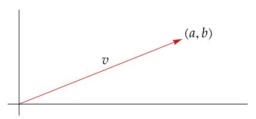

*Elements of* 2 *can be thought of as points or as vectors.*

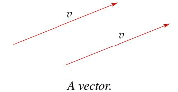

just thinking of the vector, as shown in the figure here. The two arrows shown here have the same length and same direction, so we think of them as the same vector.

Whenever we use pictures in <sup>2</sup> or use the somewhat vague language of points and vectors, remember that these are just aids to our understanding, not substitutes for the actual mathematics that we will develop. Although we cannot draw good pictures in high-dimensional spaces, the elements of these spaces are as rigorously defined as elements of 2 .

*Mathematical models of the economy can have thousands of variables, say* 1 , …, 5000*, which means that we must work in* <sup>5000</sup>*. Such a space cannot be dealt with geometrically. However, the algebraic approach works well. Thus our subject is called linear algebra.*

For example, (2, −3, 17, , √2) is an element of 5 , and we may casually refer to it as a point in <sup>5</sup> or a vector in <sup>5</sup> without worrying about whether the geometry of <sup>5</sup> has any physical meaning.

Recall that we defined the sum of two elements of to be the element of obtained by adding corresponding coordinates; see [1.13.](#page-19-1) As we will now see, addition has a simple geometric interpretation in the special case of 2 .

Suppose we have two vectors and in 2 that we want to add. Move the vector parallel to itself so that its initial point coincides with the end point of the vector , as shown here. The sum + then equals the vector whose initial point equals the initial point of and whose end point equals the end point of the vector , as shown here.

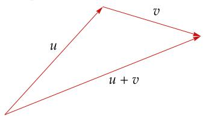

*The sum of two vectors.*

In the next definition, the 0 on the right side of the displayed equation is the list 0 ∈ .

#### <span id="page-22-0"></span>1.17 definition: *additive inverse in ,* −

For ∈ , the *additive inverse* of , denoted by −, is the vector − ∈ such that

$$x + (-x) = 0.$$

Thus if 
$$x = (x_1, ..., x_n)$$
, then  $-x = (-x_1, ..., -x_n)$ .

The additive inverse of a vector in 2 is the vector with the same length but pointing in the opposite direction. The figure here illustrates this way of thinking about the additive inverse in 2 . As you can see, the vector labeled − has the same length as the vector labeled but points in the opposite direction.

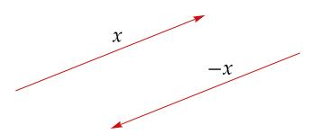

*A vector and its additive inverse.*

Having dealt with addition in , we now turn to multiplication. We could define a multiplication in in a similar fashion, starting with two elements of and getting another element of by multiplying corresponding coordinates. Experience shows that this definition is not useful for our purposes. Another type of multiplication, called scalar multiplication, will be central to our subject. Specifically, we need to define what it means to multiply an element of by an element of .

#### 1.18 definition: *scalar multiplication in*

The *product* of a number and a vector in is computed by multiplying each coordinate of the vector by :

$$\lambda(x_1, ..., x_n) = (\lambda x_1, ..., \lambda x_n);$$

here ∈ and (<sup>1</sup> , …, ) ∈ .

Scalar multiplication has a nice geometric interpretation in 2 . If > 0 and ∈ <sup>2</sup> , then is the vector that points in the same direction as and whose length is times the length of . In other words, to get , we shrink or stretch by a factor of , depending on whether < 1 or > 1.

If < 0 and ∈ <sup>2</sup> , then is the vector that points in the direction opposite to that of and whose length is || times the length of , as shown here.

*Scalar multiplication in multiplies together a scalar and a vector, getting a vector. In contrast, the dot product in* <sup>2</sup> *or* <sup>3</sup> *multiplies together two vectors and gets a scalar. Generalizations of the dot product will become important in Chapter [6.](#page-194-0)*

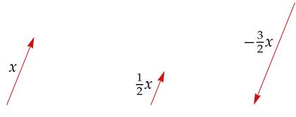

*Scalar multiplication.*

## <span id="page-23-2"></span><span id="page-23-0"></span>*Digression on Fields*

A *field* is a set containing at least two distinct elements called 0 and 1, along with operations of addition and multiplication satisfying all properties listed in [1.3.](#page-16-0) Thus and are fields, as is the set of rational numbers along with the usual operations of addition and multiplication. Another example of a field is the set {0, 1} with the usual operations of addition and multiplication except that 1 + 1 is defined to equal 0.

In this book we will not deal with fields other than and . However, many of the definitions, theorems, and proofs in linear algebra that work for the fields and also work without change for arbitrary fields. If you prefer to do so, throughout much of this book (except for Chapters [6](#page-194-0) and [7,](#page-240-0) which deal with inner product spaces) you can think of as denoting an arbitrary field instead of or . For results (except in the inner product chapters) that have as a hypothesis that is , you can probably replace that hypothesis with the hypothesis that is an algebraically closed field, which means that every nonconstant polynomial with coefficients in has a zero. A few results, such as Exercise [13](#page-38-0) in Section [1C,](#page-31-0) require the hypothesis on that 1 + 1 ≠ 0.

## <span id="page-23-1"></span>*Exercises 1A*

- **1** Show that + = + for all , ∈ .
- **2** Show that ( + ) + = + ( + ) for all , , ∈ .
- **3** Show that () = () for all , , ∈ .
- **4** Show that ( + ) = + for all , , ∈ .
- **5** Show that for every ∈ , there exists a unique ∈ such that + = 0.
- **6** Show that for every ∈ with ≠ 0, there exists a unique ∈ such that = 1.
- **7** Show that

$$\frac{-1+\sqrt{3}\,i}{2}$$

is a cube root of 1 (meaning that its cube equals 1).

- **8** Find two distinct square roots of .
- **9** Find ∈ <sup>4</sup> such that

$$(4, -3, 1, 7) + 2x = (5, 9, -6, 8).$$

**10** Explain why there does not exist ∈ such that

$$\lambda(2-3i,5+4i,-6+7i) = (12-5i,7+22i,-32-9i)\,.$$

- <span id="page-24-0"></span>**11** Show that ( + ) + = + ( + ) for all , , ∈ .
- **12** Show that () = () for all ∈ and all , ∈ .
- **13** Show that 1 = for all ∈ .
- **14** Show that ( + ) = + for all ∈ and all , ∈ .
- **15** Show that ( + ) = + for all , ∈ and all ∈ .

<sup>&</sup>quot;Can you do addition?" the White Queen asked. "What's one and one and one and one and one and one and one and one and one and one?"

<sup>&</sup>quot;I don't know," said Alice. "I lost count."

<sup>—</sup>*Through the Looking Glass*, Lewis Carroll

## <span id="page-25-2"></span><span id="page-25-0"></span>*1B Definition of Vector Space*

The motivation for the definition of a vector space comes from properties of addition and scalar multiplication in : Addition is commutative, associative, and has an identity. Every element has an additive inverse. Scalar multiplication is associative. Scalar multiplication by 1 acts as expected. Addition and scalar multiplication are connected by distributive properties.

We will define a vector space to be a set with an addition and a scalar multiplication on that satisfy the properties in the paragraph above.

## 1.19 definition: *addition, scalar multiplication*

- An *addition* on a set is a function that assigns an element + ∈ to each pair of elements , ∈ .
- A *scalar multiplication* on a set is a function that assigns an element ∈ to each ∈ and each ∈ .

Now we are ready to give the formal definition of a vector space.

## 1.20 definition: *vector space*

<span id="page-25-1"></span>A *vector space* is a set along with an addition on and a scalar multiplication on such that the following properties hold.

## **commutativity**

+ = + for all , ∈ .

## **associativity**

( + ) + = + ( + ) and () = () for all , , ∈ and for all , ∈ .

## **additive identity**

There exists an element 0 ∈ such that + 0 = for all ∈ .

## **additive inverse**

For every ∈ , there exists ∈ such that + = 0.

## **multiplicative identity**

1 = for all ∈ .

## **distributive properties**

( + ) = + and ( + ) = + for all , ∈ and all , ∈ .

The following geometric language sometimes aids our intuition.

## 1.21 definition: *vector, point*

Elements of a vector space are called *vectors* or *points*.

<span id="page-26-0"></span>The scalar multiplication in a vector space depends on . Thus when we need to be precise, we will say that is a *vector space over* instead of saying simply that is a vector space. For example, is a vector space over , and is a vector space over .

1.22 definition: *real vector space, complex vector space*

- A vector space over is called a *real vector space*.
- A vector space over is called a *complex vector space*.

Usually the choice of is either clear from the context or irrelevant. Thus we often assume that is lurking in the background without specifically mentioning it.

With the usual operations of addition and scalar multiplication, is a vector space over , as you should verify. The example of motivated our definition of vector space.

*The simplest vector space is* {0}*, which contains only one point.*

1.23 example: ∞

> <sup>∞</sup> is defined to be the set of all sequences of elements of :

$$\mathbf{F}^{\infty} = \{(x_1, x_2, \dots) : x_k \in \mathbf{F} \text{ for } k = 1, 2, \dots\}.$$

Addition and scalar multiplication on <sup>∞</sup> are defined as expected:

$$\begin{split} (x_1,x_2,\dots) + (y_1,y_2,\dots) &= (x_1+y_1,x_2+y_2,\dots),\\ \lambda(x_1,x_2,\dots) &= (\lambda x_1,\lambda x_2,\dots). \end{split}$$

With these definitions, <sup>∞</sup> becomes a vector space over , as you should verify. The additive identity in this vector space is the sequence of all 0's.

Our next example of a vector space involves a set of functions.

1.24 notation: 

- If is a set, then denotes the set of functions from to .
- For , ∈ , the *sum* + ∈ is the function defined by

$$(f+g)(x) = f(x) + g(x)$$

for all ∈ .

• For ∈ and ∈ , the *product* ∈ is the function defined by

$$(\lambda f)(x) = \lambda f(x)$$

for all ∈ .

As an example of the notation above, if *S* is the interval [0, 1] and  $\mathbf{F} = \mathbf{R}$ , then  $\mathbf{R}^{[0,1]}$  is the set of real-valued functions on the interval [0, 1].

You should verify all three bullet points in the next example.

1.25 example:  $\mathbf{F}^S$  is a vector space

- If *S* is a nonempty set, then **F**<sup>S</sup> (with the operations of addition and scalar multiplication as defined above) is a vector space over **F**.
- The additive identity of  $\mathbf{F}^S$  is the function  $0: S \to \mathbf{F}$  defined by

$$0(x) = 0$$

for all  $x \in S$ .

• For  $f \in \mathbf{F}^S$ , the additive inverse of f is the function  $-f : S \to \mathbf{F}$  defined by

$$(-f)(x) = -f(x)$$

for all  $x \in S$ .

The vector space  $\mathbf{F}^n$  is a special case of the vector space  $\mathbf{F}^S$  because each  $(x_1,...,x_n) \in \mathbf{F}^n$  can be thought of as a function x from the set  $\{1,2,...,n\}$  to  $\mathbf{F}$  by writing x(k) instead of  $x_k$  for the  $k^{\text{th}}$  coordinate of  $(x_1,...,x_n)$ . In other words,

The elements of the vector space  $\mathbf{R}^{[0,1]}$  are real-valued functions on [0,1], not lists. In general, a vector space is an abstract entity whose elements might be lists, functions, or weird objects.

we can think of  $\mathbf{F}^n$  as  $\mathbf{F}^{\{1,2,\ldots,n\}}$ . Similarly, we can think of  $\mathbf{F}^{\infty}$  as  $\mathbf{F}^{\{1,2,\ldots\}}$ .

Soon we will see further examples of vector spaces, but first we need to develop some of the elementary properties of vector spaces.

The definition of a vector space requires it to have an additive identity. The next result states that this identity is unique.

## 1.26 unique additive identity

A vector space has a unique additive identity.

Proof Suppose 0 and 0' are both additive identities for some vector space V. Then

$$0' = 0' + 0 = 0 + 0' = 0,$$

where the first equality holds because 0 is an additive identity, the second equality comes from commutativity, and the third equality holds because 0' is an additive identity. Thus 0' = 0, proving that V has only one additive identity.

Each element v in a vector space has an additive inverse, an element w in the vector space such that v + w = 0. The next result shows that each element in a vector space has only one additive inverse.

## <span id="page-28-1"></span>1.27 *unique additive inverse*

Every element in a vector space has a unique additive inverse.

Proof Suppose is a vector space. Let ∈ . Suppose and ′ are additive inverses of . Then

$$w = w + 0 = w + (v + w') = (w + v) + w' = 0 + w' = w'.$$

Thus = ′ , as desired.

Because additive inverses are unique, the following notation now makes sense.

1.28 notation: −*,* −

Let , ∈ . Then

- − denotes the additive inverse of ;
- − is defined to be + (−).

Almost all results in this book involve some vector space. To avoid having to restate frequently that is a vector space, we now make the necessary declaration once and for all.

1.29 notation:

For the rest of this book, denotes a vector space over .

In the next result, 0 denotes a scalar (the number 0 ∈ ) on the left side of the equation and a vector (the additive identity of ) on the right side of the equation.

## 1.30 *the number* 0 *times a vector*

<span id="page-28-0"></span>0 = 0 for every ∈ .

Proof For ∈ , we have

$$0v = (0+0)v = 0v + 0v.$$

Adding the additive inverse of 0 to both sides of the equation above gives 0 = 0, as desired.

In the next result, 0 denotes the additive identity of . Although their proofs

*The result in [1.30](#page-28-0) involves the additive identity of and scalar multiplication. The only part of the definition of a vector space that connects vector addition and scalar multiplication is the distributive property. Thus the distributive property must be used in the proof of [1.30.](#page-28-0)*

are similar, [1.30](#page-28-0) and [1.31](#page-29-1) are not identical. More precisely, [1.30](#page-28-0) states that the product of the scalar 0 and any vector equals the vector 0, whereas [1.31](#page-29-1) states that the product of any scalar and the vector 0 equals the vector 0.

1.31 *a number times the vector* 0

<span id="page-29-1"></span>0 = 0 for every ∈ .

Proof For ∈ , we have

$$a0 = a(0+0) = a0 + a0.$$

Adding the additive inverse of 0 to both sides of the equation above gives 0 = 0, as desired.

Now we show that if an element of is multiplied by the scalar −1, then the result is the additive inverse of the element of .

1.32 *the number* −1 *times a vector*

<span id="page-29-2"></span>(−1) = − for every ∈ .

Proof For ∈ , we have

$$v + (-1)v = 1v + (-1)v = (1 + (-1))v = 0v = 0.$$

This equation says that (−1), when added to , gives 0. Thus (−1) is the additive inverse of , as desired.

## <span id="page-29-0"></span>*Exercises 1B*

- **1** Prove that −(−) = for every ∈ .
- **2** Suppose ∈ , ∈ , and = 0. Prove that = 0 or = 0.
- **3** Suppose , ∈ . Explain why there exists a unique ∈ such that + 3 = .
- **4** The empty set is not a vector space. The empty set fails to satisfy only one of the requirements listed in the definition of a vector space [\(1.20\)](#page-25-1). Which one?
- **5** Show that in the definition of a vector space [\(1.20\)](#page-25-1), the additive inverse condition can be replaced with the condition that

$$0v = 0$$
 for all  $v \in V$ .

Here the 0 on the left side is the number 0, and the 0 on the right side is the additive identity of .

*The phrase a "condition can be replaced" in a definition means that the collection of objects satisfying the definition is unchanged if the original condition is replaced with the new condition.*

<span id="page-30-1"></span>6 Let  $\infty$  and  $-\infty$  denote two distinct objects, neither of which is in **R**. Define an addition and scalar multiplication on  $\mathbf{R} \cup \{\infty, -\infty\}$  as you could guess from the notation. Specifically, the sum and product of two real numbers is as usual, and for  $t \in \mathbf{R}$  define

$$t\infty = \begin{cases} -\infty & \text{if } t < 0, \\ 0 & \text{if } t = 0, \\ \infty & \text{if } t > 0, \end{cases} \qquad t(-\infty) = \begin{cases} \infty & \text{if } t < 0, \\ 0 & \text{if } t = 0, \\ -\infty & \text{if } t > 0, \end{cases}$$

and

$$\begin{aligned} t+\infty &= \infty + t = \infty + \infty = \infty, \\ t+(-\infty) &= (-\infty) + t = (-\infty) + (-\infty) = -\infty, \\ \infty + (-\infty) &= (-\infty) + \infty = 0. \end{aligned}$$

With these operations of addition and scalar multiplication, is  $R \cup \{\infty, -\infty\}$  a vector space over R? Explain.

- 7 Suppose S is a nonempty set. Let  $V^S$  denote the set of functions from S to V. Define a natural addition and scalar multiplication on  $V^S$ , and show that  $V^S$  is a vector space with these definitions.
- <span id="page-30-0"></span>**8** Suppose *V* is a real vector space.
  - The *complexification* of V, denoted by  $V_{\mathbb{C}}$ , equals  $V \times V$ . An element of  $V_{\mathbb{C}}$  is an ordered pair (u, v), where  $u, v \in V$ , but we write this as u + iv.
  - Addition on  $V_{\mathbf{C}}$  is defined by

$$(u_1+iv_1)+(u_2+iv_2)=(u_1+u_2)+i(v_1+v_2)$$

for all  $u_1, v_1, u_2, v_2 \in V$ .

• Complex scalar multiplication on  $V_{\mathbf{C}}$  is defined by

$$(a+bi)(u+iv) = (au-bv) + i(av+bu)$$

for all  $a, b \in \mathbf{R}$  and all  $u, v \in V$ .

Prove that with the definitions of addition and scalar multiplication as above,  $V_{\rm C}$  is a complex vector space.

Think of V as a subset of  $V_C$  by identifying  $u \in V$  with u + i0. The construction of  $V_C$  from V can then be thought of as generalizing the construction of  $\mathbb{C}^n$  from  $\mathbb{R}^n$ .

## <span id="page-31-2"></span><span id="page-31-0"></span>*1C Subspaces*

By considering subspaces, we can greatly expand our examples of vector spaces.

## 1.33 definition: *subspace*

A subset of is called a *subspace* of if is also a vector space with the same additive identity, addition, and scalar multiplication as on .

The next result gives the easiest way to check whether a subset of a vector space is a subspace.

*Some people use the terminology linear subspace, which means the same as subspace.*

## 1.34 *conditions for a subspace*

<span id="page-31-1"></span>A subset of is a subspace of if and only if satisfies the following three conditions.

## **additive identity**

0 ∈ .

## **closed under addition**

, ∈ implies + ∈ .

## **closed under scalar multiplication**

∈ and ∈ implies ∈ .

Proof If is a subspace of , then satisfies the three conditions above by the definition of vector space.

Conversely, suppose satisfies the three conditions above. The first condition ensures that the additive identity of is in . The second condition ensures that addition makes sense on . The third condition ensures that scalar multiplication makes sense on .

*The additive identity condition above could be replaced with the condition that is nonempty* (*because then taking* ∈ *and multiplying it by* 0 *would imply that* 0 ∈ )*. However, if a subset of is indeed a subspace, then usually the quickest way to show that is nonempty is to show that* 0 ∈ *.*

If ∈ , then − [which equals (−1) by [1.32](#page-29-2)] is also in by the third condition above. Hence every element of has an additive inverse in .

The other parts of the definition of a vector space, such as associativity and commutativity, are automatically satisfied for because they hold on the larger space . Thus is a vector space and hence is a subspace of .

The three conditions in the result above usually enable us to determine quickly whether a given subset of is a subspace of . You should verify all assertions in the next example.

<span id="page-32-2"></span><span id="page-32-1"></span>1.35 example: *subspaces* 

(a) If  $b \in \mathbf{F}$ , then

$$\{(x_1, x_2, x_3, x_4) \in \mathbf{F}^4 : x_3 = 5x_4 + b\}$$

is a subspace of  $\mathbf{F}^4$  if and only if b = 0.

- (b) The set of continuous real-valued functions on the interval [0,1] is a subspace of  $\mathbf{R}^{[0,1]}$ .
- (c) The set of differentiable real-valued functions on  $\mathbf{R}$  is a subspace of  $\mathbf{R}^{\mathbf{R}}$ .
- (d) The set of differentiable real-valued functions f on the interval (0,3) such that f'(2) = b is a subspace of  $\mathbf{R}^{(0,3)}$  if and only if b = 0.
- (e) The set of all sequences of complex numbers with limit 0 is a subspace of  $\mathbb{C}^{\infty}$ .

Verifying some of the items above shows the linear structure underlying parts of calculus. For example, (b) above requires the result that the sum of two continuous functions is continuous. As another example, (d) above requires the result that for a constant c, the derivative of cf equals c times the derivative of f.

The set {0} is the smallest subspace of V, and V itself is the largest subspace of V. The empty set is not a subspace of V because a subspace must be a vector space and hence must contain at least one element, namely, an additive identity.

The subspaces of  $\mathbf{R}^2$  are precisely  $\{0\}$ , all lines in  $\mathbf{R}^2$  containing the origin, and  $\mathbf{R}^2$ . The subspaces of  $\mathbf{R}^3$  are precisely  $\{0\}$ , all lines in  $\mathbf{R}^3$  containing the origin, all planes in  $\mathbf{R}^3$  containing the origin, and  $\mathbf{R}^3$ . To prove that all these objects are indeed subspaces is straightforward—the hard part is to show that they are the only subspaces of  $\mathbf{R}^2$  and  $\mathbf{R}^3$ . That task will be easier after we introduce some additional tools in the next chapter.

## <span id="page-32-0"></span>Sums of Subspaces

When dealing with vector spaces, we are usually interested only in subspaces, as opposed to arbitrary subsets. The notion of the sum of subspaces will be useful.

The union of subspaces is rarely a subspace (see Exercise 12), which is why we usually work with sums rather than unions.

## 1.36 definition: sum of subspaces

Suppose  $V_1, ..., V_m$  are subspaces of V. The *sum* of  $V_1, ..., V_m$ , denoted by  $V_1 + \cdots + V_m$ , is the set of all possible sums of elements of  $V_1, ..., V_m$ . More precisely,

$$V_1 + \dots + V_m = \{v_1 + \dots + v_m : v_1 \in V_1, \dots, v_m \in V_m\}.$$

Let's look at some examples of sums of subspaces.

1.37 example: *a sum of subspaces of* 3

Suppose is the set of all elements of <sup>3</sup> whose second and third coordinates equal 0, and is the set of all elements of <sup>3</sup> whose first and third coordinates equal 0:

$$U = \{(x, 0, 0) \in \mathbf{F}^3 : x \in \mathbf{F}\} \text{ and } W = \{(0, y, 0) \in \mathbf{F}^3 : y \in \mathbf{F}\}.$$

Then

$$U + W = \{(x, y, 0) \in \mathbf{F}^3 : x, y \in \mathbf{F}\},\$$

as you should verify.

1.38 example: *a sum of subspaces of* 4

Suppose

$$U = \{(x, x, y, y) \in \mathbf{F}^4 : x, y \in \mathbf{F}\}$$
 and  $W = \{(x, x, x, y) \in \mathbf{F}^4 : x, y \in \mathbf{F}\}.$ 

Using words rather than symbols, we could say that is the set of elements of <sup>4</sup> whose first two coordinates equal each other and whose third and fourth coordinates equal each other. Similarly, is the set of elements of <sup>4</sup> whose first three coordinates equal each other.

To find a description of + , consider a typical element (, , , ) of and a typical element (, , , ) of , where , , , ∈ . We have

$$(a, a, b, b) + (c, c, c, d) = (a + c, a + c, b + c, b + d),$$

which shows that every element of + has its first two coordinates equal to each other. Thus

1.39 
$$U + W \subseteq \{(x, x, y, z) \in \mathbf{F}^4 : x, y, z \in \mathbf{F}\}.$$

To prove the inclusion in the other direction, suppose , , ∈ . Then

<span id="page-33-0"></span>
$$(x, x, y, z) = (x, x, y, y) + (0, 0, 0, z - y),$$

where the first vector on the right is in and the second vector on the right is in . Thus (, , , ) ∈ + , showing that the inclusion [1.39](#page-33-0) also holds in the opposite direction. Hence

$$U + W = \{(x, x, y, z) \in \mathbf{F}^4 : x, y, z \in \mathbf{F}\},\$$

which shows that + is the set of elements of <sup>4</sup> whose first two coordinates equal each other.

The next result states that the sum of subspaces is a subspace, and is in fact the smallest subspace containing all the summands (which means that every subspace containing all the summands also contains the sum).

## <span id="page-34-2"></span>1.40 sum of subspaces is the smallest containing subspace

Suppose  $V_1, ..., V_m$  are subspaces of V. Then  $V_1 + \cdots + V_m$  is the smallest subspace of V containing  $V_1, ..., V_m$ .

Proof The reader can verify that  $V_1 + \cdots + V_m$  contains the additive identity 0 and is closed under addition and scalar multiplication. Thus 1.34 implies that  $V_1 + \cdots + V_m$  is a subspace of V.

The subspaces  $V_1, ..., V_m$  are all contained in  $V_1 + \cdots + V_m$  (to see this, consider sums  $v_1 + \cdots + v_m$  where all except one of the  $v_k$ 's are 0). Conversely, every subspace of V containing  $V_1, ..., V_m$  contains  $V_1 + \cdots + V_m$  (because subspaces must contain all finite sums of their elements). Thus  $V_1 + \cdots + V_m$  is the smallest subspace of V containing  $V_1, ..., V_m$ .

Sums of subspaces in the theory of vector spaces are analogous to unions of subsets in set theory. Given two subspaces of a vector space, the smallest subspace containing them is their sum. Analogously, given two subsets of a set, the smallest subset containing them is their union.

#### <span id="page-34-0"></span>Direct Sums

Suppose  $V_1, ..., V_m$  are subspaces of V. Every element of  $V_1 + \cdots + V_m$  can be written in the form

$$v_1+\cdots+v_m,$$

where each  $v_k \in V_k$ . Of special interest are cases in which each vector in  $V_1 + \cdots + V_m$  can be represented in the form above in only one way. This situation is so important that it gets a special name (direct sum) and a special symbol  $(\oplus)$ .

#### 1.41 definition: direct sum, ⊕

<span id="page-34-1"></span>Suppose  $V_1, ..., V_m$  are subspaces of V.

- The sum  $V_1 + \cdots + V_m$  is called a *direct sum* if each element of  $V_1 + \cdots + V_m$  can be written in only one way as a sum  $v_1 + \cdots + v_m$ , where each  $v_k \in V_k$ .
- If  $V_1 + \cdots + V_m$  is a direct sum, then  $V_1 \oplus \cdots \oplus V_m$  denotes  $V_1 + \cdots + V_m$ , with the  $\oplus$  notation serving as an indication that this is a direct sum.

## 1.42 example: a direct sum of two subspaces

Suppose U is the subspace of  $\mathbf{F}^3$  of those vectors whose last coordinate equals 0, and W is the subspace of  $\mathbf{F}^3$  of those vectors whose first two coordinates equal 0:

$$U = \{(x, y, 0) \in \mathbf{F}^3 : x, y \in \mathbf{F}\} \quad \text{and} \quad W = \{(0, 0, z) \in \mathbf{F}^3 : z \in \mathbf{F}\}.$$

Then  $\mathbf{F}^3 = U \oplus W$ , as you should verify.

## 1.43 example: a direct sum of multiple subspaces

Suppose  $V_k$  is the subspace of  $\mathbf{F}^n$  of those vectors whose coordinates are all

0, except possibly in the  $k^{\text{th}}$  slot; for example,  $V_2 = \{(0, x, 0, ..., 0) \in \mathbf{F}^n : x \in \mathbf{F}\}$ . Then

$$\mathbf{F}^n = V_1 \oplus \cdots \oplus V_n,$$

as you should verify.

Sometimes nonexamples add to our understanding as much as examples.

#### <span id="page-35-0"></span>1.44 example: a sum that is not a direct sum

Suppose

$$\begin{split} V_1 &= \{ (x, y, 0) \in \mathbf{F}^3 : x, y \in \mathbf{F} \}, \\ V_2 &= \{ (0, 0, z) \in \mathbf{F}^3 : z \in \mathbf{F} \}, \\ V_3 &= \{ (0, y, y) \in \mathbf{F}^3 : y \in \mathbf{F} \}. \end{split}$$

Then  $\mathbf{F}^3 = V_1 + V_2 + V_3$  because every vector  $(x, y, z) \in \mathbf{F}^3$  can be written as

$$(x, y, z) = (x, y, 0) + (0, 0, z) + (0, 0, 0),$$

where the first vector on the right side is in  $V_1$ , the second vector is in  $V_2$ , and the third vector is in  $V_3$ .

However,  $\mathbf{F}^3$  does not equal the direct sum of  $V_1, V_2, V_3$ , because the vector (0,0,0) can be written in more than one way as a sum  $v_1 + v_2 + v_3$ , with each  $v_k \in V_k$ . Specifically, we have

$$(0,0,0) = (0,1,0) + (0,0,1) + (0,-1,-1)$$

and, of course,

$$(0,0,0) = (0,0,0) + (0,0,0) + (0,0,0),$$

where the first vector on the right side of each equation above is in  $V_1$ , the second vector is in  $V_2$ , and the third vector is in  $V_3$ . Thus the sum  $V_1 + V_2 + V_3$  is not a direct sum.

The definition of direct sum requires every vector in the sum to have a unique representation as an appropriate sum. The next result shows that when deciding whether a sum of subspaces is a direct sum, we only need to consider whether 0 can be uniquely written as an appropriate sum.

The symbol  $\oplus$ , which is a plus sign inside a circle, reminds us that we are dealing with a special type of sum of subspaces—each element in the direct sum can be represented in only one way as a sum of elements from the specified subspaces.

### <span id="page-36-2"></span>1.45 condition for a direct sum

<span id="page-36-0"></span>Suppose  $V_1, ..., V_m$  are subspaces of V. Then  $V_1 + \cdots + V_m$  is a direct sum if and only if the only way to write 0 as a sum  $v_1 + \cdots + v_m$ , where each  $v_k \in V_k$ , is by taking each  $v_k$  equal to 0.

Proof First suppose  $V_1 + \cdots + V_m$  is a direct sum. Then the definition of direct sum implies that the only way to write 0 as a sum  $v_1 + \cdots + v_m$ , where each  $v_k \in V_k$ , is by taking each  $v_k$  equal to 0.

Now suppose that the only way to write 0 as a sum  $v_1 + \cdots + v_m$ , where each  $v_k \in V_k$ , is by taking each  $v_k$  equal to 0. To show that  $V_1 + \cdots + V_m$  is a direct sum, let  $v \in V_1 + \cdots + V_m$ . We can write

$$v = v_1 + \dots + v_m$$

for some  $v_1 \in V_1, ..., v_m \in V_m$ . To show that this representation is unique, suppose we also have

$$v = u_1 + \dots + u_m$$

where  $u_1 \in V_1, ..., u_m \in V_m$ . Subtracting these two equations, we have

$$0 = (v_1 - u_1) + \dots + (v_m - u_m).$$

Because  $v_1 - u_1 \in V_1, ..., v_m - u_m \in V_m$ , the equation above implies that each  $v_k - u_k$  equals 0. Thus  $v_1 = u_1, ..., v_m = u_m$ , as desired.

The next result gives a simple condition for testing whether a sum of two subspaces is a direct sum.

The symbol ⇔ used below means "if and only if"; this symbol could also be read to mean "is equivalent to".

## 1.46 direct sum of two subspaces

<span id="page-36-1"></span>Suppose U and W are subspaces of V. Then

$$U + W$$
 is a direct sum  $\iff U \cap W = \{0\}.$ 

Proof First suppose that U+W is a direct sum. If  $v \in U \cap W$ , then 0 = v + (-v), where  $v \in U$  and  $-v \in W$ . By the unique representation of 0 as the sum of a vector in U and a vector in W, we have v = 0. Thus  $U \cap W = \{0\}$ , completing the proof in one direction.

To prove the other direction, now suppose  $U \cap W = \{0\}$ . To prove that U + W is a direct sum, suppose  $u \in U$ ,  $w \in W$ , and

$$0 = u + w$$
.

To complete the proof, we only need to show that u = w = 0 (by 1.45). The equation above implies that  $u = -w \in W$ . Thus  $u \in U \cap W$ . Hence u = 0, which by the equation above implies that w = 0, completing the proof.

The result above deals only with the case of two subspaces. When asking about a possible direct sum with more than two subspaces, it is not enough to test that each pair of the subspaces intersect only at 0. To see this, consider Example 1.44. In that nonexample of a direct sum, we have  $V_1 \cap V_2 = V_1 \cap V_3 = V_2 \cap V_3 = \{0\}$ .

Sums of subspaces are analogous to unions of subsets. Similarly, direct sums of subspaces are analogous to disjoint unions of subsets. No two subspaces of a vector space can be disjoint, because both contain 0. So disjointness is replaced, at least in the case of two subspaces, with the requirement that the intersection equal {0}.

#### <span id="page-37-0"></span>Exercises 1C

- 1 For each of the following subsets of  $\mathbf{F}^3$ , determine whether it is a subspace of  $\mathbf{F}^3$ .
  - (a)  $\{(x_1, x_2, x_3) \in \mathbf{F}^3 : x_1 + 2x_2 + 3x_3 = 0\}$
  - (b)  $\{(x_1, x_2, x_3) \in \mathbf{F}^3 : x_1 + 2x_2 + 3x_3 = 4\}$
  - (c)  $\{(x_1, x_2, x_3) \in \mathbf{F}^3 : x_1 x_2 x_3 = 0\}$
  - (d)  $\{(x_1, x_2, x_3) \in \mathbf{F}^3 : x_1 = 5x_3\}$
- 2 Verify all assertions about subspaces in Example 1.35.
- 3 Show that the set of differentiable real-valued functions f on the interval (-4,4) such that f'(-1)=3f(2) is a subspace of  $\mathbf{R}^{(-4,4)}$ .
- **4** Suppose  $b \in \mathbb{R}$ . Show that the set of continuous real-valued functions f on the interval [0,1] such that  $\int_0^1 f = b$  is a subspace of  $\mathbb{R}^{[0,1]}$  if and only if b = 0.
- 5 Is  $\mathbb{R}^2$  a subspace of the complex vector space  $\mathbb{C}^2$ ?
- **6** (a) Is  $\{(a, b, c) \in \mathbb{R}^3 : a^3 = b^3\}$  a subspace of  $\mathbb{R}^3$ ?
  - (b) Is  $\{(a, b, c) \in \mathbb{C}^3 : a^3 = b^3\}$  a subspace of  $\mathbb{C}^3$ ?
- 7 Prove or give a counterexample: If U is a nonempty subset of  $\mathbb{R}^2$  such that U is closed under addition and under taking additive inverses (meaning  $-u \in U$  whenever  $u \in U$ ), then U is a subspace of  $\mathbb{R}^2$ .
- 8 Give an example of a nonempty subset U of  $\mathbb{R}^2$  such that U is closed under scalar multiplication, but U is not a subspace of  $\mathbb{R}^2$ .
- 9 A function  $f: \mathbf{R} \to \mathbf{R}$  is called *periodic* if there exists a positive number p such that f(x) = f(x + p) for all  $x \in \mathbf{R}$ . Is the set of periodic functions from  $\mathbf{R}$  to  $\mathbf{R}$  a subspace of  $\mathbf{R}^{\mathbf{R}}$ ? Explain.
- Suppose  $V_1$  and  $V_2$  are subspaces of V. Prove that the intersection  $V_1 \cap V_2$  is a subspace of V.

- <span id="page-38-2"></span>Prove that the intersection of every collection of subspaces of *V* is a subspace of *V*.
- <span id="page-38-1"></span>**12** Prove that the union of two subspaces of *V* is a subspace of *V* if and only if one of the subspaces is contained in the other.
- <span id="page-38-0"></span>Prove that the union of three subspaces of *V* is a subspace of *V* if and only if one of the subspaces contains the other two.

This exercise is surprisingly harder than Exercise 12, possibly because this exercise is not true if we replace F with a field containing only two elements.

**14** Suppose

$$U = \{(x, -x, 2x) \in \mathbf{F}^3 : x \in \mathbf{F}\}$$
 and  $W = \{(x, x, 2x) \in \mathbf{F}^3 : x \in \mathbf{F}\}.$ 

Describe U + W using symbols, and also give a description of U + W that uses no symbols.

- 15 Suppose *U* is a subspace of *V*. What is U + U?
- Is the operation of addition on the subspaces of V commutative? In other words, if U and W are subspaces of V, is U + W = W + U?
- 17 Is the operation of addition on the subspaces of V associative? In other words, if  $V_1$ ,  $V_2$ ,  $V_3$  are subspaces of V, is

$$(V_1 + V_2) + V_3 = V_1 + (V_2 + V_3)$$
?

- **18** Does the operation of addition on the subspaces of *V* have an additive identity? Which subspaces have additive inverses?
- 19 Prove or give a counterexample: If  $V_1, V_2, U$  are subspaces of V such that

$$V_1 + U = V_2 + U,$$

then  $V_1 = V_2$ .

20 Suppose

$$U = \{(x, x, y, y) \in \mathbf{F}^4 : x, y \in \mathbf{F}\}.$$

Find a subspace W of  $\mathbf{F}^4$  such that  $\mathbf{F}^4 = U \oplus W$ .

21 Suppose

$$U = \{(x, y, x + y, x - y, 2x) \in \mathbf{F}^5 : x, y \in \mathbf{F}\}.$$

Find a subspace W of  $\mathbf{F}^5$  such that  $\mathbf{F}^5 = U \oplus W$ .

22 Suppose

$$U = \{(x, y, x + y, x - y, 2x) \in \mathbf{F}^5 : x, y \in \mathbf{F}\}.$$

Find three subspaces  $W_1$ ,  $W_2$ ,  $W_3$  of  $\mathbf{F}^5$ , none of which equals  $\{0\}$ , such that  $\mathbf{F}^5 = U \oplus W_1 \oplus W_2 \oplus W_3$ .

**23** Prove or give a counterexample: If <sup>1</sup> , <sup>2</sup> , are subspaces of such that

$$V = V_1 \oplus U$$
 and  $V = V_2 \oplus U$ ,

then <sup>1</sup> = <sup>2</sup> .

> *Hint: When trying to discover whether a conjecture in linear algebra is true or false, it is often useful to start by experimenting in* 2 *.*

**24** A function ∶ → is called *even* if

$$f(-x) = f(x)$$

for all ∈ . A function ∶ → is called *odd* if

$$f(-x) = -f(x)$$

for all ∈ . Let <sup>e</sup> denote the set of real-valued even functions on and let <sup>o</sup> denote the set of real-valued odd functions on . Show that = <sup>e</sup> ⊕ <sup>o</sup> .

## Chapter 2

# <span id="page-40-1"></span><span id="page-40-0"></span>*Finite-Dimensional Vector Spaces*

In the last chapter we learned about vector spaces. Linear algebra focuses not on arbitrary vector spaces, but on finite-dimensional vector spaces, which we introduce in this chapter.

We begin this chapter by considering linear combinations of lists of vectors. This leads us to the crucial concept of linear independence. The linear dependence lemma will become one of our most useful tools.

A list of vectors in a vector space that is small enough to be linearly independent and big enough so the linear combinations of the list fill up the vector space is called a basis of the vector space. We will see that every basis of a vector space has the same length, which will allow us to define the dimension of a vector space.

This chapter ends with a formula for the dimension of the sum of two subspaces.

## *standing assumptions for this chapter*

- denotes or .
- denotes a vector space over .


*The main building of the Institute for Advanced Study, in Princeton, New Jersey. Paul Halmos* (*1916–2006*) *wrote the first modern linear algebra book in this building. Halmos's linear algebra book was published in 1942* (*second edition published in 1958*)*. The title of Halmos's book was the same as the title of this chapter.*

## <span id="page-41-3"></span><span id="page-41-0"></span>*2A Span and Linear Independence*

We have been writing lists of numbers surrounded by parentheses, and we will continue to do so for elements of ; for example, (2, −7, 8) ∈ <sup>3</sup> . However, now we need to consider lists of vectors (which may be elements of or of other vector spaces). To avoid confusion, we will usually write lists of vectors without surrounding parentheses. For example, (4, 1, 6), (9, 5, 7) is a list of length two of vectors in 3 .

## 2.1 notation: *list of vectors*

We will usually write lists of vectors without surrounding parentheses.

## <span id="page-41-1"></span>*Linear Combinations and Span*

A sum of scalar multiples of the vectors in a list is called a linear combination of the list. Here is the formal definition.

## 2.2 definition: *linear combination*

<span id="page-41-2"></span>A *linear combination* of a list <sup>1</sup> , …, of vectors in is a vector of the form

$$a_1v_1+\cdots+a_mv_m,$$

where <sup>1</sup> , …, ∈ .

#### 2.3 example: *linear combinations in* 3

• (17, −4, 2) is a linear combination of (2, 1, −3), (1, −2, 4), which is a list of length two of vectors in 3 , because

$$(17, -4, 2) = 6(2, 1, -3) + 5(1, -2, 4).$$

• (17, −4, 5) is not a linear combination of (2, 1, −3), (1, −2, 4), which is a list of length two of vectors in 3 , because there do not exist numbers <sup>1</sup> , <sup>2</sup> ∈ such that

$$(17,-4,5) = a_1(2,1,-3) + a_2(1,-2,4) \, .$$

In other words, the system of equations

$$17 = 2a_1 + a_2$$

$$-4 = a_1 - 2a_2$$

$$5 = -3a_1 + 4a_2$$

has no solutions (as you should verify).

#### <span id="page-42-0"></span>2.4 definition: span

The set of all linear combinations of a list of vectors  $v_1, ..., v_m$  in V is called the *span* of  $v_1, ..., v_m$ , denoted by  $\text{span}(v_1, ..., v_m)$ . In other words,

$$\mathrm{span}(v_1,...,v_m) = \{a_1v_1 + \cdots + a_mv_m : a_1,...,a_m \in \mathbf{F}\}.$$

The span of the empty list () is defined to be  $\{0\}$ .

#### 2.5 example: span

The previous example shows that in  $F^3$ ,

- $(17, -4, 2) \in \text{span}((2, 1, -3), (1, -2, 4));$
- $(17, -4, 5) \notin \text{span}((2, 1, -3), (1, -2, 4)).$

## 2.6 span is the smallest containing subspace

The span of a list of vectors in *V* is the smallest subspace of *V* containing all vectors in the list.

Proof Suppose  $v_1, ..., v_m$  is a list of vectors in V.

First we show that  $span(v_1, ..., v_m)$  is a subspace of V. The additive identity is in  $span(v_1, ..., v_m)$  because

Some mathematicians use the terminology **linear span**, which means the same as span.

$$0 = 0v_1 + \dots + 0v_m.$$

Also,  $span(v_1, ..., v_m)$  is closed under addition because

$$(a_1v_1 + \dots + a_mv_m) + (c_1v_1 + \dots + c_mv_m) = (a_1 + c_1)v_1 + \dots + (a_m + c_m)v_m.$$

Furthermore,  $span(v_1, ..., v_m)$  is closed under scalar multiplication because

$$\lambda(a_1v_1+\cdots+a_mv_m)=\lambda a_1v_1+\cdots+\lambda a_mv_m.$$

Thus span $(v_1, ..., v_m)$  is a subspace of V (by 1.34).

Each  $v_k$  is a linear combination of  $v_1, ..., v_m$  (to show this, set  $a_k = 1$  and let the other a's in 2.2 equal 0). Thus  $\operatorname{span}(v_1, ..., v_m)$  contains each  $v_k$ . Conversely, because subspaces are closed under scalar multiplication and addition, every subspace of V that contains each  $v_k$  contains  $\operatorname{span}(v_1, ..., v_m)$ . Thus  $\operatorname{span}(v_1, ..., v_m)$  is the smallest subspace of V containing all the vectors  $v_1, ..., v_m$ .

#### 2.7 definition: spans

If span $(v_1, ..., v_m)$  equals V, we say that the list  $v_1, ..., v_m$  spans V.

<span id="page-43-1"></span><span id="page-43-0"></span>2.8 example: *a list that spans*

Suppose is a positive integer. We want to show that

$$(1, 0, ..., 0), (0, 1, 0, ..., 0), ..., (0, ..., 0, 1)$$

spans . Here the th vector in the list above has 1 in the th slot and 0 in all other slots.

Suppose (<sup>1</sup> , …, ) ∈ . Then

$$(x_1,...,x_n) = x_1(1,0,...,0) + x_2(0,1,0,...,0) + \cdots + x_n(0,...,0,1).$$

Thus (<sup>1</sup> , …, ) ∈ span((1, 0, …, 0), (0, 1, 0, …, 0), …, (0, …, 0, 1)), as desired.

Now we can make one of the key definitions in linear algebra.

## 2.9 definition: *finite-dimensional vector space*

A vector space is called *finite-dimensional* if some list of vectors in it spans the space.

Example [2.8](#page-43-0) above shows that is a finite-dimensional vector space for every positive integer .

*Recall that by definition every list has finite length.*

The definition of a polynomial is no doubt already familiar to you.

## 2.10 definition: *polynomial,* ()

• A function ∶ → is called a *polynomial* with coefficients in if there exist <sup>0</sup> , …, ∈ such that

$$p(z) = a_0 + a_1 z + a_2 z^2 + \dots + a_m z^m$$

for all ∈ .

• () is the set of all polynomials with coefficients in .

With the usual operations of addition and scalar multiplication, () is a vector space over , as you should verify. Hence () is a subspace of , the vector space of functions from to .

If a polynomial (thought of as a function from to ) is represented by two sets of coefficients, then subtracting one representation of the polynomial from the other produces a polynomial that is identically zero as a function on and hence has all zero coefficients (if you are unfamiliar with this fact, just believe it for now; we will prove it later—see [4.8\)](#page-136-1). **Conclusion:** the coefficients of a polynomial are uniquely determined by the polynomial. Thus the next definition uniquely defines the degree of a polynomial.

#### <span id="page-44-1"></span>2.11 definition: degree of a polynomial, deg p

• A polynomial  $p \in \mathcal{P}(\mathbf{F})$  is said to have *degree* m if there exist scalars  $a_0, a_1, ..., a_m \in \mathbf{F}$  with  $a_m \neq 0$  such that for every  $z \in \mathbf{F}$ , we have

$$p(z) = a_0 + a_1 z + \dots + a_m z^m$$
.

- The polynomial that is identically 0 is said to have degree  $-\infty$ .
- The degree of a polynomial p is denoted by deg p.

In the next definition, we use the convention that  $-\infty < m$ , which means that the polynomial 0 is in  $\mathcal{P}_m(\mathbf{F})$ .

## 2.12 notation: $\mathcal{P}_m(\mathbf{F})$

For m a nonnegative integer,  $\mathcal{P}_m(\mathbf{F})$  denotes the set of all polynomials with coefficients in  $\mathbf{F}$  and degree at most m.

If m is a nonnegative integer, then  $\mathcal{P}_m(\mathbf{F}) = \mathrm{span}(1, z, ..., z^m)$  [here we slightly abuse notation by letting  $z^k$  denote a function]. Thus  $\mathcal{P}_m(\mathbf{F})$  is a finite-dimensional vector space for each nonnegative integer m.

## 2.13 definition: infinite-dimensional vector space

A vector space is called *infinite-dimensional* if it is not finite-dimensional.

## 2.14 example: $\mathcal{P}(\mathbf{F})$ is infinite-dimensional

Consider any list of elements of  $\mathcal{P}(\mathbf{F})$ . Let m denote the highest degree of the polynomials in this list. Then every polynomial in the span of this list has degree at most m. Thus  $z^{m+1}$  is not in the span of our list. Hence no list spans  $\mathcal{P}(\mathbf{F})$ . Thus  $\mathcal{P}(\mathbf{F})$  is infinite-dimensional.

## <span id="page-44-0"></span>Linear Independence

Suppose  $v_1,...,v_m \in V$  and  $v \in \text{span}(v_1,...,v_m)$ . By the definition of span, there exist  $a_1,...,a_m \in F$  such that

$$v = a_1 v_1 + \dots + a_m v_m.$$

Consider the question of whether the choice of scalars in the equation above is unique. Suppose  $c_1, ..., c_m$  is another set of scalars such that

$$v = c_1 v_1 + \dots + c_m v_m.$$

Subtracting the last two equations, we have

$$0 = (a_1 - c_1)v_1 + \dots + (a_m - c_m)v_m.$$

<span id="page-45-0"></span>Thus we have written 0 as a linear combination of  $(v_1, ..., v_m)$ . If the only way to do this is by using 0 for all the scalars in the linear combination, then each  $a_k - c_k$  equals 0, which means that each  $a_k$  equals  $c_k$  (and thus the choice of scalars was indeed unique). This situation is so important that we give it a special name—linear independence—which we now define.

#### 2.15 definition: linearly independent

• A list  $v_1, ..., v_m$  of vectors in V is called *linearly independent* if the only choice of  $a_1, ..., a_m \in F$  that makes

$$a_1 v_1 + \dots + a_m v_m = 0$$

is 
$$a_1 = \dots = a_m = 0$$
.

• The empty list ( ) is also declared to be linearly independent.

The reasoning above shows that  $v_1, ..., v_m$  is linearly independent if and only if each vector in  $\mathrm{span}(v_1, ..., v_m)$  has only one representation as a linear combination of  $v_1, ..., v_m$ .

## 2.16 example: linearly independent lists

(a) To see that the list (1, 0, 0, 0), (0, 1, 0, 0), (0, 0, 1, 0) is linearly independent in  $\mathbf{F}^4$ , suppose  $a_1, a_2, a_3 \in \mathbf{F}$  and

$$a_1(1,0,0,0) + a_2(0,1,0,0) + a_3(0,0,1,0) = (0,0,0,0).$$

Thus

$$(a_1, a_2, a_3, 0) = (0, 0, 0, 0).$$

Hence  $a_1 = a_2 = a_3 = 0$ . Thus the list (1, 0, 0, 0), (0, 1, 0, 0), (0, 0, 1, 0) is linearly independent in  $\mathbf{F}^4$ .

(b) Suppose m is a nonnegative integer. To see that the list  $1, z, ..., z^m$  is linearly independent in  $\mathcal{P}(\mathbf{F})$ , suppose  $a_0, a_1, ..., a_m \in \mathbf{F}$  and

$$a_0 + a_1 z + \dots + a_m z^m = 0,$$

where we think of both sides as elements of  $\mathcal{P}(\mathbf{F})$ . Then

$$a_0 + a_1 z + \dots + a_m z^m = 0$$

for all  $z \in \mathbf{F}$ . As discussed earlier (and as follows from 4.8), this implies that  $a_0 = a_1 = \cdots = a_m = 0$ . Thus  $1, z, ..., z^m$  is a linearly independent list in  $\mathcal{P}(\mathbf{F})$ 

- (c) A list of length one in a vector space is linearly independent if and only if the vector in the list is not 0.
- (d) A list of length two in a vector space is linearly independent if and only if neither of the two vectors in the list is a scalar multiple of the other.

<span id="page-46-1"></span>If some vectors are removed from a linearly independent list, the remaining list is also linearly independent, as you should verify.

#### 2.17 definition: linearly dependent

- A list of vectors in V is called *linearly dependent* if it is not linearly independent.
- In other words, a list  $v_1, ..., v_m$  of vectors in V is linearly dependent if there exist  $a_1, ..., a_m \in F$ , not all 0, such that  $a_1v_1 + \cdots + a_mv_m = 0$ .

#### 2.18 example: linearly dependent lists

• (2,3,1),(1,-1,2),(7,3,8) is linearly dependent in  $\mathbf{F}^3$  because

$$2(2,3,1) + 3(1,-1,2) + (-1)(7,3,8) = (0,0,0).$$

- The list (2,3,1), (1,-1,2), (7,3,c) is linearly dependent in  $\mathbf{F}^3$  if and only if c=8, as you should verify.
- If some vector in a list of vectors in V is a linear combination of the other vectors, then the list is linearly dependent. (Proof: After writing one vector in the list as equal to a linear combination of the other vectors, move that vector to the other side of the equation, where it will be multiplied by -1.)
- Every list of vectors in *V* containing the 0 vector is linearly dependent. (This is a special case of the previous bullet point.)

The next lemma is a terrific tool. It states that given a linearly dependent list of vectors, one of the vectors is in the span of the previous ones. Furthermore, we can throw out that vector without changing the span of the original list.

## 2.19 linear dependence lemma

<span id="page-46-0"></span>Suppose  $v_1,...,v_m$  is a linearly dependent list in V. Then there exists  $k \in \{1,2,...,m\}$  such that

$$v_k \in \text{span}(v_1, ..., v_{k-1}).$$

Furthermore, if k satisfies the condition above and the k<sup>th</sup> term is removed from  $v_1, ..., v_m$ , then the span of the remaining list equals span $(v_1, ..., v_m)$ .

Proof Because the list  $v_1, ..., v_m$  is linearly dependent, there exist numbers  $a_1, ..., a_m \in \mathbf{F}$ , not all 0, such that

$$a_1v_1 + \dots + a_mv_m = 0.$$

Let k be the largest element of  $\{1, ..., m\}$  such that  $a_k \neq 0$ . Then

$$v_k = -\frac{a_1}{a_k} v_1 - \dots - \frac{a_{k-1}}{a_k} v_{k-1},$$

which proves that  $v_k \in \text{span}(v_1, ..., v_{k-1})$ , as desired.

Now suppose k is any element of  $\{1,...,m\}$  such that  $v_k \in \text{span}(v_1,...,v_{k-1})$ . Let  $b_1,...,b_{k-1} \in \mathbf{F}$  be such that

$$2.20 v_k = b_1 v_1 + \dots + b_{k-1} v_{k-1}.$$

Suppose  $u \in \text{span}(v_1, ..., v_m)$ . Then there exist  $c_1, ..., c_m \in \mathbf{F}$  such that

<span id="page-47-0"></span>
$$u = c_1 v_1 + \dots + c_m v_m.$$

In the equation above, we can replace  $v_k$  with the right side of 2.20, which shows that u is in the span of the list obtained by removing the  $k^{th}$  term from  $v_1, ..., v_m$ . Thus removing the  $k^{th}$  term of the list  $v_1, ..., v_m$  does not change the span of the list.

If k=1 in the linear dependence lemma, then  $v_k \in \operatorname{span}(v_1,...,v_{k-1})$  means that  $v_1=0$ , because  $\operatorname{span}(\ )=\{0\}$ . Note also that parts of the proof of the linear dependence lemma need to be modified if k=1. In general, the proofs in the rest of the book will not call attention to special cases that must be considered involving lists of length 0, the subspace  $\{0\}$ , or other trivial cases for which the result is true but needs a slightly different proof. Be sure to check these special cases yourself.

## 2.21 example: smallest k in linear dependence lemma

Consider the list

in  $\mathbb{R}^3$ . This list of length four is linearly dependent, as we will soon see. Thus the linear dependence lemma implies that there exists  $k \in \{1, 2, 3, 4\}$  such that the  $k^{\text{th}}$  vector in this list is a linear combination of the previous vectors in the list. Let's see how to find the smallest value of k that works.

Taking k = 1 in the linear dependence lemma works if and only if the first vector in the list equals 0. Because (1, 2, 3) is not the 0 vector, we cannot take k = 1 for this list.

Taking k = 2 in the linear dependence lemma works if and only if the second vector in the list is a scalar multiple of the first vector. However, there does not exist  $c \in \mathbf{R}$  such that (6,5,4) = c(1,2,3). Thus we cannot take k = 2 for this list.

Taking k = 3 in the linear dependence lemma works if and only if the third vector in the list is a linear combination of the first two vectors. Thus for the list in this example, we want to know whether there exist  $a, b \in \mathbb{R}$  such that

$$(15, 16, 17) = a(1, 2, 3) + b(6, 5, 4).$$

The equation above is equivalent to a system of three linear equations in the two unknowns a, b. Using Gaussian elimination or appropriate software, we find that a=3, b=2 is a solution of the equation above, as you can verify. Thus for the list in this example, taking k=3 is the smallest value of k that works in the linear dependence lemma.

Now we come to a key result. It says that no linearly independent list in *V* is longer than a spanning list in *V*.

## 2.22 *length of linearly independent list* $\leq$ *length of spanning list*

<span id="page-48-0"></span>In a finite-dimensional vector space, the length of every linearly independent list of vectors is less than or equal to the length of every spanning list of vectors.

Proof Suppose that  $u_1, ..., u_m$  is linearly independent in V. Suppose also that  $w_1, ..., w_n$  spans V. We need to prove that  $m \le n$ . We do so through the process described below with m steps; note that in each step we add one of the u's and remove one of the w's.

#### Step 1

Let B be the list  $w_1, ..., w_n$ , which spans V. Adjoining  $u_1$  at the beginning of this list produces a linearly dependent list (because  $u_1$  can be written as a linear combination of  $w_1, ..., w_n$ ). In other words, the list

$$u_1, w_1, ..., w_n$$

is linearly dependent.

Thus by the linear dependence lemma (2.19), one of the vectors in the list above is a linear combination of the previous vectors in the list. We know that  $u_1 \neq 0$  because the list  $u_1, ..., u_m$  is linearly independent. Thus  $u_1$  is not in the span of the previous vectors in the list above (because  $u_1$  is not in  $\{0\}$ , which is the span of the empty list). Hence the linear dependence lemma implies that we can remove one of the w's so that the new list B (of length n) consisting of  $u_1$  and the remaining w's spans V.

#### Step k, for k = 2, ..., m

The list B (of length n) from step k-1 spans V. In particular,  $u_k$  is in the span of the list B. Thus the list of length (n+1) obtained by adjoining  $u_k$  to B, placing it just after  $u_1, ..., u_{k-1}$ , is linearly dependent. By the linear dependence lemma (2.19), one of the vectors in this list is in the span of the previous ones, and because  $u_1, ..., u_k$  is linearly independent, this vector cannot be one of the u's.

Hence there still must be at least one remaining w at this step. We can remove from our new list (after adjoining  $u_k$  in the proper place) a w that is a linear combination of the previous vectors in the list, so that the new list B (of length n) consisting of  $u_1, ..., u_k$  and the remaining w's spans V.

After step m, we have added all the u's and the process stops. At each step as we add a u to B, the linear dependence lemma implies that there is some w to remove. Thus there are at least as many w's as u's.

The next two examples show how the result above can be used to show, without any computations, that certain lists are not linearly independent and that certain lists do not span a given vector space.

## 2.23 example: no list of length 4 is linearly independent in $\mathbb{R}^3$

The list (1,0,0), (0,1,0), (0,0,1), which has length three, spans  $\mathbb{R}^3$ . Thus no list of length larger than three is linearly independent in  $\mathbb{R}^3$ .

For example, we now know that (1,2,3), (4,5,8), (9,6,7), (-3,2,8), which is a list of length four, is not linearly independent in  $\mathbb{R}^3$ .

## 2.24 example: no list of length 3 spans $\mathbb{R}^4$

The list (1,0,0,0), (0,1,0,0), (0,0,1,0), (0,0,0,1), which has length four, is linearly independent in  $\mathbb{R}^4$ . Thus no list of length less than four spans  $\mathbb{R}^4$ .

For example, we now know that (1, 2, 3, -5), (4, 5, 8, 3), (9, 6, 7, -1), which is a list of length three, does not span  $\mathbb{R}^4$ .

Our intuition suggests that every subspace of a finite-dimensional vector space should also be finite-dimensional. We now prove that this intuition is correct.

## 2.25 finite-dimensional subspaces

<span id="page-49-0"></span>Every subspace of a finite-dimensional vector space is finite-dimensional.

Proof Suppose V is finite-dimensional and U is a subspace of V. We need to prove that U is finite-dimensional. We do this through the following multistep construction.

#### Step 1

If  $U = \{0\}$ , then U is finite-dimensional and we are done. If  $U \neq \{0\}$ , then choose a nonzero vector  $u_1 \in U$ .

## Step k

If  $U = \text{span}(u_1, ..., u_{k-1})$ , then U is finite-dimensional and we are done. If  $U \neq \text{span}(u_1, ..., u_{k-1})$ , then choose a vector  $u_k \in U$  such that

$$u_k \notin \operatorname{span}(u_1, ..., u_{k-1}).$$

After each step, as long as the process continues, we have constructed a list of vectors such that no vector in this list is in the span of the previous vectors. Thus after each step we have constructed a linearly independent list, by the linear dependence lemma (2.19). This linearly independent list cannot be longer than any spanning list of V (by 2.22). Thus the process eventually terminates, which means that U is finite-dimensional.

<span id="page-50-0"></span>1 Find a list of four distinct vectors in  $\mathbf{F}^3$  whose span equals

$$\{(x, y, z) \in \mathbf{F}^3 : x + y + z = 0\}.$$

2 Prove or give a counterexample: If  $v_1, v_2, v_3, v_4$  spans V, then the list

$$v_1 - v_2, v_2 - v_3, v_3 - v_4, v_4$$

also spans V.

**3** Suppose  $v_1, ..., v_m$  is a list of vectors in V. For  $k \in \{1, ..., m\}$ , let

$$w_k = v_1 + \dots + v_k.$$

Show that span $(v_1, ..., v_m) = \text{span}(w_1, ..., w_m)$ .

- **4** (a) Show that a list of length one in a vector space is linearly independent if and only if the vector in the list is not 0.
  - (b) Show that a list of length two in a vector space is linearly independent if and only if neither of the two vectors in the list is a scalar multiple of the other.
- 5 Find a number t such that

$$(3,1,4), (2,-3,5), (5,9,t)$$

is not linearly independent in  $\mathbb{R}^3$ .

- 6 Show that the list (2,3,1), (1,-1,2), (7,3,c) is linearly dependent in  $\mathbf{F}^3$  if and only if c=8.
- 7 (a) Show that if we think of C as a vector space over  $\mathbf{R}$ , then the list 1+i, 1-i is linearly independent.
  - (b) Show that if we think of C as a vector space over C, then the list 1 + i, 1 i is linearly dependent.
- **8** Suppose  $v_1, v_2, v_3, v_4$  is linearly independent in V. Prove that the list

$$v_1 - v_2, v_2 - v_3, v_3 - v_4, v_4$$

is also linearly independent.

9 Prove or give a counterexample: If  $v_1, v_2, ..., v_m$  is a linearly independent list of vectors in V, then

$$5v_1 - 4v_2, v_2, v_3, ..., v_m$$

is linearly independent.

- 10 Prove or give a counterexample: If  $v_1, v_2, ..., v_m$  is a linearly independent list of vectors in V and  $\lambda \in \mathbf{F}$  with  $\lambda \neq 0$ , then  $\lambda v_1, \lambda v_2, ..., \lambda v_m$  is linearly independent.
- 11 Prove or give a counterexample: If  $v_1, ..., v_m$  and  $w_1, ..., w_m$  are linearly independent lists of vectors in V, then the list  $v_1 + w_1, ..., v_m + w_m$  is linearly independent.
- Suppose  $v_1, ..., v_m$  is linearly independent in V and  $w \in V$ . Prove that if  $v_1 + w, ..., v_m + w$  is linearly dependent, then  $w \in \text{span}(v_1, ..., v_m)$ .
- 13 Suppose  $v_1, ..., v_m$  is linearly independent in V and  $w \in V$ . Show that

$$v_1,...,v_m,w$$
 is linearly independent  $\iff w \notin \operatorname{span}(v_1,...,v_m)$ .

14 Suppose  $v_1, ..., v_m$  is a list of vectors in V. For  $k \in \{1, ..., m\}$ , let

$$w_k = v_1 + \dots + v_k.$$

Show that the list  $v_1, ..., v_m$  is linearly independent if and only if the list  $w_1, ..., w_m$  is linearly independent.

- Explain why there does not exist a list of six polynomials that is linearly independent in  $\mathcal{P}_4(\mathbf{F})$ .
- **16** Explain why no list of four polynomials spans  $\mathcal{P}_4(\mathbf{F})$ .
- Prove that V is infinite-dimensional if and only if there is a sequence  $v_1, v_2, ...$  of vectors in V such that  $v_1, ..., v_m$  is linearly independent for every positive integer m.
- **18** Prove that  $\mathbf{F}^{\infty}$  is infinite-dimensional.
- 19 Prove that the real vector space of all continuous real-valued functions on the interval [0, 1] is infinite-dimensional.
- Suppose  $p_0, p_1, ..., p_m$  are polynomials in  $\mathcal{P}_m(\mathbf{F})$  such that  $p_k(2) = 0$  for each  $k \in \{0, ..., m\}$ . Prove that  $p_0, p_1, ..., p_m$  is not linearly independent in  $\mathcal{P}_m(\mathbf{F})$ .

#### <span id="page-52-3"></span><span id="page-52-0"></span>2B Bases

In the previous section, we discussed linearly independent lists and we also discussed spanning lists. Now we bring these concepts together by considering lists that have both properties.

#### 2.26 definition: basis

A basis of V is a list of vectors in V that is linearly independent and spans V.

#### <span id="page-52-2"></span>2.27 example: bases

- (a) The list (1,0,...,0), (0,1,0,...,0), ..., (0,...,0,1) is a basis of  $\mathbf{F}^n$ , called the *standard basis* of  $\mathbf{F}^n$ .
- (b) The list (1,2), (3,5) is a basis of  $F^2$ . Note that this list has length two, which is the same as the length of the standard basis of  $F^2$ . In the next section, we will see that this is not a coincidence.
- (c) The list (1, 2, -4), (7, -5, 6) is linearly independent in  $F^3$  but is not a basis of  $F^3$  because it does not span  $F^3$ .
- (d) The list (1,2), (3,5), (4,13) spans  $F^2$  but is not a basis of  $F^2$  because it is not linearly independent.
- (e) The list (1, 1, 0), (0, 0, 1) is a basis of  $\{(x, x, y) \in \mathbf{F}^3 : x, y \in \mathbf{F}\}$ .
- (f) The list (1, -1, 0), (1, 0, -1) is a basis of

$$\{(x, y, z) \in \mathbf{F}^3 : x + y + z = 0\}.$$

(g) The list  $1, z, ..., z^m$  is a basis of  $\mathcal{P}_m(\mathbf{F})$ , called the *standard basis* of  $\mathcal{P}_m(\mathbf{F})$ .

In addition to the standard basis,  $\mathbf{F}^n$  has many other bases. For example,

$$(7,5), (-4,9)$$
 and  $(1,2), (3,5)$ 

are both bases of  $\mathbf{F}^2$ .

The next result helps explain why bases are useful. Recall that "uniquely" means "in only one way".

## 2.28 criterion for basis

A list  $v_1, ..., v_n$  of vectors in V is a basis of V if and only if every  $v \in V$  can be written uniquely in the form

<span id="page-52-1"></span>
$$2.29 v = a_1 v_1 + \dots + a_n v_n,$$

where  $a_1, ..., a_n \in \mathbf{F}$ .

Proof First suppose that  $v_1, ..., v_n$  is a basis of V. Let  $v \in V$ . Because  $v_1, ..., v_n$  spans V, there exist  $a_1, ..., a_n \in F$  such that 2.29 holds. To show that the repre-

This proof is essentially a repetition of the ideas that led us to the definition of linear independence.

sentation in 2.29 is unique, suppose  $c_1, ..., c_n$  are scalars such that we also have

$$v = c_1 v_1 + \dots + c_n v_n.$$

Subtracting the last equation from 2.29, we get

$$0 = (a_1 - c_1)v_1 + \dots + (a_n - c_n)v_n.$$

This implies that each  $a_k - c_k$  equals 0 (because  $v_1, ..., v_n$  is linearly independent). Hence  $a_1 = c_1, ..., a_n = c_n$ . We have the desired uniqueness, completing the proof in one direction.

For the other direction, suppose every  $v \in V$  can be written uniquely in the form given by 2.29. This implies that the list  $v_1, ..., v_n$  spans V. To show that  $v_1, ..., v_n$  is linearly independent, suppose  $a_1, ..., a_n \in F$  are such that

$$0 = a_1 v_1 + \dots + a_n v_n.$$

The uniqueness of the representation 2.29 (taking v=0) now implies that  $a_1=\cdots=a_n=0$ . Thus  $v_1,\ldots,v_n$  is linearly independent and hence is a basis of V.

A spanning list in a vector space may not be a basis because it is not linearly independent. Our next result says that given any spanning list, some (possibly none) of the vectors in it can be discarded so that the remaining list is linearly independent and still spans the vector space.

As an example in the vector space  $\mathbf{F}^2$ , if the procedure in the proof below is applied to the list (1,2), (3,6), (4,7), (5,9), then the second and fourth vectors will be removed. This leaves (1,2), (4,7), which is a basis of  $\mathbf{F}^2$ .

## 2.30 every spanning list contains a basis

<span id="page-53-0"></span>Every spanning list in a vector space can be reduced to a basis of the vector space.

Proof Suppose  $v_1, ..., v_n$  spans V. We want to remove some of the vectors from  $v_1, ..., v_n$  so that the remaining vectors form a basis of V. We do this through the multistep process described below.

Start with B equal to the list  $v_1, ..., v_n$ .

#### Step 1

If  $v_1 = 0$ , then delete  $v_1$  from B. If  $v_1 \neq 0$ , then leave B unchanged.

## Step k

If  $v_k$  is in span $(v_1, ..., v_{k-1})$ , then delete  $v_k$  from the list B. If  $v_k$  is not in span $(v_1, ..., v_{k-1})$ , then leave B unchanged.

Stop the process after step n, getting a list B. This list B spans V because our original list spanned V and we have discarded only vectors that were already in the span of the previous vectors. The process ensures that no vector in B is in the span of the previous ones. Thus B is linearly independent, by the linear dependence lemma (2.19). Hence B is a basis of V.

We now come to an important corollary of the previous result.

#### 2.31 basis of finite-dimensional vector space

<span id="page-54-0"></span>Every finite-dimensional vector space has a basis.

Proof By definition, a finite-dimensional vector space has a spanning list. The previous result tells us that each spanning list can be reduced to a basis.

Our next result is in some sense a dual of 2.30, which said that every spanning list can be reduced to a basis. Now we show that given any linearly independent list, we can adjoin some additional vectors (this includes the possibility of adjoining no additional vectors) so that the extended list is still linearly independent but also spans the space.

#### 2.32 every linearly independent list extends to a basis

<span id="page-54-1"></span>Every linearly independent list of vectors in a finite-dimensional vector space can be extended to a basis of the vector space.

Proof Suppose  $u_1, ..., u_m$  is linearly independent in a finite-dimensional vector space V. Let  $w_1, ..., w_n$  be a list of vectors in V that spans V. Thus the list

$$u_1, ..., u_m, w_1, ..., w_n$$

spans V. Applying the procedure of the proof of 2.30 to reduce this list to a basis of V produces a basis consisting of the vectors  $u_1, ..., u_m$  and some of the w's (none of the u's get deleted in this procedure because  $u_1, ..., u_m$  is linearly independent).

As an example in  $\mathbf{F}^3$ , suppose we start with the linearly independent list (2,3,4), (9,6,8). If we take  $w_1, w_2, w_3$  to be the standard basis of  $\mathbf{F}^3$ , then applying the procedure in the proof above produces the list

which is a basis of  $\mathbf{F}^3$ .

As an application of the result above, we now show that every subspace of a finite-dimensional vector space can be paired with another subspace to form a direct sum of the whole space.

Using the same ideas but more advanced tools, the next result can be proved without the hypothesis that V is finite-dimensional.

## <span id="page-55-2"></span>2.33 every subspace of V is part of a direct sum equal to V

<span id="page-55-1"></span>Suppose V is finite-dimensional and U is a subspace of V. Then there is a subspace W of V such that  $V = U \oplus W$ .

**Proof** Because V is finite-dimensional, so is U (see 2.25). Thus there is a basis  $u_1, ..., u_m$  of U (by 2.31). Of course  $u_1, ..., u_m$  is a linearly independent list of vectors in V. Hence this list can be extended to a basis  $u_1, ..., u_m, w_1, ..., w_n$  of V (by 2.32). Let  $W = \text{span}(w_1, ..., w_n)$ .

To prove that  $V = U \oplus W$ , by 1.46 we only need to show that

$$V = U + W$$
 and  $U \cap W = \{0\}$ .

To prove the first equation above, suppose  $v \in V$ . Then, because the list  $u_1, ..., u_m, w_1, ..., w_n$  spans V, there exist  $a_1, ..., a_m, b_1, ..., b_n \in F$  such that

$$v = \underbrace{a_1 u_1 + \dots + a_m u_m}_{u} + \underbrace{b_1 w_1 + \dots + b_n w_n}_{v}.$$

We have v = u + w, where  $u \in U$  and  $w \in W$  are defined as above. Thus  $v \in U + W$ , completing the proof that V = U + W.

To show that  $U \cap W = \{0\}$ , suppose  $v \in U \cap W$ . Then there exist scalars  $a_1, ..., a_m, b_1, ..., b_n \in \mathbb{F}$  such that

$$v = a_1 u_1 + \dots + a_m u_m = b_1 w_1 + \dots + b_n w_n.$$

Thus

$$a_1u_1+\cdots+a_mu_m-b_1w_1-\cdots-b_nw_n=0.$$

Because  $u_1, ..., u_m, w_1, ..., w_n$  is linearly independent, this implies that

$$a_1 = \dots = a_m = b_1 = \dots = b_n = 0.$$

Thus v = 0, completing the proof that  $U \cap W = \{0\}$ .

## <span id="page-55-0"></span>Exercises 2B

- 1 Find all vector spaces that have exactly one basis.
- 2 Verify all assertions in Example 2.27.
- 3 (a) Let U be the subspace of  $\mathbb{R}^5$  defined by

$$U = \{(x_1, x_2, x_3, x_4, x_5) \in \mathbf{R}^5 : x_1 = 3x_2 \text{ and } x_3 = 7x_4\}.$$

Find a basis of U.

- (b) Extend the basis in (a) to a basis of  $\mathbb{R}^5$ .
- (c) Find a subspace W of  $\mathbb{R}^5$  such that  $\mathbb{R}^5 = U \oplus W$ .

<span id="page-56-0"></span>4 (a) Let U be the subspace of  $\mathbb{C}^5$  defined by

$$U = \{(z_1, z_2, z_3, z_4, z_5) \in \mathbb{C}^5 : 6z_1 = z_2 \text{ and } z_3 + 2z_4 + 3z_5 = 0\}.$$

Find a basis of *U*.

- (b) Extend the basis in (a) to a basis of  $\mathbb{C}^5$ .
- (c) Find a subspace W of  $\mathbb{C}^5$  such that  $\mathbb{C}^5 = U \oplus W$ .
- 5 Suppose V is finite-dimensional and U, W are subspaces of V such that V = U + W. Prove that there exists a basis of V consisting of vectors in  $U \cup W$ .
- 6 Prove or give a counterexample: If  $p_0, p_1, p_2, p_3$  is a list in  $\mathcal{P}_3(\mathbf{F})$  such that none of the polynomials  $p_0, p_1, p_2, p_3$  has degree 2, then  $p_0, p_1, p_2, p_3$  is not a basis of  $\mathcal{P}_3(\mathbf{F})$ .
- 7 Suppose  $v_1, v_2, v_3, v_4$  is a basis of V. Prove that

$$v_1 + v_2, v_2 + v_3, v_3 + v_4, v_4$$

is also a basis of V.

- 8 Prove or give a counterexample: If  $v_1, v_2, v_3, v_4$  is a basis of V and U is a subspace of V such that  $v_1, v_2 \in U$  and  $v_3 \notin U$  and  $v_4 \notin U$ , then  $v_1, v_2$  is a basis of U.
- 9 Suppose  $v_1, ..., v_m$  is a list of vectors in V. For  $k \in \{1, ..., m\}$ , let

$$w_k = v_1 + \dots + v_k.$$

Show that  $v_1, ..., v_m$  is a basis of V if and only if  $w_1, ..., w_m$  is a basis of V.

Suppose U and W are subspaces of V such that  $V = U \oplus W$ . Suppose also that  $u_1, ..., u_m$  is a basis of U and  $w_1, ..., w_n$  is a basis of W. Prove that

$$u_1, ..., u_m, w_1, ..., w_n$$

is a basis of V.

Suppose V is a real vector space. Show that if  $v_1,...,v_n$  is a basis of V (as a real vector space), then  $v_1,...,v_n$  is also a basis of the complexification  $V_{\mathbb{C}}$  (as a complex vector space).

See Exercise 8 in Section 1B for the definition of the complexification  $V_C$ .

#### <span id="page-57-2"></span>44

#### <span id="page-57-0"></span>2C Dimension

Although we have been discussing finite-dimensional vector spaces, we have not yet defined the dimension of such an object. How should dimension be defined? A reasonable definition should force the dimension of  $\mathbf{F}^n$  to equal n. Notice that the standard basis

$$(1, 0, ..., 0), (0, 1, 0, ..., 0), ..., (0, ..., 0, 1)$$

of  $\mathbf{F}^n$  has length n. Thus we are tempted to define the dimension as the length of a basis. However, a finite-dimensional vector space in general has many different bases, and our attempted definition makes sense only if all bases in a given vector space have the same length. Fortunately that turns out to be the case, as we now show.

#### 2.34 basis length does not depend on basis

<span id="page-57-1"></span>Any two bases of a finite-dimensional vector space have the same length.

Proof Suppose V is finite-dimensional. Let  $B_1$  and  $B_2$  be two bases of V. Then  $B_1$  is linearly independent in V and  $B_2$  spans V, so the length of  $B_1$  is at most the length of  $B_2$  (by 2.22). Interchanging the roles of  $B_1$  and  $B_2$ , we also see that the length of  $B_2$  is at most the length of  $B_1$ . Thus the length of  $B_1$  equals the length of  $B_2$ , as desired.

Now that we know that any two bases of a finite-dimensional vector space have the same length, we can formally define the dimension of such spaces.

#### 2.35 definition: dimension, dim V

- The *dimension* of a finite-dimensional vector space is the length of any basis of the vector space.
- The dimension of a finite-dimensional vector space V is denoted by dim V.

#### 2.36 example: dimensions

- dim  $\mathbf{F}^n = n$  because the standard basis of  $\mathbf{F}^n$  has length n.
- dim  $\mathcal{P}_m(\mathbf{F}) = m+1$  because the standard basis  $1, z, ..., z^m$  of  $\mathcal{P}_m(\mathbf{F})$  has length m+1.
- If  $U = \{(x, x, y) \in \mathbf{F}^3 : x, y \in \mathbf{F}\}$ , then dim U = 2 because (1, 1, 0), (0, 0, 1) is a basis of U.
- If  $U = \{(x, y, z) \in \mathbf{F}^3 : x + y + z = 0\}$ , then dim U = 2 because the list (1, -1, 0), (1, 0, -1) is a basis of U.

Every subspace of a finite-dimensional vector space is finite-dimensional (by 2.25) and so has a dimension. The next result gives the expected inequality about the dimension of a subspace.

## 2.37 dimension of a subspace

<span id="page-58-1"></span>If V is finite-dimensional and U is a subspace of V, then dim  $U \leq \dim V$ .

Proof Suppose V is finite-dimensional and U is a subspace of V. Think of a basis of U as a linearly independent list in V, and think of a basis of V as a spanning list in V. Now use 2.22 to conclude that dim  $U \le \dim V$ .

To check that a list of vectors in V is a basis of V, we must, according to the definition, show that the list in question satisfies two properties: it must be linearly independent and it must span V. The next two results show that if the list in question has the right length, then we only need to check that it satisfies one of the two required properties. First we prove that every linearly independent list of the right length is a basis.

The real vector space  $\mathbb{R}^2$  has dimension two; the complex vector space  $\mathbb{C}$  has dimension one. As sets,  $\mathbb{R}^2$  can be identified with  $\mathbb{C}$  (and addition is the same on both spaces, as is scalar multiplication by real numbers). Thus when we talk about the dimension of a vector space, the role played by the choice of  $\mathbb{F}$  cannot be neglected.

## 2.38 linearly independent list of the right length is a basis

<span id="page-58-0"></span>Suppose V is finite-dimensional. Then every linearly independent list of vectors in V of length dim V is a basis of V.

Proof Suppose dim V = n and  $v_1, ..., v_n$  is linearly independent in V. The list  $v_1, ..., v_n$  can be extended to a basis of V (by 2.32). However, every basis of V has length n, so in this case the extension is the trivial one, meaning that no elements are adjoined to  $v_1, ..., v_n$ . Thus  $v_1, ..., v_n$  is a basis of V, as desired.

The next result is a useful consequence of the previous result.

## 2.39 subspace of full dimension equals the whole space

<span id="page-58-2"></span>Suppose that V is finite-dimensional and U is a subspace of V such that  $\dim U = \dim V$ . Then U = V.

Proof Let  $u_1, ..., u_n$  be a basis of U. Thus  $n = \dim U$ , and by hypothesis we also have  $n = \dim V$ . Thus  $u_1, ..., u_n$  is a linearly independent list of vectors in V (because it is a basis of U) of length dim V. From 2.38, we see that  $u_1, ..., u_n$  is a basis of V. In particular every vector in V is a linear combination of  $u_1, ..., u_n$ . Thus U = V.

2.40 example: a basis of  $\mathbf{F}^2$ 

Consider the list (5,7), (4,3) of vectors in  $\mathbf{F}^2$ . This list of length two is linearly independent in  $\mathbf{F}^2$  (because neither vector is a scalar multiple of the other). Note that  $\mathbf{F}^2$  has dimension two. Thus 2.38 implies that the linearly independent list (5,7), (4,3) of length two is a basis of  $\mathbf{F}^2$  (we do not need to bother checking that it spans  $\mathbf{F}^2$ ).

2.41 example: a basis of a subspace of  $\mathcal{P}_3(\mathbf{R})$ 

Let *U* be the subspace of  $\mathcal{P}_3(\mathbf{R})$  defined by

$$U = \{ p \in \mathcal{P}_3(\mathbf{R}) : p'(5) = 0 \}.$$

To find a basis of U, first note that each of the polynomials 1,  $(x-5)^2$ , and  $(x-5)^3$  is in U.

Suppose  $a, b, c \in \mathbf{R}$  and

$$a + b(x - 5)^2 + c(x - 5)^3 = 0$$

for every  $x \in \mathbb{R}$ . Without explicitly expanding the left side of the equation above, we can see that the left side has a  $cx^3$  term. Because the right side has no  $x^3$  term, this implies that c=0. Because c=0, we see that the left side has a  $bx^2$  term, which implies that b=0. Because b=c=0, we can also conclude that a=0. Thus the equation above implies that a=b=c=0. Hence the list  $1, (x-5)^2, (x-5)^3$  is linearly independent in U. Thus  $1 \le c$ 

$$3 \le \dim U \le \dim \mathcal{P}_3(\mathbf{R}) = 4$$
,

where we have used 2.37.

The polynomial x is not in U because its derivative is the constant function 1. Thus  $U \neq \mathcal{P}_3(\mathbf{R})$ . Hence dim  $U \neq 4$  (by 2.39). The inequality above now implies that dim U = 3. Thus the linearly independent list 1,  $(x - 5)^2$ ,  $(x - 5)^3$  in U has length dim U and hence is a basis of U (by 2.38).

Now we prove that a spanning list of the right length is a basis.

## 2.42 spanning list of the right length is a basis

Suppose V is finite-dimensional. Then every spanning list of vectors in V of length dim V is a basis of V.

Proof Suppose dim V = n and  $v_1, ..., v_n$  spans V. The list  $v_1, ..., v_n$  can be reduced to a basis of V (by 2.30). However, every basis of V has length n, so in this case the reduction is the trivial one, meaning that no elements are deleted from  $v_1, ..., v_n$ . Thus  $v_1, ..., v_n$  is a basis of V, as desired.

<span id="page-60-3"></span>The next result gives a formula for the dimension of the sum of two subspaces of a finite-dimensional vector space. This formula is analogous to a familiar counting formula: the number of elements in the union of two finite sets equals the number of elements in the first set, plus the number of elements in the second set, minus the number of elements in the intersection of the two sets.

#### 2.43 dimension of a sum

<span id="page-60-2"></span>If  $V_1$  and  $V_2$  are subspaces of a finite-dimensional vector space, then

$$\dim(V_1 + V_2) = \dim V_1 + \dim V_2 - \dim(V_1 \cap V_2).$$

Proof Let  $v_1,...,v_m$  be a basis of  $V_1\cap V_2$ ; thus  $\dim(V_1\cap V_2)=m$ . Because  $v_1,...,v_m$  is a basis of  $V_1\cap V_2$ , it is linearly independent in  $V_1$ . Hence this list can be extended to a basis  $v_1,...,v_m,u_1,...,u_j$  of  $V_1$  (by 2.32). Thus  $\dim V_1=m+j$ . Also extend  $v_1,...,v_m$  to a basis  $v_1,...,v_m,w_1,...,w_k$  of  $V_2$ ; thus  $\dim V_2=m+k$ . We will show that

2.44 
$$v_1, ..., v_m, u_1, ..., u_j, w_1, ..., w_k$$

is a basis of  $V_1 + V_2$ . This will complete the proof, because then we will have

<span id="page-60-0"></span>
$$\dim(V_1 + V_2) = m + j + k$$

$$= (m + j) + (m + k) - m$$

$$= \dim V_1 + \dim V_2 - \dim(V_1 \cap V_2).$$

The list 2.44 is contained in  $V_1 \cup V_2$  and thus is contained in  $V_1 + V_2$ . The span of this list contains  $V_1$  and contains  $V_2$  and hence is equal to  $V_1 + V_2$ . Thus to show that 2.44 is a basis of  $V_1 + V_2$  we only need to show that it is linearly independent.

To prove that 2.44 is linearly independent, suppose

<span id="page-60-1"></span>
$$a_1 v_1 + \dots + a_m v_m + b_1 u_1 + \dots + b_j u_j + c_1 w_1 + \dots + c_k w_k = 0,$$

where all the a's, b's, and c's are scalars. We need to prove that all the a's, b's, and c's equal 0. The equation above can be rewritten as

2.45 
$$c_1 w_1 + \dots + c_k w_k = -a_1 v_1 - \dots - a_m v_m - b_1 u_1 - \dots - b_j u_j$$

which shows that  $c_1w_1 + \cdots + c_kw_k \in V_1$ . All the w's are in  $V_2$ , so this implies that  $c_1w_1 + \cdots + c_kw_k \in V_1 \cap V_2$ . Because  $v_1, ..., v_m$  is a basis of  $V_1 \cap V_2$ , we have

$$c_1w_1 + \dots + c_kw_k = d_1v_1 + \dots + d_mv_m$$

for some scalars  $d_1, ..., d_m$ . But  $v_1, ..., v_m, w_1, ..., w_k$  is linearly independent, so the last equation implies that all the c's (and d's) equal 0. Thus 2.45 becomes the equation

$$a_1 v_1 + \dots + a_m v_m + b_1 u_1 + \dots + b_j u_j = 0.$$

Because the list  $v_1, ..., v_m, u_1, ..., u_j$  is linearly independent, this equation implies that all the a's and b's are 0, completing the proof.

For S a finite set, let #S denote the number of elements of S. The table below compares finite sets with finite-dimensional vector spaces, showing the analogy between #S (for sets) and dim V (for vector spaces), as well as the analogy between unions of subsets (in the context of sets) and sums of subspaces (in the context of vector spaces).

| sets                                                                                                                 | vector spaces                                                                                                       |  |
|----------------------------------------------------------------------------------------------------------------------|---------------------------------------------------------------------------------------------------------------------|--|
| S is a finite set                                                                                                    | V is a finite-dimensional vector space                                                                              |  |
| #S                                                                                                                   | $\dim V$                                                                                                            |  |
| for subsets $S_1$ , $S_2$ of $S$ , the union $S_1 \cup S_2$ is the smallest subset of $S$ containing $S_1$ and $S_2$ | for subspaces $V_1$ , $V_2$ of $V$ , the sum $V_1 + V_2$ is the smallest subspace of $V$ containing $V_1$ and $V_2$ |  |
|                                                                                                                      | $\begin{aligned} &\dim(V_1 + V_2) \\ &= \dim V_1 + \dim V_2 - \dim(V_1 \cap V_2) \end{aligned}$                     |  |
| $\#(S_1 \cup S_2) = \#S_1 + \#S_2$<br>$\iff S_1 \cap S_2 = \emptyset$                                                | $\dim(V_1 + V_2) = \dim V_1 + \dim V_2$ $\iff V_1 \cap V_2 = \{0\}$                                                 |  |
| $S_1 \cup \dots \cup S_m$ is a disjoint union $\iff$ $\#(S_1 \cup \dots \cup S_m) = \#S_1 + \dots + \#S_m$           | $ \begin{array}{cccccccccccccccccccccccccccccccccccc$                                                               |  |

The last row above focuses on the analogy between disjoint unions (for sets) and direct sums (for vector spaces). The proof of the result in the last box above will be given in 3.94.

You should be able to find results about sets that correspond, via analogy, to the results about vector spaces in Exercises 12 through 18.

#### <span id="page-61-0"></span>Exercises 2C

- 1 Show that the subspaces of  $R^2$  are precisely  $\{0\}$ , all lines in  $R^2$  containing the origin, and  $R^2$ .
- 2 Show that the subspaces of  $\mathbb{R}^3$  are precisely  $\{0\}$ , all lines in  $\mathbb{R}^3$  containing the origin, all planes in  $\mathbb{R}^3$  containing the origin, and  $\mathbb{R}^3$ .
- 3 (a) Let  $U = \{ p \in \mathcal{P}_4(\mathbf{F}) : p(6) = 0 \}$ . Find a basis of U.
  - (b) Extend the basis in (a) to a basis of  $\mathcal{P}_4(\mathbf{F})$ .
  - (c) Find a subspace W of  $\mathcal{P}_4(\mathbf{F})$  such that  $\mathcal{P}_4(\mathbf{F}) = U \oplus W$ .
- **4** (a) Let  $U = \{ p \in \mathcal{P}_4(\mathbf{R}) : p''(6) = 0 \}$ . Find a basis of U.
  - (b) Extend the basis in (a) to a basis of  $\mathcal{P}_4(\mathbf{R})$ .
  - (c) Find a subspace W of  $\mathcal{P}_4(\mathbf{R})$  such that  $\mathcal{P}_4(\mathbf{R}) = U \oplus W$ .
- **5** (a) Let  $U = \{ p \in \mathcal{P}_4(\mathbf{F}) : p(2) = p(5) \}$ . Find a basis of U.
  - (b) Extend the basis in (a) to a basis of  $\mathcal{P}_4(\mathbf{F})$ .
  - (c) Find a subspace W of  $\mathcal{P}_4(\mathbf{F})$  such that  $\mathcal{P}_4(\mathbf{F}) = U \oplus W$ .

- <span id="page-62-1"></span>**6** (a) Let  $U = \{ p \in \mathcal{P}_4(\mathbf{F}) : p(2) = p(5) = p(6) \}$ . Find a basis of U.
  - (b) Extend the basis in (a) to a basis of  $\mathcal{P}_4(\mathbf{F})$ .
  - (c) Find a subspace W of  $\mathcal{P}_4(\mathbf{F})$  such that  $\mathcal{P}_4(\mathbf{F}) = U \oplus W$ .
- 7 (a) Let  $U = \{ p \in \mathcal{P}_4(\mathbf{R}) : \int_{-1}^1 p = 0 \}$ . Find a basis of U.
  - (b) Extend the basis in (a) to a basis of  $\mathcal{P}_4(\mathbf{R})$ .
  - (c) Find a subspace W of  $\mathcal{P}_4(\mathbf{R})$  such that  $\mathcal{P}_4(\mathbf{R}) = U \oplus W$ .
- 8 Suppose  $v_1, ..., v_m$  is linearly independent in V and  $w \in V$ . Prove that

$$\dim \text{span}(v_1 + w, ..., v_m + w) \ge m - 1.$$

- 9 Suppose m is a positive integer and  $p_0, p_1, ..., p_m \in \mathcal{P}(\mathbf{F})$  are such that each  $p_k$  has degree k. Prove that  $p_0, p_1, ..., p_m$  is a basis of  $\mathcal{P}_m(\mathbf{F})$ .
- 10 Suppose *m* is a positive integer. For  $0 \le k \le m$ , let

$$p_k(x) = x^k (1-x)^{m-k}$$
.

Show that  $p_0, ..., p_m$  is a basis of  $\mathcal{P}_m(\mathbf{F})$ .

The basis in this exercise leads to what are called **Bernstein polynomials**. You can do a web search to learn how Bernstein polynomials are used to approximate continuous functions on [0,1].

- Suppose U and W are both four-dimensional subspaces of  $\mathbb{C}^6$ . Prove that there exist two vectors in  $U \cap W$  such that neither of these vectors is a scalar multiple of the other.
- <span id="page-62-0"></span>Suppose that U and W are subspaces of  $\mathbb{R}^8$  such that dim U = 3, dim W = 5, and  $U + W = \mathbb{R}^8$ . Prove that  $\mathbb{R}^8 = U \oplus W$ .
- Suppose *U* and *W* are both five-dimensional subspaces of  $\mathbb{R}^9$ . Prove that  $U \cap W \neq \{0\}$ .
- Suppose V is a ten-dimensional vector space and  $V_1$ ,  $V_2$ ,  $V_3$  are subspaces of V with dim  $V_1 = \dim V_2 = \dim V_3 = 7$ . Prove that  $V_1 \cap V_2 \cap V_3 \neq \{0\}$ .
- Suppose *V* is finite-dimensional and  $V_1, V_2, V_3$  are subspaces of *V* with dim  $V_1 + \dim V_2 + \dim V_3 > 2 \dim V$ . Prove that  $V_1 \cap V_2 \cap V_3 \neq \{0\}$ .
- Suppose V is finite-dimensional and U is a subspace of V with  $U \neq V$ . Let  $n = \dim V$  and  $m = \dim U$ . Prove that there exist n m subspaces of V, each of dimension n 1, whose intersection equals U.
- Suppose that  $V_1, ..., V_m$  are finite-dimensional subspaces of V. Prove that  $V_1 + \cdots + V_m$  is finite-dimensional and

$$\dim(V_1 + \dots + V_m) \le \dim V_1 + \dots + \dim V_m.$$

The inequality above is an equality if and only if  $V_1 + \cdots + V_m$  is a direct sum, as will be shown in 3.94.

<span id="page-63-1"></span><span id="page-63-0"></span>**18** Suppose is finite-dimensional, with dim = ≥ 1. Prove that there exist one-dimensional subspaces <sup>1</sup> , …, of such that

$$V = V_1 \oplus \cdots \oplus V_n.$$

**19** Explain why you might guess, motivated by analogy with the formula for the number of elements in the union of three finite sets, that if <sup>1</sup> , <sup>2</sup> , <sup>3</sup> are subspaces of a finite-dimensional vector space, then

$$\begin{split} \dim(V_1 + V_2 + V_3) \\ &= \dim V_1 + \dim V_2 + \dim V_3 \\ &- \dim(V_1 \cap V_2) - \dim(V_1 \cap V_3) - \dim(V_2 \cap V_3) \\ &+ \dim(V_1 \cap V_2 \cap V_3) \,. \end{split}$$

Then either prove the formula above or give a counterexample.

**20** Prove that if <sup>1</sup> , <sup>2</sup> , and <sup>3</sup> are subspaces of a finite-dimensional vector space, then

$$\begin{split} &\dim(V_1 + V_2 + V_3) \\ &= \dim V_1 + \dim V_2 + \dim V_3 \\ &- \frac{\dim(V_1 \cap V_2) + \dim(V_1 \cap V_3) + \dim(V_2 \cap V_3)}{3} \\ &- \frac{\dim \left( (V_1 + V_2) \cap V_3 \right) + \dim \left( (V_1 + V_3) \cap V_2 \right) + \dim \left( (V_2 + V_3) \cap V_1 \right)}{3}. \end{split}$$

*The formula above may seem strange because the right side does not look like an integer.*

I at once gave up my former occupations, set down natural history and all its progeny as a deformed and abortive creation, and entertained the greatest disdain for a would-be science which could never even step within the threshold of real knowledge. In this mood I betook myself to the mathematics and the branches of study appertaining to that science as being built upon secure foundations, and so worthy of my consideration.

—*Frankenstein*, Mary Wollstonecraft Shelley

# <span id="page-64-1"></span>Chapter 3 *Linear Maps*

<span id="page-64-0"></span>So far our attention has focused on vector spaces. No one gets excited about vector spaces. The interesting part of linear algebra is the subject to which we now turn—linear maps.

We will frequently use the powerful fundamental theorem of linear maps, which states that the dimension of the domain of a linear map equals the dimension of the subspace that gets sent to 0 plus the dimension of the range. This will imply the striking result that a linear map from a finite-dimensional vector space to itself is one-to-one if and only if its range is the whole space.

A major concept that we will introduce in this chapter is the matrix associated with a linear map and with a basis of the domain space and a basis of the target space. This correspondence between linear maps and matrices provides much insight into key aspects of linear algebra.

This chapter concludes by introducing product, quotient, and dual spaces.

In this chapter we will need additional vector spaces, which we call and , in addition to . Thus our standing assumptions are now as follows.

## *standing assumptions for this chapter*

- denotes or .
- , , and denote vector spaces over .


*The twelfth-century Dankwarderode Castle in Brunswick* (*Braunschweig*)*, where Carl Friedrich Gauss* (*1777–1855*) *was born and grew up. In 1809 Gauss published a method for solving systems of linear equations. This method, now called Gaussian elimination, was used in a Chinese book written over 1600 years earlier.*

## <span id="page-65-3"></span><span id="page-65-0"></span>*3A Vector Space of Linear Maps*

## <span id="page-65-1"></span>*Definition and Examples of Linear Maps*

Now we are ready for one of the key definitions in linear algebra.

## 3.1 definition: *linear map*

A *linear map* from to is a function ∶ → with the following properties.

## **additivity**

$$T(u+v) = Tu + Tv$$
 for all  $u, v \in V$ .

## **homogeneity**

() = () for all ∈ and all ∈ .

Note that for linear maps we often use the notation as well as the usual function notation ().

*Some mathematicians use the phrase linear transformation, which means the same as linear map.*

## 3.2 notation: ℒ(, )*,* ℒ()

- The set of linear maps from to is denoted by ℒ(, ).
- The set of linear maps from to is denoted by ℒ(). In other words, ℒ() = ℒ(, ).

Let's look at some examples of linear maps. Make sure you verify that each of the functions defined in the next example is indeed a linear map:

## <span id="page-65-2"></span>3.3 example: *linear maps*

## **zero**

In addition to its other uses, we let the symbol 0 denote the linear map that takes every element of some vector space to the additive identity of another (or possibly the same) vector space. To be specific, 0 ∈ ℒ(, ) is defined by

$$0v=0.$$

The 0 on the left side of the equation above is a function from to , whereas the 0 on the right side is the additive identity in . As usual, the context should allow you to distinguish between the many uses of the symbol 0.

## **identity operator**

The *identity operator*, denoted by , is the linear map on some vector space that takes each element to itself. To be specific, ∈ ℒ() is defined by

$$Iv = v$$
.

## <span id="page-66-0"></span>**differentiation**

Define ∈ ℒ(()) by

$$Dp = p'$$
.

The assertion that this function is a linear map is another way of stating a basic result about differentiation: ( + )′ = ′ + ′ and ( )′ = ′ whenever , are differentiable and is a constant.

## **integration**

Define ∈ ℒ((), ) by

$$Tp = \int_0^1 p.$$

The assertion that this function is linear is another way of stating a basic result about integration: the integral of the sum of two functions equals the sum of the integrals, and the integral of a constant times a function equals the constant times the integral of the function.

#### **multiplication by** 2

Define a linear map ∈ ℒ(()) by

$$(Tp)(x) = x^2 p(x)$$

for each ∈ .

## **backward shift**

Recall that <sup>∞</sup> denotes the vector space of all sequences of elements of . Define a linear map ∈ ℒ( <sup>∞</sup>) by

$$T(x_1, x_2, x_3, \dots) = (x_2, x_3, \dots).$$

#### **from** 3 **to** 2

Define a linear map ∈ ℒ( 3 , <sup>2</sup>) by

$$T(x, y, z) = (2x - y + 3z, 7x + 5y - 6z).$$

#### **from to**

To generalize the previous example, let and be positive integers, let , ∈ for each = 1, …, and each = 1, …, , and define a linear map ∈ ℒ( , ) by

$$T(x_1,...,x_n)=(A_{1,1}x_1+\cdots+A_{1,n}\,x_n,...,A_{m,1}x_1+\cdots+A_{m,n}\,x_n).$$

Actually every linear map from to is of this form.

## **composition**

Fix a polynomial ∈ (). Define a linear map ∈ ℒ(()) by

$$(Tp)(x) = p(q(x)).$$

The existence part of the next result means that we can find a linear map that takes on whatever values we wish on the vectors in a basis. The uniqueness part of the next result means that a linear map is completely determined by its values on a basis.

#### <span id="page-67-1"></span>3.4 linear map lemma

<span id="page-67-0"></span>Suppose  $v_1,...,v_n$  is a basis of V and  $w_1,...,w_n \in W$ . Then there exists a unique linear map  $T\colon V\to W$  such that

$$Tv_k = w_k$$

for each k = 1, ..., n.

Proof First we show the existence of a linear map T with the desired property. Define  $T: V \to W$  by

$$T(c_1v_1 + \dots + c_nv_n) = c_1w_1 + \dots + c_nw_n,$$

where  $c_1, ..., c_n$  are arbitrary elements of **F**. The list  $v_1, ..., v_n$  is a basis of *V*. Thus the equation above does indeed define a function *T* from *V* to *W* (because each element of *V* can be uniquely written in the form  $c_1v_1 + \cdots + c_nv_n$ ).

For each k, taking  $c_k = 1$  and the other c's equal to 0 in the equation above shows that  $Tv_k = w_k$ .

If  $u, v \in V$  with  $u = a_1v_1 + \cdots + a_nv_n$  and  $v = c_1v_1 + \cdots + c_nv_n$ , then

$$T(u+v) = T((a_1 + c_1)v_1 + \dots + (a_n + c_n)v_n)$$

$$= (a_1 + c_1)w_1 + \dots + (a_n + c_n)w_n$$

$$= (a_1w_1 + \dots + a_nw_n) + (c_1w_1 + \dots + c_nw_n)$$

$$= Tu + Tv.$$

Similarly, if  $\lambda \in \mathbf{F}$  and  $v = c_1 v_1 + \dots + c_n v_n$ , then

$$\begin{split} T(\lambda v) &= T(\lambda c_1 v_1 + \dots + \lambda c_n v_n) \\ &= \lambda c_1 w_1 + \dots + \lambda c_n w_n \\ &= \lambda (c_1 w_1 + \dots + c_n w_n) \\ &= \lambda T v. \end{split}$$

Thus T is a linear map from V to W.

To prove uniqueness, now suppose that  $T \in \mathcal{L}(V, W)$  and that  $Tv_k = w_k$  for each k = 1, ..., n. Let  $c_1, ..., c_n \in \mathbf{F}$ . Then the homogeneity of T implies that  $T(c_k v_k) = c_k w_k$  for each k = 1, ..., n. The additivity of T now implies that

$$T(c_1v_1 + \dots + c_nv_n) = c_1w_1 + \dots + c_nw_n.$$

Thus T is uniquely determined on  $\operatorname{span}(v_1, ..., v_n)$  by the equation above. Because  $v_1, ..., v_n$  is a basis of V, this implies that T is uniquely determined on V, as desired.

## <span id="page-68-3"></span><span id="page-68-0"></span>*Algebraic Operations on* ℒ(, )

We begin by defining addition and scalar multiplication on ℒ(, ).

## 3.5 definition: *addition and scalar multiplication on* ℒ(, )

Suppose , ∈ ℒ(, ) and ∈ . The *sum* + and the *product* are the linear maps from to defined by

$$(S+T)(v) = Sv + Tv$$
 and  $(\lambda T)(v) = \lambda (Tv)$ 

for all ∈ .

You should verify that + and as defined above are indeed linear maps. In other words, if , ∈ ℒ(, ) and ∈ , then + ∈ ℒ(, ) and ∈ ℒ(, ).

Because we took the trouble to define addition and scalar multiplication on ℒ(, ), the next result should not be a surprise.

*Linear maps are pervasive throughout mathematics. However, they are not as ubiquitous as imagined by people who seem to think* cos *is a linear map from to when they incorrectly write that* cos(+) *equals* cos +cos *and that* cos 2 *equals* 2 cos *.*

## 3.6 ℒ(, ) *is a vector space*

<span id="page-68-1"></span>With the operations of addition and scalar multiplication as defined above, ℒ(, ) is a vector space.

The routine proof of the result above is left to the reader. Note that the additive identity of ℒ(, ) is the zero linear map defined in Example [3.3.](#page-65-2)

Usually it makes no sense to multiply together two elements of a vector space, but for some pairs of linear maps a useful product exists, as in the next definition.

## 3.7 definition: *product of linear maps*

<span id="page-68-2"></span>If ∈ ℒ(, ) and ∈ ℒ(, ), then the *product* ∈ ℒ(, ) is defined by

$$(ST)(u) = S(Tu)$$

for all ∈ .

Thus is just the usual composition ∘ of two functions, but when both functions are linear, we usually write instead of ∘ . The product notation helps make the distributive properties (see next result) seem natural.

Note that is defined only when maps into the domain of . You should verify that is indeed a linear map from to whenever ∈ ℒ(, ) and ∈ ℒ(, ).

## <span id="page-69-3"></span>3.8 algebraic properties of products of linear maps

#### <span id="page-69-1"></span>associativity

 $(T_1T_2)T_3 = T_1(T_2T_3)$  whenever  $T_1$ ,  $T_2$ , and  $T_3$  are linear maps such that the products make sense (meaning  $T_3$  maps into the domain of  $T_2$ , and  $T_2$  maps into the domain of  $T_1$ ).

#### identity

TI = IT = T whenever  $T \in \mathcal{L}(V, W)$ ; here the first I is the identity operator on V, and the second I is the identity operator on W.

#### distributive properties

$$(S_1 + S_2)T = S_1T + S_2T$$
 and  $S(T_1 + T_2) = ST_1 + ST_2$  whenever  $T, T_1, T_2 \in \mathcal{L}(U, V)$  and  $S, S_1, S_2 \in \mathcal{L}(V, W)$ .

The routine proof of the result above is left to the reader.

Multiplication of linear maps is not commutative. In other words, it is not necessarily true that ST = TS, even if both sides of the equation make sense.

## <span id="page-69-2"></span>3.9 example: two noncommuting linear maps from $\mathcal{P}(\mathbf{R})$ to $\mathcal{P}(\mathbf{R})$

Suppose  $D \in \mathcal{L}(\mathcal{P}(\mathbf{R}))$  is the differentiation map defined in Example 3.3 and  $T \in \mathcal{L}(\mathcal{P}(\mathbf{R}))$  is the multiplication by  $x^2$  map defined earlier in this section. Then

$$((TD)p)(x) = x^2p'(x)$$
 but  $((DT)p)(x) = x^2p'(x) + 2xp(x)$ .

Thus  $TD \neq DT$ —differentiating and then multiplying by  $x^2$  is not the same as multiplying by  $x^2$  and then differentiating.

## 3.10 linear maps take 0 to 0

<span id="page-69-0"></span>Suppose T is a linear map from V to W. Then T(0) = 0.

Proof By additivity, we have

$$T(0) = T(0+0) = T(0) + T(0)$$
.

Add the additive inverse of T(0) to each side of the equation above to conclude that T(0) = 0.

Suppose  $m, b \in \mathbb{R}$ . The function  $f \colon \mathbb{R} \to \mathbb{R}$  defined by

$$f(x) = mx + b$$

is a linear map if and only if b = 0 (use 3.10). Thus the linear functions of high school algebra are not the same as linear maps in the context of linear algebra.

<span id="page-70-0"></span>1 Suppose  $b, c \in \mathbb{R}$ . Define  $T \colon \mathbb{R}^3 \to \mathbb{R}^2$  by

$$T(x, y, z) = (2x - 4y + 3z + b, 6x + cxyz).$$

Show that T is linear if and only if b = c = 0.

2 Suppose  $b, c \in \mathbb{R}$ . Define  $T \colon \mathcal{P}(\mathbb{R}) \to \mathbb{R}^2$  by

$$Tp = \left(3p(4) + 5p'(6) + bp(1)p(2), \int_{-1}^{2} x^3 p(x) \, dx + c \sin p(0)\right).$$

Show that *T* is linear if and only if b = c = 0.

3 Suppose that  $T \in \mathcal{L}(\mathbf{F}^n, \mathbf{F}^m)$ . Show that there exist scalars  $A_{j,k} \in \mathbf{F}$  for j = 1, ..., m and k = 1, ..., n such that

$$T(x_1,...,x_n) = (A_{1,1}x_1 + \cdots + A_{1,n}x_n,...,A_{m,1}x_1 + \cdots + A_{m,n}x_n)$$

for every  $(x_1, ..., x_n) \in \mathbf{F}^n$ .

This exercise shows that the linear map T has the form promised in the second to last item of Example 3.3.

- **4** Suppose  $T \in \mathcal{L}(V, W)$  and  $v_1, ..., v_m$  is a list of vectors in V such that  $Tv_1, ..., Tv_m$  is a linearly independent list in W. Prove that  $v_1, ..., v_m$  is linearly independent.
- 5 Prove that  $\mathcal{L}(V, W)$  is a vector space, as was asserted in 3.6.
- 6 Prove that multiplication of linear maps has the associative, identity, and distributive properties asserted in 3.8.
- 7 Show that every linear map from a one-dimensional vector space to itself is multiplication by some scalar. More precisely, prove that if dim V = 1 and  $T \in \mathcal{L}(V)$ , then there exists  $\lambda \in \mathbf{F}$  such that  $Tv = \lambda v$  for all  $v \in V$ .
- **8** Give an example of a function  $\varphi \colon \mathbb{R}^2 \to \mathbb{R}$  such that

$$\varphi(av) = a\varphi(v)$$

for all  $a \in \mathbf{R}$  and all  $v \in \mathbf{R}^2$  but  $\varphi$  is not linear.

This exercise and the next exercise show that neither homogeneity nor additivity alone is enough to imply that a function is a linear map.

**9** Give an example of a function  $\varphi \colon \mathbf{C} \to \mathbf{C}$  such that

$$\varphi(w+z) = \varphi(w) + \varphi(z)$$

for all  $w, z \in \mathbf{C}$  but  $\varphi$  is not linear. (Here  $\mathbf{C}$  is thought of as a complex vector space.)

There also exists a function  $\varphi \colon \mathbf{R} \to \mathbf{R}$  such that  $\varphi$  satisfies the additivity condition above but  $\varphi$  is not linear. However, showing the existence of such a function involves considerably more advanced tools.

<span id="page-71-2"></span>10 Prove or give a counterexample: If  $q \in \mathcal{P}(\mathbf{R})$  and  $T \colon \mathcal{P}(\mathbf{R}) \to \mathcal{P}(\mathbf{R})$  is defined by  $Tp = q \circ p$ , then T is a linear map.

The function T defined here differs from the function T defined in the last bullet point of 3.3 by the order of the functions in the compositions.

- Suppose *V* is finite-dimensional and  $T \in \mathcal{L}(V)$ . Prove that *T* is a scalar multiple of the identity if and only if ST = TS for every  $S \in \mathcal{L}(V)$ .
- Suppose *U* is a subspace of *V* with  $U \neq V$ . Suppose  $S \in \mathcal{L}(U, W)$  and  $S \neq 0$  (which means that  $Su \neq 0$  for some  $u \in U$ ). Define  $T \colon V \to W$  by

$$Tv = \begin{cases} Sv & \text{if } v \in U, \\ 0 & \text{if } v \in V \text{ and } v \notin U. \end{cases}$$

Prove that *T* is not a linear map on *V*.

<span id="page-71-1"></span>Suppose V is finite-dimensional. Prove that every linear map on a subspace of V can be extended to a linear map on V. In other words, show that if U is a subspace of V and  $S \in \mathcal{L}(U, W)$ , then there exists  $T \in \mathcal{L}(V, W)$  such that Tu = Su for all  $u \in U$ .

The result in this exercise is used in the proof of 3.125.

- Suppose *V* is finite-dimensional with dim V > 0, and suppose *W* is infinite-dimensional. Prove that  $\mathcal{L}(V, W)$  is infinite-dimensional.
- Suppose  $v_1,...,v_m$  is a linearly dependent list of vectors in V. Suppose also that  $W \neq \{0\}$ . Prove that there exist  $w_1,...,w_m \in W$  such that no  $T \in \mathcal{L}(V,W)$  satisfies  $Tv_k = w_k$  for each k = 1,...,m.
- Suppose *V* is finite-dimensional with dim V > 1. Prove that there exist  $S, T \in \mathcal{L}(V)$  such that  $ST \neq TS$ .
- <span id="page-71-0"></span>Suppose *V* is finite-dimensional. Show that the only two-sided ideals of  $\mathcal{L}(V)$  are  $\{0\}$  and  $\mathcal{L}(V)$ .

A subspace  $\mathcal{E}$  of  $\mathcal{L}(V)$  is called a **two-sided ideal** of  $\mathcal{L}(V)$  if  $TE \in \mathcal{E}$  and  $ET \in \mathcal{E}$  for all  $E \in \mathcal{E}$  and all  $T \in \mathcal{L}(V)$ .

## <span id="page-72-3"></span><span id="page-72-0"></span>3B Null Spaces and Ranges

## <span id="page-72-1"></span>Null Space and Injectivity

In this section we will learn about two subspaces that are intimately connected with each linear map. We begin with the set of vectors that get mapped to 0.

#### 3.11 definition: *null space*, null *T*

For  $T \in \mathcal{L}(V, W)$ , the *null space* of T, denoted by null T, is the subset of V consisting of those vectors that T maps to 0:

$$\text{null } T = \{ v \in V : Tv = 0 \}.$$

#### <span id="page-72-2"></span>3.12 example: null space

- If T is the zero map from V to W, meaning that Tv = 0 for every  $v \in V$ , then null T = V.
- Suppose  $\varphi \in \mathcal{L}(\mathbf{C}^3, \mathbf{C})$  is defined by  $\varphi(z_1, z_2, z_3) = z_1 + 2z_2 + 3z_3$ . Then null  $\varphi$  equals  $\{(z_1, z_2, z_3) \in \mathbf{C}^3 : z_1 + 2z_2 + 3z_3 = 0\}$ , which is a subspace of the domain of  $\varphi$ . We will soon see that the null space of each linear map is a subspace of its domain.
- Suppose D ∈ L(P(R)) is the differentiation map defined by Dp = p'.
   The only functions whose derivative equals the zero function are the constant functions. Thus the null space of D equals the set of constant functions.

The word "null" means zero. Thus the term "null space" should remind you of the connection to 0. Some mathematicians use the term **kernel** instead of null space.

- Suppose that  $T \in \mathcal{L}(\mathcal{P}(\mathbf{R}))$  is the multiplication by  $x^2$  map defined by  $(Tp)(x) = x^2p(x)$ . The only polynomial p such that  $x^2p(x) = 0$  for all  $x \in \mathbf{R}$  is the 0 polynomial. Thus null  $T = \{0\}$ .
- Suppose  $T \in \mathcal{L}(\mathbf{F}^{\infty})$  is the backward shift defined by

$$T(x_1, x_2, x_3, \dots) = (x_2, x_3, \dots).$$

Then  $T(x_1, x_2, x_3, ...)$  equals 0 if and only if the numbers  $x_2, x_3, ...$  are all 0. Thus null  $T = \{(a, 0, 0, ...) : a \in \mathbf{F}\}.$ 

The next result shows that the null space of each linear map is a subspace of the domain. In particular, 0 is in the null space of every linear map.

## 3.13 the null space is a subspace

Suppose  $T \in \mathcal{L}(V, W)$ . Then null T is a subspace of V.

<span id="page-73-1"></span>Proof Because is a linear map, (0) = 0 (by [3.10\)](#page-69-0). Thus 0 ∈ null . Suppose , ∈ null . Then

$$T(u + v) = Tu + Tv = 0 + 0 = 0.$$

Hence + ∈ null . Thus null is closed under addition.

Suppose ∈ null and ∈ . Then

$$T(\lambda u) = \lambda T u = \lambda 0 = 0.$$

Hence ∈ null . Thus null is closed under scalar multiplication.

We have shown that null contains 0 and is closed under addition and scalar multiplication. Thus null is a subspace of (by [1.34\)](#page-31-1).

As we will soon see, for a linear map the next definition is closely connected to the null space.

3.14 definition: *injective*

A function ∶ → is called *injective* if = implies = .

We could rephrase the definition above to say that is injective if ≠ implies that ≠ . Thus is injective

*The term one-to-one means the same as injective.*

if and only if it maps distinct inputs to distinct outputs.

The next result says that we can check whether a linear map is injective by checking whether 0 is the only vector that gets mapped to 0. As a simple application of this result, we see that of the linear maps whose null spaces we computed in [3.12,](#page-72-2) only multiplication by 2 is injective (except that the zero map is injective in the special case = {0}).

3.15 *injectivity* ⟺ *null space equals* {0}

<span id="page-73-0"></span>Let ∈ ℒ(, ). Then is injective if and only if null = {0}.

Proof First suppose is injective. We want to prove that null = {0}. We already know that {0} ⊆ null (by [3.10\)](#page-69-0). To prove the inclusion in the other direction, suppose ∈ null . Then

$$T(v) = 0 = T(0).$$

Because is injective, the equation above implies that = 0. Thus we can conclude that null = {0}, as desired.

To prove the implication in the other direction, now suppose null = {0}. We want to prove that is injective. To do this, suppose , ∈ and = . Then

$$0 = Tu - Tv = T(u - v).$$

Thus − is in null , which equals {0}. Hence − = 0, which implies that = . Hence is injective, as desired.

## <span id="page-74-2"></span><span id="page-74-0"></span>*Range and Surjectivity*

Now we give a name to the set of outputs of a linear map.

## 3.16 definition: *range*

For ∈ ℒ(, ), the *range* of is the subset of consisting of those vectors that are equal to for some ∈ :

range 
$$T = \{Tv : v \in V\}$$
.

## <span id="page-74-1"></span>3.17 example: *range*

- If is the zero map from to , meaning that = 0 for every ∈ , then range = {0}.
- Suppose ∈ ℒ( 2 , <sup>3</sup>) is defined by (, ) = (2, 5, + ). Then

range 
$$T = \{(2x, 5y, x + y) : x, y \in \mathbb{R}\}.$$

Note that range is a subspace of 3 . We will soon see that the range of each element of ℒ(, ) is a subspace of .

• Suppose ∈ ℒ(()) is the differentiation map defined by = ′ . Because for every polynomial ∈ () there exists a polynomial ∈ () such that ′ = , the range of is ().

The next result shows that the range of each linear map is a subspace of the vector space into which it is being mapped.

## 3.18 *the range is a subspace*

If ∈ ℒ(, ), then range is a subspace of .

Proof Suppose ∈ ℒ(, ). Then (0) = 0 (by [3.10\)](#page-69-0), which implies that 0 ∈ range .

If <sup>1</sup> , <sup>2</sup> ∈ range , then there exist <sup>1</sup> , <sup>2</sup> ∈ such that <sup>1</sup> = <sup>1</sup> and <sup>2</sup> = <sup>2</sup> . Thus

$$T(v_1 + v_2) = Tv_1 + Tv_2 = w_1 + w_2.$$

Hence <sup>1</sup> + <sup>2</sup> ∈ range . Thus range is closed under addition.

If ∈ range and ∈ , then there exists ∈ such that = . Thus

$$T(\lambda v) = \lambda T v = \lambda w.$$

Hence ∈ range . Thus range is closed under scalar multiplication.

We have shown that range contains 0 and is closed under addition and scalar multiplication. Thus range is a subspace of (by [1.34\)](#page-31-1).

#### <span id="page-75-2"></span>3.19 definition: surjective

## A function $T: V \to W$ is called *surjective* if its range equals W.

To illustrate the definition above, note that of the ranges we computed in 3.17, only the differentiation map is surjective (except that the zero map is surjective in the special case  $W = \{0\}$ ).

Whether a linear map is surjective depends on what we are thinking of as the vector space into which it maps.

Some people use the term **onto**, which means the same as surjective.

#### 3.20 example: surjectivity depends on the target space

The differentiation map  $D \in \mathcal{L}(\mathcal{P}_5(\mathbf{R}))$  defined by Dp = p' is not surjective, because the polynomial  $x^5$  is not in the range of D. However, the differentiation map  $S \in \mathcal{L}(\mathcal{P}_5(\mathbf{R}), \mathcal{P}_4(\mathbf{R}))$  defined by Sp = p' is surjective, because its range equals  $\mathcal{P}_4(\mathbf{R})$ , which is the vector space into which S maps.

## <span id="page-75-0"></span>Fundamental Theorem of Linear Maps

The next result is so important that it gets a dramatic name.

## 3.21 fundamental theorem of linear maps

<span id="page-75-1"></span>Suppose *V* is finite-dimensional and  $T \in \mathcal{L}(V, W)$ . Then range *T* is finite-dimensional and

$$\dim V = \dim \operatorname{null} T + \dim \operatorname{range} T$$
.

Proof Let  $u_1, ..., u_m$  be a basis of null T; thus dim null T = m. The linearly independent list  $u_1, ..., u_m$  can be extended to a basis

$$u_1, ..., u_m, v_1, ..., v_n$$

of V (by 2.32). Thus dim V = m + n. To complete the proof, we need to show that range T is finite-dimensional and dim range T = n. We will do this by proving that  $Tv_1, ..., Tv_n$  is a basis of range T.

Let  $v \in V$ . Because  $u_1, ..., u_m, v_1, ..., v_n$  spans V, we can write

$$v = a_1 u_1 + \dots + a_m u_m + b_1 v_1 + \dots + b_n v_n,$$

where the a's and b's are in F. Applying T to both sides of this equation, we get

$$Tv = b_1 T v_1 + \dots + b_n T v_n,$$

where the terms of the form  $Tu_k$  disappeared because each  $u_k$  is in null T. The last equation implies that the list  $Tv_1, ..., Tv_n$  spans range T. In particular, range T is finite-dimensional.

To show  $Tv_1, ..., Tv_n$  is linearly independent, suppose  $c_1, ..., c_n \in \mathbf{F}$  and

$$c_1 T v_1 + \dots + c_n T v_n = 0.$$

Then

$$T(c_1v_1 + \dots + c_nv_n) = 0.$$

Hence

$$c_1v_1 + \dots + c_nv_n \in \text{null } T.$$

Because  $u_1, ..., u_m$  spans null T, we can write

$$c_1v_1 + \dots + c_nv_n = d_1u_1 + \dots + d_mu_m$$

where the d's are in F. This equation implies that all the c's (and d's) are 0 (because  $u_1, ..., u_m, v_1, ..., v_n$  is linearly independent). Thus  $Tv_1, ..., Tv_n$  is linearly independent and hence is a basis of range T, as desired.

Now we can show that no linear map from a finite-dimensional vector space to a "smaller" vector space can be injective, where "smaller" is measured by dimension.

## 3.22 linear map to a lower-dimensional space is not injective

<span id="page-76-0"></span>Suppose V and W are finite-dimensional vector spaces such that  $\dim V > \dim W$ . Then no linear map from V to W is injective.

Proof Let  $T \in \mathcal{L}(V, W)$ . Then

$$\dim \operatorname{null} T = \dim V - \dim \operatorname{range} T$$

$$\geq \dim V - \dim W$$

$$> 0,$$

where the first line above comes from the fundamental theorem of linear maps (3.21) and the second line follows from 2.37. The inequality above states that dim null T > 0. This means that null T contains vectors other than 0. Thus T is not injective (by 3.15).

3.23 example: linear map from  $F^4$  to  $F^3$  is not injective

Define a linear map  $T \colon \mathbf{F}^4 \to \mathbf{F}^3$  by

$$T(z_1, z_2, z_3, z_4) = \left(\sqrt{7}z_1 + \pi z_2 + z_4, 97z_1 + 3z_2 + 2z_3, z_2 + 6z_3 + 7z_4\right).$$

Because dim  $\mathbf{F}^4 > \dim \mathbf{F}^3$ , we can use 3.22 to assert that T is not injective, without doing any calculations.

<span id="page-77-2"></span>The next result shows that no linear map from a finite-dimensional vector space to a "bigger" vector space can be surjective, where "bigger" is measured by dimension.

## 3.24 linear map to a higher-dimensional space is not surjective

<span id="page-77-0"></span>Suppose V and W are finite-dimensional vector spaces such that  $\dim V < \dim W$ . Then no linear map from V to W is surjective.

Proof Let  $T \in \mathcal{L}(V, W)$ . Then

$$\dim \operatorname{range} T = \dim V - \dim \operatorname{null} T$$

$$\leq \dim V$$

$$< \dim W,$$

where the equality above comes from the fundamental theorem of linear maps (3.21). The inequality above states that dim range  $T < \dim W$ . This means that range T cannot equal W. Thus T is not surjective.

As we will soon see, 3.22 and 3.24 have important consequences in the theory of linear equations. The idea is to express questions about systems of linear equations in terms of linear maps. Let's begin by rephrasing in terms of linear maps the question of whether a homogeneous system of linear equations has a nonzero solution.

Fix positive integers m and n, and let  $A_{j,k} \in \mathbf{F}$  for j = 1, ..., m and k = 1, ..., n. Consider the homogeneous system of linear equations

Homogeneous, in this context, means that the constant term on the right side of each equation below is 0.

$$\sum_{k=1}^{n} A_{1,k} x_k = 0$$

$$\vdots$$

$$\sum_{k=1}^{n} A_{m,k} x_k = 0.$$

Clearly  $x_1 = \cdots = x_n = 0$  is a solution of the system of equations above; the question here is whether any other solutions exist.

<span id="page-77-1"></span>Define  $T \colon \mathbf{F}^n \to \mathbf{F}^m$  by

3.25 
$$T(x_1, ..., x_n) = \left(\sum_{k=1}^n A_{1,k} x_k, ..., \sum_{k=1}^n A_{m,k} x_k\right).$$

The equation  $T(x_1, ..., x_n) = 0$  (the 0 here is the additive identity in  $\mathbf{F}^m$ , namely, the list of length m of all 0's) is the same as the homogeneous system of linear equations above.

Thus we want to know if null T is strictly bigger than  $\{0\}$ , which is equivalent to T not being injective (by 3.15). The next result gives an important condition for ensuring that T is not injective.

#### <span id="page-78-3"></span>3.26 homogeneous system of linear equations

<span id="page-78-0"></span>A homogeneous system of linear equations with more variables than equations has nonzero solutions.

Proof Use the notation and result from the discussion above. Thus T is a linear map from  $\mathbf{F}^n$  to  $\mathbf{F}^m$ , and we have a homogeneous system of m linear equations with n variables  $x_1, ..., x_n$ . From 3.22 we see that T is not injective if n > m.

Example of the result above: a homogeneous system of four linear equations with five variables has nonzero solutions.

Now we consider the question of whether a system of linear equations has no solutions for some choice of the constant terms. To rephrase this question in terms of a linear map, fix positive integers m and n, and let  $A_{j,k} \in \mathbf{F}$  for all j=1,...,m and all k=1,...,n. For  $c_1,...,c_m \in \mathbf{F}$ , consider the system of linear equations

<span id="page-78-2"></span>3.27 
$$\sum_{k=1}^{n} A_{1,k} x_{k} = c_{1}$$

$$\vdots$$

$$\sum_{k=1}^{n} A_{m,k} x_{k} = c_{m}.$$

With this notation, the question here is whether there is some choice of the constant terms  $c_1, ..., c_m \in \mathbf{F}$  such that no solution exists to the system above.

Define  $T \colon \mathbf{F}^n \to \mathbf{F}^m$  as in 3.25. The equation  $T(x_1,...,x_n) = (c_1,...,c_m)$  is the same as the system of equations 3.27. Thus we want to know if range  $T \neq \mathbf{F}^m$ . Hence we can rephrase our question about not having a solution for some choice of  $c_1,...,c_m \in \mathbf{F}$  as follows: What

The results 3.26 and 3.28, which compare the number of variables and the number of equations, can also be proved using Gaussian elimination. The abstract approach taken here seems to provide cleaner proofs.

condition ensures that T is not surjective? The next result gives one such condition.

## 3.28 system of linear equations with more equations than variables

<span id="page-78-1"></span>A system of linear equations with more equations than variables has no solution for some choice of the constant terms.

**Proof** Use the notation from the discussion above. Thus T is a linear map from  $F^n$  to  $F^m$ , and we have a system of m equations with n variables  $x_1, ..., x_n$ ; see 3.27. If n < m, then 3.24 implies that T is not surjective. As discussed above, this shows that if we have more equations than variables in a system of linear equations, then there is no solution for some choice of the constant terms.

Example of the result above: a system of five linear equations with four variables has no solution for some choice of the constant terms.

#### <span id="page-79-0"></span>Exercises 3B

- 1 Give an example of a linear map T with dim null T = 3 and dim range T = 2.
- **2** Suppose  $S, T \in \mathcal{L}(V)$  are such that range  $S \subseteq \text{null } T$ . Prove that  $(ST)^2 = 0$ .
- **3** Suppose  $v_1, ..., v_m$  is a list of vectors in V. Define  $T \in \mathcal{L}(\mathbf{F}^m, V)$  by

$$T(z_1, ..., z_m) = z_1 v_1 + \cdots + z_m v_m.$$

- (a) What property of T corresponds to  $v_1, ..., v_m$  spanning V?
- (b) What property of T corresponds to the list  $v_1, ..., v_m$  being linearly independent?
- 4 Show that  $\{T \in \mathcal{L}(\mathbf{R}^5, \mathbf{R}^4) : \dim \text{null } T > 2\}$  is not a subspace of  $\mathcal{L}(\mathbf{R}^5, \mathbf{R}^4)$ .
- 5 Give an example of  $T \in \mathcal{L}(\mathbf{R}^4)$  such that range T = null T.
- **6** Prove that there does not exist  $T \in \mathcal{L}(\mathbf{R}^5)$  such that range T = null T.
- 7 Suppose V and W are finite-dimensional with  $2 \le \dim V \le \dim W$ . Show that  $\{T \in \mathcal{L}(V, W) : T \text{ is not injective}\}$  is not a subspace of  $\mathcal{L}(V, W)$ .
- 8 Suppose V and W are finite-dimensional with dim  $V \ge \dim W \ge 2$ . Show that  $\{T \in \mathcal{L}(V, W) : T \text{ is not surjective}\}$  is not a subspace of  $\mathcal{L}(V, W)$ .
- 9 Suppose  $T \in \mathcal{L}(V, W)$  is injective and  $v_1, ..., v_n$  is linearly independent in V. Prove that  $Tv_1, ..., Tv_n$  is linearly independent in W.
- <span id="page-79-1"></span>**10** Suppose  $v_1,...,v_n$  spans V and  $T \in \mathcal{L}(V,W)$ . Show that  $Tv_1,...,Tv_n$  spans range T.
- Suppose that V is finite-dimensional and that  $T \in \mathcal{L}(V, W)$ . Prove that there exists a subspace U of V such that

$$U \cap \text{null } T = \{0\} \text{ and } \text{range } T = \{Tu : u \in U\}.$$

12 Suppose T is a linear map from  $\mathbf{F}^4$  to  $\mathbf{F}^2$  such that

null 
$$T = \{(x_1, x_2, x_3, x_4) \in \mathbf{F}^4 : x_1 = 5x_2 \text{ and } x_3 = 7x_4\}.$$

Prove that *T* is surjective.

- Suppose U is a three-dimensional subspace of  $\mathbb{R}^8$  and that T is a linear map from  $\mathbb{R}^8$  to  $\mathbb{R}^5$  such that null T = U. Prove that T is surjective.
- Prove that there does not exist a linear map from  $\mathbf{F}^5$  to  $\mathbf{F}^2$  whose null space equals  $\{(x_1, x_2, x_3, x_4, x_5) \in \mathbf{F}^5 : x_1 = 3x_2 \text{ and } x_3 = x_4 = x_5\}.$
- Suppose there exists a linear map on V whose null space and range are both finite-dimensional. Prove that V is finite-dimensional.

- <span id="page-80-1"></span>**16** Suppose and are both finite-dimensional. Prove that there exists an injective linear map from to if and only if dim ≤ dim .
- **17** Suppose and are both finite-dimensional. Prove that there exists a surjective linear map from onto if and only if dim ≥ dim .
- **18** Suppose and are finite-dimensional and that is a subspace of . Prove that there exists ∈ ℒ(, ) such that null = if and only if dim ≥ dim − dim .
- **19** Suppose is finite-dimensional and ∈ ℒ(, ). Prove that is injective if and only if there exists ∈ ℒ(, ) such that is the identity operator on .
- **20** Suppose is finite-dimensional and ∈ ℒ(, ). Prove that is surjective if and only if there exists ∈ ℒ(, ) such that is the identity operator on .
- <span id="page-80-0"></span>**21** Suppose is finite-dimensional, ∈ ℒ(, ), and is a subspace of . Prove that { ∈ ∶ ∈ } is a subspace of and

$$\dim\{v \in V : Tv \in U\} = \dim \operatorname{null} T + \dim(U \cap \operatorname{range} T).$$

**22** Suppose and are finite-dimensional vector spaces and ∈ ℒ(, ) and ∈ ℒ(, ). Prove that

$$\dim \operatorname{null} ST \leq \dim \operatorname{null} S + \dim \operatorname{null} T.$$

**23** Suppose and are finite-dimensional vector spaces and ∈ ℒ(, ) and ∈ ℒ(, ). Prove that

dim range ≤ min{dim range , dim range }.

- **24** (a) Suppose dim = 5 and , ∈ ℒ() are such that = 0. Prove that dim range ≤ 2.
  - (b) Give an example of , ∈ ℒ( <sup>5</sup>) with = 0 and dim range = 2.
- **25** Suppose that is finite-dimensional and , ∈ ℒ(, ). Prove that null ⊆ null if and only if there exists ∈ ℒ() such that = .
- **26** Suppose that is finite-dimensional and , ∈ ℒ(, ). Prove that range ⊆ range if and only if there exists ∈ ℒ() such that = .
- **27** Suppose ∈ ℒ() and <sup>2</sup> = . Prove that = null ⊕ range .
- **28** Suppose ∈ ℒ(()) is such that deg = (deg ) − 1 for every nonconstant polynomial ∈ (). Prove that is surjective.

*The notation is used above to remind you of the differentiation map that sends a polynomial to* ′ *.*

<span id="page-81-1"></span>**29** Suppose ∈ (). Prove that there exists a polynomial ∈ () such that 5″ + 3′ = .

> *This exercise can be done without linear algebra, but it's more fun to do it using linear algebra.*

**30** Suppose ∈ ℒ(, ) and ≠ 0. Suppose ∈ is not in null . Prove that

$$V = \operatorname{null} \varphi \oplus \{au : a \in \mathbf{F}\}.$$

- **31** Suppose is finite-dimensional, is a subspace of , and is a finitedimensional subspace of . Prove that there exists ∈ ℒ(, ) such that null = and range = if and only if dim + dim = dim .
- **32** Suppose is finite-dimensional with dim > 1. Show that if ∶ ℒ()→ is a linear map such that () = ()() for all , ∈ ℒ(), then = 0.

*Hint: The description of the two-sided ideals of* ℒ() *given by Exercise [17](#page-71-0) in Section [3A](#page-65-0) might be useful.*

<span id="page-81-0"></span>**33** Suppose that and are real vector spaces and ∈ ℒ(, ). Define ∶ → by

$$T_{\mathbf{C}}(u+iv) = Tu + iTv$$

for all , ∈ .

- (a) Show that is a (complex) linear map from to .
- (b) Show that is injective if and only if is injective.
- (c) Show that range = if and only if range = .

*See Exercise [8](#page-30-0) in Section [1B](#page-25-0) for the definition of the complexification . The linear map is called the complexification of the linear map .*

#### <span id="page-82-2"></span><span id="page-82-0"></span>3C Matrices

## <span id="page-82-1"></span>Representing a Linear Map by a Matrix

We know that if  $v_1, ..., v_n$  is a basis of V and  $T: V \to W$  is linear, then the values of  $Tv_1, ..., Tv_n$  determine the values of T on arbitrary vectors in V—see the linear map lemma (3.4). As we will soon see, matrices provide an efficient method of recording the values of the  $Tv_k$ 's in terms of a basis of W.

3.29 definition: matrix,  $A_{i,k}$ 

Suppose m and n are nonnegative integers. An m-by-n matrix A is a rectangular array of elements of F with m rows and n columns:

$$A = \left( \begin{array}{ccc} A_{1,1} & \cdots & A_{1,n} \\ \vdots & & \vdots \\ A_{m,1} & \cdots & A_{m,n} \end{array} \right).$$

The notation  $A_{i,k}$  denotes the entry in row j, column k of A.

3.30 example:  $A_{i,k}$  equals entry in row j, column k of A

Suppose  $A = \begin{pmatrix} 8 & 4 & 5 - 3i \\ 1 & 9 & 7 \end{pmatrix}$ .

Suppose  $A_{2,3}$  refers to the entry in the sec-

Thus  $A_{2,3}$  refers to the entry in the second row, third column of A, which means that  $A_{2,3} = 7$ .

When dealing with matrices, the first index refers to the row number; the second index refers to the column number.

Now we come to the key definition in this section.

3.31 definition:  $matrix\ of\ a\ linear\ map,\ \mathcal{M}(T)$ 

Suppose  $T \in \mathcal{L}(V, W)$  and  $v_1, ..., v_n$  is a basis of V and  $w_1, ..., w_m$  is a basis of W. The *matrix of* T with respect to these bases is the m-by-n matrix  $\mathcal{M}(T)$  whose entries  $A_{i,k}$  are defined by

$$Tv_k = A_{1,k}w_1 + \dots + A_{m,k}w_m.$$

If the bases  $v_1, ..., v_n$  and  $w_1, ..., w_m$  are not clear from the context, then the notation  $\mathcal{M}(T, (v_1, ..., v_n), (w_1, ..., w_m))$  is used.

The matrix  $\mathcal{M}(T)$  of a linear map  $T \in \mathcal{L}(V, W)$  depends on the basis  $v_1, ..., v_n$  of V and the basis  $w_1, ..., w_m$  of W, as well as on T. However, the bases should be clear from the context, and thus they are often not included in the notation.

To remember how  $\mathcal{M}(T)$  is constructed from T, you might write across the top of the matrix the basis vectors  $v_1,...,v_n$  for the domain and along the left the basis vectors  $w_1,...,w_m$  for the vector space into which T maps, as follows:

<span id="page-83-1"></span>
$$\mathcal{M}(T) = \begin{array}{c} v_1 & \cdots & v_k & \cdots & v_n \\ w_1 & & & A_{1,k} \\ \vdots & & & \vdots \\ w_m & & & A_{m,k} \end{array} \right).$$

In the matrix above only the  $k^{\text{th}}$  column is shown. Thus the second index of each displayed entry of the matrix above is k. The picture above should remind you that  $Tv_k$  can be computed from  $\mathcal{M}(T)$  by multiplying each entry in the  $k^{\text{th}}$  column by the corresponding  $w_j$  from the left column, and then adding up the resulting vectors.

If T is a linear map from  $\mathbf{F}^n$  to  $\mathbf{F}^m$ , then unless stated otherwise, assume the bases in question are the standard ones (where the  $k^{\text{th}}$  basis vector is 1 in the  $k^{\text{th}}$  slot and 0 in all other slots). If you think

The  $k^{th}$  column of  $\mathcal{M}(T)$  consists of the scalars needed to write  $Tv_k$  as a linear combination of  $w_1, ..., w_m$ :

$$Tv_k = \sum_{j=1}^m A_{j,k} w_j.$$

If T is a linear map from an n-dimensional vector space to an m-dimensional vector space, then  $\mathcal{M}(T)$  is an m-by-n matrix.

of elements of  $\mathbf{F}^m$  as columns of m numbers, then you can think of the  $k^{\text{th}}$  column of  $\mathcal{M}(T)$  as T applied to the  $k^{\text{th}}$  standard basis vector.

3.32 example: the matrix of a linear map from  $\mathbf{F}^2$  to  $\mathbf{F}^3$ 

Suppose  $T \in \mathcal{L}(\mathbf{F}^2, \mathbf{F}^3)$  is defined by

$$T(x,y) = (x + 3y, 2x + 5y, 7x + 9y).$$

Because T(1,0) = (1,2,7) and T(0,1) = (3,5,9), the matrix of T with respect to the standard bases is the 3-by-2 matrix below:

$$\mathcal{M}(T) = \left(\begin{array}{cc} 1 & 3\\ 2 & 5\\ 7 & 9 \end{array}\right).$$

When working with  $\mathcal{P}_m(\mathbf{F})$ , use the standard basis  $1, x, x^2, ..., x^m$  unless the context indicates otherwise.

<span id="page-83-0"></span>3.33 example: matrix of the differentiation map from  $\mathcal{P}_3(\mathbf{R})$  to  $\mathcal{P}_2(\mathbf{R})$ 

Suppose  $D \in \mathcal{L}(\mathcal{P}_3(\mathbf{R}), \mathcal{P}_2(\mathbf{R}))$  is the differentiation map defined by Dp = p'. Because  $(x^n)' = nx^{n-1}$ , the matrix of D with respect to the standard bases is the 3-by-4 matrix below:

$$\mathcal{M}(D) = \left( \begin{array}{cccc} 0 & 1 & 0 & 0 \\ 0 & 0 & 2 & 0 \\ 0 & 0 & 0 & 3 \end{array} \right).$$

## <span id="page-84-2"></span><span id="page-84-0"></span>*Addition and Scalar Multiplication of Matrices*

For the rest of this section, assume that , , and are finite-dimensional and that a basis has been chosen for each of these vector spaces. Thus for each linear map from to , we can talk about its matrix (with respect to the chosen bases).

Is the matrix of the sum of two linear maps equal to the sum of the matrices of the two maps? Right now this question does not yet make sense because although we have defined the sum of two linear maps, we have not defined the sum of two matrices. Fortunately, the natural definition of the sum of two matrices has the right properties. Specifically, we make the following definition.

## 3.34 definition: *matrix addition*

The *sum of two matrices of the same size* is the matrix obtained by adding corresponding entries in the matrices:

$$\begin{pmatrix} A_{1,1} & \cdots & A_{1,n} \\ \vdots & & \vdots \\ A_{m,1} & \cdots & A_{m,n} \end{pmatrix} + \begin{pmatrix} C_{1,1} & \cdots & C_{1,n} \\ \vdots & & \vdots \\ C_{m,1} & \cdots & C_{m,n} \end{pmatrix}$$

$$= \begin{pmatrix} A_{1,1} + C_{1,1} & \cdots & A_{1,n} + C_{1,n} \\ \vdots & & \vdots \\ A_{m,1} + C_{m,1} & \cdots & A_{m,n} + C_{m,n} \end{pmatrix}.$$

In the next result, the assumption is that the same bases are used for all three linear maps + , , and .

## 3.35 *matrix of the sum of linear maps*

<span id="page-84-1"></span>Suppose , ∈ ℒ(, ). Then ℳ( + ) = ℳ() + ℳ().

The verification of the result above follows from the definitions and is left to the reader.

Still assuming that we have some bases in mind, is the matrix of a scalar times a linear map equal to the scalar times the matrix of the linear map? Again, the question does not yet make sense because we have not defined scalar multiplication on matrices. Fortunately, the natural definition again has the right properties.

## 3.36 definition: *scalar multiplication of a matrix*

The product of a scalar and a matrix is the matrix obtained by multiplying each entry in the matrix by the scalar:

$$\lambda \left( \begin{array}{ccc} A_{1,1} & \cdots & A_{1,n} \\ \vdots & & \vdots \\ A_{m,1} & \cdots & A_{m,n} \end{array} \right) = \left( \begin{array}{ccc} \lambda A_{1,1} & \cdots & \lambda A_{1,n} \\ \vdots & & \vdots \\ \lambda A_{m,1} & \cdots & \lambda A_{m,n} \end{array} \right).$$

<span id="page-85-4"></span>3.37 example: addition and scalar multiplication of matrices

$$2 \left( \begin{array}{cc} 3 & 1 \\ -1 & 5 \end{array} \right) + \left( \begin{array}{cc} 4 & 2 \\ 1 & 6 \end{array} \right) = \left( \begin{array}{cc} 6 & 2 \\ -2 & 10 \end{array} \right) + \left( \begin{array}{cc} 4 & 2 \\ 1 & 6 \end{array} \right) = \left( \begin{array}{cc} 10 & 4 \\ -1 & 16 \end{array} \right)$$

In the next result, the assumption is that the same bases are used for both the linear maps  $\lambda T$  and T.

3.38 the matrix of a scalar times a linear map

<span id="page-85-1"></span>Suppose  $\lambda \in \mathbf{F}$  and  $T \in \mathcal{L}(V, W)$ . Then  $\mathcal{M}(\lambda T) = \lambda \mathcal{M}(T)$ .

The verification of the result above is also left to the reader.

Because addition and scalar multiplication have now been defined for matrices, you should not be surprised that a vector space is about to appear. First we introduce a bit of notation so that this new vector space has a name, and then we find the dimension of this new vector space.

3.39 notation:  $\mathbf{F}^{m,n}$ 

<span id="page-85-3"></span>For m and n positive integers, the set of all m-by-n matrices with entries in  $\mathbf{F}$  is denoted by  $\mathbf{F}^{m,n}$ .

3.40 dim  $\mathbf{F}^{m,n} = mn$ 

<span id="page-85-2"></span>Suppose m and n are positive integers. With addition and scalar multiplication defined as above,  $\mathbf{F}^{m,n}$  is a vector space of dimension mn.

Proof The verification that  $\mathbf{F}^{m,n}$  is a vector space is left to the reader. Note that the additive identity of  $\mathbf{F}^{m,n}$  is the m-by-n matrix all of whose entries equal 0.

The reader should also verify that the list of distinct m-by-n matrices that have 0 in all entries except for a 1 in one entry is a basis of  $\mathbf{F}^{m,n}$ . There are mn such matrices, so the dimension of  $\mathbf{F}^{m,n}$  equals mn.

## <span id="page-85-0"></span>Matrix Multiplication

Suppose, as previously, that  $v_1, ..., v_n$  is a basis of V and  $w_1, ..., w_m$  is a basis of W. Suppose also that  $u_1, ..., u_n$  is a basis of U.

Consider linear maps  $T: U \to V$  and  $S: V \to W$ . The composition ST is a linear map from U to W. Does  $\mathcal{M}(ST)$  equal  $\mathcal{M}(S)\mathcal{M}(T)$ ? This question does not yet make sense because we have not defined the product of two matrices. We will choose a definition of matrix multiplication that forces this question to have a positive answer. Let's see how to do this.

<span id="page-86-1"></span>Suppose ℳ() = and ℳ() = . For 1 ≤ ≤ , we have

$$(ST) u_{k} = S\left(\sum_{r=1}^{n} B_{r,k} v_{r}\right)$$

$$= \sum_{r=1}^{n} B_{r,k} S v_{r}$$

$$= \sum_{r=1}^{n} B_{r,k} \sum_{j=1}^{m} A_{j,r} w_{j}$$

$$= \sum_{j=1}^{m} \left(\sum_{r=1}^{n} A_{j,r} B_{r,k}\right) w_{j}.$$

Thus ℳ() is the -by- matrix whose entry in row , column , equals

$$\sum_{r=1}^{n} A_{j,r} B_{r,k}.$$

Now we see how to define matrix multiplication so that the desired equation ℳ() = ℳ()ℳ() holds.

## 3.41 definition: *matrix multiplication*

Suppose is an -by- matrix and is an -by- matrix. Then is defined to be the -by- matrix whose entry in row , column , is given by the equation

$$(AB)_{j,k} = \sum_{r=1}^{n} A_{j,r} B_{r,k}.$$

Thus the entry in row , column , of is computed by taking row of and column of , multiplying together corresponding entries, and then summing.

Note that we define the product of two matrices only when the number of columns of the first matrix equals the number of rows of the second matrix.

*You may have learned this definition of matrix multiplication in an earlier course, although you may not have seen this motivation for it.*

## <span id="page-86-0"></span>3.42 example: *matrix multiplication*

Here we multiply together a 3-by-2 matrix and a 2-by-4 matrix, obtaining a 3-by-4 matrix:

$$\begin{pmatrix} 1 & 2 \\ 3 & 4 \\ 5 & 6 \end{pmatrix} \begin{pmatrix} 6 & 5 & 4 & 3 \\ 2 & 1 & 0 & -1 \end{pmatrix} = \begin{pmatrix} 10 & 7 & 4 & 1 \\ 26 & 19 & 12 & 5 \\ 42 & 31 & 20 & 9 \end{pmatrix}.$$

Matrix multiplication is not commutative— is not necessarily equal to even if both products are defined (see Exercise [10\)](#page-93-0). Matrix multiplication is distributive and associative (see Exercises [11](#page-93-1) and [12\)](#page-93-2).

<span id="page-87-2"></span>In the next result, we assume that the same basis of V is used in considering  $T \in \mathcal{L}(U, V)$  and  $S \in \mathcal{L}(V, W)$ , the same basis of W is used in considering  $S \in \mathcal{L}(V, W)$  and  $ST \in \mathcal{L}(U, W)$ , and the same basis of U is used in considering  $T \in \mathcal{L}(U, V)$  and  $ST \in \mathcal{L}(U, W)$ .

## 3.43 matrix of product of linear maps

<span id="page-87-0"></span>If 
$$T \in \mathcal{L}(U, V)$$
 and  $S \in \mathcal{L}(V, W)$ , then  $\mathcal{M}(ST) = \mathcal{M}(S)\mathcal{M}(T)$ .

The proof of the result above is the calculation that was done as motivation before the definition of matrix multiplication.

In the next piece of notation, note that as usual the first index refers to a row and the second index refers to a column, with a vertically centered dot used as a placeholder.

3.44 notation: 
$$A_{j,\cdot}$$
,  $A_{\cdot,k}$ 

<span id="page-87-1"></span>Suppose A is an m-by-n matrix.

- If  $1 \le j \le m$ , then  $A_{j,.}$  denotes the 1-by-*n* matrix consisting of row *j* of *A*.
- If  $1 \le k \le n$ , then  $A_{\cdot,k}$  denotes the *m*-by-1 matrix consisting of column k of A.

## 3.45 example: $A_{i,\cdot}$ equals $j^{th}$ row of A and $A_{\cdot,k}$ equals $k^{th}$ column of A

The notation  $A_{2,\cdot}$  denotes the second row of A and  $A_{\cdot,2}$  denotes the second column of A. Thus if  $A=\begin{pmatrix}8&4&5\\1&9&7\end{pmatrix}$ , then

$$A_{2,\cdot} = \left( \begin{array}{ccc} 1 & 9 & 7 \end{array} \right) \quad \text{and} \quad A_{\cdot,2} = \left( \begin{array}{c} 4 \\ 9 \end{array} \right).$$

The product of a 1-by-*n* matrix and an *n*-by-1 matrix is a 1-by-1 matrix. However, we will frequently identify a 1-by-1 matrix with its entry. For example,

$$\left(\begin{array}{cc} 3 & 4 \end{array}\right)\left(\begin{array}{c} 6 \\ 2 \end{array}\right) = \left(\begin{array}{c} 26 \end{array}\right)$$

because  $3 \cdot 6 + 4 \cdot 2 = 26$ . However, we can identify  $\begin{pmatrix} 26 \end{pmatrix}$  with 26, writing  $\begin{pmatrix} 3 & 4 \end{pmatrix} \begin{pmatrix} 6 \\ 2 \end{pmatrix} = 26$ .

The next result uses the convention discussed in the paragraph above to give another way to think of matrix multiplication. For example, the next result and the calculation in the paragraph above explain why the entry in row 2, column 1, of the product in Example 3.42 equals 26.

#### 3.46 entry of matrix product equals row times column

Suppose A is an m-by-n matrix and B is an n-by-p matrix. Then

<span id="page-88-0"></span>
$$(AB)_{j,k} = A_{j,\cdot} B_{\cdot,k}$$

if  $1 \le j \le m$  and  $1 \le k \le p$ . In other words, the entry in row j, column k, of AB equals (row j of A) times (column k of B).

Proof Suppose  $1 \le j \le m$  and  $1 \le k \le p$ . The definition of matrix multiplication states that

3.47 
$$(AB)_{j,k} = A_{j,1}B_{1,k} + \dots + A_{j,n}B_{n,k}.$$

The definition of matrix multiplication also implies that the product of the 1-by-n matrix  $A_{j,\cdot}$  and the n-by-1 matrix  $B_{\cdot,k}$  is the 1-by-1 matrix whose entry is the number on the right side of the equation above. Thus the entry in row j, column k, of AB equals (row j of A) times (column k of B).

The next result gives yet another way to think of matrix multiplication. In the result below,  $(AB)_{\cdot,k}$  is column k of the m-by-p matrix AB. Thus  $(AB)_{\cdot,k}$  is an m-by-1 matrix. Also,  $AB_{\cdot,k}$  is an m-by-1 matrix because it is the product of an m-by-n matrix and an n-by-1 matrix. Thus the two sides of the equation in the result below have the same size, making it reasonable that they might be equal.

## 3.48 column of matrix product equals matrix times column

<span id="page-88-1"></span>Suppose A is an m-by-n matrix and B is an n-by-p matrix. Then

$$(AB)_{\cdot,k}=AB_{\cdot,k}$$

if  $1 \le k \le p$ . In other words, column k of AB equals A times column k of B.

**Proof** As discussed above,  $(AB)_{.,k}$  and  $AB_{.,k}$  are both m-by-1 matrices. If  $1 \le j \le m$ , then the entry in row j of  $(AB)_{.,k}$  is the left side of 3.47 and the entry in row j of  $AB_{.,k}$  is the right side of 3.47. Thus  $(AB)_{.,k} = AB_{.,k}$ .

Our next result will give another way of thinking about the product of an m-by-n matrix and an n-by-1 matrix, motivated by the next example.

## 3.49 example: product of a 3-by-2 matrix and a 2-by-1 matrix

Use our definitions and basic arithmetic to verify that

$$\begin{pmatrix} 1 & 2 \\ 3 & 4 \\ 5 & 6 \end{pmatrix} \begin{pmatrix} 5 \\ 1 \end{pmatrix} = \begin{pmatrix} 7 \\ 19 \\ 31 \end{pmatrix} = 5 \begin{pmatrix} 1 \\ 3 \\ 5 \end{pmatrix} + 1 \begin{pmatrix} 2 \\ 4 \\ 6 \end{pmatrix}.$$

Thus in this example, the product of a 3-by-2 matrix and a 2-by-1 matrix is a linear combination of the columns of the 3-by-2 matrix, with the scalars (5 and 1) that multiply the columns coming from the 2-by-1 matrix.

The next result generalizes the example above.

## 3.50 linear combination of columns

<span id="page-89-0"></span>Suppose A is an m-by-n matrix and  $b=\begin{pmatrix}b_1\\\vdots\\b_n\end{pmatrix}$  is an n-by-1 matrix. Then

$$Ab = b_1 A_{\cdot,1} + \dots + b_n A_{\cdot,n}.$$

In other words, Ab is a linear combination of the columns of A, with the scalars that multiply the columns coming from b.

Proof If  $k \in \{1, ..., m\}$ , then the definition of matrix multiplication implies that the entry in row k of the m-by-1 matrix Ab is

$$A_{k,1}b_1 + \cdots + A_{k,n}b_n$$
.

The entry in row k of  $b_1A_{.,1} + \cdots + b_nA_{.,n}$  also equals the number displayed above. Because Ab and  $b_1A_{.,1} + \cdots + b_nA_{.,n}$  have the same entry in row k for each  $k \in \{1, ..., m\}$ , we conclude that  $Ab = b_1A_{.,1} + \cdots + b_nA_{.,n}$ .

Our two previous results focus on the columns of a matrix. Analogous results hold for the rows of a matrix. Specifically, see Exercises 8 and 9, which can be proved using appropriate modifications of the proofs of 3.48 and 3.50.

The next result is the main tool used in the next subsection to prove the column–row factorization (3.56) and to prove that the column rank of a matrix equals the row rank (3.57). To be consistent with the notation often used with the column–row factorization, including in the next subsection, the matrices in the next result are called C and R instead of A and B.

## 3.51 matrix multiplication as linear combinations of columns or rows

<span id="page-89-1"></span>Suppose C is an m-by-c matrix and R is a c-by-n matrix.

- (a) If  $k \in \{1, ..., n\}$ , then column k of CR is a linear combination of the columns of C, with the coefficients of this linear combination coming from column k of R.
- (b) If  $j \in \{1, ..., m\}$ , then row j of CR is a linear combination of the rows of R, with the coefficients of this linear combination coming from row j of C.

Proof Suppose  $k \in \{1, ..., n\}$ . Then column k of CR equals  $CR_{.,k}$  (by 3.48), which equals the linear combination of the columns of C with coefficients coming from  $R_{.,k}$  (by 3.50). Thus (a) holds.

To prove (b), follow the pattern of the proof of (a) but use rows instead of columns and use Exercises 8 and 9 instead of 3.48 and 3.50.

## <span id="page-90-2"></span><span id="page-90-0"></span>*Column–Row Factorization and Rank of a Matrix*

We begin by defining two nonnegative integers associated with each matrix.

3.52 definition: *column rank, row rank*

Suppose is an -by- matrix with entries in .

- The *column rank* of is the dimension of the span of the columns of in ,1 .
- The *row rank* of is the dimension of the span of the rows of in 1, .

If is an -by- matrix, then the column rank of is at most (because has columns) and the column rank of is also at most (because dim ,<sup>1</sup> = ). Similarly, the row rank of is also at most min{, }.

<span id="page-90-1"></span>3.53 example: *column rank and row rank of a* 2*-by-*4 *matrix*

Suppose

$$A = \left( \begin{array}{cccc} 4 & 7 & 1 & 8 \\ 3 & 5 & 2 & 9 \end{array} \right).$$

The column rank of is the dimension of

$$\operatorname{span}\left(\left(\begin{array}{c}4\\3\end{array}\right),\left(\begin{array}{c}7\\5\end{array}\right),\left(\begin{array}{c}1\\2\end{array}\right),\left(\begin{array}{c}8\\9\end{array}\right)\right)$$

in 2,1 . Neither of the first two vectors listed above in 2,1 is a scalar multiple of the other. Thus the span of this list of length four has dimension at least two. The span of this list of vectors in 2,1 cannot have dimension larger than two because dim <sup>2</sup>,<sup>1</sup> = 2. Thus the span of this list has dimension two, which means that the column rank of is two.

The row rank of is the dimension of

$$span((4 7 1 8), (3 5 2 9))$$

in 1,4 . Neither of the two vectors listed above in 1,4 is a scalar multiple of the other. Thus the span of this list of length two has dimension two, which means that the row rank of is two.

We now define the transpose of a matrix.

3.54 definition: *transpose,* t

The *transpose* of a matrix , denoted by t , is the matrix obtained from by interchanging rows and columns. Specifically, if is an -by- matrix, then t is the -by- matrix whose entries are given by the equation

$$\left(A^{\mathsf{t}}\right)_{k,j} = A_{j,k}.$$

<span id="page-91-2"></span>3.55 example: transpose of a matrix

If 
$$A = \begin{pmatrix} 5 & -7 \\ 3 & 8 \\ -4 & 2 \end{pmatrix}$$
, then  $A^{t} = \begin{pmatrix} 5 & 3 & -4 \\ -7 & 8 & 2 \end{pmatrix}$ .

Note that here A is a 3-by-2 matrix and  $A^{t}$  is a 2-by-3 matrix.

The transpose has nice algebraic properties:  $(A + B)^t = A^t + B^t$ ,  $(\lambda A)^t = \lambda A^t$ , and  $(AC)^t = C^t A^t$  for all *m*-by-*n* matrices *A*, *B*, all  $\lambda \in \mathbf{F}$ , and all *n*-by-*p* matrices *C* (see Exercises 14 and 15).

The next result will be the main tool used to prove that the column rank equals the row rank (see 3.57).

## 3.56 column–row factorization

<span id="page-91-0"></span>Suppose *A* is an *m*-by-*n* matrix with entries in **F** and column rank  $c \ge 1$ . Then there exist an *m*-by-*c* matrix *C* and a *c*-by-*n* matrix *R*, both with entries in **F**, such that A = CR.

Proof Each column of A is an m-by-1 matrix. The list  $A_{\cdot,1},...,A_{\cdot,n}$  of columns of A can be reduced to a basis of the span of the columns of A (by 2.30). This basis has length c, by the definition of the column rank. The c columns in this basis can be put together to form an m-by-c matrix C.

If  $k \in \{1, ..., n\}$ , then column k of A is a linear combination of the columns of C. Make the coefficients of this linear combination into column k of a c-by-n matrix that we call R. Then A = CR, as follows from 3.51(a).

In Example 3.53, the column rank and row rank turned out to equal each other. The next result states that this happens for all matrices.

## 3.57 column rank equals row rank

<span id="page-91-1"></span>Suppose  $A \in \mathbf{F}^{m,n}$ . Then the column rank of A equals the row rank of A.

Proof Let c denote the column rank of A. If c = 0, then A = 0 and hence the row rank of A also equals 0. Thus we can assume that  $c \ge 1$ .

Let A = CR be the column–row factorization of A given by 3.56, where C is an m-by-c matrix and R is a c-by-n matrix. Then 3.51(b) tells us that every row of A is a linear combination of the rows of R. Because R has c rows, this implies that the row rank of A is less than or equal to the column rank c of A.

To prove the inequality in the other direction, apply the previous paragraph result to  $A^{t}$ , getting

column rank of A = row rank of  $A^{t}$   $\leq$  column rank of  $A^{t}$ = row rank of A.

Thus the column rank of A equals the row rank of A.

<span id="page-92-2"></span>Because the column rank equals the row rank, the last result allows us to dispense with the terms "column rank" and "row rank" and just use the simpler term "rank".

3.58 definition: rank

The rank of a matrix  $A \in \mathbf{F}^{m,n}$  is the column rank of A.

See 3.133 and Exercise 8 in Section 7A for alternative proofs that the column rank equals the row rank.

#### <span id="page-92-0"></span>Exercises 3C

- 1 Suppose  $T \in \mathcal{L}(V, W)$ . Show that with respect to each choice of bases of V and W, the matrix of T has at least dim range T nonzero entries.
- 2 Suppose  $T \in \mathcal{L}(V, W)$ , where V and W are finite-dimensional and nonzero. Prove that dim range T = 1 if and only if there exist a basis of V and a basis of W such that with respect to these bases, all entries of  $\mathcal{M}(T)$  equal 1.
- 3 Suppose  $v_1, ..., v_n$  is a basis of V and  $w_1, ..., w_m$  is a basis of W.
  - (a) Show that if  $S, T \in \mathcal{L}(V, W)$ , then  $\mathcal{M}(S + T) = \mathcal{M}(S) + \mathcal{M}(T)$ .
  - (b) Show that if  $\lambda \in \mathbf{F}$  and  $T \in \mathcal{L}(V, W)$ , then  $\mathcal{M}(\lambda T) = \lambda \mathcal{M}(T)$ .

This exercise asks you to verify 3.35 and 3.38.

**4** Suppose that  $D \in \mathcal{L}(\mathcal{P}_3(\mathbf{R}), \mathcal{P}_2(\mathbf{R}))$  is the differentiation map defined by Dp = p'. Find a basis of  $\mathcal{P}_3(\mathbf{R})$  and a basis of  $\mathcal{P}_2(\mathbf{R})$  such that the matrix of D with respect to these bases is

$$\left(\begin{array}{cccc} 1 & 0 & 0 & 0 \\ 0 & 1 & 0 & 0 \\ 0 & 0 & 1 & 0 \end{array}\right).$$

Compare with Example 3.33. The next exercise generalizes this exercise.

- <span id="page-92-1"></span>5 Suppose V and W are finite-dimensional and  $T \in \mathcal{L}(V, W)$ . Prove that there exist a basis of V and a basis of W such that with respect to these bases, all entries of  $\mathcal{M}(T)$  are 0 except that the entries in row k, column k, equal 1 if  $1 \le k \le \dim \operatorname{range} T$ .
- **6** Suppose  $v_1,...,v_m$  is a basis of V and W is finite-dimensional. Suppose  $T \in \mathcal{L}(V,W)$ . Prove that there exists a basis  $w_1,...,w_n$  of W such that all entries in the first column of  $\mathcal{M}(T)$  [with respect to the bases  $v_1,...,v_m$  and  $w_1,...,w_n$ ] are 0 except for possibly a 1 in the first row, first column.

In this exercise, unlike Exercise 5, you are given the basis of V instead of being able to choose a basis of V.

<span id="page-93-6"></span>7 Suppose  $w_1,...,w_n$  is a basis of W and V is finite-dimensional. Suppose  $T \in \mathcal{L}(V,W)$ . Prove that there exists a basis  $v_1,...,v_m$  of V such that all entries in the first row of  $\mathcal{M}(T)$  [with respect to the bases  $v_1,...,v_m$  and  $w_1,...,w_n$ ] are 0 except for possibly a 1 in the first row, first column.

In this exercise, unlike Exercise 5, you are given the basis of W instead of being able to choose a basis of W.

<span id="page-93-3"></span>8 Suppose A is an m-by-n matrix and B is an n-by-p matrix. Prove that

$$(AB)_{j,\cdot} = A_{j,\cdot} B$$

for each  $1 \le j \le m$ . In other words, show that row j of AB equals (row j of A) times B.

This exercise gives the row version of 3.48.

<span id="page-93-4"></span>9 Suppose  $a = (a_1 \cdots a_n)$  is a 1-by-n matrix and B is an n-by-p matrix. Prove that

$$aB = a_1B_{1..} + \cdots + a_nB_{n..}.$$

In other words, show that aB is a linear combination of the rows of B, with the scalars that multiply the rows coming from a.

This exercise gives the row version of 3.50.

- <span id="page-93-0"></span>10 Give an example of 2-by-2 matrices A and B such that  $AB \neq BA$ .
- <span id="page-93-1"></span>Prove that the distributive property holds for matrix addition and matrix multiplication. In other words, suppose A, B, C, D, E, and F are matrices whose sizes are such that A(B+C) and (D+E)F make sense. Explain why AB+AC and DF+EF both make sense and prove that

$$A(B+C) = AB + AC$$
 and  $(D+E)F = DF + EF$ .

<span id="page-93-2"></span>Prove that matrix multiplication is associative. In other words, suppose A, B, and C are matrices whose sizes are such that (AB)C makes sense. Explain why A(BC) makes sense and prove that

$$(AB)C = A(BC)$$
.

Try to find a clean proof that illustrates the following quote from Emil Artin: "It is my experience that proofs involving matrices can be shortened by 50% if one throws the matrices out."

Suppose *A* is an *n*-by-*n* matrix and  $1 \le j, k \le n$ . Show that the entry in row *j*, column *k*, of  $A^3$  (which is defined to mean AAA) is

$$\sum_{p=1}^{n} \sum_{r=1}^{n} A_{j,p} A_{p,r} A_{r,k}.$$

<span id="page-93-5"></span>Suppose m and n are positive integers. Prove that the function  $A \mapsto A^{t}$  is a linear map from  $\mathbf{F}^{m,n}$  to  $\mathbf{F}^{n,m}$ .

<span id="page-94-0"></span>15 Prove that if A is an m-by-n matrix and C is an n-by-p matrix, then

$$(AC)^{t} = C^{t}A^{t}$$
.

This exercise shows that the transpose of the product of two matrices is the product of the transposes in the opposite order.

- Suppose *A* is an *m*-by-*n* matrix with  $A \neq 0$ . Prove that the rank of *A* is 1 if and only if there exist  $(c_1,...,c_m) \in \mathbf{F}^m$  and  $(d_1,...,d_n) \in \mathbf{F}^n$  such that  $A_{i,k} = c_i d_k$  for every j = 1,...,m and every k = 1,...,n.
- 17 Suppose  $T \in \mathcal{L}(V)$ , and  $u_1, ..., u_n$  and  $v_1, ..., v_n$  are bases of V. Prove that the following are equivalent.
  - (a) T is injective.
  - (b) The columns of  $\mathcal{M}(T)$  are linearly independent in  $\mathbf{F}^{n,1}$ .
  - (c) The columns of  $\mathcal{M}(T)$  span  $\mathbf{F}^{n,1}$ .
  - (d) The rows of  $\mathcal{M}(T)$  span  $\mathbf{F}^{1,n}$ .
  - (e) The rows of  $\mathcal{M}(T)$  are linearly independent in  $\mathbf{F}^{1,n}$ .

Here  $\mathcal{M}(T)$  means  $\mathcal{M}(T, (u_1, ..., u_n), (v_1, ..., v_n))$ .

## <span id="page-95-3"></span><span id="page-95-0"></span>3D Invertibility and Isomorphisms

## <span id="page-95-1"></span>Invertible Linear Maps

We begin this section by defining the notions of invertible and inverse in the context of linear maps.

#### 3.59 definition: invertible, inverse

- A linear map  $T \in \mathcal{L}(V, W)$  is called *invertible* if there exists a linear map  $S \in \mathcal{L}(W, V)$  such that ST equals the identity operator on V and TS equals the identity operator on W.
- A linear map  $S \in \mathcal{L}(W, V)$  satisfying ST = I and TS = I is called an *inverse* of T (note that the first I is the identity operator on V and the second I is the identity operator on W).

The definition above mentions "an inverse". However, the next result shows that we can change this terminology to "the inverse".

## 3.60 *inverse is unique*

<span id="page-95-2"></span>An invertible linear map has a unique inverse.

Proof Suppose  $T \in \mathcal{L}(V, W)$  is invertible and  $S_1$  and  $S_2$  are inverses of T. Then

$$S_1 = S_1 I = S_1 (TS_2) = (S_1 T) S_2 = IS_2 = S_2.$$

Thus  $S_1 = S_2$ .

Now that we know that the inverse is unique, we can give it a notation.

#### 3.61 notation: $T^{-1}$

If T is invertible, then its inverse is denoted by  $T^{-1}$ . In other words, if  $T \in \mathcal{L}(V, W)$  is invertible, then  $T^{-1}$  is the unique element of  $\mathcal{L}(W, V)$  such that  $T^{-1}T = I$  and  $TT^{-1} = I$ .

## 3.62 example: inverse of a linear map from $\mathbb{R}^3$ to $\mathbb{R}^3$

Suppose  $T \in \mathcal{L}(\mathbf{R}^3)$  is defined by T(x,y,z) = (-y,x,4z). Thus T is a counterclockwise rotation by 90° in the xy-plane and a stretch by a factor of 4 in the direction of the z-axis.

Hence the inverse map  $T^{-1} \in \mathcal{L}(\mathbf{R}^3)$  is the clockwise rotation by 90° in the xy-plane and a stretch by a factor of  $\frac{1}{4}$  in the direction of the z-axis:

$$T^{-1}(x, y, z) = \left(y, -x, \frac{1}{4}z\right).$$

The next result shows that a linear map is invertible if and only if it is one-toone and onto.

3.63 invertibility ⇔ injectivity and surjectivity

<span id="page-96-0"></span>A linear map is invertible if and only if it is injective and surjective.

Proof Suppose  $T \in \mathcal{L}(V, W)$ . We need to show that T is invertible if and only if it is injective and surjective.

First suppose T is invertible. To show that T is injective, suppose  $u, v \in V$  and Tu = Tv. Then

$$u = T^{-1}(Tu) = T^{-1}(Tv) = v,$$

so u = v. Hence T is injective.

We are still assuming that T is invertible. Now we want to prove that T is surjective. To do this, let  $w \in W$ . Then  $w = T(T^{-1}w)$ , which shows that w is in the range of T. Thus range T = W. Hence T is surjective, completing this direction of the proof.

Now suppose T is injective and surjective. We want to prove that T is invertible. For each  $w \in W$ , define S(w) to be the unique element of V such that T(S(w)) = w (the existence and uniqueness of such an element follow from the surjectivity and injectivity of T). The definition of S implies that  $T \circ S$  equals the identity operator on W.

To prove that  $S \circ T$  equals the identity operator on V, let  $v \in V$ . Then

$$T((S \circ T)v) = (T \circ S)(Tv) = I(Tv) = Tv.$$

This equation implies that  $(S \circ T)v = v$  (because T is injective). Thus  $S \circ T$  equals the identity operator on V.

To complete the proof, we need to show that S is linear. To do this, suppose  $w_1, w_2 \in W$ . Then

$$T(S(w_1) + S(w_2)) = T(S(w_1)) + T(S(w_2)) = w_1 + w_2.$$

Thus  $S(w_1) + S(w_2)$  is the unique element of V that T maps to  $w_1 + w_2$ . By the definition of S, this implies that  $S(w_1 + w_2) = S(w_1) + S(w_2)$ . Hence S satisfies the additive property required for linearity.

The proof of homogeneity is similar. Specifically, if  $w \in W$  and  $\lambda \in F$ , then

$$T(\lambda S(w)) = \lambda T(S(w)) = \lambda w.$$

Thus  $\lambda S(w)$  is the unique element of V that T maps to  $\lambda w$ . By the definition of S, this implies that  $S(\lambda w) = \lambda S(w)$ . Hence S is linear, as desired.

For a linear map from a vector space to itself, you might wonder whether injectivity alone, or surjectivity alone, is enough to imply invertibility. On infinite-dimensional vector spaces, neither condition alone implies invertibility, as illustrated by the next example, which uses two familiar linear maps from Example 3.3.

<span id="page-97-3"></span><span id="page-97-2"></span>3.64 example: *neither injectivity nor surjectivity implies invertibility*

- The multiplication by 2 linear map from () to () (see [3.3\)](#page-65-2) is injective but it is not invertible because it is not surjective (the polynomial 1 is not in the range).
- The backward shift linear map from <sup>∞</sup> to <sup>∞</sup> (see [3.3\)](#page-65-2) is surjective but it is not invertible because it is not injective [the vector (1, 0, 0, 0, … ) is in the null space].

In view of the example above, the next result is remarkable—it states that for a linear map from a finite-dimensional vector space to a vector space of the same dimension, either injectivity or surjectivity alone implies the other condition. Note that the hypothesis below that dim = dim is automatically satisfied in the important special case where is finite-dimensional and = .

```
3.65 injectivity is equivalent to surjectivity (if dim  = dim  < ∞)
```

<span id="page-97-1"></span>Suppose that and are finite-dimensional vector spaces, dim = dim , and ∈ ℒ(, ). Then

<span id="page-97-0"></span>is invertible ⟺ is injective ⟺ is surjective.

Proof The fundamental theorem of linear maps [\(3.21\)](#page-75-1) states that

3.66 dim = dim null + dim range .

If is injective (which by [3.15](#page-73-0) is equivalent to the condition dim null = 0), then the equation above implies that

dim range = dim − dim null = dim = dim ,

which implies that is surjective (by [2.39\)](#page-58-2).

Conversely, if is surjective, then [3.66](#page-97-0) implies that

dim null = dim − dim range = dim − dim = 0,

which implies that is injective.

Thus we have shown that is injective if and only if is surjective. Thus if is either injective or surjective, then is both injective and surjective, which implies that is invertible. Hence is invertible if and only if is injective if and only if is surjective.

The next example illustrates the power of the previous result. Although it is possible to prove the result in the example below without using linear algebra, the proof using linear algebra is cleaner and easier.

3.67 example: there exists a polynomial p such that  $((x^2 + 5x + 7)p)'' = q$ 

The linear map

$$p\mapsto \left((x^2+5x+7)p\right)''$$

from  $\mathcal{P}(\mathbf{R})$  to itself is injective, as you can show. Thus we are tempted to use 3.65 to show that this map is surjective. However, Example 3.64 shows that the magic of 3.65 does not apply to the infinite-dimensional vector space  $\mathcal{P}(\mathbf{R})$ . We will get around this problem by restricting attention to the finite-dimensional vector space  $\mathcal{P}_m(\mathbf{R})$ .

Suppose  $q \in \mathcal{P}(\mathbf{R})$ . There exists a nonnegative integer m such that  $q \in \mathcal{P}_m(\mathbf{R})$ . Define  $T \colon \mathcal{P}_m(\mathbf{R}) \to \mathcal{P}_m(\mathbf{R})$  by

$$Tp = ((x^2 + 5x + 7)p)''.$$

Multiplying a nonzero polynomial by  $(x^2 + 5x + 7)$  increases the degree by 2, and then differentiating twice reduces the degree by 2. Thus T is indeed a linear map from  $\mathcal{P}_m(\mathbf{R})$  to itself.

Every polynomial whose second derivative equals 0 is of the form ax + b, where  $a, b \in \mathbb{R}$ . Thus null  $T = \{0\}$ . Hence T is injective.

Thus *T* is surjective (by 3.65), which means that there exists a polynomial  $p \in \mathcal{P}_m(\mathbf{R})$  such that  $((x^2 + 5x + 7)p)'' = q$ , as claimed in the title of this example.

Exercise 35 in Section 6A gives a similar but more spectacular example of using 3.65.

The hypothesis in the result below that dim  $V = \dim W$  holds in the important special case in which V is finite-dimensional and W = V. Thus in that case, the equation ST = I implies that ST = TS, even though we do not have multiplicative commutativity of arbitrary linear maps from V to V.

3.68 
$$ST = I \iff TS = I$$
 (on vector spaces of the same dimension)

Suppose V and W are finite-dimensional vector spaces of the same dimension,  $S \in \mathcal{L}(W, V)$ , and  $T \in \mathcal{L}(V, W)$ . Then ST = I if and only if TS = I.

Proof First suppose ST = I. If  $v \in V$  and Tv = 0, then

$$v = Iv = (ST)v = S(Tv) = S(0) = 0.$$

Thus T is injective (by 3.15). Because V and W have the same dimension, this implies that T is invertible (by 3.65).

Now multiply both sides of the equation ST = I by  $T^{-1}$  on the right, getting

$$S = T^{-1}.$$

Thus  $TS = TT^{-1} = I$ , as desired.

To prove the implication in the other direction, simply reverse the roles of S and T (and V and W) in the direction we have already proved, showing that if TS = I, then ST = I.

## <span id="page-99-2"></span><span id="page-99-0"></span>Isomorphic Vector Spaces

The next definition captures the idea of two vector spaces that are essentially the same, except for the names of their elements.

#### 3.69 definition: isomorphism, isomorphic

- An isomorphism is an invertible linear map.
- Two vector spaces are called *isomorphic* if there is an isomorphism from one vector space onto the other one.

Think of an isomorphism  $T\colon V\to W$  as relabeling  $v\in V$  as  $Tv\in W$ . This viewpoint explains why two isomorphic vector spaces have the same vector space properties. The terms "isomorphism" and "invertible linear map" mean the same thing. Use "isomorphism" when you want to emphasize that the two spaces are essentially the same.

It can be difficult to determine whether two mathematical structures (such as groups or topological spaces) are essentially the same, differing only in the names of the elements of underlying sets. However, the next result shows that we need to look at only a single number (the dimension) to determine whether two vector spaces are isomorphic.

## 3.70 dimension shows whether vector spaces are isomorphic

<span id="page-99-1"></span>Two finite-dimensional vector spaces over **F** are isomorphic if and only if they have the same dimension.

Proof First suppose V and W are isomorphic finite-dimensional vector spaces. Thus there exists an isomorphism T from V onto W. Because T is invertible, we have null  $T = \{0\}$  and range T = W. Thus

$$\dim \operatorname{null} T = 0$$
 and  $\dim \operatorname{range} T = \dim W$ .

The formula

$$\dim V = \dim \operatorname{null} T + \dim \operatorname{range} T$$

(the fundamental theorem of linear maps, which is 3.21) thus becomes the equation  $\dim V = \dim W$ , completing the proof in one direction.

To prove the other direction, suppose V and W are finite-dimensional vector spaces of the same dimension. Let  $v_1,...,v_n$  be a basis of V and  $w_1,...,w_n$  be a basis of W. Let  $T \in \mathcal{L}(V,W)$  be defined by

$$T(c_1v_1 + \dots + c_nv_n) = c_1w_1 + \dots + c_nw_n.$$

Then T is a well-defined linear map because  $v_1, ..., v_n$  is a basis of V. Also, T is surjective because  $w_1, ..., w_n$  spans W. Furthermore, null  $T = \{0\}$  because  $w_1, ..., w_n$  is linearly independent. Thus T is injective. Because T is injective and surjective, it is an isomorphism (see 3.63). Hence V and W are isomorphic.

The previous result implies that each finite-dimensional vector space V is isomorphic to  $\mathbf{F}^n$ , where  $n = \dim V$ . For example, if m is a nonnegative integer, then  $\mathcal{P}_m(\mathbf{F})$  is isomorphic to  $\mathbf{F}^{m+1}$ .

Recall that the notation  $\mathbf{F}^{m,n}$  denotes the vector space of m-by-n matrices with entries in  $\mathbf{F}$ . If  $v_1,...,v_n$  is a basis of V and  $w_1,...,w_m$  is a basis of W, then for each  $T \in \mathcal{L}(V,W)$ , we have a matrix  $\mathcal{M}(T) \in \mathbf{F}^{m,n}$ . Thus once bases have been fixed for V and W,  $\mathcal{M}$  becomes a function from  $\mathcal{L}(V,W)$  to  $\mathbf{F}^{m,n}$ . Notice that 3.35 and 3.38 show that  $\mathcal{M}$  is a linear map. This linear map is actually an isomorphism, as we now show.

Every finite-dimensional vector space is isomorphic to some  $\mathbf{F}^n$ . Thus why not just study  $\mathbf{F}^n$  instead of more general vector spaces? To answer this question, note that an investigation of  $\mathbf{F}^n$  would soon lead to other vector spaces. For example, we would encounter the null space and range of linear maps. Although each of these vector spaces is isomorphic to some  $\mathbf{F}^m$ , thinking of them that way often adds complexity but no new insight.

## 3.71 $\mathcal{L}(V, W)$ and $\mathbf{F}^{m,n}$ are isomorphic

<span id="page-100-0"></span>Suppose  $v_1, ..., v_n$  is a basis of V and  $w_1, ..., w_m$  is a basis of W. Then  $\mathcal{M}$  is an isomorphism between  $\mathcal{L}(V, W)$  and  $\mathbf{F}^{m,n}$ .

**Proof** We already noted that  $\mathcal M$  is linear. We need to prove that  $\mathcal M$  is injective and surjective.

We begin with injectivity. If  $T \in \mathcal{L}(V, W)$  and  $\mathcal{M}(T) = 0$ , then  $Tv_k = 0$  for each k = 1, ..., n. Because  $v_1, ..., v_n$  is a basis of V, this implies T = 0. Thus  $\mathcal{M}$  is injective (by 3.15).

To prove that  $\mathcal{M}$  is surjective, suppose  $A \in \mathbf{F}^{m,n}$ . By the linear map lemma (3.4), there exists  $T \in \mathcal{L}(V, W)$  such that

$$Tv_k = \sum_{j=1}^m A_{j,k} w_j$$

for each k = 1, ..., n. Because  $\mathcal{M}(T)$  equals A, the range of  $\mathcal{M}$  equals  $\mathbf{F}^{m,n}$ , as desired.

Now we can determine the dimension of the vector space of linear maps from one finite-dimensional vector space to another.

## 3.72 $\dim \mathcal{L}(V, W) = (\dim V)(\dim W)$

<span id="page-100-1"></span>Suppose V and W are finite-dimensional. Then  $\mathcal{L}(V,W)$  is finite-dimensional and

$$\dim \mathcal{L}(V, W) = (\dim V)(\dim W).$$

Proof The desired result follows from 3.71, 3.70, and 3.40.

## <span id="page-101-1"></span><span id="page-101-0"></span>Linear Maps Thought of as Matrix Multiplication

Previously we defined the matrix of a linear map. Now we define the matrix of a vector.

#### 3.73 definition: *matrix of a vector,* $\mathcal{M}(v)$

Suppose  $v \in V$  and  $v_1, ..., v_n$  is a basis of V. The *matrix of* v with respect to this basis is the n-by-1 matrix

$$\mathcal{M}(v) = \left(\begin{array}{c} b_1 \\ \vdots \\ b_n \end{array}\right),$$

where  $b_1, ..., b_n$  are the scalars such that

$$v = b_1 v_1 + \dots + b_n v_n.$$

The matrix  $\mathcal{M}(v)$  of a vector  $v \in V$  depends on the basis  $v_1, ..., v_n$  of V, as well as on v. However, the basis should be clear from the context and thus it is not included in the notation.

#### 3.74 example: *matrix of a vector*

• The matrix of the polynomial  $2 - 7x + 5x^3 + x^4$  with respect to the standard basis of  $\mathcal{P}_4(\mathbf{R})$  is

$$\left(\begin{array}{c}2\\-7\\0\\5\\1\end{array}\right).$$

• The matrix of a vector  $x \in \mathbf{F}^n$  with respect to the standard basis is obtained by writing the coordinates of x as the entries in an n-by-1 matrix. In other words, if  $x = (x_1, ..., x_n) \in \mathbf{F}^n$ , then

$$\mathcal{M}(x) = \left(\begin{array}{c} x_1 \\ \vdots \\ x_n \end{array}\right).$$

Occasionally we want to think of elements of V as relabeled to be n-by-1 matrices. Once a basis  $v_1,...,v_n$  is chosen, the function  $\mathcal M$  that takes  $v\in V$  to  $\mathcal M(v)$  is an isomorphism of V onto  $\mathbf F^{n,1}$  that implements this relabeling.

Recall that if A is an m-by-n matrix, then  $A_{\cdot,k}$  denotes the  $k^{\text{th}}$  column of A, thought of as an m-by-1 matrix. In the next result,  $\mathcal{M}(Tv_k)$  is computed with respect to the basis  $w_1, ..., w_m$  of W.

3.75 
$$\mathcal{M}(T)_{\cdot,k} = \mathcal{M}(Tv_k)$$

<span id="page-102-1"></span>Suppose  $T \in \mathcal{L}(V,W)$  and  $v_1,...,v_n$  is a basis of V and  $w_1,...,w_m$  is a basis of W. Let  $1 \leq k \leq n$ . Then the  $k^{\text{th}}$  column of  $\mathcal{M}(T)$ , which is denoted by  $\mathcal{M}(T)_{..k}$ , equals  $\mathcal{M}(Tv_k)$ .

Proof The desired result follows immediately from the definitions of  $\mathcal{M}(T)$  and  $\mathcal{M}(Tv_k)$ .

The next result shows how the notions of the matrix of a linear map, the matrix of a vector, and matrix multiplication fit together.

#### 3.76 linear maps act like matrix multiplication

Suppose  $T \in \mathcal{L}(V, W)$  and  $v \in V$ . Suppose  $v_1, ..., v_n$  is a basis of V and  $w_1, ..., w_m$  is a basis of W. Then

<span id="page-102-0"></span>
$$\mathcal{M}(Tv) = \mathcal{M}(T)\mathcal{M}(v).$$

Proof Suppose 
$$v = b_1v_1 + \cdots + b_nv_n$$
, where  $b_1, ..., b_n \in F$ . Thus

$$Tv = b_1 T v_1 + \dots + b_n T v_n.$$

Hence

$$\begin{split} \mathcal{M}(Tv) &= b_1 \mathcal{M}(Tv_1) + \dots + b_n \mathcal{M}(Tv_n) \\ &= b_1 \mathcal{M}(T)_{\cdot,1} + \dots + b_n \mathcal{M}(T)_{\cdot,n} \\ &= \mathcal{M}(T) \, \mathcal{M}(v), \end{split}$$

where the first equality follows from 3.77 and the linearity of  $\mathcal{M}$ , the second equality comes from 3.75, and the last equality comes from 3.50.

Each m-by-n matrix A induces a linear map from  $\mathbf{F}^{n,1}$  to  $\mathbf{F}^{m,1}$ , namely the matrix multiplication function that takes  $x \in \mathbf{F}^{n,1}$  to  $Ax \in \mathbf{F}^{m,1}$ . The result above can be used to think of every linear map (from a finite-dimensional vector space to another finite-dimensional vector space) as a matrix multiplication map after suitable relabeling via the isomorphisms given by  $\mathcal{M}$ . Specifically, if  $T \in \mathcal{L}(V,W)$  and we identify  $v \in V$  with  $\mathcal{M}(v) \in \mathbf{F}^{n,1}$ , then the result above says that we can identify Tv with  $\mathcal{M}(T)\mathcal{M}(v)$ .

Because the result above allows us to think (via isomorphisms) of each linear map as multiplication on  $\mathbf{F}^{n,1}$  by some matrix A, keep in mind that the specific matrix A depends not only on the linear map but also on the choice of bases. One of the themes of many of the most important results in later chapters will be the choice of a basis that makes the matrix A as simple as possible.

In this book, we concentrate on linear maps rather than on matrices. However, sometimes thinking of linear maps as matrices (or thinking of matrices as linear maps) gives important insights that we will find useful.

<span id="page-103-2"></span>Notice that no bases are in sight in the statement of the next result. Although  $\mathcal{M}(T)$  in the next result depends on a choice of bases of V and W, the next result shows that the column rank of  $\mathcal{M}(T)$  is the same for all such choices (because range T does not depend on a choice of basis).

## 3.78 dimension of range T equals column rank of $\mathcal{M}(T)$

<span id="page-103-1"></span>Suppose V and W are finite-dimensional and  $T \in \mathcal{L}(V, W)$ . Then dim range T equals the column rank of  $\mathcal{M}(T)$ .

Proof Suppose  $v_1, ..., v_n$  is a basis of V and  $w_1, ..., w_m$  is a basis of W. The linear map that takes  $w \in W$  to  $\mathcal{M}(w)$  is an isomorphism from W onto the space  $\mathbf{F}^{m,1}$  of m-by-1 column vectors. The restriction of this isomorphism to range T [which equals  $\mathrm{span}(Tv_1, ..., Tv_n)$  by Exercise 10 in Section 3B] is an isomorphism from range T onto  $\mathrm{span}\big(\mathcal{M}(Tv_1), ..., \mathcal{M}(Tv_n)\big)$ . For each  $k \in \{1, ..., n\}$ , the m-by-1 matrix  $\mathcal{M}(Tv_k)$  equals column k of  $\mathcal{M}(T)$ . Thus

dim range T = the column rank of  $\mathcal{M}(T)$ ,

as desired.

## <span id="page-103-0"></span>Change of Basis

In Section 3C we defined the matrix

$$\mathcal{M}\left(T,(v_1,...,v_n),(w_1,...,w_m)\right)$$

of a linear map T from V to a possibly different vector space W, where  $v_1, ..., v_n$  is a basis of V and  $w_1, ..., w_m$  is a basis of W. For linear maps from a vector space to itself, we usually use the same basis for both the domain vector space and the target vector space. When using a single basis in both capacities, we often write the basis only once. In other words, if  $T \in \mathcal{L}(V)$  and  $v_1, ..., v_n$  is a basis of V, then the notation  $\mathcal{M}(T, (v_1, ..., v_n))$  is defined by the equation

$$\mathcal{M}\left(T,(v_1,...,v_n)\right) = \mathcal{M}\left(T,(v_1,...,v_n),(v_1,...,v_n)\right).$$

If the basis  $v_1, ..., v_n$  is clear from the context, then we can write just  $\mathcal{M}(T)$ .

## 3.79 definition: identity matrix, I

Suppose n is a positive integer. The n-by-n matrix

$$\left(\begin{array}{ccc}
1 & & 0 \\
 & \ddots & \\
0 & & 1
\end{array}\right)$$

with 1's on the diagonal (the entries where the row number equals the column number) and 0's elsewhere is called the *identity matrix* and is denoted by I.

<span id="page-104-2"></span>In the definition above, the 0 in the lower left corner of the matrix indicates that all entries below the diagonal are 0, and the 0 in the upper right corner indicates that all entries above the diagonal are 0.

With respect to each basis of V, the matrix of the identity operator  $I \in \mathcal{L}(V)$  is the identity matrix I. Note that the symbol I is used to denote both the identity operator and the identity matrix. The context indicates which meaning of I is intended. For example, consider the equation  $\mathcal{M}(I) = I$ ; on the left side I denotes the identity operator, and on the right side I denotes the identity matrix.

If A is a square matrix (meaning it has the same number of rows as columns) with the same size as I, then AI = IA = A, as you should verify.

## 3.80 definition: *invertible*, *inverse*, $A^{-1}$

<span id="page-104-1"></span>A square matrix A is called *invertible* if there is a square matrix B of the same size such that AB = BA = I; we call B the *inverse* of A and denote it by  $A^{-1}$ .

The same proof as used in 3.60 shows that if A is an invertible square matrix, then there is a unique matrix B such that AB = BA = I (and thus the notation  $B = A^{-1}$  is justified).

Some mathematicians use the terms nonsingular and singular, which mean the same as invertible and non-invertible.

If A is an invertible matrix, then  $(A^{-1})^{-1} = A$  because

$$A^{-1}A = AA^{-1} = I.$$

Also, if A and C are invertible square matrices of the same size, then AC is invertible and  $(AC)^{-1} = C^{-1}A^{-1}$  because

$$(AC)(C^{-1}A^{-1}) = A(CC^{-1})A^{-1}$$
  
=  $AIA^{-1}$   
=  $AA^{-1}$   
=  $I$ ,

and similarly  $(C^{-1}A^{-1})(AC) = I$ .

The next result holds because we defined matrix multiplication to make it true—see 3.43 and the material preceding it. Now we are just being more explicit about the bases involved.

## 3.81 matrix of product of linear maps

<span id="page-104-0"></span>Suppose  $T \in \mathcal{L}(U, V)$  and  $S \in \mathcal{L}(V, W)$ . If  $u_1, ..., u_m$  is a basis of  $U, v_1, ..., v_n$  is a basis of V, and  $w_1, ..., w_p$  is a basis of W, then

$$\begin{split} \mathcal{M} \Big( ST, (u_1, ..., u_m), (w_1, ..., w_p) \Big) = \\ \mathcal{M} \Big( S, (v_1, ..., v_n), (w_1, ..., w_p) \Big) \mathcal{M} \Big( T, (u_1, ..., u_m), (v_1, ..., v_n) \Big). \end{split}$$

The next result deals with the matrix of the identity operator I with respect to two different bases. Note that the  $k^{\text{th}}$  column of  $\mathcal{M}\big(I,(u_1,...,u_n),(v_1,...,v_n)\big)$  consists of the scalars needed to write  $u_k$  as a linear combination of the basis  $v_1,...,v_n$ .

In the statement of the next result, I denotes the identity operator from V to V. In the proof, I also denotes the n-by-n identity matrix.

#### 3.82 matrix of identity operator with respect to two bases

<span id="page-105-0"></span>Suppose that  $u_1, ..., u_n$  and  $v_1, ..., v_n$  are bases of V. Then the matrices

$$\mathcal{M}(I, (u_1, ..., u_n), (v_1, ..., v_n))$$
 and  $\mathcal{M}(I, (v_1, ..., v_n), (u_1, ..., u_n))$ 

are invertible, and each is the inverse of the other.

Proof In 3.81, replace  $w_k$  with  $u_k$ , and replace S and T with I, getting

$$I = \mathcal{M}(I, (v_1, ..., v_n), (u_1, ..., u_n)) \mathcal{M}(I, (u_1, ..., u_n), (v_1, ..., v_n)).$$

Now interchange the roles of the u's and v's, getting

$$I = \mathcal{M}(I, (u_1, ..., u_n), (v_1, ..., v_n)) \mathcal{M}(I, (v_1, ..., v_n), (u_1, ..., u_n)).$$

These two equations above give the desired result.

## 3.83 example: matrix of identity operator on $\mathbf{F}^2$ with respect to two bases

Consider the bases (4,2), (5,3) and (1,0), (0,1) of  $F^2$ . Because I(4,2) = 4(1,0) + 2(0,1) and I(5,3) = 5(1,0) + 3(0,1), we have

$$\mathcal{M}\Big(I,\big((4,2),(5,3)\big),\big((1,0),(0,1)\big)\Big) = \left(\begin{array}{cc} 4 & 5 \\ 2 & 3 \end{array}\right).$$

The inverse of the matrix above is

$$\left(\begin{array}{cc} \frac{3}{2} & -\frac{5}{2} \\ -1 & 2 \end{array}\right),$$

as you should verify. Thus 3.82 implies that

$$\mathcal{M}\Big(I, \big((1,0), (0,1)\big), \big((4,2), (5,3)\big)\Big) = \begin{pmatrix} \frac{3}{2} & -\frac{5}{2} \\ -1 & 2 \end{pmatrix}.$$

Our next result shows how the matrix of T changes when we change bases. In the next result, we have two different bases of V, each of which is used as a basis for the domain space and as a basis for the target space. Recall our shorthand notation that allows us to display a basis only once when it is used in both capacities:

$$\mathcal{M}(T,(u_1,...,u_n)) = \mathcal{M}(T,(u_1,...,u_n),(u_1,...,u_n)).$$

## <span id="page-106-3"></span>3.84 *change-of-basis formula*

<span id="page-106-2"></span>Suppose ∈ ℒ(). Suppose <sup>1</sup> , …, and <sup>1</sup> , …, are bases of . Let

$$A = \mathcal{M}(T, (u_1, ..., u_n))$$
 and  $B = \mathcal{M}(T, (v_1, ..., v_n))$ 

and = ℳ(, (<sup>1</sup> , …, ), (<sup>1</sup> , …, )). Then

<span id="page-106-1"></span>
$$A = C^{-1}BC.$$

Proof In [3.81,](#page-104-0) replace with and replace with , getting

3.85 
$$A = C^{-1}\mathcal{M}\big(T,(u_1,...,u_n),(v_1,...,v_n)\big),$$

where we have used [3.82.](#page-105-0)

Again use [3.81,](#page-104-0) this time replacing with . Also replace with and replace with , getting

$$\mathcal{M}(T, (u_1, ..., u_n), (v_1, ..., v_n)) = BC.$$

Substituting the equation above into [3.85](#page-106-1) gives the equation = −1.

The proof of the next result is left as an exercise.

## 3.86 *matrix of inverse equals inverse of matrix*

Suppose that <sup>1</sup> , …, is a basis of and ∈ ℒ() is invertible. Then ℳ( −1) = (ℳ()) −1, where both matrices are with respect to the basis 1 , …, .

## <span id="page-106-0"></span>*Exercises 3D*

**1** Suppose ∈ ℒ(, ) is invertible. Show that −1 is invertible and

$$\left(T^{-1}\right)^{-1} = T.$$

- **2** Suppose ∈ ℒ(, ) and ∈ ℒ(, ) are both invertible linear maps. Prove that ∈ ℒ(, ) is invertible and that ()−1 = −1 −1 .
- **3** Suppose is finite-dimensional and ∈ ℒ(). Prove that the following are equivalent.
  - (a) is invertible.
  - (b) <sup>1</sup> , …, is a basis of for every basis <sup>1</sup> , …, of .
  - (c) <sup>1</sup> , …, is a basis of for some basis <sup>1</sup> , …, of .
- **4** Suppose is finite-dimensional and dim > 1. Prove that the set of noninvertible linear maps from to itself is not a subspace of ℒ().

- 5 Suppose V is finite-dimensional, U is a subspace of V, and  $S \in \mathcal{L}(U, V)$ . Prove that there exists an invertible linear map T from V to itself such that Tu = Su for every  $u \in U$  if and only if S is injective.
- **6** Suppose that *W* is finite-dimensional and  $S, T \in \mathcal{L}(V, W)$ . Prove that null S = null T if and only if there exists an invertible  $E \in \mathcal{L}(W)$  such that S = ET
- 7 Suppose that V is finite-dimensional and  $S, T \in \mathcal{L}(V, W)$ . Prove that range S = range T if and only if there exists an invertible  $E \in \mathcal{L}(V)$  such that S = TE.
- **8** Suppose V and W are finite-dimensional and  $S, T \in \mathcal{L}(V, W)$ . Prove that there exist invertible  $E_1 \in \mathcal{L}(V)$  and  $E_2 \in \mathcal{L}(W)$  such that  $S = E_2TE_1$  if and only if dim null  $S = \dim \operatorname{null} T$ .
- 9 Suppose V is finite-dimensional and  $T: V \to W$  is a surjective linear map of V onto W. Prove that there is a subspace U of V such that  $T|_U$  is an isomorphism of U onto W.

Here  $T|_U$  means the function T restricted to U. Thus  $T|_U$  is the function whose domain is U, with  $T|_U$  defined by  $T|_U(u) = Tu$  for every  $u \in U$ .

**10** Suppose *V* and *W* are finite-dimensional and *U* is a subspace of *V*. Let

$$\mathcal{E} = \{ T \in \mathcal{L}(V, W) : U \subseteq \text{null } T \}.$$

- (a) Show that  $\mathcal{E}$  is a subspace of  $\mathcal{L}(V, W)$ .
- (b) Find a formula for dim  $\mathcal{E}$  in terms of dim V, dim W, and dim U.

*Hint:* Define  $\Phi: \mathcal{L}(V, W) \to \mathcal{L}(U, W)$  by  $\Phi(T) = T|_{U}$ . What is null  $\Phi$ ? What is range  $\Phi$ ?

<span id="page-107-1"></span>11 Suppose V is finite-dimensional and  $S, T \in \mathcal{L}(V)$ . Prove that

ST is invertible  $\iff S$  and T are invertible.

- <span id="page-107-0"></span>Suppose *V* is finite-dimensional and  $S, T, U \in \mathcal{L}(V)$  and STU = I. Show that *T* is invertible and that  $T^{-1} = US$ .
- 13 Show that the result in Exercise 12 can fail without the hypothesis that V is finite-dimensional.
- Prove or give a counterexample: If V is a finite-dimensional vector space and  $R, S, T \in \mathcal{L}(V)$  are such that RST is surjective, then S is injective.
- Suppose  $T \in \mathcal{L}(V)$  and  $v_1, ..., v_m$  is a list in V such that  $Tv_1, ..., Tv_m$  spans V. Prove that  $v_1, ..., v_m$  spans V.
- Prove that every linear map from  $\mathbf{F}^{n,1}$  to  $\mathbf{F}^{m,1}$  is given by a matrix multiplication. In other words, prove that if  $T \in \mathcal{L}(\mathbf{F}^{n,1}, \mathbf{F}^{m,1})$ , then there exists an m-by-n matrix A such that Tx = Ax for every  $x \in \mathbf{F}^{n,1}$ .

<span id="page-108-0"></span>17 Suppose *V* is finite-dimensional and  $S \in \mathcal{L}(V)$ . Define  $\mathcal{A} \in \mathcal{L}(\mathcal{L}(V))$  by

$$\mathcal{A}(T) = ST$$

for  $T \in \mathcal{L}(V)$ .

- (a) Show that dim null  $\mathcal{A} = (\dim V)(\dim \operatorname{null} S)$ .
- (b) Show that dim range  $A = (\dim V)(\dim \operatorname{range} S)$ .
- 18 Show that V and  $\mathcal{L}(\mathbf{F}, V)$  are isomorphic vector spaces.
- Suppose V is finite-dimensional and  $T \in \mathcal{L}(V)$ . Prove that T has the same matrix with respect to every basis of V if and only if T is a scalar multiple of the identity operator.
- 20 Suppose  $q \in \mathcal{P}(\mathbf{R})$ . Prove that there exists a polynomial  $p \in \mathcal{P}(\mathbf{R})$  such that

$$q(x) = (x^2 + x)p''(x) + 2xp'(x) + p(3)$$

for all  $x \in \mathbf{R}$ .

- Suppose n is a positive integer and  $A_{j,k} \in \mathbf{F}$  for all j,k=1,...,n. Prove that the following are equivalent (note that in both parts below, the number of equations equals the number of variables).
  - (a) The trivial solution  $x_1 = \cdots = x_n = 0$  is the only solution to the homogeneous system of equations

$$\sum_{k=1}^{n} A_{1,k} x_k = 0$$

$$\vdots$$

$$\sum_{k=1}^{n} A_{n,k} x_k = 0.$$

(b) For every  $c_1, ..., c_n \in \mathbf{F}$ , there exists a solution to the system of equations

$$\sum_{k=1}^{n} A_{1,k} x_k = c_1$$

$$\vdots$$

$$\sum_{k=1}^{n} A_{n,k} x_k = c_n.$$

22 Suppose  $T \in \mathcal{L}(V)$  and  $v_1, ..., v_n$  is a basis of V. Prove that

$$\mathcal{M}(T, (v_1, ..., v_n))$$
 is invertible  $\iff T$  is invertible.

Suppose that  $u_1, ..., u_n$  and  $v_1, ..., v_n$  are bases of V. Let  $T \in \mathcal{L}(V)$  be such that  $Tv_k = u_k$  for each k = 1, ..., n. Prove that

$$\mathcal{M} \left( T, (v_1, ..., v_n) \right) = \mathcal{M} \left( I, (u_1, ..., u_n), (v_1, ..., v_n) \right).$$

24 Suppose A and B are square matrices of the same size and AB = I. Prove that BA = I.

## <span id="page-109-3"></span><span id="page-109-0"></span>3E Products and Quotients of Vector Spaces

## <span id="page-109-1"></span>**Products of Vector Spaces**

As usual when dealing with more than one vector space, all vector spaces in use should be over the same field.

#### 3.87 definition: product of vector spaces

<span id="page-109-2"></span>Suppose  $V_1, ..., V_m$  are vector spaces over **F**.

• The product  $V_1 \times \cdots \times V_m$  is defined by

$$V_1 \times \dots \times V_m = \{(v_1, ..., v_m) : v_1 \in V_1, ..., v_m \in V_m\}.$$

• Addition on  $V_1 \times \cdots \times V_m$  is defined by

$$(u_1,...,u_m) + (v_1,...,v_m) = (u_1 + v_1,...,u_m + v_m).$$

• Scalar multiplication on  $V_1 \times \cdots \times V_m$  is defined by

$$\lambda(v_1,...,v_m)=(\lambda v_1,...,\lambda v_m).$$

## 3.88 example: product of the vector spaces $\mathcal{P}_5(\mathbf{R})$ and $\mathbf{R}^3$

Elements of  $\mathcal{P}_5(\mathbf{R}) \times \mathbf{R}^3$  are lists of length two, with the first item in the list an element of  $\mathcal{P}_5(\mathbf{R})$  and the second item in the list an element of  $\mathbf{R}^3$ .

For example,  $(5 - 6x + 4x^2, (3, 8, 7))$  and  $(x + 9x^5, (2, 2, 2))$  are elements of  $\mathcal{P}_5(\mathbf{R}) \times \mathbf{R}^3$ . Their sum is defined by

$$(5 - 6x + 4x^2, (3, 8, 7)) + (x + 9x^5, (2, 2, 2))$$
$$= (5 - 5x + 4x^2 + 9x^5, (5, 10, 9)).$$

Also, 
$$2(5-6x+4x^2, (3,8,7)) = (10-12x+8x^2, (6,16,14)).$$

The next result should be interpreted to mean that the product of vector spaces is a vector space with the operations of addition and scalar multiplication as defined by 3.87.

## 3.89 product of vector spaces is a vector space

Suppose  $V_1, ..., V_m$  are vector spaces over **F**. Then  $V_1 \times \cdots \times V_m$  is a vector space over **F**.

The proof of the result above is left to the reader. Note that the additive identity of  $V_1 \times \cdots \times V_m$  is (0, ..., 0), where the 0 in the  $k^{\text{th}}$  slot is the additive identity of  $V_k$ . The additive inverse of  $(v_1, ..., v_m) \in V_1 \times \cdots \times V_m$  is  $(-v_1, ..., -v_m)$ .

3.90 example:  $\mathbb{R}^2 \times \mathbb{R}^3 \neq \mathbb{R}^5$  but  $\mathbb{R}^2 \times \mathbb{R}^3$  is isomorphic to  $\mathbb{R}^5$ 

Elements of the vector space  $\mathbb{R}^2 \times \mathbb{R}^3$  are lists

$$((x_1, x_2), (x_3, x_4, x_5)),$$

where  $x_1, x_2, x_3, x_4, x_5 \in \mathbf{R}$ . Elements of  $\mathbf{R}^5$  are lists

$$(x_1, x_2, x_3, x_4, x_5),$$

where  $x_1, x_2, x_3, x_4, x_5 \in \mathbf{R}$ .

Although elements of  $\mathbb{R}^2 \times \mathbb{R}^3$  and  $\mathbb{R}^5$  look similar, they are not the same kind of object. Elements of  $\mathbb{R}^2 \times \mathbb{R}^3$  are lists of length two (with the first item itself a list of length two and the second item a list of length three), and elements of  $\mathbb{R}^5$  are lists of length five. Thus  $\mathbb{R}^2 \times \mathbb{R}^3$  does not equal  $\mathbb{R}^5$ .

The linear map

$$((x_1, x_2), (x_3, x_4, x_5)) \mapsto (x_1, x_2, x_3, x_4, x_5)$$

is an isomorphism of the vector space  $\mathbf{R}^2 \times \mathbf{R}^3$  onto the vector space  $\mathbf{R}^5$ . Thus these two vector spaces are isomorphic, although they are not equal.

This isomorphism is so natural that we should think of it as a relabeling. Some people informally say that  $\mathbf{R}^2 \times \mathbf{R}^3$  equals  $\mathbf{R}^5$ , which is not technically correct but which captures the spirit of identification via relabeling.

The next example illustrates the idea that we will use in the proof of 3.92.

3.91 example: a basis of  $\mathcal{P}_2(\mathbf{R}) \times \mathbf{R}^2$ 

Consider this list of length five of elements of  $\mathcal{P}_2(\mathbf{R}) \times \mathbf{R}^2$ :

$$(1, (0,0)), (x, (0,0)), (x^2, (0,0)), (0, (1,0)), (0, (0,1)).$$

The list above is linearly independent and it spans  $\mathcal{P}_2(\mathbf{R}) \times \mathbf{R}^2$ . Thus it is a basis of  $\mathcal{P}_2(\mathbf{R}) \times \mathbf{R}^2$ .

## 3.92 dimension of a product is the sum of dimensions

<span id="page-110-0"></span>Suppose  $V_1,...,V_m$  are finite-dimensional vector spaces. Then  $V_1\times \cdots \times V_m$  is finite-dimensional and

$$\dim(V_1\times\cdots\times V_m)=\dim V_1+\cdots+\dim V_m.$$

Proof Choose a basis of each  $V_k$ . For each basis vector of each  $V_k$ , consider the element of  $V_1 \times \cdots \times V_m$  that equals the basis vector in the  $k^{\text{th}}$  slot and 0 in the other slots. The list of all such vectors is linearly independent and spans  $V_1 \times \cdots \times V_m$ . Thus it is a basis of  $V_1 \times \cdots \times V_m$ . The length of this basis is dim  $V_1 + \cdots + \dim V_m$ , as desired.

<span id="page-111-4"></span>In the next result, the map  $\Gamma$  is surjective by the definition of  $V_1 + \cdots + V_m$ . Thus the last word in the result below could be changed from "injective" to "invertible".

## 3.93 products and direct sums

<span id="page-111-2"></span>Suppose that  $V_1, ..., V_m$  are subspaces of V. Define a linear map  $\Gamma: V_1 \times \cdots \times V_m \to V_1 + \cdots + V_m$  by

$$\Gamma(v_1,...,v_m)=v_1+\cdots+v_m.$$

Then  $V_1 + \cdots + V_m$  is a direct sum if and only if  $\Gamma$  is injective.

**Proof** By 3.15,  $\Gamma$  is injective if and only if the only way to write 0 as a sum  $v_1 + \cdots + v_m$ , where each  $v_k$  is in  $V_k$ , is by taking each  $v_k$  equal to 0. Thus 1.45 shows that  $\Gamma$  is injective if and only if  $V_1 + \cdots + V_m$  is a direct sum, as desired.

## 3.94 a sum is a direct sum if and only if dimensions add up

<span id="page-111-1"></span>Suppose V is finite-dimensional and  $V_1,...,V_m$  are subspaces of V. Then  $V_1+\cdots+V_m$  is a direct sum if and only if

$$\dim(V_1 + \dots + V_m) = \dim V_1 + \dots + \dim V_m.$$

Proof The map  $\Gamma$  in 3.93 is surjective. Thus by the fundamental theorem of linear maps (3.21),  $\Gamma$  is injective if and only if

$$\dim(V_1 + \dots + V_m) = \dim(V_1 \times \dots \times V_m).$$

Combining 3.93 and 3.92 now shows that  $V_1 + \cdots + V_m$  is a direct sum if and only if

$$\dim(V_1 + \dots + V_m) = \dim V_1 + \dots + \dim V_m,$$

as desired.

In the special case m=2, an alternative proof that  $V_1+V_2$  is a direct sum if and only if  $\dim(V_1+V_2)=\dim V_1+\dim V_2$  can be obtained by combining 1.46 and 2.43.

## <span id="page-111-0"></span>**Quotient Spaces**

We begin our approach to quotient spaces by defining the sum of a vector and a subset.

3.95 notation: v + U

<span id="page-111-3"></span>Suppose  $v \in V$  and  $U \subseteq V$ . Then v + U is the subset of V defined by

$$v + U = \{v + u : u \in U\}.$$

<span id="page-112-1"></span><span id="page-112-0"></span>3.96 example: *sum of a vector and a one-dimensional subspace of* 2

Suppose

$$U = \{(x, 2x) \in \mathbf{R}^2 : x \in \mathbf{R}\}.$$

Hence is the line in 2 through the origin with slope 2. Thus

$$(17, 20) + U$$

is the line in 2 that contains the point (17, 20) and has slope 2.

Because

$$(10,20) \in U$$
 and  $(17,20) \in (17,20) + U$ ,

we see that (17, 20) + is obtained by moving to the right by 7 units.

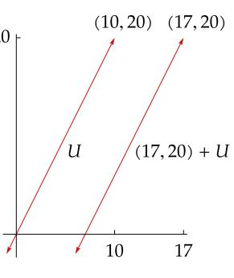

(17, 20) + *is parallel to the subspace .*

## 3.97 definition: *translate*

For ∈ and a subset of , the set + is said to be a *translate* of .

## 3.98 example: *translates*

- If is the line in <sup>2</sup> defined by = {(, 2) ∈ <sup>2</sup> ∶ ∈ }, then all lines in <sup>2</sup> with slope 2 are translates of . See Example [3.96](#page-112-0) above for a drawing of and one of its translates.
- More generally, if is a line in 2 , then the set of all translates of is the set of all lines in 2 that are parallel to .
- If = {(, , 0) ∈ <sup>3</sup> ∶ , ∈ }, then the translates of are the planes in 3 that are parallel to the -plane .
- More generally, if is a plane in 3 , then the set of all translates of is the set of all planes in 3 that are parallel to (see, for example, Exercise [7\)](#page-116-1).

## 3.99 definition: *quotient space,* /

Suppose is a subspace of . Then the *quotient space* / is the set of all translates of . Thus

$$V/U = \{v + U : v \in V\}.$$

<span id="page-113-1"></span>3.100 example: quotient spaces

- If  $U = \{(x, 2x) \in \mathbb{R}^2 : x \in \mathbb{R}\}$ , then  $\mathbb{R}^2/U$  is the set of all lines in  $\mathbb{R}^2$  that have slope 2.
- If U is a line in  $\mathbb{R}^3$  containing the origin, then  $\mathbb{R}^3/U$  is the set of all lines in  $\mathbb{R}^3$  parallel to U.
- If U is a plane in  $\mathbb{R}^3$  containing the origin, then  $\mathbb{R}^3/U$  is the set of all planes in  $\mathbb{R}^3$  parallel to U.

Our next goal is to make V/U into a vector space. To do this, we will need the next result.

#### 3.101 two translates of a subspace are equal or disjoint

<span id="page-113-0"></span>Suppose U is a subspace of V and  $v, w \in V$ . Then

$$v - w \in U \iff v + U = w + U \iff (v + U) \cap (w + U) \neq \emptyset.$$

Proof First suppose  $v - w \in U$ . If  $u \in U$ , then

$$v + u = w + ((v - w) + u) \in w + U.$$

Thus  $v + U \subseteq w + U$ . Similarly,  $w + U \subseteq v + U$ . Thus v + U = w + U, completing the proof that  $v - w \in U$  implies v + U = w + U.

The equation v + U = w + U implies that  $(v + U) \cap (w + U) \neq \emptyset$ .

Now suppose  $(v + U) \cap (w + U) \neq \emptyset$ . Thus there exist  $u_1, u_2 \in U$  such that

$$v + u_1 = w + u_2.$$

Thus  $v - w = u_2 - u_1$ . Hence  $v - w \in U$ , showing that  $(v + U) \cap (w + U) \neq \emptyset$  implies  $v - w \in U$ , which completes the proof.

Now we can define addition and scalar multiplication on V/U.

## 3.102 definition: addition and scalar multiplication on V/U

Suppose U is a subspace of V. Then addition and scalar multiplication are defined on V/U by

$$(v + U) + (w + U) = (v + w) + U$$
$$\lambda(v + U) = (\lambda v) + U$$

for all  $v, w \in V$  and all  $\lambda \in F$ .

As part of the proof of the next result, we will show that the definitions above make sense.

#### <span id="page-114-0"></span>3.103 quotient space is a vector space

Suppose U is a subspace of V. Then V/U, with the operations of addition and scalar multiplication as defined above, is a vector space.

Proof The potential problem with the definitions above of addition and scalar multiplication on V/U is that the representation of a translate of U is not unique. Specifically, suppose  $v_1, v_2, w_1, w_2 \in V$  are such that

$$v_1 + U = v_2 + U$$
 and  $w_1 + U = w_2 + U$ .

To show that the definition of addition on V/U given above makes sense, we must show that  $(v_1 + w_1) + U = (v_2 + w_2) + U$ .

By 3.101, we have

$$v_1 - v_2 \in U$$
 and  $w_1 - w_2 \in U$ .

Because U is a subspace of V and thus is closed under addition, this implies that  $(v_1-v_2)+(w_1-w_2)\in U$ . Thus  $(v_1+w_1)-(v_2+w_2)\in U$ . Using 3.101 again, we see that

$$(v_1 + w_1) + U = (v_2 + w_2) + U,$$

as desired. Thus the definition of addition on V/U makes sense.

Similarly, suppose  $\lambda \in F$ . We are still assuming that  $v_1 + U = v_2 + U$ . Because U is a subspace of V and thus is closed under scalar multiplication, we have  $\lambda(v_1 - v_2) \in U$ . Thus  $\lambda v_1 - \lambda v_2 \in U$ . Hence 3.101 implies that

$$(\lambda v_1) + U = (\lambda v_2) + U.$$

Thus the definition of scalar multiplication on V/U makes sense.

Now that addition and scalar multiplication have been defined on V/U, the verification that these operations make V/U into a vector space is straightforward and is left to the reader. Note that the additive identity of V/U is 0 + U (which equals U) and that the additive inverse of v + U is (-v) + U.

The next concept will lead to a computation of the dimension of V/U.

#### 3.104 definition: quotient map, $\pi$

Suppose *U* is a subspace of *V*. The *quotient map*  $\pi$ :  $V \to V/U$  is the linear map defined by

$$\pi(v) = v + U$$

for each  $v \in V$ .

The reader should verify that  $\pi$  is indeed a linear map. Although  $\pi$  depends on U as well as V, these spaces are left out of the notation because they should be clear from the context.

## <span id="page-115-0"></span>3.105 *dimension of quotient space*

Suppose is finite-dimensional and is a subspace of . Then

$$\dim V/U = \dim V - \dim U.$$

Proof Let denote the quotient map from to /. If ∈ , then + = 0+ if and only if ∈ (by [3.101\)](#page-113-0), which implies that null = . The definition of implies range = /. The fundamental theorem of linear maps [\(3.21\)](#page-75-1) now implies dim = dim + dim /, which gives the desired result.

Each linear map on induces a linear map ̃ on /(null ), as defined below.

3.106 notation: ̃

Suppose ∈ ℒ(, ). Define ̃∶ /(null ) → by

$$\widetilde{T}(v + \text{null } T) = Tv.$$

To show that the definition of ̃ makes sense, suppose , ∈ are such that + null = + null . By [3.101,](#page-113-0) we have − ∈ null . Thus ( − ) = 0. Hence = . Thus the definition of ̃ indeed makes sense. The routine verification that ̃ is a linear map from /(null ) to is left to the reader.

The next result shows that we can think of ̃ as a modified version of , with a domain that produces a one-to-one map.

## 3.107 *null space and range of* ̃

Suppose ∈ ℒ(, ). Then

- (a) ̃ ∘ = , where is the quotient map of onto /(null );
- (b) ̃ is injective;
- (c) range ̃ = range ;
- (d) /(null ) and range are isomorphic vector spaces.

#### Proof

- (a) If ∈ , then ( ̃ ∘ )() = ̃(()) = ̃( + null ) = , as desired.
- (b) Suppose ∈ and ̃( + null ) = 0. Then = 0. Thus ∈ null . Hence [3.101](#page-113-0) implies that + null = 0 + null . This implies that null ̃ = {0 + null }. Hence ̃ is injective, as desired.
- (c) The definition of ̃ shows that range ̃ = range .
- (d) Now (b) and (c) imply that if we think of ̃ as mapping into range , then ̃ is an isomorphism from /(null ) onto range .

<span id="page-116-2"></span><span id="page-116-0"></span>1 Suppose *T* is a function from *V* to *W*. The *graph* of *T* is the subset of  $V \times W$  defined by

graph of 
$$T = \{(v, Tv) \in V \times W : v \in V\}.$$

Prove that T is a linear map if and only if the graph of T is a subspace of  $V \times W$ .

Formally, a function T from V to W is a subset T of  $V \times W$  such that for each  $v \in V$ , there exists exactly one element  $(v, w) \in T$ . In other words, formally a function is what is called above its graph. We do not usually think of functions in this formal manner. However, if we do become formal, then this exercise could be rephrased as follows: Prove that a function T from V to W is a linear map if and only if T is a subspace of  $V \times W$ .

- 2 Suppose that  $V_1, ..., V_m$  are vector spaces such that  $V_1 \times \cdots \times V_m$  is finite-dimensional. Prove that  $V_k$  is finite-dimensional for each k = 1, ..., m.
- **3** Suppose  $V_1, ..., V_m$  are vector spaces. Prove that  $\mathcal{L}(V_1 \times \cdots \times V_m, W)$  and  $\mathcal{L}(V_1, W) \times \cdots \times \mathcal{L}(V_m, W)$  are isomorphic vector spaces.

There is no assumption in the exercise above or in the two following exercises that the vector spaces are finite-dimensional.

- **4** Suppose  $W_1, ..., W_m$  are vector spaces. Prove that  $\mathcal{L}(V, W_1 \times \cdots \times W_m)$  and  $\mathcal{L}(V, W_1) \times \cdots \times \mathcal{L}(V, W_m)$  are isomorphic vector spaces.
- 5 For m a positive integer, define  $V^m$  by

$$V^m = \underbrace{V \times \cdots \times V}_{m \text{ times}}.$$

Prove that  $V^m$  and  $\mathcal{L}(\mathbf{F}^m, V)$  are isomorphic vector spaces.

- 6 Suppose that v, x are vectors in V and that U, W are subspaces of V such that v + U = x + W. Prove that U = W.
- <span id="page-116-1"></span>7 Let  $U = \{(x, y, z) \in \mathbb{R}^3 : 2x + 3y + 5z = 0\}$ . Suppose  $A \subseteq \mathbb{R}^3$ . Prove that A is a translate of U if and only if there exists  $c \in \mathbb{R}$  such that

$$A = \{(x, y, z) \in \mathbf{R}^3 : 2x + 3y + 5z = c\}.$$

- **8** (a) Suppose  $T \in \mathcal{L}(V, W)$  and  $c \in W$ . Prove that  $\{x \in V : Tx = c\}$  is either the empty set or is a translate of null T.
  - (b) Explain why the set of solutions to a system of linear equations such as 3.27 is either the empty set or is a translate of some subspace of  $\mathbf{F}^n$ .
- 9 Prove that a nonempty subset A of V is a translate of some subspace of V if and only if  $\lambda v + (1 \lambda) w \in A$  for all  $v, w \in A$  and all  $\lambda \in F$ .
- 10 Suppose  $A_1 = v + U_1$  and  $A_2 = w + U_2$  for some  $v, w \in V$  and some subspaces  $U_1, U_2$  of V. Prove that the intersection  $A_1 \cap A_2$  is either a translate of some subspace of V or is the empty set.

- 11 Suppose  $U = \{(x_1, x_2, \dots) \in \mathbf{F}^{\infty} : x_k \neq 0 \text{ for only finitely many } k\}$ .
  - (a) Show that *U* is a subspace of  $\mathbf{F}^{\infty}$ .
  - (b) Prove that  $\mathbf{F}^{\infty}/U$  is infinite-dimensional.
- 12 Suppose  $v_1, ..., v_m \in V$ . Let

$$A = \{\lambda_1 v_1 + \dots + \lambda_m v_m : \lambda_1, \dots, \lambda_m \in \mathbf{F} \text{ and } \lambda_1 + \dots + \lambda_m = 1\}.$$

- (a) Prove that A is a translate of some subspace of V.
- (b) Prove that if B is a translate of some subspace of V and  $\{v_1, ..., v_m\} \subseteq B$ , then  $A \subseteq B$ .
- (c) Prove that *A* is a translate of some subspace of *V* of dimension less than *m*.
- Suppose *U* is a subspace of *V* such that V/U is finite-dimensional. Prove that *V* is isomorphic to  $U \times (V/U)$ .
- **14** Suppose U and W are subspaces of V and  $V = U \oplus W$ . Suppose  $w_1, ..., w_m$  is a basis of W. Prove that  $w_1 + U, ..., w_m + U$  is a basis of V/U.
- Suppose *U* is a subspace of *V* and  $v_1 + U, ..., v_m + U$  is a basis of V/U and  $u_1, ..., u_n$  is a basis of *U*. Prove that  $v_1, ..., v_m, u_1, ..., u_n$  is a basis of *V*.
- **16** Suppose  $\varphi \in \mathcal{L}(V, \mathbf{F})$  and  $\varphi \neq 0$ . Prove that dim  $V/(\text{null }\varphi) = 1$ .
- Suppose *U* is a subspace of *V* such that dim V/U = 1. Prove that there exists  $\varphi \in \mathcal{L}(V, \mathbf{F})$  such that null  $\varphi = U$ .
- **18** Suppose that U is a subspace of V such that V/U is finite-dimensional.
  - (a) Show that if W is a finite-dimensional subspace of V and V = U + W, then dim  $W \ge \dim V/U$ .
  - (b) Prove that there exists a finite-dimensional subspace W of V such that  $\dim W = \dim V/U$  and  $V = U \oplus W$ .
- Suppose  $T \in \mathcal{L}(V, W)$  and U is a subspace of V. Let  $\pi$  denote the quotient map from V onto V/U. Prove that there exists  $S \in \mathcal{L}(V/U, W)$  such that  $T = S \circ \pi$  if and only if  $U \subseteq \text{null } T$ .

## <span id="page-118-4"></span><span id="page-118-0"></span>3F Duality

## <span id="page-118-1"></span>Dual Space and Dual Map

Linear maps into the scalar field F play a special role in linear algebra, and thus they get a special name.

#### 3.108 definition: linear functional

A *linear functional* on V is a linear map from V to F. In other words, a linear functional is an element of  $\mathcal{L}(V, F)$ .

#### 3.109 example: linear functionals

- Define  $\varphi \colon \mathbb{R}^3 \to \mathbb{R}$  by  $\varphi(x, y, z) = 4x 5y + 2z$ . Then  $\varphi$  is a linear functional on  $\mathbb{R}^3$ .
- Fix  $(c_1,...,c_n) \in \mathbf{F}^n$ . Define  $\varphi \colon \mathbf{F}^n \to \mathbf{F}$  by  $\varphi(x_1,...,x_n) = c_1x_1 + \cdots + c_nx_n$ . Then  $\varphi$  is a linear functional on  $\mathbf{F}^n$ .
- Define  $\varphi \colon \mathcal{P}(\mathbf{R}) \to \mathbf{R}$  by

$$\varphi(p) = 3p''(5) + 7p(4).$$

Then  $\varphi$  is a linear functional on  $\mathcal{P}(\mathbf{R})$ .

• Define  $\varphi \colon \mathcal{P}(\mathbf{R}) \to \mathbf{R}$  by

$$\varphi(p) = \int_0^1 p$$

for each  $p \in \mathcal{P}(\mathbf{R})$ . Then  $\varphi$  is a linear functional on  $\mathcal{P}(\mathbf{R})$ .

The vector space  $\mathcal{L}(V, \mathbf{F})$  also gets a special name and special notation.

## 3.110 definition: $dual\ space,\ V'$

<span id="page-118-3"></span>The *dual space* of V, denoted by V', is the vector space of all linear functionals on V. In other words,  $V' = \mathcal{L}(V, \mathbf{F})$ .

## 3.111 $\dim V' = \dim V$

<span id="page-118-2"></span>Suppose V is finite-dimensional. Then V' is also finite-dimensional and

$$\dim V' = \dim V$$

Proof By 3.72 we have

$$\dim V' = \dim \mathcal{L}(V, \mathbf{F}) = (\dim V)(\dim \mathbf{F}) = \dim V,$$

as desired.

<span id="page-119-4"></span>In the following definition, the linear map lemma (3.4) implies that each  $\varphi_j$  is well defined.

#### 3.112 definition: dual basis

<span id="page-119-2"></span>If  $v_1, ..., v_n$  is a basis of V, then the *dual basis* of  $v_1, ..., v_n$  is the list  $\varphi_1, ..., \varphi_n$  of elements of V', where each  $\varphi_i$  is the linear functional on V such that

$$\varphi_j(v_k) = \begin{cases} 1 & \text{if } k = j, \\ 0 & \text{if } k \neq j. \end{cases}$$

## <span id="page-119-1"></span>3.113 example: the dual basis of the standard basis of $\mathbf{F}^n$

Suppose n is a positive integer. For  $1 \le j \le n$ , define  $\varphi_j$  to be the linear functional on  $\mathbf{F}^n$  that selects the  $j^{\text{th}}$  coordinate of a vector in  $\mathbf{F}^n$ . Thus

$$\varphi_j(x_1,...,x_n) = x_j$$

for each  $(x_1, ..., x_n) \in \mathbf{F}^n$ .

Let  $e_1, ..., e_n$  be the standard basis of  $\mathbf{F}^n$ . Then

$$\varphi_j(e_k) = \begin{cases} 1 & \text{if } k = j, \\ 0 & \text{if } k \neq j. \end{cases}$$

Thus  $\varphi_1, ..., \varphi_n$  is the dual basis of the standard basis  $e_1, ..., e_n$  of  $\mathbf{F}^n$ .

The next result shows that the dual basis of a basis of V consists of the linear functionals on V that give the coefficients for expressing a vector in V as a linear combination of the basis vectors.

## 3.114 dual basis gives coefficients for linear combination

<span id="page-119-3"></span>Suppose  $v_1,...,v_n$  is a basis of V and  $\varphi_1,...,\varphi_n$  is the dual basis. Then

$$v = \varphi_1(v) v_1 + \dots + \varphi_n(v) v_n$$

for each  $v \in V$ .

Proof Suppose  $v \in V$ . Then there exist  $c_1, ..., c_n \in F$  such that

$$3.115 v = c_1 v_1 + \dots + c_n v_n.$$

If  $j \in \{1, ..., n\}$ , then applying  $\varphi_j$  to both sides of the equation above gives

<span id="page-119-0"></span>
$$\varphi_j(v) = c_j$$
.

Substituting the values for  $c_1, ..., c_n$  given by the equation above into 3.115 shows that  $v = \varphi_1(v)v_1 + \cdots + \varphi_n(v)v_n$ .

<span id="page-120-2"></span>The next result shows that the dual basis is indeed a basis of the dual space. Thus the terminology "dual basis" is justified.

#### 3.116 dual basis is a basis of the dual space

Suppose V is finite-dimensional. Then the dual basis of a basis of V is a basis of V'.

Proof Suppose  $v_1, ..., v_n$  is a basis of V. Let  $\varphi_1, ..., \varphi_n$  denote the dual basis. To show that  $\varphi_1, ..., \varphi_n$  is a linearly independent list of elements of V', suppose  $a_1, ..., a_n \in F$  are such that

3.117 
$$a_1 \varphi_1 + \dots + a_n \varphi_n = 0.$$

Now

<span id="page-120-0"></span>
$$(a_1\varphi_1 + \dots + a_n\varphi_n)(v_k) = a_k$$

for each k=1,...,n. Thus 3.117 shows that  $a_1=\cdots=a_n=0$ . Hence  $\varphi_1,...,\varphi_n$  is linearly independent.

Because  $\varphi_1, ..., \varphi_n$  is a linearly independent list in V' whose length equals dim V' (by 3.111), we can conclude that  $\varphi_1, ..., \varphi_n$  is a basis of V' (see 2.38).

In the definition below, note that if T is a linear map from V to W then T' is a linear map from W' to V'.

## 3.118 definition: dual map, T'

<span id="page-120-1"></span>Suppose  $T \in \mathcal{L}(V, W)$ . The *dual map* of T is the linear map  $T' \in \mathcal{L}(W', V')$  defined for each  $\varphi \in W'$  by

$$T'(\varphi) = \varphi \circ T.$$

If  $T \in \mathcal{L}(V, W)$  and  $\varphi \in W'$ , then  $T'(\varphi)$  is defined above to be the composition of the linear maps  $\varphi$  and T. Thus  $T'(\varphi)$  is indeed a linear map from V to  $\mathbf{F}$ ; in other words,  $T'(\varphi) \in V'$ .

The following two bullet points show that T' is a linear map from W' to V'.

• If  $\varphi, \psi \in W'$ , then

$$T'(\varphi + \psi) = (\varphi + \psi) \circ T = \varphi \circ T + \psi \circ T = T'(\varphi) + T'(\psi).$$

• If  $\lambda \in \mathbf{F}$  and  $\varphi \in W'$ , then

$$T'(\lambda\varphi)=(\lambda\varphi)\circ T=\lambda(\varphi\circ T)=\lambda T'(\varphi).$$

The prime notation appears with two unrelated meanings in the next example: D' denotes the dual of the linear map D, and p' denotes the derivative of a polynomial p.

3.119 example: dual map of the differentiation linear map

Define  $D: \mathcal{P}(\mathbf{R}) \to \mathcal{P}(\mathbf{R})$  by Dp = p'.

• Suppose  $\varphi$  is the linear functional on  $\mathcal{P}(\mathbf{R})$  defined by  $\varphi(p) = p(3)$ . Then  $D'(\varphi)$  is the linear functional on  $\mathcal{P}(\mathbf{R})$  given by

$$(D'(\varphi))(p) = (\varphi \circ D)(p) = \varphi(Dp) = \varphi(p') = p'(3).$$

Thus  $D'(\varphi)$  is the linear functional on  $\mathcal{P}(\mathbf{R})$  taking p to p'(3).

• Suppose  $\varphi$  is the linear functional on  $\mathcal{P}(\mathbf{R})$  defined by  $\varphi(p) = \int_0^1 p$ . Then  $D'(\varphi)$  is the linear functional on  $\mathcal{P}(\mathbf{R})$  given by

$$(D'(\varphi))(p) = (\varphi \circ D)(p)$$

$$= \varphi(Dp)$$

$$= \varphi(p')$$

$$= \int_0^1 p'$$

$$= p(1) - p(0).$$

Thus  $D'(\varphi)$  is the linear functional on  $\mathcal{P}(\mathbf{R})$  taking p to p(1) - p(0).

In the next result, (a) and (b) imply that the function that takes T to T' is a linear map from  $\mathcal{L}(V, W)$  to  $\mathcal{L}(W', V')$ .

In (c) below, note the reversal of order from ST on the left to T'S' on the right.

## 3.120 algebraic properties of dual maps

<span id="page-121-0"></span>Suppose  $T \in \mathcal{L}(V, W)$ . Then

- (a) (S + T)' = S' + T' for all  $S \in \mathcal{L}(V, W)$ ;
- (b)  $(\lambda T)' = \lambda T'$  for all  $\lambda \in \mathbf{F}$ ;
- (c) (ST)' = T'S' for all  $S \in \mathcal{L}(W, U)$ .

Proof The proofs of (a) and (b) are left to the reader.

To prove (c), suppose  $\varphi \in U'$ . Then

$$(ST)'(\varphi) = \varphi \circ (ST) = (\varphi \circ S) \circ T = T'(\varphi \circ S) = T'\big(S'(\varphi)\big) = \big(T'S'\big)(\varphi),$$

where the first, third, and fourth equalities above hold because of the definition of the dual map, the second equality holds because composition of functions is associative, and the last equality follows from the definition of composition.

The equation above shows that  $(ST)'(\varphi) = (T'S')(\varphi)$  for all  $\varphi \in U'$ . Thus (ST)' = T'S'.

Some books use the notation  $V^*$  and  $T^*$  for duality instead of V' and T'. However, here we reserve the notation  $T^*$  for the adjoint, which will be introduced when we study linear maps on inner product spaces in Chapter 7.

## <span id="page-122-2"></span><span id="page-122-0"></span>Null Space and Range of Dual of Linear Map

Our goal in this subsection is to describe null T' and range T' in terms of range T and null T. To do this, we will need the next definition.

3.121 definition: annihilator,  $U^0$ 

For  $U \subseteq V$ , the *annihilator* of U, denoted by  $U^0$ , is defined by

$$U^0 = \{ \varphi \in V' : \varphi(u) = 0 \text{ for all } u \in U \}.$$

#### 3.122 example: *element of an annihilator*

Suppose U is the subspace of  $\mathcal{P}(\mathbf{R})$  consisting of polynomial multiples of  $x^2$ . If  $\varphi$  is the linear functional on  $\mathcal{P}(\mathbf{R})$  defined by  $\varphi(p) = p'(0)$ , then  $\varphi \in U^0$ .

For  $U \subseteq V$ , the annihilator  $U^0$  is a subset of the dual space V'. Thus  $U^0$  depends on the vector space containing U, so a notation such as  $U_V^0$  would be more precise. However, the containing vector space will always be clear from the context, so we will use the simpler notation  $U^0$ .

## <span id="page-122-1"></span>3.123 example: the annihilator of a two-dimensional subspace of $\mathbb{R}^5$

Let  $e_1, e_2, e_3, e_4, e_5$  denote the standard basis of  $\mathbf{R}^5$ ; let  $\varphi_1, \varphi_2, \varphi_3, \varphi_4, \varphi_5 \in (\mathbf{R}^5)'$  denote the dual basis of  $e_1, e_2, e_3, e_4, e_5$ . Suppose

$$U = \operatorname{span}(e_1, e_2) = \{ (x_1, x_2, 0, 0, 0) \in \mathbf{R}^5 : x_1, x_2 \in \mathbf{R} \}.$$

We want to show that  $U^0 = \text{span}(\varphi_3, \varphi_4, \varphi_5)$ .

Recall (see 3.113) that  $\varphi_j$  is the linear functional on  $\mathbb{R}^5$  that selects the  $j^{\text{th}}$  coordinate:  $\varphi_i(x_1, x_2, x_3, x_4, x_5) = x_i$ .

First suppose  $\varphi \in \text{span}(\varphi_3, \varphi_4, \varphi_5)$ . Then there exist  $c_3, c_4, c_5 \in \mathbf{R}$  such that  $\varphi = c_3 \varphi_3 + c_4 \varphi_4 + c_5 \varphi_5$ . If  $(x_1, x_2, 0, 0, 0) \in U$ , then

$$\varphi(x_1,x_2,0,0,0) = (c_3\varphi_3 + c_4\varphi_4 + c_5\varphi_5)(x_1,x_2,0,0,0) = 0.$$

Thus  $\varphi \in U^0$ . Hence we have shown that  $\operatorname{span}(\varphi_3, \varphi_4, \varphi_5) \subseteq U^0$ .

To show the inclusion in the other direction, suppose that  $\varphi \in U^0$ . Because the dual basis is a basis of  $(\mathbf{R}^5)'$ , there exist  $c_1, c_2, c_3, c_4, c_5 \in \mathbf{R}$  such that  $\varphi = c_1 \varphi_1 + c_2 \varphi_2 + c_3 \varphi_3 + c_4 \varphi_4 + c_5 \varphi_5$ . Because  $e_1 \in U$  and  $\varphi \in U^0$ , we have

$$0 = \varphi(e_1) = (c_1\varphi_1 + c_2\varphi_2 + c_3\varphi_3 + c_4\varphi_4 + c_5\varphi_5)(e_1) = c_1.$$

Similarly,  $e_2 \in U$  and thus  $c_2 = 0$ . Hence  $\varphi = c_3\varphi_3 + c_4\varphi_4 + c_5\varphi_5$ . Thus  $\varphi \in \text{span}(\varphi_3, \varphi_4, \varphi_5)$ , which shows that  $U^0 \subseteq \text{span}(\varphi_3, \varphi_4, \varphi_5)$ .

Thus  $U^0 = \operatorname{span}(\varphi_3, \varphi_4, \varphi_5)$ .

#### 3.124 the annihilator is a subspace

Suppose  $U \subseteq V$ . Then  $U^0$  is a subspace of V'.

Proof Note that  $0 \in U^0$  (here 0 is the zero linear functional on V) because the zero linear functional applied to every vector in U equals  $0 \in F$ .

Suppose  $\varphi, \psi \in U^0$ . Thus  $\varphi, \psi \in V'$  and  $\varphi(u) = \psi(u) = 0$  for every  $u \in U$ . If  $u \in U$ , then

$$(\varphi + \psi)(u) = \varphi(u) + \psi(u) = 0 + 0 = 0.$$

Thus  $\varphi + \psi \in U^0$ .

Similarly,  $U^0$  is closed under scalar multiplication. Thus 1.34 implies that  $U^0$  is a subspace of V'.

The next result shows that dim  $U^0$  is the difference of dim V and dim U. For example, this shows that if U is a two-dimensional subspace of  $\mathbf{R}^5$ , then  $U^0$  is a three-dimensional subspace of  $(\mathbf{R}^5)'$ , as in Example 3.123.

The next result can be proved following the pattern of Example 3.123: choose a basis  $u_1, ..., u_m$  of U, extend to a basis  $u_1, ..., u_m, ..., u_n$  of V, let  $\varphi_1, ..., \varphi_m, ..., \varphi_n$  be the dual basis of V', and then show that  $\varphi_{m+1}, ..., \varphi_n$  is a basis of  $U^0$ , which implies the desired result. You should construct the proof just outlined, even though a slicker proof is presented here.

## 3.125 *dimension of the annihilator*

<span id="page-123-0"></span>Suppose V is finite-dimensional and U is a subspace of V. Then

$$\dim U^0 = \dim V - \dim U.$$

Proof Let  $i \in \mathcal{L}(U, V)$  be the inclusion map defined by i(u) = u for each  $u \in U$ . Thus i' is a linear map from V' to U'. The fundamental theorem of linear maps (3.21) applied to i' shows that

<span id="page-123-1"></span>
$$\dim \operatorname{range} i' + \dim \operatorname{null} i' = \dim V'.$$

However, null  $i' = U^0$  (as can be seen by thinking about the definitions) and  $\dim V' = \dim V$  (by 3.111), so we can rewrite the equation above as

3.126 
$$\dim \operatorname{range} i' + \dim U^0 = \dim V.$$

If  $\varphi \in U'$ , then  $\varphi$  can be extended to a linear functional  $\psi$  on V (see, for example, Exercise 13 in Section 3A). The definition of i' shows that  $i'(\psi) = \varphi$ . Thus  $\varphi \in \text{range } i'$ , which implies that range i' = U'. Hence

$$\dim \operatorname{range} i' = \dim U' = \dim U,$$

and then 3.126 becomes the equation  $\dim U + \dim U^0 = \dim V$ , as desired.

<span id="page-124-2"></span>The next result can be a useful tool to show that a subspace is as big as possible—see (a)—or to show that a subspace is as small as possible—see (b).

## 3.127 condition for the annihilator to equal {0} or the whole space

<span id="page-124-0"></span>Suppose V is finite-dimensional and U is a subspace of V. Then

- (a)  $U^0 = \{0\} \iff U = V;$
- (b)  $U^0 = V' \iff U = \{0\}.$

Proof To prove (a), we have

$$U^0 = \{0\} \iff \dim U^0 = 0$$
  
 $\iff \dim U = \dim V$   
 $\iff U = V,$ 

where the second equivalence follows from 3.125 and the third equivalence follows from 2.39.

Similarly, to prove (b) we have

$$\begin{split} U^0 &= V' &\iff \dim U^0 = \dim V' \\ &\iff \dim U^0 = \dim V \\ &\iff \dim U = 0 \\ &\iff U = \{0\}, \end{split}$$

where one direction of the first equivalence follows from 2.39, the second equivalence follows from 3.111, and the third equivalence follows from 3.125.

The proof of (a) in the next result does not use the hypothesis that *V* and *W* are finite-dimensional.

## 3.128 the null space of T'

<span id="page-124-1"></span>Suppose V and W are finite-dimensional and  $T \in \mathcal{L}(V, W)$ . Then

- (a)  $\operatorname{null} T' = (\operatorname{range} T)^0$ ;
- (b)  $\dim \operatorname{null} T' = \dim \operatorname{null} T + \dim W \dim V$ .

#### Proof

(a) First suppose  $\varphi \in \operatorname{null} T'$ . Thus  $0 = T'(\varphi) = \varphi \circ T$ . Hence

$$0 = (\varphi \circ T)(v) = \varphi(Tv)$$
 for every  $v \in V$ .

Thus  $\varphi \in (\text{range } T)^0$ . This implies that null  $T' \subseteq (\text{range } T)^0$ .

To prove the inclusion in the opposite direction, now suppose  $\varphi \in (\operatorname{range} T)^0$ . Thus  $\varphi(Tv) = 0$  for every vector  $v \in V$ . Hence  $0 = \varphi \circ T = T'(\varphi)$ . In other words,  $\varphi \in \operatorname{null} T'$ , which shows that  $(\operatorname{range} T)^0 \subseteq \operatorname{null} T'$ , completing the proof of (a).

<span id="page-125-2"></span>(b) We have

$$\dim \operatorname{null} T' = \dim(\operatorname{range} T)^{0}$$

$$= \dim W - \dim \operatorname{range} T$$

$$= \dim W - (\dim V - \dim \operatorname{null} T)$$

$$= \dim \operatorname{null} T + \dim W - \dim V,$$

where the first equality comes from (a), the second equality comes from [3.125,](#page-123-0) and the third equality comes from the fundamental theorem of linear maps [\(3.21\)](#page-75-1).

The next result can be useful because sometimes it is easier to verify that ′ is injective than to show directly that is surjective.

#### 3.129 *surjective is equivalent to* ′ *injective*

<span id="page-125-0"></span>Suppose and are finite-dimensional and ∈ ℒ(, ). Then

 is surjective ⟺ ′ is injective.

Proof We have

$$T \in \mathcal{L}(V, W)$$
 is surjective  $\iff$  range  $T = W$ 

$$\iff (\text{range } T)^0 = \{0\}$$

$$\iff \text{null } T' = \{0\}$$

$$\iff T' \text{ is injective,}$$

where the second equivalence comes from [3.127\(](#page-124-0)a) and the third equivalence comes from [3.128\(](#page-124-1)a).

#### 3.130 *the range of* ′

<span id="page-125-1"></span>Suppose and are finite-dimensional and ∈ ℒ(, ). Then

- (a) dim range ′ = dim range ;
- (b) range ′ = (null )<sup>0</sup> .

#### Proof

(a) We have

$$\dim \operatorname{range} T' = \dim W' - \dim \operatorname{null} T'$$

$$= \dim W - \dim(\operatorname{range} T)^{0}$$

$$= \dim \operatorname{range} T,$$

where the first equality comes from [3.21,](#page-75-1) the second equality comes from [3.111](#page-118-2) and [3.128\(](#page-124-1)a), and the third equality comes from [3.125.](#page-123-0)

<span id="page-126-2"></span>(b) First suppose  $\varphi \in \text{range } T'$ . Thus there exists  $\psi \in W'$  such that  $\varphi = T'(\psi)$ . If  $\psi \in \text{null } T$ , then

$$\varphi(v) = \big(T'(\psi)\big)v = (\psi \circ T)(v) = \psi(Tv) = \psi(0) = 0.$$

Hence  $\varphi \in (\text{null } T)^0$ . This implies that range  $T' \subseteq (\text{null } T)^0$ .

We will complete the proof by showing that range T' and  $(\text{null } T)^0$  have the same dimension. To do this, note that

$$\dim \operatorname{range} T' = \dim \operatorname{range} T$$
  
=  $\dim V - \dim \operatorname{null} T$   
=  $\dim(\operatorname{null} T)^0$ ,

where the first equality comes from (a), the second equality comes from 3.21, and the third equality comes from 3.125.

The next result should be compared to 3.129.

## 3.131 T injective is equivalent to T' surjective

Suppose V and W are finite-dimensional and  $T \in \mathcal{L}(V, W)$ . Then

T is injective  $\iff$  T' is surjective.

Proof We have

$$T$$
 is injective  $\iff$  null  $T = \{0\}$   
 $\iff$  (null  $T$ )<sup>0</sup> =  $V'$   
 $\iff$  range  $T' = V'$ ,

where the second equivalence follows from 3.127(b) and the third equivalence follows from 3.130(b).

## <span id="page-126-0"></span>Matrix of Dual of Linear Map

The setting for the next result is the assumption that we have a basis  $v_1,...,v_n$  of V, along with its dual basis  $\varphi_1,...,\varphi_n$  of V'. We also have a basis  $w_1,...,w_m$  of W, along with its dual basis  $\psi_1,...,\psi_m$  of W'. Thus  $\mathcal{M}(T)$  is computed with respect to the bases just mentioned of V and W, and  $\mathcal{M}(T')$  is computed with respect to the dual bases just mentioned of W' and V'. Using these bases gives the following pretty result.

## 3.132 matrix of T' is transpose of matrix of T

<span id="page-126-1"></span>Suppose *V* and *W* are finite-dimensional and  $T \in \mathcal{L}(V, W)$ . Then

$$\mathcal{M}(T') = (\mathcal{M}(T))^{\mathsf{t}}.$$

<span id="page-127-1"></span>114

Proof Let  $A = \mathcal{M}(T)$  and  $C = \mathcal{M}(T')$ . Suppose  $1 \le j \le m$  and  $1 \le k \le n$ . From the definition of  $\mathcal{M}(T')$  we have

$$T'(\psi_j) = \sum_{r=1}^n C_{r,j} \varphi_r.$$

The left side of the equation above equals  $\psi_j \circ T$ . Thus applying both sides of the equation above to  $v_k$  gives

$$\begin{split} (\psi_j \circ T)(v_k) &= \sum_{r=1}^n C_{r,j} \varphi_r(v_k) \\ &= C_{k,j}. \end{split}$$

We also have

$$\begin{split} (\psi_j \circ T)(v_k) &= \psi_j(Tv_k) \\ &= \psi_j \bigg( \sum_{r=1}^m A_{r,k} w_r \bigg) \\ &= \sum_{r=1}^m A_{r,k} \psi_j(w_r) \\ &= A_{j,k}. \end{split}$$

Comparing the last line of the last two sets of equations, we have  $C_{k,j} = A_{j,k}$ . Thus  $C = A^t$ . In other words,  $\mathcal{M}(T') = (\mathcal{M}(T))^t$ , as desired.

Now we use duality to give an alternative proof that the column rank of a matrix equals the row rank of the matrix. This result was previously proved using different tools—see 3.57.

## 3.133 column rank equals row rank

<span id="page-127-0"></span>Suppose  $A \in \mathbb{F}^{m,n}$ . Then the column rank of A equals the row rank of A.

Proof Define  $T: \mathbf{F}^{n,1} \to \mathbf{F}^{m,1}$  by Tx = Ax. Thus  $\mathcal{M}(T) = A$ , where  $\mathcal{M}(T)$  is computed with respect to the standard bases of  $\mathbf{F}^{n,1}$  and  $\mathbf{F}^{m,1}$ . Now

column rank of 
$$A = \text{column rank of } \mathcal{M}(T)$$

$$= \dim \text{range } T$$

$$= \dim \text{range } T'$$

$$= \text{column rank of } \mathcal{M}(T')$$

$$= \text{column rank of } A^{\text{t}}$$

$$= \text{row rank of } A,$$

where the second equality comes from 3.78, the third equality comes from 3.130(a), the fourth equality comes from 3.78, the fifth equality comes from 3.132, and the last equality follows from the definitions of row and column rank.

See Exercise 8 in Section 7A for another alternative proof of the result above.

- <span id="page-128-0"></span>1 Explain why each linear functional is surjective or is the zero map.
- **2** Give three distinct examples of linear functionals on  $\mathbb{R}^{[0,1]}$ .
- **3** Suppose *V* is finite-dimensional and  $v \in V$  with  $v \neq 0$ . Prove that there exists  $\varphi \in V'$  such that  $\varphi(v) = 1$ .
- **4** Suppose *V* is finite-dimensional and *U* is a subspace of *V* such that  $U \neq V$ . Prove that there exists  $\varphi \in V'$  such that  $\varphi(u) = 0$  for every  $u \in U$  but  $\varphi \neq 0$ .
- 5 Suppose  $T \in \mathcal{L}(V, W)$  and  $w_1, ..., w_m$  is a basis of range T. Hence for each  $v \in V$ , there exist unique numbers  $\varphi_1(v), ..., \varphi_m(v)$  such that

$$Tv = \varphi_1(v)w_1 + \dots + \varphi_m(v)w_m,$$

thus defining functions  $\varphi_1, ..., \varphi_m$  from V to F. Show that each of the functions  $\varphi_1, ..., \varphi_m$  is a linear functional on V.

- **6** Suppose  $\varphi$ ,  $\beta$  ∈ V'. Prove that null  $\varphi$  ⊆ null  $\beta$  if and only if there exists c ∈ **F** such that  $\beta = c\varphi$ .
- 7 Suppose that  $V_1, ..., V_m$  are vector spaces. Prove that  $(V_1 \times \cdots \times V_m)'$  and  $V_1' \times \cdots \times V_m'$  are isomorphic vector spaces.
- **8** Suppose  $v_1, ..., v_n$  is a basis of V and  $\varphi_1, ..., \varphi_n$  is the dual basis of V'. Define  $\Gamma \colon V \to \mathbf{F}^n$  and  $\Lambda \colon \mathbf{F}^n \to V$  by

$$\Gamma(v) = (\varphi_1(v), ..., \varphi_n(v))$$
 and  $\Lambda(a_1, ..., a_n) = a_1v_1 + ... + a_nv_n$ .

Explain why  $\Gamma$  and  $\Lambda$  are inverses of each other.

9 Suppose m is a positive integer. Show that the dual basis of the basis  $1, x, ..., x^m$  of  $\mathcal{P}_m(\mathbf{R})$  is  $\varphi_0, \varphi_1, ..., \varphi_m$ , where

$$\varphi_k(p) = \frac{p^{(k)}(0)}{k!}.$$

Here  $p^{(k)}$  denotes the  $k^{th}$  derivative of p, with the understanding that the  $0^{th}$  derivative of p is p.

- **10** Suppose *m* is a positive integer.
  - (a) Show that  $1, x 5, ..., (x 5)^m$  is a basis of  $\mathcal{P}_m(\mathbf{R})$ .
  - (b) What is the dual basis of the basis in (a)?
- Suppose  $v_1,...,v_n$  is a basis of V and  $\varphi_1,...,\varphi_n$  is the corresponding dual basis of V'. Suppose  $\psi \in V'$ . Prove that

$$\psi = \psi(v_1)\,\varphi_1 + \dots + \psi(v_n)\,\varphi_n.$$

- 12 Suppose  $S, T \in \mathcal{L}(V, W)$ .
  - (a) Prove that (S + T)' = S' + T'.
  - (b) Prove that  $(\lambda T)' = \lambda T'$  for all  $\lambda \in \mathbf{F}$ .

This exercise asks you to verify (a) and (b) in 3.120.

- Show that the dual map of the identity operator on V is the identity operator on V'.
- **14** Define  $T: \mathbb{R}^3 \to \mathbb{R}^2$  by

$$T(x, y, z) = (4x + 5y + 6z, 7x + 8y + 9z).$$

Suppose  $\varphi_1, \varphi_2$  denotes the dual basis of the standard basis of  $\mathbf{R}^2$  and  $\psi_1, \psi_2, \psi_3$  denotes the dual basis of the standard basis of  $\mathbf{R}^3$ .

- (a) Describe the linear functionals  $T'(\varphi_1)$  and  $T'(\varphi_2)$ .
- (b) Write  $T'(\varphi_1)$  and  $T'(\varphi_2)$  as linear combinations of  $\psi_1, \psi_2, \psi_3$ .
- 15 Define  $T: \mathcal{P}(\mathbf{R}) \to \mathcal{P}(\mathbf{R})$  by

$$(Tp)(x) = x^2p(x) + p''(x)$$

for each  $x \in \mathbf{R}$ .

- (a) Suppose  $\varphi \in \mathcal{P}(\mathbf{R})'$  is defined by  $\varphi(p) = p'(4)$ . Describe the linear functional  $T'(\varphi)$  on  $\mathcal{P}(\mathbf{R})$ .
- (b) Suppose  $\varphi \in \mathcal{P}(\mathbf{R})'$  is defined by  $\varphi(p) = \int_0^1 p$ . Evaluate  $(T'(\varphi))(x^3)$ .
- **16** Suppose *W* is finite-dimensional and  $T \in \mathcal{L}(V, W)$ . Prove that

$$T' = 0 \iff T = 0.$$

- Suppose V and W are finite-dimensional and  $T \in \mathcal{L}(V, W)$ . Prove that T is invertible if and only if  $T' \in \mathcal{L}(W', V')$  is invertible.
- Suppose V and W are finite-dimensional. Prove that the map that takes  $T \in \mathcal{L}(V, W)$  to  $T' \in \mathcal{L}(W', V')$  is an isomorphism of  $\mathcal{L}(V, W)$  onto  $\mathcal{L}(W', V')$ .
- **19** Suppose  $U \subseteq V$ . Explain why

$$U^0 = \{ \varphi \in V' : U \subseteq \text{null } \varphi \}.$$

20 Suppose V is finite-dimensional and U is a subspace of V. Show that

$$U = \{v \in V : \varphi(v) = 0 \text{ for every } \varphi \in U^0\}.$$

- 21 Suppose V is finite-dimensional and U and W are subspaces of V.
  - (a) Prove that  $W^0 \subseteq U^0$  if and only if  $U \subseteq W$ .
  - (b) Prove that  $W^0 = U^0$  if and only if U = W.

- 22 Suppose V is finite-dimensional and U and W are subspaces of V.
  - (a) Show that  $(U + W)^0 = U^0 \cap W^0$ .
  - (b) Show that  $(U \cap W)^0 = U^0 + W^0$ .
- 23 Suppose V is finite-dimensional and  $\varphi_1, ..., \varphi_m \in V'$ . Prove that the following three sets are equal to each other.
  - (a) span( $\varphi_1, ..., \varphi_m$ )
  - (b)  $\left( (\text{null } \varphi_1) \cap \cdots \cap (\text{null } \varphi_m) \right)^0$
  - (c)  $\{\varphi \in V' : (\text{null } \varphi_1) \cap \cdots \cap (\text{null } \varphi_m) \subseteq \text{null } \varphi\}$
- **24** Suppose *V* is finite-dimensional and  $v_1, ..., v_m \in V$ . Define a linear map  $\Gamma \colon V' \to \mathbf{F}^m$  by  $\Gamma(\varphi) = (\varphi(v_1), ..., \varphi(v_m))$ .
  - (a) Prove that  $v_1, ..., v_m$  spans V if and only if  $\Gamma$  is injective.
  - (b) Prove that  $v_1, ..., v_m$  is linearly independent if and only if  $\Gamma$  is surjective.
- Suppose V is finite-dimensional and  $\varphi_1, ..., \varphi_m \in V'$ . Define a linear map  $\Gamma \colon V \to \mathbf{F}^m$  by  $\Gamma(v) = (\varphi_1(v), ..., \varphi_m(v))$ .
  - (a) Prove that  $\varphi_1, ..., \varphi_m$  spans V' if and only if  $\Gamma$  is injective.
  - (b) Prove that  $\varphi_1, ..., \varphi_m$  is linearly independent if and only if  $\Gamma$  is surjective.
- **26** Suppose V is finite-dimensional and  $\Omega$  is a subspace of V'. Prove that

$$\Omega = \{ v \in V : \varphi(v) = 0 \text{ for every } \varphi \in \Omega \}^0.$$

27 Suppose  $T \in \mathcal{L}(\mathcal{P}_5(\mathbf{R}))$  and  $\operatorname{null} T' = \operatorname{span}(\varphi)$ , where  $\varphi$  is the linear functional on  $\mathcal{P}_5(\mathbf{R})$  defined by  $\varphi(p) = p(8)$ . Prove that

range 
$$T = \{ p \in \mathcal{P}_5(\mathbf{R}) : p(8) = 0 \}.$$

28 Suppose *V* is finite-dimensional and  $\varphi_1, ..., \varphi_m$  is a linearly independent list in *V'*. Prove that

$$\dim \bigl( (\operatorname{null} \varphi_1) \cap \cdots \cap (\operatorname{null} \varphi_m) \bigr) = (\dim V) - m.$$

- **29** Suppose *V* and *W* are finite-dimensional and  $T \in \mathcal{L}(V, W)$ .
  - (a) Prove that if  $\varphi \in W'$  and null  $T' = \operatorname{span}(\varphi)$ , then range  $T = \operatorname{null} \varphi$ .
  - (b) Prove that if  $\psi \in V'$  and range  $T' = \operatorname{span}(\psi)$ , then  $\operatorname{null} T = \operatorname{null} \psi$ .
- 30 Suppose *V* is finite-dimensional and  $\varphi_1, ..., \varphi_n$  is a basis of *V'*. Show that there exists a basis of *V* whose dual basis is  $\varphi_1, ..., \varphi_n$ .
- 31 Suppose *U* is a subspace of *V*. Let  $i: U \to V$  be the inclusion map defined by i(u) = u. Thus  $i' \in \mathcal{L}(V', U')$ .
  - (a) Show that null  $i' = U^0$ .
  - (b) Prove that if V is finite-dimensional, then range i' = U'.
  - (c) Prove that if V is finite-dimensional, then  $\tilde{i}'$  is an isomorphism from  $V'/U^0$  onto U'.

The isomorphism in (c) is natural in that it does not depend on a choice of basis in either vector space.

<span id="page-131-0"></span>118

32 The *double dual space* of V, denoted by V'', is defined to be the dual space of V'. In other words, V'' = (V')'. Define  $\Lambda \colon V \to V''$  by

$$(\Lambda v)(\varphi) = \varphi(v)$$

for each  $v \in V$  and each  $\varphi \in V'$ .

- (a) Show that  $\Lambda$  is a linear map from V to V''.
- (b) Show that if  $T \in \mathcal{L}(V)$ , then  $T'' \circ \Lambda = \Lambda \circ T$ , where T'' = (T')'.
- (c) Show that if V is finite-dimensional, then  $\Lambda$  is an isomorphism from V onto V''.

Suppose V is finite-dimensional. Then V and V' are isomorphic, but finding an isomorphism from V onto V' generally requires choosing a basis of V. In contrast, the isomorphism  $\Lambda$  from V onto V'' does not require a choice of basis and thus is considered more natural.

- Suppose *U* is a subspace of *V*. Let  $\pi: V \to V/U$  be the usual quotient map. Thus  $\pi' \in \mathcal{L}((V/U)', V')$ .
  - (a) Show that  $\pi'$  is injective.
  - (b) Show that range  $\pi' = U^0$ .
  - (c) Conclude that  $\pi'$  is an isomorphism from (V/U)' onto  $U^0$ .

The isomorphism in (c) is natural in that it does not depend on a choice of basis in either vector space. In fact, there is no assumption here that any of these vector spaces are finite-dimensional.

# <span id="page-132-1"></span>Chapter 4 *Polynomials*

<span id="page-132-0"></span>This chapter contains material on polynomials that we will use to investigate linear maps from a vector space to itself. Many results in this chapter will already be familiar to you from other courses; they are included here for completeness.

Because this chapter is not about linear algebra, your instructor may go through it rapidly. You may not be asked to scrutinize all the proofs. Make sure, however, that you at least read and understand the statements of all results in this chapter they will be used in later chapters.

This chapter begins with a brief discussion of algebraic properties of the complex numbers. Then we prove that a nonconstant polynomial cannot have more zeros than its degree. We also give a linear-algebra-based proof of the division algorithm for polynomials, which is worth reading even if you are already familiar with a proof that does not use linear algebra.

As we will see, the fundamental theorem of algebra leads to a factorization of every polynomial into degree-one factors if the scalar field is or to factors of degree at most two if the scalar field is .

*standing assumption for this chapter*

• denotes or .


*Statue of mathematician and poet Omar Khayyam* (*1048–1131*)*, whose algebra book written in 1070 contained the first serious study of cubic polynomials.*

<span id="page-133-0"></span>Before discussing polynomials with complex or real coefficients, we need to learn a bit more about the complex numbers.

4.1 definition: *real part,* Re *, imaginary part,* Im

Suppose = + , where and are real numbers.

- The *real part* of , denoted by Re , is defined by Re = .
- The *imaginary part* of , denoted by Im , is defined by Im = .

Thus for every complex number , we have

$$z = \operatorname{Re} z + (\operatorname{Im} z) i$$
.

4.2 definition: *complex conjugate, , absolute value,* ||

Suppose ∈ .

• The *complex conjugate* of ∈ , denoted by , is defined by

$$\bar{z} = \operatorname{Re} z - (\operatorname{Im} z) i.$$

• The *absolute value* of a complex number , denoted by ||, is defined by

$$|z| = \sqrt{(\text{Re } z)^2 + (\text{Im } z)^2}.$$

4.3 example: *real and imaginary part, complex conjugate, absolute value*

Suppose = 3 + 2. Then

- Re = 3 and Im = 2;
- = 3 − 2;
- || = <sup>√</sup>3 <sup>2</sup> + 2 <sup>2</sup> = √13.

Identifying a complex number ∈ with the ordered pair (Re , Im ) ∈ <sup>2</sup> identifies with 2 . Note that is a one-dimensional complex vector space, but we can also think of (identified with 2 ) as a two-dimensional real vector space.

The absolute value of each complex number is a nonnegative number. Specifically, if ∈ , then || equals the distance from the origin in 2 to the point (Re , Im ) ∈ <sup>2</sup> .

The real and imaginary parts, complex conjugate, and absolute value have the properties listed in the following multipart result.

*You should verify that* = *if and only if is a real number.*

## <span id="page-134-1"></span>4.4 *properties of complex numbers*

<span id="page-134-0"></span>Suppose , ∈ . Then the following equalities and inequalities hold.

**sum of and**

$$z + \overline{z} = 2 \operatorname{Re} z.$$

**difference of and**

$$z - \overline{z} = 2(\operatorname{Im} z)i.$$

**product of and**

$$z\overline{z} = |z|^2.$$

**additivity and multiplicativity of complex conjugate**

$$\overline{w+z} = \overline{w} + \overline{z}$$
 and  $\overline{wz} = \overline{w} \ \overline{z}$ .

**double complex conjugate**

$$\overline{\overline{z}} = z$$
.

**real and imaginary parts are bounded by** ||

$$|\operatorname{Re} z| \le |z| \text{ and } |\operatorname{Im} z| \le |z|.$$

**absolute value of the complex conjugate**

$$\left|\overline{z}\right|=|z|.$$

**multiplicativity of absolute value**

$$|wz| = |w||z|.$$

**triangle inequality**

$$|w+z| \le |w| + |z|.$$

Proof Except for the last item above, the routine verifications of the assertions above are left to the reader. To verify the triangle inequality, we have

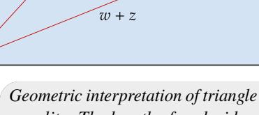

*Geometric interpretation of triangle inequality: The length of each side of a triangle is less than or equal to the sum of the lengths of the two other sides.*

$$|w + z|^2 = (w + z)(\overline{w} + \overline{z})$$

$$= w\overline{w} + z\overline{z} + w\overline{z} + z\overline{w}$$

$$= |w|^2 + |z|^2 + w\overline{z} + \overline{w}\overline{z}$$

$$= |w|^2 + |z|^2 + 2\operatorname{Re}(w\overline{z})$$

$$\leq |w|^2 + |z|^2 + 2|w\overline{z}|$$

$$= |w|^2 + |z|^2 + 2|w||z|$$

$$= (|w| + |z|)^2.$$

Taking square roots now gives the desired inequality | + | ≤ || + ||.

*See Exercise [2](#page-142-1) for the reverse triangle inequality.*

## <span id="page-135-3"></span><span id="page-135-0"></span>*Zeros of Polynomials*

Recall that a function ∶ → is called a polynomial of degree if there exist 0 , …, ∈ with ≠ 0 such that

$$p(z) = a_0 + a_1 z + \dots + a_m z^m$$

for all ∈ . A polynomial could have more than one degree if the representation of in the form above were not unique. Our first task is to show that this cannot happen.

The solutions to the equation () = 0 play a crucial role in the study of a polynomial ∈ (). Thus these solutions have a special name.

## 4.5 definition: *zero of a polynomial*

A number ∈ is called a *zero* (or *root*) of a polynomial ∈ () if

$$p(\lambda) = 0.$$

The next result is the key tool that we will use to show that the degree of a polynomial is unique.

## 4.6 *each zero of a polynomial corresponds to a degree-one factor*

<span id="page-135-2"></span>Suppose is a positive integer and ∈ () is a polynomial of degree . Suppose ∈ . Then () = 0 if and only if there exists a polynomial ∈ () of degree − 1 such that

$$p(z) = (z - \lambda) q(z)$$

for every ∈ .

Proof First suppose () = 0. Let <sup>0</sup> , <sup>1</sup> , …, ∈ be such that

$$p(z) = a_0 + a_1 z + \dots + a_m z^m$$

for all ∈ . Then

<span id="page-135-1"></span>4.7 
$$p(z) = p(z) - p(\lambda) = a_1(z - \lambda) + \dots + a_m(z^m - \lambda^m)$$

for all ∈ . For each ∈ {1, …, }, the equation

$$z^{k} - \lambda^{k} = (z - \lambda) \sum_{j=1}^{k} \lambda^{j-1} z^{k-j}$$

shows that − equals − times some polynomial of degree − 1. Thus [4.7](#page-135-1) shows that equals − times some polynomial of degree − 1, as desired.

To prove the implication in the other direction, now suppose that there is a polynomial ∈ () such that () = ( − )() for every ∈ . Then () = ( − )() = 0, as desired.

Now we can prove that polynomials do not have too many zeros.

## 4.8 degree m implies at most m zeros

<span id="page-136-1"></span>Suppose m is a positive integer and  $p \in \mathcal{P}(\mathbf{F})$  is a polynomial of degree m. Then p has at most m zeros in  $\mathbf{F}$ .

**Proof** We will use induction on m. The desired result holds if m = 1 because if  $a_1 \neq 0$  then the polynomial  $a_0 + a_1 z$  has only one zero (which equals  $-a_0/a_1$ ). Thus assume that m > 1 and the desired result holds for m - 1.

If p has no zeros in  $\mathbf{F}$ , then the desired result holds and we are done. Thus suppose p has a zero  $\lambda \in \mathbf{F}$ . By 4.6, there is polynomial  $q \in \mathcal{P}(\mathbf{F})$  of degree m-1 such that

$$p(z) = (z - \lambda)q(z)$$

for every  $z \in \mathbf{F}$ . Our induction hypothesis implies that q has at most m-1 zeros in  $\mathbf{F}$ . The equation above shows that the zeros of p in  $\mathbf{F}$  are exactly the zeros of q in  $\mathbf{F}$  along with  $\lambda$ . Thus p has at most m zeros in  $\mathbf{F}$ .

The result above implies that the coefficients of a polynomial are uniquely determined (because if a polynomial had two different sets of coefficients, then subtracting the two representations of the polynomial would give a polynomial with some nonzero coefficients but infinitely many zeros). In particular, the degree of a polynomial is uniquely defined.

Recall that the degree of the 0 polynomial is defined to be  $-\infty$ . When necessary, use the expected arithmetic with  $-\infty$ . For example,  $-\infty < m$  and  $-\infty + m = -\infty$  for every integer m.

The 0 polynomial is declared to have degree  $-\infty$  so that exceptions are not needed for various reasonable results such as  $\deg(pq) = \deg p + \deg q$ .

## <span id="page-136-0"></span>Division Algorithm for Polynomials

If p and s are nonnegative integers, with  $s \neq 0$ , then there exist nonnegative integers q and r such that

$$p = sq + r$$

and r < s. Think of dividing p by s, getting quotient q with remainder r. Our next result gives an analogous result for polynomials. Thus the next result is often called the division algorithm for polynomials, although as stated here it is not really an algorithm, just a useful result.

The division algorithm for polynomials could be proved without using any linear algebra. However, as is appropriate for a linear algebra textbook, the proof given here uses linear algebra techniques

Think of the division algorithm for polynomials as giving a remainder polynomial r when the polynomial p is divided by the polynomial s.

and makes nice use of a basis of  $\mathcal{P}_n(\mathbf{F})$ , which is the (n+1)-dimensional vector space of polynomials with coefficients in  $\mathbf{F}$  and of degree at most n.

#### <span id="page-137-4"></span>4.9 division algorithm for polynomials

<span id="page-137-3"></span>Suppose that  $p, s \in \mathcal{P}(\mathbf{F})$ , with  $s \neq 0$ . Then there exist unique polynomials  $q, r \in \mathcal{P}(\mathbf{F})$  such that

$$p = sq + r$$

and  $\deg r < \deg s$ .

Proof Let  $n = \deg p$  and let  $m = \deg s$ . If n < m, then take q = 0 and r = p to get the desired equation p = sq + r with  $\deg r < \deg s$ . Thus we now assume that  $n \ge m$ .

<span id="page-137-1"></span>The list

4.10 
$$1, z, ..., z^{m-1}, s, zs, ..., z^{n-m}s$$

is linearly independent in  $\mathcal{P}_n(\mathbf{F})$  because each polynomial in this list has a different degree. Also, the list 4.10 has length n+1, which equals dim  $\mathcal{P}_n(\mathbf{F})$ . Hence 4.10 is a basis of  $\mathcal{P}_n(\mathbf{F})$  [by 2.38].

Because  $p \in \mathcal{P}_n(\mathbf{F})$  and 4.10 is a basis of  $\mathcal{P}_n(\mathbf{F})$ , there exist unique constants  $a_0, a_1, ..., a_{m-1} \in \mathbf{F}$  and  $b_0, b_1, ..., b_{n-m} \in \mathbf{F}$  such that

<span id="page-137-2"></span>4.11 
$$p = a_0 + a_1 z + \dots + a_{m-1} z^{m-1} + b_0 s + b_1 z s + \dots + b_{n-m} z^{n-m} s$$
$$= \underbrace{a_0 + a_1 z + \dots + a_{m-1} z^{m-1}}_{r} + s \underbrace{(b_0 + b_1 z + \dots + b_{n-m} z^{n-m})}_{q}.$$

With r and q as defined above, we see that p can be written as p = sq + r with  $\deg r < \deg s$ , as desired.

The uniqueness of  $q, r \in \mathcal{P}(\mathbf{F})$  satisfying these conditions follows from the uniqueness of the constants  $a_0, a_1, ..., a_{m-1} \in \mathbf{F}$  and  $b_0, b_1, ..., b_{n-m} \in \mathbf{F}$  satisfying 4.11.

## <span id="page-137-0"></span>Factorization of Polynomials over C

We have been handling polynomials with complex coefficients and polynomials with real coefficients simultaneously, letting **F** denote **R** or **C**. Now we will see differences between these two cases. First we treat polynomials with complex coefficients. Then we will use those results to prove corresponding results for polynomials with real coefficients.

The fundamental theorem of algebra is an existence theorem. Its proof does not lead to a method for finding zeros. The quadratic formula gives the zeros explicitly for polynomials of degree 2. Similar but more complicated formulas exist for polynomials of degree 3 and 4. No such formulas exist for polynomials of degree 5 and above.

Our proof of the fundamental theorem of algebra implicitly uses the result that a continuous real-valued function on a closed disk in  ${\bf R}^2$  attains a minimum value. A web search can lead you to several

<span id="page-138-1"></span>other proofs of the fundamental theorem of algebra. The proof using Liouville's theorem is particularly nice if you are comfortable with analytic functions. All proofs of the fundamental theorem of algebra need to use some analysis, because the result is not true if  $\mathbf{C}$  is replaced, for example, with the set of numbers of the form c+di where c,d are rational numbers.

## 4.12 fundamental theorem of algebra, first version

<span id="page-138-0"></span>Every nonconstant polynomial with complex coefficients has a zero in C.

Proof De Moivre's theorem, which you can prove using induction on k and the addition formulas for cosine and sine, states that if k is a positive integer and  $\theta \in \mathbb{R}$ , then

$$(\cos \theta + i \sin \theta)^k = \cos k\theta + i \sin k\theta.$$

Suppose  $w \in \mathbf{C}$  and k is a positive integer. Using polar coordinates, we know that there exist  $r \ge 0$  and  $\theta \in \mathbf{R}$  such that

$$r(\cos\theta + i\sin\theta) = w.$$

De Moivre's theorem implies that

$$\left(r^{1/k}\left(\cos\frac{\theta}{k}+i\sin\frac{\theta}{k}\right)\right)^k=w.$$

Thus every complex number has a  $k^{th}$  root, a fact that we will soon use.

Suppose p is a nonconstant polynomial with complex coefficients and highest-order nonzero term  $c_m z^m$ . Then  $|p(z)| \to \infty$  as  $|z| \to \infty$  (because  $|p(z)|/|z^m| \to |c_m|$  as  $|z| \to \infty$ ). Thus the continuous function  $z \mapsto |p(z)|$  has a global minimum at some point  $\zeta \in \mathbb{C}$ . To show that  $p(\zeta) = 0$ , suppose that  $p(\zeta) \neq 0$ .

Define a new polynomial q by

$$q(z) = \frac{p(z+\zeta)}{p(\zeta)}.$$

The function  $z \mapsto |q(z)|$  has a global minimum value of 1 at z = 0. Write

$$q(z) = 1 + a_k z^k + \dots + a_m z^m,$$

where k is the smallest positive integer such that the coefficient of  $z^k$  is nonzero; in other words,  $a_k \neq 0$ .

Let  $\beta \in \mathbf{C}$  be such that  $\beta^k = -\frac{1}{a_k}$ . There is a constant c > 1 such that if  $t \in (0,1)$ , then

$$|q(t\beta)| \le |1 + a_k t^k \beta^k| + t^{k+1} c$$
  
=  $1 - t^k (1 - tc)$ .

Thus taking t to be 1/(2c) in the inequality above, we have  $|q(t\beta)| < 1$ , which contradicts the assumption that the global minimum of  $z \mapsto |q(z)|$  is 1. This contradiction implies that  $p(\zeta) = 0$ , showing that p has a zero, as desired.

Computers can use clever numerical methods to find good approximations to the zeros of any polynomial, even when exact zeros cannot be found. For example, no one will ever give an exact formula for a zero of the polynomial p defined by

$$p(x) = x^5 - 5x^4 - 6x^3 + 17x^2 + 4x - 7.$$

However, a computer can find that the zeros of p are approximately the five numbers -1.87, -0.74, 0.62, 1.47, 5.51.

The first version of the fundamental theorem of algebra leads to the following factorization result for polynomials with complex coefficients. Note that in this factorization, the zeros of p are the numbers  $\lambda_1, ..., \lambda_m$ , which are the only values of z for which the right side of the equation in the next result equals 0.

## 4.13 fundamental theorem of algebra, second version

<span id="page-139-0"></span>If  $p \in \mathcal{P}(\mathbf{C})$  is a nonconstant polynomial, then p has a unique factorization (except for the order of the factors) of the form

$$p(z) = c(z - \lambda_1) \cdots (z - \lambda_m),$$

where  $c, \lambda_1, ..., \lambda_m \in \mathbf{C}$ .

**Proof** Let  $p \in \mathcal{P}(\mathbf{C})$  and let  $m = \deg p$ . We will use induction on m. If m = 1, then the desired factorization exists and is unique. So assume that m > 1 and that the desired factorization exists and is unique for all polynomials of degree m - 1.

First we will show that the desired factorization of p exists. By the first version of the fundamental theorem of algebra (4.12), p has a zero  $\lambda \in \mathbb{C}$ . By 4.6, there is a polynomial q of degree m-1 such that

$$p(z) = (z - \lambda) q(z)$$

for all  $z \in \mathbb{C}$ . Our induction hypothesis implies that q has the desired factorization, which when plugged into the equation above gives the desired factorization of p.

Now we turn to the question of uniqueness. The number c is uniquely determined as the coefficient of  $z^m$  in p. So we only need to show that except for the order, there is only one way to choose  $\lambda_1, ..., \lambda_m$ . If

$$(z-\lambda_1)\cdots(z-\lambda_m)=(z-\tau_1)\cdots(z-\tau_m)$$

for all  $z \in \mathbb{C}$ , then because the left side of the equation above equals 0 when  $z = \lambda_1$ , one of the  $\tau$ 's on the right side equals  $\lambda_1$ . Relabeling, we can assume that  $\tau_1 = \lambda_1$ . Now if  $z \neq \lambda_1$ , we can divide both sides of the equation above by  $z - \lambda_1$ , getting

$$(z-\lambda_2)\cdots(z-\lambda_m)=(z-\tau_2)\cdots(z-\tau_m)$$

for all  $z \in \mathbf{C}$  except possibly  $z = \lambda_1$ . Actually the equation above holds for all  $z \in \mathbf{C}$ , because otherwise by subtracting the right side from the left side we would get a nonzero polynomial that has infinitely many zeros. The equation above and our induction hypothesis imply that except for the order, the  $\lambda$ 's are the same as the  $\tau$ 's, completing the proof of uniqueness.

## <span id="page-140-0"></span>*Factorization of Polynomials over*

A polynomial with real coefficients may have no real zeros. For example, the polynomial 1 + <sup>2</sup> has no real zeros.

To obtain a factorization theorem over , we will use our factorization theorem over . We begin with the next result.

*The failure of the fundamental theorem of algebra for accounts for the differences between linear algebra on real and complex vector spaces, as we will see in later chapters.*

## 4.14 *polynomials with real coefficients have nonreal zeros in pairs*

<span id="page-140-1"></span>Suppose ∈ () is a polynomial with real coefficients. If ∈ is a zero of , then so is .

Proof Let

$$p(z) = a_0 + a_1 z + \dots + a_m z^m,$$

where <sup>0</sup> , …, are real numbers. Suppose ∈ is a zero of . Then

$$a_0+a_1\lambda+\cdots+a_m\lambda^m=0.$$

Take the complex conjugate of both sides of this equation, obtaining

$$a_0+a_1\overline{\lambda}+\cdots+a_m\overline{\lambda}^m=0,$$

where we have used basic properties of the complex conjugate (see [4.4\)](#page-134-0). The equation above shows that is a zero of .

We want a factorization theorem for polynomials with real coefficients. We begin with the following result.

*Think about the quadratic formula in connection with the result below.*

## 4.15 *factorization of a quadratic polynomial*

Suppose , ∈ . Then there is a polynomial factorization of the form

$$x^2 + bx + c = (x - \lambda_1)(x - \lambda_2)$$

with <sup>1</sup> , <sup>2</sup> ∈ if and only if <sup>2</sup> ≥ 4.

Proof Notice that

$$x^{2} + bx + c = \left(x + \frac{b}{2}\right)^{2} + \left(c - \frac{b^{2}}{4}\right).$$

First suppose <sup>2</sup> < 4. Then the right side of the equation above is positive for every ∈ . Hence the polynomial <sup>2</sup> + + has no real zeros and thus

*The equation above is the basis of the technique called completing the square.*

cannot be factored in the form ( − <sup>1</sup> )( − <sup>2</sup> ) with <sup>1</sup> , <sup>2</sup> ∈ . Conversely, now suppose  $b^2 \ge 4c$ . Then there is a real number d such that  $d^2 = \frac{b^2}{4} - c$ . From the displayed equation above, we have

$$x^{2} + bx + c = \left(x + \frac{b}{2}\right)^{2} - d^{2}$$
$$= \left(x + \frac{b}{2} + d\right)\left(x + \frac{b}{2} - d\right),$$

which gives the desired factorization.

The next result gives a factorization of a polynomial over **R**. The idea of the proof is to use the second version of the fundamental theorem of algebra (4.13), which gives a factorization of p as a polynomial with complex coefficients. Complex but nonreal zeros of p come in pairs; see 4.14. Thus if the factorization of p as an element of  $\mathcal{P}(\mathbf{C})$  includes terms of the form  $(x-\lambda)$  with  $\lambda$  a nonreal complex number, then  $(x-\overline{\lambda})$  is also a term in the factorization. Multiplying together these two terms, we get

$$x^2 - 2(\operatorname{Re}\lambda)x + |\lambda|^2$$
,

which is a quadratic term of the required form.

The idea sketched in the paragraph above almost provides a proof of the existence of our desired factorization. However, we need to be careful about one point. Suppose  $\lambda$  is a nonreal complex number and  $(x - \lambda)$  is a term in the factorization of p as an element of  $\mathcal{P}(\mathbf{C})$ . We are guaranteed by 4.14 that  $(x - \overline{\lambda})$  also appears as a term in the factorization, but 4.14 does not state that these two factors appear the same number of times, as needed to make the idea above work. However, the proof works around this point.

In the next result, either m or M may equal 0. The numbers  $\lambda_1, ..., \lambda_m$  are precisely the real zeros of p, for these are the only real values of x for which the right side of the equation in the next result equals 0.

## 4.16 factorization of a polynomial over R

<span id="page-141-0"></span>Suppose  $p \in \mathcal{P}(\mathbf{R})$  is a nonconstant polynomial. Then p has a unique factorization (except for the order of the factors) of the form

$$p(x) = c(x-\lambda_1)\cdots(x-\lambda_m)\big(x^2+b_1x+c_1\big)\cdots\big(x^2+b_Mx+c_M\big),$$

where  $c, \lambda_1, ..., \lambda_m, b_1, ..., b_M, c_1, ..., c_M \in \mathbf{R}$ , with  $b_k^2 < 4c_k$  for each k.

Proof First we will prove that the desired factorization exists, and after that we will prove the uniqueness.

Think of p as an element of  $\mathcal{P}(\mathbf{C})$ . If all (complex) zeros of p are real, then we have the desired factorization by 4.13. Thus suppose p has a zero  $\lambda \in \mathbf{C}$  with  $\lambda \notin \mathbf{R}$ . By 4.14,  $\overline{\lambda}$  is a zero of p. Thus we can write

$$p(x) = (x - \lambda) (x - \overline{\lambda}) q(x)$$
$$= (x^2 - 2(\operatorname{Re} \lambda) x + |\lambda|^2) q(x)$$

<span id="page-142-2"></span>for some polynomial  $q \in \mathcal{P}(\mathbf{C})$  of degree two less than the degree of p. If we can prove that q has real coefficients, then using induction on the degree of p completes the proof of the existence part of this result.

To prove that q has real coefficients, we solve the equation above for q, getting

$$q(x) = \frac{p(x)}{x^2 - 2(\operatorname{Re}\lambda)x + |\lambda|^2}$$

for all  $x \in \mathbb{R}$ . The equation above implies that  $q(x) \in \mathbb{R}$  for all  $x \in \mathbb{R}$ . Writing

$$q(x) = a_0 + a_1 x + \dots + a_{n-2} x^{n-2},$$

where  $n = \deg p$  and  $a_0, ..., a_{n-2} \in \mathbb{C}$ , we thus have

$$0 = \operatorname{Im} q(x) = (\operatorname{Im} a_0) + (\operatorname{Im} a_1) x + \dots + (\operatorname{Im} a_{n-2}) x^{n-2}$$

for all  $x \in \mathbb{R}$ . This implies that  $\operatorname{Im} a_0, ..., \operatorname{Im} a_{n-2}$  all equal 0 (by 4.8). Thus all coefficients of q are real, as desired. Hence the desired factorization exists.

Now we turn to the question of uniqueness of our factorization. A factor of p of the form  $x^2 + b_k x + c_k$  with  $b_k^2 < 4c_k$  can be uniquely written as  $(x - \lambda_k)(x - \overline{\lambda_k})$  with  $\lambda_k \in \mathbf{C}$ . A moment's thought shows that two different factorizations of p as an element of  $\mathcal{P}(\mathbf{R})$  would lead to two different factorizations of p as an element of  $\mathcal{P}(\mathbf{C})$ , contradicting 4.13.

## <span id="page-142-0"></span>Exercises 4

- 1 Suppose  $w, z \in \mathbb{C}$ . Verify the following equalities and inequalities.
  - (a)  $z + \overline{z} = 2 \operatorname{Re} z$
  - (b)  $z \overline{z} = 2(\operatorname{Im} z)i$
  - (c)  $z\overline{z} = |z|^2$
  - (d)  $\overline{w+z} = \overline{w} + \overline{z}$  and  $\overline{wz} = \overline{w} \ \overline{z}$
  - (e)  $\overline{\overline{z}} = z$
  - (f)  $|\operatorname{Re} z| \le |z|$  and  $|\operatorname{Im} z| \le |z|$
  - (g)  $|\overline{z}| = |z|$
  - (h) |wz| = |w||z|

The results above are the parts of 4.4 that were left to the reader.

<span id="page-142-1"></span>2 Prove that if  $w, z \in \mathbb{C}$ , then  $|w| - |z| \le |w - z|$ .

The inequality above is called the **reverse triangle inequality**.

**3** Suppose *V* is a complex vector space and  $\varphi \in V'$ . Define  $\sigma \colon V \to \mathbf{R}$  by  $\sigma(v) = \operatorname{Re} \varphi(v)$  for each  $v \in V$ . Show that

$$\varphi(v) = \sigma(v) - i\sigma(iv)$$

for all  $v \in V$ .

**4** Suppose *m* is a positive integer. Is the set

$$\{0\} \cup \{p \in \mathcal{P}(\mathbf{F}) : \deg p = m\}$$

a subspace of  $\mathcal{P}(\mathbf{F})$ ?

5 Is the set

130

$$\{0\} \cup \{p \in \mathcal{P}(\mathbf{F}) : \deg p \text{ is even}\}$$

a subspace of  $\mathcal{P}(\mathbf{F})$ ?

- **6** Suppose that m and n are positive integers with  $m \le n$ , and suppose  $\lambda_1, ..., \lambda_m \in F$ . Prove that there exists a polynomial  $p \in \mathcal{P}(F)$  with  $\deg p = n$  such that  $0 = p(\lambda_1) = \cdots = p(\lambda_m)$  and such that p has no other zeros.
- 7 Suppose that m is a nonnegative integer,  $z_1,...,z_{m+1}$  are distinct elements of  $\mathbf{F}$ , and  $w_1,...,w_{m+1} \in \mathbf{F}$ . Prove that there exists a unique polynomial  $p \in \mathcal{P}_m(\mathbf{F})$  such that

$$p(z_k) = w_k$$

for each k = 1, ..., m + 1.

This result can be proved without using linear algebra. However, try to find the clearer, shorter proof that uses some linear algebra.

- 8 Suppose  $p \in \mathcal{P}(\mathbb{C})$  has degree m. Prove that p has m distinct zeros if and only if p and its derivative p' have no zeros in common.
- **9** Prove that every polynomial of odd degree with real coefficients has a real zero.
- 10 For  $p \in \mathcal{P}(\mathbf{R})$ , define  $Tp \colon \mathbf{R} \to \mathbf{R}$  by

$$(Tp)(x) = \begin{cases} \frac{p(x) - p(3)}{x - 3} & \text{if } x \neq 3, \\ p'(3) & \text{if } x = 3 \end{cases}$$

for each  $x \in \mathbf{R}$ . Show that  $Tp \in \mathcal{P}(\mathbf{R})$  for every polynomial  $p \in \mathcal{P}(\mathbf{R})$  and also show that  $T \colon \mathcal{P}(\mathbf{R}) \to \mathcal{P}(\mathbf{R})$  is a linear map.

11 Suppose  $p \in \mathcal{P}(\mathbf{C})$ . Define  $q : \mathbf{C} \to \mathbf{C}$  by

$$q(z) = p(z) \; \overline{p(\overline{z})}.$$

Prove that q is a polynomial with real coefficients.

- Suppose m is a nonnegative integer and  $p \in \mathcal{P}_m(\mathbb{C})$  is such that there are distinct real numbers  $x_0, x_1, ..., x_m$  with  $p(x_k) \in \mathbb{R}$  for each k = 0, 1, ..., m. Prove that all coefficients of p are real.
- 13 Suppose  $p \in \mathcal{P}(\mathbf{F})$  with  $p \neq 0$ . Let  $U = \{pq : q \in \mathcal{P}(\mathbf{F})\}$ .
  - (a) Show that dim  $\mathcal{P}(\mathbf{F})/U = \deg p$ .
  - (b) Find a basis of  $\mathcal{P}(\mathbf{F})/U$ .
- Suppose  $p, q \in \mathcal{P}(\mathbf{C})$  are nonconstant polynomials with no zeros in common. Let  $m = \deg p$  and  $n = \deg q$ . Use linear algebra as outlined below in (a)–(c) to prove that there exist  $r \in \mathcal{P}_{n-1}(\mathbf{C})$  and  $s \in \mathcal{P}_{m-1}(\mathbf{C})$  such that

$$rp + sq = 1$$
.

(a) Define  $T: \mathcal{P}_{n-1}(\mathbb{C}) \times \mathcal{P}_{m-1}(\mathbb{C}) \to \mathcal{P}_{m+n-1}(\mathbb{C})$  by

$$T(r,s) = rp + sq.$$

Show that the linear map T is injective.

- (b) Show that the linear map T in (a) is surjective.
- (c) Use (b) to conclude that there exist  $r \in \mathcal{P}_{n-1}(\mathbb{C})$  and  $s \in \mathcal{P}_{m-1}(\mathbb{C})$  such that rp + sq = 1.

## Chapter 5

# <span id="page-145-1"></span><span id="page-145-0"></span>*Eigenvalues and Eigenvectors*

Linear maps from one vector space to another vector space were the objects of study in Chapter [3.](#page-64-0) Now we begin our investigation of operators, which are linear maps from a vector space to itself. Their study constitutes the most important part of linear algebra.

To learn about an operator, we might try restricting it to a smaller subspace. Asking for that restriction to be an operator will lead us to the notion of invariant subspaces. Each one-dimensional invariant subspace arises from a vector that the operator maps into a scalar multiple of the vector. This path will lead us to eigenvectors and eigenvalues.

We will then prove one of the most important results in linear algebra: every operator on a finite-dimensional nonzero complex vector space has an eigenvalue. This result will allow us to show that for each operator on a finite-dimensional complex vector space, there is a basis of the vector space with respect to which the matrix of the operator has at least almost half its entries equal to 0.

## *standing assumptions for this chapter*

- denotes or .
- denotes a vector space over .


*Statue of Leonardo of Pisa* (*1170–1250, approximate dates*)*, also known as Fibonacci. Exercise [21](#page-187-0) in Section [5D](#page-176-0) shows how linear algebra can be used to find the explicit formula for the Fibonacci sequence shown on the front cover.*

## <span id="page-146-3"></span><span id="page-146-0"></span>5A Invariant Subspaces

## <span id="page-146-1"></span>Eigenvalues

#### 5.1 definition: operator

A linear map from a vector space to itself is called an operator.

Suppose 
$$T \in \mathcal{L}(V)$$
. If  $m \ge 2$  and  $V = V_1 \oplus \cdots \oplus V_m$ ,

Recall that we defined the notation  $\mathcal{L}(V)$  to mean  $\mathcal{L}(V, V)$ .

where each  $V_k$  is a nonzero subspace of V, then to understand the behavior of T we only need to understand the behavior of each  $T|_{V_k}$ ; here  $T|_{V_k}$  denotes the restriction of T to the smaller domain  $V_k$ . Dealing with  $T|_{V_k}$  should be easier than dealing with T because  $V_k$  is a smaller vector space than V.

However, if we intend to apply tools useful in the study of operators (such as taking powers), then we have a problem:  $T|_{V_k}$  may not map  $V_k$  into itself; in other words,  $T|_{V_k}$  may not be an operator on  $V_k$ . Thus we are led to consider only decompositions of V of the form above in which T maps each  $V_k$  into itself. Hence we now give a name to subspaces of V that get mapped into themselves by T.

#### 5.2 definition: invariant subspace

Suppose  $T \in \mathcal{L}(V)$ . A subspace U of V is called *invariant* under T if  $Tu \in U$  for every  $u \in U$ .

Thus U is invariant under T if  $T|_{U}$  is an operator on U.

## 5.3 example: subspace invariant under differentiation operator

Suppose that  $T \in \mathcal{L}(\mathcal{P}(\mathbf{R}))$  is defined by Tp = p'. Then  $\mathcal{P}_4(\mathbf{R})$ , which is a subspace of  $\mathcal{P}(\mathbf{R})$ , is invariant under T because if  $p \in \mathcal{P}(\mathbf{R})$  has degree at most 4, then p' also has degree at most 4.

## <span id="page-146-2"></span>5.4 example: four invariant subspaces, not necessarily all different

If  $T \in \mathcal{L}(V)$ , then the following subspaces of V are all invariant under T.

- {0} The subspace {0} is invariant under T because if  $u \in \{0\}$ , then u = 0 and hence  $Tu = 0 \in \{0\}$ .
- V The subspace V is invariant under T because if  $u \in V$ , then  $Tu \in V$ .
- null T The subspace null T is invariant under T because if  $u \in \text{null } T$ , then Tu = 0, and hence  $Tu \in \text{null } T$ .
- range T The subspace range T is invariant under T because if  $u \in \text{range } T$ , then  $Tu \in \text{range } T$ .

<span id="page-147-0"></span>Must an operator ∈ ℒ() have any invariant subspaces other than {0} and ? Later we will see that this question has an affirmative answer if is finite-dimensional and dim > 1 (for = ) or dim > 2 (for = ); see [5.19](#page-156-2) and Exercise [29](#page-166-0) in Section [5B.](#page-156-0)

The previous example noted that null and range are invariant under . However, these subspaces do not necessarily provide easy answers to the question above about the existence of invariant subspaces other than {0} and , because null may equal {0} and range may equal (this happens when is invertible).

We will return later to a deeper study of invariant subspaces. Now we turn to an investigation of the simplest possible nontrivial invariant subspaces—invariant subspaces of dimension one.

Take any ∈ with ≠ 0 and let equal the set of all scalar multiples of :

$$U = {\lambda v : \lambda \in \mathbf{F}} = \operatorname{span}(v).$$

Then is a one-dimensional subspace of (and every one-dimensional subspace of is of this form for an appropriate choice of ). If is invariant under an operator ∈ ℒ(), then ∈ , and hence there is a scalar ∈ such that

$$Tv = \lambda v.$$

Conversely, if = for some ∈ , then span() is a one-dimensional subspace of invariant under .

The equation = , which we have just seen is intimately connected with one-dimensional invariant subspaces, is important enough that the scalars and vectors satisfying it are given special names.

## 5.5 definition: *eigenvalue*

Suppose ∈ ℒ(). A number ∈ is called an *eigenvalue* of if there exists ∈ such that ≠ 0 and = .

In the definition above, we require that ≠ 0 because every scalar ∈ satisfies 0 = 0.

The comments above show that has a one-dimensional subspace invariant under if and only if has an eigenvalue.

*The word eigenvalue is half-German, half-English. The German prefix eigen means "own" in the sense of characterizing an intrinsic property.*

## 5.6 example: *eigenvalue*

Define an operator ∈ ℒ( <sup>3</sup>) by

$$T(x, y, z) = (7x + 3z, 3x + 6y + 9z, -6y)$$

for (, , ) ∈ <sup>3</sup> . Then (3, 1, −1) = (18, 6, −6) = 6(3, 1, −1). Thus 6 is an eigenvalue of .

<span id="page-148-3"></span>The equivalences in the next result, along with many deep results in linear algebra, are valid only in the context of finite-dimensional vector spaces.

## 5.7 *equivalent conditions to be an eigenvalue*

<span id="page-148-2"></span>Suppose is finite-dimensional, ∈ ℒ(), and ∈ . Then the following are equivalent.

- (a) is an eigenvalue of .
- (b) − is not injective.

*Reminder:* ∈ ℒ() *is the identity operator. Thus* = *for all* ∈ *.*

- (c) − is not surjective.
- (d) − is not invertible.

Proof Conditions (a) and (b) are equivalent because the equation = is equivalent to the equation ( − ) = 0. Conditions (b), (c), and (d) are equivalent by [3.65.](#page-97-1)

## 5.8 definition: *eigenvector*

Suppose ∈ ℒ() and ∈ is an eigenvalue of . A vector ∈ is called an *eigenvector* of corresponding to if ≠ 0 and = .

In other words, a nonzero vector ∈ is an eigenvector of an operator ∈ ℒ() if and only if is a scalar multiple of . Because = if and only if ( − ) = 0, a vector ∈ with ≠ 0 is an eigenvector of corresponding to if and only if ∈ null( − ).

## <span id="page-148-1"></span>5.9 example: *eigenvalues and eigenvectors*

Suppose ∈ ℒ( <sup>2</sup>) is defined by (, ) = (−, ).

- (a) First consider the case = . Then is a counterclockwise rotation by 90<sup>∘</sup> about the origin in 2 . An operator has an eigenvalue if and only if there exists a nonzero vector in its domain that gets sent by the operator to a scalar multiple of itself. A 90<sup>∘</sup> counterclockwise rotation of a nonzero vector in 2 cannot equal a scalar multiple of itself. Conclusion: if = , then has no eigenvalues (and thus has no eigenvectors).
- (b) Now consider the case = . To find eigenvalues of , we must find the scalars such that (, ) = (, ) has some solution other than = = 0. The equation (, ) = (, ) is equivalent to the simultaneous equations

$$-z = \lambda w, \quad w = \lambda z.$$

Substituting the value for given by the second equation into the first equation gives

<span id="page-148-0"></span>
$$-z = \lambda^2 z.$$

Now z cannot equal 0 [otherwise 5.10 implies that w = 0; we are looking for solutions to 5.10 such that (w, z) is not the 0 vector], so the equation above leads to the equation

$$-1 = \lambda^2$$

The solutions to this equation are  $\lambda = i$  and  $\lambda = -i$ .

You can verify that i and -i are eigenvalues of T. Indeed, the eigenvectors corresponding to the eigenvalue i are the vectors of the form (w, -wi), with  $w \in \mathbb{C}$  and  $w \neq 0$ . Furthermore, the eigenvectors corresponding to the eigenvalue -i are the vectors of the form (w, wi), with  $w \in \mathbb{C}$  and  $w \neq 0$ .

In the next proof, we again use the equivalence

$$Tv = \lambda v \iff (T - \lambda I)v = 0.$$

#### 5.11 linearly independent eigenvectors

<span id="page-149-0"></span>Suppose  $T \in \mathcal{L}(V)$ . Then every list of eigenvectors of T corresponding to distinct eigenvalues of T is linearly independent.

Proof Suppose the desired result is false. Then there exists a smallest positive integer m such that there exists a linearly dependent list  $v_1, ..., v_m$  of eigenvectors of T corresponding to distinct eigenvalues  $\lambda_1, ..., \lambda_m$  of T (note that  $m \ge 2$  because an eigenvector is, by definition, nonzero). Thus there exist  $a_1, ..., a_m \in F$ , none of which are 0 (because of the minimality of m), such that

$$a_1v_1 + \dots + a_mv_m = 0.$$

Apply  $T - \lambda_m I$  to both sides of the equation above, getting

$$a_1(\lambda_1-\lambda_m)v_1+\cdots+a_{m-1}(\lambda_{m-1}-\lambda_m)v_{m-1}=0.$$

Because the eigenvalues  $\lambda_1,...,\lambda_m$  are distinct, none of the coefficients above equal 0. Thus  $v_1,...,v_{m-1}$  is a linearly dependent list of m-1 eigenvectors of T corresponding to distinct eigenvalues, contradicting the minimality of m. This contradiction completes the proof.

The result above leads to a short proof of the result below, which puts an upper bound on the number of distinct eigenvalues that an operator can have.

5.12 operator cannot have more eigenvalues than dimension of vector space

<span id="page-149-1"></span>Suppose V is finite-dimensional. Then each operator on V has at most dim V distinct eigenvalues.

Proof Let  $T \in \mathcal{L}(V)$ . Suppose  $\lambda_1,...,\lambda_m$  are distinct eigenvalues of T. Let  $v_1,...,v_m$  be corresponding eigenvectors. Then 5.11 implies that the list  $v_1,...,v_m$  is linearly independent. Thus  $m \leq \dim V$  (see 2.22), as desired.

## <span id="page-150-1"></span><span id="page-150-0"></span>Polynomials Applied to Operators

The main reason that a richer theory exists for operators (which map a vector space into itself) than for more general linear maps is that operators can be raised to powers. In this subsection we define that notion and the concept of applying a polynomial to an operator. This concept will be the key tool that we use in the next section when we prove that every operator on a nonzero finite-dimensional complex vector space has an eigenvalue.

If T is an operator, then TT makes sense (see 3.7) and is also an operator on the same vector space as T. We usually write  $T^2$  instead of TT. More generally, we have the following definition of  $T^m$ .

#### 5.13 notation: $T^m$

Suppose  $T \in \mathcal{L}(V)$  and m is a positive integer.

- $T^m \in \mathcal{L}(V)$  is defined by  $T^m = \underbrace{T \cdots T}_{m \text{ times}}$ .
- $T^0$  is defined to be the identity operator I on V.
- If T is invertible with inverse  $T^{-1}$ , then  $T^{-m} \in \mathcal{L}(V)$  is defined by

$$T^{-m} = (T^{-1})^m$$
.

You should verify that if T is an operator, then

$$T^m T^n = T^{m+n}$$
 and  $(T^m)^n = T^{mn}$ ,

where m and n are arbitrary integers if T is invertible and are nonnegative integers if T is not invertible.

Having defined powers of an operator, we can now define what it means to apply a polynomial to an operator.

#### 5.14 notation: p(T)

Suppose  $T \in \mathcal{L}(V)$  and  $p \in \mathcal{P}(\mathbf{F})$  is a polynomial given by

$$p(z) = a_0 + a_1 z + a_2 z^2 + \dots + a_m z^m$$

for all  $z \in F$ . Then p(T) is the operator on V defined by

$$p(T) = a_0 I + a_1 T + a_2 T^2 + \dots + a_m T^m$$
.

This is a new use of the symbol p because we are applying p to operators, not just elements of  $\mathbf{F}$ . The idea here is that to evaluate p(T), we simply replace z with T in the expression defining p. Note that the constant term  $a_0$  in p(z) becomes the operator  $a_0I$  (which is a reasonable choice because  $a_0=a_0z^0$  and thus we should replace  $a_0$  with  $a_0T^0$ , which equals  $a_0I$ ).

## <span id="page-151-1"></span>5.15 example: a polynomial applied to the differentiation operator

Suppose  $D \in \mathcal{L}(\mathcal{P}(\mathbf{R}))$  is the differentiation operator defined by Dq = q' and p is the polynomial defined by  $p(x) = 7 - 3x + 5x^2$ . Then  $p(D) = 7I - 3D + 5D^2$ . Thus

$$(p(D))q = 7q - 3q' + 5q''$$

for every  $q \in \mathcal{P}(\mathbf{R})$ .

If we fix an operator  $T \in \mathcal{L}(V)$ , then the function from  $\mathcal{P}(\mathbf{F})$  to  $\mathcal{L}(V)$  given by  $p \mapsto p(T)$  is linear, as you should verify.

## 5.16 definition: product of polynomials

If  $p, q \in \mathcal{P}(\mathbf{F})$ , then  $pq \in \mathcal{P}(\mathbf{F})$  is the polynomial defined by

$$(pq)(z) = p(z)q(z)$$

for all  $z \in \mathbf{F}$ .

The order does not matter in taking products of polynomials of a single operator, as shown by (b) in the next result.

## 5.17 *multiplicative properties*

<span id="page-151-0"></span>Suppose  $p, q \in \mathcal{P}(\mathbf{F})$  and  $T \in \mathcal{L}(V)$ . Then

- (a) (pq)(T) = p(T)q(T);
- (b) p(T)q(T) = q(T)p(T).

Informal proof: When a product of polynomials is expanded using the distributive property, it does not matter whether the symbol is z or T.

#### Proof

(a) Suppose 
$$p(z) = \sum_{j=0}^{m} a_j z^j$$
 and  $q(z) = \sum_{k=0}^{n} b_k z^k$  for all  $z \in \mathbf{F}$ . Then

$$(pq)(z) = \sum_{j=0}^{m} \sum_{k=0}^{n} a_j b_k z^{j+k}.$$

Thus

$$(pq)(T) = \sum_{j=0}^{m} \sum_{k=0}^{n} a_j b_k T^{j+k}$$
$$= \left(\sum_{j=0}^{m} a_j T^j\right) \left(\sum_{k=0}^{n} b_k T^k\right)$$
$$= p(T) q(T).$$

(b) Using (a) twice, we have p(T)q(T) = (pq)(T) = (qp)(T) = q(T)p(T).

We observed earlier that if  $T \in \mathcal{L}(V)$ , then the subspaces null T and range T are invariant under T (see 5.4). Now we show that the null space and the range of every polynomial of T are also invariant under T.

## 5.18 null space and range of p(T) are invariant under T

<span id="page-152-1"></span>Suppose  $T \in \mathcal{L}(V)$  and  $p \in \mathcal{P}(\mathbf{F})$ . Then  $\operatorname{null} p(T)$  and range p(T) are invariant under T.

Proof Suppose  $u \in \text{null } p(T)$ . Then p(T)u = 0. Thus

$$\big(p(T)\big)(Tu)=\big(p(T)\,T\big)(u)=\big(T\,p(T)\big)(u)=T\big(p(T)\,u\big)=T(0)=0.$$

Hence  $Tu \in \text{null } p(T)$ . Thus null p(T) is invariant under T, as desired. Suppose  $u \in \text{range } p(T)$ . Then there exists  $v \in V$  such that u = p(T)v. Thus

$$Tu = T(p(T)v) = p(T)(Tv).$$

Hence  $Tu \in \text{range } p(T)$ . Thus range p(T) is invariant under T, as desired.

#### <span id="page-152-0"></span>Exercises 5A

- 1 Suppose  $T \in \mathcal{L}(V)$  and U is a subspace of V.
  - (a) Prove that if  $U \subseteq \text{null } T$ , then U is invariant under T.
  - (b) Prove that if range  $T \subseteq U$ , then U is invariant under T.
- 2 Suppose that  $T \in \mathcal{L}(V)$  and  $V_1, ..., V_m$  are subspaces of V invariant under T. Prove that  $V_1 + \cdots + V_m$  is invariant under T.
- 3 Suppose  $T \in \mathcal{L}(V)$ . Prove that the intersection of every collection of subspaces of V invariant under T is invariant under T.
- 4 Prove or give a counterexample: If V is finite-dimensional and U is a subspace of V that is invariant under every operator on V, then  $U = \{0\}$  or U = V.
- 5 Suppose  $T \in \mathcal{L}(\mathbf{R}^2)$  is defined by T(x, y) = (-3y, x). Find the eigenvalues of T
- **6** Define  $T \in \mathcal{L}(\mathbf{F}^2)$  by T(w, z) = (z, w). Find all eigenvalues and eigenvectors of T.
- 7 Define  $T \in \mathcal{L}(\mathbf{F}^3)$  by  $T(z_1, z_2, z_3) = (2z_2, 0, 5z_3)$ . Find all eigenvalues and eigenvectors of T.
- **8** Suppose  $P \in \mathcal{L}(V)$  is such that  $P^2 = P$ . Prove that if  $\lambda$  is an eigenvalue of P, then  $\lambda = 0$  or  $\lambda = 1$ .

<span id="page-153-1"></span>140

- **9** Define  $T: \mathcal{P}(\mathbf{R}) \to \mathcal{P}(\mathbf{R})$  by Tp = p'. Find all eigenvalues and eigenvectors of T.
- 10 Define  $T \in \mathcal{L}(\mathcal{P}_4(\mathbf{R}))$  by (Tp)(x) = xp'(x) for all  $x \in \mathbf{R}$ . Find all eigenvalues and eigenvectors of T.
- Suppose *V* is finite-dimensional,  $T \in \mathcal{L}(V)$ , and  $\alpha \in \mathbf{F}$ . Prove that there exists  $\delta > 0$  such that  $T \lambda I$  is invertible for all  $\lambda \in \mathbf{F}$  such that  $0 < |\alpha \lambda| < \delta$ .
- Suppose  $V = U \oplus W$ , where U and W are nonzero subspaces of V. Define  $P \in \mathcal{L}(V)$  by P(u+w) = u for each  $u \in U$  and each  $w \in W$ . Find all eigenvalues and eigenvectors of P.
- 13 Suppose  $T \in \mathcal{L}(V)$ . Suppose  $S \in \mathcal{L}(V)$  is invertible.
  - (a) Prove that T and  $S^{-1}TS$  have the same eigenvalues.
  - (b) What is the relationship between the eigenvectors of T and the eigenvectors of  $S^{-1}TS$ ?
- 14 Give an example of an operator on  $\mathbb{R}^4$  that has no (real) eigenvalues.
- Suppose V is finite-dimensional,  $T \in \mathcal{L}(V)$ , and  $\lambda \in F$ . Show that  $\lambda$  is an eigenvalue of T if and only if  $\lambda$  is an eigenvalue of the dual operator  $T' \in \mathcal{L}(V')$ .
- **16** Suppose  $v_1,...,v_n$  is a basis of V and  $T\in\mathcal{L}(V)$ . Prove that if  $\lambda$  is an eigenvalue of T, then

$$|\lambda| \le n \max\{\left| \mathcal{M}(T)_{j,k} \right| : 1 \le j, k \le n\},\,$$

where  $\mathcal{M}(T)_{j,k}$  denotes the entry in row j, column k of the matrix of T with respect to the basis  $v_1, ..., v_n$ .

See Exercise 19 in Section 6A for a different bound on  $|\lambda|$ .

<span id="page-153-0"></span>17 Suppose  $\mathbf{F} = \mathbf{R}$ ,  $T \in \mathcal{L}(V)$ , and  $\lambda \in \mathbf{R}$ . Prove that  $\lambda$  is an eigenvalue of T if and only if  $\lambda$  is an eigenvalue of the complexification  $T_{\mathbf{C}}$ .

See Exercise 33 in Section 3B for the definition of  $T_C$ .

- Suppose  $F = \mathbb{R}$ ,  $T \in \mathcal{L}(V)$ , and  $\lambda \in \mathbb{C}$ . Prove that  $\lambda$  is an eigenvalue of the complexification  $T_{\mathbb{C}}$  if and only if  $\overline{\lambda}$  is an eigenvalue of  $T_{\mathbb{C}}$ .
- 19 Show that the forward shift operator  $T \in \mathcal{L}(\mathbf{F}^{\infty})$  defined by

$$T(z_1,z_2,\dots) = (0,z_1,z_2,\dots)$$

has no eigenvalues.

**20** Define the backward shift operator  $S \in \mathcal{L}(\mathbf{F}^{\infty})$  by

$$S(z_1, z_2, z_3, \dots) = (z_2, z_3, \dots).$$

- (a) Show that every element of  $\mathbf{F}$  is an eigenvalue of S.
- (b) Find all eigenvectors of *S*.

- 21 Suppose  $T \in \mathcal{L}(V)$  is invertible.
  - (a) Suppose  $\lambda \in \mathbf{F}$  with  $\lambda \neq 0$ . Prove that  $\lambda$  is an eigenvalue of T if and only if  $\frac{1}{2}$  is an eigenvalue of  $T^{-1}$ .
  - (b) Prove that T and  $T^{-1}$  have the same eigenvectors.
- 22 Suppose  $T \in \mathcal{L}(V)$  and there exist nonzero vectors u and w in V such that

$$Tu = 3w$$
 and  $Tw = 3u$ .

Prove that 3 or -3 is an eigenvalue of T.

- 23 Suppose *V* is finite-dimensional and  $S, T \in \mathcal{L}(V)$ . Prove that *ST* and *TS* have the same eigenvalues.
- 24 Suppose *A* is an *n*-by-*n* matrix with entries in **F**. Define  $T \in \mathcal{L}(\mathbf{F}^n)$  by Tx = Ax, where elements of  $\mathbf{F}^n$  are thought of as *n*-by-1 column vectors.
  - (a) Suppose the sum of the entries in each row of *A* equals 1. Prove that 1 is an eigenvalue of *T*.
  - (b) Suppose the sum of the entries in each column of *A* equals 1. Prove that 1 is an eigenvalue of *T*.
- Suppose  $T \in \mathcal{L}(V)$  and u, w are eigenvectors of T such that u + w is also an eigenvector of T. Prove that u and w are eigenvectors of T corresponding to the same eigenvalue.
- Suppose  $T \in \mathcal{L}(V)$  is such that every nonzero vector in V is an eigenvector of T. Prove that T is a scalar multiple of the identity operator.
- Suppose that V is finite-dimensional and  $k \in \{1, ..., \dim V 1\}$ . Suppose  $T \in \mathcal{L}(V)$  is such that every subspace of V of dimension k is invariant under T. Prove that T is a scalar multiple of the identity operator.
- Suppose V is finite-dimensional and  $T \in \mathcal{L}(V)$ . Prove that T has at most  $1 + \dim \operatorname{range} T$  distinct eigenvalues.
- 29 Suppose  $T \in \mathcal{L}(\mathbb{R}^3)$  and -4, 5, and  $\sqrt{7}$  are eigenvalues of T. Prove that there exists  $x \in \mathbb{R}^3$  such that  $Tx 9x = (-4, 5, \sqrt{7})$ .
- **30** Suppose  $T \in \mathcal{L}(V)$  and (T-2I)(T-3I)(T-4I) = 0. Suppose  $\lambda$  is an eigenvalue of T. Prove that  $\lambda = 2$  or  $\lambda = 3$  or  $\lambda = 4$ .
- 31 Give an example of  $T \in \mathcal{L}(\mathbf{R}^2)$  such that  $T^4 = -I$ .
- 32 Suppose  $T \in \mathcal{L}(V)$  has no eigenvalues and  $T^4 = I$ . Prove that  $T^2 = -I$ .
- 33 Suppose  $T \in \mathcal{L}(V)$  and m is a positive integer.
  - (a) Prove that T is injective if and only if  $T^m$  is injective.
  - (b) Prove that T is surjective if and only if  $T^m$  is surjective.

- <span id="page-155-1"></span>Suppose V is finite-dimensional and  $v_1,...,v_m \in V$ . Prove that the list  $v_1,...,v_m$  is linearly independent if and only if there exists  $T \in \mathcal{L}(V)$  such that  $v_1,...,v_m$  are eigenvectors of T corresponding to distinct eigenvalues.
- 35 Suppose that  $\lambda_1, ..., \lambda_n$  is a list of distinct real numbers. Prove that the list  $e^{\lambda_1 x}, ..., e^{\lambda_n x}$  is linearly independent in the vector space of real-valued functions on **R**.

Hint: Let  $V = \text{span}(e^{\lambda_1 x}, ..., e^{\lambda_n x})$ , and define an operator  $D \in \mathcal{L}(V)$  by Df = f'. Find eigenvalues and eigenvectors of D.

- 36 Suppose that  $\lambda_1, ..., \lambda_n$  is a list of distinct positive numbers. Prove that the list  $\cos(\lambda_1 x), ..., \cos(\lambda_n x)$  is linearly independent in the vector space of real-valued functions on **R**.
- 37 Suppose *V* is finite-dimensional and  $T \in \mathcal{L}(V)$ . Define  $\mathcal{A} \in \mathcal{L}(\mathcal{L}(V))$  by

$$\mathcal{A}(S) = TS$$

for each  $S \in \mathcal{L}(V)$ . Prove that the set of eigenvalues of T equals the set of eigenvalues of A.

<span id="page-155-0"></span>38 Suppose V is finite-dimensional,  $T \in \mathcal{L}(V)$ , and U is a subspace of V invariant under T. The *quotient operator*  $T/U \in \mathcal{L}(V/U)$  is defined by

$$(T/U)(v+U) = Tv + U$$

for each  $v \in V$ .

- (a) Show that the definition of T/U makes sense (which requires using the condition that U is invariant under T) and show that T/U is an operator on V/U.
- (b) Show that each eigenvalue of T/U is an eigenvalue of T.
- Suppose V is finite-dimensional and  $T \in \mathcal{L}(V)$ . Prove that T has an eigenvalue if and only if there exists a subspace of V of dimension dim V-1 that is invariant under T.
- **40** Suppose  $S, T \in \mathcal{L}(V)$  and S is invertible. Suppose  $p \in \mathcal{P}(\mathbf{F})$  is a polynomial. Prove that

$$p(STS^{-1}) = Sp(T)S^{-1}.$$

- **41** Suppose  $T \in \mathcal{L}(V)$  and U is a subspace of V invariant under T. Prove that U is invariant under p(T) for every polynomial  $p \in \mathcal{P}(\mathbf{F})$ .
- **42** Define  $T \in \mathcal{L}(\mathbf{F}^n)$  by  $T(x_1, x_2, x_3, ..., x_n) = (x_1, 2x_2, 3x_3, ..., nx_n)$ .
  - (a) Find all eigenvalues and eigenvectors of T.
  - (b) Find all subspaces of  $\mathbf{F}^n$  that are invariant under T.
- Suppose that *V* is finite-dimensional, dim V > 1, and  $T \in \mathcal{L}(V)$ . Prove that  $\{p(T) : p \in \mathcal{P}(\mathbf{F})\} \neq \mathcal{L}(V)$ .

## <span id="page-156-0"></span>*5B The Minimal Polynomial*

## <span id="page-156-1"></span>*Existence of Eigenvalues on Complex Vector Spaces*

Now we come to one of the central results about operators on finite-dimensional complex vector spaces.

## 5.19 *existence of eigenvalues*

<span id="page-156-2"></span>Every operator on a finite-dimensional nonzero complex vector space has an eigenvalue.

Proof Suppose is a finite-dimensional complex vector space of dimension > 0 and ∈ ℒ(). Choose ∈ with ≠ 0. Then

$$v, Tv, T^2v, ..., T^nv$$

is not linearly independent, because has dimension and this list has length + 1. Hence some linear combination (with not all the coefficients equal to 0) of the vectors above equals 0. Thus there exists a nonconstant polynomial of smallest degree such that

$$p(T)v=0.$$

By the first version of the fundamental theorem of algebra (see [4.12\)](#page-138-0), there exists ∈ such that () = 0. Hence there exists a polynomial ∈ () such that

$$p(z) = (z - \lambda) q(z)$$

for every ∈ (see [4.6\)](#page-135-2). This implies (using [5.17\)](#page-151-0) that

$$0 = p(T)v = (T - \lambda I)(q(T)v).$$

Because has smaller degree than , we know that () ≠ 0. Thus the equation above implies that is an eigenvalue of with eigenvector ().

The proof above makes crucial use of the fundamental theorem of algebra. The comment following Exercise [16](#page-165-0) helps explain why the fundamental theorem of algebra is so tightly connected to the result above.

The hypothesis in the result above that = cannot be replaced with the hypothesis that = , as shown by Example [5.9.](#page-148-1) The next example shows that the finite-dimensional hypothesis in the result above also cannot be deleted.

5.20 example: *an operator on a complex vector space with no eigenvalues*

Define ∈ ℒ(()) by ()() = (). If ∈ () is a nonzero polynomial, then the degree of is one more than the degree of , and thus cannot equal a scalar multiple of . Hence has no eigenvalues.

Because () is infinite-dimensional, this example does not contradict the result above.

## <span id="page-157-3"></span><span id="page-157-0"></span>*Eigenvalues and the Minimal Polynomial*

In this subsection we introduce an important polynomial associated with each operator. We begin with the following definition.

## 5.21 definition: *monic polynomial*

A *monic polynomial* is a polynomial whose highest-degree coefficient equals 1.

For example, the polynomial 2 + 9<sup>2</sup> + 7 is a monic polynomial of degree 7.

## 5.22 *existence, uniqueness, and degree of minimal polynomial*

<span id="page-157-2"></span>Suppose is finite-dimensional and ∈ ℒ(). Then there is a unique monic polynomial ∈ () of smallest degree such that () = 0. Furthermore, deg ≤ dim .

Proof If dim = 0, then is the zero operator on and thus we take to be the constant polynomial 1.

Now use induction on dim . Thus assume that dim > 0 and that the desired result is true for all operators on all vector spaces of smaller dimension. Let ∈ be such that ≠ 0. The list , , …, dim has length 1 + dim and thus is linearly dependent. By the linear dependence lemma [\(2.19\)](#page-46-0), there is a smallest positive integer ≤ dim such that is a linear combination of , , …, − 1. Thus there exist scalars <sup>0</sup> , 1 , 2 , …, − 1 ∈ such that

5.23 
$$c_0 u + c_1 T u + \dots + c_{m-1} T^{m-1} u + T^m u = 0.$$

Define a monic polynomial ∈ () by

<span id="page-157-1"></span>
$$q(z) = c_0 + c_1 z + \dots + c_{m-1} z^{m-1} + z^m.$$

Then [5.23](#page-157-1) implies that () = 0.

If is a nonnegative integer, then

$$q(T)(T^k u) = T^k(q(T)u) = T^k(0) = 0.$$

The linear dependence lemma [\(2.19\)](#page-46-0) shows that , , …, − 1 is linearly independent. Thus the equation above implies that dim null () ≥ . Hence

$$\dim \operatorname{range} q(T) = \dim V - \dim \operatorname{null} q(T) \le \dim V - m.$$

Because range () is invariant under (by [5.18\)](#page-152-1), we can apply our induction hypothesis to the operator |range() on the vector space range (). Thus there is a monic polynomial ∈ () with

$$\deg s \leq \dim V - m$$
 and  $s(T|_{\operatorname{range} q(T)}) = 0$ .

Hence for all ∈ we have

$$((sq)(T))(v) = s(T)(q(T)v) = 0$$

because () ∈ range () and ()|range() = (|range()) = 0. Thus is a monic polynomial such that deg ≤ dim and ()() = 0.

<span id="page-158-2"></span>The paragraph above shows that there is a monic polynomial of degree at most dim V that when applied to T gives the 0 operator. Thus there is a monic polynomial of smallest degree with this property, completing the existence part of this result.

Let  $p \in \mathcal{P}(\mathbf{F})$  be a monic polynomial of smallest degree such that p(T) = 0. To prove the uniqueness part of the result, suppose  $r \in \mathcal{P}(\mathbf{F})$  is a monic polynomial of the same degree as p and r(T) = 0. Then (p-r)(T) = 0 and also  $\deg(p-r) < \deg p$ . If p-r were not equal to 0, then we could divide p-r by the coefficient of the highest-order term in p-r to get a monic polynomial (of smaller degree than p) that when applied to T gives the 0 operator. Thus p-r=0, as desired.

The previous result justifies the following definition.

#### 5.24 definition: minimal polynomial

<span id="page-158-1"></span>Suppose V is finite-dimensional and  $T \in \mathcal{L}(V)$ . Then the *minimal polynomial* of T is the unique monic polynomial  $p \in \mathcal{P}(\mathbf{F})$  of smallest degree such that p(T) = 0.

To compute the minimal polynomial of an operator  $T \in \mathcal{L}(V)$ , we need to find the smallest positive integer m such that the equation

$$c_0 I + c_1 T + \dots + c_{m-1} T^{m-1} = - T^m$$

has a solution  $c_0, c_1, ..., c_{m-1} \in \mathbf{F}$ . If we pick a basis of V and replace T in the equation above with the matrix of T, then the equation above can be thought of as a system of  $(\dim V)^2$  linear equations in the m unknowns  $c_0, c_1, ..., c_{m-1} \in \mathbf{F}$ . Gaussian elimination or another fast method of solving systems of linear equations can tell us whether a solution exists, testing successive values m=1,2,... until a solution exists. By 5.22, a solution exists for some smallest positive integer  $m \leq \dim V$ . The minimal polynomial of T is then  $c_0 + c_1 z + \cdots + c_{m-1} z^{m-1} + z^m$ .

<span id="page-158-0"></span>Even faster (usually), pick  $v \in V$  with  $v \neq 0$  and consider the equation

5.25 
$$c_0 v + c_1 T v + \dots + c_{\dim V - 1} T^{\dim V - 1} v = -T^{\dim V} v.$$

Use a basis of V to convert the equation above to a system of  $\dim V$  linear equations in  $\dim V$  unknowns  $c_0, c_1, ..., c_{\dim V - 1}$ . If this system of equations has a unique solution  $c_0, c_1, ..., c_{\dim V - 1}$  (as happens most of the time), then the scalars  $c_0, c_1, ..., c_{\dim V - 1}$ , 1 are the coefficients of the minimal polynomial of T (because 5.22 states that the degree of the minimal polynomial is at most  $\dim V$ ).

Consider operators on  $\mathbb{R}^4$  (thought of as 4-by-4 matrices with respect to the standard basis), and take v = (1, 0, 0, 0)

These estimates are based on testing millions of random matrices.

in the paragraph above. The faster method described above works on over 99.8% of the 4-by-4 matrices with integer entries in the interval [-10, 10] and on over 99.99% of the 4-by-4 matrices with integer entries in [-100, 100].

<span id="page-159-2"></span>146

The next example illustrates the faster procedure discussed above.

<span id="page-159-0"></span>5.26 example: minimal polynomial of an operator on  $\mathbf{F}^5$ 

Suppose  $T \in \mathcal{L}(\mathbf{F}^5)$  and

$$\mathcal{M}(T) = \left( \begin{array}{ccccc} 0 & 0 & 0 & 0 & -3 \\ 1 & 0 & 0 & 0 & 6 \\ 0 & 1 & 0 & 0 & 0 \\ 0 & 0 & 1 & 0 & 0 \\ 0 & 0 & 0 & 1 & 0 \end{array} \right)$$

with respect to the standard basis  $e_1, e_2, e_3, e_4, e_5$ . Taking  $v = e_1$  for 5.25, we have

$$\begin{split} Te_1 &= e_2, & T^4e_1 &= T\big(T^3e_1\big) = Te_4 = e_5, \\ T^2e_1 &= T(Te_1) = Te_2 = e_3, & T^5e_1 &= T\big(T^4e_1\big) = Te_5 = -3e_1 + 6e_2. \\ T^3e_1 &= T\big(T^2e_1\big) = Te_3 = e_4, \end{split}$$

Thus  $3e_1 - 6Te_1 = -T^5e_1$ . The list  $e_1, Te_1, T^2e_1, T^3e_1, T^4e_1$ , which equals the list  $e_1, e_2, e_3, e_4, e_5$ , is linearly independent, so no other linear combination of this list equals  $-T^5e_1$ . Hence the minimal polynomial of T is  $3 - 6z + z^5$ .

Recall that by definition, eigenvalues of operators on V and zeros of polynomials in  $\mathcal{P}(\mathbf{F})$  must be elements of  $\mathbf{F}$ . In particular, if  $\mathbf{F} = \mathbf{R}$ , then eigenvalues and zeros must be real numbers.

## 5.27 eigenvalues are the zeros of the minimal polynomial

<span id="page-159-1"></span>Suppose *V* is finite-dimensional and  $T \in \mathcal{L}(V)$ .

- (a) The zeros of the minimal polynomial of T are the eigenvalues of T.
- (b) If V is a complex vector space, then the minimal polynomial of T has the form

$$(z-\lambda_1)\cdots(z-\lambda_m),$$

where  $\lambda_1, ..., \lambda_m$  is a list of all eigenvalues of T, possibly with repetitions.

Proof Let p be the minimal polynomial of T.

(a) First suppose  $\lambda \in \mathbf{F}$  is a zero of p. Then p can be written in the form

$$p(z) = (z - \lambda)q(z),$$

where q is a monic polynomial with coefficients in **F** (see 4.6). Because p(T) = 0, we have

$$0 = (T - \lambda I) \big( q(T) v \big)$$

for all  $v \in V$ . Because  $\deg q = (\deg p) - 1$  and p is the minimal polynomial of T, there exists at least one vector  $v \in V$  such that  $q(T)v \neq 0$ . The equation above thus implies that  $\lambda$  is an eigenvalue of T, as desired.

To prove that every eigenvalue of is a zero of , now suppose ∈ is an eigenvalue of . Thus there exists ∈ with ≠ 0 such that = . Repeated applications of to both sides of this equation show that = for every nonnegative integer . Thus

$$p(T)v = p(\lambda)v.$$

Because is the minimal polynomial of , we have () = 0. Hence the equation above implies that () = 0. Thus is a zero of , as desired.

(b) To get the desired result, use (a) and the second version of the fundamental theorem of algebra (see [4.13\)](#page-139-0).

A nonzero polynomial has at most as many distinct zeros as its degree (see [4.8\)](#page-136-1). Thus (a) of the previous result, along with the result that the minimal polynomial of an operator on has degree at most dim , gives an alternative proof of [5.12,](#page-149-1) which states that an operator on has at most dim distinct eigenvalues.

Every monic polynomial is the minimal polynomial of some operator, as shown by Exercise [16,](#page-165-0) which generalizes Example [5.26.](#page-159-0) Thus [5.27\(](#page-159-1)a) shows that finding exact expressions for the eigenvalues of an operator is equivalent to the problem of finding exact expressions for the zeros of a polynomial (and thus is not possible for some operators).

<span id="page-160-0"></span>5.28 example: *An operator whose eigenvalues cannot be found exactly*

Let ∈ ℒ( <sup>5</sup>) be the operator defined by

$$T(z_1,z_2,z_3,z_4,z_5) = (-3z_5,z_1+6z_5,z_2,z_3,z_4).$$

The matrix of with respect to the standard basis of 5 is the 5-by-5 matrix in Example [5.26.](#page-159-0) As we showed in that example, the minimal polynomial of is the polynomial

$$3 - 6z + z^5.$$

No zero of the polynomial above can be expressed using rational numbers, roots of rational numbers, and the usual rules of arithmetic (a proof of this would take us considerably beyond linear algebra). Because the zeros of the polynomial above are the eigenvalues of [by [5.27\(](#page-159-1)a)], we cannot find an exact expression for any eigenvalue of in any familiar form.

Numeric techniques, which we will not discuss here, show that the zeros of the polynomial above, and thus the eigenvalues of , are approximately the following five complex numbers:

$$-1.67$$
,  $0.51$ ,  $1.40$ ,  $-0.12 + 1.59i$ ,  $-0.12 - 1.59i$ .

Note that the two nonreal zeros of this polynomial are complex conjugates of each other, as we expect for a polynomial with real coefficients (see [4.14\)](#page-140-1).

<span id="page-161-3"></span>The next result completely characterizes the polynomials that when applied to an operator give the 0 operator.

5.29 () = 0 ⟺ *is a polynomial multiple of the minimal polynomial*

<span id="page-161-1"></span>Suppose is finite-dimensional, ∈ ℒ(), and ∈ (). Then () = 0 if and only if is a polynomial multiple of the minimal polynomial of .

Proof Let denote the minimal polynomial of .

First suppose () = 0. By the division algorithm for polynomials [\(4.9\)](#page-137-3), there exist polynomials , ∈ () such that

$$5.30 q = ps + r$$

and deg < deg . We have

<span id="page-161-0"></span>
$$0 = q(T) = p(T)s(T) + r(T) = r(T).$$

The equation above implies that = 0 (otherwise, dividing by its highest-degree coefficient would produce a monic polynomial that when applied to gives 0; this polynomial would have a smaller degree than the minimal polynomial, which would be a contradiction). Thus [5.30](#page-161-0) becomes the equation = . Hence is a polynomial multiple of , as desired.

To prove the other direction, now suppose is a polynomial multiple of . Thus there exists a polynomial ∈ () such that = . We have

$$q(T) = p(T)s(T) = 0s(T) = 0,$$

as desired.

The next result is a nice consequence of the result above.

## 5.31 *minimal polynomial of a restriction operator*

<span id="page-161-2"></span>Suppose is finite-dimensional, ∈ ℒ(), and is a subspace of that is invariant under . Then the minimal polynomial of is a polynomial multiple of the minimal polynomial of |.

Proof Suppose is the minimal polynomial of . Thus () = 0 for all ∈ . In particular,

$$p(T)u = 0$$
 for all  $u \in U$ .

Thus (|) = 0. Now [5.29,](#page-161-1) applied to the operator | in place of , implies that is a polynomial multiple of the minimal polynomial of |.

See Exercise [25](#page-166-1) for a result about quotient operators that is analogous to the result above.

The next result shows that the constant term of the minimal polynomial of an operator determines whether the operator is invertible.

## <span id="page-162-2"></span>5.32 *not invertible* ⟺ *constant term of minimal polynomial of is* 0

Suppose is finite-dimensional and ∈ ℒ(). Then is not invertible if and only if the constant term of the minimal polynomial of is 0.

Proof Suppose ∈ ℒ() and is the minimal polynomial of . Then

is not invertible ⟺ 0 is an eigenvalue of

⟺ 0 is a zero of

⟺ the constant term of is 0,

where the first equivalence holds by [5.7,](#page-148-2) the second equivalence holds by [5.27\(](#page-159-1)a), and the last equivalence holds because the constant term of equals (0).

## <span id="page-162-0"></span>*Eigenvalues on Odd-Dimensional Real Vector Spaces*

The next result will be the key tool that we use to show that every operator on an odd-dimensional real vector space has an eigenvalue.

## 5.33 *even-dimensional null space*

<span id="page-162-1"></span>Suppose = and is finite-dimensional. Suppose also that ∈ ℒ() and , ∈ with <sup>2</sup> < 4. Then dim null( <sup>2</sup> + + ) is an even number.

Proof Recall that null( <sup>2</sup> ++) is invariant under (by [5.18\)](#page-152-1). By replacing with null( <sup>2</sup> + + ) and replacing with restricted to null( <sup>2</sup> + + ), we can assume that <sup>2</sup> + + = 0; we now need to prove that dim is even.

Suppose ∈ and ∈ are such that = . Then

$$0 = \left(T^2 + bT + cI\right)v = \left(\lambda^2 + b\lambda + c\right)v = \left(\left(\lambda + \frac{b}{2}\right)^2 + c - \frac{b^2}{4}\right)v.$$

The term in large parentheses above is a positive number. Thus the equation above implies that = 0. Hence we have shown that has no eigenvectors.

Let be a subspace of that is invariant under and has the largest dimension among all subspaces of that are invariant under and have even dimension. If = , then we are done; otherwise assume there exists ∈ such that ∉ .

Let = span(, ). Then is invariant under because () = − − . Furthermore, dim = 2 because otherwise would be an eigenvector of . Now

$$\dim(U+W) = \dim U + \dim W - \dim(U \cap W) = \dim U + 2,$$

where ∩ = {0} because otherwise ∩ would be a one-dimensional subspace of that is invariant under (impossible because has no eigenvectors).

Because + is invariant under , the equation above shows that there exists a subspace of invariant under of even dimension larger than dim . Thus the assumption that ≠ was incorrect. Hence has even dimension.

<span id="page-163-2"></span>The next result states that on odd-dimensional vector spaces, every operator has an eigenvalue. We already know this result for finite-dimensional complex vector spaces (without the odd hypothesis). Thus in the proof below, we will assume that = .

## 5.34 *operators on odd-dimensional vector spaces have eigenvalues*

<span id="page-163-1"></span>Every operator on an odd-dimensional vector space has an eigenvalue.

Proof Suppose = and is finite-dimensional. Let = dim , and suppose is an odd number. Let ∈ ℒ(). We will use induction on in steps of size two to show that has an eigenvalue. To get started, note that the desired result holds if dim = 1 because then every nonzero vector in is an eigenvector of .

Now suppose that ≥ 3 and the desired result holds for all operators on all odd-dimensional vector spaces of dimension less than . Let denote the minimal polynomial of . If is a polynomial multiple of − for some ∈ , then is an eigenvalue of [by [5.27\(](#page-159-1)a)] and we are done. Thus we can assume that there exist , ∈ such that <sup>2</sup> < 4 and is a polynomial multiple of <sup>2</sup> + + (see [4.16\)](#page-141-0).

There exists a monic polynomial ∈ () such that () = ()( <sup>2</sup>++) for all ∈ . Now

$$0 = p(T) = (q(T))(T^2 + bT + cI),$$

which means that () equals 0 on range( <sup>2</sup> + + ). Because deg < deg and is the minimal polynomial of , this implies that range( <sup>2</sup> + + ) ≠ .

The fundamental theorem of linear maps [\(3.21\)](#page-75-1) tells us that

$$\dim V = \dim \operatorname{null}(T^2 + bT + cI) + \dim \operatorname{range}(T^2 + bT + cI).$$

Because dim is odd (by hypothesis) and dim null( <sup>2</sup> + + ) is even (by [5.33\)](#page-162-1), the equation above shows that dim range( <sup>2</sup> + + ) is odd.

Hence range( <sup>2</sup> + + ) is a subspace of that is invariant under (by [5.18\)](#page-152-1) and that has odd dimension less than dim . Our induction hypothesis now implies that restricted to range( <sup>2</sup> + + ) has an eigenvalue, which means that has an eigenvalue.

See Exercise [23](#page-331-0) in Section [8B](#page-321-0) and Exercise [10](#page-380-1) in Section [9C](#page-367-0) for alternative proofs of the result above.

## <span id="page-163-0"></span>*Exercises 5B*

- **1** Suppose ∈ ℒ(). Prove that 9 is an eigenvalue of 2 if and only if 3 or −3 is an eigenvalue of .
- **2** Suppose is a complex vector space and ∈ ℒ() has no eigenvalues. Prove that every subspace of invariant under is either {0} or infinitedimensional.

**3** Suppose *n* is an integer with n > 1 and  $T \in \mathcal{L}(\mathbf{F}^n)$  is defined by

$$T(x_1,...,x_n) = (x_1 + \cdots + x_n,...,x_1 + \cdots + x_n).$$

- (a) Find all eigenvalues and eigenvectors of T.
- (b) Find the minimal polynomial of T.

The matrix of T with respect to the standard basis of  $\mathbf{F}^n$  consists of all 1's.

- <span id="page-164-0"></span>**4** Suppose  $\mathbf{F} = \mathbf{C}$ ,  $T \in \mathcal{L}(V)$ ,  $p \in \mathcal{P}(\mathbf{C})$  is a nonconstant polynomial, and  $\alpha \in \mathbf{C}$ . Prove that  $\alpha$  is an eigenvalue of p(T) if and only if  $\alpha = p(\lambda)$  for some eigenvalue  $\lambda$  of T.
- 5 Give an example of an operator on  $\mathbb{R}^2$  that shows the result in Exercise 4 does not hold if  $\mathbb{C}$  is replaced with  $\mathbb{R}$ .
- **6** Suppose  $T \in \mathcal{L}(\mathbf{F}^2)$  is defined by T(w,z) = (-z,w). Find the minimal polynomial of T.
- 7 (a) Give an example of  $S, T \in \mathcal{L}(\mathbf{F}^2)$  such that the minimal polynomial of ST does not equal the minimal polynomial of TS.
  - (b) Suppose V is finite-dimensional and  $S, T \in \mathcal{L}(V)$ . Prove that if at least one of S, T is invertible, then the minimal polynomial of ST equals the minimal polynomial of TS.

*Hint: Show that if* S *is invertible and*  $p \in \mathcal{P}(\mathbf{F})$ , then  $p(TS) = S^{-1}p(ST)S$ .

8 Suppose  $T \in \mathcal{L}(\mathbf{R}^2)$  is the operator of counterclockwise rotation by 1°. Find the minimal polynomial of T.

Because dim  ${\bf R}^2=2$ , the degree of the minimal polynomial of T is at most 2. Thus the minimal polynomial of T is not the tempting polynomial  $x^{180}+1$ , even though  $T^{180}=-I$ .

- 9 Suppose  $T \in \mathcal{L}(V)$  is such that with respect to some basis of V, all entries of the matrix of T are rational numbers. Explain why all coefficients of the minimal polynomial of T are rational numbers.
- **10** Suppose *V* is finite-dimensional,  $T \in \mathcal{L}(V)$ , and  $v \in V$ . Prove that

$$\operatorname{span}(v, Tv, ..., T^m v) = \operatorname{span}(v, Tv, ..., T^{\dim V - 1} v)$$

for all integers  $m \ge \dim V - 1$ .

- Suppose V is a two-dimensional vector space,  $T \in \mathcal{L}(V)$ , and the matrix of T with respect to some basis of V is  $\begin{pmatrix} a & c \\ b & d \end{pmatrix}$ .
  - (a) Show that  $T^2 (a + d)T + (ad bc)I = 0$ .
  - (b) Show that the minimal polynomial of *T* equals

$$\begin{cases} z - a & \text{if } b = c = 0 \text{ and } a = d, \\ z^2 - (a+d)z + (ad-bc) & \text{otherwise.} \end{cases}$$

- <span id="page-165-1"></span>152
- 12 Define  $T \in \mathcal{L}(\mathbf{F}^n)$  by  $T(x_1, x_2, x_3, ..., x_n) = (x_1, 2x_2, 3x_3, ..., nx_n)$ . Find the minimal polynomial of T.
- Suppose V is finite-dimensional,  $T \in \mathcal{L}(V)$ , and  $p \in \mathcal{P}(\mathbf{F})$ . Prove that there exists a unique  $r \in \mathcal{P}(\mathbf{F})$  such that p(T) = r(T) and  $\deg r$  is less than the degree of the minimal polynomial of T.
- Suppose V is finite-dimensional and  $T \in \mathcal{L}(V)$  has minimal polynomial  $4 + 5z 6z^2 7z^3 + 2z^4 + z^5$ . Find the minimal polynomial of  $T^{-1}$ .
- Suppose *V* is a finite-dimensional complex vector space with dim V > 0 and  $T \in \mathcal{L}(V)$ . Define  $f: \mathbb{C} \to \mathbb{R}$  by

$$f(\lambda) = \dim \operatorname{range}(T - \lambda I).$$

Prove that f is not a continuous function.

<span id="page-165-0"></span>Suppose  $a_0, ..., a_{n-1} \in \mathbf{F}$ . Let T be the operator on  $\mathbf{F}^n$  whose matrix (with respect to the standard basis) is

$$\begin{pmatrix} 0 & & & -a_0 \\ 1 & 0 & & -a_1 \\ & 1 & \ddots & & -a_2 \\ & & \ddots & & \vdots \\ & & 0 & -a_{n-2} \\ & & 1 & -a_{n-1} \end{pmatrix}.$$

Here all entries of the matrix are 0 except for all 1's on the line under the diagonal and the entries in the last column (some of which might also be 0). Show that the minimal polynomial of T is the polynomial

$$a_0 + a_1 z + \dots + a_{n-1} z^{n-1} + z^n$$
.

The matrix above is called the **companion matrix** of the polynomial above. This exercise shows that every monic polynomial is the minimal polynomial of some operator. Hence a formula or an algorithm that could produce exact eigenvalues for each operator on each  $\mathbf{F}^n$  could then produce exact zeros for each polynomial [by 5.27(a)]. Thus there is no such formula or algorithm. However, efficient numeric methods exist for obtaining very good approximations for the eigenvalues of an operator.

- Suppose V is finite-dimensional,  $T \in \mathcal{L}(V)$ , and p is the minimal polynomial of T. Suppose  $\lambda \in \mathbf{F}$ . Show that the minimal polynomial of  $T \lambda I$  is the polynomial q defined by  $q(z) = p(z + \lambda)$ .
- Suppose V is finite-dimensional,  $T \in \mathcal{L}(V)$ , and p is the minimal polynomial of T. Suppose  $\lambda \in \mathbb{F} \setminus \{0\}$ . Show that the minimal polynomial of  $\lambda T$  is the polynomial q defined by  $q(z) = \lambda^{\deg p} p\left(\frac{z}{\lambda}\right)$ .

<span id="page-166-2"></span>**19** Suppose is finite-dimensional and ∈ ℒ(). Let ℰ be the subspace of ℒ() defined by

$$\mathcal{E} = \{ q(T) : q \in \mathcal{P}(\mathbf{F}) \}.$$

Prove that dim ℰ equals the degree of the minimal polynomial of .

- **20** Suppose ∈ ℒ( <sup>4</sup>) is such that the eigenvalues of are 3, 5, 8. Prove that ( − 3)<sup>2</sup> ( − 5)<sup>2</sup> ( − 8)<sup>2</sup> = 0.
- **21** Suppose is finite-dimensional and ∈ ℒ(). Prove that the minimal polynomial of has degree at most 1 + dim range .

*If* dim range < dim − 1*, then this exercise gives a better upper bound than [5.22](#page-157-2) for the degree of the minimal polynomial of .*

- **22** Suppose is finite-dimensional and ∈ ℒ(). Prove that is invertible if and only if ∈ span(, 2 , …, dim).
- **23** Suppose is finite-dimensional and ∈ ℒ(). Let = dim . Prove that if ∈ , then span(, , …, − 1) is invariant under .
- **24** Suppose is a finite-dimensional complex vector space. Suppose ∈ ℒ() is such that 5 and 6 are eigenvalues of and that has no other eigenvalues. Prove that ( − 5)dim − 1( − 6)dim − 1 = 0.
- <span id="page-166-1"></span>**25** Suppose is finite-dimensional, ∈ ℒ(), and is a subspace of that is invariant under .
  - (a) Prove that the minimal polynomial of is a polynomial multiple of the minimal polynomial of the quotient operator /.
  - (b) Prove that

(minimal polynomial of |) × (minimal polynomial of /)

is a polynomial multiple of the minimal polynomial of .

*The quotient operator* / *was defined in Exercise [38](#page-155-0) in Section [5A.](#page-146-0)*

- **26** Suppose is finite-dimensional, ∈ ℒ(), and is a subspace of that is invariant under . Prove that the set of eigenvalues of equals the union of the set of eigenvalues of | and the set of eigenvalues of /.
- **27** Suppose = , is finite-dimensional, and ∈ ℒ(). Prove that the minimal polynomial of equals the minimal polynomial of .

*The complexification was defined in Exercise [33](#page-81-0) of Section [3B.](#page-72-0)*

**28** Suppose is finite-dimensional and ∈ ℒ(). Prove that the minimal polynomial of ′ ∈ ℒ( ′) equals the minimal polynomial of .

> *The dual map* ′ *was defined in Section [3F.](#page-118-0)*

<span id="page-166-0"></span>**29** Show that every operator on a finite-dimensional vector space of dimension at least two has an invariant subspace of dimension two.

*Exercise [6](#page-174-0) in Section [5C](#page-167-0) will give an improvement of this result when* = *.*

## <span id="page-167-2"></span><span id="page-167-0"></span>*5C Upper-Triangular Matrices*

In Chapter [3](#page-64-0) we defined the matrix of a linear map from a finite-dimensional vector space to another finite-dimensional vector space. That matrix depends on a choice of basis of each of the two vector spaces. Now that we are studying operators, which map a vector space to itself, the emphasis is on using only one basis.

## 5.35 definition: *matrix of an operator,* ℳ()

Suppose ∈ ℒ(). The *matrix of* with respect to a basis <sup>1</sup> , …, of is the -by- matrix

$$\mathcal{M}(T) = \left( \begin{array}{ccc} A_{1,1} & \cdots & A_{1,n} \\ \vdots & & \vdots \\ A_{n,1} & \cdots & A_{n,n} \end{array} \right)$$

whose entries , are defined by

$$Tv_k = A_{1,k}v_1 + \dots + A_{n,k}v_n.$$

The notation ℳ(, (<sup>1</sup> , …, )) is used if the basis is not clear from the context.

Operators have square matrices (meaning that the number of rows equals the number of columns), rather than the more general rectangular matrices that we considered earlier for linear maps.

If is an operator on and no basis is specified, assume that the basis in question is the standard one (where the th basis vector is 1 in the th slot and 0 in all other slots). You can then think of

*The th column of the matrix* ℳ() *is formed from the coefficients used to write as a linear combination of the basis* <sup>1</sup> , …, *.*

the th column of ℳ() as applied to the th basis vector, where we identify -by-1 column vectors with elements of .

## <span id="page-167-1"></span>5.36 example: *matrix of an operator with respect to standard basis*

Define ∈ ℒ( <sup>3</sup>) by (, , ) = (2 + , 5 + 3, 8). Then the matrix of with respect to the standard basis of 3 is

$$\mathcal{M}(T) = \left( \begin{array}{ccc} 2 & 1 & 0 \\ 0 & 5 & 3 \\ 0 & 0 & 8 \end{array} \right),$$

as you should verify.

A central goal of linear algebra is to show that given an operator on a finitedimensional vector space , there exists a basis of with respect to which has a reasonably simple matrix. To make this vague formulation a bit more precise, we might try to choose a basis of such that ℳ() has many 0's.

<span id="page-168-0"></span>If is a finite-dimensional complex vector space, then we already know enough to show that there is a basis of with respect to which the matrix of has 0's everywhere in the first column, except possibly the first entry. In other words, there is a basis of with respect to which the matrix of looks like

$$\left(\begin{array}{ccc} \lambda & & \\ 0 & * \\ \vdots & & \\ 0 & & \end{array}\right);$$

here ∗ denotes the entries in all columns other than the first column. To prove this, let be an eigenvalue of (one exists by [5.19\)](#page-156-2) and let be a corresponding eigenvector. Extend to a basis of . Then the matrix of with respect to this basis has the form above. Soon we will see that we can choose a basis of with respect to which the matrix of has even more 0's.

## 5.37 definition: *diagonal of a matrix*

The *diagonal* of a square matrix consists of the entries on the line from the upper left corner to the bottom right corner.

For example, the diagonal of the matrix

$$\mathcal{M}(T) = \left(\begin{array}{ccc} 2 & 1 & 0 \\ 0 & 5 & 3 \\ 0 & 0 & 8 \end{array}\right)$$

from Example [5.36](#page-167-1) consists of the entries 2, 5, 8, which are shown in red in the matrix above.

## 5.38 definition: *upper-triangular matrix*

A square matrix is called *upper triangular* if all entries below the diagonal are 0.

For example, the 3-by-3 matrix above is upper triangular.

Typically we represent an upper-triangular matrix in the form

$$\left(\begin{array}{ccc} \lambda_1 & & * \\ & \ddots & \\ 0 & & \lambda_n \end{array}\right);$$

the 0 in the matrix above indicates that all entries below the diagonal in this -by- matrix equal 0. Upper-triangular matrices can be considered reasonably

*We often use* ∗ *to denote matrix entries that we do not know or that are irrelevant to the questions being discussed.*

simple—if is large, then at least almost half the entries in an -by- uppertriangular matrix are 0.

156

The next result provides a useful connection between upper-triangular matrices and invariant subspaces.

## 5.39 *conditions for upper-triangular matrix*

<span id="page-169-1"></span>Suppose  $T \in \mathcal{L}(V)$  and  $v_1,...,v_n$  is a basis of V. Then the following are equivalent.

- (a) The matrix of T with respect to  $v_1, ..., v_n$  is upper triangular.
- (b) span $(v_1, ..., v_k)$  is invariant under T for each k = 1, ..., n.
- (c)  $Tv_k \in \text{span}(v_1, ..., v_k)$  for each k = 1, ..., n.

Proof First suppose (a) holds. To prove that (b) holds, suppose  $k \in \{1, ..., n\}$ . If  $j \in \{1, ..., n\}$ , then

$$Tv_j \in \operatorname{span}(v_1, ..., v_j)$$

because the matrix of T with respect to  $v_1,...,v_n$  is upper triangular. Because  $\operatorname{span}(v_1,...,v_j) \subseteq \operatorname{span}(v_1,...,v_k)$  if  $j \le k$ , we see that

$$Tv_j \in \operatorname{span}(v_1, ..., v_k)$$

for each  $j \in \{1, ..., k\}$ . Thus span $(v_1, ..., v_k)$  is invariant under T, completing the proof that (a) implies (b).

Now suppose (b) holds, so  $\operatorname{span}(v_1,...,v_k)$  is invariant under T for each k=1,...,n. In particular,  $Tv_k\in\operatorname{span}(v_1,...,v_k)$  for each k=1,...,n. Thus (b) implies (c).

Now suppose (c) holds, so  $Tv_k \in \operatorname{span}(v_1,...,v_k)$  for each k=1,...,n. This means that when writing each  $Tv_k$  as a linear combination of the basis vectors  $v_1,...,v_n$ , we need to use only the vectors  $v_1,...,v_k$ . Hence all entries under the diagonal of  $\mathcal{M}(T)$  are 0. Thus  $\mathcal{M}(T)$  is an upper-triangular matrix, completing the proof that (c) implies (a).

We have shown that (a)  $\implies$  (b)  $\implies$  (c)  $\implies$  (a), which shows that (a), (b), and (c) are equivalent.

The next result tells us that if  $T \in \mathcal{L}(V)$  and with respect to some basis of V we have

$$\mathcal{M}(T) = \left( \begin{array}{ccc} \lambda_1 & & * \\ & \ddots & \\ 0 & & \lambda_n \end{array} \right),$$

then T satisfies a simple equation depending on  $\lambda_1, ..., \lambda_n$ .

## 5.40 equation satisfied by operator with upper-triangular matrix

<span id="page-169-0"></span>Suppose  $T \in \mathcal{L}(V)$  and V has a basis with respect to which T has an upper-triangular matrix with diagonal entries  $\lambda_1,...,\lambda_n$ . Then

$$(T-\lambda_1 I)\cdots (T-\lambda_n I)=0.$$

Proof Let  $v_1,...,v_n$  denote a basis of V with respect to which T has an upper-triangular matrix with diagonal entries  $\lambda_1,...,\lambda_n$ . Then  $Tv_1=\lambda_1v_1$ , which means that  $(T-\lambda_1I)v_1=0$ , which implies that  $(T-\lambda_1I)\cdots(T-\lambda_mI)v_1=0$  for m=1,...,n (using the commutativity of each  $T-\lambda_iI$  with each  $T-\lambda_kI$ ).

Note that  $(T - \lambda_2 I)v_2 \in \text{span}(v_1)$ . Thus  $(T - \lambda_1 I)(T - \lambda_2 I)v_2 = 0$  (by the previous paragraph), which implies that  $(T - \lambda_1 I)\cdots(T - \lambda_m I)v_2 = 0$  for m = 2, ..., n (using the commutativity of each  $T - \lambda_i I$  with each  $T - \lambda_k I$ ).

Note that  $(T - \lambda_3 I)v_3 \in \text{span}(v_1, v_2)$ . Thus by the previous paragraph,  $(T - \lambda_1 I)(T - \lambda_2 I)(T - \lambda_3 I)v_3 = 0$ , which implies that  $(T - \lambda_1 I)\cdots(T - \lambda_m I)v_3 = 0$  for m = 3, ..., n (using the commutativity of each  $T - \lambda_i I$  with each  $T - \lambda_k I$ ).

Continuing this pattern, we see that  $(T - \lambda_1 I) \cdots (T - \lambda_n I) v_k = 0$  for each k = 1, ..., n. Thus  $(T - \lambda_1 I) \cdots (T - \lambda_n I)$  is the 0 operator because it is 0 on each vector in a basis of V.

Unfortunately no method exists for exactly computing the eigenvalues of an operator from its matrix. However, if we are fortunate enough to find a basis with respect to which the matrix of the operator is upper triangular, then the problem of computing the eigenvalues becomes trivial, as the next result shows.

## 5.41 *determination of eigenvalues from upper-triangular matrix*

<span id="page-170-0"></span>Suppose  $T \in \mathcal{L}(V)$  has an upper-triangular matrix with respect to some basis of V. Then the eigenvalues of T are precisely the entries on the diagonal of that upper-triangular matrix.

Proof Suppose  $v_1, ..., v_n$  is a basis of V with respect to which T has an upper-triangular matrix

$$\mathcal{M}(T) = \left( \begin{array}{ccc} \lambda_1 & & * \\ & \ddots & \\ 0 & & \lambda_n \end{array} \right).$$

Because  $Tv_1 = \lambda_1 v_1$ , we see that  $\lambda_1$  is an eigenvalue of T.

Suppose  $k \in \{2,...,n\}$ . Then  $(T-\lambda_k I) v_k \in \operatorname{span}(v_1,...,v_{k-1})$ . Thus  $T-\lambda_k I$  maps  $\operatorname{span}(v_1,...,v_k)$  into  $\operatorname{span}(v_1,...,v_{k-1})$ . Because

$$\dim \text{span}(v_1, ..., v_k) = k$$
 and  $\dim \text{span}(v_1, ..., v_{k-1}) = k - 1$ ,

this implies that  $T - \lambda_k I$  restricted to  $\operatorname{span}(v_1,...,v_k)$  is not injective (by 3.22). Thus there exists  $v \in \operatorname{span}(v_1,...,v_k)$  such that  $v \neq 0$  and  $(T - \lambda_k I)v = 0$ . Thus  $\lambda_k$  is an eigenvalue of T. Hence we have shown that every entry on the diagonal of  $\mathcal{M}(T)$  is an eigenvalue of T.

To prove T has no other eigenvalues, let q be the polynomial defined by  $q(z) = (z - \lambda_1) \cdots (z - \lambda_n)$ . Then q(T) = 0 (by 5.40). Hence q is a polynomial multiple of the minimal polynomial of T (by 5.29). Thus every zero of the minimal polynomial of T is a zero of q. Because the zeros of the minimal polynomial of T are the eigenvalues of T (by 5.27), this implies that every eigenvalue of T is a zero of q. Hence the eigenvalues of T are all contained in the list  $\lambda_1, \ldots, \lambda_n$ .

5.42 example: eigenvalues via an upper-triangular matrix

Define  $T \in \mathcal{L}(\mathbf{F}^3)$  by T(x,y,z) = (2x+y,5y+3z,8z). The matrix of T with respect to the standard basis is

$$\mathcal{M}(T) = \left( \begin{array}{ccc} 2 & 1 & 0 \\ 0 & 5 & 3 \\ 0 & 0 & 8 \end{array} \right).$$

Now 5.41 implies that the eigenvalues of T are 2, 5, and 8.

The next example illustrates 5.44: an operator has an upper-triangular matrix with respect to some basis if and only if the minimal polynomial of the operator is the product of polynomials of degree 1.

5.43 example: whether T has an upper-triangular matrix can depend on F

Define 
$$T \in \mathcal{L}(\mathbf{F}^4)$$
 by

$$T(z_1, z_2, z_3, z_4) = (-z_2, z_1, 2z_1 + 3z_3, z_3 + 3z_4).$$

Thus with respect to the standard basis of  $\mathbf{F}^4$ , the matrix of T is

$$\left(\begin{array}{cccc} 0 & -1 & 0 & 0 \\ 1 & 0 & 0 & 0 \\ 2 & 0 & 3 & 0 \\ 0 & 0 & 1 & 3 \end{array}\right).$$

You can ask a computer to verify that the minimal polynomial of T is the polynomial p defined by

$$p(z) = 9 - 6z + 10z^2 - 6z^3 + z^4.$$

First consider the case F = R. Then the polynomial p factors as

$$p(z) = (z^2 + 1)(z - 3)(z - 3),$$

with no further factorization of  $z^2 + 1$  as the product of two polynomials of degree 1 with real coefficients. Thus 5.44 states that there does not exist a basis of  $\mathbf{R}^4$  with respect to which T has an upper-triangular matrix.

Now consider the case F = C. Then the polynomial p factors as

$$p(z) = (z - i)(z + i)(z - 3)(z - 3),$$

where all factors above have the form  $z - \lambda_k$ . Thus 5.44 states that there is a basis of  $\mathbb{C}^4$  with respect to which T has an upper-triangular matrix. Indeed, you can verify that with respect to the basis (4-3i, -3-4i, -3+i, 1), (4+3i, -3+4i, -3-i, 1), (0,0,0,1), (0,0,1,0) of  $\mathbb{C}^4$ , the operator T has the upper-triangular matrix

$$\left(\begin{array}{cccc} i & 0 & 0 & 0 \\ 0 & -i & 0 & 0 \\ 0 & 0 & 3 & 1 \\ 0 & 0 & 0 & 3 \end{array}\right).$$

<span id="page-172-3"></span>5.44 necessary and sufficient condition to have an upper-triangular matrix

<span id="page-172-0"></span>Suppose V is finite-dimensional and  $T \in \mathcal{L}(V)$ . Then T has an upper-triangular matrix with respect to some basis of V if and only if the minimal polynomial of T equals  $(z-\lambda_1)\cdots(z-\lambda_m)$  for some  $\lambda_1,...,\lambda_m \in \mathbf{F}$ .

Proof First suppose T has an upper-triangular matrix with respect to some basis of V. Let  $\alpha_1, ..., \alpha_n$  denote the diagonal entries of that matrix. Define a polynomial  $q \in \mathcal{P}(\mathbf{F})$  by

$$q(z) = (z - \alpha_1) \cdots (z - \alpha_n).$$

Then q(T)=0, by 5.40. Hence q is a polynomial multiple of the minimal polynomial of T, by 5.29. Thus the minimal polynomial of T equals  $(z-\lambda_1)\cdots(z-\lambda_m)$  for some  $\lambda_1,...,\lambda_m\in \mathbf{F}$  with  $\{\lambda_1,...,\lambda_m\}\subseteq \{\alpha_1,...,\alpha_n\}$ .

To prove the implication in the other direction, now suppose the minimal polynomial of T equals  $(z-\lambda_1)\cdots(z-\lambda_m)$  for some  $\lambda_1,...,\lambda_m\in F$ . We will use induction on m. To get started, if m=1 then  $z-\lambda_1$  is the minimal polynomial of T, which implies that  $T=\lambda_1 I$ , which implies that the matrix of T (with respect to any basis of V) is upper triangular.

Now suppose m > 1 and the desired result holds for all smaller positive integers. Let

$$U = \operatorname{range}(T - \lambda_m I).$$

Then *U* is invariant under *T* [this is a special case of 5.18 with  $p(z) = z - \lambda_m$ ]. Thus  $T|_{U}$  is an operator on *U*.

If  $u \in U$ , then  $u = (T - \lambda_m I) v$  for some  $v \in V$  and

$$(T-\lambda_1 I)\cdots (T-\lambda_{m-1} I)u=(T-\lambda_1 I)\cdots (T-\lambda_m I)v=0.$$

Hence  $(z - \lambda_1) \cdots (z - \lambda_{m-1})$  is a polynomial multiple of the minimal polynomial of  $T|_U$ , by 5.29. Thus the minimal polynomial of  $T|_U$  is the product of at most m-1 terms of the form  $z - \lambda_k$ .

By our induction hypothesis, there is a basis  $u_1, ..., u_M$  of U with respect to which  $T|_U$  has an upper-triangular matrix. Thus for each  $k \in \{1, ..., M\}$ , we have (using 5.39)

5.45 
$$Tu_k = (T|_{U})(u_k) \in \text{span}(u_1, ..., u_k).$$

Extend  $u_1, ..., u_M$  to a basis  $u_1, ..., u_M, v_1, ..., v_N$  of V. If  $k \in \{1, ..., N\}$ , then

<span id="page-172-2"></span><span id="page-172-1"></span>
$$Tv_k = (T - \lambda_m I)v_k + \lambda_m v_k.$$

The definition of U shows that  $(T - \lambda_m I) v_k \in U = \operatorname{span}(u_1, ..., u_M)$ . Thus the equation above shows that

5.46 
$$Tv_k \in \text{span}(u_1, ..., u_M, v_1, ..., v_k)$$
.

From 5.45 and 5.46, we conclude (using 5.39) that T has an upper-triangular matrix with respect to the basis  $u_1, ..., u_M, v_1, ..., v_N$  of V, as desired.

<span id="page-173-2"></span>The set of numbers  $\{\lambda_1,...,\lambda_m\}$  from the previous result equals the set of eigenvalues of T (because the set of zeros of the minimal polynomial of T equals the set of eigenvalues of T, by 5.27), although the list  $\lambda_1,...,\lambda_m$  in the previous result may contain repetitions.

In Chapter 8 we will improve even the wonderful result below; see 8.37 and 8.46.

5.47 if F = C, then every operator on V has an upper-triangular matrix

<span id="page-173-1"></span>Suppose V is a finite-dimensional complex vector space and  $T \in \mathcal{L}(V)$ . Then T has an upper-triangular matrix with respect to some basis of V.

Proof The desired result follows immediately from 5.44 and the second version of the fundamental theorem of algebra (see 4.13).

For an extension of the result above to two operators *S* and *T* such that

$$ST = TS$$
,

see 5.80. Also, for an extension to more than two operators, see Exercise 9(b) in Section 5E.

**Caution:** If an operator  $T \in \mathcal{L}(V)$  has an upper-triangular matrix with respect to some basis  $v_1, ..., v_n$  of V, then the eigenvalues of T are exactly the entries on the diagonal of  $\mathcal{M}(T)$ , as shown by 5.41, and furthermore  $v_1$  is an eigenvector of T. However,  $v_2, ..., v_n$  need not be eigenvectors of T. Indeed, a basis vector  $v_k$  is an eigenvector of T if and only if all entries in the  $k^{\text{th}}$  column of the matrix of T are 0, except possibly the  $k^{\text{th}}$  entry.

You may recall from a previous course that every matrix of numbers can be changed to a matrix in what is called row echelon form. If one begins with a square matrix, the matrix in row echelon form will be an upper-triangular matrix. Do not confuse this upper-triangular matrix with the upper-triangular matrix of an operator with respect to some basis whose existence is proclaimed by 5.47 (if F = C)—there is no connection between these upper-triangular matrices.

The row echelon form of the matrix of an operator does not give us a list of the eigenvalues of the operator. In contrast, an upper-triangular matrix with respect to some basis gives us a list of all the eigenvalues of the operator. However, there is no method for computing exactly such an upper-triangular matrix, even though 5.47 guarantees its existence if F = C.

#### <span id="page-173-0"></span>Exercises 5C

1 Prove or give a counterexample: If  $T \in \mathcal{L}(V)$  and  $T^2$  has an upper-triangular matrix with respect to some basis of V, then T has an upper-triangular matrix with respect to some basis of V.

- <span id="page-174-1"></span>2 Suppose *A* and *B* are upper-triangular matrices of the same size, with  $\alpha_1, ..., \alpha_n$  on the diagonal of *A* and  $\beta_1, ..., \beta_n$  on the diagonal of *B*.
  - (a) Show that A + B is an upper-triangular matrix with  $\alpha_1 + \beta_1, ..., \alpha_n + \beta_n$  on the diagonal.
  - (b) Show that *AB* is an upper-triangular matrix with  $\alpha_1\beta_1,...,\alpha_n\beta_n$  on the diagonal.

The results in this exercise are used in the proof of 5.81.

3 Suppose  $T \in \mathcal{L}(V)$  is invertible and  $v_1,...,v_n$  is a basis of V with respect to which the matrix of T is upper triangular, with  $\lambda_1,...,\lambda_n$  on the diagonal. Show that the matrix of  $T^{-1}$  is also upper triangular with respect to the basis  $v_1,...,v_n$ , with

$$\frac{1}{\lambda_1}, ..., \frac{1}{\lambda_n}$$

on the diagonal.

4 Give an example of an operator whose matrix with respect to some basis contains only 0's on the diagonal, but the operator is invertible.

This exercise and the exercise below show that 5.41 fails without the hypothesis that an upper-triangular matrix is under consideration.

- 5 Give an example of an operator whose matrix with respect to some basis contains only nonzero numbers on the diagonal, but the operator is not invertible.
- <span id="page-174-0"></span>6 Suppose F = C, V is finite-dimensional, and  $T \in \mathcal{L}(V)$ . Prove that if  $k \in \{1, ..., \dim V\}$ , then V has a k-dimensional subspace invariant under T.
- 7 Suppose V is finite-dimensional,  $T \in \mathcal{L}(V)$ , and  $v \in V$ .
  - (a) Prove that there exists a unique monic polynomial  $p_v$  of smallest degree such that  $p_v(T)v = 0$ .
  - (b) Prove that the minimal polynomial of T is a polynomial multiple of  $p_v$ .
- 8 Suppose V is finite-dimensional,  $T \in \mathcal{L}(V)$ , and there exists a nonzero vector  $v \in V$  such that  $T^2v + 2Tv = -2v$ .
  - (a) Prove that if  $\mathbf{F} = \mathbf{R}$ , then there does not exist a basis of V with respect to which T has an upper-triangular matrix.
  - (b) Prove that if  $\mathbf{F} = \mathbf{C}$  and A is an upper-triangular matrix that equals the matrix of T with respect to some basis of V, then -1 + i or -1 i appears on the diagonal of A.
- 9 Suppose B is a square matrix with complex entries. Prove that there exists an invertible square matrix A with complex entries such that  $A^{-1}BA$  is an upper-triangular matrix.

- <span id="page-175-1"></span>**10** Suppose ∈ ℒ() and <sup>1</sup> , …, is a basis of . Show that the following are equivalent.
  - (a) The matrix of with respect to <sup>1</sup> , …, is lower triangular.
  - (b) span( , …, ) is invariant under for each = 1, …, .
  - (c) ∈ span( , …, ) for each = 1, …, .

*A square matrix is called lower triangular if all entries above the diagonal are* 0*.*

- **11** Suppose = and is finite-dimensional. Prove that if ∈ ℒ(), then there exists a basis of with respect to which has a lower-triangular matrix.
- **12** Suppose is finite-dimensional, ∈ ℒ() has an upper-triangular matrix with respect to some basis of , and is a subspace of that is invariant under .
  - (a) Prove that | has an upper-triangular matrix with respect to some basis of .
  - (b) Prove that the quotient operator / has an upper-triangular matrix with respect to some basis of /.

*The quotient operator* / *was defined in Exercise [38](#page-155-0) in Section [5A.](#page-146-0)*

- <span id="page-175-0"></span>**13** Suppose is finite-dimensional and ∈ ℒ(). Suppose there exists a subspace of that is invariant under such that | has an uppertriangular matrix with respect to some basis of and also / has an upper-triangular matrix with respect to some basis of /. Prove that has an upper-triangular matrix with respect to some basis of .
- **14** Suppose is finite-dimensional and ∈ ℒ(). Prove that has an uppertriangular matrix with respect to some basis of if and only if the dual operator ′ has an upper-triangular matrix with respect to some basis of the dual space ′ .

## <span id="page-176-3"></span><span id="page-176-0"></span>*5D Diagonalizable Operators*

## <span id="page-176-1"></span>*Diagonal Matrices*

## 5.48 definition: *diagonal matrix*

A *diagonal matrix* is a square matrix that is 0 everywhere except possibly on the diagonal.

## <span id="page-176-2"></span>5.49 example: *diagonal matrix*

$$\left(\begin{array}{ccc}
8 & 0 & 0 \\
0 & 5 & 0 \\
0 & 0 & 5
\end{array}\right)$$

is a diagonal matrix.

If an operator has a diagonal matrix with respect to some basis, then the entries on the diagonal are precisely the eigenvalues of the operator; this follows from [5.41](#page-170-0) (or find an easier direct proof for diagonal matrices).

*Every diagonal matrix is upper triangular. Diagonal matrices typically have many more* 0*'s than most uppertriangular matrices of the same size.*

## 5.50 definition: *diagonalizable*

An operator on is called *diagonalizable* if the operator has a diagonal matrix with respect to some basis of .

## 5.51 example: *diagonalization may require a different basis*

Define 
$$T \in \mathcal{L}(\mathbf{R}^2)$$
 by

$$T(x,y) = (41x + 7y, -20x + 74y).$$

The matrix of with respect to the standard basis of 2 is

$$\left(\begin{array}{cc} 41 & 7 \\ -20 & 74 \end{array}\right),\,$$

which is not a diagonal matrix. However, is diagonalizable. Specifically, the matrix of with respect to the basis (1, 4), (7, 5) is

$$\left(\begin{array}{cc} 69 & 0 \\ 0 & 46 \end{array}\right)$$

because (1, 4) = (69, 276) = 69(1, 4) and (7, 5) = (322, 230) = 46(7, 5).

<span id="page-177-2"></span>For  $\lambda \in \mathbf{F}$ , we will find it convenient to have a name and a notation for the set of vectors that an operator T maps to  $\lambda$  times the vector.

5.52 definition: *eigenspace*,  $E(\lambda, T)$ 

<span id="page-177-1"></span>Suppose  $T \in \mathcal{L}(V)$  and  $\lambda \in \mathbf{F}$ . The *eigenspace* of T corresponding to  $\lambda$  is the subspace  $E(\lambda, T)$  of V defined by

$$E(\lambda, T) = \text{null}(T - \lambda I) = \{ v \in V : Tv = \lambda v \}.$$

Hence  $E(\lambda, T)$  is the set of all eigenvectors of T corresponding to  $\lambda$ , along with the 0 vector.

For  $T \in \mathcal{L}(V)$  and  $\lambda \in \mathbf{F}$ , the set  $E(\lambda, T)$  is a subspace of V because the null space of each linear map on V is a subspace of V. The definitions imply that  $\lambda$  is an eigenvalue of T if and only if  $E(\lambda, T) \neq \{0\}$ .

5.53 example: eigenspaces of an operator

Suppose the matrix of an operator  $T \in \mathcal{L}(V)$  with respect to a basis  $v_1, v_2, v_3$  of V is the matrix in Example 5.49. Then

$$E(8,T) = \text{span}(v_1), \quad E(5,T) = \text{span}(v_2, v_3).$$

If  $\lambda$  is an eigenvalue of an operator  $T \in \mathcal{L}(V)$ , then T restricted to  $E(\lambda, T)$  is just the operator of multiplication by  $\lambda$ .

5.54 sum of eigenspaces is a direct sum

<span id="page-177-0"></span>Suppose  $T \in \mathcal{L}(V)$  and  $\lambda_1,...,\lambda_m$  are distinct eigenvalues of T. Then

$$E(\lambda_1, T) + \cdots + E(\lambda_m, T)$$

is a direct sum. Furthermore, if V is finite-dimensional, then

$$\dim E(\lambda_1, T) + \dots + \dim E(\lambda_m, T) \le \dim V.$$

Proof To show that  $E(\lambda_1, T) + \cdots + E(\lambda_m, T)$  is a direct sum, suppose  $v_1 + \cdots + v_m = 0$ ,

where each  $v_k$  is in  $E(\lambda_k, T)$ . Because eigenvectors corresponding to distinct eigenvalues are linearly independent (by 5.11), this implies that each  $v_k$  equals 0. Thus  $E(\lambda_1, T) + \cdots + E(\lambda_m, T)$  is a direct sum (by 1.45), as desired.

Now suppose V is finite-dimensional. Then

$$\begin{split} \dim E(\lambda_1,T) + \cdots + \dim E(\lambda_m,T) &= \dim \bigl( E(\lambda_1,T) \oplus \cdots \oplus E(\lambda_m,T) \bigr) \\ &\leq \dim V, \end{split}$$

where the first line follows from 3.94 and the second line follows from 2.37.

## <span id="page-178-3"></span><span id="page-178-0"></span>Conditions for Diagonalizability

The following characterizations of diagonalizable operators will be useful.

#### 5.55 conditions equivalent to diagonalizability

<span id="page-178-2"></span>Suppose V is finite-dimensional and  $T \in \mathcal{L}(V)$ . Let  $\lambda_1, ..., \lambda_m$  denote the distinct eigenvalues of T. Then the following are equivalent.

- (a) T is diagonalizable.
- (b) V has a basis consisting of eigenvectors of T.
- (c)  $V = E(\lambda_1, T) \oplus \cdots \oplus E(\lambda_m, T)$ .
- (d)  $\dim V = \dim E(\lambda_1, T) + \dots + \dim E(\lambda_m, T)$ .

Proof An operator  $T \in \mathcal{L}(V)$  has a diagonal matrix

$$\left(\begin{array}{ccc}
\lambda_1 & & 0 \\
 & \ddots & \\
0 & & \lambda_n
\end{array}\right)$$

with respect to a basis  $v_1, ..., v_n$  of V if and only if  $Tv_k = \lambda_k v_k$  for each k. Thus (a) and (b) are equivalent.

Suppose (b) holds; thus V has a basis consisting of eigenvectors of T. Hence every vector in V is a linear combination of eigenvectors of T, which implies that

$$V = E(\lambda_1, T) + \dots + E(\lambda_m, T).$$

Now 5.54 shows that (c) holds, proving that (b) implies (c).

That (c) implies (d) follows immediately from 3.94.

<span id="page-178-1"></span>Finally, suppose (d) holds; thus

5.56 
$$\dim V = \dim E(\lambda_1, T) + \dots + \dim E(\lambda_m, T).$$

Choose a basis of each  $E(\lambda_k, T)$ ; put all these bases together to form a list  $v_1, ..., v_n$  of eigenvectors of T, where  $n = \dim V$  (by 5.56). To show that this list is linearly independent, suppose

$$a_1v_1 + \dots + a_nv_n = 0,$$

where  $a_1, ..., a_n \in \mathbf{F}$ . For each k = 1, ..., m, let  $u_k$  denote the sum of all the terms  $a_j v_j$  such that  $v_j \in E(\lambda_k, T)$ . Thus each  $u_k$  is in  $E(\lambda_k, T)$ , and

$$u_1 + \cdots + u_m = 0.$$

Because eigenvectors corresponding to distinct eigenvalues are linearly independent (see 5.11), this implies that each  $u_k$  equals 0. Because each  $u_k$  is a sum of terms  $a_j v_j$ , where the  $v_j$ 's were chosen to be a basis of  $E(\lambda_k, T)$ , this implies that all  $a_j$ 's equal 0. Thus  $v_1, ..., v_n$  is linearly independent and hence is a basis of V (by 2.38). Thus (d) implies (b), completing the proof.

For additional conditions equivalent to diagonalizability, see 5.62, Exercises 5 and 15 in this section, Exercise 24 in Section 7B, and Exercise 15 in Section 8A.

As we know, every operator on a nonzero finite-dimensional complex vector space has an eigenvalue. However, not every operator on a nonzero finite-dimensional complex vector space has enough eigenvectors to be diagonalizable, as shown by the next example.

## <span id="page-179-1"></span>5.57 example: an operator that is not diagonalizable

Define an operator  $T \in \mathcal{L}(\mathbf{F}^3)$  by T(a, b, c) = (b, c, 0). The matrix of T with respect to the standard basis of  $\mathbf{F}^3$  is

$$\left(\begin{array}{ccc} 0 & 1 & 0 \\ 0 & 0 & 1 \\ 0 & 0 & 0 \end{array}\right),$$

which is an upper-triangular matrix but is not a diagonal matrix.

As you should verify, 0 is the only eigenvalue of T and furthermore

$$E(0,T) = \{(a,0,0) \in \mathbf{F}^3 : a \in \mathbf{F}\}.$$

Hence conditions (b), (c), and (d) of 5.55 fail (of course, because these conditions are equivalent, it is sufficient to check that only one of them fails). Thus condition (a) of 5.55 also fails. Hence T is not diagonalizable, regardless of whether F = R or F = C.

The next result shows that if an operator has as many distinct eigenvalues as the dimension of its domain, then the operator is diagonalizable.

## 5.58 enough eigenvalues implies diagonalizability

<span id="page-179-0"></span>Suppose V is finite-dimensional and  $T \in \mathcal{L}(V)$  has dim V distinct eigenvalues. Then T is diagonalizable.

Proof Suppose T has distinct eigenvalues  $\lambda_1,...,\lambda_{\dim V}$ . For each k, let  $v_k \in V$  be an eigenvector corresponding to the eigenvalue  $\lambda_k$ . Because eigenvectors corresponding to distinct eigenvalues are linearly independent (see 5.11),  $v_1,...,v_{\dim V}$  is linearly independent.

A linearly independent list of dim V vectors in V is a basis of V (see 2.38); thus  $v_1,...,v_{\dim V}$  is a basis of V. With respect to this basis consisting of eigenvectors, T has a diagonal matrix.

In later chapters we will find additional conditions that imply that certain operators are diagonalizable. For example, see the real spectral theorem (7.29) and the complex spectral theorem (7.31).

The result above gives a sufficient condition for an operator to be diagonalizable. However, this condition is not necessary. For example, the operator T on  $\mathbf{F}^3$  defined by T(x,y,z)=(6x,6y,7z) has only two eigenvalues (6 and 7) and dim  $\mathbf{F}^3=3$ , but T is diagonalizable (by the standard basis of  $\mathbf{F}^3$ ).

The next example illustrates the importance of diagonalization, which can be used to compute high powers of an operator, taking advantage of the equation = if is an eigenvector of with eigenvalue .

*For a spectacular application of these techniques, see Exercise [21,](#page-187-0) which shows how to use diagonalization to find an exact formula for the th term of the Fibonacci sequence.*

5.59 example: *using diagonalization to compute* 100

Define ∈ ℒ( <sup>3</sup>) by (, , ) = (2 + , 5 + 3, 8). With respect to the standard basis, the matrix of is

$$\left(\begin{array}{ccc} 2 & 1 & 0 \\ 0 & 5 & 3 \\ 0 & 0 & 8 \end{array}\right).$$

The matrix above is an upper-triangular matrix but it is not a diagonal matrix. By [5.41,](#page-170-0) the eigenvalues of are 2, 5, and 8. Because is an operator on a vector space of dimension three and has three distinct eigenvalues, [5.58](#page-179-0) assures us that there exists a basis of <sup>3</sup> with respect to which has a diagonal matrix.

To find this basis, we only have to find an eigenvector for each eigenvalue. In other words, we have to find a nonzero solution to the equation

$$T(x, y, z) = \lambda(x, y, z)$$

for = 2, then for = 5, and then for = 8. Solving these simple equations shows that for = 2 we have an eigenvector (1, 0, 0), for = 5 we have an eigenvector (1, 3, 0), and for = 8 we have an eigenvector (1, 6, 6).

Thus (1, 0, 0), (1, 3, 0), (1, 6, 6) is a basis of 3 consisting of eigenvectors of , and with respect to this basis the matrix of is the diagonal matrix

$$\left(\begin{array}{ccc} 2 & 0 & 0 \\ 0 & 5 & 0 \\ 0 & 0 & 8 \end{array}\right).$$

To compute <sup>100</sup>(0, 0, 1), for example, write (0, 0, 1) as a linear combination of our basis of eigenvectors:

$$(0,0,1) = \frac{1}{6}(1,0,0) - \frac{1}{3}(1,3,0) + \frac{1}{6}(1,6,6).$$

Now apply <sup>100</sup> to both sides of the equation above, getting

$$\begin{split} T^{100}(0,0,1) &= \frac{1}{6} \Big( T^{100}(1,0,0) \Big) - \frac{1}{3} \Big( T^{100}(1,3,0) \Big) + \frac{1}{6} \Big( T^{100}(1,6,6) \Big) \\ &= \frac{1}{6} \Big( 2^{100}(1,0,0) - 2 \cdot 5^{100}(1,3,0) + 8^{100}(1,6,6) \Big) \\ &= \frac{1}{6} \Big( 2^{100} - 2 \cdot 5^{100} + 8^{100}, \, 6 \cdot 8^{100} - 6 \cdot 5^{100}, \, 6 \cdot 8^{100} \Big). \end{split}$$

We saw earlier that an operator T on a finite-dimensional vector space V has an upper-triangular matrix with respect to some basis of V if and only if the minimal polynomial of T equals  $(z - \lambda_1) \cdots (z - \lambda_m)$  for some  $\lambda_1, ..., \lambda_m \in \mathbf{F}$  (see 5.44). As we previously noted (see 5.47), this condition is always satisfied if  $\mathbf{F} = \mathbf{C}$ .

Our next result 5.62 states that an operator  $T \in \mathcal{L}(V)$  has a diagonal matrix with respect to some basis of V if and only if the minimal polynomial of T equals  $(z-\lambda_1)\cdots(z-\lambda_m)$  for some *distinct*  $\lambda_1,...,\lambda_m \in F$ . Before formally stating this result, we give two examples of using it.

5.60 example: diagonalizable, but with no known exact eigenvalues

Define 
$$T \in \mathcal{L}(\mathbf{C}^5)$$
 by 
$$T(z_1, z_2, z_3, z_4, z_5) = (-3z_5, z_1 + 6z_5, z_2, z_3, z_4).$$

The matrix of *T* is shown in Example 5.26, where we showed that the minimal polynomial of *T* is  $3 - 6z + z^5$ .

As mentioned in Example 5.28, no exact expression is known for any of the zeros of this polynomial, but numeric techniques show that the zeros of this polynomial are approximately -1.67, 0.51, 1.40, -0.12 + 1.59i, -0.12 - 1.59i.

The software that produces these approximations is accurate to more than three digits. Thus these approximations are good enough to show that the five numbers above are distinct. The minimal polynomial of T equals the fifth degree monic polynomial with these zeros. Now 5.62 shows that T is diagonalizable.

5.61 example: showing that an operator is not diagonalizable

Define 
$$T \in \mathcal{L}(\mathbf{F}^3)$$
 by

$$T(z_1,z_2,z_3) = (6z_1 + 3z_2 + 4z_3, 6z_2 + 2z_3, 7z_3).$$

The matrix of T with respect to the standard basis of  $\mathbf{F}^3$  is

$$\left(\begin{array}{ccc} 6 & 3 & 4 \\ 0 & 6 & 2 \\ 0 & 0 & 7 \end{array}\right).$$

The matrix above is an upper-triangular matrix but is not a diagonal matrix. Might T have a diagonal matrix with respect to some other basis of  $\mathbf{F}^3$ ?

To answer this question, we will find the minimal polynomial of T. First note that the eigenvalues of T are the diagonal entries of the matrix above (by 5.41). Thus the zeros of the minimal polynomial of T are 6, T [by 5.27(a)]. The diagonal of the matrix above tells us that  $(T - 6I)^2(T - 7I) = 0$  (by 5.40). The minimal polynomial of T has degree at most 3 (by 5.22). Putting all this together, we see that the minimal polynomial of T is either (z - 6)(z - 7) or  $(z - 6)^2(z - 7)$ .

A simple computation shows that  $(T-6I)(T-7I) \neq 0$ . Thus the minimal polynomial of T is  $(z-6)^2(z-7)$ .

Now 5.62 shows that T is not diagonalizable.

## <span id="page-182-3"></span>5.62 necessary and sufficient condition for diagonalizability

<span id="page-182-0"></span>Suppose V is finite-dimensional and  $T \in \mathcal{L}(V)$ . Then T is diagonalizable if and only if the minimal polynomial of T equals  $(z - \lambda_1) \cdots (z - \lambda_m)$  for some list of distinct numbers  $\lambda_1, ..., \lambda_m \in \mathbf{F}$ .

**Proof** First suppose T is diagonalizable. Thus there is a basis  $v_1, ..., v_n$  of V consisting of eigenvectors of T. Let  $\lambda_1, ..., \lambda_m$  be the distinct eigenvalues of T. Then for each  $v_i$ , there exists  $\lambda_k$  with  $(T - \lambda_k I) v_i = 0$ . Thus

<span id="page-182-1"></span>
$$(T-\lambda_1 I)\cdots (T-\lambda_m I)\,v_j=0,$$

which implies that the minimal polynomial of T equals  $(z - \lambda_1) \cdots (z - \lambda_m)$ .

To prove the implication in the other direction, now suppose the minimal polynomial of T equals  $(z-\lambda_1)\cdots(z-\lambda_m)$  for some list of distinct numbers  $\lambda_1,...,\lambda_m\in \mathbf{F}$ . Thus

5.63 
$$(T - \lambda_1 I) \cdots (T - \lambda_m I) = 0.$$

We will prove that T is diagonalizable by induction on m. To get started, suppose m = 1. Then  $T - \lambda_1 I = 0$ , which means that T is a scalar multiple of the identity operator, which implies that T is diagonalizable.

Now suppose that m>1 and the desired result holds for all smaller values of m. The subspace range  $(T-\lambda_m I)$  is invariant under T [this is a special case of 5.18 with  $p(z)=z-\lambda_m$ ]. Thus T restricted to range  $(T-\lambda_m I)$  is an operator on range  $(T-\lambda_m I)$ .

<span id="page-182-2"></span>If  $u \in \text{range}(T - \lambda_m I)$ , then  $u = (T - \lambda_m I) v$  for some  $v \in V$ , and 5.63 implies

5.64 
$$(T - \lambda_1 I) \cdots (T - \lambda_{m-1} I) u = (T - \lambda_1 I) \cdots (T - \lambda_m I) v = 0.$$

Hence  $(z - \lambda_1) \cdots (z - \lambda_{m-1})$  is a polynomial multiple of the minimal polynomial of T restricted to range  $(T - \lambda_m I)$  [by 5.29]. Thus by our induction hypothesis, there is a basis of range  $(T - \lambda_m I)$  consisting of eigenvectors of T.

Suppose that  $u \in \text{range}(T - \lambda_m I) \cap \text{null}(T - \lambda_m I)$ . Then  $Tu = \lambda_m u$ . Now 5.64 implies that

$$0 = (T - \lambda_1 I) \cdots (T - \lambda_{m-1} I) u$$
  
=  $(\lambda_m - \lambda_1) \cdots (\lambda_m - \lambda_{m-1}) u$ .

Because  $\lambda_1, ..., \lambda_m$  are distinct, the equation above implies that u = 0. Hence  $\operatorname{range}(T - \lambda_m I) \cap \operatorname{null}(T - \lambda_m I) = \{0\}.$ 

Thus  $\operatorname{range}(T-\lambda_m I)+\operatorname{null}(T-\lambda_m I)$  is a direct sum (by 1.46) whose dimension is  $\dim V$  (by 3.94 and 3.21). Hence  $\operatorname{range}(T-\lambda_m I)\oplus\operatorname{null}(T-\lambda_m I)=V$ . Every nonzero vector in  $\operatorname{null}(T-\lambda_m I)$  is an eigenvector of T with eigenvalue  $\lambda_m$ . Earlier in this proof we saw that there is a basis of  $\operatorname{range}(T-\lambda_m I)$  consisting of eigenvectors of T. Adjoining to that basis a basis of  $\operatorname{null}(T-\lambda_m I)$  gives a basis of V consisting of eigenvectors of T. The matrix of T with respect to this basis is a diagonal matrix, as desired.

<span id="page-183-2"></span>No formula exists for the zeros of polynomials of degree 5 or greater. However, the previous result can be used to determine whether an operator on a complex vector space is diagonalizable without even finding approximations of the zeros of the minimal polynomial—see Exercise 15.

The next result will be a key tool when we prove a result about the simultaneous diagonalization of two operators; see 5.76. Note how the use of a characterization of diagonalizable operators in terms of the minimal polynomial (see 5.62) leads to a short proof of the next result.

## 5.65 restriction of diagonalizable operator to invariant subspace

<span id="page-183-1"></span>Suppose  $T \in \mathcal{L}(V)$  is diagonalizable and U is a subspace of V that is invariant under T. Then  $T|_U$  is a diagonalizable operator on U.

Proof Because the operator T is diagonalizable, the minimal polynomial of T equals  $(z - \lambda_1) \cdots (z - \lambda_m)$  for some list of distinct numbers  $\lambda_1, ..., \lambda_m \in F$  (by 5.62). The minimal polynomial of T is a polynomial multiple of the minimal polynomial of  $T|_U$  (by 5.31). Hence the minimal polynomial of  $T|_U$  has the form required by 5.62, which shows that  $T|_U$  is diagonalizable.

## <span id="page-183-0"></span>Gershgorin Disk Theorem

## 5.66 definition: Gershgorin disks

Suppose  $T \in \mathcal{L}(V)$  and  $v_1, ..., v_n$  is a basis of V. Let A denote the matrix of T with respect to this basis. A *Gershgorin disk* of T with respect to the basis  $v_1, ..., v_n$  is a set of the form

$$\left\{z \in \mathbf{F} : |z - A_{j,j}| \le \sum_{\substack{k=1\\k \neq j}}^{n} |A_{j,k}|\right\},\,$$

where  $j \in \{1, ..., n\}$ .

Because there are n choices for j in the definition above, T has n Gershgorin disks. If  $\mathbf{F} = \mathbf{C}$ , then for each  $j \in \{1, ..., n\}$ , the corresponding Gershgorin disk is a closed disk in  $\mathbf{C}$  centered at  $A_{j,j}$ , which is the  $j^{\text{th}}$  entry on the diagonal of A. The radius of this closed disk is the sum of the absolute values of the entries in row j of A, excluding the diagonal entry. If  $\mathbf{F} = \mathbf{R}$ , then the Gershgorin disks are closed intervals in  $\mathbf{R}$ .

In the special case that the square matrix A above is a diagonal matrix, each Gershgorin disk consists of a single point that is a diagonal entry of A (and each eigenvalue of T is one of those points, as required by the next result). One consequence of our next result is that if the nondiagonal entries of A are small, then each eigenvalue of T is near a diagonal entry of A.

#### <span id="page-184-4"></span>5.67 Gershgorin disk theorem

<span id="page-184-3"></span>Suppose  $T \in \mathcal{L}(V)$  and  $v_1, ..., v_n$  is a basis of V. Then each eigenvalue of T is contained in some Gershgorin disk of T with respect to the basis  $v_1, ..., v_n$ .

Proof Suppose  $\lambda \in \mathbf{F}$  is an eigenvalue of T. Let  $w \in V$  be a corresponding eigenvector. There exist  $c_1, ..., c_n \in \mathbf{F}$  such that

<span id="page-184-0"></span>

Let A denote the matrix of T with respect to the basis  $v_1, ..., v_n$ . Applying T to both sides of the equation above gives

<span id="page-184-1"></span>5.69 
$$\lambda w = \sum_{k=1}^{n} c_k T v_k$$
$$= \sum_{k=1}^{n} c_k \sum_{j=1}^{n} A_{j,k} v_j$$
$$= \sum_{j=1}^{n} \left( \sum_{k=1}^{n} A_{j,k} c_k \right) v_j.$$

<span id="page-184-2"></span>Let  $j \in \{1, ..., n\}$  be such that

$$|c_i| = \max\{|c_1|, ..., |c_n|\}.$$

Using 5.68, we see that the coefficient of  $v_j$  on the left side of 5.69 equals  $\lambda c_j$ , which must equal the coefficient of  $v_j$  on the right side of 5.70. In other words,

$$\lambda c_j = \sum_{k=1}^n A_{j,k} \, c_k.$$

Subtract  $A_{j,j} c_j$  from each side of the equation above and then divide both sides by  $c_j$  to get

$$\begin{split} |\lambda - A_{j,j}| &= \left| \sum_{\substack{k=1\\k \neq j}}^n A_{j,k} \frac{c_k}{c_j} \right| \\ &\leq \sum_{\substack{k=1\\k \neq j}}^n |A_{j,k}|. \end{split}$$

Thus  $\lambda$  is in the  $j^{\text{th}}$  Gershgorin disk with respect to the basis  $v_1,...,v_n$ .

Exercise 22 gives a nice application of the Gershgorin disk theorem.

Exercise 23 states that the radius of each Gershgorin disk could be changed

The Gershgorin disk theorem is named for Semyon Aronovich Gershgorin, who published this result in 1931.

to the sum of the absolute values of corresponding column entries (instead of row entries), excluding the diagonal entry, and the theorem above would still hold.

## <span id="page-185-2"></span><span id="page-185-0"></span>*Exercises 5D*

- **1** Suppose is a finite-dimensional complex vector space and ∈ ℒ().
  - (a) Prove that if <sup>4</sup> = , then is diagonalizable.
  - (b) Prove that if <sup>4</sup> = , then is diagonalizable.
  - (c) Give an example of an operator ∈ ℒ( <sup>2</sup>) such that <sup>4</sup> = <sup>2</sup> and is not diagonalizable.
- **2** Suppose ∈ ℒ() has a diagonal matrix with respect to some basis of . Prove that if ∈ , then appears on the diagonal of precisely dim (, ) times.
- **3** Suppose is finite-dimensional and ∈ ℒ(). Prove that if the operator is diagonalizable, then = null ⊕ range .
- **4** Suppose is finite-dimensional and ∈ ℒ(). Prove that the following are equivalent.
  - (a) = null ⊕ range .
  - (b) = null + range .
  - (c) null ∩ range = {0}.
- <span id="page-185-1"></span>**5** Suppose is a finite-dimensional complex vector space and ∈ ℒ(). Prove that is diagonalizable if and only if

$$V = \text{null}(T - \lambda I) \oplus \text{range}(T - \lambda I)$$

for every ∈ .

- **6** Suppose ∈ ℒ( <sup>5</sup>) and dim (8, ) = 4. Prove that − 2 or − 6 is invertible.
- **7** Suppose ∈ ℒ() is invertible. Prove that

$$E(\lambda, T) = E\left(\frac{1}{\lambda}, T^{-1}\right)$$

for every ∈ with ≠ 0.

**8** Suppose is finite-dimensional and ∈ ℒ(). Let <sup>1</sup> , …, denote the distinct nonzero eigenvalues of . Prove that

$$\dim E(\lambda_1, T) + \dots + \dim E(\lambda_m, T) \le \dim \operatorname{range} T.$$

- **9** Suppose , ∈ ℒ( <sup>3</sup>) each have 2, 6, 7 as eigenvalues. Prove that there exists an invertible operator ∈ ℒ( <sup>3</sup>) such that = −1.
- **10** Find , ∈ ℒ( <sup>4</sup>) such that and each have 2, 6, 7 as eigenvalues, and have no other eigenvalues, and there does not exist an invertible operator ∈ ℒ( <sup>4</sup>) such that = −1.

- <span id="page-186-1"></span>Find  $T \in \mathcal{L}(\mathbb{C}^3)$  such that 6 and 7 are eigenvalues of T and such that T does not have a diagonal matrix with respect to any basis of  $\mathbb{C}^3$ .
- Suppose  $T \in \mathcal{L}(\mathbb{C}^3)$  is such that 6 and 7 are eigenvalues of T. Furthermore, suppose T does not have a diagonal matrix with respect to any basis of  $\mathbb{C}^3$ . Prove that there exists  $(z_1, z_2, z_3) \in \mathbb{C}^3$  such that

$$T(z_1, z_2, z_3) = (6 + 8z_1, 7 + 8z_2, 13 + 8z_3).$$

- Suppose A is a diagonal matrix with distinct entries on the diagonal and B is a matrix of the same size as A. Show that AB = BA if and only if B is a diagonal matrix.
- 14 (a) Give an example of a finite-dimensional complex vector space and an operator T on that vector space such that  $T^2$  is diagonalizable but T is not diagonalizable.
  - (b) Suppose  $\mathbf{F} = \mathbf{C}$ , k is a positive integer, and  $T \in \mathcal{L}(V)$  is invertible. Prove that T is diagonalizable if and only if  $T^k$  is diagonalizable.
- <span id="page-186-0"></span>Suppose *V* is a finite-dimensional complex vector space,  $T \in \mathcal{L}(V)$ , and *p* is the minimal polynomial of *T*. Prove that the following are equivalent.
  - (a) *T* is diagonalizable.
  - (b) There does not exist  $\lambda \in \mathbf{C}$  such that p is a polynomial multiple of  $(z \lambda)^2$ .
  - (c) p and its derivative p' have no zeros in common.
  - (d) The greatest common divisor of p and p' is the constant polynomial 1.

The greatest common divisor of p and p' is the monic polynomial q of largest degree such that p and p' are both polynomial multiples of q. The Euclidean algorithm for polynomials (look it up) can quickly determine the greatest common divisor of two polynomials, without requiring any information about the zeros of the polynomials. Thus the equivalence of (a) and (d) above shows that we can determine whether T is diagonalizable without knowing anything about the zeros of p.

- Suppose that  $T \in \mathcal{L}(V)$  is diagonalizable. Let  $\lambda_1, ..., \lambda_m$  denote the distinct eigenvalues of T. Prove that a subspace U of V is invariant under T if and only if there exist subspaces  $U_1, ..., U_m$  of V such that  $U_k \subseteq E(\lambda_k, T)$  for each k and  $U = U_1 \oplus \cdots \oplus U_m$ .
- Suppose V is finite-dimensional. Prove that  $\mathcal{L}(V)$  has a basis consisting of diagonalizable operators.
- Suppose that  $T \in \mathcal{L}(V)$  is diagonalizable and U is a subspace of V that is invariant under T. Prove that the quotient operator T/U is a diagonalizable operator on V/U.

The quotient operator T/U was defined in Exercise 38 in Section 5A.

<span id="page-187-3"></span>19 Prove or give a counterexample: If  $T \in \mathcal{L}(V)$  and there exists a subspace U of V that is invariant under T such that  $T|_{U}$  and T/U are both diagonalizable, then T is diagonalizable.

See Exercise 13 in Section 5C for an analogous statement about uppertriangular matrices.

- Suppose V is finite-dimensional and  $T \in \mathcal{L}(V)$ . Prove that T is diagonalizable if and only if the dual operator T' is diagonalizable.
- <span id="page-187-0"></span>**21** The *Fibonacci sequence*  $F_0, F_1, F_2, ...$  is defined by

$$F_0 = 0$$
,  $F_1 = 1$ , and  $F_n = F_{n-2} + F_{n-1}$  for  $n \ge 2$ .

Define  $T \in \mathcal{L}(\mathbf{R}^2)$  by T(x, y) = (y, x + y).

- (a) Show that  $T^n(0,1) = (F_n, F_{n+1})$  for each nonnegative integer n.
- (b) Find the eigenvalues of T.
- (c) Find a basis of  $\mathbb{R}^2$  consisting of eigenvectors of T.
- (d) Use the solution to (c) to compute  $T^n(0,1)$ . Conclude that

$$F_n = \frac{1}{\sqrt{5}} \left[ \left( \frac{1+\sqrt{5}}{2} \right)^n - \left( \frac{1-\sqrt{5}}{2} \right)^n \right]$$

for each nonnegative integer n.

(e) Use (d) to conclude that if n is a nonnegative integer, then the Fibonacci number  $F_n$  is the integer that is closest to

$$\frac{1}{\sqrt{5}} \left( \frac{1+\sqrt{5}}{2} \right)^n.$$

Each  $F_n$  is a nonnegative integer, even though the right side of the formula in (d) does not look like an integer. The number

$$\frac{1+\sqrt{5}}{2}$$

is called the golden ratio.

<span id="page-187-1"></span>22 Suppose  $T \in \mathcal{L}(V)$  and A is an n-by-n matrix that is the matrix of T with respect to some basis of V. Prove that if

$$|A_{j,j}| > \sum_{\substack{k=1\\k\neq j}}^{n} |A_{j,k}|$$

for each  $j \in \{1, ..., n\}$ , then T is invertible.

This exercise states that if the diagonal entries of the matrix of T are large compared to the nondiagonal entries, then T is invertible.

<span id="page-187-2"></span>Suppose the definition of the Gershgorin disks is changed so that the radius of the  $k^{\text{th}}$  disk is the sum of the absolute values of the entries in column (instead of row) k of A, excluding the diagonal entry. Show that the Gershgorin disk theorem (5.67) still holds with this changed definition.

## <span id="page-188-3"></span><span id="page-188-0"></span>5E Commuting Operators

#### 5.71 definition: commute

- Two operators S and T on the same vector space *commute* if ST = TS.
- Two square matrices A and B of the same size *commute* if AB = BA.

For example, if *I* is the identity operator on *V* and  $\lambda \in \mathbf{F}$ , then  $\lambda I$  commutes with every operator on *V*.

As another example, if T is an operator then  $T^2$  and  $T^3$  commute. More generally, if  $p, q \in \mathcal{P}(F)$ , then p(T) and q(T) commute [see 5.17(b)].

## <span id="page-188-2"></span>5.72 example: partial differentiation operators commute

Suppose m is a nonnegative integer. Let  $\mathcal{P}_m(\mathbb{C}^2, \mathbb{C})$  denote the complex vector space of polynomials (with coefficients in  $\mathbb{C}$ ) in two variables and of degree at most m, with the usual operations of addition and scalar multiplication of  $\mathbb{C}$ -valued functions. Thus the elements of  $\mathcal{P}_m(\mathbb{C}^2, \mathbb{C})$  are functions p from  $\mathbb{C}^2$  to  $\mathbb{C}$  of the form

<span id="page-188-1"></span>
$$p(w,z) = \sum_{j+k \le m} a_{j,k} w^j z^k,$$

where the indices j and k take on all nonnegative integer values such that  $j + k \le m$ , each  $a_{i,k}$  is in  $\mathbb{C}$ , and  $w^j z^k$  denotes the function on  $\mathbb{C}^2$  defined by  $(w,z) \mapsto w^j z^k$ .

Define operators  $D_w, D_z \in \mathcal{L}(\mathcal{P}_m(\mathbf{C}^2, \mathbf{C}))$  by

$$D_w p = \frac{\partial p}{\partial w} = \sum_{j+k \le m} j a_{j,k} w^{j-1} z^k \quad \text{and} \quad D_z p = \frac{\partial p}{\partial z} = \sum_{j+k \le m} k a_{j,k} w^j z^{k-1},$$

where p is as in 5.73. The operators  $D_w$  and  $D_z$  are called partial differentiation operators because each of these operators differentiates with respect to one of the variables while pretending that the other variable is a constant.

The operators  $D_w$  and  $D_z$  commute because if p is as in 5.73, then

$$(D_w D_z) p = \sum_{j+k \le m} j k a_{j,k} w^{j-1} z^{k-1} = (D_z D_w) p.$$

The equation  $D_w D_z = D_z D_w$  on  $\mathcal{P}_m(\mathbf{C}^2, \mathbf{C})$  illustrates a more general result that the order of partial differentiation does not matter for nice functions.

Commuting matrices are unusual. For example, there are 214,358,881 ordered pairs of 2-by-2 matrices all of whose entries are integers in the interval [-5,5]. Only about 0.3% of these ordered pairs of matrices commute.

All 214,358,881 (which equals 11<sup>8</sup>) ordered pairs of the 2-by-2 matrices under consideration were checked by a computer to discover that only 674,609 of these ordered pairs of matrices commute.

<span id="page-189-3"></span>The next result shows that two operators commute if and only if their matrices (with respect to the same basis) commute.

## 5.74 commuting operators correspond to commuting matrices

<span id="page-189-1"></span>Suppose  $S,T\in\mathcal{L}(V)$  and  $v_1,...,v_n$  is a basis of V. Then S and T commute if and only if  $\mathcal{M}\big(S,(v_1,...,v_n)\big)$  and  $\mathcal{M}\big(T,(v_1,...,v_n)\big)$  commute.

Proof We have

$$S \text{ and } T \text{ commute } \iff ST = TS$$

$$\iff \mathcal{M}(ST) = \mathcal{M}(TS)$$

$$\iff \mathcal{M}(S) \mathcal{M}(T) = \mathcal{M}(T) \mathcal{M}(S)$$

$$\iff \mathcal{M}(S) \text{ and } \mathcal{M}(T) \text{ commute,}$$

as desired.

The next result shows that if two operators commute, then every eigenspace for one operator is invariant under the other operator. This result, which we will use several times, is one of the main reasons why a pair of commuting operators behaves better than a pair of operators that does not commute.

## 5.75 eigenspace is invariant under commuting operator

<span id="page-189-2"></span>Suppose  $S, T \in \mathcal{L}(V)$  commute and  $\lambda \in \mathbf{F}$ . Then  $E(\lambda, S)$  is invariant under T.

Proof Suppose  $v \in E(\lambda, S)$ . Then

$$S(Tv) = (ST)v = (TS)v = T(Sv) = T(\lambda v) = \lambda Tv.$$

The equation above shows that  $Tv \in E(\lambda, S)$ . Thus  $E(\lambda, S)$  is invariant under T.

Suppose we have two operators, each of which is diagonalizable. If we want to do computations involving both operators (for example, involving their sum), then we want the two operators to be diagonalizable by the same basis, which according to the next result is possible when the two operators commute.

## 5.76 $simultaneous\ diagonalizability\ \Longleftrightarrow\ commutativity$

<span id="page-189-0"></span>Two diagonalizable operators on the same vector space have diagonal matrices with respect to the same basis if and only if the two operators commute.

Proof First suppose  $S,T\in\mathcal{L}(V)$  have diagonal matrices with respect to the same basis. The product of two diagonal matrices of the same size is the diagonal matrix obtained by multiplying the corresponding elements of the two diagonals. Thus any two diagonal matrices of the same size commute. Thus S and T commute, by 5.74.

To prove the implication in the other direction, now suppose that  $S, T \in \mathcal{L}(V)$  are diagonalizable operators that commute. Let  $\lambda_1, ..., \lambda_m$  denote the distinct eigenvalues of S. Because S is diagonalizable, 5.55(c) shows that

<span id="page-190-0"></span>5.77 
$$V = E(\lambda_1, S) \oplus \cdots \oplus E(\lambda_m, S).$$

For each k=1,...,m, the subspace  $E(\lambda_k,S)$  is invariant under T (by 5.75). Because T is diagonalizable, 5.65 implies that  $T|_{E(\lambda_k,S)}$  is diagonalizable for each k. Hence for each k=1,...,m, there is a basis of  $E(\lambda_k,S)$  consisting of eigenvectors of T. Putting these bases together gives a basis of V (because of 5.77), with each vector in this basis being an eigenvector of both S and T. Thus S and T both have diagonal matrices with respect to this basis, as desired.

See Exercise 2 for an extension of the result above to more than two operators. Suppose V is a finite-dimensional nonzero complex vector space. Then every operator on V has an eigenvector (see 5.19). The next result shows that if two operators on V commute, then there is a vector in V that is an eigenvector for both operators (but the two commuting operators might not have a common eigenvalue). For an extension of the next result to more than two operators, see Exercise 9(a).

#### 5.78 common eigenvector for commuting operators

<span id="page-190-1"></span>Every pair of commuting operators on a finite-dimensional nonzero complex vector space has a common eigenvector.

Proof Suppose V is a finite-dimensional nonzero complex vector space and  $S, T \in \mathcal{L}(V)$  commute. Let  $\lambda$  be an eigenvalue of S (5.19 tells us that S does indeed have an eigenvalue). Thus  $E(\lambda, S) \neq \{0\}$ . Also,  $E(\lambda, S)$  is invariant under T (by 5.75).

Thus  $T|_{E(\lambda,S)}$  has an eigenvector (again using 5.19), which is an eigenvector for both S and T, completing the proof.

## 5.79 example: common eigenvector for partial differentiation operators

Let  $\mathcal{P}_m(\mathbf{C}^2, \mathbf{C})$  be as in Example 5.72 and let  $D_w, D_z \in \mathcal{L}(\mathcal{P}_m(\mathbf{C}^2, \mathbf{C}))$  be the commuting partial differentiation operators in that example. As you can verify, 0 is the only eigenvalue of each of these operators. Also

$$E(0, D_w) = \left\{ \sum_{k=0}^m a_k z^k : a_0, ..., a_m \in \mathbf{C} \right\},$$

$$E(0,D_z) = \left\{ \sum_{j=0}^m c_j w^j : c_0, ..., c_m \in \mathbf{C} \right\}.$$

The intersection of these two eigenspaces is the set of common eigenvectors of the two operators. Because  $E(0,D_w) \cap E(0,D_z)$  is the set of constant functions, we see that  $D_w$  and  $D_z$  indeed have a common eigenvector, as promised by 5.78.

<span id="page-191-1"></span>The next result extends 5.47 (the existence of a basis that gives an upper-triangular matrix) to two commuting operators.

## 5.80 commuting operators are simultaneously upper triangularizable

<span id="page-191-0"></span>Suppose V is a finite-dimensional complex vector space and S, T are commuting operators on V. Then there is a basis of V with respect to which both S and T have upper-triangular matrices.

Proof Let  $n = \dim V$ . We will use induction on n. The desired result holds if n = 1 because all 1-by-1 matrices are upper triangular. Now suppose n > 1 and the desired result holds for all complex vector spaces whose dimension is n - 1.

Let  $v_1$  be any common eigenvector of S and T (using 5.78). Hence  $Sv_1 \in \text{span}(v_1)$  and  $Tv_1 \in \text{span}(v_1)$ . Let W be a subspace of V such that

$$V = \operatorname{span}(v_1) \oplus W;$$

see 2.33 for the existence of W. Define a linear map  $P: V \to W$  by

$$P(av_1 + w) = w$$

for each  $a \in \mathbb{C}$  and each  $w \in W$ . Define  $\hat{S}, \hat{T} \in \mathcal{L}(W)$  by

$$\hat{S}w = P(Sw)$$
 and  $\hat{T}w = P(Tw)$ 

for each  $w \in W$ . To apply our induction hypothesis to  $\hat{S}$  and  $\hat{T}$ , we must first show that these two operators on W commute. To do this, suppose  $w \in W$ . Then there exists  $a \in \mathbb{C}$  such that

$$(\hat{S}\hat{T})w = \hat{S}(P(Tw)) = \hat{S}(Tw - av_1) = P(S(Tw - av_1)) = P((ST)w),$$

where the last equality holds because  $v_1$  is an eigenvector of S and  $Pv_1=0$ . Similarly,

$$(\hat{T}\hat{S})w = P((TS)w).$$

Because the operators S and T commute, the last two displayed equations show that  $(\hat{S}\hat{T})w = (\hat{T}\hat{S})w$ . Hence  $\hat{S}$  and  $\hat{T}$  commute.

Thus we can use our induction hypothesis to state that there exists a basis  $v_2, ..., v_n$  of W such that  $\hat{S}$  and  $\hat{T}$  both have upper-triangular matrices with respect to this basis. The list  $v_1, ..., v_n$  is a basis of V.

If  $k \in \{2, ..., n\}$ , then there exist  $a_k, b_k \in \mathbb{C}$  such that

$$Sv_k = a_k v_1 + \hat{S}v_k$$
 and  $Tv_k = b_k v_1 + \hat{T}v_k$ .

Because  $\hat{S}$  and  $\hat{T}$  have upper-triangular matrices with respect to  $v_2,...,v_n$ , we know that  $\hat{S}v_k \in \operatorname{span}(v_2,...,v_k)$  and  $\hat{T}v_k \in \operatorname{span}(v_2,...,v_k)$ . Hence the equations above imply that

$$Sv_k \in \operatorname{span}(v_1, ..., v_k)$$
 and  $Tv_k \in \operatorname{span}(v_1, ..., v_k)$ .

Thus S and T have upper-triangular matrices with respect to  $v_1, ..., v_n$ , as desired.

Exercise 9(b) extends the result above to more than two operators.

In general, it is not possible to determine the eigenvalues of the sum or product of two operators from the eigenvalues of the two operators. However, the next result shows that something nice happens when the two operators commute.

## 5.81 *eigenvalues of sum and product of commuting operators*

<span id="page-192-1"></span>Suppose is a finite-dimensional complex vector space and , are commuting operators on . Then

- every eigenvalue of + is an eigenvalue of plus an eigenvalue of ,
- every eigenvalue of is an eigenvalue of times an eigenvalue of .

Proof There is a basis of with respect to which both and have uppertriangular matrices (by [5.80\)](#page-191-0). With respect to that basis,

$$\mathcal{M}(S+T) = \mathcal{M}(S) + \mathcal{M}(T)$$
 and  $\mathcal{M}(ST) = \mathcal{M}(S)\mathcal{M}(T)$ ,

as stated in [3.35](#page-84-1) and [3.43.](#page-87-0)

The definition of matrix addition shows that each entry on the diagonal of ℳ( + ) equals the sum of the corresponding entries on the diagonals of ℳ() and ℳ(). Similarly, because ℳ() and ℳ() are upper-triangular matrices, the definition of matrix multiplication shows that each entry on the diagonal of ℳ() equals the product of the corresponding entries on the diagonals of ℳ() and ℳ(). Furthermore, ℳ( + ) and ℳ() are upper-triangular matrices (see Exercise [2](#page-174-1) in Section [5C\)](#page-167-0).

Every entry on the diagonal of ℳ() is an eigenvalue of , and every entry on the diagonal of ℳ() is an eigenvalue of (by [5.41\)](#page-170-0). Every eigenvalue of + is on the diagonal of ℳ( + ), and every eigenvalue of is on the diagonal of ℳ() (these assertions follow from [5.41\)](#page-170-0). Putting all this together, we conclude that every eigenvalue of + is an eigenvalue of plus an eigenvalue of , and every eigenvalue of is an eigenvalue of times an eigenvalue of .

## <span id="page-192-0"></span>*Exercises 5E*

- **1** Give an example of two commuting operators , on 4 such that there is a subspace of 4 that is invariant under but not under and there is a subspace of 4 that is invariant under but not under .
- <span id="page-192-2"></span>**2** Suppose ℰ is a subset of ℒ() and every element of ℰ is diagonalizable. Prove that there exists a basis of with respect to which every element of ℰ has a diagonal matrix if and only if every pair of elements of ℰ commutes.

*This exercise extends [5.76,](#page-189-0) which considers the case in which* ℰ *contains only two elements. For this exercise,* ℰ *may contain any number of elements, and* ℰ *may even be an infinite set.*

- <span id="page-193-1"></span>**3** Suppose  $S, T \in \mathcal{L}(V)$  are such that ST = TS. Suppose  $p \in \mathcal{P}(\mathbf{F})$ .
  - (a) Prove that null p(S) is invariant under T.
  - (b) Prove that range p(S) is invariant under T.

See 5.18 for the special case S = T.

- **4** Prove or give a counterexample: If *A* is a diagonal matrix and *B* is an upper-triangular matrix of the same size as *A*, then *A* and *B* commute.
- 5 Prove that a pair of operators on a finite-dimensional vector space commute if and only if their dual operators commute.

See 3.118 for the definition of the dual of an operator.

6 Suppose that *V* is a nonzero finite-dimensional complex vector space and  $S, T \in \mathcal{L}(V)$  commute. Prove that there exist  $\alpha, \lambda \in \mathbb{C}$  such that

$$range(S - \alpha I) + range(T - \lambda I) \neq V$$
.

- 7 Suppose V is a complex vector space,  $S \in \mathcal{L}(V)$  is diagonalizable, and  $T \in \mathcal{L}(V)$  commutes with S. Prove that there is a basis of V such that S has a diagonal matrix with respect to this basis and T has an upper-triangular matrix with respect to this basis.
- 8 Suppose m=3 in Example 5.72 and  $D_x, D_y$  are the commuting partial differentiation operators on  $\mathcal{P}_3(\mathbf{R}^2)$  from that example. Find a basis of  $\mathcal{P}_3(\mathbf{R}^2)$  with respect to which  $D_x$  and  $D_y$  each have an upper-triangular matrix.
- <span id="page-193-0"></span>9 Suppose V is a finite-dimensional nonzero complex vector space. Suppose that  $\mathcal{E} \subseteq \mathcal{L}(V)$  is such that S and T commute for all  $S, T \in \mathcal{E}$ .
  - (a) Prove that there is a vector in V that is an eigenvector for every element of  $\mathcal{E}$ .
  - (b) Prove that there is a basis of V with respect to which every element of  $\mathcal E$  has an upper-triangular matrix.

This exercise extends 5.78 and 5.80, which consider the case in which  $\mathcal{E}$  contains only two elements. For this exercise,  $\mathcal{E}$  may contain any number of elements, and  $\mathcal{E}$  may even be an infinite set.

Give an example of two commuting operators S, T on a finite-dimensional real vector space such that S + T has an eigenvalue that does not equal an eigenvalue of S plus an eigenvalue of T and T has an eigenvalue that does not equal an eigenvalue of T times an eigenvalue of T.

This exercise shows that 5.81 does not hold on real vector spaces.

## Chapter 6

# <span id="page-194-1"></span><span id="page-194-0"></span>*Inner Product Spaces*

In making the definition of a vector space, we generalized the linear structure (addition and scalar multiplication) of 2 and 3 . We ignored geometric features such as the notions of length and angle. These ideas are embedded in the concept of inner products, which we will investigate in this chapter.

Every inner product induces a norm, which you can think of as a length. This norm satisfies key properties such as the Pythagorean theorem, the triangle inequality, the parallelogram equality, and the Cauchy–Schwarz inequality.

The notion of perpendicular vectors in Euclidean geometry gets renamed to orthogonal vectors in the context of an inner product space. We will see that orthonormal bases are tremendously useful in inner product spaces. The Gram– Schmidt procedure constructs such bases. This chapter will conclude by putting together these tools to solve minimization problems.

## *standing assumptions for this chapter*

- denotes or .
- and denote vector spaces over .


*The George Peabody Library, now part of Johns Hopkins University, opened while James Sylvester* (*1814–1897*) *was the university's first mathematics professor. Sylvester's publications include the first use of the word matrix in mathematics.*

## <span id="page-195-2"></span><span id="page-195-0"></span>6A Inner Products and Norms

#### <span id="page-195-1"></span>Inner Products

To motivate the concept of inner product, think of vectors in  $\mathbb{R}^2$  and  $\mathbb{R}^3$  as arrows with initial point at the origin. The length of a vector v in  $\mathbb{R}^2$  or  $\mathbb{R}^3$  is called the *norm* of v and is denoted by ||v||. Thus for  $v = (a, b) \in \mathbb{R}^2$ , we have

$$||v|| = \sqrt{a^2 + b^2}.$$

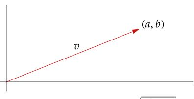

This vector v has norm  $\sqrt{a^2 + b^2}$ .

Similarly, if  $v = (a, b, c) \in \mathbb{R}^3$ , then  $||v|| = \sqrt{a^2 + b^2 + c^2}$ .

Even though we cannot draw pictures in higher dimensions, the generalization to  $\mathbf{R}^n$  is easy: we define the norm of  $x = (x_1, ..., x_n) \in \mathbf{R}^n$  by

$$||x|| = \sqrt{x_1^2 + \dots + x_n^2}.$$

The norm is not linear on  $\mathbb{R}^n$ . To inject linearity into the discussion, we introduce the dot product.

#### 6.1 definition: dot product

For  $x, y \in \mathbb{R}^n$ , the *dot product* of x and y, denoted by  $x \cdot y$ , is defined by

$$x \cdot y = x_1 y_1 + \dots + x_n y_n,$$

where  $x = (x_1, ..., x_n)$  and  $y = (y_1, ..., y_n)$ .

The dot product of two vectors in  $\mathbb{R}^n$  is a number, not a vector. Notice that  $x \cdot x = ||x||^2$  for all  $x \in \mathbb{R}^n$ . Furthermore, the dot product on  $\mathbb{R}^n$  has the following properties.

If we think of a vector as a point instead of as an arrow, then ||x|| should be interpreted to mean the distance from the origin to the point x.

- $x \cdot x \ge 0$  for all  $x \in \mathbb{R}^n$ .
- $x \cdot x = 0$  if and only if x = 0.
- For  $y \in \mathbb{R}^n$  fixed, the map from  $\mathbb{R}^n$  to  $\mathbb{R}$  that sends  $x \in \mathbb{R}^n$  to  $x \cdot y$  is linear.
- $x \cdot y = y \cdot x$  for all  $x, y \in \mathbb{R}^n$ .

An inner product is a generalization of the dot product. At this point you may be tempted to guess that an inner product is defined by abstracting the properties of the dot product discussed in the last paragraph. For real vector spaces, that guess is correct. However, so that we can make a definition that will be useful for both real and complex vector spaces, we need to examine the complex case before making the definition.

<span id="page-196-0"></span>Recall that if = + , where , ∈ , then

- the absolute value of , denoted by ||, is defined by || = <sup>√</sup> <sup>2</sup> + 2 ;
- the complex conjugate of , denoted by , is defined by = − ;
- ||<sup>2</sup> = .

See Chapter [4](#page-132-0) for the definitions and the basic properties of the absolute value and complex conjugate.

For = (<sup>1</sup> , …, ) ∈ , we define the norm of by

$$\|z\| = \sqrt{|z_1|^2 + \cdots + |z_n|^2}.$$

The absolute values are needed because we want ‖‖ to be a nonnegative number. Note that

$$||z||^2 = z_1 \overline{z_1} + \dots + z_n \overline{z_n}.$$

We want to think of ‖‖<sup>2</sup> as the inner product of with itself, as we did in . The equation above thus suggests that the inner product of the vector = (<sup>1</sup> , …, ) ∈ with should equal

$$w_1\overline{z_1}+\cdots+w_n\overline{z_n}.$$

If the roles of the and were interchanged, the expression above would be replaced with its complex conjugate. Thus we should expect that the inner product of with equals the complex conjugate of the inner product of with . With that motivation, we are now ready to define an inner product on , which may be a real or a complex vector space.

One comment about the notation used in the next definition:

• For ∈ , the notation ≥ 0 means is real and nonnegative.

## 6.2 definition: *inner product*

An *inner product* on is a function that takes each ordered pair (, ) of elements of to a number ⟨, ⟩ ∈ and has the following properties.

## **positivity**

$$\langle v, v \rangle \ge 0$$
 for all  $v \in V$ .

## **definiteness**

$$\langle v, v \rangle = 0$$
 if and only if  $v = 0$ .

## **additivity in first slot**

$$\langle u+v,w\rangle=\langle u,w\rangle+\langle v,w\rangle$$
 for all  $u,v,w\in V$ .

## **homogeneity in first slot**

$$\langle \lambda u, v \rangle = \lambda \langle u, v \rangle$$
 for all  $\lambda \in \mathbf{F}$  and all  $u, v \in V$ .

## **conjugate symmetry**

$$\langle u, v \rangle = \overline{\langle v, u \rangle}$$
 for all  $u, v \in V$ .

<span id="page-197-1"></span>

Every real number equals its complex conjugate. Thus if we are dealing with a real vector space, then in the last condition above we can dispense with the complex conjugate and simply state that ⟨, ⟩ = ⟨, ⟩ for all , ∈ .

*Most mathematicians define inner products as above, but many physicists use a definition that requires homogeneity in the second slot instead of the first slot.*

## <span id="page-197-0"></span>6.3 example: *inner products*

(a) The *Euclidean inner product* on is defined by

$$\left\langle (w_1,...,w_n),(z_1,...,z_n)\right\rangle = w_1\overline{z_1}+\cdots+w_n\overline{z_n}$$

for all (<sup>1</sup> , …, ), (<sup>1</sup> , …, ) ∈ .

(b) If <sup>1</sup> , …, are positive numbers, then an inner product can be defined on by

$$\left\langle (w_1,...,w_n),(z_1,...,z_n)\right\rangle = c_1w_1\overline{z_1}+\cdots+c_nw_n\overline{z_n}$$

for all (<sup>1</sup> , …, ), (<sup>1</sup> , …, ) ∈ .

(c) An inner product can be defined on the vector space of continuous real-valued functions on the interval [−1, 1] by

$$\langle f, g \rangle = \int_{-1}^{1} f g$$

for all , continuous real-valued functions on [−1, 1].

(d) An inner product can be defined on () by

$$\langle p, q \rangle = p(0) q(0) + \int_{-1}^{1} p'q'$$

for all , ∈ ().

(e) An inner product can be defined on () by

$$\langle p, q \rangle = \int_0^\infty p(x) \, q(x) \, e^{-x} \, dx$$

for all , ∈ ().

## 6.4 definition: *inner product space*

An *inner product space* is a vector space along with an inner product on .

The most important example of an inner product space is with the Euclidean inner product given by (a) in the example above. When is referred to as an inner product space, you should assume that the inner product is the Euclidean inner product unless explicitly told otherwise.

So that we do not have to keep repeating the hypothesis that and are inner product spaces, we make the following assumption.

## 6.5 notation: *,*

For the rest of this chapter and the next chapter, and denote inner product spaces over .

Note the slight abuse of language here. An inner product space is a vector space along with an inner product on that vector space. When we say that a vector space is an inner product space, we are also thinking that an inner product on is lurking nearby or is clear from the context (or is the Euclidean inner product if the vector space is ).

## 6.6 *basic properties of an inner product*

- <span id="page-198-0"></span>(a) For each fixed ∈ , the function that takes ∈ to ⟨, ⟩ is a linear map from to .
- (b) ⟨0, ⟩ = 0 for every ∈ .
- (c) ⟨, 0⟩ = 0 for every ∈ .
- (d) ⟨, + ⟩ = ⟨, ⟩ + ⟨, ⟩ for all , , ∈ .
- (e) ⟨, ⟩ = ⟨, ⟩ for all ∈ and all , ∈ .

#### Proof

- (a) For ∈ , the linearity of ↦ ⟨, ⟩ follows from the conditions of additivity and homogeneity in the first slot in the definition of an inner product.
- (b) Every linear map takes 0 to 0. Thus (b) follows from (a).
- (c) If ∈ , then the conjugate symmetry property in the definition of an inner product and (b) show that ⟨, 0⟩ = ⟨0, ⟩ = 0 = 0.
- (d) Suppose , , ∈ . Then

$$\langle u, v + w \rangle = \overline{\langle v + w, u \rangle}$$

$$= \overline{\langle v, u \rangle + \langle w, u \rangle}$$

$$= \overline{\langle v, u \rangle} + \overline{\langle w, u \rangle}$$

$$= \langle u, v \rangle + \langle u, w \rangle.$$

(e) Suppose ∈ and , ∈ . Then

$$\langle u, \lambda v \rangle = \overline{\langle \lambda v, u \rangle}$$

$$= \overline{\lambda \langle v, u \rangle}$$

$$= \overline{\lambda} \overline{\langle v, u \rangle}$$

$$= \overline{\lambda} \langle u, v \rangle.$$

## <span id="page-199-2"></span><span id="page-199-0"></span>*Norms*

Our motivation for defining inner products came initially from the norms of vectors on 2 and 3 . Now we see that each inner product determines a norm.

## 6.7 definition: *norm,* ‖‖

For ∈ , the *norm* of , denoted by ‖‖, is defined by

$$||v|| = \sqrt{\langle v, v \rangle}.$$

## 6.8 example: *norms*

(a) If (<sup>1</sup> , …, ) ∈ (with the Euclidean inner product), then

$$||(z_1,...,z_n)|| = \sqrt{|z_1|^2 + \cdots + |z_n|^2}.$$

(b) For in the vector space of continuous real-valued functions on [−1, 1] and with inner product given as in [6.3\(](#page-197-0)c), we have

$$||f|| = \sqrt{\int_{-1}^{1} f^2}.$$

## 6.9 *basic properties of the norm*

<span id="page-199-1"></span>Suppose ∈ .

- (a) ‖‖ = 0 if and only if = 0.
- (b) ‖‖ = || ‖‖ for all ∈ .

## Proof

- (a) The desired result holds because ⟨, ⟩ = 0 if and only if = 0.
- (b) Suppose ∈ . Then

$$\|\lambda v\|^2 = \langle \lambda v, \lambda v \rangle$$
$$= \lambda \langle v, \lambda v \rangle$$
$$= \lambda \overline{\lambda} \langle v, v \rangle$$
$$= |\lambda|^2 \|v\|^2.$$

Taking square roots now gives the desired equality.

The proof of (b) in the result above illustrates a general principle: working with norms squared is usually easier than working directly with norms.

<span id="page-200-1"></span>Now we come to a crucial definition.

## 6.10 definition: *orthogonal*

Two vectors , ∈ are called *orthogonal* if ⟨, ⟩ = 0.

In the definition above, the order of the two vectors does not matter, because ⟨, ⟩ = 0 if and only if ⟨, ⟩ = 0. Instead of saying and are orthogonal, sometimes we say is orthogonal to .

*The word orthogonal comes from the Greek word orthogonios, which means right-angled.*

Exercise [15](#page-205-0) asks you to prove that if , are nonzero vectors in 2 , then

$$\langle u, v \rangle = ||u|| \, ||v|| \cos \theta,$$

where is the angle between and (thinking of and as arrows with initial point at the origin). Thus two nonzero vectors in 2 are orthogonal (with respect to the Euclidean inner product) if and only if the cosine of the angle between them is 0, which happens if and only if the vectors are perpendicular in the usual sense of plane geometry. Thus you can think of the word *orthogonal* as a fancy word meaning *perpendicular*.

We begin our study of orthogonality with an easy result.

## 6.11 *orthogonality and* 0

- (a) 0 is orthogonal to every vector in .
- (b) 0 is the only vector in that is orthogonal to itself.

#### Proof

- (a) Recall that [6.6\(](#page-198-0)b) states that ⟨0, ⟩ = 0 for every ∈ .
- (b) If ∈ and ⟨, ⟩ = 0, then = 0 (by definition of inner product).

For the special case = <sup>2</sup> , the next theorem was known over 3,500 years ago in Babylonia and then rediscovered and proved over 2,500 years ago in Greece. Of course, the proof below is not the original proof.

## 6.12 *Pythagorean theorem*

<span id="page-200-0"></span>Suppose , ∈ . If and are orthogonal, then

$$||u + v||^2 = ||u||^2 + ||v||^2.$$

Proof Suppose ⟨, ⟩ = 0. Then

$$||u + v||^2 = \langle u + v, u + v \rangle$$

$$= \langle u, u \rangle + \langle u, v \rangle + \langle v, u \rangle + \langle v, v \rangle$$

$$= ||u||^2 + ||v||^2.$$

Suppose , ∈ , with ≠ 0. We would like to write as a scalar multiple of plus a vector orthogonal to , as suggested in the picture here.

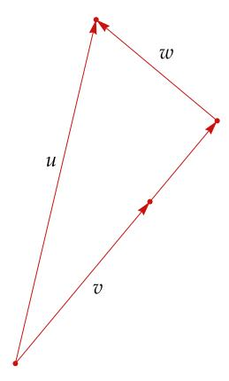

*An orthogonal decomposition: expressed as a scalar multiple of plus a vector orthogonal to .*

To discover how to write as a scalar multiple of plus a vector orthogonal to , let ∈ denote a scalar. Then

$$u = cv + (u - cv).$$

Thus we need to choose so that is orthogonal to ( − ). Hence we want

$$0 = \langle u - cv, v \rangle = \langle u, v \rangle - c ||v||^2.$$

The equation above shows that we should choose to be ⟨, ⟩/‖‖<sup>2</sup> . Making this choice of , we can write

$$u = \frac{\langle u, v \rangle}{\|v\|^2} v + \left( u - \frac{\langle u, v \rangle}{\|v\|^2} v \right).$$

As you should verify, the equation displayed above explicitly writes as a scalar multiple of plus a vector orthogonal to . Thus we have proved the following key result.

## 6.13 *an orthogonal decomposition*

<span id="page-201-0"></span>Suppose , ∈ , with ≠ 0. Set = ⟨, ⟩ ‖‖<sup>2</sup> and = − ⟨, ⟩ ‖‖<sup>2</sup> . Then

$$u = cv + w$$
 and  $\langle w, v \rangle = 0$ .

The orthogonal decomposition [6.13](#page-201-0) will be used in the proof of the Cauchy– Schwarz inequality, which is our next result and is one of the most important inequalities in mathematics.

## <span id="page-202-3"></span>6.14 Cauchy–Schwarz inequality

<span id="page-202-0"></span>Suppose  $u, v \in V$ . Then

$$|\langle u, v \rangle| \le ||u|| \, ||v||.$$

This inequality is an equality if and only if one of u, v is a scalar multiple of the other.

Proof If v = 0, then both sides of the desired inequality equal 0. Thus we can assume that  $v \neq 0$ . Consider the orthogonal decomposition

$$u = \frac{\langle u, v \rangle}{\|v\|^2} v + w$$

given by 6.13, where w is orthogonal to v. By the Pythagorean theorem,

$$||u||^2 = \left\| \frac{\langle u, v \rangle}{||v||^2} v \right\|^2 + ||w||^2$$
$$= \frac{\left|\langle u, v \rangle\right|^2}{||v||^2} + ||w||^2$$
$$\geq \frac{\left|\langle u, v \rangle\right|^2}{||v||^2}.$$

<span id="page-202-2"></span>6.15

Multiplying both sides of this inequality by  $||v||^2$  and then taking square roots gives the desired inequality.

The proof in the paragraph above shows that the Cauchy–Schwarz inequality is an equality if and only if 6.15 is an equality. This happens if and only if w = 0. But w = 0 if and only if u is a multiple of v (see 6.13). Thus the Cauchy–Schwarz inequality is an equality if and only if u is a scalar multiple of v or v is a scalar multiple of v (or both; the phrasing has been chosen to cover cases in which either v or v equals 0).

Augustin-Louis Cauchy (1789–1857) proved 6.16(a) in 1821. In 1859, Cauchy's student Viktor Bunyakovsky (1804–1889) proved integral inequalities like the one in 6.16(b). A few decades later, similar discoveries by Hermann Schwarz (1843–1921) attracted more attention and led to the name of this inequality.

## <span id="page-202-1"></span>6.16 example: Cauchy-Schwarz inequality

(a) If  $x_1, ..., x_n, y_1, ..., y_n \in \mathbf{R}$ , then

$$(x_1y_1+\cdots+x_ny_n)^2 \leq \left(x_1^2+\cdots+x_n^2\right) \left(y_1^2+\cdots+y_n^2\right),$$

as follows from applying the Cauchy–Schwarz inequality to the vectors  $(x_1,...,x_n), (y_1,...,y_n) \in \mathbb{R}^n$ , using the usual Euclidean inner product.

<span id="page-203-4"></span>(b) If , are continuous real-valued functions on [−1, 1], then

$$\left| \int_{-1}^{1} f g \, \right|^2 \leq \left( \int_{-1}^{1} f^2 \right) \left( \int_{-1}^{1} g^2 \right),$$

as follows from applying the Cauchy–Schwarz inequality to Example [6.3\(](#page-197-0)c).

The next result, called the triangle inequality, has the geometric interpretation that the length of each side of a triangle is less than the sum of the lengths of the other two sides.

Note that the triangle inequality implies that the shortest polygonal path between two points is a single line segment (a polygonal path consists of line segments).

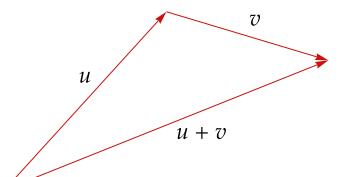

*In this triangle, the length of* + *is less than the length of plus the length of .*

## 6.17 *triangle inequality*

<span id="page-203-3"></span>Suppose , ∈ . Then

$$||u + v|| \le ||u|| + ||v||.$$

This inequality is an equality if and only if one of , is a nonnegative real multiple of the other.

Proof We have

<span id="page-203-1"></span>
$$||u + v||^{2} = \langle u + v, u + v \rangle$$

$$= \langle u, u \rangle + \langle v, v \rangle + \langle u, v \rangle + \langle v, u \rangle$$

$$= \langle u, u \rangle + \langle v, v \rangle + \langle u, v \rangle + \overline{\langle u, v \rangle}$$

$$= ||u||^{2} + ||v||^{2} + 2\operatorname{Re}\langle u, v \rangle$$

$$\leq ||u||^{2} + ||v||^{2} + 2|\langle u, v \rangle|$$

$$\leq ||u||^{2} + ||v||^{2} + 2||u|| ||v||$$

$$= (||u|| + ||v||)^{2},$$

<span id="page-203-0"></span>where [6.19](#page-203-0) follows from the Cauchy–Schwarz inequality [\(6.14\)](#page-202-0). Taking square roots of both sides of the inequality above gives the desired inequality.

The proof above shows that the triangle inequality is an equality if and only if we have equality in [6.18](#page-203-1) and [6.19.](#page-203-0) Thus we have equality in the triangle inequality if and only if

<span id="page-203-2"></span>
$$\langle u, v \rangle = ||u|| \, ||v||.$$

If one of , is a nonnegative real multiple of the other, then [6.20](#page-203-2) holds. Conversely, suppose [6.20](#page-203-2) holds. Then the condition for equality in the Cauchy– Schwarz inequality [\(6.14\)](#page-202-0) implies that one of , is a scalar multiple of the other. This scalar must be a nonnegative real number, by [6.20,](#page-203-2) completing the proof.

For the reverse triangle inequality, see Exercise [20.](#page-206-1)

<span id="page-204-1"></span>The next result is called the parallelogram equality because of its geometric interpretation: in every parallelogram, the sum of the squares of the lengths of the diagonals equals the sum of the squares of the lengths of the four sides. Note that the proof here is more straightforward than the usual proof in Euclidean geometry.

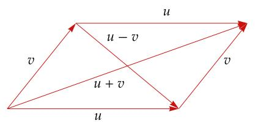

The diagonals of this parallelogram are u + v and u - v.

## 6.21 parallelogram equality

Suppose  $u, v \in V$ . Then

$$||u + v||^2 + ||u - v||^2 = 2(||u||^2 + ||v||^2).$$

Proof We have

$$\begin{split} \|u+v\|^2 + \|u-v\|^2 &= \langle u+v, u+v \rangle + \langle u-v, u-v \rangle \\ &= \|u\|^2 + \|v\|^2 + \langle u, v \rangle + \langle v, u \rangle \\ &+ \|u\|^2 + \|v\|^2 - \langle u, v \rangle - \langle v, u \rangle \\ &= 2 \big( \|u\|^2 + \|v\|^2 \big), \end{split}$$

as desired.

#### <span id="page-204-0"></span>Exercises 6A

1 Prove or give a counterexample: If  $v_1, ..., v_m \in V$ , then

$$\sum_{j=1}^m \sum_{k=1}^m \langle v_j, v_k \rangle \geq 0.$$

**2** Suppose  $S \in \mathcal{L}(V)$ . Define  $\langle \cdot, \cdot \rangle_1$  by

$$\langle u, v \rangle_1 = \langle Su, Sv \rangle$$

for all  $u, v \in V$ . Show that  $\langle \cdot, \cdot \rangle_1$  is an inner product on V if and only if S is injective.

- 3 (a) Show that the function taking an ordered pair  $((x_1, x_2), (y_1, y_2))$  of elements of  $\mathbb{R}^2$  to  $|x_1y_1| + |x_2y_2|$  is not an inner product on  $\mathbb{R}^2$ .
  - (b) Show that the function taking an ordered pair  $((x_1, x_2, x_3), (y_1, y_2, y_3))$  of elements of  $\mathbb{R}^3$  to  $x_1y_1 + x_3y_3$  is not an inner product on  $\mathbb{R}^3$ .
- **4** Suppose  $T \in \mathcal{L}(V)$  is such that  $||Tv|| \le ||v||$  for every  $v \in V$ . Prove that  $T \sqrt{2}I$  is injective.

- 5 Suppose *V* is a real inner product space.
  - (a) Show that  $\langle u + v, u v \rangle = ||u||^2 ||v||^2$  for every  $u, v \in V$ .
  - (b) Show that if  $u, v \in V$  have the same norm, then u + v is orthogonal to u v.
  - (c) Use (b) to show that the diagonals of a rhombus are perpendicular to each other.
- **6** Suppose  $u, v \in V$ . Prove that  $\langle u, v \rangle = 0 \iff ||u|| \le ||u + av||$  for all  $a \in F$ .
- 7 Suppose  $u, v \in V$ . Prove that ||au + bv|| = ||bu + av|| for all  $a, b \in \mathbb{R}$  if and only if ||u|| = ||v||.
- 8 Suppose  $a, b, c, x, y \in \mathbb{R}$  and  $a^2 + b^2 + c^2 + x^2 + y^2 \le 1$ . Prove that  $a + b + c + 4x + 9y \le 10$ .
- 9 Suppose  $u, v \in V$  and ||u|| = ||v|| = 1 and  $\langle u, v \rangle = 1$ . Prove that u = v.
- 10 Suppose  $u, v \in V$  and  $||u|| \le 1$  and  $||v|| \le 1$ . Prove that

$$\sqrt{1-\|u\|^2}\sqrt{1-\|v\|^2}\leq 1-\left|\langle u,v\rangle\right|.$$

- Find vectors  $u, v \in \mathbb{R}^2$  such that u is a scalar multiple of (1,3), v is orthogonal to (1,3), and (1,2) = u + v.
- 12 Suppose a, b, c, d are positive numbers.
  - (a) Prove that  $(a + b + c + d) \left( \frac{1}{a} + \frac{1}{b} + \frac{1}{c} + \frac{1}{d} \right) \ge 16$ .
  - (b) For which positive numbers a, b, c, d is the inequality above an equality?
- Show that the square of an average is less than or equal to the average of the squares. More precisely, show that if  $a_1, ..., a_n \in \mathbb{R}$ , then the square of the average of  $a_1, ..., a_n$  is less than or equal to the average of  $a_1^2, ..., a_n^2$ .
- Suppose  $v \in V$  and  $v \neq 0$ . Prove that  $v/\|v\|$  is the unique closest element on the unit sphere of V to v. More precisely, prove that if  $u \in V$  and  $\|u\| = 1$ , then

$$\left\|v - \frac{v}{\|v\|}\right\| \le \|v - u\|,$$

with equality only if u = v/||v||.

<span id="page-205-0"></span>15 Suppose u, v are nonzero vectors in  $\mathbb{R}^2$ . Prove that

$$\langle u, v \rangle = ||u|| \, ||v|| \cos \theta,$$

where  $\theta$  is the angle between u and v (thinking of u and v as arrows with initial point at the origin).

*Hint: Use the law of cosines on the triangle formed by* u, v, and u - v.

<span id="page-206-2"></span>The angle between two vectors (thought of as arrows with initial point at the origin) in  $\mathbb{R}^2$  or  $\mathbb{R}^3$  can be defined geometrically. However, geometry is not as clear in  $\mathbb{R}^n$  for n > 3. Thus the angle between two nonzero vectors  $x, y \in \mathbb{R}^n$  is defined to be

$$\arccos \frac{\langle x, y \rangle}{\|x\| \|y\|},$$

where the motivation for this definition comes from Exercise 15. Explain why the Cauchy–Schwarz inequality is needed to show that this definition makes sense.

17 Prove that

$$\left(\sum_{k=1}^{n} a_k b_k\right)^2 \le \left(\sum_{k=1}^{n} k a_k^2\right) \left(\sum_{k=1}^{n} \frac{b_k^2}{k}\right)$$

for all real numbers  $a_1, ..., a_n$  and  $b_1, ..., b_n$ .

**18** (a) Suppose  $f: [1, \infty) \to [0, \infty)$  is continuous. Show that

$$\left(\int_{1}^{\infty} f\right)^{2} \le \int_{1}^{\infty} x^{2} \left(f(x)\right)^{2} dx.$$

- (b) For which continuous functions  $f: [1, \infty) \to [0, \infty)$  is the inequality in (a) an equality with both sides finite?
- <span id="page-206-0"></span>19 Suppose  $v_1, ..., v_n$  is a basis of V and  $T \in \mathcal{L}(V)$ . Prove that if  $\lambda$  is an eigenvalue of T, then

$$|\lambda|^2 \le \sum_{j=1}^n \sum_{k=1}^n |\mathcal{M}(T)_{j,k}|^2,$$

where  $\mathcal{M}(T)_{j,k}$  denotes the entry in row j, column k of the matrix of T with respect to the basis  $v_1, ..., v_n$ .

<span id="page-206-1"></span>**20** Prove that if  $u, v \in V$ , then  $||u|| - ||v||| \le ||u - v||$ .

The inequality above is called the **reverse triangle inequality**. For the reverse triangle inequality when  $V = \mathbb{C}$ , see Exercise 2 in Chapter 4.

21 Suppose  $u, v \in V$  are such that

$$||u|| = 3$$
,  $||u + v|| = 4$ ,  $||u - v|| = 6$ .

What number does ||v|| equal?

22 Show that if  $u, v \in V$ , then

$$||u + v|| ||u - v|| \le ||u||^2 + ||v||^2$$
.

23 Suppose  $v_1,...,v_m \in V$  are such that  $||v_k|| \le 1$  for each k=1,...,m. Show that there exist  $a_1,...,a_m \in \{1,-1\}$  such that

$$\|a_1v_1+\cdots+a_mv_m\|\leq \sqrt{m}.$$

- <span id="page-207-0"></span>**24** Prove or give a counterexample: If ‖⋅ ‖ is the norm associated with an inner product on 2 , then there exists (, ) ∈ <sup>2</sup> such that ‖(, )‖ ≠ max{||, ||}.
- **25** Suppose > 0. Prove that there is an inner product on 2 such that the associated norm is given by

$$||(x,y)|| = (|x|^p + |y|^p)^{1/p}$$

for all (, ) ∈ <sup>2</sup> if and only if = 2.

**26** Suppose is a real inner product space. Prove that

$$\langle u, v \rangle = \frac{\|u + v\|^2 - \|u - v\|^2}{4}$$

for all , ∈ .

**27** Suppose is a complex inner product space. Prove that

$$\langle u,v\rangle = \frac{\|u+v\|^2 - \|u-v\|^2 + \|u+iv\|^2 i - \|u-iv\|^2 i}{4}$$

for all , ∈ .

**28** A norm on a vector space is a function

$$\|\cdot\|\colon U\to [0,\infty)$$

such that ‖‖ = 0 if and only if = 0, ‖‖ = ||‖‖ for all ∈ and all ∈ , and ‖+‖ ≤ ‖‖+‖‖ for all , ∈ . Prove that a norm satisfying the parallelogram equality comes from an inner product (in other words, show that if ‖⋅ ‖ is a norm on satisfying the parallelogram equality, then there is an inner product ⟨⋅, ⋅⟩ on such that ‖‖ = ⟨, ⟩1/2 for all ∈ ).

**29** Suppose <sup>1</sup> , …, are inner product spaces. Show that the equation

$$\left\langle (u_1,...,u_m),(v_1,...,v_m)\right\rangle = \left\langle u_1,v_1\right\rangle + \cdots + \left\langle u_m,v_m\right\rangle$$

defines an inner product on <sup>1</sup> × ⋯ × .

*In the expression above on the right, for each* = 1, …, *, the inner product* ⟨ , ⟩ *denotes the inner product on . Each of the spaces* <sup>1</sup> , …, *may have a different inner product, even though the same notation is used here.*

**30** Suppose is a real inner product space. For , , , ∈ , define

$$\langle u+iv,w+ix\rangle_{\mathbb{C}}=\langle u,w\rangle+\langle v,x\rangle+(\langle v,w\rangle-\langle u,x\rangle)\,i.$$

- (a) Show that ⟨⋅, ⋅⟩ makes into a complex inner product space.
- (b) Show that if , ∈ , then

$$\langle u, v \rangle_{\mathbf{C}} = \langle u, v \rangle$$
 and  $||u + iv||_{\mathbf{C}}^2 = ||u||^2 + ||v||^2$ .

*See Exercise [8](#page-30-0) in Section [1B](#page-25-0) for the definition of the complexification .*

<span id="page-208-0"></span>31 Suppose  $u, v, w \in V$ . Prove that

$$\left\|w - \frac{1}{2}(u+v)\right\|^2 = \frac{\|w-u\|^2 + \|w-v\|^2}{2} - \frac{\|u-v\|^2}{4}.$$

Suppose that *E* is a subset of *V* with the property that  $u, v \in E$  implies  $\frac{1}{2}(u+v) \in E$ . Let  $w \in V$ . Show that there is at most one point in *E* that is closest to *w*. In other words, show that there is at most one  $u \in E$  such that

$$||w - u|| \le ||w - x||$$

for all  $x \in E$ .

- 33 Suppose f, g are differentiable functions from **R** to  $\mathbf{R}^n$ .
  - (a) Show that

$$\langle f(t), g(t) \rangle' = \langle f'(t), g(t) \rangle + \langle f(t), g'(t) \rangle.$$

- (b) Suppose *c* is a positive number and ||f(t)|| = c for every  $t \in \mathbb{R}$ . Show that  $\langle f'(t), f(t) \rangle = 0$  for every  $t \in \mathbb{R}$ .
- (c) Interpret the result in (b) geometrically in terms of the tangent vector to a curve lying on a sphere in  $\mathbb{R}^n$  centered at the origin.

A function  $f: \mathbf{R} \to \mathbf{R}^n$  is called differentiable if there exist differentiable functions  $f_1, ..., f_n$  from  $\mathbf{R}$  to  $\mathbf{R}$  such that  $f(t) = (f_1(t), ..., f_n(t))$  for each  $t \in \mathbf{R}$ . Furthermore, for each  $t \in \mathbf{R}$ , the derivative  $f'(t) \in \mathbf{R}^n$  is defined by  $f'(t) = (f_1'(t), ..., f_n'(t))$ .

34 Use inner products to prove Apollonius's identity: In a triangle with sides of length *a*, *b*, and *c*, let *d* be the length of the line segment from the midpoint of the side of length *c* to the opposite vertex. Then

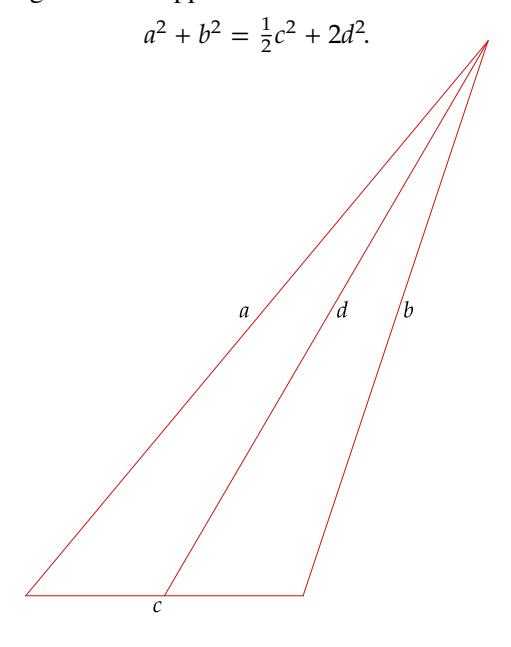

<span id="page-209-1"></span><span id="page-209-0"></span>Fix a positive integer n. The Laplacian  $\Delta p$  of a twice differentiable real-valued function p on  $\mathbb{R}^n$  is the function on  $\mathbb{R}^n$  defined by

$$\Delta p = \frac{\partial^2 p}{\partial x_1^2} + \dots + \frac{\partial^2 p}{\partial x_n^2}.$$

The function p is called *harmonic* if  $\Delta p = 0$ .

A *polynomial* on  $\mathbb{R}^n$  is a linear combination (with coefficients in  $\mathbb{R}$ ) of functions of the form  $x_1^{m_1} \cdots x_n^{m_n}$ , where  $m_1, \dots, m_n$  are nonnegative integers.

Suppose q is a polynomial on  $\mathbb{R}^n$ . Prove that there exists a harmonic polynomial p on  $\mathbb{R}^n$  such that p(x) = q(x) for every  $x \in \mathbb{R}^n$  with ||x|| = 1.

The only fact about harmonic functions that you need for this exercise is that if p is a harmonic function on  $\mathbf{R}^n$  and p(x) = 0 for all  $x \in \mathbf{R}^n$  with ||x|| = 1, then p = 0.

Hint: A reasonable guess is that the desired harmonic polynomial p is of the form  $q + (1 - ||x||^2)r$  for some polynomial r. Prove that there is a polynomial r on  $\mathbb{R}^n$  such that  $q + (1 - ||x||^2)r$  is harmonic by defining an operator T on a suitable vector space by

$$Tr = \Delta \left( (1 - \|x\|^2) r \right)$$

and then showing that T is injective and hence surjective.

In realms of numbers, where the secrets lie, A noble truth emerges from the deep, Cauchy and Schwarz, their wisdom they apply, An inequality for all to keep.

Two vectors, by this bond, are intertwined, As inner products weave a gilded thread, Their magnitude, by providence, confined, A bound to which their destiny is wed.

Though shadows fall, and twilight dims the day, This inequality will stand the test, To guide us in our quest, to light the way, And in its truth, our understanding rest.

So sing, ye muses, of this noble feat, Cauchy–Schwarz, the bound that none can beat.

-written by ChatGPT with input Shakespearean sonnet on Cauchy-Schwarz inequality

#### <span id="page-210-2"></span><span id="page-210-0"></span>6B Orthonormal Bases

## <span id="page-210-1"></span>Orthonormal Lists and the Gram-Schmidt Procedure

#### 6.22 definition: orthonormal

- A list of vectors is called *orthonormal* if each vector in the list has norm 1 and is orthogonal to all the other vectors in the list.
- In other words, a list  $e_1, ..., e_m$  of vectors in V is orthonormal if

$$\langle e_j, e_k \rangle = \begin{cases} 1 & \text{if } j = k, \\ 0 & \text{if } j \neq k \end{cases}$$

for all  $j, k \in \{1, ..., m\}$ .

## 6.23 example: orthonormal lists

- (a) The standard basis of  $\mathbf{F}^n$  is an orthonormal list.
- (b)  $\left(\frac{1}{\sqrt{3}}, \frac{1}{\sqrt{3}}, \frac{1}{\sqrt{3}}\right), \left(-\frac{1}{\sqrt{2}}, \frac{1}{\sqrt{2}}, 0\right)$  is an orthonormal list in  $\mathbf{F}^3$ .
- (c)  $\left(\frac{1}{\sqrt{3}}, \frac{1}{\sqrt{3}}, \frac{1}{\sqrt{3}}\right), \left(-\frac{1}{\sqrt{2}}, \frac{1}{\sqrt{2}}, 0\right), \left(\frac{1}{\sqrt{6}}, \frac{1}{\sqrt{6}}, -\frac{2}{\sqrt{6}}\right)$  is an orthonormal list in  $\mathbf{F}^3$ .
- (d) Suppose *n* is a positive integer. Then, as Exercise 4 asks you to verify,

$$\frac{1}{\sqrt{2\pi}}, \frac{\cos x}{\sqrt{\pi}}, \frac{\cos 2x}{\sqrt{\pi}}, ..., \frac{\cos nx}{\sqrt{\pi}}, \frac{\sin x}{\sqrt{\pi}}, \frac{\sin 2x}{\sqrt{\pi}}, ..., \frac{\sin nx}{\sqrt{\pi}}$$

is an orthonormal list of vectors in  $C[-\pi, \pi]$ , the vector space of continuous real-valued functions on  $[-\pi, \pi]$  with inner product

$$\langle f, g \rangle = \int_{-\pi}^{\pi} fg.$$

The orthonormal list above is often used for modeling periodic phenomena, such as tides.

(e) Suppose we make  $\mathcal{P}_2(\mathbf{R})$  into an inner product space using the inner product given by

$$\langle p, q \rangle = \int_{-1}^{1} pq$$

for all  $p,q \in \mathcal{P}_2(\mathbf{R})$ . The standard basis  $1,x,x^2$  of  $\mathcal{P}_2(\mathbf{R})$  is not an orthonormal list because the vectors in that list do not have norm 1. Dividing each vector by its norm gives the list  $1/\sqrt{2},\sqrt{3/2x},\sqrt{5/2x^2}$ , in which each vector has norm 1, and the second vector is orthogonal to the first and third vectors. However, the first and third vectors are not orthogonal. Thus this is not an orthonormal list. Soon we will see how to construct an orthonormal list from the standard basis  $1,x,x^2$  (see Example 6.34).

<span id="page-211-3"></span>Orthonormal lists are particularly easy to work with, as illustrated by the next result.

#### 6.24 norm of an orthonormal linear combination

<span id="page-211-0"></span>Suppose  $e_1, ..., e_m$  is an orthonormal list of vectors in V. Then

$$||a_1e_1 + \dots + a_me_m||^2 = |a_1|^2 + \dots + |a_m|^2$$

for all  $a_1, ..., a_m \in \mathbf{F}$ .

Proof Because each  $e_k$  has norm 1, this follows from repeated applications of the Pythagorean theorem (6.12).

The result above has the following important corollary.

#### 6.25 orthonormal lists are linearly independent

<span id="page-211-1"></span>Every orthonormal list of vectors is linearly independent.

Proof Suppose  $e_1, ..., e_m$  is an orthonormal list of vectors in V and  $a_1, ..., a_m \in \mathbf{F}$  are such that

$$a_1e_1 + \dots + a_me_m = 0.$$

Then  $|a_1|^2 + \cdots + |a_m|^2 = 0$  (by 6.24), which means that all the  $a_k$ 's are 0. Thus  $e_1, \dots, e_m$  is linearly independent.

Now we come to an important inequality.

## 6.26 Bessel's inequality

<span id="page-211-2"></span>Suppose  $e_1, ..., e_m$  is an orthonormal list of vectors in V. If  $v \in V$  then

$$\left|\langle v, e_1 \rangle\right|^2 + \dots + \left|\langle v, e_m \rangle\right|^2 \le ||v||^2.$$

Proof Suppose  $v \in V$ . Then

$$v = \underbrace{\langle v, e_1 \rangle e_1 + \dots + \langle v, e_m \rangle e_m}_{V} + \underbrace{v - \langle v, e_1 \rangle e_1 - \dots - \langle v, e_m \rangle e_m}_{V}.$$

Let u and w be defined as in the equation above. If  $k \in \{1,...,m\}$ , then  $\langle w,e_k\rangle = \langle v,e_k\rangle - \langle v,e_k\rangle\langle e_k,e_k\rangle = 0$ . This implies that  $\langle w,u\rangle = 0$ . The Pythagorean theorem now implies that

$$\begin{aligned} \|v\|^2 &= \|u\|^2 + \|w\|^2 \\ &\geq \|u\|^2 \\ &= \left| \langle v, e_1 \rangle \right|^2 + \dots + \left| \langle v, e_m \rangle \right|^2, \end{aligned}$$

where the last line comes from 6.24.

<span id="page-212-2"></span>The next definition introduces one of the most useful concepts in the study of inner product spaces.

#### 6.27 definition: orthonormal basis

An *orthonormal basis* of V is an orthonormal list of vectors in V that is also a basis of V.

For example, the standard basis is an orthonormal basis of  $\mathbf{F}^n$ .

#### 6.28 orthonormal lists of the right length are orthonormal bases

<span id="page-212-0"></span>Suppose V is finite-dimensional. Then every orthonormal list of vectors in V of length dim V is an orthonormal basis of V.

Proof By 6.25, every orthonormal list of vectors in V is linearly independent. Thus every such list of the right length is a basis—see 2.38.

## <span id="page-212-1"></span>| 6.29 example: an orthonormal basis of $\mathbf{F}^4$

As mentioned above, the standard basis is an orthonormal basis of **F**<sup>4</sup>. We now show that

$$\left(\frac{1}{2}, \frac{1}{2}, \frac{1}{2}, \frac{1}{2}\right), \left(\frac{1}{2}, \frac{1}{2}, -\frac{1}{2}, -\frac{1}{2}\right), \left(\frac{1}{2}, -\frac{1}{2}, -\frac{1}{2}, \frac{1}{2}\right), \left(-\frac{1}{2}, \frac{1}{2}, -\frac{1}{2}, \frac{1}{2}\right)$$

is also an orthonormal basis of  $\mathbf{F}^4$ .

We have

$$\left\| \left( \frac{1}{2}, \frac{1}{2}, \frac{1}{2}, \frac{1}{2} \right) \right\| = \sqrt{\frac{1}{2^2} + \frac{1}{2^2} + \frac{1}{2^2} + \frac{1}{2^2}} = 1.$$

Similarly, the other three vectors in the list above also have norm 1.

Note that

$$\left\langle \left(\frac{1}{2}, \frac{1}{2}, \frac{1}{2}, \frac{1}{2}\right), \left(\frac{1}{2}, \frac{1}{2}, -\frac{1}{2}, -\frac{1}{2}\right) \right\rangle = \frac{1}{2} \cdot \frac{1}{2} + \frac{1}{2} \cdot \frac{1}{2} + \frac{1}{2} \cdot \left(-\frac{1}{2}\right) + \frac{1}{2} \cdot \left(-\frac{1}{2}\right) = 0.$$

Similarly, the inner product of any two distinct vectors in the list above also equals 0.

Thus the list above is orthonormal. Because we have an orthonormal list of length four in the four-dimensional vector space  $\mathbf{F}^4$ , this list is an orthonormal basis of  $\mathbf{F}^4$  (by 6.28).

In general, given a basis  $e_1, ..., e_n$  of V and a vector  $v \in V$ , we know that there is some choice of scalars  $a_1, ..., a_n \in F$  such that

$$v = a_1 e_1 + \dots + a_n e_n.$$

Computing the numbers  $a_1, ..., a_n$  that satisfy the equation above can be a long computation for an arbitrary basis of V. The next result shows, however, that this is easy for an orthonormal basis—just take  $a_k = \langle v, e_k \rangle$ .

<span id="page-213-1"></span>Notice how the next result makes each inner product space of dimension n behave like  $\mathbf{F}^n$ , with the role of the coordinates of a vector in  $\mathbf{F}^n$  played by  $\langle v, e_1 \rangle, ..., \langle v, e_n \rangle$ .

The formula below for  $\|v\|$  is called Parseval's identity. It was published in 1799 in the context of Fourier series.

#### 6.30 writing a vector as a linear combination of an orthonormal basis

<span id="page-213-0"></span>Suppose  $e_1, ..., e_n$  is an orthonormal basis of V and  $u, v \in V$ . Then

- (a)  $v = \langle v, e_1 \rangle e_1 + \dots + \langle v, e_n \rangle e_n$ ;
- (b)  $||v||^2 = |\langle v, e_1 \rangle|^2 + \dots + |\langle v, e_n \rangle|^2$ ;
- (c)  $\langle u, v \rangle = \langle u, e_1 \rangle \overline{\langle v, e_1 \rangle} + \dots + \langle u, e_n \rangle \overline{\langle v, e_n \rangle}.$

Proof Because  $e_1, ..., e_n$  is a basis of V, there exist scalars  $a_1, ..., a_n$  such that

$$v = a_1 e_1 + \dots + a_n e_n.$$

Because  $e_1, ..., e_n$  is orthonormal, taking the inner product of both sides of this equation with  $e_k$  gives  $\langle v, e_k \rangle = a_k$ . Thus (a) holds.

Now (b) follows immediately from (a) and 6.24.

Take the inner product of u with each side of (a) and then get (c) by using conjugate linearity [6.6(d) and 6.6(e)] in the second slot of the inner product.

## 6.31 example: finding coefficients for a linear combination

Suppose we want to write the vector  $(1, 2, 4, 7) \in \mathbf{F}^4$  as a linear combination of the orthonormal basis

$$\left(\frac{1}{2},\frac{1}{2},\frac{1}{2},\frac{1}{2}\right),\left(\frac{1}{2},\frac{1}{2},-\frac{1}{2},-\frac{1}{2}\right),\left(\frac{1}{2},-\frac{1}{2},-\frac{1}{2},\frac{1}{2}\right),\left(-\frac{1}{2},\frac{1}{2},-\frac{1}{2},\frac{1}{2}\right)$$

of  $\mathbf{F}^4$  from Example 6.29. Instead of solving a system of four linear equations in four unknowns, as typically would be required if we were working with a nonorthonormal basis, we simply evaluate four inner products and use 6.30(a), getting that (1, 2, 4, 7) equals

$$7\Big(\tfrac{1}{2},\tfrac{1}{2},\tfrac{1}{2},\tfrac{1}{2}\Big) - 4\Big(\tfrac{1}{2},\tfrac{1}{2},-\tfrac{1}{2},-\tfrac{1}{2}\Big) + \Big(\tfrac{1}{2},-\tfrac{1}{2},-\tfrac{1}{2},\tfrac{1}{2}\Big) + 2\Big(-\tfrac{1}{2},\tfrac{1}{2},-\tfrac{1}{2},\tfrac{1}{2}\Big).$$

Now that we understand the usefulness of orthonormal bases, how do we go about finding them? For example, does  $\mathcal{P}_m(\mathbf{R})$  with inner product as in 6.3(c) have an orthonormal basis? The next result will lead to answers to these questions.

The algorithm used in the next proof is called the *Gram–Schmidt procedure*. It gives a method for turning a linearly independent list into an orthonormal list with the same span as the original list.

Jørgen Gram (1850–1916) and Erhard Schmidt (1876–1959) popularized this algorithm that constructs orthonormal lists.

#### 6.32 Gram–Schmidt procedure

<span id="page-214-0"></span>Suppose  $v_1, ..., v_m$  is a linearly independent list of vectors in V. Let  $f_1 = v_1$ . For k = 2, ..., m, define  $f_k$  inductively by

$$f_k = v_k - \frac{\langle v_k, f_1 \rangle}{\|f_1\|^2} f_1 - \dots - \frac{\langle v_k, f_{k-1} \rangle}{\|f_{k-1}\|^2} f_{k-1}.$$

For each k = 1, ..., m, let  $e_k = \frac{f_k}{\|f_k\|}$ . Then  $e_1, ..., e_m$  is an orthonormal list of vectors in V such that

$$span(v_1, ..., v_k) = span(e_1, ..., e_k)$$

for each k = 1, ..., m.

**Proof** We will show by induction on k that the desired conclusion holds. To get started with k = 1, note that because  $e_1 = f_1/\|f_1\|$ , we have  $\|e_1\| = 1$ ; also,  $\operatorname{span}(v_1) = \operatorname{span}(e_1)$  because  $e_1$  is a nonzero multiple of  $v_1$ .

Suppose  $1 < k \le m$  and the list  $e_1, ..., e_{k-1}$  generated by 6.32 is an orthonormal list such that

<span id="page-214-1"></span>6.33 
$$\operatorname{span}(v_1, ..., v_{k-1}) = \operatorname{span}(e_1, ..., e_{k-1}).$$

Because  $v_1,...,v_m$  is linearly independent, we have  $v_k \notin \operatorname{span}(v_1,...,v_{k-1})$ . Thus  $v_k \notin \operatorname{span}(e_1,...,e_{k-1}) = \operatorname{span}(f_1,...,f_{k-1})$ , which implies that  $f_k \neq 0$ . Hence we are not dividing by 0 in the definition of  $e_k$  given in 6.32. Dividing a vector by its norm produces a new vector with norm 1; thus  $\|e_k\| = 1$ .

Let 
$$j \in \{1, ..., k - 1\}$$
. Then

$$\begin{split} \langle e_k, e_j \rangle &= \frac{1}{\|f_k\| \|f_j\|} \langle f_k, f_j \rangle \\ &= \frac{1}{\|f_k\| \|f_j\|} \left\langle v_k - \frac{\langle v_k, f_1 \rangle}{\|f_1\|^2} f_1 - \dots - \frac{\langle v_k, f_{k-1} \rangle}{\|f_{k-1}\|^2} f_{k-1}, f_j \right\rangle \\ &= \frac{1}{\|f_k\| \|f_j\|} \left( \langle v_k, f_j \rangle - \langle v_k, f_j \rangle \right) \\ &= 0. \end{split}$$

Thus  $e_1, ..., e_k$  is an orthonormal list.

From the definition of  $e_k$  given in 6.32, we see that  $v_k \in \text{span}(e_1, ..., e_k)$ . Combining this information with 6.33 shows that

$$\operatorname{span}(v_1,...,v_k) \subseteq \operatorname{span}(e_1,...,e_k).$$

Both lists above are linearly independent (the v's by hypothesis, and the e's by orthonormality and 6.25). Thus both subspaces above have dimension k, and hence they are equal, completing the induction step and thus completing the proof.

## <span id="page-215-0"></span>6.34 example: an orthonormal basis of $\mathcal{P}_2(\mathbf{R})$

Suppose we make  $\mathcal{P}_2(\mathbf{R})$  into an inner product space using the inner product given by

$$\langle p, q \rangle = \int_{-1}^{1} pq$$

for all  $p, q \in \mathcal{P}_2(\mathbf{R})$ . We know that  $1, x, x^2$  is a basis of  $\mathcal{P}_2(\mathbf{R})$ , but it is not an orthonormal basis. We will find an orthonormal basis of  $\mathcal{P}_2(\mathbf{R})$  by applying the Gram–Schmidt procedure with  $v_1 = 1$ ,  $v_2 = x$ , and  $v_3 = x^2$ .

To get started, take  $f_1=v_1=1$ . Thus  $\|f_1\|^2=\int_{-1}^11=2$ . Hence the formula in 6.32 tells us that

$$f_2 = v_2 - \frac{\langle v_2, f_1 \rangle}{\|f_1\|^2} f_1 = x - \frac{\langle x, 1 \rangle}{\|f_1\|^2} = x,$$

where the last equality holds because  $\langle x, 1 \rangle = \int_{-1}^{1} t \, dt = 0$ .

The formula above for  $f_2$  implies that  $||f_2||^2 = \int_{-1}^1 t^2 dt = \frac{2}{3}$ . Now the formula in 6.32 tells us that

$$f_3 = v_3 - \frac{\langle v_3, f_1 \rangle}{\|f_1\|^2} f_1 - \frac{\langle v_3, f_2 \rangle}{\|f_2\|^2} f_2 = x^2 - \frac{1}{2} \langle x^2, 1 \rangle - \frac{3}{2} \langle x^2, x \rangle x = x^2 - \frac{1}{3}.$$

The formula above for  $f_3$  implies that

$$||f_3||^2 = \int_{-1}^1 \left(t^2 - \frac{1}{3}\right)^2 dt = \int_{-1}^1 \left(t^4 - \frac{2}{3}t^2 + \frac{1}{9}\right) dt = \frac{8}{45}.$$

Now dividing each of  $f_1$ ,  $f_2$ ,  $f_3$  by its norm gives us the orthonormal list

$$\sqrt{\frac{1}{2}}, \sqrt{\frac{3}{2}}x, \sqrt{\frac{45}{8}}\left(x^2 - \frac{1}{3}\right).$$

The orthonormal list above has length three, which is the dimension of  $\mathcal{P}_2(\mathbf{R})$ . Hence this orthonormal list is an orthonormal basis of  $\mathcal{P}_2(\mathbf{R})$  [by 6.28].

Now we can answer the question about the existence of orthonormal bases.

## 6.35 existence of orthonormal basis

Every finite-dimensional inner product space has an orthonormal basis.

Proof Suppose *V* is finite-dimensional. Choose a basis of *V*. Apply the Gram–Schmidt procedure (6.32) to it, producing an orthonormal list of length dim *V*. By 6.28, this orthonormal list is an orthonormal basis of *V*.

Sometimes we need to know not only that an orthonormal basis exists, but also that every orthonormal list can be extended to an orthonormal basis. In the next corollary, the Gram–Schmidt procedure shows that such an extension is always possible.

#### <span id="page-216-1"></span>6.36 every orthonormal list extends to an orthonormal basis

Suppose V is finite-dimensional. Then every orthonormal list of vectors in V can be extended to an orthonormal basis of V.

Proof Suppose  $e_1, ..., e_m$  is an orthonormal list of vectors in V. Then  $e_1, ..., e_m$  is linearly independent (by 6.25). Hence this list can be extended to a basis  $e_1, ..., e_m, v_1, ..., v_n$  of V (see 2.32). Now apply the Gram–Schmidt procedure (6.32) to  $e_1, ..., e_m, v_1, ..., v_n$ , producing an orthonormal list

$$e_1, ..., e_m, f_1, ..., f_n;$$

here the formula given by the Gram–Schmidt procedure leaves the first m vectors unchanged because they are already orthonormal. The list above is an orthonormal basis of V by 6.28.

Recall that a matrix is called upper triangular if it looks like this:

$$\left(\begin{array}{ccc} * & * \\ & \ddots & \\ 0 & * \end{array}\right),$$

where the 0 in the matrix above indicates that all entries below the diagonal equal 0, and asterisks are used to denote entries on and above the diagonal.

In the last chapter, we gave a necessary and sufficient condition for an operator to have an upper-triangular matrix with respect to some basis (see 5.44). Now that we are dealing with inner product spaces, we would like to know whether there exists an *orthonormal* basis with respect to which we have an upper-triangular matrix. The next result shows that the condition for an operator to have an upper-triangular matrix with respect to some orthonormal basis is the same as the condition to have an upper-triangular matrix with respect to an arbitrary basis.

## 6.37 upper-triangular matrix with respect to some orthonormal basis

<span id="page-216-0"></span>Suppose V is finite-dimensional and  $T \in \mathcal{L}(V)$ . Then T has an upper-triangular matrix with respect to some orthonormal basis of V if and only if the minimal polynomial of T equals  $(z - \lambda_1) \cdots (z - \lambda_m)$  for some  $\lambda_1, \dots, \lambda_m \in \mathbf{F}$ .

**Proof** Suppose T has an upper-triangular matrix with respect to some basis  $v_1, ..., v_n$  of V. Thus  $\operatorname{span}(v_1, ..., v_k)$  is invariant under T for each k = 1, ..., n (see 5.39).

Apply the Gram–Schmidt procedure to  $v_1, ..., v_n$ , producing an orthonormal basis  $e_1, ..., e_n$  of V. Because

$$span(e_1, ..., e_k) = span(v_1, ..., v_k)$$

for each k (see 6.32), we conclude that  $\operatorname{span}(e_1, ..., e_k)$  is invariant under T for each k = 1, ..., n. Thus, by 5.39, T has an upper-triangular matrix with respect to the orthonormal basis  $e_1, ..., e_n$ . Now use 5.44 to complete the proof.

<span id="page-217-4"></span>

For complex vector spaces, the next result is an important application of the result above. See Exercise [20](#page-222-0) for a ver-

*Issai Schur* (*1875–1941*) *published a proof of the next result in 1909.*

sion of Schur's theorem that applies simultaneously to more than one operator.

## 6.38 *Schur's theorem*

<span id="page-217-3"></span>Every operator on a finite-dimensional complex inner product space has an upper-triangular matrix with respect to some orthonormal basis.

Proof The desired result follows from the second version of the fundamental theorem of algebra [\(4.13\)](#page-139-0) and [6.37.](#page-216-0)

## <span id="page-217-0"></span>*Linear Functionals on Inner Product Spaces*

Because linear maps into the scalar field play a special role, we defined a special name for them and their vector space in Section [3F.](#page-118-0) Those definitions are repeated below in case you skipped Section [3F.](#page-118-0)

6.39 definition: *linear functional, dual space,* ′

- A *linear functional* on is a linear map from to .
- The *dual space* of , denoted by ′ , is the vector space of all linear functionals on . In other words, ′ = ℒ(, ).

<span id="page-217-1"></span>6.40 example: *linear functional on* 3

The function ∶ <sup>3</sup> → defined by

$$\varphi(z_1,z_2,z_3) = 2z_1 - 5z_2 + z_3$$

is a linear functional on 3 . We could write this linear functional in the form

$$\varphi(z) = \langle z, w \rangle$$

<span id="page-217-2"></span>for every ∈ <sup>3</sup> , where = (2, −5, 1).

6.41 example: *linear functional on* <sup>5</sup> ()

The function ∶ <sup>5</sup> () → defined by

$$\varphi(p) = \int_{-1}^{1} p(t) (\cos(\pi t)) dt$$

is a linear functional on <sup>5</sup> (). <span id="page-218-2"></span>If  $v \in V$ , then the map that sends u to  $\langle u, v \rangle$  is a linear functional on V. The next result states that every linear functional on V is of this form. For example, we can take v = (2, -5, 1) in Example 6.40.

The next result is named in honor of Frigyes Riesz (1880–1956), who proved several theorems early in the twentieth century that look very much like the result below.

Suppose we make the vector space  $\mathcal{P}_5(\mathbf{R})$  into an inner product space by defining  $\langle p,q\rangle=\int_{-1}^1pq$ . Let  $\varphi$  be as in Example 6.41. It is not obvious that there exists  $q\in\mathcal{P}_5(\mathbf{R})$  such that

$$\int_{-1}^{1} p(t) (\cos(\pi t)) dt = \langle p, q \rangle$$

for every  $p \in \mathcal{P}_5(\mathbf{R})$  [we cannot take  $q(t) = \cos(\pi t)$  because that choice of q is not an element of  $\mathcal{P}_5(\mathbf{R})$ ]. The next result tells us the somewhat surprising result that there indeed exists a polynomial  $q \in \mathcal{P}_5(\mathbf{R})$  such that the equation above holds for all  $p \in \mathcal{P}_5(\mathbf{R})$ .

#### 6.42 Riesz representation theorem

<span id="page-218-1"></span>Suppose V is finite-dimensional and  $\varphi$  is a linear functional on V. Then there is a unique vector  $v \in V$  such that

$$\varphi(u) = \langle u, v \rangle$$

for every  $u \in V$ .

**Proof** First we show that there exists a vector  $v \in V$  such that  $\varphi(u) = \langle u, v \rangle$  for every  $u \in V$ . Let  $e_1, ..., e_n$  be an orthonormal basis of V. Then

$$\begin{split} \varphi(u) &= \varphi \big( \langle u, e_1 \rangle e_1 + \dots + \langle u, e_n \rangle e_n \big) \\ &= \langle u, e_1 \rangle \varphi(e_1) + \dots + \langle u, e_n \rangle \varphi(e_n) \\ &= \Big\langle u, \overline{\varphi(e_1)} e_1 + \dots + \overline{\varphi(e_n)} e_n \Big\rangle \end{split}$$

for every  $u \in V$ , where the first equality comes from 6.30(a). Thus setting

6.43 
$$v = \overline{\varphi(e_1)}e_1 + \dots + \overline{\varphi(e_n)}e_n,$$

we have  $\varphi(u) = \langle u, v \rangle$  for every  $u \in V$ , as desired.

Now we prove that only one vector  $v \in V$  has the desired behavior. Suppose  $v_1, v_2 \in V$  are such that

<span id="page-218-0"></span>
$$\varphi(u) = \langle u, v_1 \rangle = \langle u, v_2 \rangle$$

for every  $u \in V$ . Then

$$0 = \langle u, v_1 \rangle - \langle u, v_2 \rangle = \langle u, v_1 - v_2 \rangle$$

for every  $u \in V$ . Taking  $u = v_1 - v_2$  shows that  $v_1 - v_2 = 0$ . Thus  $v_1 = v_2$ , completing the proof of the uniqueness part of the result.

6.44 example: computation illustrating Riesz representation theorem

<span id="page-219-0"></span>Suppose we want to find a polynomial  $q \in \mathcal{P}_2(\mathbf{R})$  such that

for every polynomial  $p \in \mathcal{P}_2(\mathbf{R})$ . To do this, we make  $\mathcal{P}_2(\mathbf{R})$  into an inner product space by defining  $\langle p,q \rangle$  to be the right side of the equation above for  $p,q \in \mathcal{P}_2(\mathbf{R})$ . Note that the left side of the equation above does not equal the inner product in  $\mathcal{P}_2(\mathbf{R})$  of p and the function  $t \mapsto \cos(\pi t)$  because this last function is not a polynomial.

Define a linear functional  $\varphi$  on  $\mathcal{P}_2(\mathbf{R})$  by letting

$$\varphi(p) = \int_{-1}^{1} p(t) (\cos(\pi t)) dt$$

for each  $p \in \mathcal{P}_2(\mathbf{R})$ . Now use the orthonormal basis from Example 6.34 and apply formula 6.43 from the proof of the Riesz representation theorem to see that if  $p \in \mathcal{P}_2(\mathbf{R})$ , then  $\varphi(p) = \langle p, q \rangle$ , where

$$\begin{split} q(x) &= \bigg(\int_{-1}^1 \sqrt{\tfrac{1}{2}} \cos(\pi t) \; dt\bigg) \sqrt{\tfrac{1}{2}} + \bigg(\int_{-1}^1 \sqrt{\tfrac{3}{2}} \, t \cos(\pi t) \; dt\bigg) \sqrt{\tfrac{3}{2}} x \\ &+ \bigg(\int_{-1}^1 \sqrt{\tfrac{45}{8}} \bigg(t^2 - \tfrac{1}{3}\bigg) \cos(\pi t) \; dt\bigg) \sqrt{\tfrac{45}{8}} \bigg(x^2 - \tfrac{1}{3}\bigg). \end{split}$$

A bit of calculus applied to the equation above shows that

$$q(x) = \frac{15}{2\pi^2} (1 - 3x^2).$$

The same procedure shows that if we want to find  $q \in \mathcal{P}_5(\mathbf{R})$  such that 6.45 holds for all  $p \in \mathcal{P}_5(\mathbf{R})$ , then we should take

$$q(x) = \tfrac{105}{8\pi^4} \bigg( \big(27 - 2\pi^2\big) + \big(24\pi^2 - 270\big) x^2 + \big(315 - 30\pi^2\big) x^4 \bigg).$$

Suppose V is finite-dimensional and  $\varphi$  a linear functional on V. Then 6.43 gives a formula for the vector v that satisfies

$$\varphi(u) = \langle u, v \rangle$$

for all  $u \in V$ . Specifically, we have

$$v = \overline{\varphi(e_1)}e_1 + \dots + \overline{\varphi(e_n)}e_n.$$

The right side of the equation above seems to depend on the orthonormal basis  $e_1, ..., e_n$  as well as on  $\varphi$ . However, 6.42 tells us that v is uniquely determined by  $\varphi$ . Thus the right side of the equation above is the same regardless of which orthonormal basis  $e_1, ..., e_n$  of V is chosen.

For two additional different proofs of the Riesz representation theorem, see 6.58 and also Exercise 13 in Section 6C.

<span id="page-220-0"></span>1 Suppose  $e_1, ..., e_m$  is a list of vectors in V such that

$$||a_1e_1 + \dots + a_me_m||^2 = |a_1|^2 + \dots + |a_m|^2$$

for all  $a_1, ..., a_m \in \mathbf{F}$ . Show that  $e_1, ..., e_m$  is an orthonormal list.

This exercise provides a converse to 6.24.

**2** (a) Suppose  $\theta \in \mathbb{R}$ . Show that both

$$(\cos \theta, \sin \theta), (-\sin \theta, \cos \theta)$$
 and  $(\cos \theta, \sin \theta), (\sin \theta, -\cos \theta)$ 

are orthonormal bases of  $\mathbb{R}^2$ .

- (b) Show that each orthonormal basis of  $\mathbb{R}^2$  is of the form given by one of the two possibilities in (a).
- 3 Suppose  $e_1, ..., e_m$  is an orthonormal list in V and  $v \in V$ . Prove that

$$\|v\|^2 = \left|\langle v, e_1 \rangle\right|^2 + \dots + \left|\langle v, e_m \rangle\right|^2 \iff v \in \operatorname{span}(e_1, \dots, e_m).$$

<span id="page-220-1"></span>4 Suppose n is a positive integer. Prove that

$$\frac{1}{\sqrt{2\pi}}, \frac{\cos x}{\sqrt{\pi}}, \frac{\cos 2x}{\sqrt{\pi}}, ..., \frac{\cos nx}{\sqrt{\pi}}, \frac{\sin x}{\sqrt{\pi}}, \frac{\sin 2x}{\sqrt{\pi}}, ..., \frac{\sin nx}{\sqrt{\pi}}$$

is an orthonormal list of vectors in  $C[-\pi, \pi]$ , the vector space of continuous real-valued functions on  $[-\pi, \pi]$  with inner product

$$\langle f, g \rangle = \int_{-\pi}^{\pi} f g.$$

Hint: The following formulas should help.

$$(\sin x)(\cos y) = \frac{\sin(x-y) + \sin(x+y)}{2}$$
$$(\sin x)(\sin y) = \frac{\cos(x-y) - \cos(x+y)}{2}$$
$$(\cos x)(\cos y) = \frac{\cos(x-y) + \cos(x+y)}{2}$$

5 Suppose  $f: [-\pi, \pi] \to \mathbf{R}$  is continuous. For each nonnegative integer k, define

$$a_k = \frac{1}{\sqrt{\pi}} \int_{-\pi}^{\pi} f(x) \cos(kx) dx$$
 and  $b_k = \frac{1}{\sqrt{\pi}} \int_{-\pi}^{\pi} f(x) \sin(kx) dx$ .

Prove that

$$\frac{a_0^2}{2} + \sum_{k=1}^{\infty} \left( a_k^2 + b_k^2 \right) \le \int_{-\pi}^{\pi} f^2.$$

The inequality above is actually an equality for all continuous functions  $f: [-\pi, \pi] \to \mathbf{R}$ . However, proving that this inequality is an equality involves Fourier series techniques beyond the scope of this book.

- <span id="page-221-1"></span>208
  - **6** Suppose  $e_1, ..., e_n$  is an orthonormal basis of V.
    - (a) Prove that if  $v_1, ..., v_n$  are vectors in V such that

$$\|e_k - v_k\| < \frac{1}{\sqrt{n}}$$

for each k, then  $v_1, ..., v_n$  is a basis of V.

(b) Show that there exist  $v_1, ..., v_n \in V$  such that

$$||e_k - v_k|| \le \frac{1}{\sqrt{n}}$$

for each k, but  $v_1, ..., v_n$  is not linearly independent.

This exercise states in (a) that an appropriately small perturbation of an orthonormal basis is a basis. Then (b) shows that the number  $1/\sqrt{n}$  on the right side of the inequality in (a) cannot be higher.

- 7 Suppose  $T \in \mathcal{L}(\mathbf{R}^3)$  has an upper-triangular matrix with respect to the basis (1,0,0),(1,1,1),(1,1,2). Find an orthonormal basis of  $\mathbf{R}^3$  with respect to which T has an upper-triangular matrix.
- **8** Make  $\mathcal{P}_2(\mathbf{R})$  into an inner product space by defining  $\langle p, q \rangle = \int_0^1 pq$  for all  $p, q \in \mathcal{P}_2(\mathbf{R})$ .
  - (a) Apply the Gram–Schmidt procedure to the basis  $1, x, x^2$  to produce an orthonormal basis of  $\mathcal{P}_2(\mathbf{R})$ .
  - (b) The differentiation operator (the operator that takes p to p') on  $\mathcal{P}_2(\mathbf{R})$  has an upper-triangular matrix with respect to the basis  $1, x, x^2$ , which is not an orthonormal basis. Find the matrix of the differentiation operator on  $\mathcal{P}_2(\mathbf{R})$  with respect to the orthonormal basis produced in (a) and verify that this matrix is upper triangular, as expected from the proof of 6.37.
- 9 Suppose  $e_1,...,e_m$  is the result of applying the Gram-Schmidt procedure to a linearly independent list  $v_1,...,v_m$  in V. Prove that  $\langle v_k,e_k\rangle>0$  for each k=1,...,m.
- <span id="page-221-0"></span>Suppose  $v_1,...,v_m$  is a linearly independent list in V. Explain why the orthonormal list produced by the formulas of the Gram–Schmidt procedure (6.32) is the only orthonormal list  $e_1,...,e_m$  in V such that  $\langle v_k,e_k\rangle>0$  and  $\mathrm{span}(v_1,...,v_k)=\mathrm{span}(e_1,...,e_k)$  for each k=1,...,m.

The result in this exercise is used in the proof of 7.58.

- 11 Find a polynomial  $q \in \mathcal{P}_2(\mathbf{R})$  such that  $p\left(\frac{1}{2}\right) = \int_0^1 pq$  for every  $p \in \mathcal{P}_2(\mathbf{R})$ .
- 12 Find a polynomial  $q \in \mathcal{P}_2(\mathbf{R})$  such that

$$\int_0^1 p(x)\cos(\pi x) dx = \int_0^1 pq$$

for every  $p \in \mathcal{P}_2(\mathbf{R})$ .

<span id="page-222-1"></span>13 Show that a list  $v_1, ..., v_m$  of vectors in V is linearly dependent if and only if the Gram–Schmidt formula in 6.32 produces  $f_k = 0$  for some  $k \in \{1, ..., m\}$ .

This exercise gives an alternative to Gaussian elimination techniques for determining whether a list of vectors in an inner product space is linearly dependent.

Suppose V is a real inner product space and  $v_1, ..., v_m$  is a linearly independent list of vectors in V. Prove that there exist exactly  $2^m$  orthonormal lists  $e_1, ..., e_m$  of vectors in V such that

$$span(v_1, ..., v_k) = span(e_1, ..., e_k)$$

for all  $k \in \{1, ..., m\}$ .

Suppose  $\langle \cdot, \cdot \rangle_1$  and  $\langle \cdot, \cdot \rangle_2$  are inner products on V such that  $\langle u, v \rangle_1 = 0$  if and only if  $\langle u, v \rangle_2 = 0$ . Prove that there is a positive number c such that  $\langle u, v \rangle_1 = c \langle u, v \rangle_2$  for every  $u, v \in V$ .

This exercise shows that if two inner products have the same pairs of orthogonal vectors, then each of the inner products is a scalar multiple of the other inner product.

- Suppose *V* is finite-dimensional. Suppose  $\langle \cdot, \cdot \rangle_1$ ,  $\langle \cdot, \cdot \rangle_2$  are inner products on *V* with corresponding norms  $\| \cdot \|_1$  and  $\| \cdot \|_2$ . Prove that there exists a positive number *c* such that  $\|v\|_1 \le c\|v\|_2$  for every  $v \in V$ .
- Suppose F = C and V is finite-dimensional. Prove that if T is an operator on V such that 1 is the only eigenvalue of T and  $||Tv|| \le ||v||$  for all  $v \in V$ , then T is the identity operator.
- Suppose  $u_1, ..., u_m$  is a linearly independent list in V. Show that there exists  $v \in V$  such that  $\langle u_k, v \rangle = 1$  for all  $k \in \{1, ..., m\}$ .
- Suppose  $v_1, ..., v_n$  is a basis of V. Prove that there exists a basis  $u_1, ..., u_n$  of V such that

$$\langle v_j, u_k \rangle = \begin{cases} 0 & \text{if } j \neq k, \\ 1 & \text{if } j = k. \end{cases}$$

<span id="page-222-0"></span>**20** Suppose  $\mathbf{F} = \mathbf{C}$ , V is finite-dimensional, and  $\mathcal{E} \subseteq \mathcal{L}(V)$  is such that

$$ST = TS$$

for all  $S, T \in \mathcal{E}$ . Prove that there is an orthonormal basis of V with respect to which every element of  $\mathcal{E}$  has an upper-triangular matrix.

This exercise strengthens Exercise 9(b) in Section 5E (in the context of inner product spaces) by asserting that the basis in that exercise can be chosen to be orthonormal.

Suppose F = C, V is finite-dimensional,  $T \in \mathcal{L}(V)$ , and all eigenvalues of T have absolute value less than 1. Let  $\epsilon > 0$ . Prove that there exists a positive integer m such that  $||T^m v|| \le \epsilon ||v||$  for every  $v \in V$ .

<span id="page-223-1"></span>**22** Suppose [−1, 1] is the vector space of continuous real-valued functions on the interval [−1, 1] with inner product given by

$$\langle f, g \rangle = \int_{-1}^{1} f g$$

for all , ∈ [−1, 1]. Let be the linear functional on [−1, 1] defined by ( ) = (0). Show that there does not exist ∈ [−1, 1] such that

$$\varphi(f) = \langle f, g \rangle$$

for every ∈ [−1, 1].

*This exercise shows that the Riesz representation theorem* (*[6.42](#page-218-1)*) *does not hold on infinite-dimensional vector spaces without additional hypotheses on and .*

- <span id="page-223-0"></span>**23** For all , ∈ , define (, ) = ‖ − ‖.
  - (a) Show that is a metric on .
  - (b) Show that if is finite-dimensional, then is a complete metric on (meaning that every Cauchy sequence converges).
  - (c) Show that every finite-dimensional subspace of is a closed subset of (with respect to the metric ).

*This exercise requires familiarity with metric spaces.*

## *orthogonality at the Supreme Court*

Law professor Richard Friedman presenting a case before the U.S. Supreme Court in 2010:

*Mr. Friedman*: I think that issue is entirely orthogonal to the issue here because the Commonwealth is acknowledging—

*Chief Justice Roberts*: I'm sorry. Entirely what?

*Mr. Friedman*: Orthogonal. Right angle. Unrelated. Irrelevant.

*Chief Justice Roberts*: Oh.

*Justice Scalia*: What was that adjective? I liked that.

*Mr. Friedman*: Orthogonal.

*Chief Justice Roberts*: Orthogonal.

*Mr. Friedman*: Right, right.

*Justice Scalia*: Orthogonal, ooh. (Laughter.)

*Justice Kennedy*: I knew this case presented us a problem. (Laughter.)

## <span id="page-224-3"></span><span id="page-224-0"></span>6C Orthogonal Complements and Minimization Problems

## <span id="page-224-1"></span>**Orthogonal Complements**

## 6.46 definition: orthogonal complement, $U^{\perp}$

If *U* is a subset of *V*, then the *orthogonal complement* of *U*, denoted by  $U^{\perp}$ , is the set of all vectors in *V* that are orthogonal to every vector in *U*:

$$U^{\perp} = \{ v \in V : \langle u, v \rangle = 0 \text{ for every } u \in U \}.$$

The orthogonal complement  $U^{\perp}$  depends on V as well as on U. However, the inner product space V should always be clear from the context and thus it can be omitted from the notation.

## 6.47 example: orthogonal complements

- If  $V = \mathbb{R}^3$  and U is the subset of V consisting of the single point (2,3,5), then  $U^{\perp}$  is the plane  $\{(x,y,z) \in \mathbb{R}^3 : 2x + 3y + 5z = 0\}$ .
- If  $V = \mathbb{R}^3$  and U is the plane  $\{(x, y, z) \in \mathbb{R}^3 : 2x + 3y + 5z = 0\}$ , then  $U^{\perp}$  is the line  $\{(2t, 3t, 5t) : t \in \mathbb{R}\}$ .
- More generally, if U is a plane in  $\mathbb{R}^3$  containing the origin, then  $U^{\perp}$  is the line containing the origin that is perpendicular to U.
- If U is a line in  $\mathbb{R}^3$  containing the origin, then  $U^{\perp}$  is the plane containing the origin that is perpendicular to U.
- If  $V = \mathbf{F}^5$  and  $U = \{(a, b, 0, 0, 0, 0) \in \mathbf{F}^5 : a, b \in \mathbf{F}\}$ , then

$$U^{\perp}=\{(0,0,x,y,z)\in \mathbf{F}^5: x,y,z\in \mathbf{F}\}.$$

• If  $e_1, ..., e_m, f_1, ..., f_n$  is an orthonormal basis of V, then

$$(\operatorname{span}(e_1, ..., e_m))^{\perp} = \operatorname{span}(f_1, ..., f_n).$$

We begin with some straightforward consequences of the definition.

## 6.48 properties of orthogonal complement

- <span id="page-224-2"></span>(a) If U is a subset of V, then  $U^{\perp}$  is a subspace of V.
- (b)  $\{0\}^{\perp} = V$ .
- (c)  $V^{\perp} = \{0\}.$
- (d) If *U* is a subset of *V*, then  $U \cap U^{\perp} \subseteq \{0\}$ .
- (e) If G and H are subsets of V and  $G \subseteq H$ , then  $H^{\perp} \subseteq G^{\perp}$ .

#### Proof

<span id="page-225-1"></span>212

(a) Suppose U is a subset of V. Then  $\langle u, 0 \rangle = 0$  for every  $u \in U$ ; thus  $0 \in U^{\perp}$ . Suppose  $v, w \in U^{\perp}$ . If  $u \in U$ , then

$$\langle u, v + w \rangle = \langle u, v \rangle + \langle u, w \rangle = 0 + 0 = 0.$$

Thus  $v + w \in U^{\perp}$ , which shows that  $U^{\perp}$  is closed under addition.

Similarly, suppose  $\lambda \in \mathbf{F}$  and  $v \in U^{\perp}$ . If  $u \in U$ , then

$$\langle u, \lambda v \rangle = \overline{\lambda} \langle u, v \rangle = \overline{\lambda} \cdot 0 = 0.$$

Thus  $\lambda v \in U^{\perp}$ , which shows that  $U^{\perp}$  is closed under scalar multiplication. Thus  $U^{\perp}$  is a subspace of V.

- (b) Suppose that  $v \in V$ . Then (0, v) = 0, which implies that  $v \in \{0\}^{\perp}$ . Thus  $\{0\}^{\perp} = V$ .
- (c) Suppose that  $v \in V^{\perp}$ . Then  $\langle v, v \rangle = 0$ , which implies that v = 0. Thus  $V^{\perp} = \{0\}$ .
- (d) Suppose U is a subset of V and  $u \in U \cap U^{\perp}$ . Then  $\langle u, u \rangle = 0$ , which implies that u = 0. Thus  $U \cap U^{\perp} \subseteq \{0\}$ .
- (e) Suppose G and H are subsets of V and  $G \subseteq H$ . Suppose  $v \in H^{\perp}$ . Then  $\langle u, v \rangle = 0$  for every  $u \in H$ , which implies that  $\langle u, v \rangle = 0$  for every  $u \in G$ . Hence  $v \in G^{\perp}$ . Thus  $H^{\perp} \subseteq G^{\perp}$ .

Recall that if U and W are subspaces of V, then V is the direct sum of U and W (written  $V = U \oplus W$ ) if each element of V can be written in exactly one way as a vector in U plus a vector in W (see 1.41). Furthermore, this happens if and only if V = U + W and  $U \cap W = \{0\}$  (see 1.46).

The next result shows that every finite-dimensional subspace of V leads to a natural direct sum decomposition of V. See Exercise 16 for an example showing that the result below can fail without the hypothesis that the subspace U is finite-dimensional.

## 6.49 direct sum of a subspace and its orthogonal complement

<span id="page-225-0"></span>Suppose U is a finite-dimensional subspace of V. Then

$$V = U \oplus U^{\perp}$$
.

Proof First we will show that

$$V = U + U^{\perp}$$
.

To do this, suppose that  $v \in V$ . Let  $e_1, ..., e_m$  be an orthonormal basis of U. We want to write v as the sum of a vector in U and a vector orthogonal to U.

<span id="page-226-2"></span>We have

6.50 
$$v = \underbrace{\langle v, e_1 \rangle e_1 + \dots + \langle v, e_m \rangle e_m}_{u} + \underbrace{v - \langle v, e_1 \rangle e_1 - \dots - \langle v, e_m \rangle e_m}_{v}.$$

Let u and w be defined as in the equation above (as was done in the proof of 6.26). Because each  $e_k \in U$ , we see that  $u \in U$ . Because  $e_1, ..., e_m$  is an orthonormal list, for each k = 1, ..., m we have

$$\langle w, e_k \rangle = \langle v, e_k \rangle - \langle v, e_k \rangle$$
  
= 0.

Thus w is orthogonal to every vector in  $\operatorname{span}(e_1,...,e_m)$ , which shows that  $w \in U^{\perp}$ . Hence we have written v = u + w, where  $u \in U$  and  $w \in U^{\perp}$ , completing the proof that  $V = U + U^{\perp}$ .

From 6.48(d), we know that  $U \cap U^{\perp} = \{0\}$ . Now equation  $V = U + U^{\perp}$  implies that  $V = U \oplus U^{\perp}$  (see 1.46).

Now we can see how to compute dim  $U^{\perp}$  from dim U.

#### 6.51 dimension of orthogonal complement

<span id="page-226-3"></span>Suppose V is finite-dimensional and U is a subspace of V. Then

$$\dim U^{\perp} = \dim V - \dim U.$$

Proof The formula for dim  $U^{\perp}$  follows immediately from 6.49 and 3.94.

The next result is an important consequence of 6.49.

## 6.52 orthogonal complement of the orthogonal complement

<span id="page-226-1"></span>Suppose U is a finite-dimensional subspace of V. Then

<span id="page-226-0"></span>
$$U = (U^{\perp})^{\perp}$$
.

**Proof** First we will show that

$$6.53 U \subseteq (U^{\perp})^{\perp}.$$

To do this, suppose  $u \in U$ . Then  $\langle u, w \rangle = 0$  for every  $w \in U^{\perp}$  (by the definition of  $U^{\perp}$ ). Because u is orthogonal to every vector in  $U^{\perp}$ , we have  $u \in (U^{\perp})^{\perp}$ , completing the proof of 6.53.

To prove the inclusion in the other direction, suppose  $v \in (U^{\perp})^{\perp}$ . By 6.49, we can write v = u + w, where  $u \in U$  and  $w \in U^{\perp}$ . We have  $v - u = w \in U^{\perp}$ . Because  $v \in (U^{\perp})^{\perp}$  and  $u \in (U^{\perp})^{\perp}$  (from 6.53), we have  $v - u \in (U^{\perp})^{\perp}$ . Thus  $v - u \in U^{\perp} \cap (U^{\perp})^{\perp}$ , which implies that v = u, which implies that v = u, which implies that  $v \in U$ . Thus  $(U^{\perp})^{\perp} \subseteq U$ , which along with 6.53 completes the proof.

<span id="page-227-0"></span>

Suppose is a subspace of and we want to show that = . In some situations, the easiest way to do this is to show that the only vector orthogonal to

*Exercise [16](#page-238-1)*(*a*) *shows that the result below is not true without the hypothesis that is finite-dimensional.*

 is 0, and then use the result below. For example, the result below is useful for Exercise [4.](#page-237-1)

6.54 <sup>⟂</sup> = {0} ⟺ = (*for a finite-dimensional subspace of* )

Suppose is a finite-dimensional subspace of . Then

$$U^{\perp} = \{0\} \iff U = V.$$

Proof First suppose <sup>⟂</sup> = {0}. Then by [6.52,](#page-226-1) = (<sup>⟂</sup>) ⟂ = {0}<sup>⟂</sup> = , as desired.

Conversely, if = , then <sup>⟂</sup> = <sup>⟂</sup> = {0} by [6.48\(](#page-224-2)c).

We now define an operator for each finite-dimensional subspace of .

6.55 definition: *orthogonal projection,*

Suppose is a finite-dimensional subspace of . The *orthogonal projection* of onto is the operator ∈ ℒ() defined as follows: For each ∈ , write = + , where ∈ and ∈ <sup>⟂</sup>. Then let = .

The direct sum decomposition = ⊕ <sup>⟂</sup> given by [6.49](#page-225-0) shows that each ∈ can be uniquely written in the form = + with ∈ and ∈ <sup>⟂</sup>. Thus is well defined. See the figure that accompanies the proof of [6.61](#page-230-1) for the picture describing that you should keep in mind.

6.56 example: *orthogonal projection onto one-dimensional subspace*

Suppose ∈ with ≠ 0 and is the one-dimensional subspace of defined by = span().

If ∈ , then

$$v = \frac{\langle v, u \rangle}{\|u\|^2} u + \left(v - \frac{\langle v, u \rangle}{\|u\|^2} u\right),$$

where the first term on the right is in span() (and thus is in ) and the second term on the right is orthogonal to (and thus is in <sup>⟂</sup>). Thus equals the first term on the right. In other words, we have the formula

$$P_U v = \frac{\langle v, u \rangle}{\|u\|^2} u$$

for every ∈ .

The formula above becomes = if = and becomes = 0 if ∈ {}<sup>⟂</sup>. These equations are special cases of (b) and (c) in the next result.

## 6.57 properties of orthogonal projection $P_{II}$

<span id="page-228-0"></span>Suppose U is a finite-dimensional subspace of V. Then

- (a)  $P_U \in \mathcal{L}(V)$ ;
- (b)  $P_U u = u$  for every  $u \in U$ ;
- (c)  $P_U w = 0$  for every  $w \in U^{\perp}$ ;
- (d) range  $P_U = U$ ;
- (e) null  $P_{II} = U^{\perp}$ ;
- (f)  $v P_U v \in U^{\perp}$  for every  $v \in V$ ;
- (g)  $P_U^2 = P_U$ ;
- (h)  $||P_U v|| \le ||v||$  for every  $v \in V$ ;
- (i) if  $e_1, ..., e_m$  is an orthonormal basis of U and  $v \in V$ , then

$$P_{U}v = \langle v, e_1 \rangle e_1 + \dots + \langle v, e_m \rangle e_m.$$

#### Proof

(a) To show that  $P_U$  is a linear map on V, suppose  $v_1, v_2 \in V$ . Write

$$v_1 = u_1 + w_1$$
 and  $v_2 = u_2 + w_2$ 

with  $u_1, u_2 \in U$  and  $w_1, w_2 \in U^{\perp}$ . Thus  $P_U v_1 = u_1$  and  $P_U v_2 = u_2$ . Now

$$v_1 + v_2 = (u_1 + u_2) + (w_1 + w_2),$$

where  $u_1 + u_2 \in U$  and  $w_1 + w_2 \in U^{\perp}$ . Thus

$$P_{U}(v_{1} + v_{2}) = u_{1} + u_{2} = P_{U}v_{1} + P_{U}v_{2}.$$

Similarly, suppose  $\lambda \in \mathbf{F}$  and  $v \in V$ . Write v = u + w, where  $u \in U$  and  $w \in U^{\perp}$ . Then  $\lambda v = \lambda u + \lambda w$  with  $\lambda u \in U$  and  $\lambda w \in U^{\perp}$ . Thus  $P_U(\lambda v) = \lambda u = \lambda P_U v$ .

Hence  $P_U$  is a linear map from V to V.

- (b) Suppose  $u \in U$ . We can write u = u + 0, where  $u \in U$  and  $0 \in U^{\perp}$ . Thus  $P_U u = u$ .
- (c) Suppose  $w \in U^{\perp}$ . We can write w = 0 + w, where  $0 \in U$  and  $w \in U^{\perp}$ . Thus  $P_{U}w = 0$ .
- (d) The definition of  $P_U$  implies that range  $P_U \subseteq U$ . Furthermore, (b) implies that  $U \subseteq \text{range } P_U$ . Thus range  $P_U = U$ .
- (e) The inclusion  $U^{\perp} \subseteq \operatorname{null} P_U$  follows from (c). To prove the inclusion in the other direction, note that if  $v \in \operatorname{null} P_U$  then the decomposition given by 6.49 must be v = 0 + v, where  $0 \in U$  and  $v \in U^{\perp}$ . Thus  $\operatorname{null} P_U \subseteq U^{\perp}$ .

- <span id="page-229-2"></span>(f) If  $v \in V$  and v = u + w with  $u \in U$  and  $w \in U^{\perp}$ , then  $v - P_{II}v = v - u = w \in U^{\perp}.$
- (g) If  $v \in V$  and v = u + w with  $u \in U$  and  $w \in U^{\perp}$ , then  $\left(P_{IJ}^{\ 2}\right)v = P_{IJ}(P_{IJ}v) = P_{U}u = u = P_{U}v.$
- (h) If  $v \in V$  and v = u + w with  $u \in U$  and  $w \in U^{\perp}$ , then  $\|P_{U}v\|^{2} = \|u\|^{2} \le \|u\|^{2} + \|w\|^{2} = \|v\|^{2},$

where the last equality comes from the Pythagorean theorem.

(i) The formula for  $P_{II}v$  follows from equation 6.50 in the proof of 6.49.

In the previous section we proved the Riesz representation theorem (6.42), whose key part states that every linear functional on a finite-dimensional inner product space is given by taking the inner product with some fixed vector. Seeing a different proof often provides new insight. Thus we now give a new proof of the key part of the Riesz representation theorem using orthogonal complements instead of orthonormal bases as in our previous proof.

The restatement below of the Riesz representation theorem provides an identification of V with V'. We will prove only the "onto" part of the result below because the more routine "one-to-one" part of the result can be proved as in 6.42.

Intuition behind this new proof: If  $\varphi \in V'$ ,  $v \in V$ , and  $\varphi(u) = \langle u, v \rangle$  for all  $u \in V$ , then  $v \in (\text{null } \varphi)^{\perp}$ . However,  $(\text{null } \varphi)^{\perp}$  is a one-dimensional subspace of V (except for the trivial case in which  $\varphi = 0$ ), as follows from 6.51 and 3.21. Thus we can obtain v by choosing any nonzero element of  $(\text{null } \varphi)^{\perp}$  and then multiplying by an appropriate scalar, as is done in the proof below.

## 6.58 Riesz representation theorem, revisited

<span id="page-229-0"></span>Suppose V is finite-dimensional. For each  $v \in V$ , define  $\varphi_v \in V'$  by

$$\varphi_v(u) = \langle u, v \rangle$$

for each  $u \in V$ . Then  $v \mapsto \varphi_v$  is a one-to-one function from V onto V'.

Proof To show that  $v \mapsto \varphi_v$  is surjective, suppose  $\varphi \in V'$ . If  $\varphi = 0$ , then  $\varphi = \varphi_0$ . Thus assume  $\varphi \neq 0$ . Hence null  $\varphi \neq V$ , which implies that (null  $\varphi$ ) $^{\perp} \neq \{0\}$  (by 6.49 with  $U = \text{null } \varphi$ ).

<span id="page-229-1"></span>**Caution:** The function  $v \mapsto \varphi_v$  is a linear mapping from V to V' if F = R. However, this function is not linear if F = C because  $\varphi_{\lambda v} = \overline{\lambda} \varphi_v$  if  $\lambda \in C$ .

Let  $w \in (\text{null } \varphi)^{\perp}$  be such that  $w \neq 0$ . Let

$$6.59 v = \frac{\overline{\varphi(w)}}{\|w\|^2} w.$$

Then  $v \in (\text{null } \varphi)^{\perp}$ . Also,  $v \neq 0$  (because  $w \notin \text{null } \varphi$ ).

<span id="page-230-4"></span>Taking the norm of both sides of [6.59](#page-229-1) gives

6.60 
$$||v|| = \frac{|\varphi(w)|}{||w||}.$$

Applying to both sides of [6.59](#page-229-1) and then using [6.60,](#page-230-2) we have

<span id="page-230-2"></span>
$$\varphi(v) = \frac{|\varphi(w)|^2}{\|w\|^2} = \|v\|^2.$$

Now suppose ∈ . Using the equation above, we have

$$u = \left(u - \frac{\varphi(u)}{\varphi(v)}v\right) + \frac{\varphi(u)}{\|v\|^2}v.$$

The first term in parentheses above is in null and hence is orthogonal to . Thus taking the inner product of both sides of the equation above with shows that

$$\langle u, v \rangle = \frac{\varphi(u)}{\|v\|^2} \langle v, v \rangle = \varphi(u).$$

Thus = , showing that ↦ is surjective, as desired.

See Exercise [13](#page-238-0) for yet another proof of the Riesz representation theorem.

## <span id="page-230-0"></span>*Minimization Problems*

The following problem often arises: Given a subspace of and a point ∈ , find a point ∈ such that ‖ − ‖ is as small as possible. The next result shows that = is the unique solution of this minimization problem.

*The remarkable simplicity of the solution to this minimization problem has led to many important applications of inner product spaces outside of pure mathematics.*

## 6.61 *minimizing distance to a subspace*

<span id="page-230-1"></span>Suppose is a finite-dimensional subspace of , ∈ , and ∈ . Then

$$||v - P_U v|| \le ||v - u||.$$

Furthermore, the inequality above is an equality if and only if = .

## Proof We have

<span id="page-230-3"></span>6.62 
$$||v - P_{U}v||^{2} \le ||v - P_{U}v||^{2} + ||P_{U}v - u||^{2}$$

$$= ||(v - P_{U}v) + (P_{U}v - u)||^{2}$$

$$= ||v - u||^{2},$$

where the first line above holds because  $0 \le \|P_Uv - u\|^2$ , the second line above comes from the Pythagorean theorem [which applies because  $v - P_Uv \in U^\perp$  by 6.57(f), and  $P_Uv - u \in U$ ], and the third line above holds by simple algebra. Taking square roots gives the desired inequality.

The inequality proved above is an equality if and only if 6.62 is an equality, which happens if and only if  $||P_{II}v - u|| = 0$ , which happens if and only if  $u = P_{II}v$ .

The last result is often combined with the formula 6.57(i) to compute explicit solutions to minimization problems, as in the following example.

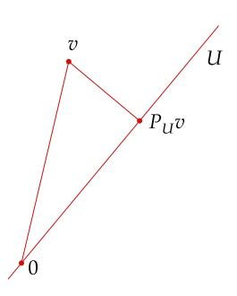

 $P_U v$  is the closest point in U to v.

## 6.63 example: using linear algebra to approximate the sine function

Suppose we want to find a polynomial u with real coefficients and of degree at most 5 that approximates the sine function as well as possible on the interval  $[-\pi, \pi]$ , in the sense that

<span id="page-231-0"></span>
$$\int_{-\pi}^{\pi} \left| \sin x - u(x) \right|^2 dx$$

is as small as possible.

Let  $C[-\pi, \pi]$  denote the real inner product space of continuous real-valued functions on  $[-\pi, \pi]$  with inner product

$$\langle f, g \rangle = \int_{-\pi}^{\pi} f g.$$

Let  $v \in C[-\pi, \pi]$  be the function defined by  $v(x) = \sin x$ . Let U denote the subspace of  $C[-\pi, \pi]$  consisting of the polynomials with real coefficients and of degree at most 5. Our problem can now be reformulated as follows:

Find  $u \in U$  such that ||v - u|| is as small as possible.

To compute the solution to our approximation problem, first apply the Gram–Schmidt procedure (using the in-

A computer that can integrate is useful here.

ner product given by 6.64) to the basis  $1, x, x^2, x^3, x^4, x^5$  of U, producing an orthonormal basis  $e_1, e_2, e_3, e_4, e_5, e_6$  of U. Then, again using the inner product given by 6.64, compute  $P_Uv$  using 6.57(i) (with m = 6). Doing this computation shows that  $P_Uv$  is the function u defined by

<span id="page-231-1"></span>6.65 
$$u(x) = 0.987862x - 0.155271x^3 + 0.00564312x^5,$$

where the  $\pi$ 's that appear in the exact answer have been replaced with a good decimal approximation. By 6.61, the polynomial u above is the best approximation to the sine function on  $[-\pi, \pi]$  using polynomials of degree at most 5 (here "best approximation" means in the sense of minimizing  $\int_{-\pi}^{\pi} |\sin x - u(x)|^2 dx$ ).

To see how good this approximation is, the next figure shows the graphs of both the sine function and our approximation given by [6.65](#page-231-1) over the interval [−, ].

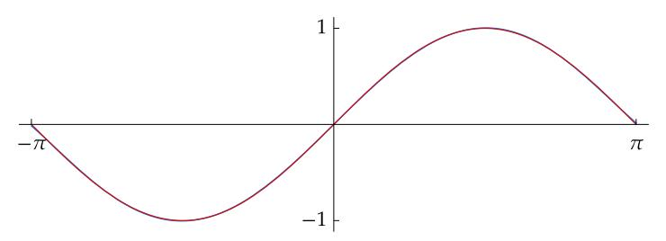

*Graphs on* [−, ] *of the sine function* (*red*) *and its best fifth degree polynomial approximation* (*blue*) *from [6.65.](#page-231-1)*

Our approximation [6.65](#page-231-1) is so accurate that the two graphs are almost identical our eyes may see only one graph! Here the red graph is placed almost exactly over the blue graph. If you are viewing this on an electronic device, enlarge the picture above by 400% near or − to see a small gap between the two graphs.

Another well-known approximation to the sine function by a polynomial of degree 5 is given by the Taylor polynomial defined by

6.66 
$$p(x) = x - \frac{x^3}{3!} + \frac{x^5}{5!}.$$

To see how good this approximation is, the next picture shows the graphs of both the sine function and the Taylor polynomial over the interval [−, ].

<span id="page-232-0"></span>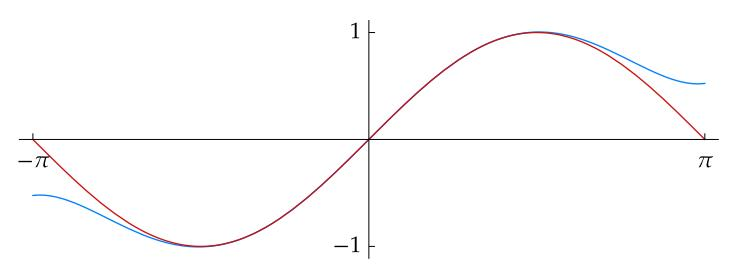

*Graphs on* [−, ] *of the sine function* (*red*) *and the Taylor polynomial* (*blue*) *from [6.66.](#page-232-0)*

The Taylor polynomial of degree 5 is an excellent approximation to sin for near 0. But the picture above shows that for || > 2, the Taylor polynomial is not so accurate, especially compared to [6.65.](#page-231-1) For example, taking = 3, our approximation [6.65](#page-231-1) estimates sin 3 with an error of approximately 0.001, but the Taylor polynomial [6.66](#page-232-0) estimates sin 3 with an error of approximately 0.4. Thus at = 3, the error in the Taylor polynomial is hundreds of times larger than the error given by [6.65.](#page-231-1) Linear algebra has helped us discover an approximation to the sine function that improves upon what we learned in calculus!

#### <span id="page-233-0"></span>Pseudoinverse

Suppose  $T \in \mathcal{L}(V, W)$  and  $w \in W$ . Consider the problem of finding  $v \in V$  such that

$$Tv = w$$
.

For example, if  $V = \mathbf{F}^n$  and  $W = \mathbf{F}^m$ , then the equation above could represent a system of m linear equations in n unknowns  $v_1, ..., v_n$ , where  $v = (v_1, ..., v_n)$ .

If T is invertible, then the unique solution to the equation above is  $v = T^{-1}w$ . However, if T is not invertible, then for some  $w \in W$  there may not exist any solutions of the equation above, and for some  $w \in W$  there may exist infinitely many solutions of the equation above.

If T is not invertible, then we can still try to do as well as possible with the equation above. For example, if the equation above has no solutions, then instead of solving the equation Tv-w=0, we can try to find  $v\in V$  such that  $\|Tv-w\|$  is as small as possible. As another example, if the equation above has infinitely many solutions  $v\in V$ , then among all those solutions we can try to find one such that  $\|v\|$  is as small as possible.

The pseudoinverse will provide the tool to solve the equation above as well as possible, even when T is not invertible. We need the next result to define the pseudoinverse.

In the next two proofs, we will use without further comment the result that if V is finite-dimensional and  $T \in \mathcal{L}(V, W)$ , then null T,  $(\text{null } T)^{\perp}$ , and range T are all finite-dimensional.

## 6.67 restriction of a linear map to obtain a one-to-one and onto map

Suppose V is finite-dimensional and  $T \in \mathcal{L}(V, W)$ . Then  $T|_{(\text{null }T)^{\perp}}$  is an injective map of  $(\text{null }T)^{\perp}$  onto range T.

Proof Suppose that  $v \in (\operatorname{null} T)^{\perp}$  and  $T|_{(\operatorname{null} T)^{\perp}}v = 0$ . Hence Tv = 0 and thus  $v \in (\operatorname{null} T) \cap (\operatorname{null} T)^{\perp}$ , which implies that v = 0 [by 6.48(d)]. Hence  $\operatorname{null} T|_{(\operatorname{null} T)^{\perp}} = \{0\}$ , which implies that  $T|_{(\operatorname{null} T)^{\perp}}$  is injective, as desired.

Clearly range  $T|_{(\text{null }T)^{\perp}}\subseteq \text{range }T.$  To prove the inclusion in the other direction, suppose  $w\in \text{range }T.$  Hence there exists  $v\in V$  such that w=Tv. There exist  $u\in \text{null }T$  and  $x\in (\text{null }T)^{\perp}$  such that v=u+x (by 6.49). Now

$$T|_{(\text{null }T)^{\perp}}x = Tx = Tv - Tu = w - 0 = w,$$

which shows that  $w \in \operatorname{range} T|_{(\operatorname{null} T)^{\perp}}$ . Hence range  $T \subseteq \operatorname{range} T|_{(\operatorname{null} T)^{\perp}}$ , completing the proof that range  $T|_{(\operatorname{null} T)^{\perp}} = \operatorname{range} T$ .

Now we can define the pseudoinverse  $T^{\dagger}$  (pronounced "T dagger") of a linear map T. In the next definition (and from

To produce the pseudoinverse notation  $T^{\dagger}$  in  $T_E X$ , type  $T^{\dagger}$ .

now on), think of  $T|_{(\text{null }T)^{\perp}}$  as an invertible linear map from  $(\text{null }T)^{\perp}$  onto range T, as is justified by the result above.

## <span id="page-234-2"></span>6.68 definition: pseudoinverse, $T^{\dagger}$

<span id="page-234-1"></span>Suppose that *V* is finite-dimensional and  $T \in \mathcal{L}(V, W)$ . The *pseudoinverse*  $T^{\dagger} \in \mathcal{L}(W, V)$  of *T* is the linear map from *W* to *V* defined by

$$T^{\dagger}w = (T|_{(\text{null }T)^{\perp}})^{-1}P_{\text{range }T}w$$

for each  $w \in W$ .

Recall that  $P_{\mathrm{range}\,T}w=0$  if  $w\in(\mathrm{range}\,T)^\perp$  and  $P_{\mathrm{range}\,T}w=w$  if  $w\in\mathrm{range}\,T$ . Thus if  $w\in(\mathrm{range}\,T)^\perp$ , then  $T^\dagger w=0$ , and if  $w\in\mathrm{range}\,T$ , then  $T^\dagger w$  is the unique element of  $(\mathrm{null}\,T)^\perp$  such that  $T(T^\dagger w)=w$ .

The pseudoinverse behaves much like an inverse, as we will see.

## 6.69 algebraic properties of the pseudoinverse

<span id="page-234-0"></span>Suppose *V* is finite-dimensional and  $T \in \mathcal{L}(V, W)$ .

- (a) If T is invertible, then  $T^{\dagger} = T^{-1}$ .
- (b)  $TT^{\dagger} = P_{\text{range }T}$  = the orthogonal projection of W onto range T.
- (c)  $T^{\dagger}T = P_{(\text{null }T)^{\perp}} = \text{the orthogonal projection of } V \text{ onto } (\text{null }T)^{\perp}.$

#### Proof

- (a) Suppose T is invertible. Then  $(\operatorname{null} T)^{\perp} = V$  and range T = W. Thus  $T|_{(\operatorname{null} T)^{\perp}} = T$  and  $P_{\operatorname{range} T}$  is the identity operator on W. Hence  $T^{\dagger} = T^{-1}$ .
- (b) Suppose  $w \in \text{range } T$ . Thus

$$TT^{\dagger}w = T(T|_{(\operatorname{null} T)^{\perp}})^{-1}w = w = P_{\operatorname{range} T}w.$$

If  $w \in (\operatorname{range} T)^{\perp}$ , then  $T^{\dagger}w = 0$ . Hence  $TT^{\dagger}w = 0 = P_{\operatorname{range} T}w$ . Thus  $TT^{\dagger}$  and  $P_{\operatorname{range} T}$  agree on range T and on  $(\operatorname{range} T)^{\perp}$ . Hence these two linear maps are equal (by 6.49).

(c) Suppose  $v \in (\text{null } T)^{\perp}$ . Because  $Tv \in \text{range } T$ , the definition of  $T^{\dagger}$  shows that

$$T^{\dagger}(Tv) = (T|_{(\text{null }T)^{\perp}})^{-1}(Tv) = v = P_{(\text{null }T)^{\perp}}v.$$

If  $v \in \text{null } T$ , then  $T^{\dagger}Tv = 0 = P_{(\text{null } T)^{\perp}}v$ . Thus  $T^{\dagger}T$  and  $P_{(\text{null } T)^{\perp}}$  agree on (null T) and on null T. Hence these two linear maps are equal (by 6.49).

Suppose that  $T \in \mathcal{L}(V, W)$ . If T is surjective, then  $TT^{\dagger}$  is the identity operator on W, as follows from (b) in the result

The pseudoinverse is also called the Moore–Penrose inverse.

above. If T is injective, then  $T^{\dagger}T$  is the identity operator on V, as follows from (c) in the result above. For additional algebraic properties of the pseudoinverse, see Exercises 19–23.

For  $T \in \mathcal{L}(V, W)$  and  $w \in W$ , we now return to the problem of finding  $v \in V$  that solves the equation

$$Tv = w$$
.

As we noted earlier, if T is invertible, then  $v=T^{-1}w$  is the unique solution, but if T is not invertible, then  $T^{-1}$  is not defined. However, the pseudoinverse  $T^{\dagger}$  is defined. Taking  $v=T^{\dagger}w$  makes Tv as close to w as possible, as shown by (a) of the next result. Thus the pseudoinverse provides what is called a *best fit* to the equation above.

Among all vectors  $v \in V$  that make Tv as close as possible to w, the vector  $T^{\dagger}w$  has the smallest norm, as shown by combining (b) in the next result with the condition for equality in (a).

## 6.70 pseudoinverse provides best approximate solution or best solution

Suppose V is finite-dimensional,  $T \in \mathcal{L}(V, W)$ , and  $w \in W$ .

(a) If  $v \in V$ , then

$$\left\|T(T^{\dagger}w) - w\right\| \le \|Tv - w\|,$$

with equality if and only if  $v \in T^{\dagger}w + \text{null } T$ .

(b) If  $v \in T^{\dagger}w + \text{null } T$ , then

$$||T^{\dagger}w|| \le ||v||,$$

with equality if and only if  $v = T^{\dagger}w$ .

#### Proof

(a) Suppose  $v \in V$ . Then

$$Tv - w = (Tv - TT^{\dagger}w) + (TT^{\dagger}w - w).$$

The first term in parentheses above is in range T. Because the operator  $TT^{\dagger}$  is the orthogonal projection of W onto range T [by 6.69(b)], the second term in parentheses above is in (range T) $^{\perp}$  [see 6.57(f)].

Thus the Pythagorean theorem implies the desired inequality that the norm of the second term in parentheses above is less than or equal to ||Tv - w||, with equality if and only if the first term in parentheses above equals 0. Hence we have equality if and only if  $v - T^{\dagger}w \in \text{null } T$ , which is equivalent to the statement that  $v \in T^{\dagger}w + \text{null } T$ , completing the proof of (a).

(b) Suppose  $v \in T^{\dagger}w + \text{null } T$ . Hence  $v - T^{\dagger}w \in \text{null } T$ . Now

$$v = (v - T^{\dagger}w) + T^{\dagger}w.$$

The definition of  $T^{\dagger}$  implies that  $T^{\dagger}w \in (\operatorname{null} T)^{\perp}$ . Thus the Pythagorean theorem implies that  $\|T^{\dagger}w\| \leq \|v\|$ , with equality if and only if  $v = T^{\dagger}w$ .

A formula for  $T^{\dagger}$  will be given in the next chapter (see 7.78).

6.71 example: pseudoinverse of a linear map from  $\mathbf{F}^4$  to  $\mathbf{F}^3$ 

Suppose  $T \in \mathcal{L}(\mathbf{F}^4, \mathbf{F}^3)$  is defined by

$$T(a, b, c, d) = (a + b + c, 2c + d, 0).$$

This linear map is neither injective nor surjective, but we can compute its pseudo-inverse. To do this, first note that range  $T = \{(x, y, 0) : x, y \in F\}$ . Thus

$$P_{\text{range }T}(x, y, z) = (x, y, 0)$$

for each  $(x, y, z) \in \mathbf{F}^3$ . Also,

null 
$$T = \{(a, b, c, d) \in \mathbf{F}^4 : a + b + c = 0 \text{ and } 2c + d = 0\}.$$

The list (-1, 1, 0, 0), (-1, 0, 1, -2) of two vectors in null T spans null T because if  $(a, b, c, d) \in \text{null } T$  then

$$(a, b, c, d) = b(-1, 1, 0, 0) + c(-1, 0, 1, -2).$$

Because the list (-1, 1, 0, 0), (-1, 0, 1, -2) is linearly independent, this list is a basis of null T.

<span id="page-236-0"></span>Now suppose  $(x, y, z) \in \mathbf{F}^3$ . Then

6.72 
$$T^{\dagger}(x, y, z) = (T|_{(\text{null } T)^{\perp}})^{-1} P_{\text{range } T}(x, y, z) = (T|_{(\text{null } T)^{\perp}})^{-1}(x, y, 0).$$

The right side of the equation above is the vector  $(a, b, c, d) \in \mathbf{F}^4$  such that T(a, b, c, d) = (x, y, 0) and  $(a, b, c, d) \in (\text{null } T)^{\perp}$ . In other words, a, b, c, d must satisfy the following equations:

$$a+b+c = x$$

$$2c+d = y$$

$$-a+b = 0$$

$$-a+c-2d = 0,$$

where the first two equations are equivalent to the equation T(a, b, c, d) = (x, y, 0) and the last two equations come from the condition for (a, b, c, d) to be orthogonal to each of the basis vectors (-1, 1, 0, 0), (-1, 0, 1, -2) in this basis of null T. Thinking of x and y as constants and a, b, c, d as unknowns, we can solve the system above of four equations in four unknowns, getting

$$a = \frac{1}{11}(5x - 2y), \ b = \frac{1}{11}(5x - 2y), \ c = \frac{1}{11}(x + 4y), \ d = \frac{1}{11}(-2x + 3y).$$

Hence 6.72 tells us that

$$T^{\dagger}(x, y, z) = \frac{1}{11}(5x - 2y, 5x - 2y, x + 4y, -2x + 3y).$$

The formula above for  $T^{\dagger}$  shows that  $TT^{\dagger}(x,y,z)=(x,y,0)$  for all  $(x,y,z)\in \mathbf{F}^3$ , which illustrates the equation  $TT^{\dagger}=P_{\mathrm{range}\,T}$  from 6.69(b).

#### <span id="page-237-2"></span><span id="page-237-0"></span>Exercises 6C

1 Suppose  $v_1, ..., v_m \in V$ . Prove that

$$\{v_1, ..., v_m\}^{\perp} = (\operatorname{span}(v_1, ..., v_m))^{\perp}.$$

2 Suppose U is a subspace of V with basis  $u_1, ..., u_m$  and

$$u_1, ..., u_m, v_1, ..., v_n$$

is a basis of V. Prove that if the Gram-Schmidt procedure is applied to the basis of V above, producing a list  $e_1, ..., e_m, f_1, ..., f_n$ , then  $e_1, ..., e_m$  is an orthonormal basis of U and  $f_1, ..., f_n$  is an orthonormal basis of  $U^{\perp}$ .

3 Suppose U is the subspace of  $\mathbb{R}^4$  defined by

$$U = \text{span}((1, 2, 3, -4), (-5, 4, 3, 2)).$$

Find an orthonormal basis of U and an orthonormal basis of  $U^{\perp}$ .

<span id="page-237-1"></span>**4** Suppose  $e_1, ..., e_n$  is a list of vectors in V with  $||e_k|| = 1$  for each k = 1, ..., n and

$$||v||^2 = \left|\langle v, e_1 \rangle\right|^2 + \dots + \left|\langle v, e_n \rangle\right|^2$$

for all  $v \in V$ . Prove that  $e_1, ..., e_n$  is an orthonormal basis of V.

This exercise provides a converse to 6.30(b).

- 5 Suppose that *V* is finite-dimensional and *U* is a subspace of *V*. Show that  $P_{U^{\perp}} = I P_{U}$ , where *I* is the identity operator on *V*.
- **6** Suppose *V* is finite-dimensional and  $T \in \mathcal{L}(V, W)$ . Show that

$$T = TP_{(\text{null }T)^{\perp}} = P_{\text{range }T}T.$$

- 7 Suppose that *X* and *Y* are finite-dimensional subspaces of *V*. Prove that  $P_X P_Y = 0$  if and only if  $\langle x, y \rangle = 0$  for all  $x \in X$  and all  $y \in Y$ .
- 8 Suppose U is a finite-dimensional subspace of V and  $v \in V$ . Define a linear functional  $\varphi \colon U \to \mathbf{F}$  by

$$\varphi(u) = \langle u, v \rangle$$

for all  $u \in U$ . By the Riesz representation theorem (6.42) as applied to the inner product space U, there exists a unique vector  $w \in U$  such that

$$\varphi(u) = \langle u, w \rangle$$

for all  $u \in U$ . Show that  $w = P_U v$ .

9 Suppose V is finite-dimensional. Suppose  $P \in \mathcal{L}(V)$  is such that  $P^2 = P$  and every vector in null P is orthogonal to every vector in range P. Prove that there exists a subspace U of V such that  $P = P_U$ .

<span id="page-238-2"></span>10 Suppose V is finite-dimensional and  $P \in \mathcal{L}(V)$  is such that  $P^2 = P$  and

$$||Pv|| \le ||v||$$

for every  $v \in V$ . Prove that there exists a subspace U of V such that  $P = P_U$ .

11 Suppose  $T \in \mathcal{L}(V)$  and U is a finite-dimensional subspace of V. Prove that

*U* is invariant under 
$$T \iff P_{II}TP_{II} = TP_{II}$$
.

12 Suppose V is finite-dimensional,  $T \in \mathcal{L}(V)$ , and U is a subspace of V. Prove that

U and  $U^{\perp}$  are both invariant under  $T \iff P_{II}T = TP_{II}$ .

<span id="page-238-0"></span>Suppose  $\mathbf{F} = \mathbf{R}$  and V is finite-dimensional. For each  $v \in V$ , let  $\varphi_v$  denote the linear functional on V defined by

$$\varphi_v(u) = \langle u, v \rangle$$

for all  $u \in V$ .

- (a) Show that  $v \mapsto \varphi_v$  is an injective linear map from V to V'.
- (b) Use (a) and a dimension-counting argument to show that  $v \mapsto \varphi_v$  is an isomorphism from V onto V'.

The purpose of this exercise is to give an alternative proof of the Riesz representation theorem (6.42 and 6.58) when F = R. Thus you should not use the Riesz representation theorem as a tool in your solution.

- Suppose that  $e_1, ..., e_n$  is an orthonormal basis of V. Explain why the dual basis (see 3.112) of  $e_1, ..., e_n$  is  $e_1, ..., e_n$  under the identification of V' with V provided by the Riesz representation theorem (6.58).
- 15 In  $\mathbb{R}^4$ , let

$$U = \text{span}((1, 1, 0, 0), (1, 1, 1, 2)).$$

Find  $u \in U$  such that ||u - (1, 2, 3, 4)|| is as small as possible.

<span id="page-238-1"></span>Suppose C[-1,1] is the vector space of continuous real-valued functions on the interval [-1,1] with inner product given by

$$\langle f, g \rangle = \int_{-1}^{1} fg$$

for all  $f, g \in C[-1, 1]$ . Let U be the subspace of C[-1, 1] defined by

$$U = \{ f \in C[-1, 1] : f(0) = 0 \}.$$

- (a) Show that  $U^{\perp} = \{0\}$ .
- (b) Show that 6.49 and 6.52 do not hold without the finite-dimensional hypothesis.

- 17 Find  $p \in \mathcal{P}_3(\mathbf{R})$  such that p(0) = 0, p'(0) = 0, and  $\int_0^1 |2 + 3x p(x)|^2 dx$  is as small as possible.
- **18** Find  $p \in \mathcal{P}_5(\mathbf{R})$  that makes  $\int_{-\pi}^{\pi} \left| \sin x p(x) \right|^2 dx$  as small as possible.

The polynomial 6.65 is an excellent approximation to the answer to this exercise, but here you are asked to find the exact solution, which involves powers of  $\pi$ . A computer that can perform symbolic integration should help.

- <span id="page-239-0"></span>Suppose *V* is finite-dimensional and  $P \in \mathcal{L}(V)$  is an orthogonal projection of *V* onto some subspace of *V*. Prove that  $P^{\dagger} = P$ .
- 20 Suppose V is finite-dimensional and  $T \in \mathcal{L}(V, W)$ . Show that

$$\operatorname{null} T^{\dagger} = (\operatorname{range} T)^{\perp} \quad \text{and} \quad \operatorname{range} T^{\dagger} = (\operatorname{null} T)^{\perp}.$$

21 Suppose  $T \in \mathcal{L}(\mathbf{F}^3, \mathbf{F}^2)$  is defined by

$$T(a, b, c) = (a + b + c, 2b + 3c).$$

- (a) For  $(x, y) \in \mathbf{F}^2$ , find a formula for  $T^{\dagger}(x, y)$ .
- (b) Verify that the equation  $TT^{\dagger} = P_{\text{range }T}$  from 6.69(b) holds with the formula for  $T^{\dagger}$  obtained in (a).
- (c) Verify that the equation  $T^{\dagger}T = P_{(\text{null }T)^{\perp}}$  from 6.69(c) holds with the formula for  $T^{\dagger}$  obtained in (a).
- 22 Suppose V is finite-dimensional and  $T \in \mathcal{L}(V, W)$ . Prove that

$$TT^{\dagger}T = T$$
 and  $T^{\dagger}TT^{\dagger} = T^{\dagger}$ .

Both formulas above clearly hold if T is invertible because in that case we can replace  $T^{\dagger}$  with  $T^{-1}$ .

<span id="page-239-1"></span>23 Suppose V and W are finite-dimensional and  $T \in \mathcal{L}(V, W)$ . Prove that

$$(T^{\dagger})^{\dagger} = T.$$

The equation above is analogous to the equation  $(T^{-1})^{-1} = T$  that holds if T is invertible.

## Chapter 7

# <span id="page-240-1"></span><span id="page-240-0"></span>*Operators on Inner Product Spaces*

The deepest results related to inner product spaces deal with the subject to which we now turn—linear maps and operators on inner product spaces. As we will see, good theorems can be proved by exploiting properties of the adjoint.

The hugely important spectral theorem will provide a complete description of self-adjoint operators on real inner product spaces and of normal operators on complex inner product spaces. We will then use the spectral theorem to help understand positive operators and unitary operators, which will lead to unitary matrices and matrix factorizations. The spectral theorem will also lead to the popular singular value decomposition, which will lead to the polar decomposition.

The most important results in the rest of this book are valid only in finite dimensions. Thus from now on we assume that and are finite-dimensional.

## *standing assumptions for this chapter*

- denotes or .
- and are nonzero finite-dimensional inner product spaces over .


Petar Milošević CC BY-SA

*Market square in Lviv, a city that has had several names and has been in several countries because of changing international borders. From 1772 until 1918, the city was in Austria and was called Lemberg. Between World War I and World War II, the city was in Poland and was called Lwów. During this time, mathematicians in Lwów, particularly Stefan Banach* (*1892–1945*) *and his colleagues, developed the basic results of modern functional analysis, using tools of analysis to study infinite-dimensional vector spaces.*

*Since the end of World War II, Lviv has been in Ukraine, which was part of the Soviet Union until Ukraine became an independent country in 1991.*

## <span id="page-241-2"></span><span id="page-241-0"></span>7A Self-Adjoint and Normal Operators

## <span id="page-241-1"></span>Adjoints

## 7.1 definition: adjoint, $T^*$

Suppose  $T \in \mathcal{L}(V, W)$ . The *adjoint* of T is the function  $T^* \colon W \to V$  such that

$$\langle Tv, w \rangle = \langle v, T^*w \rangle$$

for every  $v \in V$  and every  $w \in W$ .

To see why the definition above makes sense, suppose  $T \in \mathcal{L}(V, W)$ . Fix  $w \in W$ . Consider the linear functional

$$v \mapsto \langle Tv, w \rangle$$

The word adjoint has another meaning in linear algebra. In case you encounter the second meaning elsewhere, be warned that the two meanings for adjoint are unrelated to each other.

on V that maps  $v \in V$  to  $\langle Tv, w \rangle$ ; this linear functional depends on T and w. By the Riesz representation theorem (6.42), there exists a unique vector in V such that this linear functional is given by taking the inner product with it. We call this unique vector  $T^*w$ . In other words,  $T^*w$  is the unique vector in V such that

$$\langle Tv, w \rangle = \langle v, T^*w \rangle$$

for every  $v \in V$ .

In the equation above, the inner product on the left takes place in W and the inner product on the right takes place in V. However, we use the same notation  $\langle \cdot, \cdot \rangle$  for both inner products.

7.2 example: adjoint of a linear map from  $\mathbb{R}^3$  to  $\mathbb{R}^2$ 

Define  $T: \mathbb{R}^3 \to \mathbb{R}^2$  by

$$T(x_1,x_2,x_3)=(x_2+3x_3,2x_1)\,.$$

To compute  $T^*$ , suppose  $(x_1, x_2, x_3) \in \mathbb{R}^3$  and  $(y_1, y_2) \in \mathbb{R}^2$ . Then

$$\begin{split} \left\langle T(x_1,x_2,x_3),(y_1,y_2) \right\rangle &= \left\langle (x_2+3x_3,2x_1),(y_1,y_2) \right\rangle \\ &= x_2y_1+3x_3y_1+2x_1y_2 \\ &= \left\langle (x_1,x_2,x_3),(2y_2,y_1,3y_1) \right\rangle. \end{split}$$

The equation above and the definition of the adjoint imply that

$$T^*(y_1, y_2) = (2y_2, y_1, 3y_1).$$

7.3 example: *adjoint of a linear map with range of dimension at most* 1

Fix ∈ and ∈ . Define ∈ ℒ(, ) by

$$Tv = \langle v, u \rangle x$$

for each ∈ . To compute ∗ , suppose ∈ and ∈ . Then

$$\langle Tv, w \rangle = \langle \langle v, u \rangle x, w \rangle$$
$$= \langle v, u \rangle \langle x, w \rangle$$
$$= \langle v, \langle w, x \rangle u \rangle.$$

Thus

$$T^*w = \langle w, x \rangle u.$$

In the two examples above, ∗ turned out to be not just a function from to but a linear map from to . This behavior is true in general, as shown by the next result.

*The two examples above and the proof below use a common technique for computing* ∗ *: start with a formula for* ⟨, ⟩ *then manipulate it to get just in the first slot; the entry in the second slot will then be* <sup>∗</sup>*.*

7.4 *adjoint of a linear map is a linear map*

If ∈ ℒ(, ), then <sup>∗</sup> ∈ ℒ(, ).

Proof Suppose ∈ ℒ(, ). If ∈ and <sup>1</sup> , <sup>2</sup> ∈ , then

$$\begin{split} \langle Tv, w_1 + w_2 \rangle &= \langle Tv, w_1 \rangle + \langle Tv, w_2 \rangle \\ &= \langle v, T^*w_1 \rangle + \langle v, T^*w_2 \rangle \\ &= \langle v, T^*w_1 + T^*w_2 \rangle. \end{split}$$

The equation above shows that

$$T^*(w_1 + w_2) = T^*w_1 + T^*w_2.$$

If ∈ , ∈ , and ∈ , then

$$\langle Tv, \lambda w \rangle = \overline{\lambda} \langle Tv, w \rangle$$
$$= \overline{\lambda} \langle v, T^*w \rangle$$
$$= \langle v, \lambda T^*w \rangle.$$

The equation above shows that

$$T^*(\lambda w) = \lambda T^*w.$$

Thus ∗ is a linear map, as desired.

## 7.5 properties of the adjoint

<span id="page-243-0"></span>Suppose  $T \in \mathcal{L}(V, W)$ . Then

- (a)  $(S + T)^* = S^* + T^*$  for all  $S \in \mathcal{L}(V, W)$ ;
- (b)  $(\lambda T)^* = \overline{\lambda} T^*$  for all  $\lambda \in \mathbf{F}$ ;
- (c)  $(T^*)^* = T$ ;
- (d)  $(ST)^* = T^*S^*$  for all  $S \in \mathcal{L}(W, U)$  (here U is a finite-dimensional inner product space over  $\mathbf{F}$ );
- (e)  $I^* = I$ , where I is the identity operator on V;
- (f) if T is invertible, then  $T^*$  is invertible and  $(T^*)^{-1} = (T^{-1})^*$ .

Proof Suppose  $v \in V$  and  $w \in W$ .

(a) If  $S \in \mathcal{L}(V, W)$ , then

$$\langle (S+T)v, w \rangle = \langle Sv, w \rangle + \langle Tv, w \rangle$$
$$= \langle v, S^*w \rangle + \langle v, T^*w \rangle$$
$$= \langle v, S^*w + T^*w \rangle.$$

Thus  $(S + T)^* w = S^* w + T^* w$ , as desired.

(b) If  $\lambda \in \mathbf{F}$ , then

$$\langle (\lambda T) v, w \rangle = \lambda \langle Tv, w \rangle = \lambda \langle v, T^*w \rangle = \langle v, \overline{\lambda} T^*w \rangle.$$

Thus  $(\lambda T)^* w = \overline{\lambda} T^* w$ , as desired.

(c) We have

$$\langle T^*w,v\rangle=\overline{\langle v,T^*w\rangle}=\overline{\langle Tv,w\rangle}=\langle w,Tv\rangle.$$

Thus  $(T^*)^*v = Tv$ , as desired.

(d) Suppose  $S \in \mathcal{L}(W, U)$  and  $u \in U$ . Then

$$\langle (ST)v, u \rangle = \langle S(Tv), u \rangle = \langle Tv, S^*u \rangle = \langle v, T^*(S^*u) \rangle.$$

Thus  $(ST)^*u = T^*(S^*u)$ , as desired.

(e) Suppose  $u \in V$ . Then

$$\langle Iu, v \rangle = \langle u, v \rangle.$$

Thus  $I^*v = v$ , as desired.

(f) Suppose T is invertible. Take adjoints of both sides of the equation  $T^{-1}T = I$ , then use (d) and (e) to show that  $T^*(T^{-1})^* = I$ . Similarly, the equation  $TT^{-1} = I$  implies  $(T^{-1})^*T^* = I$ . Thus  $(T^{-1})^*$  is the inverse of  $T^*$ , as desired.

If  $\mathbf{F} = \mathbf{R}$ , then the map  $T \mapsto T^*$  is a linear map from  $\mathcal{L}(V, W)$  to  $\mathcal{L}(W, V)$ , as follows from (a) and (b) of the result above. However, if  $\mathbf{F} = \mathbf{C}$ , then this map is not linear because of the complex conjugate that appears in (b).

<span id="page-244-1"></span>The next result shows the relationship between the null space and the range of a linear map and its adjoint.

## 7.6 *null space and range of* $T^*$

<span id="page-244-0"></span>Suppose  $T \in \mathcal{L}(V, W)$ . Then

- (a) null  $T^* = (\text{range } T)^{\perp}$ ;
- (b) range  $T^* = (\text{null } T)^{\perp}$ ;
- (c) null  $T = (\text{range } T^*)^{\perp}$ ;
- (d) range  $T = (\text{null } T^*)^{\perp}$ .

Proof We begin by proving (a). Let  $w \in W$ . Then

$$w \in \operatorname{null} T^* \iff T^*w = 0$$
  
 $\iff \langle v, T^*w \rangle = 0 \text{ for all } v \in V$   
 $\iff \langle Tv, w \rangle = 0 \text{ for all } v \in V$   
 $\iff w \in (\operatorname{range} T)^{\perp}.$ 

Thus null  $T^* = (\text{range } T)^{\perp}$ , proving (a).

If we take the orthogonal complement of both sides of (a), we get (d), where we have used 6.52. Replacing T with  $T^*$  in (a) gives (c), where we have used 7.5(c). Finally, replacing T with  $T^*$  in (d) gives (b).

As we will soon see, the next definition is intimately connected to the matrix of the adjoint of a linear map.

## 7.7 definition: conjugate transpose, $A^*$

The *conjugate transpose* of an m-by-n matrix A is the n-by-m matrix  $A^*$  obtained by interchanging the rows and columns and then taking the complex conjugate of each entry. In other words, if  $j \in \{1, ..., n\}$  and  $k \in \{1, ..., m\}$ , then

$$(A^*)_{j,k} = \overline{A_{k,j}}.$$

## 7.8 example: conjugate transpose of a 2-by-3 matrix

The conjugate transpose of the 2-by-3 matrix  $\begin{pmatrix} 2 & 3+4i & 7 \\ 6 & 5 & 8i \end{pmatrix}$  is the 3-by-2 matrix  $\begin{pmatrix} 2 & 6 \\ & & & & & & & & & & & & & & & & &$ 

If a matrix A has only real entries, then  $A^* = A^t$ , where  $A^t$  denotes the transpose of A (the matrix obtained by interchanging the rows and the columns).

<span id="page-245-1"></span>The next result shows how to compute the matrix of  $T^*$  from the matrix of T. **Caution:** With respect to nonorthonormal bases, the matrix of  $T^*$  does not necessarily equal the conjugate transpose of the matrix of T.

The adjoint of a linear map does not depend on a choice of basis. Thus we frequently emphasize adjoints of linear maps instead of transposes or conjugate transposes of matrices.

#### matrix of $T^*$ equals conjugate transpose of matrix of T7.9

<span id="page-245-0"></span>Let  $T \in \mathcal{L}(V, W)$ . Suppose  $e_1, ..., e_n$  is an orthonormal basis of V and  $f_1,...,f_m$  is an orthonormal basis of W. Then  $\mathcal{M}(T^*,(f_1,...,f_m),(e_1,...,e_n))$ is the conjugate transpose of  $\mathcal{M}(T, (e_1, ..., e_n), (f_1, ..., f_m))$ . In other words,

$$\mathcal{M}(T^*) = (\mathcal{M}(T))^*.$$

In this proof, we will write  $\mathcal{M}(T)$  and  $\mathcal{M}(T^*)$  instead of the longer

expressions  $\mathcal{M}(T, (e_1, ..., e_n), (f_1, ..., f_m))$  and  $\mathcal{M}(T^*, (f_1, ..., f_m), (e_1, ..., e_n))$ . Recall that we obtain the  $k^{\text{th}}$  column of  $\mathcal{M}(T)$  by writing  $Te_k$  as a linear combination of the  $f_i$ 's; the scalars used in this linear combination then become the  $k^{th}$  column of  $\mathcal{M}(T)$ . Because  $f_1, ..., f_m$  is an orthonormal basis of W, we know how to write  $Te_k$  as a linear combination of the  $f_i$ 's [see 6.30(a)]:

$$Te_k = \langle Te_k, f_1 \rangle f_1 + \dots + \langle Te_k, f_m \rangle f_m.$$

Thus

the entry in row j, column k, of  $\mathcal{M}(T)$  is  $\langle Te_k, f_i \rangle$ .

In the statement above, replace T with  $T^*$  and interchange  $e_1, ..., e_n$  and  $f_1, ..., f_m$ . This shows that the entry in row j, column k, of  $\mathcal{M}(T^*)$  is  $\langle T^*f_k, e_j \rangle$ , which equals  $\langle f_k, Te_i \rangle$ , which equals  $\overline{\langle Te_i, f_k \rangle}$ , which equals the complex conjugate of the entry in row k, column j, of  $\mathcal{M}(T)$ . Thus  $\mathcal{M}(T^*) = (\mathcal{M}(T))^*$ .

The Riesz representation theorem as stated in 6.58 provides an identification of V with its dual space V' defined in 3.110. Under this identification, the orthogonal complement  $U^{\perp}$  of a subset  $U \subseteq V$  corresponds to the annihilator  $U^0$  of U. If Uis a subspace of V, then the formulas for the dimensions of  $U^{\perp}$  and  $U^{0}$  become identical under this identification—see 3.125 and 6.51.

Suppose  $T: V \to W$  is a linear map. Under the identification of V with V' and the identification of W with W', the adjoint map  $T^* : W \to V$  corresponds to the dual map  $T' : W' \rightarrow V'$  defined in 3.118, as Exercise 32 asks you to verify. Under this identification, the formulas for

Because orthogonal complements and adjoints are easier to deal with than annihilators and dual maps, there is no need to work with annihilators and dual maps in the context of inner product spaces.

null  $T^*$  and range  $T^*$  [7.6(a) and (b)] then become identical to the formulas for null T' and range T' [3.128(a) and 3.130(b)]. Furthermore, the theorem about the matrix of  $T^*$  (7.9) is analogous to the theorem about the matrix of T' (3.132).

## <span id="page-246-2"></span><span id="page-246-0"></span>Self-Adjoint Operators

Now we switch our attention to operators on inner product spaces. Instead of considering linear maps from V to W, we will focus on linear maps from V to V; recall that such linear maps are called operators.

7.10 definition: self-adjoint

An operator  $T \in \mathcal{L}(V)$  is called *self-adjoint* if  $T = T^*$ .

If  $T \in \mathcal{L}(V)$  and  $e_1, ..., e_n$  is an orthonormal basis of V, then T is self-adjoint if and only if  $\mathcal{M}(T, (e_1, ..., e_n)) = \mathcal{M}(T, (e_1, ..., e_n))^*$ , as follows from 7.9.

7.11 example: determining whether T is self-adjoint from its matrix

Suppose  $c \in \mathbf{F}$  and T is the operator on  $\mathbf{F}^2$  whose matrix (with respect to the standard basis) is

 $\mathcal{M}(T) = \left(\begin{array}{cc} 2 & c \\ 3 & 7 \end{array}\right).$ 

The matrix of  $T^*$  (with respect to the standard basis) is

$$\mathcal{M}(T^*) = \left(\begin{array}{cc} 2 & 3\\ \overline{c} & 7 \end{array}\right).$$

Thus  $\mathcal{M}(T) = \mathcal{M}(T^*)$  if and only if c = 3. Hence the operator T is self-adjoint if and only if c = 3.

A good analogy to keep in mind is that the adjoint on  $\mathcal{L}(V)$  plays a role similar to that of the complex conjugate on  $\mathbf{C}$ . A complex number z is real if and only if  $z=\overline{z}$ ; thus a self-adjoint operator  $(T=T^*)$  is analogous to a real number.

We will see that the analogy discussed above is reflected in some important properties of self-adjoint operators, beginning with eigenvalues in the next result.

If F = R, then by definition every eigenvalue is real, so the next result is interesting only when F = C.

An operator  $T \in \mathcal{L}(V)$  is self-adjoint if and only if

$$\langle Tv, w \rangle = \langle v, Tw \rangle$$

for all  $v, w \in V$ .

## 7.12 eigenvalues of self-adjoint operators

<span id="page-246-1"></span>Every eigenvalue of a self-adjoint operator is real.

**Proof** Suppose T is a self-adjoint operator on V. Let  $\lambda$  be an eigenvalue of T, and let v be a nonzero vector in V such that  $Tv = \lambda v$ . Then

$$\lambda \|v\|^2 = \langle \lambda v, v \rangle = \langle Tv, v \rangle = \langle v, Tv \rangle = \langle v, \lambda v \rangle = \overline{\lambda} \|v\|^2.$$

Thus  $\lambda = \overline{\lambda}$ , which means that  $\lambda$  is real, as desired.

The next result is false for real inner product spaces. As an example, consider the operator ∈ ℒ( <sup>2</sup>) that is a counterclockwise rotation of 90<sup>∘</sup> around the origin; thus (, ) = (−, ). Notice that is orthogonal to for every ∈ <sup>2</sup> , even though ≠ 0.

7.13 Tv is orthogonal to v for all 
$$v \iff T = 0$$
 (assuming  $F = C$ )

<span id="page-247-0"></span>Suppose is a complex inner product space and ∈ ℒ(). Then

$$\langle Tv, v \rangle = 0$$
 for every  $v \in V \iff T = 0$ .

Proof If , ∈ , then

$$\begin{split} \langle Tu,w\rangle &= \frac{\left\langle T(u+w),u+w\right\rangle - \left\langle T(u-w),u-w\right\rangle}{4} \\ &+ \frac{\left\langle T(u+iw),u+iw\right\rangle - \left\langle T(u-iw),u-iw\right\rangle}{4}\,i, \end{split}$$

as can be verified by computing the right side. Note that each term on the right side is of the form ⟨, ⟩ for appropriate ∈ .

Now suppose ⟨, ⟩ = 0 for every ∈ . Then the equation above implies that ⟨, ⟩ = 0 for all , ∈ , which then implies that = 0 for every ∈ (take = ). Hence = 0, as desired.

The next result is false for real inner product spaces, as shown by considering any operator on a real inner product space that is not self-adjoint.

*The next result provides another good example of how self-adjoint operators behave like real numbers.*

## 7.14 ⟨, ⟩ *is real for all* ⟺ *is self-adjoint* (*assuming* = )

<span id="page-247-2"></span>Suppose is a complex inner product space and ∈ ℒ(). Then

<span id="page-247-1"></span>T is self-adjoint 
$$\iff \langle Tv, v \rangle \in \mathbf{R}$$
 for every  $v \in V$ .

Proof If ∈ , then

7.15 
$$\langle T^*v, v \rangle = \overline{\langle v, T^*v \rangle} = \overline{\langle Tv, v \rangle}.$$

Now

$$T$$
 is self-adjoint  $\iff T - T^* = 0$  
$$\iff \langle (T - T^*)v, v \rangle = 0 \text{ for every } v \in V$$
 
$$\iff \langle Tv, v \rangle - \overline{\langle Tv, v \rangle} = 0 \text{ for every } v \in V$$
 
$$\iff \langle Tv, v \rangle \in \mathbf{R} \text{ for every } v \in V,$$

where the second equivalence follows from [7.13](#page-247-0) as applied to − <sup>∗</sup> and the third equivalence follows from [7.15.](#page-247-1)

<span id="page-248-4"></span>On a real inner product space V, a nonzero operator T might satisfy  $\langle Tv, v \rangle = 0$  for all  $v \in V$ . However, the next result shows that this cannot happen for a self-adjoint operator.

7.16 
$$T$$
 self-adjoint and  $\langle Tv, v \rangle = 0$  for all  $v \iff T = 0$ 

<span id="page-248-2"></span>Suppose T is a self-adjoint operator on V. Then

$$\langle Tv, v \rangle = 0$$
 for every  $v \in V \iff T = 0$ .

Proof We have already proved this (without the hypothesis that T is self-adjoint) when V is a complex inner product space (see 7.13). Thus we can assume that V is a real inner product space. If  $u, w \in V$ , then

<span id="page-248-1"></span>7.17 
$$\langle Tu, w \rangle = \frac{\langle T(u+w), u+w \rangle - \langle T(u-w), u-w \rangle}{4},$$

as can be proved by computing the right side using the equation

$$\langle Tw, u \rangle = \langle w, Tu \rangle = \langle Tu, w \rangle,$$

where the first equality holds because *T* is self-adjoint and the second equality holds because we are working in a real inner product space.

Now suppose  $\langle Tv,v\rangle=0$  for every  $v\in V$ . Because each term on the right side of 7.17 is of the form  $\langle Tv,v\rangle$  for appropriate v, this implies that  $\langle Tu,w\rangle=0$  for all  $u,w\in V$ . This implies that Tu=0 for every  $u\in V$  (take w=Tu). Hence T=0, as desired.

## <span id="page-248-0"></span>Normal Operators

#### 7.18 definition: normal

- An operator on an inner product space is called *normal* if it commutes with its adjoint.
- In other words,  $T \in \mathcal{L}(V)$  is normal if  $TT^* = T^*T$ .

Every self-adjoint operator is normal, because if T is self-adjoint then  $T^* = T$  and hence T commutes with  $T^*$ .

<span id="page-248-3"></span>7.19 example: an operator that is normal but not self-adjoint

Let T be the operator on  $\mathbf{F}^2$  whose matrix (with respect to the standard basis) is

$$\begin{pmatrix} 2 & -3 \\ 3 & 2 \end{pmatrix}$$
.

Thus T(w, z) = (2w - 3z, 3w + 2z).

This operator is not self-adjoint because the entry in row 2, column 1 (which equals 3) does not equal the complex conjugate of the entry in row 1, column 2 (which equals −3).

The matrix of <sup>∗</sup> equals

$$\begin{pmatrix} 2 & -3 \\ 3 & 2 \end{pmatrix} \begin{pmatrix} 2 & 3 \\ -3 & 2 \end{pmatrix}$$
, which equals  $\begin{pmatrix} 13 & 0 \\ 0 & 13 \end{pmatrix}$ .

Similarly, the matrix of <sup>∗</sup> equals

$$\begin{pmatrix} 2 & 3 \\ -3 & 2 \end{pmatrix} \begin{pmatrix} 2 & -3 \\ 3 & 2 \end{pmatrix}$$
, which equals  $\begin{pmatrix} 13 & 0 \\ 0 & 13 \end{pmatrix}$ .

Because <sup>∗</sup> and <sup>∗</sup> have the same matrix, we see that <sup>∗</sup> = ∗. Thus is normal.

In the next section we will see why normal operators are worthy of special attention. The next result provides a useful characterization of normal operators.

7.20 *is normal if and only if and* <sup>∗</sup> *have the same norm*

<span id="page-249-0"></span>Suppose ∈ ℒ(). Then

is normal ⟺ ‖‖ = ‖∗‖ for every ∈ .

Proof We have

$$T$$
 is normal  $\iff T^*T - TT^* = 0$ 

$$\iff \langle (T^*T - TT^*)v, v \rangle = 0 \text{ for every } v \in V$$

$$\iff \langle T^*Tv, v \rangle = \langle TT^*v, v \rangle \text{ for every } v \in V$$

$$\iff \langle Tv, Tv \rangle = \langle T^*v, T^*v \rangle \text{ for every } v \in V$$

$$\iff ||Tv||^2 = ||T^*v||^2 \text{ for every } v \in V$$

$$\iff ||Tv|| = ||T^*v|| \text{ for every } v \in V,$$

where we used [7.16](#page-248-2) to establish the second equivalence (note that the operator <sup>∗</sup> − <sup>∗</sup> is self-adjoint).

The next result presents several consequences of the result above. Compare (e) of the next result to Exercise [3.](#page-252-2) That exercise states that the eigenvalues of the adjoint of each operator are equal (as a set) to the complex conjugates of the eigenvalues of the operator. The exercise says nothing about eigenvectors, because an operator and its adjoint may have different eigenvectors. However, (e) of the next result implies that a normal operator and its adjoint have the same eigenvectors.

## 7.21 *range, null space, and eigenvectors of a normal operator*

<span id="page-250-0"></span>Suppose ∈ ℒ() is normal. Then

- (a) null = null ∗ ;
- (b) range = range ∗ ;
- (c) = null ⊕ range ;
- (d) − is normal for every ∈ ;
- (e) if ∈ and ∈ , then = if and only if <sup>∗</sup> = .

#### Proof

(a) Suppose ∈ . Then

$$v \in \operatorname{null} T \iff ||Tv|| = 0 \iff ||T^*v|| = 0 \iff v \in \operatorname{null} T^*,$$

where the middle equivalence above follows from [7.20.](#page-249-0) Thus null = null ∗ .

(b) We have

range 
$$T = (\text{null } T^*)^{\perp} = (\text{null } T)^{\perp} = \text{range } T^*,$$

where the first equality comes from [7.6\(](#page-244-0)d), the second equality comes from (a) in this result, and the third equality comes from [7.6\(](#page-244-0)b).

(c) We have

$$V = (\text{null } T) \oplus (\text{null } T)^{\perp} = \text{null } T \oplus \text{range } T^* = \text{null } T \oplus \text{range } T,$$

where the first equality comes from [6.49,](#page-225-0) the second equality comes from [7.6\(](#page-244-0)b), and the third equality comes from (b) in this result.

(d) Suppose ∈ . Then

$$(T - \lambda I)(T - \lambda I)^* = (T - \lambda I)(T^* - \overline{\lambda}I)$$

$$= TT^* - \overline{\lambda}T - \lambda T^* + |\lambda|^2 I$$

$$= T^*T - \overline{\lambda}T - \lambda T^* + |\lambda|^2 I$$

$$= (T^* - \overline{\lambda}I)(T - \lambda I)$$

$$= (T - \lambda I)^*(T - \lambda I).$$

Thus − commutes with its adjoint. Hence − is normal.

(e) Suppose ∈ and ∈ . Then (d) and [7.20](#page-249-0) imply that

$$\|(T - \lambda I)v\| = \|(T - \lambda I)^*v\| = \|(T^* - \overline{\lambda}I)v\|.$$

Thus ‖( − )‖ = 0 if and only if ∥( <sup>∗</sup> − )∥ = 0. Hence = if and only if <sup>∗</sup> = .

Because every self-adjoint operator is normal, the next result applies in particular to self-adjoint operators.

## 7.22 *orthogonal eigenvectors for normal operators*

Suppose ∈ ℒ() is normal. Then eigenvectors of corresponding to distinct eigenvalues are orthogonal.

Proof Suppose , are distinct eigenvalues of , with corresponding eigenvectors , . Thus = and = . From [7.21\(](#page-250-0)e) we have <sup>∗</sup> = . Thus

$$\begin{split} (\alpha - \beta)\langle u, v \rangle &= \langle \alpha u, v \rangle - \langle u, \overline{\beta} v \rangle \\ &= \langle Tu, v \rangle - \langle u, T^* v \rangle \\ &= 0. \end{split}$$

Because ≠ , the equation above implies that ⟨, ⟩ = 0. Thus and are orthogonal, as desired.

As stated here, the next result makes sense only when = . However, see Exercise [12](#page-253-0) for a version that makes sense when = and when = .

Suppose = and ∈ ℒ(). Under the analogy between ℒ() and , with the adjoint on ℒ() playing a similar role to that of the complex conjugate on , the operators and as defined by [7.24](#page-251-0) correspond to the real and imaginary parts of . Thus the informal title of the result below should make sense.

## 7.23 *is normal* ⟺ *the real and imaginary parts of commute*

Suppose = and ∈ ℒ(). Then is normal if and only if there exist commuting self-adjoint operators and such that = + .

Proof First suppose is normal. Let

<span id="page-251-0"></span>7.24 
$$A = \frac{T + T^*}{2}$$
 and  $B = \frac{T - T^*}{2i}$ .

Then and are self-adjoint and = + . A quick computation shows that

<span id="page-251-1"></span>7.25 
$$AB - BA = \frac{T^*T - TT^*}{2i}.$$

Because is normal, the right side of the equation above equals 0. Thus the operators and commute, as desired.

To prove the implication in the other direction, now suppose there exist commuting self-adjoint operators and such that = + . Then <sup>∗</sup> = − . Adding the last two equations and then dividing by 2 produces the equation for in [7.24.](#page-251-0) Subtracting the last two equations and then dividing by 2 produces the equation for in [7.24.](#page-251-0) Now [7.24](#page-251-0) implies [7.25.](#page-251-1) Because and commute, [7.25](#page-251-1) implies that is normal, as desired.

<span id="page-252-5"></span><span id="page-252-0"></span>1 Suppose *n* is a positive integer. Define  $T \in \mathcal{L}(\mathbf{F}^n)$  by

$$T(z_1,...,z_n) = (0,z_1,...,z_{n-1}).$$

Find a formula for  $T^*(z_1,...,z_n)$ .

2 Suppose  $T \in \mathcal{L}(V, W)$ . Prove that

$$T = 0 \iff T^* = 0 \iff T^*T = 0 \iff TT^* = 0.$$

<span id="page-252-2"></span>**3** Suppose  $T \in \mathcal{L}(V)$  and  $\lambda \in \mathbf{F}$ . Prove that

 $\lambda$  is an eigenvalue of  $T \iff \overline{\lambda}$  is an eigenvalue of  $T^*$ .

**4** Suppose  $T \in \mathcal{L}(V)$  and U is a subspace of V. Prove that

U is invariant under  $T \iff U^{\perp}$  is invariant under  $T^*$ .

<span id="page-252-4"></span>**5** Suppose  $T \in \mathcal{L}(V, W)$ . Suppose  $e_1, ..., e_n$  is an orthonormal basis of V and  $f_1, ..., f_m$  is an orthonormal basis of W. Prove that

$$\|Te_1\|^2 + \dots + \|Te_n\|^2 = \left\|T^*f_1\right\|^2 + \dots + \left\|T^*f_m\right\|^2.$$

The numbers  $||Te_1||^2$ , ...,  $||Te_n||^2$  in the equation above depend on the orthonormal basis  $e_1$ , ...,  $e_n$ , but the right side of the equation does not depend on  $e_1$ , ...,  $e_n$ . Thus the equation above shows that the sum on the left side does not depend on which orthonormal basis  $e_1$ , ...,  $e_n$  is used.

- **6** Suppose  $T \in \mathcal{L}(V, W)$ . Prove that
  - (a) T is injective  $\iff T^*$  is surjective;
  - (b) T is surjective  $\iff T^*$  is injective.
- <span id="page-252-3"></span>7 Prove that if  $T \in \mathcal{L}(V, W)$ , then
  - (a)  $\dim \operatorname{null} T^* = \dim \operatorname{null} T + \dim W \dim V$ ;
  - (b)  $\dim \operatorname{range} T^* = \dim \operatorname{range} T$ .
- <span id="page-252-1"></span>8 Suppose *A* is an *m*-by-*n* matrix with entries in **F**. Use (b) in Exercise 7 to prove that the row rank of *A* equals the column rank of *A*.

This exercise asks for yet another alternative proof of a result that was previously proved in 3.57 and 3.133.

- **9** Prove that the product of two self-adjoint operators on *V* is self-adjoint if and only if the two operators commute.
- 10 Suppose  $\mathbf{F} = \mathbf{C}$  and  $T \in \mathcal{L}(V)$ . Prove that T is self-adjoint if and only if

$$\langle Tv,v\rangle = \left\langle T^*v,v\right\rangle$$

for all  $v \in V$ .

- <span id="page-253-1"></span>**11** Define an operator ∶ <sup>2</sup> → <sup>2</sup> by (, ) = (−, ).
  - (a) Find a formula for ∗ .
  - (b) Show that is normal but not self-adjoint.
  - (c) Find all eigenvalues of .

*If* = *, then is the operator on* <sup>2</sup> *of counterclockwise rotation by* 90<sup>∘</sup> *.*

<span id="page-253-0"></span>**12** An operator ∈ ℒ() is called *skew* if

$$B^* = -B.$$

Suppose that ∈ ℒ(). Prove that is normal if and only if there exist commuting operators and such that is self-adjoint, is a skew operator, and = + .

- **13** Suppose = . Define ∈ ℒ(ℒ()) by = <sup>∗</sup> for all ∈ ℒ().
  - (a) Find all eigenvalues of .
  - (b) Find the minimal polynomial of .
- **14** Define an inner product on <sup>2</sup> () by ⟨, ⟩ = ∫ 1 0 . Define an operator ∈ ℒ(<sup>2</sup> ()) by

$$T(ax^2 + bx + c) = bx.$$

- (a) Show that with this inner product, the operator is not self-adjoint.
- (b) The matrix of with respect to the basis 1, , 2 is

$$\left(\begin{array}{ccc} 0 & 0 & 0 \\ 0 & 1 & 0 \\ 0 & 0 & 0 \end{array}\right).$$

This matrix equals its conjugate transpose, even though is not selfadjoint. Explain why this is not a contradiction.

- **15** Suppose ∈ ℒ() is invertible. Prove that
  - (a) is self-adjoint ⟺ −1 is self-adjoint;
  - (b) is normal ⟺ −1 is normal.
- **16** Suppose = .
  - (a) Show that the set of self-adjoint operators on is a subspace of ℒ().
  - (b) What is the dimension of the subspace of ℒ() in (a) [in terms of dim ]?
- **17** Suppose = . Show that the set of self-adjoint operators on is not a subspace of ℒ().
- **18** Suppose dim ≥ 2. Show that the set of normal operators on is not a subspace of ℒ().

<span id="page-254-1"></span>19 Suppose  $T \in \mathcal{L}(V)$  and  $||T^*v|| \le ||Tv||$  for every  $v \in V$ . Prove that T is normal.

This exercise fails on infinite-dimensional inner product spaces, leading to what are called hyponormal operators, which have a well-developed theory.

- 20 Suppose  $P \in \mathcal{L}(V)$  is such that  $P^2 = P$ . Prove that the following are equivalent.
  - (a) P is self-adjoint.
  - (b) *P* is normal.
  - (c) There is a subspace U of V such that  $P = P_U$ .
- Suppose  $D: \mathcal{P}_8(\mathbf{R}) \to \mathcal{P}_8(\mathbf{R})$  is the differentiation operator defined by Dp = p'. Prove that there does not exist an inner product on  $\mathcal{P}_8(\mathbf{R})$  that makes D a normal operator.
- 22 Give an example of an operator  $T \in \mathcal{L}(\mathbb{R}^3)$  such that T is normal but not self-adjoint.
- 23 Suppose *T* is a normal operator on *V*. Suppose also that  $v, w \in V$  satisfy the equations

$$||v|| = ||w|| = 2$$
,  $Tv = 3v$ ,  $Tw = 4w$ .

Show that ||T(v + w)|| = 10.

**24** Suppose  $T \in \mathcal{L}(V)$  and

$$a_0 + a_1 z + a_2 z^2 + \dots + a_{m-1} z^{m-1} + z^m$$

is the minimal polynomial of T. Prove that the minimal polynomial of  $T^*$  is

$$\overline{a_0} + \overline{a_1}z + \overline{a_2}z^2 + \dots + \overline{a_{m-1}}z^{m-1} + z^m$$

This exercise shows that the minimal polynomial of  $T^*$  equals the minimal polynomial of T if F = R.

- 25 Suppose  $T \in \mathcal{L}(V)$ . Prove that T is diagonalizable if and only if  $T^*$  is diagonalizable.
- **26** Fix  $u, x \in V$ . Define  $T \in \mathcal{L}(V)$  by  $Tv = \langle v, u \rangle x$  for every  $v \in V$ .
  - (a) Prove that if V is a real vector space, then T is self-adjoint if and only if the list u, x is linearly dependent.
  - (b) Prove that T is normal if and only if the list u, x is linearly dependent.
- <span id="page-254-0"></span>27 Suppose  $T \in \mathcal{L}(V)$  is normal. Prove that

$$\operatorname{null} T^k = \operatorname{null} T$$
 and  $\operatorname{range} T^k = \operatorname{range} T$ 

for every positive integer k.

Suppose  $T \in \mathcal{L}(V)$  is normal. Prove that if  $\lambda \in \mathbf{F}$ , then the minimal polynomial of T is not a polynomial multiple of  $(x - \lambda)^2$ .

- Prove or give a counterexample: If  $T \in \mathcal{L}(V)$  and there is an orthonormal basis  $e_1, ..., e_n$  of V such that  $||Te_k|| = ||T^*e_k||$  for each k = 1, ..., n, then T is normal.
- **30** Suppose that  $T \in \mathcal{L}(\mathbf{F}^3)$  is normal and T(1,1,1) = (2,2,2). Suppose  $(z_1, z_2, z_3) \in \text{null } T$ . Prove that  $z_1 + z_2 + z_3 = 0$ .
- <span id="page-255-1"></span>31 Fix a positive integer *n*. In the inner product space of continuous real-valued functions on  $[-\pi, \pi]$  with inner product  $\langle f, g \rangle = \int_{-\pi}^{\pi} fg$ , let

 $V = \operatorname{span}(1, \cos x, \cos 2x, ..., \cos nx, \sin x, \sin 2x, ..., \sin nx).$ 

- (a) Define  $D \in \mathcal{L}(V)$  by Df = f'. Show that  $D^* = -D$ . Conclude that D is normal but not self-adjoint.
- (b) Define  $T \in \mathcal{L}(V)$  by Tf = f''. Show that T is self-adjoint.
- <span id="page-255-0"></span>32 Suppose  $T \colon V \to W$  is a linear map. Show that under the standard identification of V with V' (see 6.58) and the corresponding identification of W with W', the adjoint map  $T^* \colon W \to V$  corresponds to the dual map  $T' \colon W' \to V'$ . More precisely, show that

$$T'(\varphi_{\tau n}) = \varphi_{T^*\tau n}$$

for all  $w \in W$ , where  $\varphi_m$  and  $\varphi_{T^*m}$  are defined as in 6.58.

## <span id="page-256-0"></span>*7B Spectral Theorem*

Recall that a diagonal matrix is a square matrix that is 0 everywhere except possibly on the diagonal. Recall that an operator on is called diagonalizable if the operator has a diagonal matrix with respect to some basis of . Recall also that this happens if and only if there is a basis of consisting of eigenvectors of the operator (see [5.55\)](#page-178-2).

The nicest operators on are those for which there is an *orthonormal* basis of with respect to which the operator has a diagonal matrix. These are precisely the operators ∈ ℒ() such that there is an orthonormal basis of consisting of eigenvectors of . Our goal in this section is to prove the spectral theorem, which characterizes these operators as the self-adjoint operators when = and as the normal operators when = .

The spectral theorem is probably the most useful tool in the study of operators on inner product spaces. Its extension to certain infinite-dimensional inner product spaces (see, for example, Section 10D of the author's book *Measure, Integration & Real Analysis*) plays a key role in functional analysis.

Because the conclusion of the spectral theorem depends on , we will break the spectral theorem into two pieces, called the real spectral theorem and the complex spectral theorem.

## <span id="page-256-1"></span>*Real Spectral Theorem*

To prove the real spectral theorem, we will need two preliminary results. These preliminary results hold on both real and complex inner product spaces, but they are not needed for the proof of the complex spectral theorem.

You could guess that the next result is true and even discover its proof by thinking about quadratic polynomials with real coefficients. Specifically, suppose

*This completing-the-square technique can be used to derive the quadratic formula.*

, ∈ and <sup>2</sup> < 4. Let be a real number. Then

$$x^{2} + bx + c = \left(x + \frac{b}{2}\right)^{2} + \left(c - \frac{b^{2}}{4}\right) > 0.$$

In particular, <sup>2</sup> + + is an invertible real number (a convoluted way of saying that it is not 0). Replacing the real number with a self-adjoint operator (recall the analogy between real numbers and self-adjoint operators) leads to the next result.

## 7.26 *invertible quadratic expressions*

<span id="page-256-2"></span>Suppose ∈ ℒ() is self-adjoint and , ∈ are such that <sup>2</sup> < 4. Then

$$T^2 + bT + cI$$

is an invertible operator.

<span id="page-257-2"></span>Proof Let v be a nonzero vector in V. Then

$$\begin{split} \left\langle \left( T^2 + bT + cI \right) v, v \right\rangle &= \left\langle T^2 v, v \right\rangle + b \left\langle T v, v \right\rangle + c \left\langle v, v \right\rangle \\ &= \left\langle T v, T v \right\rangle + b \left\langle T v, v \right\rangle + c \|v\|^2 \\ &\geq \|T v\|^2 - |b| \|T v\| \|v\| + c \|v\|^2 \\ &= \left( \|T v\| - \frac{|b| \|v\|}{2} \right)^2 + \left( c - \frac{b^2}{4} \right) \|v\|^2 \\ &> 0, \end{split}$$

where the third line above holds by the Cauchy–Schwarz inequality (6.14). The last inequality implies that  $(T^2 + bT + cI)v \neq 0$ . Thus  $T^2 + bT + cI$  is injective, which implies that it is invertible (see 3.65).

The next result will be a key tool in our proof of the real spectral theorem.

## 7.27 minimal polynomial of self-adjoint operator

<span id="page-257-1"></span>Suppose  $T \in \mathcal{L}(V)$  is self-adjoint. Then the minimal polynomial of T equals  $(z - \lambda_1) \cdots (z - \lambda_m)$  for some  $\lambda_1, ..., \lambda_m \in \mathbf{R}$ .

Proof First suppose F = C. The zeros of the minimal polynomial of T are the eigenvalues of T [by 5.27(a)]. All eigenvalues of T are real (by 7.12). Thus the second version of the fundamental theorem of algebra (see 4.13) tells us that the minimal polynomial of T has the desired form.

Now suppose  $\mathbf{F} = \mathbf{R}$ . By the factorization of a polynomial over  $\mathbf{R}$  (see 4.16) there exist  $\lambda_1,...,\lambda_m \in \mathbf{R}$  and  $b_1,...,b_N,c_1,...,c_N \in \mathbf{R}$  with  $b_k^2 < 4c_k$  for each k such that the minimal polynomial of T equals

<span id="page-257-0"></span>7.28 
$$(z - \lambda_1) \cdots (z - \lambda_m) (z^2 + b_1 z + c_1) \cdots (z^2 + b_N z + c_N);$$

here either m or N might equal 0, meaning that there are no terms of the corresponding form. Now

$$(T-\lambda_1 I)\cdots (T-\lambda_m I)\left(T^2+b_1 T+c_1 I\right)\cdots \left(T^2+b_N T+c_N I\right)=0.$$

If N > 0, then we could multiply both sides of the equation above on the right by the inverse of  $T^2 + b_N T + c_N I$  (which is an invertible operator by 7.26) to obtain a polynomial expression of T that equals 0. The corresponding polynomial would have degree two less than the degree of 7.28, violating the minimality of the degree of the polynomial with this property. Thus we must have N = 0, which means that the minimal polynomial in 7.28 has the form  $(z - \lambda_1) \cdots (z - \lambda_m)$ , as desired.

The result above along with 5.27(a) implies that every self-adjoint operator has an eigenvalue. In fact, as we will see in the next result, self-adjoint operators have enough eigenvectors to form a basis.

<span id="page-258-1"></span>The next result, which gives a complete description of the self-adjoint operators on a real inner product space, is one of the major theorems in linear algebra.

## 7.29 real spectral theorem

<span id="page-258-0"></span>Suppose  $\mathbf{F} = \mathbf{R}$  and  $T \in \mathcal{L}(V)$ . Then the following are equivalent.

- (a) T is self-adjoint.
- (b) T has a diagonal matrix with respect to some orthonormal basis of V.
- (c) V has an orthonormal basis consisting of eigenvectors of T.

Proof First suppose (a) holds, so T is self-adjoint. Our results on minimal polynomials, specifically 6.37 and 7.27, imply that T has an upper-triangular matrix with respect to some orthonormal basis of V. With respect to this orthonormal basis, the matrix of  $T^*$  is the transpose of the matrix of T. However,  $T^* = T$ . Thus the transpose of the matrix of T equals the matrix of T. Because the matrix of T is upper-triangular, this means that all entries of the matrix above and below the diagonal are 0. Hence the matrix of T is a diagonal matrix with respect to the orthonormal basis. Thus (a) implies (b).

Conversely, now suppose (b) holds, so T has a diagonal matrix with respect to some orthonormal basis of V. That diagonal matrix equals its transpose. Thus with respect to that basis, the matrix of  $T^*$  equals the matrix of T. Hence  $T^* = T$ , proving that (b) implies (a).

The equivalence of (b) and (c) follows from the definitions [or see the proof that (a) and (b) are equivalent in 5.55].

7.30 example: an orthonormal basis of eigenvectors for an operator

Consider the operator T on  $\mathbb{R}^3$  whose matrix (with respect to the standard basis) is

 $\left(\begin{array}{cccc}
14 & -13 & 8 \\
-13 & 14 & 8 \\
8 & 8 & -7
\end{array}\right).$ 

This matrix with real entries equals its transpose; thus T is self-adjoint. As you can verify,

 $\frac{(1,-1,0)}{\sqrt{2}},\frac{(1,1,1)}{\sqrt{3}},\frac{(1,1,-2)}{\sqrt{6}}$ 

is an orthonormal basis of  $\mathbb{R}^3$  consisting of eigenvectors of T. With respect to this basis, the matrix of T is the diagonal matrix

$$\left(\begin{array}{ccc} 27 & 0 & 0 \\ 0 & 9 & 0 \\ 0 & 0 & -15 \end{array}\right).$$

See Exercise 17 for a version of the real spectral theorem that applies simultaneously to more than one operator.

## <span id="page-259-3"></span><span id="page-259-0"></span>Complex Spectral Theorem

The next result gives a complete description of the normal operators on a complex inner product space.

## 7.31 complex spectral theorem

<span id="page-259-1"></span>Suppose  $\mathbf{F} = \mathbf{C}$  and  $T \in \mathcal{L}(V)$ . Then the following are equivalent.

- (a) T is normal.
- (b) T has a diagonal matrix with respect to some orthonormal basis of V.
- (c) V has an orthonormal basis consisting of eigenvectors of T.

Proof First suppose (a) holds, so T is normal. By Schur's theorem (6.38), there is an orthonormal basis  $e_1, ..., e_n$  of V with respect to which T has an upper-triangular matrix. Thus we can write

7.32 
$$\mathcal{M}\left(T,(e_1,...,e_n)\right) = \begin{pmatrix} a_{1,1} & \cdots & a_{1,n} \\ & \ddots & \vdots \\ 0 & & a_{n,n} \end{pmatrix}.$$

We will show that this matrix is actually a diagonal matrix.

We see from the matrix above that

<span id="page-259-2"></span>
$$\begin{split} &\|Te_1\|^2 = |a_{1,1}|^2,\\ &\|T^*e_1\|^2 = |a_{1,1}|^2 + |a_{1,2}|^2 + \dots + |a_{1,n}|^2. \end{split}$$

Because T is normal,  $||Te_1|| = ||T^*e_1||$  (see 7.20). Thus the two equations above imply that all entries in the first row of the matrix in 7.32, except possibly the first entry  $a_{1,1}$ , equal 0.

Now 7.32 implies

$$||Te_2||^2 = |a_{2,2}|^2$$

(because  $a_{1,2} = 0$ , as we showed in the paragraph above) and

$$||T^*e_2||^2 = |a_{2,2}|^2 + |a_{2,3}|^2 + \dots + |a_{2,n}|^2.$$

Because *T* is normal,  $||Te_2|| = ||T^*e_2||$ . Thus the two equations above imply that all entries in the second row of the matrix in 7.32, except possibly the diagonal entry  $a_{2,2}$ , equal 0.

Continuing in this fashion, we see that all nondiagonal entries in the matrix 7.32 equal 0. Thus (b) holds, completing the proof that (a) implies (b).

Now suppose (b) holds, so T has a diagonal matrix with respect to some orthonormal basis of V. The matrix of  $T^*$  (with respect to the same basis) is obtained by taking the conjugate transpose of the matrix of T; hence  $T^*$  also has a diagonal matrix. Any two diagonal matrices commute; thus T commutes with  $T^*$ , which means that T is normal. In other words, (a) holds, completing the proof that (b) implies (a).

The equivalence of (b) and (c) follows from the definitions (also see 5.55).

<span id="page-260-1"></span>See Exercises [13](#page-261-0) and [20](#page-262-1) for alternative proofs that (a) implies (b) in the previous result.

Exercises [14](#page-261-1) and [15](#page-261-2) interpret the real spectral theorem and the complex spectral theorem by expressing the domain space as an orthogonal direct sum of eigenspaces.

See Exercise [16](#page-261-3) for a version of the complex spectral theorem that applies simultaneously to more than one operator.

The main conclusion of the complex spectral theorem is that every normal operator on a complex finite-dimensional inner product space is diagonalizable by an orthonormal basis, as illustrated by the next example.

7.33 example: *an orthonormal basis of eigenvectors for an operator*

Consider the operator ∈ ℒ( <sup>2</sup>) defined by (, ) = (2 − 3, 3 + 2). The matrix of (with respect to the standard basis) is

$$\left(\begin{array}{cc} 2 & -3 \\ 3 & 2 \end{array}\right).$$

As we saw in Example [7.19,](#page-248-3) is a normal operator.

As you can verify,

$$\frac{1}{\sqrt{2}}(i,1), \frac{1}{\sqrt{2}}(-i,1)$$

is an orthonormal basis of 2 consisting of eigenvectors of , and with respect to this basis the matrix of is the diagonal matrix

$$\left(\begin{array}{cc} 2+3i & 0\\ 0 & 2-3i \end{array}\right)$$

.

## <span id="page-260-0"></span>*Exercises 7B*

**1** Prove that a normal operator on a complex inner product space is self-adjoint if and only if all its eigenvalues are real.

*This exercise strengthens the analogy* (*for normal operators*) *between selfadjoint operators and real numbers.*

- **2** Suppose = . Suppose ∈ ℒ() is normal and has only one eigenvalue. Prove that is a scalar multiple of the identity operator.
- **3** Suppose = and ∈ ℒ() is normal. Prove that the set of eigenvalues of is contained in {0, 1} if and only if there is a subspace of such that = .
- **4** Prove that a normal operator on a complex inner product space is skew (meaning it equals the negative of its adjoint) if and only if all its eigenvalues are purely imaginary (meaning that they have real part equal to 0).

- <span id="page-261-4"></span>5 Prove or give a counterexample: If  $T \in \mathcal{L}(\mathbb{C}^3)$  is a diagonalizable operator, then T is normal (with respect to the usual inner product).
- 6 Suppose V is a complex inner product space and  $T \in \mathcal{L}(V)$  is a normal operator such that  $T^9 = T^8$ . Prove that T is self-adjoint and  $T^2 = T$ .
- 7 Give an example of an operator T on a complex vector space such that  $T^9 = T^8$  but  $T^2 \neq T$ .
- 8 Suppose F = C and  $T \in \mathcal{L}(V)$ . Prove that T is normal if and only if every eigenvector of T is also an eigenvector of  $T^*$ .
- 9 Suppose  $\mathbf{F} = \mathbf{C}$  and  $T \in \mathcal{L}(V)$ . Prove that T is normal if and only if there exists a polynomial  $p \in \mathcal{P}(\mathbf{C})$  such that  $T^* = p(T)$ .
- **10** Suppose V is a complex inner product space. Prove that every normal operator on V has a square root.

An operator  $S \in \mathcal{L}(V)$  is called a **square root** of  $T \in \mathcal{L}(V)$  if  $S^2 = T$ . We will discuss more about square roots of operators in Sections 7C and 8C.

- Prove that every self-adjoint operator on V has a cube root. An operator  $S \in \mathcal{L}(V)$  is called a **cube root** of  $T \in \mathcal{L}(V)$  if  $S^3 = T$ .
- Suppose V is a complex vector space and  $T \in \mathcal{L}(V)$  is normal. Prove that if S is an operator on V that commutes with T, then S commutes with  $T^*$ .

  The result in this exercise is called Fuglede's theorem.
- <span id="page-261-0"></span>Without using the complex spectral theorem, use the version of Schur's theorem that applies to two commuting operators (take  $\mathcal{E} = \{T, T^*\}$  in Exercise 20 in Section 6B) to give a different proof that if  $\mathbf{F} = \mathbf{C}$  and  $T \in \mathcal{L}(V)$  is normal, then T has a diagonal matrix with respect to some orthonormal basis of V.
- <span id="page-261-1"></span>Suppose  $\mathbf{F} = \mathbf{R}$  and  $T \in \mathcal{L}(V)$ . Prove that T is self-adjoint if and only if all pairs of eigenvectors corresponding to distinct eigenvalues of T are orthogonal and  $V = E(\lambda_1, T) \oplus \cdots \oplus E(\lambda_m, T)$ , where  $\lambda_1, ..., \lambda_m$  denote the distinct eigenvalues of T.
- <span id="page-261-2"></span>Suppose  $\mathbf{F} = \mathbf{C}$  and  $T \in \mathcal{L}(V)$ . Prove that T is normal if and only if all pairs of eigenvectors corresponding to distinct eigenvalues of T are orthogonal and  $V = E(\lambda_1, T) \oplus \cdots \oplus E(\lambda_m, T)$ , where  $\lambda_1, ..., \lambda_m$  denote the distinct eigenvalues of T.
- <span id="page-261-3"></span>Suppose F = C and  $\mathcal{E} \subseteq \mathcal{L}(V)$ . Prove that there is an orthonormal basis of V with respect to which every element of  $\mathcal{E}$  has a diagonal matrix if and only if S and T are commuting normal operators for all  $S, T \in \mathcal{E}$ .

This exercise extends the complex spectral theorem to the context of a collection of commuting normal operators.

<span id="page-262-2"></span><span id="page-262-0"></span>17 Suppose  $F = \mathbb{R}$  and  $\mathcal{E} \subseteq \mathcal{L}(V)$ . Prove that there is an orthonormal basis of V with respect to which every element of  $\mathcal{E}$  has a diagonal matrix if and only if S and T are commuting self-adjoint operators for all  $S, T \in \mathcal{E}$ .

This exercise extends the real spectral theorem to the context of a collection of commuting self-adjoint operators.

18 Give an example of a real inner product space V, an operator  $T \in \mathcal{L}(V)$ , and real numbers b, c with  $b^2 < 4c$  such that

$$T^2 + bT + cI$$

is not invertible.

This exercise shows that the hypothesis that T is self-adjoint cannot be deleted in 7.26, even for real vector spaces.

- Suppose  $T \in \mathcal{L}(V)$  is self-adjoint and U is a subspace of V that is invariant under T.
  - (a) Prove that  $U^{\perp}$  is invariant under T.
  - (b) Prove that  $T|_{U} \in \mathcal{L}(U)$  is self-adjoint.
  - (c) Prove that  $T|_{U^{\perp}} \in \mathcal{L}(U^{\perp})$  is self-adjoint.
- <span id="page-262-1"></span>20 Suppose  $T \in \mathcal{L}(V)$  is normal and U is a subspace of V that is invariant under T.
  - (a) Prove that  $U^{\perp}$  is invariant under T.
  - (b) Prove that U is invariant under  $T^*$ .
  - (c) Prove that  $(T|_{U})^* = (T^*)|_{U}$ .
  - (d) Prove that  $T|_U \in \mathcal{L}(U)$  and  $T|_{U^{\perp}} \in \mathcal{L}(U^{\perp})$  are normal operators.

This exercise can be used to give yet another proof of the complex spectral theorem (use induction on dim V and the result that T has an eigenvector).

21 Suppose that *T* is a self-adjoint operator on a finite-dimensional inner product space and that 2 and 3 are the only eigenvalues of *T*. Prove that

$$T^2 - 5T + 6I = 0.$$

- Give an example of an operator  $T \in \mathcal{L}(\mathbb{C}^3)$  such that 2 and 3 are the only eigenvalues of T and  $T^2 5T + 6I \neq 0$ .
- Suppose  $T \in \mathcal{L}(V)$  is self-adjoint,  $\lambda \in \mathbf{F}$ , and  $\epsilon > 0$ . Suppose there exists  $v \in V$  such that ||v|| = 1 and

$$||Tv - \lambda v|| < \epsilon.$$

Prove that *T* has an eigenvalue  $\lambda'$  such that  $|\lambda - \lambda'| < \epsilon$ .

This exercise shows that for a self-adjoint operator, a number that is close to satisfying an equation that would make it an eigenvalue is close to an eigenvalue.

- <span id="page-263-1"></span><span id="page-263-0"></span>**24** Suppose *U* is a finite-dimensional vector space and  $T \in \mathcal{L}(U)$ .
  - (a) Suppose  $\mathbf{F} = \mathbf{R}$ . Prove that T is diagonalizable if and only if there is a basis of U such that the matrix of T with respect to this basis equals its transpose.
  - (b) Suppose  $\mathbf{F} = \mathbf{C}$ . Prove that T is diagonalizable if and only if there is a basis of U such that the matrix of T with respect to this basis commutes with its conjugate transpose.

This exercise adds another equivalence to the list of conditions equivalent to diagonalizability in 5.55.

Suppose that  $T \in \mathcal{L}(V)$  and there is an orthonormal basis  $e_1,...,e_n$  of V consisting of eigenvectors of T, with corresponding eigenvalues  $\lambda_1,...,\lambda_n$ . Show that if  $k \in \{1,...,n\}$ , then the pseudoinverse  $T^{\dagger}$  satisfies the equation

$$T^{\dagger} e_k = \begin{cases} \frac{1}{\lambda_k} e_k & \text{if } \lambda_k \neq 0, \\ 0 & \text{if } \lambda_k = 0. \end{cases}$$

## <span id="page-264-2"></span><span id="page-264-0"></span>7C Positive Operators

#### 7.34 definition: positive operator

An operator  $T \in \mathcal{L}(V)$  is called *positive* if T is self-adjoint and

$$\langle Tv, v \rangle \ge 0$$

for all  $v \in V$ .

If V is a complex vector space, then the requirement that T be self-adjoint can be dropped from the definition above (by 7.14).

## 7.35 example: positive operators

- (a) Let  $T \in \mathcal{L}(\mathbf{F}^2)$  be the operator whose matrix (using the standard basis) is  $\binom{2}{-1} \binom{-1}{1}$ . Then T is self-adjoint and  $\langle T(w,z), (w,z) \rangle = 2|w|^2 2\operatorname{Re}(w\overline{z}) + |z|^2 = |w-z|^2 + |w|^2 \ge 0$  for all  $(w,z) \in \mathbf{F}^2$ . Thus T is a positive operator.
- (b) If U is a subspace of V, then the orthogonal projection  $P_U$  is a positive operator, as you should verify.
- (c) If  $T \in \mathcal{L}(V)$  is self-adjoint and  $b, c \in \mathbf{R}$  are such that  $b^2 < 4c$ , then  $T^2 + bT + cI$  is a positive operator, as shown by the proof of 7.26.

#### 7.36 definition: square root

<span id="page-264-1"></span>An operator R is called a *square root* of an operator T if  $R^2 = T$ .

#### 7.37 example: square root of an operator

If  $T \in \mathcal{L}(\mathbf{F}^3)$  is defined by  $T(z_1, z_2, z_3) = (z_3, 0, 0)$ , then the operator  $R \in \mathcal{L}(\mathbf{F}^3)$  defined by  $R(z_1, z_2, z_3) = (z_2, z_3, 0)$  is a square root of T because  $R^2 = T$ , as you can verify.

The characterizations of the positive operators in the next result correspond to characterizations of the nonnegative numbers among C. Specifically, a number  $z \in C$  is nonnegative if and only if it has a nonnegative square root, corresponding to condition (d). Also, z is nonnegative if and only if it has a real square root, corresponding to condition (e). Finally, z is nonnegative if and only

Because positive operators correspond to nonnegative numbers, better terminology would use the term nonnegative operators. However, operator theorists consistently call these positive operators, so we follow that custom. Some mathematicians use the term positive semidefinite operator, which means the same as positive operator.

if there exists  $w \in \mathbf{C}$  such that  $z = \overline{w}w$ , corresponding to condition (f). See Exercise 20 for another condition that is equivalent to being a positive operator.

### <span id="page-265-1"></span>7.38 characterizations of positive operators

<span id="page-265-0"></span>Let  $T \in \mathcal{L}(V)$ . Then the following are equivalent.

- (a) *T* is a positive operator.
- (b) *T* is self-adjoint and all eigenvalues of *T* are nonnegative.
- (c) With respect to some orthonormal basis of *V*, the matrix of *T* is a diagonal matrix with only nonnegative numbers on the diagonal.
- (d) T has a positive square root.
- (e) T has a self-adjoint square root.
- (f)  $T = R^*R$  for some  $R \in \mathcal{L}(V)$ .

Proof We will prove that (a)  $\Rightarrow$  (b)  $\Rightarrow$  (c)  $\Rightarrow$  (d)  $\Rightarrow$  (e)  $\Rightarrow$  (f)  $\Rightarrow$  (a).

First suppose (a) holds, so that T is positive, which implies that T is self-adjoint (by definition of positive operator). To prove the other condition in (b), suppose  $\lambda$  is an eigenvalue of T. Let v be an eigenvector of T corresponding to  $\lambda$ . Then

$$0 \le \langle Tv, v \rangle = \langle \lambda v, v \rangle = \lambda \langle v, v \rangle.$$

Thus  $\lambda$  is a nonnegative number. Hence (b) holds, showing that (a) implies (b).

Now suppose (b) holds, so that T is self-adjoint and all eigenvalues of T are nonnegative. By the spectral theorem (7.29 and 7.31), there is an orthonormal basis  $e_1, ..., e_n$  of V consisting of eigenvectors of T. Let  $\lambda_1, ..., \lambda_n$  be the eigenvalues of T corresponding to  $e_1, ..., e_n$ ; thus each  $\lambda_k$  is a nonnegative number. The matrix of T with respect to  $e_1, ..., e_n$  is the diagonal matrix with  $\lambda_1, ..., \lambda_n$  on the diagonal, which shows that (b) implies (c).

Now suppose (c) holds. Suppose  $e_1, ..., e_n$  is an orthonormal basis of V such that the matrix of T with respect to this basis is a diagonal matrix with nonnegative numbers  $\lambda_1, ..., \lambda_n$  on the diagonal. The linear map lemma (3.4) implies that there exists  $R \in \mathcal{L}(V)$  such that

$$Re_k = \sqrt{\lambda_k} e_k$$

for each k=1,...,n. As you should verify, R is a positive operator. Furthermore,  $R^2e_k=\lambda_ke_k=Te_k$  for each k, which implies that  $R^2=T$ . Thus R is a positive square root of T. Hence (d) holds, which shows that (c) implies (d).

Every positive operator is self-adjoint (by definition of positive operator). Thus (d) implies (e).

Now suppose (e) holds, meaning that there exists a self-adjoint operator R on V such that  $T = R^2$ . Then  $T = R^*R$  (because  $R^* = R$ ). Hence (e) implies (f).

Finally, suppose (f) holds. Let  $R \in \mathcal{L}(V)$  be such that  $T = R^*R$ . Then  $T^* = (R^*R)^* = R^*(R^*)^* = R^*R = T$ . Hence T is self-adjoint. To complete the proof that (a) holds, note that

$$\langle Tv, v \rangle = \langle R^*Rv, v \rangle = \langle Rv, Rv \rangle \ge 0$$

for every  $v \in V$ . Thus T is positive, showing that (f) implies (a).

<span id="page-266-1"></span>Every nonnegative number has a unique nonnegative square root. The next result shows that positive operators enjoy a similar property.

## 7.39 each positive operator has only one positive square root

<span id="page-266-0"></span>Every positive operator on *V* has a unique positive square root.

Proof Suppose  $T \in \mathcal{L}(V)$  is positive. Suppose  $v \in V$  is an eigenvector of T. Hence there exists a real number  $\lambda \geq 0$  such that  $Tv = \lambda v$ .

Let *R* be a positive square root of *T*. We will prove that  $Rv = \sqrt{\lambda}v$ . This will A positive operator can have infinitely many square roots (although only one of them can be positive). For example, the identity operator on V has infinitely many square roots if  $\dim V > 1$ .

imply that the behavior of R on the eigenvectors of T is uniquely determined. Because there is a basis of V consisting of eigenvectors of T (by the spectral theorem), this will imply that R is uniquely determined.

To prove that  $Rv = \sqrt{\lambda}v$ , note that the spectral theorem asserts that there is an orthonormal basis  $e_1, ..., e_n$  of V consisting of eigenvectors of R. Because R is a positive operator, all its eigenvalues are nonnegative. Thus there exist nonnegative numbers  $\lambda_1, ..., \lambda_n$  such that  $Re_k = \sqrt{\lambda_k}e_k$  for each k = 1, ..., n.

Because  $e_1, ..., e_n$  is a basis of V, we can write

$$v = a_1 e_1 + \dots + a_n e_n$$

for some numbers  $a_1, ..., a_n \in \mathbf{F}$ . Thus

$$Rv = a_1 \sqrt{\lambda_1} e_1 + \dots + a_n \sqrt{\lambda_n} e_n.$$

Hence

$$\lambda v = Tv = R^2 v = a_1 \lambda_1 e_1 + \dots + a_n \lambda_n e_n.$$

The equation above implies that

$$a_1\lambda e_1 + \dots + a_n\lambda e_n = a_1\lambda_1 e_1 + \dots + a_n\lambda_n e_n.$$

Thus  $a_k(\lambda - \lambda_k) = 0$  for each k = 1, ..., n. Hence

$$v = \sum_{\{k \colon \lambda_k = \lambda\}} a_k e_k.$$

Thus

$$Rv = \sum_{\{k: \lambda_k = \lambda\}} a_k \sqrt{\lambda} e_k = \sqrt{\lambda} v,$$

as desired.

The notation defined below makes sense thanks to the result above.

7.40 notation:  $\sqrt{T}$ 

For T a positive operator,  $\sqrt{T}$  denotes the unique positive square root of T.

## 7.41 example: *square root of positive operators*

Define operators , on 2 (with the usual Euclidean inner product) by

<span id="page-267-0"></span>
$$S(x,y) = (x,2y)$$
 and  $T(x,y) = (x+y,x+y)$ .

Then with respect to the standard basis of <sup>2</sup> we have

7.42 
$$\mathcal{M}(S) = \begin{pmatrix} 1 & 0 \\ 0 & 2 \end{pmatrix}$$
 and  $\mathcal{M}(T) = \begin{pmatrix} 1 & 1 \\ 1 & 1 \end{pmatrix}$ .

Each of these matrices equals its transpose; thus and are self-adjoint.

If (, ) ∈ <sup>2</sup> , then

$$\langle S(x,y), (x,y) \rangle = x^2 + 2y^2 \ge 0$$

and

$$\langle T(x,y), (x,y) \rangle = x^2 + 2xy + y^2 = (x+y)^2 \ge 0.$$

Thus and are positive operators.

The standard basis of 2 is an orthonormal basis consisting of eigenvectors of . Note that

$$\left(\frac{1}{\sqrt{2}}, \frac{1}{\sqrt{2}}\right), \left(\frac{1}{\sqrt{2}}, -\frac{1}{\sqrt{2}}\right)$$

is an orthonormal basis of eigenvectors of , with eigenvalue 2 for the first eigenvector and eigenvalue 0 for the second eigenvector. Thus √ has the same eigenvectors, with eigenvalues √2 and 0.

You can verify that

$$\mathcal{M}\Big(\sqrt{S}\;\Big) = \left(\begin{array}{cc} 1 & 0 \\ 0 & \sqrt{2} \end{array}\right) \quad \text{and} \quad \mathcal{M}\Big(\sqrt{T}\;\Big) = \left(\begin{array}{cc} \frac{1}{\sqrt{2}} & \frac{1}{\sqrt{2}} \\ \frac{1}{\sqrt{2}} & \frac{1}{\sqrt{2}} \end{array}\right)$$

with respect to the standard basis by showing that the squares of the matrices above are the matrices in [7.42](#page-267-0) and that each matrix above is the matrix of a positive operator.

The statement of the next result does not involve a square root, but the clean proof makes nice use of the square root of a positive operator.

7.43 T positive and 
$$\langle Tv, v \rangle = 0 \implies Tv = 0$$

<span id="page-267-1"></span>Suppose is a positive operator on and ∈ is such that ⟨, ⟩ = 0. Then = 0.

Proof We have

$$0 = \langle Tv, v \rangle = \left\langle \sqrt{T}\sqrt{T}v, v \right\rangle = \left\langle \sqrt{T}v, \sqrt{T}v \right\rangle = \left\| \sqrt{T}v \right\|^2.$$

Hence √ = 0. Thus = √(√) = 0, as desired.

- <span id="page-268-1"></span><span id="page-268-0"></span>1 Suppose  $T \in \mathcal{L}(V)$ . Prove that if both T and -T are positive operators, then T = 0.
- 2 Suppose  $T \in \mathcal{L}(\mathbf{F}^4)$  is the operator whose matrix (with respect to the standard basis) is

$$\left(\begin{array}{cccc} 2 & -1 & 0 & 0 \\ -1 & 2 & -1 & 0 \\ 0 & -1 & 2 & -1 \\ 0 & 0 & -1 & 2 \end{array}\right).$$

Show that *T* is an invertible positive operator.

- 3 Suppose n is a positive integer and  $T \in \mathcal{L}(\mathbf{F}^n)$  is the operator whose matrix (with respect to the standard basis) consists of all 1's. Show that T is a positive operator.
- 4 Suppose n is an integer with n > 1. Show that there exists an n-by-n matrix A such that all of the entries of A are positive numbers and  $A = A^*$ , but the operator on  $\mathbf{F}^n$  whose matrix (with respect to the standard basis) equals A is not a positive operator.
- **5** Suppose  $T \in \mathcal{L}(V)$  is self-adjoint. Prove that T is a positive operator if and only if for every orthonormal basis  $e_1, ..., e_n$  of V, all entries on the diagonal of  $\mathcal{M}(T, (e_1, ..., e_n))$  are nonnegative numbers.
- **6** Prove that the sum of two positive operators on V is a positive operator.
- 7 Suppose  $S \in \mathcal{L}(V)$  is an invertible positive operator and  $T \in \mathcal{L}(V)$  is a positive operator. Prove that S + T is invertible.
- 8 Suppose  $T \in \mathcal{L}(V)$ . Prove that T is a positive operator if and only if the pseudoinverse  $T^{\dagger}$  is a positive operator.
- 9 Suppose  $T \in \mathcal{L}(V)$  is a positive operator and  $S \in \mathcal{L}(W, V)$ . Prove that  $S^*TS$  is a positive operator on W.
- 10 Suppose T is a positive operator on V. Suppose  $v, w \in V$  are such that

$$Tv = w$$
 and  $Tw = v$ .

Prove that v = w.

- Suppose *T* is a positive operator on *V* and *U* is a subspace of *V* invariant under *T*. Prove that  $T|_{U} \in \mathcal{L}(U)$  is a positive operator on *U*.
- Suppose  $T \in \mathcal{L}(V)$  is a positive operator. Prove that  $T^k$  is a positive operator for every positive integer k.

13 Suppose  $T \in \mathcal{L}(V)$  is self-adjoint and  $\alpha \in \mathbf{R}$ .

<span id="page-269-1"></span>256

- (a) Prove that  $T \alpha I$  is a positive operator if and only if  $\alpha$  is less than or equal to every eigenvalue of T.
- (b) Prove that  $\alpha I T$  is a positive operator if and only if  $\alpha$  is greater than or equal to every eigenvalue of T.
- **14** Suppose T is a positive operator on V and  $v_1, ..., v_m \in V$ . Prove that

$$\sum_{j=1}^{m} \sum_{k=1}^{m} \langle Tv_k, v_j \rangle \ge 0.$$

Suppose  $T \in \mathcal{L}(V)$  is self-adjoint. Prove that there exist positive operators  $A, B \in \mathcal{L}(V)$  such that

$$T = A - B$$
 and  $\sqrt{T^*T} = A + B$  and  $AB = BA = 0$ .

**16** Suppose *T* is a positive operator on *V*. Prove that

$$\operatorname{null} \sqrt{T} = \operatorname{null} T$$
 and  $\operatorname{range} \sqrt{T} = \operatorname{range} T$ .

- Suppose that  $T \in \mathcal{L}(V)$  is a positive operator. Prove that there exists a polynomial p with real coefficients such that  $\sqrt{T} = p(T)$ .
- **18** Suppose *S* and *T* are positive operators on *V*. Prove that *ST* is a positive operator if and only if *S* and *T* commute.
- 19 Show that the identity operator on  $\mathbf{F}^2$  has infinitely many self-adjoint square roots.
- <span id="page-269-0"></span>Suppose  $T \in \mathcal{L}(V)$  and  $e_1, ..., e_n$  is an orthonormal basis of V. Prove that T is a positive operator if and only if there exist  $v_1, ..., v_n \in V$  such that

$$\langle Te_k, e_i \rangle = \langle v_k, v_i \rangle$$

for all j, k = 1, ..., n.

The numbers  $\{\langle Te_k,e_j\rangle\}_{j,k=1,...,n}$  are the entries in the matrix of T with respect to the orthonormal basis  $e_1,...,e_n$ .

Suppose n is a positive integer. The n-by-n Hilbert matrix is the n-by-n matrix whose entry in row j, column k is  $\frac{1}{j+k-1}$ . Suppose  $T \in \mathcal{L}(V)$  is an operator whose matrix with respect to some orthonormal basis of V is the n-by-n Hilbert matrix. Prove that T is a positive invertible operator.

Example: The 4-by-4 Hilbert matrix is

$$\left(\begin{array}{ccccc} 1 & \frac{1}{2} & \frac{1}{3} & \frac{1}{4} \\ \\ \frac{1}{2} & \frac{1}{3} & \frac{1}{4} & \frac{1}{5} \\ \\ \frac{1}{3} & \frac{1}{4} & \frac{1}{5} & \frac{1}{6} \\ \\ \frac{1}{4} & \frac{1}{5} & \frac{1}{6} & \frac{1}{7} \end{array}\right).$$

- **22** Suppose ∈ ℒ() is a positive operator and ∈ is such that ‖‖ = 1 and ‖‖ ≥ ‖‖ for all ∈ with ‖‖ = 1. Show that is an eigenvector of corresponding to the largest eigenvalue of .
- **23** For ∈ ℒ() and , ∈ , define ⟨, ⟩ by ⟨, ⟩ = ⟨, ⟩.
  - (a) Suppose ∈ ℒ(). Prove that ⟨⋅, ⋅⟩ is an inner product on if and only if is an invertible positive operator (with respect to the original inner product ⟨⋅, ⋅⟩).
  - (b) Prove that every inner product on is of the form ⟨⋅, ⋅⟩ for some positive invertible operator ∈ ℒ().
- **24** Suppose and are positive operators on . Prove that

$$\operatorname{null}(S + T) = \operatorname{null} S \cap \operatorname{null} T.$$

**25** Let be the second derivative operator in Exercise [31\(](#page-255-1)b) in Section [7A.](#page-241-0) Show that − is a positive operator.

## <span id="page-271-6"></span><span id="page-271-0"></span>7D Isometries, Unitary Operators, and Matrix Factorization

#### <span id="page-271-1"></span>Isometries

Linear maps that preserve norms are sufficiently important to deserve a name.

7.44 definition: isometry

A linear map  $S \in \mathcal{L}(V, W)$  is called an *isometry* if

$$||Sv|| = ||v||$$

for every  $v \in V$ . In other words, a linear map is an isometry if it preserves norms.

If  $S \in \mathcal{L}(V, W)$  is an isometry and  $v \in V$  is such that Sv = 0, then

$$||v|| = ||Sv|| = ||0|| = 0,$$

which implies that v = 0. Thus every isometry is injective.

The Greek word **isos** means equal; the Greek word **metron** means measure. Thus **isometry** literally means equal measure.

<span id="page-271-5"></span>7.45 example: orthonormal basis maps to orthonormal list  $\implies$  isometry

Suppose  $e_1, ..., e_n$  is an orthonormal basis of V and  $g_1, ..., g_n$  is an orthonormal list in W. Let  $S \in \mathcal{L}(V, W)$  be the linear map such that  $Se_k = g_k$  for each k = 1, ..., n. To show that S is an isometry, suppose  $v \in V$ . Then

7.46 
$$v = \langle v, e_1 \rangle e_1 + \dots + \langle v, e_n \rangle e_n$$

and

7.47 
$$||v||^2 = \left| \langle v, e_1 \rangle \right|^2 + \dots + \left| \langle v, e_n \rangle \right|^2,$$

where we have used 6.30(b). Applying S to both sides of 7.46 gives

<span id="page-271-4"></span><span id="page-271-3"></span><span id="page-271-2"></span>
$$Sv = \langle v, e_1 \rangle Se_1 + \dots + \langle v, e_n \rangle Se_n = \langle v, e_1 \rangle g_1 + \dots + \langle v, e_n \rangle g_n.$$

Thus

7.48 
$$||Sv||^2 = \left| \langle v, e_1 \rangle \right|^2 + \dots + |\langle v, e_n \rangle|^2.$$

Comparing 7.47 and 7.48 shows that ||v|| = ||Sv||. Thus S is an isometry.

The next result gives conditions equivalent to being an isometry. The equivalence of (a) and (c) shows that a linear map is an isometry if and only if it preserves inner products. The equivalence of (a) and (d) shows that a linear map is an isometry if and only if it maps some orthonormal basis to an orthonormal list. Thus the isometries given by Example 7.45 include all isometries. Furthermore, a linear map is an isometry if and only if it maps every orthonormal basis to an orthonormal list [because whether or not (a) holds does not depend on the basis  $e_1, ..., e_n$ ].

The equivalence of (a) and (e) in the next result shows that a linear map is an isometry if and only if the columns of its matrix (with respect to any orthonormal bases) form an orthonormal list. Here we are identifying the columns of an m-by-n matrix with elements of  $\mathbf{F}^m$  and then using the Euclidean inner product on  $\mathbf{F}^m$ .

#### 7.49 characterizations of isometries

<span id="page-272-1"></span>Suppose  $S \in \mathcal{L}(V, W)$ . Suppose  $e_1, ..., e_n$  is an orthonormal basis of V and  $f_1, ..., f_m$  is an orthonormal basis of W. Then the following are equivalent.

- (a) S is an isometry.
- (b)  $S^*S = I$ .
- (c)  $\langle Su, Sv \rangle = \langle u, v \rangle$  for all  $u, v \in V$ .
- (d)  $Se_1, ..., Se_n$  is an orthonormal list in W.
- (e) The columns of  $\mathcal{M}(S, (e_1, ..., e_n), (f_1, ..., f_m))$  form an orthonormal list in  $\mathbf{F}^m$  with respect to the Euclidean inner product.

Proof First suppose (a) holds, so S is an isometry. If  $v \in V$  then

$$\left\langle \left(I-S^*S\right)v,v\right\rangle = \left\langle v,v\right\rangle - \left\langle S^*Sv,v\right\rangle = \|v\|^2 - \left\langle Sv,Sv\right\rangle = \|v\|^2 - \|Sv\|^2 = 0.$$

Hence the self-adjoint operator  $I - S^*S$  equals 0 (by 7.16). Thus  $S^*S = I$ , proving that (a) implies (b).

Now suppose (b) holds, so  $S^*S = I$ . If  $u, v \in V$  then

$$\langle Su, Sv \rangle = \langle S^*Su, v \rangle = \langle Iu, v \rangle = \langle u, v \rangle,$$

proving that (b) implies (c).

Now suppose that (c) holds, so  $\langle Su, Sv \rangle = \langle u, v \rangle$  for all  $u, v \in V$ . Thus if  $j, k \in \{1, ..., n\}$ , then

$$\langle Se_j, Se_k \rangle = \langle e_j, e_k \rangle.$$

Hence  $Se_1, ..., Se_n$  is an orthonormal list in W, proving that (c) implies (d).

Now suppose that (d) holds, so  $Se_1,...,Se_n$  is an orthonormal list in W. Let  $A = \mathcal{M}(S, (e_1,...,e_n), (f_1,...,f_m))$ . If  $k,r \in \{1,...,n\}$ , then

<span id="page-272-0"></span>7.50 
$$\sum_{j=1}^{m} A_{j,k} \overline{A_{j,r}} = \left\langle \sum_{j=1}^{m} A_{j,k} f_j, \sum_{j=1}^{m} A_{j,r} f_j \right\rangle = \left\langle Se_k, Se_r \right\rangle = \begin{cases} 1 & \text{if } k = r, \\ 0 & \text{if } k \neq r. \end{cases}$$

The left side of 7.50 is the inner product in  $\mathbf{F}^m$  of columns k and r of A. Thus the columns of A form an orthonormal list in  $\mathbf{F}^m$ , proving that (d) implies (e).

Now suppose (e) holds, so the columns of the matrix A defined in the paragraph above form an orthonormal list in  $F^m$ . Then 7.50 shows that  $Se_1, ..., Se_n$  is an orthonormal list in W. Thus Example 7.45, with  $Se_1, ..., Se_n$  playing the role of  $g_1, ..., g_n$ , shows that S is an isometry, proving that (e) implies (a).

See Exercises 1 and 11 for additional conditions that are equivalent to being an isometry.

## <span id="page-273-2"></span><span id="page-273-0"></span>**Unitary Operators**

In this subsection, we confine our attention to linear maps from a vector space to itself. In other words, we will be working with operators.

7.51 definition: *unitary operator* 

<span id="page-273-1"></span>An operator  $S \in \mathcal{L}(V)$  is called *unitary* if S is an invertible isometry.

As previously noted, every isometry is injective. Every injective operator on a finite-dimensional vector space is invertible (see 3.65). A standing assumption for this chapter is that V is a finite-dimensional inner product space. Thus we could delete the word "invertible" from the definition above without changing the meaning. The unnecessary word

Although the words "unitary" and "isometry" mean the same thing for operators on finite-dimensional inner product spaces, remember that a unitary operator maps a vector space to itself, while an isometry maps a vector space to another (possibly different) vector space.

"invertible" has been retained in the definition above for consistency with the definition readers may encounter when learning about inner product spaces that are not necessarily finite-dimensional.

7.52 example:  $rotation of \mathbb{R}^2$ 

Suppose  $\theta \in \mathbb{R}$  and S is the operator on  $\mathbb{F}^2$  whose matrix with respect to the standard basis of  $\mathbb{F}^2$  is

$$\left(\begin{array}{ccc} \cos\theta & -\sin\theta \\ \sin\theta & \cos\theta \end{array}\right).$$

The two columns of this matrix form an orthonormal list in  $\mathbf{F}^2$ ; hence S is an isometry [by the equivalence of (a) and (e) in 7.49]. Thus S is a unitary operator.

If  $\mathbf{F} = \mathbf{R}$ , then S is the operator of counterclockwise rotation by  $\theta$  radians around the origin of  $\mathbf{R}^2$ . This observation gives us another way to think about why S is an isometry, because each rotation around the origin of  $\mathbf{R}^2$  preserves norms.

The next result (7.53) lists several conditions that are equivalent to being a unitary operator. All the conditions equivalent to being an isometry in 7.49 should be added to this list. The extra conditions in 7.53 arise because of limiting the context to linear maps from a vector space to itself. For example, 7.49 shows that a linear map  $S \in \mathcal{L}(V, W)$  is an isometry if and only if  $S^*S = I$ , while 7.53 shows that an operator  $S \in \mathcal{L}(V)$  is a unitary operator if and only if  $S^*S = SS^* = I$ .

Another difference is that 7.49(d) mentions an orthonormal list, while 7.53(d) mentions an orthonormal basis. Also, 7.49(e) mentions the columns of  $\mathcal{M}(T)$ , while 7.53(e) mentions the rows of  $\mathcal{M}(T)$ . Furthermore,  $\mathcal{M}(T)$  in 7.49(e) is with respect to an orthonormal basis of V and an orthonormal basis of W, while  $\mathcal{M}(T)$  in 7.53(e) is with respect to a single basis of V doing double duty.

#### 7.53 *characterizations of unitary operators*

<span id="page-274-0"></span>Suppose  $S \in \mathcal{L}(V)$ . Suppose  $e_1, ..., e_n$  is an orthonormal basis of V. Then the following are equivalent.

- (a) *S* is a unitary operator.
- (b)  $S^*S = SS^* = I$ .
- (c) S is invertible and  $S^{-1} = S^*$ .
- (d)  $Se_1, ..., Se_n$  is an orthonormal basis of V.
- (e) The rows of  $\mathcal{M}(S, (e_1, ..., e_n))$  form an orthonormal basis of  $\mathbf{F}^n$  with respect to the Euclidean inner product.
- (f)  $S^*$  is a unitary operator.

Proof First suppose (a) holds, so S is a unitary operator. Hence

$$S^*S = I$$

by the equivalence of (a) and (b) in 7.49. Multiply both sides of this equation by  $S^{-1}$  on the right, getting  $S^* = S^{-1}$ . Thus  $SS^* = SS^{-1} = I$ , as desired, proving that (a) implies (b).

The definitions of invertible and inverse show that (b) implies (c).

Now suppose (c) holds, so S is invertible and  $S^{-1} = S^*$ . Thus  $S^*S = I$ . Hence  $Se_1, ..., Se_n$  is an orthonormal list in V, by the equivalence of (b) and (d) in 7.49. The length of this list equals dim V. Thus  $Se_1, ..., Se_n$  is an orthonormal basis of V, proving that (c) implies (d).

Now suppose (d) holds, so  $Se_1, ..., Se_n$  is an orthonormal basis of V. The equivalence of (a) and (d) in 7.49 shows that S is a unitary operator. Thus

$$(S^*)^*S^* = SS^* = I,$$

where the last equation holds because we already showed that (a) implies (b) in this result. The equation above and the equivalence of (a) and (b) in 7.49 show that  $S^*$  is an isometry. Thus the columns of  $\mathcal{M}(S^*, (e_1, ..., e_n))$  form an orthonormal basis of  $\mathbf{F}^n$  [by the equivalence of (a) and (e) of 7.49]. The rows of  $\mathcal{M}(S, (e_1, ..., e_n))$  are the complex conjugates of the columns of  $\mathcal{M}(S^*, (e_1, ..., e_n))$ . Thus the rows of  $\mathcal{M}(S, (e_1, ..., e_n))$  form an orthonormal basis of  $\mathbf{F}^n$ , proving that (d) implies (e).

Now suppose (e) holds. Thus the columns of  $\mathcal{M}(S^*, (e_1, ..., e_n))$  form an orthonormal basis of  $\mathbf{F}^n$ . The equivalence of (a) and (e) in 7.49 shows that  $S^*$  is an isometry, proving that (e) implies (f).

Now suppose (f) holds, so  $S^*$  is a unitary operator. The chain of implications we have already proved in this result shows that (a) implies (f). Applying this result to  $S^*$  shows that  $(S^*)^*$  is a unitary operator, proving that (f) implies (a).

We have shown that (a)  $\Rightarrow$  (b)  $\Rightarrow$  (c)  $\Rightarrow$  (d)  $\Rightarrow$  (e)  $\Rightarrow$  (f)  $\Rightarrow$  (a), completing the proof.

<span id="page-275-2"></span>Recall our analogy between C and  $\mathcal{L}(V)$ . Under this analogy, a complex number z corresponds to an operator  $S \in \mathcal{L}(V)$ , and  $\overline{z}$  corresponds to  $S^*$ . The real numbers  $(z = \overline{z})$  correspond to the self-adjoint operators  $(S = S^*)$ , and the nonnegative numbers correspond to the (badly named) positive operators.

Another distinguished subset of C is the unit circle, which consists of the complex numbers z such that |z| = 1. The condition |z| = 1 is equivalent to the condition  $\overline{z}z = 1$ . Under our analogy, this corresponds to the condition  $S^*S = I$ , which is equivalent to S being a unitary operator. Hence the analogy shows that the unit circle in C corresponds to the set of unitary operators. In the next two results, this analogy appears in the eigenvalues of unitary operators. Also see Exercise 15 for another example of this analogy.

#### 7.54 eigenvalues of unitary operators have absolute value 1

<span id="page-275-0"></span>Suppose  $\lambda$  is an eigenvalue of a unitary operator. Then  $|\lambda| = 1$ .

Proof Suppose  $S \in \mathcal{L}(V)$  is a unitary operator and  $\lambda$  is an eigenvalue of S. Let  $v \in V$  be such that  $v \neq 0$  and  $Sv = \lambda v$ . Then

$$|\lambda| \|v\| = \|\lambda v\| = \|Sv\| = \|v\|.$$

Thus  $|\lambda| = 1$ , as desired.

The next result characterizes unitary operators on finite-dimensional complex inner product spaces, using the complex spectral theorem as the main tool.

## 7.55 description of unitary operators on complex inner product spaces

<span id="page-275-1"></span>Suppose  $\mathbf{F} = \mathbf{C}$  and  $S \in \mathcal{L}(V)$ . Then the following are equivalent.

- (a) S is a unitary operator.
- (b) There is an orthonormal basis of V consisting of eigenvectors of S whose corresponding eigenvalues all have absolute value 1.

Proof Suppose (a) holds, so S is a unitary operator. The equivalence of (a) and (b) in 7.53 shows that S is normal. Thus the complex spectral theorem (7.31) shows that there is an orthonormal basis  $e_1, ..., e_n$  of V consisting of eigenvectors of S. Every eigenvalue of S has absolute value 1 (by 7.54), completing the proof that (a) implies (b).

Now suppose (b) holds. Let  $e_1, ..., e_n$  be an orthonormal basis of V consisting of eigenvectors of S whose corresponding eigenvalues  $\lambda_1, ..., \lambda_n$  all have absolute value 1. Then  $Se_1, ..., Se_n$  is also an orthonormal basis of V because

$$\langle Se_j, Se_k \rangle = \langle \lambda_j e_j, \lambda_k e_k \rangle = \lambda_j \overline{\lambda_k} \langle e_j, e_k \rangle = \begin{cases} 0 & \text{if } j \neq k, \\ 1 & \text{if } j = k \end{cases}$$

for all j, k = 1, ..., n. Thus the equivalence of (a) and (d) in 7.53 shows that S is unitary, proving that (b) implies (a).

## <span id="page-276-2"></span><span id="page-276-0"></span>QR Factorization

In this subsection, we shift our attention from operators to matrices. This switch should give you good practice in identifying an operator with a square matrix (after picking a basis of the vector space on which the operator is defined). You should also become more comfortable with translating concepts and results back and forth between the context of operators and the context of square matrices.

When starting with n-by-n matrices instead of operators, unless otherwise specified assume that the associated operators live on  $\mathbf{F}^n$  (with the Euclidean inner product) and that their matrices are computed with respect to the standard basis of  $\mathbf{F}^n$ .

We begin by making the following definition, transferring the notion of a unitary operator to a unitary matrix.

#### 7.56 definition: unitary matrix

An *n*-by-*n* matrix is called *unitary* if its columns form an orthonormal list in  $\mathbf{F}^n$ .

In the definition above, we could have replaced "orthonormal list in  $\mathbf{F}^n$ " with "orthonormal basis of  $\mathbf{F}^n$ " because every orthonormal list of length n in an n-dimensional inner product space is an orthonormal basis. If  $S \in \mathcal{L}(V)$  and  $e_1, ..., e_n$  and  $f_1, ..., f_n$  are orthonormal bases of V, then S is a unitary operator if and only if  $\mathcal{M}(S, (e_1, ..., e_n), (f_1, ..., f_n))$  is a unitary matrix, as shown by the equivalence of (a) and (e) in 7.49. Also note that we could also have replaced "columns" in the definition above with "rows" by using the equivalence between conditions (a) and (e) in 7.53.

The next result, whose proof will be left as an exercise for the reader, gives some equivalent conditions for a square matrix to be unitary. In (c), Qv denotes the matrix product of Q and v, identifying elements of  $\mathbf{F}^n$  with n-by-1 matrices (sometimes called column vectors). The norm in (c) below is the usual Euclidean norm on  $\mathbf{F}^n$  that comes from the Euclidean inner product. In (d),  $Q^*$  denotes the conjugate transpose of the matrix Q, which corresponds to the adjoint of the associated operator.

## 7.57 characterizations of unitary matrices

<span id="page-276-1"></span>Suppose Q is an n-by-n matrix. Then the following are equivalent.

- (a) Q is a unitary matrix.
- (b) The rows of Q form an orthonormal list in  $\mathbf{F}^n$ .
- (c) ||Qv|| = ||v|| for every  $v \in \mathbf{F}^n$ .
- (d)  $Q^*Q = QQ^* = I$ , the *n*-by-*n* matrix with 1's on the diagonal and 0's elsewhere.

<span id="page-277-2"></span>The QR factorization stated and proved below is the main tool in the widely used QR algorithm (not discussed here) for finding good approximations to eigenvalues and eigenvectors of square matrices. In the result below, if the matrix A is in  $\mathbf{F}^{n,n}$ , then the matrices Q and R are also in  $\mathbf{F}^{n,n}$ .

## 7.58 *QR factorization*

<span id="page-277-0"></span>Suppose A is a square matrix with linearly independent columns. Then there exist unique matrices Q and R such that Q is unitary, R is upper triangular with only positive numbers on its diagonal, and

$$A = QR$$
.

Proof Let  $v_1, ..., v_n$  denote the columns of A, thought of as elements of  $\mathbf{F}^n$ . Apply the Gram–Schmidt procedure (6.32) to the list  $v_1, ..., v_n$ , getting an orthonormal basis  $e_1, ..., e_n$  of  $\mathbf{F}^n$  such that

7.59 
$$\operatorname{span}(v_1, ..., v_k) = \operatorname{span}(e_1, ..., e_k)$$

for each k = 1, ..., n. Let R be the n-by-n matrix defined by

<span id="page-277-1"></span>
$$R_{j,k} = \langle v_k, e_j \rangle,$$

where  $R_{j,k}$  denotes the entry in row j, column k of R. If j > k, then  $e_j$  is orthogonal to span $(e_1, ..., e_k)$  and hence  $e_j$  is orthogonal to  $v_k$  (by 7.59). In other words, if j > k then  $\langle v_k, e_j \rangle = 0$ . Thus R is an upper-triangular matrix.

Let Q be the unitary matrix whose columns are  $e_1, ..., e_n$ . If  $k \in \{1, ..., n\}$ , then the  $k^{th}$  column of QR equals a linear combination of the columns of Q, with the coefficients for the linear combination coming from the  $k^{th}$  column of R—see 3.51(a). Hence the  $k^{th}$  column of QR equals

$$\langle v_k, e_1 \rangle e_1 + \dots + \langle v_k, e_k \rangle e_k,$$

which equals  $v_k$  [by 6.30(a)], the  $k^{th}$  column of A. Thus A = QR, as desired.

The equations defining the Gram–Schmidt procedure (see 6.32) show that each  $v_k$  equals a positive multiple of  $e_k$  plus a linear combination of  $e_1, ..., e_{k-1}$ . Thus each  $\langle v_k, e_k \rangle$  is a positive number. Hence all entries on the diagonal of R are positive numbers, as desired.

Finally, to show that Q and R are unique, suppose we also have  $A = \widehat{QR}$ , where  $\widehat{Q}$  is unitary and  $\widehat{R}$  is upper triangular with only positive numbers on its diagonal. Let  $q_1,...,q_n$  denote the columns of  $\widehat{Q}$ . Thinking of matrix multiplication as above, we see that each  $v_k$  is a linear combination of  $q_1,...,q_k$ , with the coefficients coming from the  $k^{\text{th}}$  column of  $\widehat{R}$ . This implies that  $\text{span}(v_1,...,v_k) = \text{span}(q_1,...,q_k)$  and  $\langle v_k,q_k\rangle > 0$ . The uniqueness of the orthonormal lists satisfying these conditions (see Exercise 10 in Section 6B) now shows that  $q_k = e_k$  for each k = 1,...,n. Hence  $\widehat{Q} = Q$ , which then implies that  $\widehat{R} = R$ , completing the proof of uniqueness.

The proof of the QR factorization shows that the columns of the unitary matrix can be computed by applying the Gram–Schmidt procedure to the columns of the matrix to be factored. The next example illustrates the computation of the QR factorization based on the proof that we just completed.

7.60 example: *QR factorization of a* 3*-by-*3 *matrix*

To find the QR factorization of the matrix

$$A = \left(\begin{array}{rrr} 1 & 2 & 1 \\ 0 & 1 & -4 \\ 0 & 3 & 2 \end{array}\right),$$

follow the proof of [7.58.](#page-277-0) Thus set <sup>1</sup> , <sup>2</sup> , <sup>3</sup> equal to the columns of :

$$v_1 = (1, 0, 0), \quad v_2 = (2, 1, 3), \quad v_3 = (1, -4, 2).$$

Apply the Gram–Schmidt procedure to <sup>1</sup> , <sup>2</sup> , <sup>3</sup> , producing the orthonormal list

$$e_1 = (1, 0, 0), \quad e_2 = \left(0, \frac{1}{\sqrt{10}}, \frac{3}{\sqrt{10}}\right), \quad e_3 = \left(0, -\frac{3}{\sqrt{10}}, \frac{1}{\sqrt{10}}\right).$$

Still following the proof of [7.58,](#page-277-0) let be the unitary matrix whose columns are 1 ,2 ,3 :

$$Q = \begin{pmatrix} 1 & 0 & 0 \\ 0 & \frac{1}{\sqrt{10}} & -\frac{3}{\sqrt{10}} \\ 0 & \frac{3}{\sqrt{10}} & \frac{1}{\sqrt{10}} \end{pmatrix}.$$

As in the proof of [7.58,](#page-277-0) let be the 3-by-3 matrix whose entry in row , column is ⟨ , ⟩, which gives

$$R = \begin{pmatrix} 1 & 2 & 1 \\ 0 & \sqrt{10} & \frac{\sqrt{10}}{5} \\ 0 & 0 & \frac{7\sqrt{10}}{5} \end{pmatrix}.$$

Note that is indeed an upper-triangular matrix with only positive numbers on the diagonal, as required by the QR factorization.

Now matrix multiplication can verify that = is the desired factorization of :

$$QR = \begin{pmatrix} 1 & 0 & 0 \\ 0 & \frac{1}{\sqrt{10}} & -\frac{3}{\sqrt{10}} \\ 0 & \frac{3}{\sqrt{10}} & \frac{1}{\sqrt{10}} \end{pmatrix} \begin{pmatrix} 1 & 2 & 1 \\ 0 & \sqrt{10} & \frac{\sqrt{10}}{5} \\ 0 & 0 & \frac{7\sqrt{10}}{5} \end{pmatrix} = \begin{pmatrix} 1 & 2 & 1 \\ 0 & 1 & -4 \\ 0 & 3 & 2 \end{pmatrix} = A.$$

Thus = , as expected.

The QR factorization will be the major tool used in the proof of the Cholesky factorization [\(7.63\)](#page-280-0) in the next subsection. For another nice application of the QR factorization, see the proof of Hadamard's inequality [\(9.66\)](#page-378-0).

<span id="page-279-1"></span>If a QR factorization is available, then it can be used to solve a corresponding system of linear equations without using Gaussian elimination. Specifically, suppose A is an n-by-n square matrix with linearly independent columns. Suppose that  $b \in \mathbf{F}^n$  and we want to solve the equation Ax = b for  $x = (x_1, ..., x_n) \in \mathbf{F}^n$  (as usual, we are identifying elements of  $\mathbf{F}^n$  with n-by-1 column vectors).

Suppose A = QR, where Q is unitary and R is upper triangular with only positive numbers on its diagonal (Q and R are computable from A using just the Gram–Schmidt procedure, as shown in the proof of 7.58). The equation Ax = b is equivalent to the equation QRx = b. Multiplying both sides of this last equation by  $Q^*$  on the left and using 7.57(d) gives the equation

$$Rx = Q^*b$$
.

The matrix  $Q^*$  is the conjugate transpose of the matrix Q. Thus computing  $Q^*b$  is straightforward. Because R is an upper-triangular matrix with positive numbers on its diagonal, the system of linear equations represented by the equation above can quickly be solved by first solving for  $x_n$ , then for  $x_{n-1}$ , and so on.

## <span id="page-279-0"></span>Cholesky Factorization

We begin this subsection with a characterization of positive invertible operators in terms of inner products.

## 7.61 *positive invertible operator*

A self-adjoint operator  $T \in \mathcal{L}(V)$  is a positive invertible operator if and only if  $\langle Tv,v \rangle > 0$  for every nonzero  $v \in V$ .

**Proof** First suppose T is a positive invertible operator. If  $v \in V$  and  $v \neq 0$ , then because T is invertible we have  $Tv \neq 0$ . This implies that  $\langle Tv, v \rangle \neq 0$  (by 7.43). Hence  $\langle Tv, v \rangle > 0$ .

To prove the implication in the other direction, suppose now that  $\langle Tv, v \rangle > 0$  for every nonzero  $v \in V$ . Thus  $Tv \neq 0$  for every nonzero  $v \in V$ . Hence T is injective. Thus T is invertible, as desired.

The next definition transfers the result above to the language of matrices. Here we are using the usual Euclidean inner product on  $\mathbf{F}^n$  and identifying elements of  $\mathbf{F}^n$  with n-by-1 column vectors.

7.62 definition: positive definite

A matrix  $B \in \mathbf{F}^{n,n}$  is called *positive definite* if  $B^* = B$  and

$$\langle Bx, x \rangle > 0$$

for every nonzero  $x \in \mathbf{F}^n$ .

<span id="page-280-1"></span>A matrix is upper triangular if and only if its conjugate transpose is lower triangular (meaning that all entries above the diagonal are 0). The factorization below, which has important consequences in computational linear algebra, writes a positive definite matrix as the product of a lower triangular matrix and its conjugate transpose.

Our next result is solely about matrices, although the proof makes use of the identification of results about operators with results about square matrices. In the result below, if the matrix B is in  $\mathbf{F}^{n,n}$ , then the matrix R is also in  $\mathbf{F}^{n,n}$ .

## 7.63 Cholesky factorization

<span id="page-280-0"></span>Suppose B is a positive definite matrix. Then there exists a unique upper-triangular matrix R with only positive numbers on its diagonal such that

$$B = R^*R$$
.

Proof Because B is positive definite, there exists an invertible square matrix A of the same size as B such that  $B = A^*A$  [by the equivalence of (a) and (f) in 7.38].

Let A = QR be the QR factorization of A (see 7.58), where Q is unitary and R is upper triangular with only positive numbers on its diagonal. Then  $A^* = R^*Q^*$ .

Thus

$$B = A^*A = R^*Q^*QR = R^*R,$$

André-Louis Cholesky (1875–1918) discovered this factorization, which was published posthumously in 1924.

as desired.

To prove the uniqueness part of this result, suppose S is an upper-triangular matrix with only positive numbers on its diagonal and  $B = S^*S$ . The matrix S is invertible because B is invertible (see Exercise 11 in Section 3D). Multiplying both sides of the equation  $B = S^*S$  by  $S^{-1}$  on the right gives the equation  $BS^{-1} = S^*$ .

Let A be the matrix from the first paragraph of this proof. Then

$$(AS^{-1})^* (AS^{-1}) = (S^*)^{-1} A^* A S^{-1}$$
$$= (S^*)^{-1} B S^{-1}$$
$$= (S^*)^{-1} S^*$$
$$= I.$$

Thus  $AS^{-1}$  is unitary.

Hence  $A = (AS^{-1})S$  is a factorization of A as the product of a unitary matrix and an upper-triangular matrix with only positive numbers on its diagonal. The uniqueness of the QR factorization, as stated in 7.58, now implies that S = R.

In the first paragraph of the proof above, we could have chosen A to be the unique positive definite matrix that is a square root of B (see 7.39). However, the proof was presented with the more general choice of A because for specific positive definite matrices B, it may be easier to find a different choice of A.

#### <span id="page-281-0"></span>Exercises 7D

- <span id="page-281-1"></span>1 Suppose dim  $V \ge 2$  and  $S \in \mathcal{L}(V, W)$ . Prove that S is an isometry if and only if  $Se_1, Se_2$  is an orthonormal list in W for every orthonormal list  $e_1, e_2$  of length two in V.
- 2 Suppose  $T \in \mathcal{L}(V, W)$  and  $T \neq 0$ . Prove that T is a scalar multiple of an isometry if and only if T preserves orthogonality.

The phrase "T preserves orthogonality" means that  $\langle Tu, Tv \rangle = 0$  for all  $u, v \in V$  such that  $\langle u, v \rangle = 0$ .

- 3 (a) Show that the product of two unitary operators on V is a unitary operator.
  - (b) Show that the inverse of a unitary operator on *V* is a unitary operator. This exercise shows that the set of unitary operators on *V* is a group, where the group operation is the usual product of two operators.
- **4** Suppose F = C and  $A, B \in \mathcal{L}(V)$  are self-adjoint. Show that A + iB is unitary if and only if AB = BA and  $A^2 + B^2 = I$ .
- 5 Suppose  $S \in \mathcal{L}(V)$ . Prove that the following are equivalent.
  - (a) *S* is a self-adjoint unitary operator.
  - (b) S = 2P I for some orthogonal projection P on V.
  - (c) There exists a subspace U of V such that Su = u for every  $u \in U$  and Sw = -w for every  $w \in U^{\perp}$ .
- 6 Suppose  $T_1, T_2$  are both normal operators on  $\mathbf{F}^3$  with 2, 5, 7 as eigenvalues. Prove that there exists a unitary operator  $S \in \mathcal{L}(\mathbf{F}^3)$  such that  $T_1 = S^*T_2S$ .
- 7 Give an example of two self-adjoint operators  $T_1, T_2 \in \mathcal{L}(\mathbf{F}^4)$  such that the eigenvalues of both operators are 2, 5, 7 but there does not exist a unitary operator  $S \in \mathcal{L}(\mathbf{F}^4)$  such that  $T_1 = S^*T_2S$ . Be sure to explain why there is no unitary operator with the required property.
- **8** Prove or give a counterexample: If  $S \in \mathcal{L}(V)$  and there exists an orthonormal basis  $e_1, ..., e_n$  of V such that  $||Se_k|| = 1$  for each  $e_k$ , then S is a unitary operator.
- Suppose  $\mathbf{F} = \mathbf{C}$  and  $T \in \mathcal{L}(V)$ . Suppose every eigenvalue of T has absolute value 1 and  $||Tv|| \le ||v||$  for every  $v \in V$ . Prove that T is a unitary operator.
- Suppose  $\mathbf{F} = \mathbf{C}$  and  $T \in \mathcal{L}(V)$  is a self-adjoint operator such that  $||Tv|| \le ||v||$  for all  $v \in V$ .
  - (a) Show that  $I T^2$  is a positive operator.
  - (b) Show that  $T + i\sqrt{I T^2}$  is a unitary operator.
- <span id="page-281-2"></span>Suppose  $S \in \mathcal{L}(V)$ . Prove that S is a unitary operator if and only if

$${Sv : v \in V \text{ and } ||v|| \le 1} = {v \in V : ||v|| \le 1}.$$

Prove or give a counterexample: If  $S \in \mathcal{L}(V)$  is invertible and  $||S^{-1}v|| = ||Sv||$  for every  $v \in V$ , then S is unitary.

- <span id="page-282-1"></span>Explain why the columns of a square matrix of complex numbers form an orthonormal list in  $\mathbb{C}^n$  if and only if the rows of the matrix form an orthonormal list in  $\mathbb{C}^n$ .
- **14** Suppose  $v \in V$  with ||v|| = 1 and  $b \in F$ . Also suppose dim  $V \ge 2$ . Prove that there exists a unitary operator  $S \in \mathcal{L}(V)$  such that  $\langle Sv, v \rangle = b$  if and only if |b| < 1.
- <span id="page-282-0"></span>15 Suppose T is a unitary operator on V such that T - I is invertible.
  - (a) Prove that  $(T + I)(T I)^{-1}$  is a skew operator (meaning that it equals the negative of its adjoint).
  - (b) Prove that if  $\mathbf{F} = \mathbf{C}$ , then  $i(T+I)(T-I)^{-1}$  is a self-adjoint operator.

The function  $z \mapsto i(z+1)(z-1)^{-1}$  maps the unit circle in  $\mathbf{C}$  (except for the point 1) to  $\mathbf{R}$ . Thus (b) illustrates the analogy between the unitary operators and the unit circle in  $\mathbf{C}$ , along with the analogy between the self-adjoint operators and  $\mathbf{R}$ .

- Suppose  $\mathbf{F} = \mathbf{C}$  and  $T \in \mathcal{L}(V)$  is self-adjoint. Prove that  $(T + iI)(T iI)^{-1}$  is a unitary operator and 1 is not an eigenvalue of this operator.
- 17 Explain why the characterizations of unitary matrices given by 7.57 hold.
- A square matrix A is called *symmetric* if it equals its transpose. Prove that if A is a symmetric matrix with real entries, then there exists a unitary matrix Q with real entries such that  $Q^*AQ$  is a diagonal matrix.
- Suppose n is a positive integer. For this exercise, we adopt the notation that a typical element z of  $\mathbb{C}^n$  is denoted by  $z=(z_0,z_1,...,z_{n-1})$ . Define linear functionals  $\omega_0,\omega_1,...,\omega_{n-1}$  on  $\mathbb{C}^n$  by

$$\omega_j(z_0,z_1,...,z_{n-1}) = \frac{1}{\sqrt{n}} \sum_{m=0}^{n-1} z_m e^{-2\pi i j m/n}.$$

The discrete Fourier transform is the operator  $\mathcal{F}: \mathbf{C}^n \to \mathbf{C}^n$  defined by

$$\mathcal{F}z=\left(\omega_0(z),\omega_1(z),...,\omega_{n-1}(z)\right).$$

- (a) Show that  $\mathcal{F}$  is a unitary operator on  $\mathbb{C}^n$ .
- (b) Show that if  $(z_0,...,z_{n-1}) \in \mathbf{C}^n$  and  $z_n$  is defined to equal  $z_0$ , then  $\mathcal{F}^{-1}(z_0,z_1,...,z_{n-1}) = \mathcal{F}(z_n,z_{n-1},...,z_1).$

(c) Show that 
$$\mathcal{F}^4 = I$$
.

The discrete Fourier transform has many important applications in data analysis. The usual Fourier transform involves expressions of the form  $\int_{-\infty}^{\infty} f(x)e^{-2\pi itx}dx$  for complex-valued integrable functions f defined on  $\mathbf{R}$ .

Suppose A is a square matrix with linearly independent columns. Prove that there exist unique matrices R and Q such that R is lower triangular with only positive numbers on its diagonal, Q is unitary, and A = RQ.

## <span id="page-283-0"></span>*7E Singular Value Decomposition*

## <span id="page-283-1"></span>*Singular Values*

We will need the following result in this section.

#### 7.64 *properties of* ∗

<span id="page-283-2"></span>Suppose ∈ ℒ(, ). Then

- (a) <sup>∗</sup> is a positive operator on ;
- (b) null <sup>∗</sup> = null ;
- (c) range <sup>∗</sup> = range ∗ ;
- (d) dim range = dim range <sup>∗</sup> = dim range ∗.

#### Proof

(a) We have

$$(T^*T)^* = T^*(T^*)^* = T^*T.$$

Thus <sup>∗</sup> is self-adjoint.

If ∈ , then

$$\langle (T^*T)v, v \rangle = \langle T^*(Tv), v \rangle = \langle Tv, Tv \rangle = ||Tv||^2 \ge 0.$$

Thus <sup>∗</sup> is a positive operator.

(b) First suppose ∈ null <sup>∗</sup>. Then

$$\|Tv\|^2 = \langle Tv, Tv \rangle = \left\langle T^*Tv, v \right\rangle = \langle 0, v \rangle = 0.$$

Thus = 0, proving that null <sup>∗</sup> ⊆ null .

The inclusion in the other direction is clear, because if ∈ and = 0, then <sup>∗</sup> = 0.

Thus null <sup>∗</sup> = null , completing the proof of (b).

(c) We already know from (a) that <sup>∗</sup> is self-adjoint. Thus

range 
$$T^*T = (\text{null } T^*T)^{\perp} = (\text{null } T)^{\perp} = \text{range } T^*,$$

where the first and last equalities come from [7.6](#page-244-0) and the second equality comes from (b).

(d) To verify the first equation in (d), note that

$$\dim \operatorname{range} T = \dim (\operatorname{null} T^*)^{\perp} = \dim W - \dim \operatorname{null} T^* = \dim \operatorname{range} T^*,$$

where the first equality comes from [7.6\(](#page-244-0)d), the second equality comes from [6.51,](#page-226-3) and the last equality comes from the fundamental theorem of linear maps [\(3.21\)](#page-75-1).

The equality dim range <sup>∗</sup> = dim range <sup>∗</sup> follows from (c). <span id="page-284-1"></span>The eigenvalues of an operator tell us something about the behavior of the operator. Another collection of numbers, called the singular values, is also useful. Eigenspaces and the notation E (used in the examples) were defined in 5.52.

## 7.65 definition: singular values

Suppose  $T \in \mathcal{L}(V, W)$ . The *singular values* of T are the nonnegative square roots of the eigenvalues of  $T^*T$ , listed in decreasing order, each included as many times as the dimension of the corresponding eigenspace of  $T^*T$ .

7.66 example:  $singular values of an operator on F^4$ 

Define  $T\in\mathcal{L}\big(\mathbf{F}^4\big)$  by  $T(z_1,z_2,z_3,z_4)=(0,3z_1,2z_2,-3z_4).$  A calculation shows that

$$T^*T(z_1, z_2, z_3, z_4) = (9z_1, 4z_2, 0, 9z_4),$$

as you should verify. Thus the standard basis of  $\mathbf{F}^4$  diagonalizes  $T^*T$ , and we see that the eigenvalues of  $T^*T$  are 9, 4, and 0. Also, the dimensions of the eigenspaces corresponding to the eigenvalues are

$$\dim E(9, T^*T) = 2$$
 and  $\dim E(4, T^*T) = 1$  and  $\dim E(0, T^*T) = 1$ .

Taking nonnegative square roots of these eigenvalues of  $T^*T$  and using dimension information from above, we conclude that the singular values of T are 3, 3, 2, 0.

The only eigenvalues of T are -3 and 0. Thus in this case, the collection of eigenvalues did not pick up the number 2 that appears in the definition (and hence the behavior) of T, but the list of singular values does include 2.

<span id="page-284-0"></span>7.67 example: singular values of a linear map from  $F^4$  to  $F^3$ 

Suppose  $T \in \mathcal{L}(\mathbf{F}^4, \mathbf{F}^3)$  has matrix (with respect to the standard bases)

$$\left(\begin{array}{cccc} 0 & 0 & 0 & -5 \\ 0 & 0 & 0 & 0 \\ 1 & 1 & 0 & 0 \end{array}\right).$$

You can verify that the matrix of  $T^*T$  is

$$\left(\begin{array}{cccc} 1 & 1 & 0 & 0 \\ 1 & 1 & 0 & 0 \\ 0 & 0 & 0 & 0 \\ 0 & 0 & 0 & 25 \end{array}\right)$$

and that the eigenvalues of the operator  $T^*T$  are 25, 2, 0, with dim  $E(25, T^*T) = 1$ , dim  $E(2, T^*T) = 1$ , and dim  $E(0, T^*T) = 2$ . Thus the singular values of T are  $5, \sqrt{2}, 0, 0$ .

See Exercise 2 for a characterization of the positive singular values.

### 7.68 role of positive singular values

<span id="page-285-0"></span>Suppose that  $T \in \mathcal{L}(V, W)$ . Then

- (a) T is injective  $\iff$  0 is not a singular value of T;
- (b) the number of positive singular values of *T* equals dim range *T*;
- (c) T is surjective  $\iff$  number of positive singular values of T equals dim W.

Proof The linear map T is injective if and only if null  $T = \{0\}$ , which happens if and only if null  $T^*T = \{0\}$  [by 7.64(b)], which happens if and only if 0 is not an eigenvalue of  $T^*T$ , which happens if and only if 0 is not a singular value of T, completing the proof of (a).

The spectral theorem applied to  $T^*T$  shows that dim range  $T^*T$  equals the number of positive eigenvalues of  $T^*T$  (counting repetitions). Thus 7.64(d) implies that dim range T equals the number of positive singular values of T, proving (b).

Use (b) and 2.39 to show that (c) holds.

The table below compares eigenvalues with singular values.

| list of eigenvalues                                                          | list of singular values                                                                         |  |
|------------------------------------------------------------------------------|-------------------------------------------------------------------------------------------------|--|
| context: vector spaces                                                       | context: inner product spaces                                                                   |  |
| defined only for linear maps from a vector space to itself                   | defined for linear maps from an inner product space to a possibly different inner product space |  |
| can be arbitrary real numbers (if $F = R$ ) or complex numbers (if $F = C$ ) | are nonnegative numbers                                                                         |  |
| can be the empty list if $F = R$                                             | length of list equals dimension of domain                                                       |  |
| includes $0 \iff$ operator is not invertible                                 | includes $0 \iff$ linear map is not injective                                                   |  |
| no standard order, especially if $F = C$                                     | always listed in decreasing order                                                               |  |

The next result nicely characterizes isometries in terms of singular values.

## 7.69 isometries characterized by having all singular values equal 1

Suppose that  $S \in \mathcal{L}(V, W)$ . Then

S is an isometry  $\iff$  all singular values of S equal 1.

#### Proof We have

$$S$$
 is an isometry  $\iff S^*S = I$ 
 $\iff$  all eigenvalues of  $S^*S$  equal 1
 $\iff$  all singular values of  $S$  equal 1,

where the first equivalence comes from 7.49 and the second equivalence comes from the spectral theorem (7.29 or 7.31) applied to the self-adjoint operator  $S^*S$ .

## <span id="page-286-5"></span><span id="page-286-0"></span>SVD for Linear Maps and for Matrices

The next result shows that every linear map from V to W has a remarkably clean description in terms of its singular values and orthonormal lists in V and W. In the next section we will see several important applications of the singular value decomposition (often called the SVD).

The singular value decomposition is useful in computational linear algebra because good techniques exist for approximating eigenvalues and eigenvectors of positive operators such as T\*T, whose eigenvalues and eigenvectors lead to the singular value decomposition.

#### 7.70 singular value decomposition

<span id="page-286-1"></span>Suppose  $T \in \mathcal{L}(V, W)$  and the positive singular values of T are  $s_1, ..., s_m$ . Then there exist orthonormal lists  $e_1, ..., e_m$  in V and  $f_1, ..., f_m$  in W such that

<span id="page-286-4"></span>7.71 
$$Tv = s_1 \langle v, e_1 \rangle f_1 + \dots + s_m \langle v, e_m \rangle f_m$$

for every  $v \in V$ .

Proof Let  $s_1, ..., s_n$  denote the singular values of T (thus  $n = \dim V$ ). Because  $T^*T$  is a positive operator [see 7.64(a)], the spectral theorem implies that there exists an orthonormal basis  $e_1, ..., e_n$  of V with

$$T^*Te_k = s_k^2 e_k$$

for each k = 1, ..., n.

<span id="page-286-2"></span>For each k = 1, ..., m, let

$$f_k = \frac{Te_k}{s_k}.$$

If  $j, k \in \{1, ..., m\}$ , then

<span id="page-286-3"></span>
$$\langle f_j, f_k \rangle = \frac{1}{s_j s_k} \langle Te_j, Te_k \rangle = \frac{1}{s_j s_k} \langle e_j, T^* Te_k \rangle = \frac{s_k}{s_j} \langle e_j, e_k \rangle = \begin{cases} 0 & \text{if } j \neq k, \\ 1 & \text{if } j = k. \end{cases}$$

Thus  $f_1, ..., f_m$  is an orthonormal list in W.

If  $k \in \{1, ..., n\}$  and k > m, then  $s_k = 0$  and hence  $T^*Te_k = 0$  (by 7.72), which implies that  $Te_k = 0$  [by 7.64(b)].

Suppose  $v \in V$ . Then

$$Tv = T(\langle v, e_1 \rangle e_1 + \dots + \langle v, e_n \rangle e_n)$$

$$= \langle v, e_1 \rangle Te_1 + \dots + \langle v, e_m \rangle Te_m$$

$$= s_1 \langle v, e_1 \rangle f_1 + \dots + s_m \langle v, e_m \rangle f_m,$$

where the last index in the first line switched from n to m in the second line because  $Te_k = 0$  if k > m (as noted in the paragraph above) and the third line follows from 7.73. The equation above is our desired result.

<span id="page-287-0"></span>274

Suppose  $T \in \mathcal{L}(V, W)$ , the positive singular values of T are  $s_1, ..., s_m$ , and  $e_1, ..., e_m$  and  $f_1, ..., f_m$  are as in the singular value decomposition 7.70. The orthonormal list  $e_1, ..., e_m$  can be extended to an orthonormal basis  $e_1, ..., e_{\dim V}$  of V and the orthonormal list  $f_1, ..., f_m$  can be extended to an orthonormal basis  $f_1, ..., f_{\dim W}$  of W. The formula 7.71 shows that

$$Te_k = \begin{cases} s_k f_k & \text{if } 1 \le k \le m, \\ 0 & \text{if } m < k \le \dim V. \end{cases}$$

Thus the matrix of T with respect to the orthonormal bases  $(e_1, ..., e_{\dim V})$  and  $(f_1, ..., f_{\dim W})$  has the simple form

$$\mathcal{M}\big(T,(e_1,...,e_{\dim V}),(f_1,...,f_{\dim W})\big)_{j,k} = \begin{cases} s_k & \text{if } 1 \leq j = k \leq m, \\ 0 & \text{otherwise}. \end{cases}$$

If  $\dim V = \dim W$  (as happens, for example, if W = V), then the matrix described in the paragraph above is a diagonal matrix. If we extend the definition of diagonal matrix as follows to apply to matrices that are not necessarily square, then we have proved the wonderful result that every linear map from V to W has a diagonal matrix with respect to appropriate orthonormal bases.

#### 7.74 definition: diagonal matrix

An M-by-N matrix A is called a *diagonal matrix* if all entries of the matrix are 0 except possibly  $A_{k,k}$  for  $k = 1, ..., \min\{M, N\}$ .

The table below compares the spectral theorem (7.29 and 7.31) with the singular value decomposition (7.70).

| spectral theorem                                                                                         | singular value decomposition                                                                                                                                       |
|----------------------------------------------------------------------------------------------------------|--------------------------------------------------------------------------------------------------------------------------------------------------------------------|
|                                                                                                          | describes arbitrary linear maps from an inner product space to a possibly different inner product space                                                            |
| produces a single orthonormal basis                                                                      | produces two orthonormal lists, one for<br>domain space and one for range space,<br>that are not necessarily the same even<br>when range space equals domain space |
| $ \begin{array}{c} \text{different proofs depending on whether} \\ F = R \text{ or } F = C \end{array} $ | same proof works regardless of whether $F = R$ or $F = C$                                                                                                          |

The singular value decomposition gives us a new way to understand the adjoint and the inverse of a linear map. Specifically, the next result shows that given a singular value decomposition of a linear map  $T \in \mathcal{L}(V, W)$ , we can obtain the adjoint of T simply by interchanging the roles of the e's and the f's (see 7.77). Similarly, we can obtain the pseudoinverse  $T^{\dagger}$  (see 6.68) of T by interchanging the roles of the e's and the f's and replacing each positive singular value  $s_k$  of T with  $1/s_k$  (see 7.78).

<span id="page-288-3"></span>Recall that the pseudoinverse  $T^{\dagger}$  in 7.78 below equals the inverse  $T^{-1}$  if T is invertible [see 6.69(a)].

## 7.75 singular value decomposition of adjoint and pseudoinverse

Suppose  $T \in \mathcal{L}(V, W)$  and the positive singular values of T are  $s_1, ..., s_m$ . Suppose  $e_1, ..., e_m$  and  $f_1, ..., f_m$  are orthonormal lists in V and W such that

<span id="page-288-2"></span>7.76 
$$Tv = s_1 \langle v, e_1 \rangle f_1 + \dots + s_m \langle v, e_m \rangle f_m$$

for every  $v \in V$ . Then

<span id="page-288-1"></span>7.77 
$$T^*w = s_1 \langle w, f_1 \rangle e_1 + \dots + s_m \langle w, f_m \rangle e_m$$

and

7.78 
$$T^{\dagger}w = \frac{\langle w, f_1 \rangle}{s_1} e_1 + \dots + \frac{\langle w, f_m \rangle}{s_m} e_m$$

for every  $w \in W$ .

Proof If  $v \in V$  and  $w \in W$  then

<span id="page-288-0"></span>
$$\begin{split} \langle Tv,w\rangle &= \left\langle s_1 \langle v,e_1 \rangle f_1 + \dots + s_m \langle v,e_m \rangle f_m,w \right\rangle \\ &= s_1 \langle v,e_1 \rangle \langle f_1,w \rangle + \dots + s_m \langle v,e_m \rangle \langle f_m,w \rangle \\ &= \left\langle v,s_1 \langle w,f_1 \rangle e_1 + \dots + s_m \langle w,f_m \rangle e_m \right\rangle. \end{split}$$

This implies that

$$T^*w = s_1 \langle w, f_1 \rangle e_1 + \dots + s_m \langle w, f_m \rangle e_m,$$

proving 7.77.

To prove 7.78, suppose  $w \in W$ . Let

$$v = \frac{\langle w, f_1 \rangle}{s_1} e_1 + \dots + \frac{\langle w, f_m \rangle}{s_m} e_m.$$

Apply T to both sides of the equation above, getting

$$Tv = \frac{\langle w, f_1 \rangle}{s_1} Te_1 + \dots + \frac{\langle w, f_m \rangle}{s_m} Te_m$$

$$= \langle w, f_1 \rangle f_1 + \dots + \langle w, f_m \rangle f_m$$

$$= P_{\text{range } T} w,$$

where the second line holds because 7.76 implies that  $Te_k = s_k f_k$  if k = 1, ..., m, and the last line above holds because 7.76 implies that  $f_1, ..., f_m$  spans range T and thus is an orthonormal basis of range T [and hence 6.57(i) applies]. The equation above, the observation that  $v \in (\text{null } T)^{\perp}$  [see Exercise 8(b)], and the definition of  $T^{\dagger}w$  (see 6.68) show that  $v = T^{\dagger}w$ , proving 7.78.

7.79 example: finding a singular value decomposition

Define  $T \in \mathcal{L}(\mathbf{F}^4, \mathbf{F}^3)$  by  $T(x_1, x_2, x_3, x_4) = (-5x_4, 0, x_1 + x_2)$ . We want to find a singular value decomposition of T. The matrix of T (with respect to the standard bases) is

$$\left(\begin{array}{cccc} 0 & 0 & 0 & -5 \\ 0 & 0 & 0 & 0 \\ 1 & 1 & 0 & 0 \end{array}\right).$$

Thus, as discussed in Example 7.67, the matrix of  $T^*T$  is

$$\left(\begin{array}{cccc} 1 & 1 & 0 & 0 \\ 1 & 1 & 0 & 0 \\ 0 & 0 & 0 & 0 \\ 0 & 0 & 0 & 25 \end{array}\right),$$

and the positive eigenvalues of  $T^*T$  are 25, 2, with dim  $E(25, T^*T) = 1$  and dim  $E(2, T^*T) = 1$ . Hence the positive singular values of T are  $5, \sqrt{2}$ .

Thus to find a singular value decomposition of T, we must find an orthonormal list  $e_1, e_2$  in  $\mathbf{F}^4$  and an orthonormal list  $f_1, f_2$  in  $\mathbf{F}^3$  such that

$$Tv = 5\langle v, e_1 \rangle f_1 + \sqrt{2}\langle v, e_2 \rangle f_2$$

for all  $v \in \mathbf{F}^4$ .

An orthonormal basis of  $E(25, T^*T)$  is the vector (0, 0, 0, 1); an orthonormal basis of  $E(2, T^*T)$  is the vector  $(\frac{1}{\sqrt{2}}, \frac{1}{\sqrt{2}}, 0, 0)$ . Thus, following the proof of 7.70, we take

$$e_1 = (0, 0, 0, 1)$$
 and  $e_2 = \left(\frac{1}{\sqrt{2}}, \frac{1}{\sqrt{2}}, 0, 0\right)$ 

and

$$f_1 = \frac{Te_1}{5} = (-1, 0, 0)$$
 and  $f_2 = \frac{Te_2}{\sqrt{2}} = (0, 0, 1)$ .

Then, as expected, we see that  $e_1, e_2$  is an orthonormal list in  ${\bf F}^4$  and  $f_1, f_2$  is an orthonormal list in  ${\bf F}^3$  and

$$Tv = 5\langle v, e_1 \rangle f_1 + \sqrt{2}\langle v, e_2 \rangle f_2$$

for all  $v \in \mathbf{F}^4$ . Thus we have found a singular value decomposition of T.

The next result translates the singular value decomposition from the context of linear maps to the context of matrices. Specifically, the following result gives a factorization of an arbitrary matrix as the product of three nice matrices. The proof gives an explicit construction of these three matrices in terms of the singular value decomposition.

In the next result, the phrase "orthonormal columns" should be interpreted to mean that the columns are orthonormal with respect to the standard Euclidean inner product.

#### 7.80 matrix version of SVD

Suppose A is a p-by-n matrix of rank  $m \ge 1$ . Then there exist a p-by-m matrix B with orthonormal columns, an m-by-m diagonal matrix D with positive numbers on the diagonal, and an n-by-m matrix C with orthonormal columns such that

<span id="page-290-0"></span>
$$A = BDC^*$$
.

Proof Let  $T: \mathbf{F}^n \to \mathbf{F}^p$  be the linear map whose matrix with respect to the standard bases equals A. Then dim range T = m (by 3.78). Let

7.81 
$$Tv = s_1 \langle v, e_1 \rangle f_1 + \dots + s_m \langle v, e_m \rangle f_m$$

be a singular value decomposition of T. Let

 $B = \text{the } p\text{-by-}m \text{ matrix whose columns are } f_1, ..., f_m,$ 

 $D = \text{the } m\text{-by-}m \text{ diagonal matrix whose diagonal entries are } s_1, ..., s_m,$ 

C =the n-by-m matrix whose columns are  $e_1, ..., e_m$ .

Let  $u_1, ..., u_m$  denote the standard basis of  $\mathbf{F}^m$ . If  $k \in \{1, ..., m\}$  then

$$(AC - BD) u_k = Ae_k - B(s_k u_k) = s_k f_k - s_k f_k = 0.$$

Thus AC = BD.

Multiply both sides of this last equation by  $C^*$  (the conjugate transpose of C) on the right to get

$$ACC^* = BDC^*$$
.

Note that the rows of  $C^*$  are the complex conjugates of  $e_1, ..., e_m$ . Thus if  $k \in \{1, ..., m\}$ , then the definition of matrix multiplication shows that  $C^*e_k = u_k$ ; hence  $CC^*e_k = e_k$ . Thus  $ACC^*v = Av$  for all  $v \in \operatorname{span}(e_1, ..., e_m)$ .

If  $v \in (\operatorname{span}(e_1, ..., e_m))^{\perp}$ , then Av = 0 (as follows from 7.81) and  $C^*v = 0$  (as follows from the definition of matrix multiplication). Hence  $ACC^*v = Av$  for all  $v \in (\operatorname{span}(e_1, ..., e_m))^{\perp}$ .

Because  $ACC^*$  and A agree on span $(e_1, ..., e_m)$  and on  $(\operatorname{span}(e_1, ..., e_m))^{\perp}$ , we conclude that  $ACC^* = A$ . Thus the displayed equation above becomes

$$A = BDC^*$$

as desired.

Note that the matrix A in the result above has pn entries. In comparison, the matrices B, D, and C above have a total of

$$m(p+m+n)$$

entries. Thus if p and n are large numbers and the rank m is considerably less than p and n, then the number of entries that must be stored on a computer to represent A is considerably less than pn.

#### <span id="page-291-4"></span><span id="page-291-0"></span>Exercises 7E

- 1 Suppose  $T \in \mathcal{L}(V, W)$ . Show that T = 0 if and only if all singular values of T are 0.
- <span id="page-291-1"></span>2 Suppose  $T \in \mathcal{L}(V, W)$  and s > 0. Prove that s is a singular value of T if and only if there exist nonzero vectors  $v \in V$  and  $w \in W$  such that

$$Tv = sw$$
 and  $T^*w = sv$ .

The vectors v, w satisfying both equations above are called a **Schmidt pair**. Erhard Schmidt introduced the concept of singular values in 1907.

- 3 Give an example of  $T \in \mathcal{L}(\mathbb{C}^2)$  such that 0 is the only eigenvalue of T and the singular values of T are 5, 0.
- **4** Suppose that  $T \in \mathcal{L}(V, W)$ ,  $s_1$  is the largest singular value of T, and  $s_n$  is the smallest singular value of T. Prove that

$${||Tv|| : v \in V \text{ and } ||v|| = 1} = [s_n, s_1].$$

- 5 Suppose  $T \in \mathcal{L}(\mathbb{C}^2)$  is defined by T(x,y) = (-4y,x). Find the singular values of T.
- 6 Find the singular values of the differentiation operator  $D \in \mathcal{L}(\mathcal{P}_2(\mathbf{R}))$  defined by Dp = p', where the inner product on  $\mathcal{P}_2(\mathbf{R})$  is as in Example 6.34.
- <span id="page-291-3"></span>7 Suppose that  $T \in \mathcal{L}(V)$  is self-adjoint or that  $\mathbf{F} = \mathbf{C}$  and  $T \in \mathcal{L}(V)$  is normal. Let  $\lambda_1, ..., \lambda_n$  be the eigenvalues of T, each included in this list as many times as the dimension of the corresponding eigenspace. Show that the singular values of T are  $|\lambda_1|, ..., |\lambda_n|$ , after these numbers have been sorted into decreasing order.
- <span id="page-291-2"></span>**8** Suppose  $T \in \mathcal{L}(V, W)$ . Suppose  $s_1 \ge s_2 \ge \cdots \ge s_m > 0$  and  $e_1, ..., e_m$  is an orthonormal list in V and  $f_1, ..., f_m$  is an orthonormal list in W such that

$$Tv = s_1 \langle v, e_1 \rangle f_1 + \dots + s_m \langle v, e_m \rangle f_m$$

for every  $v \in V$ .

- (a) Prove that  $f_1, ..., f_m$  is an orthonormal basis of range T.
- (b) Prove that  $e_1, ..., e_m$  is an orthonormal basis of  $(\text{null } T)^{\perp}$ .
- (c) Prove that  $s_1, ..., s_m$  are the positive singular values of T.
- (d) Prove that if  $k \in \{1, ..., m\}$ , then  $e_k$  is an eigenvector of  $T^*T$  with corresponding eigenvalue  $s_k^2$ .
- (e) Prove that

$$TT^*w = s_1^{\,2}\langle w, f_1\rangle f_1 + \cdots + s_m^{\,2}\langle w, f_m\rangle f_m$$

for all  $w \in W$ .

- <span id="page-292-4"></span><span id="page-292-2"></span>9 Suppose  $T \in \mathcal{L}(V, W)$ . Show that T and  $T^*$  have the same positive singular values.
- <span id="page-292-1"></span>**10** Suppose  $T \in \mathcal{L}(V, W)$  has singular values  $s_1, ..., s_n$ . Prove that if T is an invertible linear map, then  $T^{-1}$  has singular values

$$\frac{1}{s_n}, ..., \frac{1}{s_1}.$$

- <span id="page-292-3"></span>Suppose that  $T \in \mathcal{L}(V, W)$  and  $v_1, ..., v_n$  is an orthonormal basis of V. Let  $s_1, ..., s_n$  denote the singular values of T.
  - (a) Prove that  $||Tv_1||^2 + \dots + ||Tv_n||^2 = s_1^2 + \dots + s_n^2$ .
  - (b) Prove that if W = V and T is a positive operator, then

$$\langle Tv_1, v_1 \rangle + \dots + \langle Tv_n, v_n \rangle = s_1 + \dots + s_n.$$

See the comment after Exercise 5 in Section 7A.

- 12 (a) Give an example of a finite-dimensional vector space and an operator T on it such that the singular values of  $T^2$  do not equal the squares of the singular values of T.
  - (b) Suppose  $T \in \mathcal{L}(V)$  is normal. Prove that the singular values of  $T^2$  equal the squares of the singular values of T.
- Suppose  $T_1, T_2 \in \mathcal{L}(V)$ . Prove that  $T_1$  and  $T_2$  have the same singular values if and only if there exist unitary operators  $S_1, S_2 \in \mathcal{L}(V)$  such that  $T_1 = S_1 T_2 S_2$ .
- <span id="page-292-0"></span>Suppose  $T \in \mathcal{L}(V, W)$ . Let  $s_n$  denote the smallest singular value of T. Prove that  $s_n \|v\| \le \|Tv\|$  for every  $v \in V$ .
- Suppose  $T \in \mathcal{L}(V)$  and  $s_1 \ge \cdots \ge s_n$  are the singular values of T. Prove that if  $\lambda$  is an eigenvalue of T, then  $s_1 \ge |\lambda| \ge s_n$ .
- 16 Suppose  $T \in \mathcal{L}(V, W)$ . Prove that  $(T^*)^{\dagger} = (T^{\dagger})^*$ .

  Compare the result in this exercise to the analogous result for invertible linear maps [see 7.5(f)].
- 17 Suppose  $T \in \mathcal{L}(V)$ . Prove that T is self-adjoint if and only if  $T^{\dagger}$  is self-adjoint.

Matrices unfold Singular values gleam like stars Order in chaos shines

—written by ChatGPT with input haiku about SVD

## <span id="page-293-6"></span><span id="page-293-0"></span>7F Consequences of Singular Value Decomposition

## <span id="page-293-1"></span>Norms of Linear Maps

The singular value decomposition leads to the following upper bound for ||Tv||.

7.82 upper bound for ||Tv||

Suppose  $T \in \mathcal{L}(V, W)$ . Let  $s_1$  be the largest singular value of T. Then

$$||Tv|| \le s_1 ||v||$$

for all  $v \in V$ .

Proof Let  $s_1, ..., s_m$  denote the positive singular values of T, and let  $e_1, ..., e_m$  be an orthonormal list in V and  $f_1, ..., f_m$  be

For a lower bound on ||Tv||, look at Exercise 14 in Section 7E.

an orthonormal list in W that provide a singular value decomposition of T. Thus

7.83 
$$Tv = s_1 \langle v, e_1 \rangle f_1 + \dots + s_m \langle v, e_m \rangle f_m$$

for all  $v \in V$ . Hence if  $v \in V$  then

<span id="page-293-2"></span>
$$\begin{split} \|Tv\|^2 &= s_1^2 \left| \langle v, e_1 \rangle \right|^2 + \dots + s_m^2 \left| \langle v, e_m \rangle \right|^2 \\ &\leq s_1^2 \left( \left| \langle v, e_1 \rangle \right|^2 + \dots + \left| \langle v, e_m \rangle \right|^2 \right) \\ &\leq s_1^2 \|v\|^2, \end{split}$$

where the last inequality follows from Bessel's inequality (6.26). Taking square roots of both sides of the inequality above shows that  $||Tv|| \le s_1 ||v||$ , as desired.

Suppose  $T \in \mathcal{L}(V, W)$  and  $s_1$  is the largest singular value of T. The result above shows that

<span id="page-293-3"></span>7.84 
$$||Tv|| \le s_1 \text{ for all } v \in V \text{ with } ||v|| \le 1.$$

Taking  $v=e_1$  in 7.83 shows that  $Te_1=s_1f_1$ . Because  $\|f_1\|=1$ , this implies that  $\|Te_1\|=s_1$ . Thus because  $\|e_1\|=1$ , the inequality in 7.84 leads to the equation

<span id="page-293-5"></span>7.85 
$$\max\{\|Tv\| : v \in V \text{ and } \|v\| \le 1\} = s_1.$$

The equation above is the motivation for the following definition, which defines the norm of T to be the left side of the equation above without needing to refer to singular values or the singular value decomposition.

7.86 definition: *norm of a linear map*,  $\|\cdot\|$ 

<span id="page-293-4"></span>Suppose  $T \in \mathcal{L}(V, W)$ . Then the *norm* of T, denoted by ||T||, is defined by

$$||T|| = \max\{||Tv|| : v \in V \text{ and } ||v|| \le 1\}.$$

<span id="page-294-0"></span>In general, the maximum of an infinite set of nonnegative numbers need not exist. However, the discussion before [7.86](#page-293-4) shows that the maximum in the definition of the norm of a linear map from to does indeed exist (and equals the largest singular value of ).

We now have two different uses of the word *norm* and the notation ‖⋅ ‖. Our first use of this notation was in connection with an inner product on , when we defined ‖‖ = √⟨, ⟩ for each ∈ . Our second use of the norm notation and terminology is with the definition we just made of ‖‖ for ∈ ℒ(, ). The norm ‖‖ for ∈ ℒ(, ) does not usually come from taking an inner product of with itself (see Exercise [21\)](#page-308-0). You should be able to tell from the context and from the symbols used which meaning of the norm is intended.

The properties of the norm on ℒ(, ) listed below look identical to properties of the norm on an inner product space (see [6.9](#page-199-1) and [6.17\)](#page-203-3). The inequality in (d) is called the *triangle inequality*, thus using the same terminology that we used for the norm on . For the reverse triangle inequality, see Exercise [1.](#page-307-1)

## 7.87 *basic properties of norms of linear maps*

Suppose ∈ ℒ(, ). Then

- (a) ‖‖ ≥ 0;
- (b) ‖‖ = 0 ⟺ = 0;
- (c) ‖‖ = || ‖‖ for all ∈ ;
- (d) ‖ + ‖ ≤ ‖‖ + ‖‖ for all ∈ ℒ(, ).

#### Proof

- (a) Because ‖‖ ≥ 0 for every ∈ , the definition of ‖‖ implies that ‖‖ ≥ 0.
- (b) Suppose ‖‖ = 0. Thus = 0 for all ∈ with ‖‖ ≤ 1. If ∈ with ≠ 0, then = ‖‖ ( ‖‖) = 0,

where the last equality holds because /‖‖ has norm 1. Because = 0 for all ∈ , we have = 0.

Conversely, if = 0 then = 0 for all ∈ and hence ‖‖ = 0.

(c) Suppose ∈ . Then

$$\begin{split} \|\lambda T\| &= \max\{\|\lambda Tv\| : v \in V \text{ and } \|v\| \leq 1\} \\ &= |\lambda| \max\{\|Tv\| : v \in V \text{ and } \|v\| \leq 1\} \\ &= |\lambda| \, \|T\|. \end{split}$$

(d) Suppose ∈ ℒ(, ). The definition of ‖ + ‖ implies that there exists ∈ such that ‖‖ ≤ 1 and ‖ + ‖ = ∥( + )∥. Now

$$||S + T|| = ||(S + T)v|| = ||Sv + Tv|| \le ||Sv|| + ||Tv|| \le ||S|| + ||T||,$$

completing the proof of (d).

For , ∈ ℒ(, ), the quantity ‖ − ‖ is often called the distance between and . Informally, think of the condition that ‖ − ‖ is a small number as meaning that and are close together. For example, Exercise [9](#page-307-2) asserts that for every ∈ ℒ(), there is an invertible operator as close to as we wish.

## 7.88 *alternative formulas for* ‖‖

<span id="page-295-1"></span>Suppose ∈ ℒ(, ). Then

- (a) ‖‖ = the largest singular value of ;
- (b) ‖‖ = max{‖‖ ∶ ∈ and ‖‖ = 1};
- (c) ‖‖ = the smallest number such that ‖‖ ≤ ‖‖ for all ∈ .

#### Proof

- (a) See [7.85.](#page-293-5)
- (b) Let ∈ be such that 0 < ‖‖ ≤ 1. Let = /‖‖. Then

$$||u|| = \left\| \frac{v}{||v||} \right\| = 1$$
 and  $||Tu|| = \left\| T \left( \frac{v}{||v||} \right) \right\| = \frac{||Tv||}{||v||} \ge ||Tv||$ .

Thus when finding the maximum of ‖‖ with ‖‖ ≤ 1, we can restrict attention to vectors in with norm 1, proving (b).

(c) Suppose ∈ and ≠ 0. Then the definition of ‖‖ implies that

<span id="page-295-0"></span>
$$\left\| T\left(\frac{v}{\|v\|}\right) \right\| \le \|T\|,$$

which implies that

7.89 
$$||Tv|| \le ||T|| \, ||v||.$$

Now suppose ≥ 0 and ‖‖ ≤ ‖‖ for all ∈ . This implies that

$$||Tv|| \le c$$

for all ∈ with ‖‖ ≤ 1. Taking the maximum of the left side of the inequality above over all ∈ with ‖‖ ≤ 1 shows that ‖‖ ≤ . Thus ‖‖ is the smallest number such that ‖‖ ≤ ‖‖ for all ∈ .

When working with norms of linear maps, you will probably frequently use the inequality [7.89.](#page-295-0)

For computing an approximation of the norm of a linear map given the matrix of with respect to some orthonormal bases, [7.88\(](#page-295-1)a) is likely to be most useful. The matrix of <sup>∗</sup> is quickly computable from matrix multiplication. Then a computer can be asked to find an approximation for the largest eigenvalue of <sup>∗</sup> (excellent numeric algorithms exist for this purpose). Then taking the square root and using [7.88\(](#page-295-1)a) gives an approximation for the norm of (which usually cannot be computed exactly).

You should verify all assertions in the example below.

7.90 example: norms

- If I denotes the usual identity operator on V, then |I| = 1.
- If  $T \in \mathcal{L}(\mathbf{F}^n)$  and the matrix of T with respect to the standard basis of  $\mathbf{F}^n$  consists of all 1's, then ||T|| = n.
- If  $T \in \mathcal{L}(V)$  and V has an orthonormal basis consisting of eigenvectors of T with corresponding eigenvalues  $\lambda_1, ..., \lambda_n$ , then ||T|| is the maximum of the numbers  $|\lambda_1|, ..., |\lambda_n|$ .
- Suppose  $T \in \mathcal{L}(\mathbf{R}^5)$  is the operator whose matrix (with respect to the standard basis) is the 5-by-5 matrix whose entry in row j, column k is  $1/(j^2 + k)$ . Standard mathematical software shows that the largest singular value of T is approximately 0.8 and the smallest singular value of T is approximately T = 0.8 and (using Exercise 10 in Section 7E)  $T = 10^6$ . It is not possible to find exact formulas for these norms.

A linear map and its adjoint have the same norm, as shown by the next result.

## 7.91 norm of the adjoint

Suppose  $T \in \mathcal{L}(V, W)$ . Then  $||T^*|| = ||T||$ .

Proof Suppose  $w \in W$ . Then

$$\left\|T^*w\right\|^2 = \left\langle T^*w, T^*w\right\rangle = \left\langle TT^*w, w\right\rangle \leq \left\|TT^*w\right\| \|w\| \leq \|T\| \left\|T^*w\right\| \|w\|.$$

The inequality above implies that

$$||T^*w|| \le ||T|| \, ||w||,$$

which along with 7.88(c) implies that  $||T^*|| \le ||T||$ .

Replacing T with  $T^*$  in the inequality  $||T^*|| \le ||T||$  and then using the equation  $(T^*)^* = T$  shows that  $||T|| \le ||T^*||$ . Thus  $||T^*|| = ||T||$ , as desired.

You may want to construct an alternative proof of the result above using Exercise 9 in Section 7E, which asserts that a linear map and its adjoint have the same positive singular values.

## <span id="page-296-0"></span>Approximation by Linear Maps with Lower-Dimensional Range

The next result is a spectacular application of the singular value decomposition. It says that to best approximate a linear map by a linear map whose range has dimension at most k, chop off the singular value decomposition after the first k terms. Specifically, the linear map  $T_k$  in the next result has the property that dim range  $T_k = k$  and  $T_k$  minimizes the distance to T among all linear maps with range of dimension at most k. This result leads to algorithms for compressing huge matrices while preserving their most important information.

## 7.92 best approximation by linear map whose range has dimension $\leq k$

Suppose  $T \in \mathcal{L}(V, W)$  and  $s_1 \ge \cdots \ge s_m$  are the positive singular values of T. Suppose  $1 \le k < m$ . Then

$$\min\{||T - S|| : S \in \mathcal{L}(V, W) \text{ and dim range } S \le k\} = s_{k+1}.$$

Furthermore, if

$$Tv = s_1 \langle v, e_1 \rangle f_1 + \dots + s_m \langle v, e_m \rangle f_m$$

is a singular value decomposition of T and  $T_k \in \mathcal{L}(V, W)$  is defined by

$$T_k v = s_1 \langle v, e_1 \rangle f_1 + \dots + s_k \langle v, e_k \rangle f_k$$

for each  $v \in V$ , then dim range  $T_k = k$  and  $||T - T_k|| = s_{k+1}$ .

Proof If  $v \in V$  then

$$\begin{split} \left\| (T - T_k) v \right\|^2 &= \left\| s_{k+1} \langle v, e_{k+1} \rangle f_{k+1} + \dots + s_m \langle v, e_m \rangle f_m \right\|^2 \\ &= s_{k+1}^2 \left| \langle v, e_{k+1} \rangle \right|^2 + \dots + s_m^2 \left| \langle v, e_m \rangle \right|^2 \\ &\leq s_{k+1}^2 \left( \left| \langle v, e_{k+1} \rangle \right|^2 + \dots + \left| \langle v, e_m \rangle \right|^2 \right) \\ &\leq s_{k+1}^2 \|v\|^2. \end{split}$$

Thus  $||T - T_k|| \le s_{k+1}$ . The equation  $(T - T_k)e_{k+1} = s_{k+1}f_{k+1}$  now shows that  $||T - T_k|| = s_{k+1}$ .

Suppose  $S \in \mathcal{L}(V, W)$  and dim range  $S \leq k$ . Thus  $Se_1, ..., Se_{k+1}$ , which is a list of length k+1, is linearly dependent. Hence there exist  $a_1, ..., a_{k+1} \in \mathbf{F}$ , not all 0, such that

$$a_1 S e_1 + \dots + a_{k+1} S e_{k+1} = 0.$$

Now  $a_1e_1 + \cdots + a_{k+1}e_{k+1} \neq 0$  because  $a_1, ..., a_{k+1}$  are not all 0. We have

$$\begin{split} \left\| (T-S)(a_1e_1+\dots+a_{k+1}e_{k+1}) \right\|^2 &= \left\| T(a_1e_1+\dots+a_{k+1}e_{k+1}) \right\|^2 \\ &= \left\| s_1a_1f_1+\dots+s_{k+1}a_{k+1}f_{k+1} \right\|^2 \\ &= s_1^2 \left| a_1 \right|^2 + \dots + s_{k+1}^2 \left| a_{k+1} \right|^2 \\ &\geq s_{k+1}^2 \left( |a_1|^2 + \dots + |a_{k+1}|^2 \right) \\ &= s_{k+1}^2 \left\| a_1e_1 + \dots + a_{k+1}e_{k+1} \right\|^2. \end{split}$$

Because  $a_1e_1 + \cdots + a_{k+1}e_{k+1} \neq 0$ , the inequality above implies that

$$\|T-S\| \geq s_{k+1}.$$

Thus  $S = T_k$  minimizes ||T - S|| among  $S \in \mathcal{L}(V, W)$  with dim range  $S \le k$ .

For other examples of the use of the singular value decomposition in best approximation, see Exercise 22, which finds a subspace of given dimension on which the restriction of a linear map is as small as possible, and Exercise 27, which finds a unitary operator that is as close as possible to a given operator.

## <span id="page-298-0"></span>*Polar Decomposition*

Recall our discussion before [7.54](#page-275-0) of the analogy between complex numbers with || = 1 and unitary operators. Continuing with this analogy, note that every complex number except 0 can be written in the form

$$z = \left(\frac{z}{|z|}\right)|z|$$
$$= \left(\frac{z}{|z|}\right)\sqrt{\overline{z}z},$$

where the first factor, namely, /||, has absolute value 1.

Our analogy leads us to guess that every operator ∈ ℒ() can be written as a unitary operator times √ <sup>∗</sup>. That guess is indeed correct. The corresponding result is called the polar decomposition, which gives a beautiful description of an arbitrary operator on .

Note that if ∈ ℒ(), then <sup>∗</sup> is a positive operator [as was shown in [7.64\(](#page-283-2)a)]. Thus the operator √ <sup>∗</sup> makes sense and is well defined as a positive operator on .

The polar decomposition that we are about to state and prove says that every operator on is the product of a unitary operator and a positive operator. Thus we can write an arbitrary operator on as the product of two nice operators, each of which comes from a class that we can completely describe and that we understand reasonably well. The unitary operators are described by [7.55](#page-275-1) if = ; the positive operators are described by the real and complex spectral theorems [\(7.29](#page-258-0) and [7.31\)](#page-259-1).

Specifically, consider the case = , and suppose

$$T = S\sqrt{T^*T}$$

is a polar decomposition of an operator ∈ ℒ(), where is a unitary operator. Then there is an orthonormal basis of with respect to which has a diagonal matrix, and there is an orthonormal basis of with respect to which √ <sup>∗</sup> has a diagonal matrix. **Warning:** There may not exist an orthonormal basis that simultaneously puts the matrices of both and √ <sup>∗</sup> into these nice diagonal forms— may require one orthonormal basis and √ <sup>∗</sup> may require a different orthonormal basis.

However (still assuming that = ), if is normal, then an orthonormal basis of can be chosen such that both and √ <sup>∗</sup> have diagonal matrices with respect to this basis—see Exercise [31.](#page-309-1) The converse is also true: If ∈ ℒ() and = √ <sup>∗</sup> for some unitary operator ∈ ℒ() such that and <sup>√</sup> <sup>∗</sup> both have diagonal matrices with respect to the same orthonormal basis of , then is normal. This holds because then has a diagonal matrix with respect to this same orthonormal basis, which implies that is normal [by the equivalence of (c) and (a) in [7.31](#page-259-1)].

<span id="page-299-2"></span>The polar decomposition below is valid on both real and complex inner product spaces and for all operators on those spaces.

## 7.93 polar decomposition

<span id="page-299-1"></span>Suppose  $T \in \mathcal{L}(V)$ . Then there exists a unitary operator  $S \in \mathcal{L}(V)$  such that

$$T = S\sqrt{T^*T}.$$

Proof Let  $s_1, ..., s_m$  be the positive singular values of T, and let  $e_1, ..., e_m$  and  $f_1, ..., f_m$  be orthonormal lists in V such that

7.94 
$$Tv = s_1 \langle v, e_1 \rangle f_1 + \dots + s_m \langle v, e_m \rangle f_m$$

for every  $v \in V$ . Extend  $e_1, ..., e_m$  and  $f_1, ..., f_m$  to orthonormal bases  $e_1, ..., e_n$  and  $f_1, ..., f_n$  of V.

Define  $S \in \mathcal{L}(V)$  by

<span id="page-299-0"></span>
$$Sv = \langle v, e_1 \rangle f_1 + \dots + \langle v, e_n \rangle f_n$$

for each  $v \in V$ . Then

$$||Sv||^2 = ||\langle v, e_1 \rangle f_1 + \dots + \langle v, e_n \rangle f_n||^2$$
$$= |\langle v, e_1 \rangle|^2 + \dots + |\langle v, e_n \rangle|^2$$
$$= ||v||^2.$$

Thus *S* is a unitary operator.

Applying  $T^*$  to both sides of 7.94 and then using the formula for  $T^*$  given by 7.77 shows that

$$T^*Tv = s_1^2 \langle v, e_1 \rangle e_1 + \dots + s_m^2 \langle v, e_m \rangle e_m$$

for every  $v \in V$ . Thus if  $v \in V$ , then

$$\sqrt{T^*T}v = s_1 \langle v, e_1 \rangle e_1 + \dots + s_m \langle v, e_m \rangle e_m$$

because the operator that sends v to the right side of the equation above is a positive operator whose square equals  $T^*T$ . Now

$$\begin{split} S\sqrt{T^*T}v &= S\big(s_1\langle v, e_1\rangle e_1 + \dots + s_m\langle v, e_m\rangle e_m\big) \\ &= s_1\langle v, e_1\rangle f_1 + \dots + s_m\langle v, e_m\rangle f_m \\ &= Tv. \end{split}$$

where the last equation follows from 7.94.

Exercise 27 shows that the unitary operator *S* produced in the proof above is as close as a unitary operator can be to *T*.

Alternative proofs of the polar decomposition directly use the spectral theorem, avoiding the singular value decomposition. However, the proof above seems cleaner than those alternative proofs.

## <span id="page-300-1"></span><span id="page-300-0"></span>Operators Applied to Ellipsoids and Parallelepipeds

7.95 definition: ball, B

The ball in V of radius 1 centered at 0, denoted by B, is defined by

$$B = \{ v \in V : ||v|| < 1 \}.$$

If dim V = 2, the word *disk* is sometimes used instead of *ball*. However, using *ball* in all dimensions is less confusing. Similarly, if dim V = 2, then the word *ellipse* is sometimes used instead of the word *ellipsoid* that we are about to define. Again, using *ellipsoid* in all dimensions is less confusing.

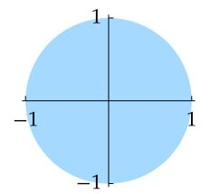

You can think of the ellipsoid defined below as obtained by starting with the ball B and then stretching by a factor of  $s_k$  along each  $f_k$ -axis.

The ball B in  $\mathbb{R}^2$ .

7.96 definition: *ellipsoid*,  $E(s_1 f_1, ..., s_n f_n)$ , *principal axes* 

Suppose that  $f_1, ..., f_n$  is an orthonormal basis of V and  $s_1, ..., s_n$  are positive numbers. The *ellipsoid*  $E(s_1f_1, ..., s_nf_n)$  with *principal axes*  $s_1f_1, ..., s_nf_n$  is defined by

$$E(s_1 f_1, ..., s_n f_n) = \left\{ v \in V : \frac{|\langle v, f_1 \rangle|^2}{s_1^2} + \dots + \frac{|\langle v, f_n \rangle|^2}{s_n^2} < 1 \right\}.$$

The ellipsoid notation  $E(s_1f_1,...,s_nf_n)$  does not explicitly include the inner product space V, even though the definition above depends on V. However, the inner product space V should be clear from the context and also from the requirement that  $f_1,...,f_n$  be an orthonormal basis of V.

## 7.97 example: ellipsoids

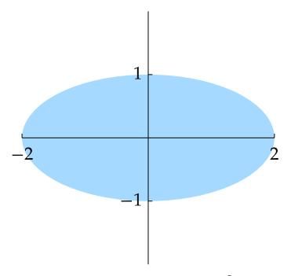

The ellipsoid  $E(2f_1, f_2)$  in  $\mathbb{R}^2$ , where  $f_1, f_2$  is the standard basis of  $\mathbb{R}^2$ .

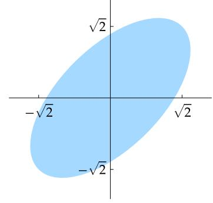

The ellipsoid  $E(2f_1, f_2)$  in  $\mathbb{R}^2$ , where  $f_1 = \left(\frac{1}{\sqrt{2}}, \frac{1}{\sqrt{2}}\right)$  and  $f_2 = \left(-\frac{1}{\sqrt{2}}, \frac{1}{\sqrt{2}}\right)$ .

<span id="page-301-2"></span>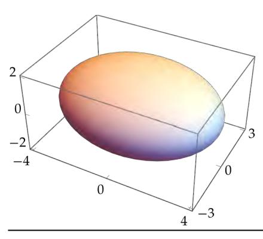

The ellipsoid  $E(4f_1, 3f_2, 2f_3)$  in  $\mathbb{R}^3$ , where  $f_1, f_2, f_3$  is the standard basis of  $\mathbb{R}^3$ .

The ellipsoid  $E(f_1, ..., f_n)$  equals the ball B in V for every orthonormal basis  $f_1, ..., f_n$  of V [by Parseval's identity 6.30(b)].

## 7.98 notation: $T(\Omega)$

For *T* a function defined on *V* and  $\Omega \subseteq V$ , define  $T(\Omega)$  by

$$T(\Omega) = \{ Tv : v \in \Omega \}.$$

Thus if T is a function defined on V, then T(V) = range T.

The next result states that every invertible operator  $T \in \mathcal{L}(V)$  maps the ball B in V onto an ellipsoid in V. The proof shows that the principal axes of this ellipsoid come from the singular value decomposition of T.

## 7.99 invertible operator takes ball to ellipsoid

<span id="page-301-1"></span>Suppose  $T \in \mathcal{L}(V)$  is invertible. Then T maps the ball B in V onto an ellipsoid in V.

Proof Suppose T has singular value decomposition

7.100 
$$Tv = s_1 \langle v, e_1 \rangle f_1 + \dots + s_n \langle v, e_n \rangle f_n$$

for all  $v \in V$ ; here  $s_1, ..., s_n$  are the singular values of T and  $e_1, ..., e_n$  and  $f_1, ..., f_n$  are both orthonormal bases of V. We will show that  $T(B) = E(s_1 f_1, ..., s_n f_n)$ .

First suppose  $v \in B$ . Because T is invertible, none of the singular values  $s_1, ..., s_n$  equals 0 (see 7.68). Thus 7.100 implies that

<span id="page-301-0"></span>
$$\frac{\left|\langle Tv,f_1\rangle\right|^2}{s_1^2}+\cdots+\frac{\left|\langle Tv,f_n\rangle\right|^2}{s_n^2}=|\langle v,e_1\rangle|^2+\cdots+|\langle v,e_n\rangle|^2<1.$$

Thus  $Tv \in E(s_1f_1, ..., s_nf_n)$ . Hence  $T(B) \subseteq E(s_1f_1, ..., s_nf_n)$ .

To prove inclusion in the other direction, now suppose  $w \in E(s_1f_1,...,s_nf_n)$ .

Let

$$v = \frac{\langle w, f_1 \rangle}{s_1} e_1 + \dots + \frac{\langle w, f_n \rangle}{s_n} e_n.$$

Then ||v|| < 1 and 7.100 implies that  $Tv = \langle w, f_1 \rangle f_1 + \dots + \langle w, f_n \rangle f_n = w$ . Thus  $T(B) \supseteq E(s_1 f_1, \dots, s_n f_n)$ .

We now use the previous result to show that invertible operators take all ellipsoids, not just the ball of radius 1, to ellipsoids.

## 7.101 invertible operator takes ellipsoids to ellipsoids

Suppose  $T \in \mathcal{L}(V)$  is invertible and E is an ellipsoid in V. Then T(E) is an ellipsoid in V.

**Proof** There exist an orthonormal basis  $f_1, ..., f_n$  of V and positive numbers  $s_1, ..., s_n$  such that  $E = E(s_1 f_1, ..., s_n f_n)$ . Define  $S \in \mathcal{L}(V)$  by

$$S(a_1f_1 + \dots + a_nf_n) = a_1s_1f_1 + \dots + a_ns_nf_n.$$

Then S maps the ball B of V onto E, as you can verify. Thus

$$T(E) = T(S(B)) = (TS)(B).$$

The equation above and 7.99, applied to TS, show that T(E) is an ellipsoid in V.

Recall (see 3.95) that if  $u \in V$  and  $\Omega \subseteq V$  then  $u + \Omega$  is defined by

$$u+\Omega=\{u+w:w\in\Omega\}.$$

Geometrically, the sets  $\Omega$  and  $u + \Omega$  look the same, but they are in different locations.

In the following definition, if dim V=2 then the word *parallelogram* is often used instead of *parallelepiped*.

## 7.102 definition: $P(v_1, ..., v_n)$ , parallelepiped

<span id="page-302-0"></span>Suppose  $v_1, ..., v_n$  is a basis of V. Let

$$P(v_1,...,v_n) = \big\{a_1v_1 + \cdots + a_nv_n : a_1,...,a_n \in (0,1)\big\}.$$

A parallelepiped is a set of the form  $u + P(v_1, ..., v_n)$  for some  $u \in V$ . The vectors  $v_1, ..., v_n$  are called the *edges* of this parallelepiped.

## 7.103 example: parallelepipeds

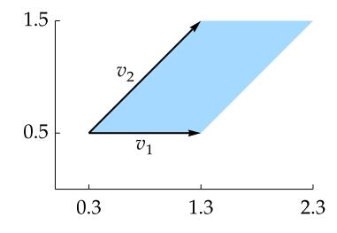

The parallelepiped (0.3, 0.5) + P((1, 0), (1, 1)) in  $\mathbb{R}^2$ .

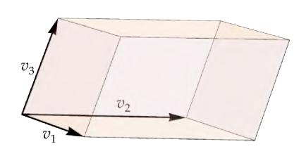

A parallelepiped in  $\mathbb{R}^3$ .

## 7.104 invertible operator takes parallelepipeds to parallelepipeds

<span id="page-303-0"></span>Suppose  $u \in V, v_1, ..., v_n$  is a basis of V, and  $T \in \mathcal{L}(V)$  is invertible. Then

$$T\big(u + P(v_1,...,v_n)\big) = Tu + P(Tv_1,...,Tv_n)\,.$$

Proof Because T is invertible, the list  $Tv_1, ..., Tv_n$  is a basis of V. The linearity of T implies that

$$T(u + a_1v_1 + \dots + a_nv_n) = Tu + a_1Tv_1 + \dots + a_nTv_n$$
 for all  $a_1, \dots, a_n \in (0, 1)$ . Thus  $T(u + P(v_1, \dots, v_n)) = Tu + P(Tv_1, \dots, Tv_n)$ .

Just as the rectangles are distinguished among the parallelograms in  $\mathbb{R}^2$ , we give a special name to the parallelepipeds in V whose defining edges are orthogonal to each other.

#### 7.105 definition: box

<span id="page-303-2"></span>A box in V is a set of the form

$$u + P(r_1e_1, ..., r_ne_n),$$

where  $u \in V$  and  $r_1, ..., r_n$  are positive numbers and  $e_1, ..., e_n$  is an orthonormal basis of V.

Note that in the special case of  $\mathbb{R}^2$  each box is a rectangle, but the terminology box can be used in all dimensions.

<span id="page-303-1"></span>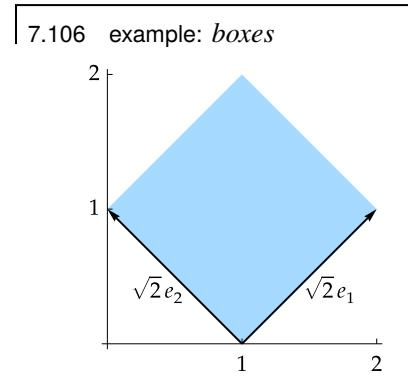

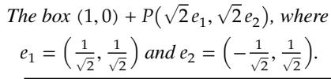

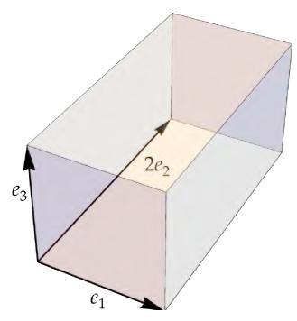

The box  $P(e_1, 2e_2, e_3)$ , where  $e_1, e_2, e_3$  is the standard basis of  $\mathbb{R}^3$ .

Suppose  $T \in \mathcal{L}(V)$  is invertible. Then T maps every parallelepiped in V to a parallelepiped in V (by 7.104). In particular, T maps every box in V to a parallelepiped in V. This raises the question of whether T maps some boxes in V to boxes in V. The following result answers this question, with the help of the singular value decomposition.

#### <span id="page-304-2"></span>7.107 every invertible operator takes some boxes to boxes

<span id="page-304-1"></span>Suppose  $T \in \mathcal{L}(V)$  is invertible. Suppose T has singular value decomposition

$$Tv = s_1 \langle v, e_1 \rangle f_1 + \dots + s_n \langle v, e_n \rangle f_n,$$

where  $s_1,...,s_n$  are the singular values of T and  $e_1,...,e_n$  and  $f_1,...,f_n$  are orthonormal bases of V and the equation above holds for all  $v \in V$ . Then T maps the box  $u + P(r_1e_1,...,r_ne_n)$  onto the box  $Tu + P(r_1s_1f_1,...,r_ns_nf_n)$  for all positive numbers  $r_1,...,r_n$  and all  $u \in V$ .

Proof If  $a_1, ..., a_n \in (0, 1)$  and  $r_1, ..., r_n$  are positive numbers and  $u \in V$ , then

$$T(u + a_1r_1e_1 + \dots + a_nr_ne_n) = Tu + a_1r_1s_1f_1 + \dots + a_nr_ns_nf_n.$$

Thus 
$$T(u + P(r_1e_1, ..., r_ne_n)) = Tu + P(r_1s_1f_1, ..., r_ns_nf_n).$$

## <span id="page-304-0"></span>Volume via Singular Values

Our goal in this subsection is to understand how an operator changes the volume of subsets of its domain. Because notions of volume belong to analysis rather than to linear algebra, we will work only with an intuitive notion of volume. Our intuitive approach to volume can be converted into appropriate correct definitions, correct statements, and correct proofs using the machinery of analysis.

Our intuition about volume works best in real inner product spaces. Thus the assumption that  $\mathbf{F} = \mathbf{R}$  will appear frequently in the rest of this subsection.

If dim V = n, then by *volume* we will mean n-dimensional volume. You should be familiar with this concept in  $\mathbb{R}^3$ . When n = 2, this is usually called area instead of volume, but for consistency we use the word volume in all dimensions. The most fundamental intuition about volume is that the volume of a box (whose defining edges are by definition orthogonal to each other) is the product of the lengths of the defining edges. Thus we make the following definition.

## 7.108 definition: volume of a box

Suppose  $\mathbf{F} = \mathbf{R}$ . If  $u \in V$  and  $r_1, ..., r_n$  are positive numbers and  $e_1, ..., e_n$  is an orthonormal basis of V, then

$$volume(u + P(r_1e_1, ..., r_ne_n)) = r_1 \times \cdots \times r_n.$$

The definition above agrees with the familiar formulas for the area (which we are calling the volume) of a rectangle in  $\mathbb{R}^2$  and for the volume of a box in  $\mathbb{R}^3$ . For example, the first box in Example 7.106 has two-dimensional volume (or area) 2 because the defining edges of that box have length  $\sqrt{2}$  and  $\sqrt{2}$ . The second box in Example 7.106 has three-dimensional volume 2 because the defining edges of that box have length 1, 2, and 1.

<span id="page-305-0"></span>To define the volume of a subset of V, approximate the subset by a finite collection of disjoint boxes, and then add up the volumes of the approximating collection of boxes. As we approximate a subset of V more accurately by disjoint unions of more boxes, we get a better approximation to the volume.

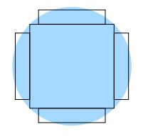

Volume of this ball  $\approx$  sum of the volumes of the five boxes.

These ideas should remind you of how the Riemann integral is defined by approximating the area under a curve by a disjoint collection of rectangles. This discussion leads to the following nonrigorous but intuitive definition.

#### 7.109 definition: volume

Suppose F = R and  $\Omega \subseteq V$ . Then the *volume* of  $\Omega$ , denoted by volume  $\Omega$ , is approximately the sum of the volumes of a collection of disjoint boxes that approximate  $\Omega$ .

We are ignoring many reasonable questions by taking an intuitive approach to volume. For example, if we approximate  $\Omega$  by boxes with respect to one basis, do we get the same volume if we approximate  $\Omega$  by boxes with respect to a different basis? If  $\Omega_1$  and  $\Omega_2$  are disjoint subsets of V, is  $\operatorname{volume}(\Omega_1 \cup \Omega_2) = \operatorname{volume}\Omega_1 + \operatorname{volume}\Omega_2$ ? Provided that we consider only reasonably nice subsets of V, techniques of analysis show that both these questions have affirmative answers that agree with our intuition about volume.

#### 7.110 example: volume change by a linear map

Suppose that  $T \in \mathcal{L}(\mathbf{R}^2)$  is defined by  $Tv = 2\langle v, e_1 \rangle e_1 + \langle v, e_2 \rangle e_2$ , where  $e_1, e_2$  is the standard basis of  $\mathbf{R}^2$ . This linear map stretches vectors along the  $e_1$ -axis by a factor of 2 and leaves vectors along the  $e_2$ -axis unchanged. The ball approximated by five boxes above gets mapped by T to the ellipsoid shown here. Each of the five boxes in the original figure

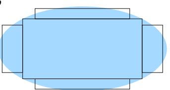

Each box here has twice the width and the same height as the boxes in the previous figure.

gets mapped to a box of twice the width and the same height as in the original figure. Hence each box gets mapped to a box of twice the volume (area) as in the original figure. The sum of the volumes of the five new boxes approximates the volume of the ellipsoid. Thus T changes the volume of the ball by a factor of 2.

In the example above, T maps boxes with respect to the basis  $e_1, e_2$  to boxes with respect to the same basis; thus we can see how T changes volume. In general, an operator maps boxes to parallelepipeds that are not boxes. However, if we choose the right basis (coming from the singular value decomposition!), then boxes with respect to that basis get mapped to boxes with respect to a possibly different basis, as shown in 7.107. This observation leads to a natural proof of the following result.

7.111 volume changes by a factor of the product of the singular values

<span id="page-306-1"></span>Suppose  $\mathbf{F} = \mathbf{R}, T \in \mathcal{L}(V)$  is invertible, and  $\Omega \subset V$ . Then

volume  $T(\Omega) = (\text{product of singular values of } T)(\text{volume } \Omega)$ .

**Proof** Suppose T has singular value decomposition

$$Tv = s_1 \langle v, e_1 \rangle f_1 + \dots + s_n \langle v, e_n \rangle f_n$$

for all  $v \in V$ , where  $e_1, ..., e_n$  and  $f_1, ..., f_n$  are orthonormal bases of V.

Approximate  $\Omega$  by boxes of the form  $u + P(r_1e_1, ..., r_ne_n)$ , which have volume  $r_1 \times \cdots \times r_n$ . The operator T maps each box  $u + P(r_1e_1, ..., r_ne_n)$  onto the box  $Tu + P(r_1s_1f_1, ..., r_ns_nf_n)$ , which has volume  $(s_1 \times \cdots \times s_n)(r_1 \times \cdots \times r_n)$ .

The operator T maps a collection of boxes that approximate  $\Omega$  onto a collection of boxes that approximate  $T(\Omega)$ . Because T changes the volume of each box in a collection that approximates  $\Omega$  by a factor of  $s_1 \times \cdots \times s_n$ , the linear map T changes the volume of  $\Omega$  by the same factor.

Suppose  $T \in \mathcal{L}(V)$ . As we will see when we get to determinants, the product of the singular values of T equals  $|\det T|$ ; see 9.60 and 9.61.

## <span id="page-306-0"></span>Properties of an Operator as Determined by Its Eigenvalues

We conclude this chapter by presenting the table below. The context of this table is a finite-dimensional complex inner product space. The first column of the table shows a property that a normal operator on such a space might have. The second column of the table shows a subset of **C** such that the operator has the corresponding property if and only if all eigenvalues of the operator lie in the specified subset. For example, the first row of the table states that a normal operator is invertible if and only if all its eigenvalues are nonzero (this first row is the only one in the table that does not need the hypothesis that the operator is normal).

Make sure you can explain why all results in the table hold. For example, the last row of the table holds because the norm of an operator equals its largest singular value (by 7.85) and the singular values of a normal operator, assuming F = C, equal the absolute values of the eigenvalues (by Exercise 7 in Section 7E).

| eigenvalues are contained in                                 |
|--------------------------------------------------------------|
| <b>C</b> \{0}                                                |
| R                                                            |
| $\{\lambda \in \mathbf{C} : \operatorname{Re} \lambda = 0\}$ |
| {0,1}                                                        |
| $[0,\infty)$                                                 |
| $\{\lambda \in \mathbf{C} :  \lambda  = 1\}$                 |
| $\{\lambda \in \mathbf{C} :  \lambda  < 1\}$                 |
|                                                              |

## <span id="page-307-4"></span><span id="page-307-0"></span>*Exercises 7F*

<span id="page-307-1"></span>**1** Prove that if , ∈ ℒ(, ), then ∣‖‖ − ‖‖∣ ≤ ‖ − ‖.

*The inequality above is called the reverse triangle inequality.*

**2** Suppose that ∈ ℒ() is self-adjoint or that = and ∈ ℒ() is normal. Prove that

$$||T|| = \max\{|\lambda| : \lambda \text{ is an eigenvalue of } T\}.$$

**3** Suppose ∈ ℒ(, ) and ∈ . Prove that

$$\|Tv\| = \|T\| \, \|v\| \iff T^*Tv = \|T\|^2 v.$$

- **4** Suppose ∈ ℒ(, ), ∈ , and ‖‖ = ‖‖ ‖‖. Prove that if ∈ and ⟨, ⟩ = 0, then ⟨, ⟩ = 0.
- **5** Suppose is a finite-dimensional inner product space, ∈ ℒ(, ), and ∈ ℒ(, ). Prove that

$$||ST|| \leq ||S|| \, ||T||.$$

- **6** Prove or give a counterexample: If , ∈ ℒ(), then ‖‖ = ‖‖.
- <span id="page-307-3"></span>**7** Show that defining (, ) = ‖ − ‖ for , ∈ ℒ(, ) makes a metric on ℒ(, ).

*This exercise is intended for readers who are familiar with metric spaces.*

- **8** (a) Prove that if ∈ ℒ() and ‖ − ‖ < 1, then is invertible.
  - (b) Suppose that ∈ ℒ() is invertible. Prove that if ∈ ℒ() and ‖ − ‖ < 1/∥ −1∥, then is invertible.

*This exercise shows that the set of invertible operators in* ℒ() *is an open subset of* ℒ()*, using the metric defined in Exercise [7.](#page-307-3)*

- <span id="page-307-2"></span>**9** Suppose ∈ ℒ(). Prove that for every > 0, there exists an invertible operator ∈ ℒ() such that 0 < ‖ − ‖ < .
- **10** Suppose dim > 1 and ∈ ℒ() is not invertible. Prove that for every > 0, there exists ∈ ℒ() such that 0 < ‖ − ‖ < and is not invertible.
- **11** Suppose = and ∈ ℒ(). Prove that for every > 0 there exists a diagonalizable operator ∈ ℒ() such that 0 < ‖ − ‖ < .
- **12** Suppose ∈ ℒ() is a positive operator. Show that ∥√ ∥ = √‖‖.
- **13** Suppose , ∈ ℒ() are positive operators. Show that

$$||S - T|| \le \max\{||S||, ||T||\} \le ||S + T||.$$

**14** Suppose and are subspaces of such that ‖ − ‖ < 1. Prove that dim = dim .

<span id="page-308-2"></span>15 Define  $T \in \mathcal{L}(\mathbf{F}^3)$  by

$$T(z_1, z_2, z_3) = (z_3, 2z_1, 3z_2).$$

Find (explicitly) a unitary operator  $S \in \mathcal{L}(\mathbf{F}^3)$  such that  $T = S\sqrt{T^*T}$ .

- Suppose  $S \in \mathcal{L}(V)$  is a positive invertible operator. Prove that there exists  $\delta > 0$  such that T is a positive operator for every self-adjoint operator  $T \in \mathcal{L}(V)$  with  $||S T|| < \delta$ .
- Prove that if  $u \in V$  and  $\varphi_u$  is the linear functional on V defined by the equation  $\varphi_u(v) = \langle v, u \rangle$ , then  $\|\varphi_u\| = \|u\|$ .

Here we are thinking of the scalar field F as an inner product space with  $\langle \alpha, \beta \rangle = \alpha \overline{\beta}$  for all  $\alpha, \beta \in F$ . Thus  $\|\varphi_u\|$  means the norm of  $\varphi_u$  as a linear map from V to F.

- **18** Suppose  $e_1, ..., e_n$  is an orthonormal basis of V and  $T \in \mathcal{L}(V, W)$ .
  - (a) Prove that  $\max\{\|Te_1\|, ..., \|Te_n\|\} \le \|T\| \le (\|Te_1\|^2 + ... + \|Te_n\|^2)^{1/2}$ .
  - (b) Prove that  $||T|| = (||Te_1||^2 + \dots + ||Te_n||^2)^{1/2}$  if and only if dim range  $T \le 1$ .

Here  $e_1, ..., e_n$  is an arbitrary orthonormal basis of V, not necessarily connected with a singular value decomposition of T. If  $s_1, ..., s_n$  is the list of singular values of T, then the right side of the inequality above equals  $\left(s_1^2 + \cdots + s_n^2\right)^{1/2}$ , as was shown in Exercise 11(a) in Section 7E.

19 Prove that if  $T \in \mathcal{L}(V, W)$ , then  $||T^*T|| = ||T||^2$ .

This formula for  $\|T^*T\|$  leads to the important subject of  $C^*$ -algebras.

- 20 Suppose  $T \in \mathcal{L}(V)$  is normal. Prove that  $||T^k|| = ||T||^k$  for every positive integer k.
- <span id="page-308-0"></span>Suppose dim V > 1 and dim W > 1. Prove that the norm on  $\mathcal{L}(V, W)$  does not come from an inner product. In other words, prove that there does not exist an inner product on  $\mathcal{L}(V, W)$  such that

$$\max\{||Tv||: v \in V \text{ and } ||v|| \le 1\} = \sqrt{\langle T, T \rangle}$$

for all  $T \in \mathcal{L}(V, W)$ .

<span id="page-308-1"></span>22 Suppose  $T \in \mathcal{L}(V, W)$ . Let  $n = \dim V$  and let  $s_1 \ge \cdots \ge s_n$  denote the singular values of T. Prove that if  $1 \le k \le n$ , then

 $\min\{||T|_U||: U \text{ is a subspace of } V \text{ with } \dim U = k\} = s_{n-k+1}.$ 

- 23 Suppose  $T \in \mathcal{L}(V, W)$ . Show that T is uniformly continuous with respect to the metrics on V and W that arise from the norms on those spaces (see Exercise 23 in Section 6B).
- 24 Suppose  $T \in \mathcal{L}(V)$  is invertible. Prove that

$$||T^{-1}|| = ||T||^{-1} \iff \frac{T}{||T||}$$
 is a unitary operator.

25 Fix  $u, x \in V$  with  $u \neq 0$ . Define  $T \in \mathcal{L}(V)$  by  $Tv = \langle v, u \rangle x$  for every  $v \in V$ . Prove that

$$\sqrt{T^*T}v = \frac{\|x\|}{\|u\|} \langle v, u \rangle u$$

for every  $v \in V$ .

296

- Suppose  $T \in \mathcal{L}(V)$ . Prove that T is invertible if and only if there exists a unique unitary operator  $S \in \mathcal{L}(V)$  such that  $T = S\sqrt{T^*T}$ .
- <span id="page-309-0"></span>27 Suppose  $T \in \mathcal{L}(V)$  and  $s_1, ..., s_n$  are the singular values of T. Let  $e_1, ..., e_n$  and  $f_1, ..., f_n$  be orthonormal bases of V such that

$$Tv = s_1 \langle v, e_1 \rangle f_1 + \dots + s_n \langle v, e_n \rangle f_n$$

for all  $v \in V$ . Define  $S \in \mathcal{L}(V)$  by

$$Sv = \langle v, e_1 \rangle f_1 + \dots + \langle v, e_n \rangle f_n.$$

- (a) Show that *S* is unitary and  $||T S|| = \max\{|s_1 1|, ..., |s_n 1|\}.$
- (b) Show that if  $E \in \mathcal{L}(V)$  is unitary, then  $||T E|| \ge ||T S||$ .

This exercise finds a unitary operator S that is as close as possible (among the unitary operators) to a given operator T.

- Suppose  $T \in \mathcal{L}(V)$ . Prove that there exists a unitary operator  $S \in \mathcal{L}(V)$  such that  $T = \sqrt{TT^*} S$ .
- **29** Suppose  $T \in \mathcal{L}(V)$ .
  - (a) Use the polar decomposition to show that there exists a unitary operator  $S \in \mathcal{L}(V)$  such that  $TT^* = ST^*TS^*$ .
  - (b) Show how (a) implies that T and  $T^*$  have the same singular values.
- **30** Suppose  $T \in \mathcal{L}(V)$ ,  $S \in \mathcal{L}(V)$  is a unitary operator, and  $R \in \mathcal{L}(V)$  is a positive operator such that T = SR. Prove that  $R = \sqrt{T^*T}$ .

This exercise shows that if we write T as the product of a unitary operator and a positive operator (as in the polar decomposition 7.93), then the positive operator equals  $\sqrt{T^*T}$ .

- <span id="page-309-1"></span>Suppose  $\mathbf{F} = \mathbf{C}$  and  $T \in \mathcal{L}(V)$  is normal. Prove that there exists a unitary operator  $S \in \mathcal{L}(V)$  such that  $T = S\sqrt{T^*T}$  and such that S and  $\sqrt{T^*T}$  both have diagonal matrices with respect to the same orthonormal basis of V.
- 32 Suppose that  $T \in \mathcal{L}(V, W)$  and  $T \neq 0$ . Let  $s_1, ..., s_m$  denote the positive singular values of T. Show that there exists an orthonormal basis  $e_1, ..., e_m$  of  $(\text{null } T)^{\perp}$  such that

$$T\left(E\left(\frac{e_1}{s_1},...,\frac{e_m}{s_m}\right)\right)$$

equals the ball in range T of radius 1 centered at 0.

## Chapter 8

# <span id="page-310-1"></span><span id="page-310-0"></span>*Operators on Complex Vector Spaces*

In this chapter we delve deeper into the structure of operators, with most of the attention on complex vector spaces. Some of the results in this chapter apply to both real and complex vector spaces; thus we do not make a standing assumption that = . Also, an inner product does not help with this material, so we return to the general setting of a finite-dimensional vector space.

Even on a finite-dimensional complex vector space, an operator may not have enough eigenvectors to form a basis of the vector space. Thus we will consider the closely related objects called generalized eigenvectors. We will see that for each operator on a finite-dimensional complex vector space, there is a basis of the vector space consisting of generalized eigenvectors of the operator. The generalized eigenspace decomposition then provides a good description of arbitrary operators on a finite-dimensional complex vector space.

Nilpotent operators, which are operators that when raised to some power equal 0, have an important role in these investigations. Nilpotent operators provide a key tool in our proof that every invertible operator on a finite-dimensional complex vector space has a square root and in our approach to Jordan form.

This chapter concludes by defining the trace and proving its key properties.

## *standing assumptions for this chapter*

- denotes or .
- denotes a finite-dimensional nonzero vector space over .


*The Long Room of the Old Library at the University of Dublin, where William Hamilton* (*1805–1865*) *was a student and then a faculty member. Hamilton proved a special case of what we now call the Cayley–Hamilton theorem in 1853.*

## <span id="page-311-4"></span><span id="page-311-0"></span>*8A Generalized Eigenvectors and Nilpotent Operators*

## <span id="page-311-1"></span>*Null Spaces of Powers of an Operator*

We begin this chapter with a study of null spaces of powers of an operator.

## 8.1 *sequence of increasing null spaces*

<span id="page-311-2"></span>Suppose ∈ ℒ(). Then

$$\{0\} = \operatorname{null} T^0 \subseteq \operatorname{null} T^1 \subseteq \cdots \subseteq \operatorname{null} T^k \subseteq \operatorname{null} T^{k+1} \subseteq \cdots.$$

Proof Suppose is a nonnegative integer and ∈ null . Then = 0, which implies that +<sup>1</sup> = ( ) = (0) = 0. Thus ∈ null +1 . Hence null ⊆ null +1 , as desired.

The following result states that if two consecutive terms in the sequence of subspaces above are equal, then all later terms in the sequence are equal.

*For similar results about decreasing sequences of ranges, see Exercises [6,](#page-319-1) [7,](#page-319-2) and [8.](#page-319-3)*

## 8.2 *equality in the sequence of null spaces*

<span id="page-311-3"></span>Suppose ∈ ℒ() and is a nonnegative integer such that

$$\operatorname{null} T^m = \operatorname{null} T^{m+1}.$$

Then

$$\operatorname{null} T^m = \operatorname{null} T^{m+1} = \operatorname{null} T^{m+2} = \operatorname{null} T^{m+3} = \cdots.$$

Proof Let be a positive integer. We want to prove that

$$\operatorname{null} T^{m+k} = \operatorname{null} T^{m+k+1}.$$

We already know from [8.1](#page-311-2) that null + ⊆ null ++1 .

To prove the inclusion in the other direction, suppose ∈ null ++1 . Then

$$T^{m+1}(T^k v) = T^{m+k+1}v = 0.$$

Hence

$$T^k v \in \operatorname{null} T^{m+1} = \operatorname{null} T^m$$
.

Thus + = ( ) = 0, which means that ∈ null + . This implies that null ++<sup>1</sup> ⊆ null + , completing the proof.

The result above raises the question of whether there exists a nonnegative integer such that null = null +1 . The next result shows that this equality holds at least when equals the dimension of the vector space on which operates.

## <span id="page-312-3"></span>8.3 *null spaces stop growing*

<span id="page-312-0"></span>Suppose ∈ ℒ(). Then

$$\operatorname{null} T^{\dim V} = \operatorname{null} T^{\dim V + 1} = \operatorname{null} T^{\dim V + 2} = \cdots.$$

Proof We only need to prove that null dim = null dim +1 (by [8.2\)](#page-311-3). Suppose this is not true. Then, by [8.1](#page-311-2) and [8.2,](#page-311-3) we have

$$\{0\} = \operatorname{null} T^0 \subsetneq \operatorname{null} T^1 \subsetneq \cdots \subsetneq \operatorname{null} T^{\dim V} \subsetneq \operatorname{null} T^{\dim V+1},$$

where the symbol ⊊ means "contained in but not equal to". At each of the strict inclusions in the chain above, the dimension increases by at least 1. Thus dim null dim <sup>+</sup><sup>1</sup> ≥ dim + 1, a contradiction because a subspace of cannot have a larger dimension than dim .

It is not true that = null ⊕ range for every ∈ ℒ(). However, the next result can be a useful substitute.

#### 8.4 *is the direct sum of* null dim *and* range dim

<span id="page-312-2"></span>Suppose ∈ ℒ(). Then

<span id="page-312-1"></span>
$$V = \text{null } T^{\dim V} \oplus \text{range } T^{\dim V}.$$

Proof Let = dim . First we show that

8.5 
$$\left(\operatorname{null} T^{n}\right) \cap \left(\operatorname{range} T^{n}\right) = \{0\}.$$

Suppose ∈ (null ) ∩ (range ). Then = 0, and there exists ∈ such that = . Applying to both sides of the last equation shows that = 2. Hence 2 = 0, which implies that = 0 (by [8.3\)](#page-312-0). Thus = = 0, completing the proof of [8.5.](#page-312-1)

Now [8.5](#page-312-1) implies that null + range is a direct sum (by [1.46\)](#page-36-1). Also,

$$\dim(\operatorname{null} T^n \oplus \operatorname{range} T^n) = \dim \operatorname{null} T^n + \dim \operatorname{range} T^n = \dim V,$$

where the first equality above comes from [3.94](#page-111-1) and the second equality comes from the fundamental theorem of linear maps [\(3.21\)](#page-75-1). The equation above implies that null ⊕ range = (see [2.39\)](#page-58-2), as desired.

For an improvement of the result above, see Exercise [19.](#page-320-1)

8.6 example: 
$$\mathbf{F}^3 = \operatorname{null} T^3 \oplus \operatorname{range} T^3 \text{ for } T \in \mathcal{L}(\mathbf{F}^3)$$

Suppose ∈ ℒ( <sup>3</sup>) is defined by

$$T(z_1, z_2, z_3) = (4z_2, 0, 5z_3).$$

<span id="page-313-2"></span>Then null  $T=\{(z_1,0,0):z_1\in \mathbf{F}\}$  and range  $T=\{(z_1,0,z_3):z_1,z_3\in \mathbf{F}\}$ . Thus null  $T\cap$  range  $T\neq \{0\}$ . Hence null T+ range T is not a direct sum. Also note that null T+ range  $T\neq \mathbf{F}^3$ . However, we have  $T^3(z_1,z_2,z_3)=(0,0,125z_3)$ . Thus we see that

$$\operatorname{null} T^3 = \{(z_1, z_2, 0) : z_1, z_2 \in \mathbf{F}\} \quad \text{and} \quad \operatorname{range} T^3 = \{(0, 0, z_3) : z_3 \in \mathbf{F}\}.$$

Hence  $\mathbf{F}^3 = \text{null } T^3 \oplus \text{range } T^3$ , as expected by 8.4.

## <span id="page-313-0"></span>Generalized Eigenvectors

Some operators do not have enough eigenvectors to lead to good descriptions of their behavior. Thus in this subsection we introduce the concept of generalized eigenvectors, which will play a major role in our description of the structure of an operator.

To understand why we need more than eigenvectors, let's examine the question of describing an operator by decomposing its domain into invariant subspaces. Fix  $T \in \mathcal{L}(V)$ . We seek to describe T by finding a "nice" direct sum decomposition

<span id="page-313-1"></span>
$$V = V_1 \oplus \cdots \oplus V_n$$

where each  $V_k$  is a subspace of V invariant under T. The simplest possible nonzero invariant subspaces are one-dimensional. A decomposition as above in which each  $V_k$  is a one-dimensional subspace of V invariant under T is possible if and only if V has a basis consisting of eigenvectors of T (see 5.55). This happens if and only if V has an eigenspace decomposition

8.7 
$$V = E(\lambda_1, T) \oplus \cdots \oplus E(\lambda_m, T),$$

where  $\lambda_1, ..., \lambda_m$  are the distinct eigenvalues of T (see 5.55).

The spectral theorem in the previous chapter shows that if V is an inner product space, then a decomposition of the form 8.7 holds for every self-adjoint operator if F = R and for every normal operator if F = C because operators of those types have enough eigenvectors to form a basis of V (see 7.29 and 7.31).

However, a decomposition of the form 8.7 may not hold for more general operators, even on a complex vector space. An example was given by the operator in 5.57, which does not have enough eigenvectors for 8.7 to hold. Generalized eigenvectors and generalized eigenspaces, which we now introduce, will remedy this situation.

## 8.8 definition: generalized eigenvector

Suppose  $T \in \mathcal{L}(V)$  and  $\lambda$  is an eigenvalue of T. A vector  $v \in V$  is called a *generalized eigenvector* of T corresponding to  $\lambda$  if  $v \neq 0$  and

$$(T - \lambda I)^k v = 0$$

for some positive integer k.

<span id="page-314-1"></span>A nonzero vector ∈ is a generalized eigenvector of corresponding to if and only if

$$(T - \lambda I)^{\dim V} v = 0,$$

as follows from applying [8.1](#page-311-2) and [8.3](#page-312-0) to the operator − .

*Generalized eigenvalues are not defined because doing so would not lead to anything new. Reason: if* ( − ) *is not injective for some positive integer , then* − *is not injective, and hence is an eigenvalue of .*

As we know, an operator on a complex vector space may not have enough eigenvectors to form a basis of the domain. The next result shows that on a complex vector space there are enough generalized eigenvectors to do this.

## 8.9 *a basis of generalized eigenvectors*

<span id="page-314-0"></span>Suppose = and ∈ ℒ(). Then there is a basis of consisting of generalized eigenvectors of .

Proof Let = dim . We will use induction on . To get started, note that the desired result holds if = 1 because then every nonzero vector in is an eigenvector of .

Now suppose > 1 and the desired result holds for all smaller values of dim . Let be an eigenvalue of . Applying [8.4](#page-312-2) to − shows that

*This step is where we use the hypothesis that* = *, because if* = *then may not have any eigenvalues.*

$$V = \text{null}(T - \lambda I)^n \oplus \text{range}(T - \lambda I)^n.$$

If null( − ) = , then every nonzero vector in is a generalized eigenvector of , and thus in this case there is a basis of consisting of generalized eigenvectors of . Hence we can assume that null( − ) ≠ , which implies that range( − ) ≠ {0}.

Also, null( − ) ≠ {0}, because is an eigenvalue of . Thus we have

$$0 < \dim \operatorname{range}(T - \lambda I)^n < n.$$

Furthermore, range( − ) is invariant under [by [5.18](#page-152-1) with () = ( − ) ]. Let ∈ ℒ(range( − )) equal restricted to range( − ) . Our induction hypothesis applied to the operator implies that there is a basis of range( − ) consisting of generalized eigenvectors of , which of course are generalized eigenvectors of . Adjoining that basis of range(−) to a basis of null(−) gives a basis of consisting of generalized eigenvectors of .

If = and dim > 1, then some operators on have the property that there exists a basis of consisting of generalized eigenvectors of the operator, and (unlike what happens when = ) other operators do not have this property. See Exercise [11](#page-319-4) for a necessary and sufficient condition that determines whether an operator has this property.

<span id="page-315-1"></span>8.10 example: generalized eigenvectors of an operator on  $\mathbb{C}^3$ 

Define  $T \in \mathcal{L}(\mathbf{C}^3)$  by

$$T(z_1, z_2, z_3) = (4z_2, 0, 5z_3)$$

for each  $(z_1, z_2, z_3) \in \mathbb{C}^3$ . A routine use of the definition of eigenvalue shows that the eigenvalues of T are 0 and 5. Furthermore, the eigenvectors corresponding to the eigenvalue 0 are the nonzero vectors of the form  $(z_1, 0, 0)$ , and the eigenvectors corresponding to the eigenvalue 5 are the nonzero vectors of the form  $(0, 0, z_3)$ . Hence this operator does not have enough eigenvectors to span its domain  $\mathbb{C}^3$ .

We compute that  $T^3(z_1, z_2, z_3) = (0, 0, 125z_3)$ . Thus 8.1 and 8.3 imply that the generalized eigenvectors of T corresponding to the eigenvalue 0 are the nonzero vectors of the form  $(z_1, z_2, 0)$ .

We also have  $(T - 5I)^3(z_1, z_2, z_3) = (-125z_1 + 300z_2, -125z_2, 0)$ . Thus the generalized eigenvectors of T corresponding to the eigenvalue 5 are the nonzero vectors of the form  $(0, 0, z_3)$ .

The paragraphs above show that each of the standard basis vectors of  $\mathbb{C}^3$  is a generalized eigenvector of T. Thus  $\mathbb{C}^3$  indeed has a basis consisting of generalized eigenvectors of T, as promised by 8.9.

If v is an eigenvector of  $T \in \mathcal{L}(V)$ , then the corresponding eigenvalue  $\lambda$  is uniquely determined by the equation  $Tv = \lambda v$ , which can be satisfied by only one  $\lambda \in \mathbf{F}$  (because  $v \neq 0$ ). However, if v is a generalized eigenvector of T, then it is not obvious that the equation  $(T - \lambda I)^{\dim V} v = 0$  can be satisfied by only one  $\lambda \in \mathbf{F}$ . Fortunately, the next result tells us that all is well on this issue.

## 8.11 generalized eigenvector corresponds to a unique eigenvalue

<span id="page-315-0"></span>Suppose  $T \in \mathcal{L}(V)$ . Then each generalized eigenvector of T corresponds to only one eigenvalue of T.

Proof Suppose  $v \in V$  is a generalized eigenvector of T corresponding to eigenvalues  $\alpha$  and  $\lambda$  of T. Let m be the smallest positive integer such that  $(T - \alpha I)^m v = 0$ . Let  $n = \dim V$ . Then

$$\begin{split} 0 &= (T - \lambda I)^n v \\ &= \left( (T - \alpha I) + (\alpha - \lambda) I \right)^n v \\ &= \sum_{k=0}^n b_k (\alpha - \lambda)^{n-k} (T - \alpha I)^k v, \end{split}$$

where  $b_0 = 1$  and the values of the other binomial coefficients  $b_k$  do not matter. Apply the operator  $(T - \alpha I)^{m-1}$  to both sides of the equation above, getting

$$0 = (\alpha - \lambda)^n (T - \alpha I)^{m-1} v.$$

Because  $(T - \alpha I)^{m-1}v \neq 0$ , the equation above implies that  $\alpha = \lambda$ , as desired.

<span id="page-316-3"></span>We saw earlier (5.11) that eigenvectors corresponding to distinct eigenvalues are linearly independent. Now we prove a similar result for generalized eigenvectors, with a proof that roughly follows the pattern of the proof of that earlier result.

#### 8.12 linearly independent generalized eigenvectors

<span id="page-316-2"></span>Suppose that  $T \in \mathcal{L}(V)$ . Then every list of generalized eigenvectors of T corresponding to distinct eigenvalues of T is linearly independent.

Proof Suppose the desired result is false. Then there exists a smallest positive integer m such that there exists a linearly dependent list  $v_1, ..., v_m$  of generalized eigenvectors of T corresponding to distinct eigenvalues  $\lambda_1, ..., \lambda_m$  of T (note that  $m \geq 2$  because a generalized eigenvector is, by definition, nonzero). Thus there exist  $a_1, ..., a_m \in \mathbf{F}$ , none of which are 0 (because of the minimality of m), such that

$$a_1v_1 + \dots + a_mv_m = 0.$$

<span id="page-316-1"></span>Let  $n = \dim V$ . Apply  $(T - \lambda_m I)^n$  to both sides of the equation above, getting

8.13 
$$a_1(T - \lambda_m I)^n v_1 + \dots + a_{m-1}(T - \lambda_m I)^n v_{m-1} = 0.$$

Suppose  $k \in \{1, ..., m-1\}$ . Then

$$(T - \lambda_m I)^n v_k \neq 0$$

because otherwise  $v_k$  would be a generalized eigenvector of T corresponding to the distinct eigenvalues  $\lambda_k$  and  $\lambda_m$ , which would contradict 8.11. However,

$$(T - \lambda_k I)^n ((T - \lambda_m I)^n v_k) = (T - \lambda_m I)^n ((T - \lambda_k I)^n v_k) = 0.$$

Thus the last two displayed equations show that  $(T - \lambda_m I)^n v_k$  is a generalized eigenvector of T corresponding to the eigenvalue  $\lambda_k$ . Hence

$$(T-\lambda_m I)^n v_1,...,(T-\lambda_m I)^n v_{m-1}$$

is a linearly dependent list (by 8.13) of m-1 generalized eigenvectors corresponding to distinct eigenvalues, contradicting the minimality of m. This contradiction completes the proof.

## <span id="page-316-0"></span>Nilpotent Operators

#### 8.14 definition: nilpotent

An operator is called *nilpotent* if some power of it equals 0.

Thus an operator  $T \in \mathcal{L}(V)$  is nilpotent if and only if every nonzero vector in V is a generalized eigenvector of T corresponding to the eigenvalue 0.

## <span id="page-317-3"></span><span id="page-317-2"></span>8.15 example: *nilpotent operators*

(a) The operator ∈ ℒ( <sup>4</sup>) defined by

$$T(z_1, z_2, z_3, z_4) = (0, 0, z_1, z_2)$$

is nilpotent because <sup>2</sup> = 0.

(b) The operator on <sup>3</sup> whose matrix (with respect to the standard basis) is

$$\left(\begin{array}{ccc} -3 & 9 & 0 \\ -7 & 9 & 6 \\ 4 & 0 & -6 \end{array}\right)$$

is nilpotent, as can be shown by cubing the matrix above to get the zero matrix.

(c) The operator of differentiation on () is nilpotent because the ( + 1)th derivative of every polynomial of degree at most equals 0. Note that on this space of dimension + 1, we need to raise the nilpotent operator to the power + 1 to get the 0 operator.

The next result shows that when raising a nilpotent operator to a power, we never need to use a power higher than the dimension of the space. For a slightly stronger result, see Exercise [18.](#page-320-2)

*The Latin word nil means nothing or zero; the Latin word potens means having power. Thus nilpotent literally means having a power that is zero.*

## 8.16 *nilpotent operator raised to dimension of domain is* 0

<span id="page-317-0"></span>Suppose ∈ ℒ() is nilpotent. Then dim = 0.

Proof Because is nilpotent, there exists a positive integer such that = 0. Thus null = . Now [8.1](#page-311-2) and [8.3](#page-312-0) imply that null dim = . Thus dim = 0.

## 8.17 *eigenvalues of nilpotent operator*

<span id="page-317-1"></span>Suppose ∈ ℒ().

- (a) If is nilpotent, then 0 is an eigenvalue of and has no other eigenvalues.
- (b) If = and 0 is the only eigenvalue of , then is nilpotent.

## Proof

(a) To prove (a), suppose is nilpotent. Hence there is a positive integer such that = 0. This implies that is not injective. Thus 0 is an eigenvalue of .

<span id="page-318-1"></span>To show that has no other eigenvalues, suppose is an eigenvalue of . Then there exists a nonzero vector ∈ such that

$$\lambda v = Tv.$$

Repeatedly applying to both sides of this equation shows that

$$\lambda^m v = T^m v = 0.$$

Thus = 0, as desired.

(b) Suppose = and 0 is the only eigenvalue of . By [5.27\(](#page-159-1)b), the minimal polynomial of equals for some positive integer . Thus = 0. Hence is nilpotent.

Exercise [23](#page-320-3) shows that the hypothesis that = cannot be deleted in (b) of the result above.

Given an operator on , we want to find a basis of such that the matrix of the operator with respect to this basis is as simple as possible, meaning that the matrix contains many 0's. The next result shows that if is nilpotent, then we can choose a basis of such that the matrix of with respect to this basis has more than half of its entries equal to 0. Later in this chapter we will do even better.

## 8.18 *minimal polynomial and upper-triangular matrix of nilpotent operator*

<span id="page-318-0"></span>Suppose ∈ ℒ(). Then the following are equivalent.

- (a) is nilpotent.
- (b) The minimal polynomial of is for some positive integer .
- (c) There is a basis of with respect to which the matrix of has the form

$$\left(\begin{array}{ccc} 0 & & * \\ & \ddots & \\ 0 & & 0 \end{array}\right),$$

where all entries on and below the diagonal equal 0.

Proof Suppose (a) holds, so is nilpotent. Thus there exists a positive integer such that = 0. Now [5.29](#page-161-1) implies that is a polynomial multiple of the minimal polynomial of . Thus the minimal polynomial of is for some positive integer , proving that (a) implies (b).

Now suppose (b) holds, so the minimal polynomial of is for some positive integer . This implies, by [5.27\(](#page-159-1)a), that 0 (which is the only zero of ) is the only eigenvalue of . This further implies, by [5.44,](#page-172-0) that there is a basis of with respect to which the matrix of is upper triangular. This also implies, by [5.41,](#page-170-0) that all entries on the diagonal of this matrix are 0, proving that (b) implies (c).

Now suppose (c) holds. Then [5.40](#page-169-0) implies that dim = 0. Thus is nilpotent, proving that (c) implies (a).

## <span id="page-319-6"></span><span id="page-319-0"></span>*Exercises 8A*

- **1** Suppose ∈ ℒ(). Prove that if dim null <sup>4</sup> = 8 and dim null <sup>6</sup> = 9, then dim null = 9 for all integers ≥ 5.
- <span id="page-319-5"></span>**2** Suppose ∈ ℒ(), is a positive integer, ∈ , and − 1 ≠ 0 but = 0. Prove that , , <sup>2</sup>, …, − 1 is linearly independent.

*The result in this exercise is used in the proof of [8.45.](#page-335-0)*

**3** Suppose ∈ ℒ(). Prove that

$$V = \operatorname{null} T \oplus \operatorname{range} T \iff \operatorname{null} T^2 = \operatorname{null} T.$$

**4** Suppose ∈ ℒ(), ∈ , and is a positive integer such that the minimal polynomial of is a polynomial multiple of ( − ). Prove that

$$\dim \operatorname{null}(T - \lambda I)^m \ge m.$$

**5** Suppose ∈ ℒ() and is a positive integer. Prove that

$$\dim \operatorname{null} T^m \leq m \dim \operatorname{null} T.$$

*Hint: Exercise [21](#page-80-0) in Section [3B](#page-72-0) may be useful.*

<span id="page-319-1"></span>**6** Suppose ∈ ℒ(). Show that

$$V = \operatorname{range} T^0 \supseteq \operatorname{range} T^1 \supseteq \cdots \supseteq \operatorname{range} T^k \supseteq \operatorname{range} T^{k+1} \supseteq \cdots$$
.

<span id="page-319-2"></span>**7** Suppose ∈ ℒ() and is a nonnegative integer such that

range 
$$T^m = \text{range } T^{m+1}$$
.

Prove that range = range for all > .

<span id="page-319-3"></span>**8** Suppose ∈ ℒ(). Prove that

range 
$$T^{\dim V}$$
 = range  $T^{\dim V+1}$  = range  $T^{\dim V+2}$  =  $\cdots$ .

**9** Suppose ∈ ℒ() and is a nonnegative integer. Prove that

$$\operatorname{null} T^m = \operatorname{null} T^{m+1} \iff \operatorname{range} T^m = \operatorname{range} T^{m+1}.$$

- **10** Define ∈ ℒ( <sup>2</sup>) by (, ) = (, 0). Find all generalized eigenvectors of .
- <span id="page-319-4"></span>**11** Suppose that ∈ ℒ(). Prove that there is a basis of consisting of generalized eigenvectors of if and only if the minimal polynomial of equals ( − <sup>1</sup> )⋯( − ) for some <sup>1</sup> , …, ∈ .

*Assume* = *because the case* = *follows from [5.27](#page-159-1)*(*b*) *and [8.9.](#page-314-0)*

*This exercise states that the condition for there to be a basis of consisting of generalized eigenvectors of is the same as the condition for there to be a basis with respect to which has an upper-triangular matrix* (*see [5.44](#page-172-0)*)*.*

*Caution: If has an upper-triangular matrix with respect to a basis* 1 , …, *of , then* <sup>1</sup> *is an eigenvector of but it is not necessarily true that* <sup>2</sup> , …, *are generalized eigenvectors of .*

- <span id="page-320-4"></span>**12** Suppose ∈ ℒ() is such that every nonzero vector in is a generalized eigenvector of . Prove that there exists ∈ such that − is nilpotent.
- **13** Suppose , ∈ ℒ() and is nilpotent. Prove that is nilpotent.
- **14** Suppose ∈ ℒ() is nilpotent and ≠ 0. Prove is not diagonalizable.
- <span id="page-320-0"></span>**15** Suppose = and ∈ ℒ(). Prove that is diagonalizable if and only if every generalized eigenvector of is an eigenvector of .

*For* = *, this exercise adds another equivalence to the list of conditions for diagonalizability in [5.55.](#page-178-2)*

- **16** (a) Give an example of nilpotent operators , on the same vector space such that neither + nor is nilpotent.
  - (b) Suppose , ∈ ℒ() are nilpotent and = . Prove that + and are nilpotent.
- **17** Suppose ∈ ℒ() is nilpotent and is a positive integer such that = 0.
  - (a) Prove that − is invertible and that ( − )−1 = + + ⋯ + − 1 .
  - (b) Explain how you would guess the formula above.
- <span id="page-320-2"></span>**18** Suppose ∈ ℒ() is nilpotent. Prove that <sup>1</sup>+dim range = 0. *If* dim range < dim − 1*, then this exercise improves [8.16.](#page-317-0)*
- <span id="page-320-1"></span>**19** Suppose ∈ ℒ() is not nilpotent. Show that

$$V = \text{null } T^{\dim V - 1} \oplus \text{range } T^{\dim V - 1}.$$

*For operators that are not nilpotent, this exercise improves [8.4.](#page-312-2)*

- **20** Suppose is an inner product space and ∈ ℒ() is normal and nilpotent. Prove that = 0.
- **21** Suppose ∈ ℒ() is such that null dim − 1 ≠ null dim. Prove that is nilpotent and that dim null = for every integer with 0 ≤ ≤ dim .
- **22** Suppose ∈ ℒ( <sup>5</sup>) is such that range <sup>4</sup> ≠ range 5 . Prove that is nilpotent.
- <span id="page-320-3"></span>**23** Give an example of an operator on a finite-dimensional real vector space such that 0 is the only eigenvalue of but is not nilpotent.

*This exercise shows that the implication* (*b*) ⟹ (*a*) *in [8.17](#page-317-1) does not hold without the hypothesis that* = *.*

- **24** For each item in Example [8.15,](#page-317-2) find a basis of the domain vector space such that the matrix of the nilpotent operator with respect to that basis has the upper-triangular form promised by [8.18\(](#page-318-0)c).
- **25** Suppose that is an inner product space and ∈ ℒ() is nilpotent. Show that there is an orthonormal basis of with respect to which the matrix of has the upper-triangular form promised by [8.18\(](#page-318-0)c).

## <span id="page-321-4"></span><span id="page-321-0"></span>*8B Generalized Eigenspace Decomposition*

## <span id="page-321-1"></span>*Generalized Eigenspaces*

8.19 definition: *generalized eigenspace,* (, )

Suppose ∈ ℒ() and ∈ . The *generalized eigenspace* of corresponding to , denoted by (, ), is defined by

$$G(\lambda, T) = \{v \in V : (T - \lambda I)^k v = 0 \text{ for some positive integer } k\}.$$

Thus (, ) is the set of generalized eigenvectors of corresponding to , along with the 0 vector.

Because every eigenvector of is a generalized eigenvector of (take = 1 in the definition of generalized eigenvector), each eigenspace is contained in the corresponding generalized eigenspace. In other words, if ∈ ℒ() and ∈ , then (, ) ⊆ (, ).

The next result implies that if ∈ ℒ() and ∈ , then the generalized eigenspace (, ) is a subspace of (because the null space of each linear map on is a subspace of ).

## 8.20 *description of generalized eigenspaces*

<span id="page-321-3"></span>Suppose ∈ ℒ() and ∈ . Then (, ) = null( − )dim.

Proof Suppose ∈ null( − )dim. The definitions imply ∈ (, ). Thus (, ) ⊇ null( − )dim.

Conversely, suppose ∈ (, ). Thus there is a positive integer such that ∈ null( − ) . From [8.1](#page-311-2) and [8.3](#page-312-0) (with − replacing ), we get ∈ null( − )dim. Thus (, ) ⊆ null( − )dim, completing the proof.

#### <span id="page-321-2"></span>8.21 example: *generalized eigenspaces of an operator on* 3

Define ∈ ℒ( <sup>3</sup>) by

$$T(z_1, z_2, z_3) = (4z_2, 0, 5z_3).$$

In Example [8.10,](#page-315-1) we saw that the eigenvalues of are 0 and 5, and we found the corresponding sets of generalized eigenvectors. Taking the union of those sets with {0}, we have

$$G(0,T) = \{(z_1, z_2, 0) : z_1, z_2 \in \mathbb{C}\}$$
 and  $G(5,T) = \{(0,0,z_3) : z_3 \in \mathbb{C}\}.$ 

Note that <sup>3</sup> = (0, ) ⊕ (5, ).

In Example 8.21, the domain space  $\mathbb{C}^3$  is the direct sum of the generalized eigenspaces of the operator T in that example. Our next result shows that this behavior holds in general. Specifically, the following major result shows that if  $\mathbf{F} = \mathbf{C}$  and  $T \in \mathcal{L}(V)$ , then V is the direct sum of the generalized eigenspaces of T, each of which is invariant under T and on which T is a nilpotent operator plus a scalar multiple of the identity. Thus the next result achieves our goal of decomposing V into invariant subspaces on which T has a known behavior.

As we will see, the proof follows from putting together what we have learned about generalized eigenspaces and then using our result that for each operator  $T \in \mathcal{L}(V)$ , there exists a basis of V consisting of generalized eigenvectors of T.

## 8.22 generalized eigenspace decomposition

<span id="page-322-0"></span>Suppose  $\mathbf{F} = \mathbf{C}$  and  $T \in \mathcal{L}(V)$ . Let  $\lambda_1, ..., \lambda_m$  be the distinct eigenvalues of T. Then

- (a)  $G(\lambda_k, T)$  is invariant under T for each k = 1, ..., m;
- (b)  $(T \lambda_k I)|_{G(\lambda_k, T)}$  is nilpotent for each k = 1, ..., m;
- (c)  $V = G(\lambda_1, T) \oplus \cdots \oplus G(\lambda_m, T)$ .

#### Proof

(a) Suppose  $k \in \{1, ..., m\}$ . Then 8.20 shows that

$$G(\lambda_k, T) = \text{null}(T - \lambda_k I)^{\dim V}.$$

Thus 5.18, with  $p(z) = (z - \lambda_k)^{\dim V}$ , implies that  $G(\lambda_k, T)$  is invariant under T, proving (a).

- (b) Suppose  $k \in \{1, ..., m\}$ . If  $v \in G(\lambda_k, T)$ , then  $(T \lambda_k I)^{\dim V} v = 0$  (by 8.20). Thus  $\left( (T \lambda_k I)|_{G(\lambda_k, T)} \right)^{\dim V} = 0$ . Hence  $(T \lambda_k I)|_{G(\lambda_k, T)}$  is nilpotent, proving (b).
- (c) To show that  $G(\lambda_1, T) + \cdots + G(\lambda_m, T)$  is a direct sum, suppose

$$v_1 + \dots + v_m = 0,$$

where each  $v_k$  is in  $G(\lambda_k, T)$ . Because generalized eigenvectors of T corresponding to distinct eigenvalues are linearly independent (by 8.12), this implies that each  $v_k$  equals 0. Thus  $G(\lambda_1, T) + \cdots + G(\lambda_m, T)$  is a direct sum (by 1.45).

Finally, each vector in V can be written as a finite sum of generalized eigenvectors of T (by 8.9). Thus

$$V = G(\lambda_1, T) \oplus \cdots \oplus G(\lambda_m, T),$$

proving (c).

For the analogous result when F = R, see Exercise 8.

## <span id="page-323-3"></span><span id="page-323-0"></span>*Multiplicity of an Eigenvalue*

If is a complex vector space and ∈ ℒ(), then the decomposition of provided by the generalized eigenspace decomposition [\(8.22\)](#page-322-0) can be a powerful tool. The dimensions of the subspaces involved in this decomposition are sufficiently important to get a name, which is given in the next definition.

## 8.23 definition: *multiplicity*

- <span id="page-323-2"></span>• Suppose ∈ ℒ(). The *multiplicity* of an eigenvalue of is defined to be the dimension of the corresponding generalized eigenspace (, ).
- In other words, the multiplicity of an eigenvalue of equals

$$\dim \operatorname{null}(T - \lambda I)^{\dim V}.$$

The second bullet point above holds because (, ) = null( − )dim (see [8.20\)](#page-321-3).

<span id="page-323-1"></span>8.24 example: *multiplicity of each eigenvalue of an operator*

Suppose ∈ ℒ( <sup>3</sup>) is defined by

$$T(z_1,z_2,z_3) = (6z_1 + 3z_2 + 4z_3, 6z_2 + 2z_3, 7z_3).$$

The matrix of (with respect to the standard basis) is

$$\left(\begin{array}{ccc} 6 & 3 & 4 \\ 0 & 6 & 2 \\ 0 & 0 & 7 \end{array}\right).$$

The eigenvalues of are the diagonal entries 6 and 7, as follows from [5.41.](#page-170-0) You can verify that the generalized eigenspaces of are as follows:

$$G(6,T) = \operatorname{span}((1,0,0),(0,1,0))$$
 and  $G(7,T) = \operatorname{span}((10,2,1))$ .

Thus the eigenvalue 6 has multiplicity 2 and the eigenvalue 7 has multiplicity 1. The direct sum <sup>3</sup> = (6, ) ⊕ (7, ) is the generalized eigenspace decomposition promised by [8.22.](#page-322-0) A basis of 3 consisting of generalized eigenvectors of , as promised by [8.9,](#page-314-0) is

*In this example, the multiplicity of each eigenvalue equals the number of times that eigenvalue appears on the diagonal of an upper-triangular matrix representing the operator. This behavior always happens, as we will see in [8.31.](#page-326-0)*

(1, 0, 0), (0, 1, 0), (10, 2, 1). There does not exist a basis of 3 consisting of eigenvectors of this operator.

In the example above, the sum of the multiplicities of the eigenvalues of equals 3, which is the dimension of the domain of . The next result shows that this holds for all operators on finite-dimensional complex vector spaces.

## <span id="page-324-2"></span>8.25 sum of the multiplicities equals $\dim V$

<span id="page-324-0"></span>Suppose F = C and  $T \in \mathcal{L}(V)$ . Then the sum of the multiplicities of all eigenvalues of T equals dim V.

Proof The desired result follows from the generalized eigenspace decomposition (8.22) and the formula for the dimension of a direct sum (see 3.94).

The terms algebraic multiplicity and geometric multiplicity are used in some books. In case you encounter this terminology, be aware that the algebraic multiplicity is the same as the multiplicity defined here and the geometric multiplicity is the dimension of the corresponding eigenspace. In other words, if  $T \in \mathcal{L}(V)$  and  $\lambda$  is an eigenvalue of T, then

algebraic multiplicity of 
$$\lambda = \dim \operatorname{null}(T - \lambda I)^{\dim V} = \dim G(\lambda, T)$$
, geometric multiplicity of  $\lambda = \dim \operatorname{null}(T - \lambda I) = \dim E(\lambda, T)$ .

Note that as defined above, the algebraic multiplicity also has a geometric meaning as the dimension of a certain null space. The definition of multiplicity given here is cleaner than the traditional definition that involves determinants; 9.62 implies that these definitions are equivalent.

If V is an inner product space,  $T \in \mathcal{L}(V)$  is normal, and  $\lambda$  is an eigenvalue of T, then the algebraic multiplicity of  $\lambda$  equals the geometric multiplicity of  $\lambda$ , as can be seen from applying Exercise 27 in Section 7A to the normal operator  $T - \lambda I$ . As a special case, the singular values of  $S \in \mathcal{L}(V, W)$  (here V and W are both finite-dimensional inner product spaces) depend on the multiplicities (either algebraic or geometric) of the eigenvalues of the self-adjoint operator  $S^*S$ .

The next definition associates a monic polynomial with each operator on a finite-dimensional complex vector space.

## 8.26 definition: characteristic polynomial

<span id="page-324-1"></span>Suppose  $\mathbf{F} = \mathbf{C}$  and  $T \in \mathcal{L}(V)$ . Let  $\lambda_1, ..., \lambda_m$  denote the distinct eigenvalues of T, with multiplicities  $d_1, ..., d_m$ . The polynomial

$$(z-\lambda_1)^{d_1}\cdots(z-\lambda_m)^{d_m}$$

is called the *characteristic polynomial* of *T*.

## 8.27 example: the characteristic polynomial of an operator

Suppose  $T \in \mathcal{L}(\mathbb{C}^3)$  is defined as in Example 8.24. Because the eigenvalues of T are 6, with multiplicity 2, and 7, with multiplicity 1, we see that the characteristic polynomial of T is  $(z-6)^2(z-7)$ .

## <span id="page-325-1"></span>8.28 *degree and zeros of characteristic polynomial*

Suppose  $\mathbf{F} = \mathbf{C}$  and  $T \in \mathcal{L}(V)$ . Then

- (a) the characteristic polynomial of T has degree dim V;
- (b) the zeros of the characteristic polynomial of T are the eigenvalues of T.

Proof Our result about the sum of the multiplicities (8.25) implies (a). The definition of the characteristic polynomial implies (b).

Most texts define the characteristic polynomial using determinants (the two definitions are equivalent by 9.62). The approach taken here, which is considerably simpler, leads to the following nice proof of the Cayley–Hamilton theorem.

## 8.29 *Cayley–Hamilton theorem*

<span id="page-325-0"></span>Suppose  $\mathbf{F} = \mathbf{C}$ ,  $T \in \mathcal{L}(V)$ , and q is the characteristic polynomial of T. Then q(T) = 0.

Proof Let  $\lambda_1, ..., \lambda_m$  be the distinct eigenvalues of T, and let  $d_k = \dim G(\lambda_k, T)$ . For each  $k \in \{1, ..., m\}$ , we know that  $(T - \lambda_k I)|_{G(\lambda_k, T)}$  is nilpotent. Thus we have

$$(T - \lambda_k I)^{d_k}|_{G(\lambda_k, T)} = 0$$

(by 8.16) for each  $k \in \{1, ..., m\}$ .

The generalized eigenspace decom-

Arthur Cayley (1821–1895) published three mathematics papers before completing his undergraduate degree.

position (8.22) states that every vector in V is a sum of vectors in  $G(\lambda_1, T), ..., G(\lambda_m, T)$ . Thus to prove that q(T) = 0, we only need to show that  $q(T)|_{G(\lambda_k, T)} = 0$  for each k.

Fix  $k \in \{\hat{1}, ..., m\}$ . We have

$$q(T) = (T - \lambda_1 I)^{d_1} \cdots (T - \lambda_m I)^{d_m}.$$

The operators on the right side of the equation above all commute, so we can move the factor  $(T - \lambda_k I)^{d_k}$  to be the last term in the expression on the right. Because  $(T - \lambda_k I)^{d_k}|_{G(\lambda_k, T)} = 0$ , we have  $q(T)|_{G(\lambda_k, T)} = 0$ , as desired.

The next result implies that if the minimal polynomial of an operator  $T \in \mathcal{L}(V)$  has degree dim V (as happens almost always—see the paragraphs following 5.24), then the characteristic polynomial of T equals the minimal polynomial of T.

## 8.30 characteristic polynomial is a multiple of minimal polynomial

Suppose  $\mathbf{F} = \mathbf{C}$  and  $T \in \mathcal{L}(V)$ . Then the characteristic polynomial of T is a polynomial multiple of the minimal polynomial of T.

Proof The desired result follows immediately from the Cayley–Hamilton theorem (8.29) and 5.29.

Now we can prove that the result suggested by Example 8.24 holds for all operators on finite-dimensional complex vector spaces.

## 8.31 multiplicity of an eigenvalue equals number of times on diagonal

<span id="page-326-0"></span>Suppose  $\mathbf{F}=\mathbf{C}$  and  $T\in\mathcal{L}(V)$ . Suppose  $v_1,...,v_n$  is a basis of V such that  $\mathcal{M}\big(T,(v_1,...,v_n)\big)$  is upper triangular. Then the number of times that each eigenvalue  $\lambda$  of T appears on the diagonal of  $\mathcal{M}\big(T,(v_1,...,v_n)\big)$  equals the multiplicity of  $\lambda$  as an eigenvalue of T.

**Proof** Let  $A = \mathcal{M}(T, (v_1, ..., v_n))$ . Thus A is an upper-triangular matrix. Let  $\lambda_1, ..., \lambda_n$  denote the entries on the diagonal of A. Thus for each  $k \in \{1, ..., n\}$ , we have

$$Tv_k = u_k + \lambda_k v_k$$

for some  $u_k \in \operatorname{span}(v_1,...,v_{k-1})$ . Hence if  $k \in \{1,...,n\}$  and  $\lambda_k \neq 0$ , then  $Tv_k$  is not a linear combination of  $Tv_1,...,Tv_{k-1}$ . The linear dependence lemma (2.19) now implies that the list of those  $Tv_k$  such that  $\lambda_k \neq 0$  is linearly independent.

Let d denote the number of indices  $k \in \{1,...,n\}$  such that  $\lambda_k = 0$ . The conclusion of the previous paragraph implies that

<span id="page-326-2"></span><span id="page-326-1"></span>
$$\dim \operatorname{range} T \ge n - d.$$

Because  $n = \dim V = \dim \operatorname{null} T + \dim \operatorname{range} T$ , the inequality above implies that

8.32 
$$\dim \operatorname{null} T \leq d.$$

The matrix of the operator  $T^n$  with respect to the basis  $v_1,...,v_n$  is the upper-triangular matrix  $A^n$ , which has diagonal entries  $\lambda_1^n,...,\lambda_n^n$  [see Exercise 2(b) in Section 5C]. Because  $\lambda_k^n=0$  if and only if  $\lambda_k=0$ , the number of times that 0 appears on the diagonal of  $A^n$  equals d. Thus applying 8.32 with T replaced with  $T^n$ , we have

8.33 
$$\dim \operatorname{null} T^n \leq d.$$

For  $\lambda$  an eigenvalue of T, let  $m_{\lambda}$  denote the multiplicity of  $\lambda$  as an eigenvalue of T and let  $d_{\lambda}$  denote the number of times that  $\lambda$  appears on the diagonal of A. Replacing T in 8.33 with  $T - \lambda I$ , we see that

<span id="page-326-3"></span>8.34 
$$m_{\lambda} \leq d_{\lambda}$$

for each eigenvalue  $\lambda$  of T. The sum of the multiplicities  $m_{\lambda}$  over all eigenvalues  $\lambda$  of T equals n, the dimension of V (by 8.25). The sum of the numbers  $d_{\lambda}$  over all eigenvalues  $\lambda$  of T also equals n, because the diagonal of A has length n.

Thus summing both sides of 8.34 over all eigenvalues  $\lambda$  of T produces an equality. Hence 8.34 must actually be an equality for each eigenvalue  $\lambda$  of T. Thus the multiplicity of  $\lambda$  as an eigenvalue of T equals the number of times that  $\lambda$  appears on the diagonal of A, as desired.

## <span id="page-327-1"></span><span id="page-327-0"></span>**Block Diagonal Matrices**

To interpret our results in matrix form, we make the following definition, generalizing the notion of a diagonal matrix. If each matrix  $A_k$  in the definition below is a 1-by 1-matrix, then we actually have

Often we can understand a matrix better by thinking of it as composed of smaller matrices.

is a 1-by-1 matrix, then we actually have a diagonal matrix.

## 8.35 definition: block diagonal matrix

A block diagonal matrix is a square matrix of the form

$$\left(\begin{array}{ccc} A_1 & & 0 \\ & \ddots & \\ 0 & & A_m \end{array}\right),$$

where  $A_1, ..., A_m$  are square matrices lying along the diagonal and all other entries of the matrix equal 0.

#### 8.36 example: *a block diagonal matrix*

The 5-by-5 matrix

$$A = \left(\begin{array}{cccc} \left(\begin{array}{cccc} 4 \end{array}\right) & 0 & 0 & 0 & 0 \\ 0 & \left(\begin{array}{cccc} 2 & -3 \\ 0 & \left(\begin{array}{ccccc} 2 & -3 \\ \end{array}\right) & 0 & 0 \\ 0 & 0 & 0 & \left(\begin{array}{ccccc} 1 & 7 \\ 0 & 1 \end{array}\right) \end{array}\right)$$

is a block diagonal matrix with

$$A = \left( \begin{array}{ccc} A_1 & & 0 \\ & A_2 & \\ 0 & & A_3 \end{array} \right),$$

where

$$A_1=\left(\begin{array}{cc} 4\end{array}\right),\quad A_2=\left(\begin{array}{cc} 2&-3\\0&2\end{array}\right),\quad A_3=\left(\begin{array}{cc} 1&7\\0&1\end{array}\right).$$

Here the inner matrices in the 5-by-5 matrix above are blocked off to show how we can think of it as a block diagonal matrix.

Note that in the example above, each of  $A_1$ ,  $A_2$ ,  $A_3$  is an upper-triangular matrix whose diagonal entries are all equal. The next result shows that with respect to an appropriate basis, every operator on a finite-dimensional complex vector space has a matrix of this form. Note that this result gives us many more zeros in the matrix than are needed to make it upper triangular.

#### 8.37 block diagonal matrix with upper-triangular blocks

<span id="page-328-0"></span>Suppose  $\mathbf{F} = \mathbf{C}$  and  $T \in \mathcal{L}(V)$ . Let  $\lambda_1, ..., \lambda_m$  be the distinct eigenvalues of T, with multiplicities  $d_1, ..., d_m$ . Then there is a basis of V with respect to which T has a block diagonal matrix of the form

$$\left(\begin{array}{ccc} A_1 & & 0 \\ & \ddots & \\ 0 & & A_m \end{array}\right),$$

where each  $A_k$  is a  $d_k$ -by- $d_k$  upper-triangular matrix of the form

$$A_k = \left( \begin{array}{ccc} \lambda_k & & * \\ & \ddots & \\ 0 & & \lambda_k \end{array} \right).$$

Proof Each  $(T - \lambda_k I)|_{G(\lambda_k, T)}$  is nilpotent (see 8.22). For each k, choose a basis of  $G(\lambda_k, T)$ , which is a vector space of dimension  $d_k$ , such that the matrix of  $(T - \lambda_k I)|_{G(\lambda_k, T)}$  with respect to this basis is as in 8.18(c). Thus with respect to this basis, the matrix of  $T|_{G(\lambda_k, T)}$ , which equals  $(T - \lambda_k I)|_{G(\lambda_k, T)} + \lambda_k I|_{G(\lambda_k, T)}$ , looks like the desired form shown above for  $A_k$ .

The generalized eigenspace decomposition (8.22) shows that putting together the bases of the  $G(\lambda_k, T)$ 's chosen above gives a basis of V. The matrix of T with respect to this basis has the desired form.

8.38 example: block diagonal matrix via generalized eigenvectors

Let  $T \in \mathcal{L}(\mathbf{C}^3)$  be defined by  $T(z_1, z_2, z_3) = (6z_1 + 3z_2 + 4z_3, 6z_2 + 2z_3, 7z_3)$ . The matrix of T (with respect to the standard basis) is

$$\left(\begin{array}{ccc} 6 & 3 & 4 \\ 0 & 6 & 2 \\ 0 & 0 & 7 \end{array}\right),$$

which is an upper-triangular matrix but is not of the form promised by 8.37. As we saw in Example 8.24, the eigenvalues of T are 6 and 7; also,

$$G(6,T) = \operatorname{span}((1,0,0),(0,1,0))$$
 and  $G(7,T) = \operatorname{span}((10,2,1))$ .

We also saw that a basis of  $\mathbb{C}^3$  consisting of generalized eigenvectors of T is  $\begin{pmatrix} 1 & 0 & 0 \\ 0 & 1 & 0 \end{pmatrix} \begin{pmatrix} 0 & 1 & 0 \\ 0 & 1 & 0 \end{pmatrix}$ 

The matrix of T with respect to this basis is

$$\left(\begin{array}{ccc} \left(\begin{array}{ccc} 6 & 3 \\ 0 & 6 \end{array}\right) & \begin{array}{c} 0 \\ 0 \\ 0 & 0 \end{array}\right),$$

which is a matrix of the block diagonal form promised by 8.37.

#### <span id="page-329-2"></span><span id="page-329-0"></span>Exercises 8B

- 1 Define  $T \in \mathcal{L}(\mathbb{C}^2)$  by T(w,z) = (-z,w). Find the generalized eigenspaces corresponding to the distinct eigenvalues of T.
- 2 Suppose  $T \in \mathcal{L}(V)$  is invertible. Prove that  $G(\lambda, T) = G\left(\frac{1}{\lambda}, T^{-1}\right)$  for every  $\lambda \in \mathbf{F}$  with  $\lambda \neq 0$ .
- 3 Suppose  $T \in \mathcal{L}(V)$ . Suppose  $S \in \mathcal{L}(V)$  is invertible. Prove that T and  $S^{-1}TS$  have the same eigenvalues with the same multiplicities.
- **4** Suppose dim  $V \ge 2$  and  $T \in \mathcal{L}(V)$  is such that null  $T^{\dim V 2} \ne \text{null } T^{\dim V 1}$ . Prove that T has at most two distinct eigenvalues.
- 5 Suppose  $T \in \mathcal{L}(V)$  and 3 and 8 are eigenvalues of T. Let  $n = \dim V$ . Prove that  $V = (\operatorname{null} T^{n-2}) \oplus (\operatorname{range} T^{n-2})$ .
- 6 Suppose  $T \in \mathcal{L}(V)$  and  $\lambda$  is an eigenvalue of T. Explain why the exponent of  $z \lambda$  in the factorization of the minimal polynomial of T is the smallest positive integer m such that  $(T \lambda I)^m|_{G(\lambda, T)} = 0$ .
- 7 Suppose  $T \in \mathcal{L}(V)$  and  $\lambda$  is an eigenvalue of T with multiplicity d. Prove that  $G(\lambda, T) = \text{null}(T \lambda I)^d$ .

If  $d < \dim V$ , then this exercise improves 8.20.

<span id="page-329-1"></span>**8** Suppose  $T \in \mathcal{L}(V)$  and  $\lambda_1, ..., \lambda_m$  are the distinct eigenvalues of T. Prove that

$$V=G(\lambda_1,T)\oplus\cdots\oplus G(\lambda_m,T)$$

if and only if the minimal polynomial of T equals  $(z - \lambda_1)^{k_1} \cdots (z - \lambda_m)^{k_m}$  for some positive integers  $k_1, ..., k_m$ .

The case F = C follows immediately from 5.27(b) and the generalized eigenspace decomposition (8.22); thus this exercise is interesting only when F = R.

- 9 Suppose  $\mathbf{F} = \mathbf{C}$  and  $T \in \mathcal{L}(V)$ . Prove that there exist  $D, N \in \mathcal{L}(V)$  such that T = D + N, the operator D is diagonalizable, N is nilpotent, and DN = ND.
- **10** Suppose V is a complex inner product space,  $e_1, ..., e_n$  is an orthonormal basis of V, and  $T \in \mathcal{L}(V)$ . Let  $\lambda_1, ..., \lambda_n$  be the eigenvalues of T, each included as many times as its multiplicity. Prove that

$$|\lambda_1|^2 + \dots + |\lambda_n|^2 \le ||Te_1||^2 + \dots + ||Te_n||^2.$$

See the comment after Exercise 5 in Section 7A.

Give an example of an operator on  $\mathbb{C}^4$  whose characteristic polynomial equals  $(z-7)^2(z-8)^2$ .

- <span id="page-330-0"></span>Give an example of an operator on  $\mathbb{C}^4$  whose characteristic polynomial equals  $(z-1)(z-5)^3$  and whose minimal polynomial equals  $(z-1)(z-5)^2$ .
- Give an example of an operator on  $\mathbb{C}^4$  whose characteristic and minimal polynomials both equal  $z(z-1)^2(z-3)$ .
- Give an example of an operator on  $\mathbb{C}^4$  whose characteristic polynomial equals  $z(z-1)^2(z-3)$  and whose minimal polynomial equals z(z-1)(z-3).
- Let T be the operator on  $\mathbb{C}^4$  defined by  $T(z_1, z_2, z_3, z_4) = (0, z_1, z_2, z_3)$ . Find the characteristic polynomial and the minimal polynomial of T.
- 16 Let T be the operator on  $\mathbb{C}^6$  defined by

$$T(z_1, z_2, z_3, z_4, z_5, z_6) = (0, z_1, z_2, 0, z_4, 0).$$

Find the characteristic polynomial and the minimal polynomial of T.

- Suppose F = C and  $P \in \mathcal{L}(V)$  is such that  $P^2 = P$ . Prove that the characteristic polynomial of P is  $z^m(z-1)^n$ , where  $m = \dim \text{null } P$  and  $n = \dim \text{range } P$ .
- Suppose  $T \in \mathcal{L}(V)$  and  $\lambda$  is an eigenvalue of T. Explain why the following four numbers equal each other.
  - (a) The exponent of  $z \lambda$  in the factorization of the minimal polynomial of T.
  - (b) The smallest positive integer m such that  $(T \lambda I)^m|_{G(\lambda, T)} = 0$ .
  - (c) The smallest positive integer m such that

$$\operatorname{null}(T - \lambda I)^m = \operatorname{null}(T - \lambda I)^{m+1}.$$

(d) The smallest positive integer m such that

$$range(T - \lambda I)^m = range(T - \lambda I)^{m+1}.$$

- Suppose F = C and  $S \in \mathcal{L}(V)$  is a unitary operator. Prove that the constant term in the characteristic polynomial of S has absolute value 1.
- 20 Suppose that  $\mathbf{F} = \mathbf{C}$  and  $V_1, ..., V_m$  are nonzero subspaces of V such that

$$V=V_1\oplus\cdots\oplus V_m.$$

Suppose  $T \in \mathcal{L}(V)$  and each  $V_k$  is invariant under T. For each k, let  $p_k$  denote the characteristic polynomial of  $T|_{V_k}$ . Prove that the characteristic polynomial of T equals  $p_1 \cdots p_m$ .

Suppose  $p, q \in \mathcal{P}(\mathbf{C})$  are monic polynomials with the same zeros and q is a polynomial multiple of p. Prove that there exists  $T \in \mathcal{L}(\mathbf{C}^{\deg q})$  such that the characteristic polynomial of T is q and the minimal polynomial of T is p.

This exercise implies that every monic polynomial is the characteristic polynomial of some operator.

<span id="page-331-1"></span>22 Suppose A and B are block diagonal matrices of the form

$$A = \left( \begin{array}{ccc} A_1 & & 0 \\ & \ddots & \\ 0 & & A_m \end{array} \right), \quad B = \left( \begin{array}{ccc} B_1 & & 0 \\ & \ddots & \\ 0 & & B_m \end{array} \right),$$

where  $A_k$  and  $B_k$  are square matrices of the same size for each k = 1, ..., m. Show that AB is a block diagonal matrix of the form

$$AB = \left( \begin{array}{ccc} A_1B_1 & & 0 \\ & \ddots & \\ 0 & & A_mB_m \end{array} \right).$$

- <span id="page-331-0"></span>23 Suppose  $F = \mathbb{R}$ ,  $T \in \mathcal{L}(V)$ , and  $\lambda \in \mathbb{C}$ .
  - (a) Show that  $u + iv \in G(\lambda, T_{\mathbb{C}})$  if and only if  $u iv \in G(\overline{\lambda}, T_{\mathbb{C}})$ .
  - (b) Show that the multiplicity of  $\lambda$  as an eigenvalue of  $T_{\mathbf{C}}$  equals the multiplicity of  $\overline{\lambda}$  as an eigenvalue of  $T_{\mathbf{C}}$ .
  - (c) Use (b) and the result about the sum of the multiplicities (8.25) to show that if dim V is an odd number, then  $T_C$  has a real eigenvalue.
  - (d) Use (c) and the result about real eigenvalues of  $T_{\rm C}$  (Exercise 17 in Section 5A) to show that if dim V is an odd number, then T has an eigenvalue (thus giving an alternative proof of 5.34).

See Exercise 33 in Section 3B for the definition of the complexification  $T_C$ .

## <span id="page-332-0"></span>8C Consequences of Generalized Eigenspace Decomposition

## <span id="page-332-1"></span>Square Roots of Operators

Recall that a square root of an operator  $T \in \mathcal{L}(V)$  is an operator  $R \in \mathcal{L}(V)$  such that  $R^2 = T$  (see 7.36). Every complex number has a square root, but not every operator on a complex vector space has a square root. For example, the operator on  $\mathbf{C}^3$  defined by  $T(z_1, z_2, z_3) = (z_2, z_3, 0)$  does not have a square root, as you are asked to show in Exercise 1. The noninvertibility of that operator is no accident, as we will soon see. We begin by showing that the identity plus any nilpotent operator has a square root.

## 8.39 identity plus nilpotent has a square root

<span id="page-332-3"></span>Suppose  $T \in \mathcal{L}(V)$  is nilpotent. Then I + T has a square root.

Proof Consider the Taylor series for the function  $\sqrt{1+x}$ :

8.40 
$$\sqrt{1+x} = 1 + a_1 x + a_2 x^2 + \cdots$$

We do not find an explicit formula for the coefficients or worry about whether the infinite sum converges because we use this equation only as motivation.

<span id="page-332-2"></span>Because  $a_1 = \frac{1}{2}$ , the formula above implies that  $1 + \frac{x}{2}$  is a good estimate for  $\sqrt{1+x}$  when x is small.

Because T is nilpotent,  $T^m = 0$  for some positive integer m. In 8.40, suppose we replace x with T and 1 with I. Then the infinite sum on the right side becomes a finite sum (because  $T^k = 0$  for all  $k \ge m$ ). Thus we guess that there is a square root of I + T of the form

$$I + a_1 T + a_2 T^2 + \dots + a_{m-1} T^{m-1}$$

Having made this guess, we can try to choose  $a_1, a_2, ..., a_{m-1}$  such that the operator above has its square equal to I + T. Now

$$\begin{split} \left(I + a_1 T + a_2 T^2 + a_3 T^3 + \dots + a_{m-1} T^{m-1}\right)^2 \\ &= I + 2a_1 T + \left(2a_2 + a_1^2\right) T^2 + \left(2a_3 + 2a_1 a_2\right) T^3 + \dots \\ &+ \left(2a_{m-1} + \text{terms involving } a_1, \dots, a_{m-2}\right) T^{m-1}. \end{split}$$

We want the right side of the equation above to equal I + T. Hence choose  $a_1$  such that  $2a_1 = 1$  (thus  $a_1 = 1/2$ ). Next, choose  $a_2$  such that  $2a_2 + a_1^2 = 0$  (thus  $a_2 = -1/8$ ). Then choose  $a_3$  such that the coefficient of  $T^3$  on the right side of the equation above equals 0 (thus  $a_3 = 1/16$ ). Continue in this fashion for each k = 4, ..., m-1, at each step solving for  $a_k$  so that the coefficient of  $T^k$  on the right side of the equation above equals 0. Actually we do not care about the explicit formula for the  $a_k$ 's. We only need to know that some choice of the  $a_k$ 's gives a square root of I + T.

<span id="page-333-1"></span>The previous lemma is valid on real and complex vector spaces. However, the result below holds only on complex vector spaces. For example, the operator of multiplication by -1 on the one-dimensional real vector space  $\mathbf{R}$  has no square root.

For the proof below, we need to know that every  $z \in \mathbf{C}$  has a square root in  $\mathbf{C}$ . To show this, write

$$z = r(\cos\theta + i\sin\theta),$$

where r is the length of the line segment in the complex plane from the origin to z and  $\theta$  is the angle of that line segment with the positive horizontal axis. Then

$$\sqrt{r} \Big( \cos \frac{\theta}{2} + i \sin \frac{\theta}{2} \Big)$$

is a square root of z, as you can verify by showing that the square of the complex number above equals z.

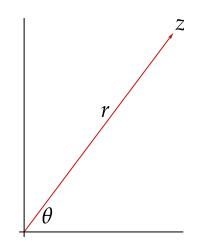

Representation of a complex number with polar coordinates.

## 8.41 over C, invertible operators have square roots

<span id="page-333-0"></span>Suppose V is a complex vector space and  $T \in \mathcal{L}(V)$  is invertible. Then T has a square root.

Proof Let  $\lambda_1, ..., \lambda_m$  be the distinct eigenvalues of T. For each k, there exists a nilpotent operator  $T_k \in \mathcal{L}(G(\lambda_k, T))$  such that  $T|_{G(\lambda_k, T)} = \lambda_k I + T_k$  [see 8.22(b)]. Because T is invertible, none of the  $\lambda_k$ 's equals 0, so we can write

$$T|_{G(\lambda_k,T)} = \lambda_k \left( I + \frac{T_k}{\lambda_k} \right)$$

for each k. Because  $T_k/\lambda_k$  is nilpotent,  $I + T_k/\lambda_k$  has a square root (by 8.39). Multiplying a square root of the complex number  $\lambda_k$  by a square root of  $I + T_k/\lambda_k$ , we obtain a square root  $R_k$  of  $T|_{G(\lambda_k,T)}$ .

By the generalized eigenspace decomposition (8.22), a typical vector  $v \in V$  can be written uniquely in the form

$$v = u_1 + \cdots + u_m$$

where each  $u_k$  is in  $G(\lambda_k, T)$ . Using this decomposition, define an operator  $R \in \mathcal{L}(V)$  by

$$Rv = R_1 u_1 + \dots + R_m u_m.$$

You should verify that this operator R is a square root of T, completing the proof.

By imitating the techniques in this subsection, you should be able to prove that if V is a complex vector space and  $T \in \mathcal{L}(V)$  is invertible, then T has a  $k^{\text{th}}$  root for every positive integer k.

#### <span id="page-334-0"></span>Jordan Form

We know that if V is a complex vector space, then for every  $T \in \mathcal{L}(V)$  there is a basis of V with respect to which T has a nice upper-triangular matrix (see 8.37). In this subsection we will see that we can do even better—there is a basis of V with respect to which the matrix of T contains 0's everywhere except possibly on the diagonal and the line directly above the diagonal.

We begin by looking at two examples of nilpotent operators.

8.42 example: nilpotent operator with nice matrix

Let T be the operator on  $\mathbb{C}^4$  defined by

$$T(z_1, z_2, z_3, z_4) = (0, z_1, z_2, z_3).$$

Then  $T^4 = 0$ ; thus T is nilpotent. If v = (1, 0, 0, 0), then  $T^3v, T^2v, Tv, v$  is a basis of  $\mathbb{C}^4$ . The matrix of T with respect to this basis is

$$\left(\begin{array}{cccc} 0 & 1 & 0 & 0 \\ 0 & 0 & 1 & 0 \\ 0 & 0 & 0 & 1 \\ 0 & 0 & 0 & 0 \end{array}\right).$$

The next example of a nilpotent operator has more complicated behavior than the example above.

8.43 example: nilpotent operator with slightly more complicated matrix

Let T be the operator on  $\mathbb{C}^6$  defined by

$$T(z_1, z_2, z_3, z_4, z_5, z_6) = (0, z_1, z_2, 0, z_4, 0).$$

Then  $T^3=0$ ; thus T is nilpotent. In contrast to the nice behavior of the nilpotent operator of the previous example, for this nilpotent operator there does not exist a vector  $v \in \mathbf{C}^6$  such that  $T^5v$ ,  $T^4v$ ,  $T^3v$ ,  $T^2v$ , Tv, v is a basis of  $\mathbf{C}^6$ . However, if we take  $v_1=(1,0,0,0,0,0)$ ,  $v_2=(0,0,0,1,0,0)$ , and  $v_3=(0,0,0,0,0,1)$ , then  $T^2v_1$ ,  $Tv_1$ ,  $v_1$ ,  $Tv_2$ ,  $v_2$ ,  $v_3$  is a basis of  $\mathbf{C}^6$ . The matrix of T with respect to this basis is

$$\left(\begin{array}{cccc} \left(\begin{array}{cccc} 0 & 1 & 0 \\ 0 & 0 & 1 \\ 0 & 0 & 0 \end{array}\right) & \begin{array}{cccc} 0 & 0 & 0 \\ 0 & 0 & 0 \\ 0 & 0 & 0 \end{array} & \begin{array}{ccccc} 0 & 1 \\ 0 & 0 \end{array}\right) & \begin{array}{ccccc} 0 & 0 \\ 0 & 0 \end{array} & \begin{array}{cccccc} 0 & 1 \\ 0 & 0 \end{array} & \begin{array}{ccccccc} 0 & 0 \\ 0 & 0 \end{array} & \begin{array}{ccccccccc} 0 & 0 \\ 0 & 0 \end{array} & \begin{array}{ccccccccccccccccccccccccccccccccccc$$

Here the inner matrices are blocked off to show that we can think of the 6-by-6 matrix above as a block diagonal matrix consisting of a 3-by-3 block with 1's on the line above the diagonal and 0's elsewhere, a 2-by-2 block with 1 above the diagonal and 0's elsewhere, and a 1-by-1 block containing 0.

<span id="page-335-1"></span>Our next goal is to show that every nilpotent operator  $T \in \mathcal{L}(V)$  behaves similarly to the operator in the previous example. Specifically, there is a finite collection of vectors  $v_1, ..., v_n \in V$  such that there is a basis of V consisting of the vectors of the form  $T^j v_k$ , as k varies from 1 to n and j varies (in reverse order) from 0 to the largest nonnegative integer  $m_k$  such that  $T^{m_k} v_k \neq 0$ . With respect to this basis, the matrix of T looks like the matrix in the previous example. More specifically, T has a block diagonal matrix with respect to this basis, with each block a square matrix that is 0 everywhere except on the line above the diagonal.

In the next definition, the diagonal of each  $A_k$  is filled with some eigenvalue  $\lambda_k$  of T, the line directly above the diagonal of  $A_k$  is filled with 1's, and all other entries in  $A_k$  are 0 (to understand why each  $\lambda_k$  is an eigenvalue of T, see 5.41). The  $\lambda_k$ 's need not be distinct. Also,  $A_k$  may be a 1-by-1 matrix ( $\lambda_k$ ) containing just an eigenvalue of T. If each  $\lambda_k$  is 0, then the next definition captures the behavior described in the paragraph above (recall that if T is nilpotent, then 0 is the only eigenvalue of T).

#### 8.44 definition: Jordan basis

Suppose  $T \in \mathcal{L}(V)$ . A basis of V is called a *Jordan basis* for T if with respect to this basis T has a block diagonal matrix

$$\left(\begin{array}{ccc}
A_1 & & 0 \\
 & \ddots & \\
0 & & A_p
\end{array}\right)$$

in which each  $A_k$  is an upper-triangular matrix of the form

$$A_k = \left( \begin{array}{cccc} \lambda_k & 1 & & 0 \\ & \ddots & \ddots & \\ & & \ddots & 1 \\ 0 & & & \lambda_k \end{array} \right).$$

Most of the work in proving that every operator on a finite-dimensional complex vector space has a Jordan basis occurs in proving the special case below of nilpotent operators. This special case holds on real vector spaces as well as complex vector spaces.

## 8.45 every nilpotent operator has a Jordan basis

<span id="page-335-0"></span>Suppose  $T \in \mathcal{L}(V)$  is nilpotent. Then there is a basis of V that is a Jordan basis for T.

Proof We will prove this result by induction on dim V. To get started, note that the desired result holds if dim V=1 (because in that case, the only nilpotent operator is the 0 operator). Now assume that dim V>1 and that the desired result holds on all vector spaces of smaller dimension.

Let be the smallest positive integer such that = 0. Thus there exists ∈ such that − 1 ≠ 0. Let

$$U = \operatorname{span}(u, Tu, ..., T^{m-1}u).$$

The list , , …, − 1 is linearly independent (see Exercise [2](#page-319-5) in Section [8A\)](#page-311-0). If = , then writing this list in reverse order gives a Jordan basis for and we are done. Thus we can assume that ≠ .

Note that is invariant under . By our induction hypothesis, there is a basis of that is a Jordan basis for |. The strategy of our proof is that we will find a subspace of such that is also invariant under and = ⊕ . Again by our induction hypothesis, there will be a basis of that is a Jordan basis for |. Putting together the Jordan bases for | and |, we will have a Jordan basis for .

Let ∈ ′ be such that ( − 1) ≠ 0. Let

$$W = \left\{ v \in V : \varphi(T^k v) = 0 \text{ for each } k = 0, ..., m - 1 \right\}.$$

Then is a subspace of that is invariant under (the invariance holds because if ∈ then ( ()) = 0 for = 0, …, − 1, where the case = − 1 holds because = 0). We will show that = ⊕ , which by the previous paragraph will complete the proof.

To show that + is a direct sum, suppose ∈ ∩ with ≠ 0. Because ∈ , there exist <sup>0</sup> , …, − 1 ∈ such that

$$v=c_0u+c_1Tu+\cdots+c_{m-1}T^{m-1}u.$$

Let be the smallest index such that ≠ 0. Apply − − 1 to both sides of the equation above, getting

$$T^{m-j-1}v = c_j T^{m-1}u,$$

where we have used the equation = 0. Now apply to both sides of the equation above, getting

$$\varphi(T^{m-j-1}v) = c_j \varphi(T^{m-1}u) \neq 0.$$

The equation above shows that ∉ . Hence we have proved that ∩ = {0}, which implies that + is a direct sum (see [1.46\)](#page-36-1).

To show that ⊕ = , define ∶ → by

$$Sv = (\varphi(v), \varphi(Tv), ..., \varphi(T^{m-1}v)).$$

Thus null = . Hence

$$\dim W = \dim \operatorname{null} S = \dim V - \dim \operatorname{range} S \ge \dim V - m$$
,

where the second equality comes from the fundamental theorem of linear maps [\(3.21\)](#page-75-1). Using the inequality above, we have

$$\dim(U \oplus W) = \dim U + \dim W \ge m + (\dim V - m) = \dim V.$$

Thus ⊕ = (by [2.39\)](#page-58-2), completing the proof.

<span id="page-337-3"></span>324

Now the generalized eigenspace decomposition allows us to extend the previous result to operators that may not be

Camille Jordan (1838–1922) published a proof of 8.46 in 1870.

nilpotent. Doing this requires that we deal with complex vector spaces.

## 8.46 Jordan form

<span id="page-337-1"></span>Suppose F = C and  $T \in \mathcal{L}(V)$ . Then there is a basis of V that is a Jordan basis for T.

Proof Let  $\lambda_1, ..., \lambda_m$  be the distinct eigenvalues of T. The generalized eigenspace decomposition states that

$$V = G(\lambda_1, T) \oplus \cdots \oplus G(\lambda_m, T),$$

where each  $(T - \lambda_k I)|_{G(\lambda_k, T)}$  is nilpotent (see 8.22). Thus 8.45 implies that some basis of each  $G(\lambda_k, T)$  is a Jordan basis for  $(T - \lambda_k I)|_{G(\lambda_k, T)}$ . Put these bases together to get a basis of V that is a Jordan basis for T.

#### <span id="page-337-0"></span>Exercises 8C

- <span id="page-337-2"></span>1 Suppose  $T \in \mathcal{L}(\mathbb{C}^3)$  is the operator defined by  $T(z_1, z_2, z_3) = (z_2, z_3, 0)$ . Prove that T does not have a square root.
- **2** Define  $T \in \mathcal{L}(\mathbf{F}^5)$  by  $T(x_1, x_2, x_3, x_4, x_5) = (2x_2, 3x_3, -x_4, 4x_5, 0)$ .
  - (a) Show that T is nilpotent.
  - (b) Find a square root of I + T.
- 3 Suppose *V* is a complex vector space. Prove that every invertible operator on *V* has a cube root.
- **4** Suppose V is a real vector space. Prove that the operator -I on V has a square root if and only if dim V is an even number.
- 5 Suppose  $T \in \mathcal{L}(\mathbb{C}^2)$  is the operator defined by T(w, z) = (-w z, 9w + 5z). Find a Jordan basis for T.
- 6 Find a basis of  $\mathcal{P}_4(\mathbf{R})$  that is a Jordan basis for the differentiation operator D on  $\mathcal{P}_4(\mathbf{R})$  defined by Dp = p'.
- 7 Suppose  $T \in \mathcal{L}(V)$  is nilpotent and  $v_1, ..., v_n$  is a Jordan basis for T. Prove that the minimal polynomial of T is  $z^{m+1}$ , where m is the length of the longest consecutive string of 1's that appears on the line directly above the diagonal in the matrix of T with respect to  $v_1, ..., v_n$ .
- 8 Suppose  $T \in \mathcal{L}(V)$  and  $v_1, ..., v_n$  is a basis of V that is a Jordan basis for T. Describe the matrix of  $T^2$  with respect to this basis.

- <span id="page-338-0"></span>9 Suppose  $T \in \mathcal{L}(V)$  is nilpotent. Explain why there exist  $v_1, ..., v_n \in V$  and nonnegative integers  $m_1, ..., m_n$  such that (a) and (b) below both hold.
  - (a)  $T^{m_1}v_1, ..., Tv_1, v_1, ..., T^{m_n}v_n, ..., Tv_n, v_n$  is a basis of V.
  - (b)  $T^{m_1+1}v_1 = \cdots = T^{m_n+1}v_n = 0.$
- 10 Suppose  $T \in \mathcal{L}(V)$  and  $v_1,...,v_n$  is a basis of V that is a Jordan basis for T. Describe the matrix of T with respect to the basis  $v_n,...,v_1$  obtained by reversing the order of the v's.
- Suppose  $T \in \mathcal{L}(V)$ . Explain why every vector in each Jordan basis for T is a generalized eigenvector of T.
- Suppose  $T \in \mathcal{L}(V)$  is diagonalizable. Show that  $\mathcal{M}(T)$  is a diagonal matrix with respect to every Jordan basis for T.
- Suppose  $T \in \mathcal{L}(V)$  is nilpotent. Prove that if  $v_1, ..., v_n$  are vectors in V and  $m_1, ..., m_n$  are nonnegative integers such that

$$T^{m_1}v_1, ..., Tv_1, v_1, ..., T^{m_n}v_n, ..., Tv_n, v_n$$
 is a basis of V

and

$$T^{m_1+1}v_1 = \dots = T^{m_n+1}v_n = 0,$$

then  $T^{m_1}v_1, ..., T^{m_n}v_n$  is a basis of null T.

This exercise shows that  $n = \dim \operatorname{null} T$ . Thus the positive integer n that appears above depends only on T and not on the specific Jordan basis chosen for T.

Suppose  $\mathbf{F} = \mathbf{C}$  and  $T \in \mathcal{L}(V)$ . Prove that there does not exist a direct sum decomposition of V into two nonzero subspaces invariant under T if and only if the minimal polynomial of T is of the form  $(z - \lambda)^{\dim V}$  for some  $\lambda \in \mathbf{C}$ .

## <span id="page-339-2"></span><span id="page-339-0"></span>*8D Trace: A Connection Between Matrices and Operators*

We begin this section by defining the trace of a square matrix. After developing some properties of the trace of a square matrix, we will use this concept to define the trace of an operator.

## 8.47 definition: *trace of a matrix*

Suppose is a square matrix with entries in . The *trace* of , denoted tr , is defined to be the sum of the diagonal entries of .

## 8.48 example: *trace of a* 3*-by-*3 *matrix*

Suppose

$$A = \left(\begin{array}{ccc} 3 & -1 & -2 \\ 3 & 2 & -3 \\ 1 & 2 & 0 \end{array}\right).$$

The diagonal entries of , which are shown in red above, are 3, 2, and 0. Thus tr = 3 + 2 + 0 = 5.

Matrix multiplication is not commutative, but the next result shows that the order of matrix multiplication does not matter to the trace.

## 8.49 *trace of equals trace of*

<span id="page-339-1"></span>Suppose is an -by- matrix and is an -by- matrix. Then

$$\operatorname{tr}(AB) = \operatorname{tr}(BA).$$

Proof Suppose

$$A = \begin{pmatrix} A_{1,1} & \cdots & A_{1,n} \\ \vdots & & \vdots \\ A_{m,1} & \cdots & A_{m,n} \end{pmatrix}, \quad B = \begin{pmatrix} B_{1,1} & \cdots & B_{1,m} \\ \vdots & & \vdots \\ B_{n,1} & \cdots & B_{n,m} \end{pmatrix}.$$

The th term on the diagonal of the -by- matrix equals ∑ = 1 ,, . Thus

$$tr(AB) = \sum_{j=1}^{m} \sum_{k=1}^{n} A_{j,k} B_{k,j}$$

$$= \sum_{k=1}^{n} \sum_{j=1}^{m} B_{k,j} A_{j,k}$$

$$= \sum_{k=1}^{n} \left( k^{\text{th}} \text{ term on diagonal of the } n\text{-by-}n \text{ matrix } BA \right)$$

$$= tr(BA),$$

as desired.

<span id="page-340-1"></span>We want to define the trace of an operator  $T \in \mathcal{L}(V)$  to be the trace of the matrix of T with respect to some basis of V. However, this definition should not depend on the choice of basis. The following result will make this possible.

## 8.50 trace of matrix of operator does not depend on basis

<span id="page-340-0"></span>Suppose  $T \in \mathcal{L}(V)$ . Suppose  $u_1, ..., u_n$  and  $v_1, ..., v_n$  are bases of V. Then

$$\operatorname{tr} \mathcal{M} \big( T, (u_1, ..., u_n) \big) = \operatorname{tr} \mathcal{M} \big( T, (v_1, ..., v_n) \big).$$

Proof Let  $A = \mathcal{M}(T, (u_1, ..., u_n))$  and  $B = \mathcal{M}(T, (v_1, ..., v_n))$ . The change-of-basis formula tells us that there exists an invertible n-by-n matrix C such that  $A = C^{-1}BC$  (see 3.84). Thus

$$\operatorname{tr} A = \operatorname{tr}\left(\left(C^{-1}B\right)C\right)$$
$$= \operatorname{tr}\left(C\left(C^{-1}B\right)\right)$$
$$= \operatorname{tr}\left(\left(CC^{-1}\right)B\right)$$
$$= \operatorname{tr} B,$$

where the second line comes from 8.49.

Because of 8.50, the following definition now makes sense.

## 8.51 definition: *trace of an operator*

Suppose  $T \in \mathcal{L}(V)$ . The *trace* of T, denoted tr T, is defined by

$$\operatorname{tr} T = \operatorname{tr} \mathcal{M} (T, (v_1, ..., v_n)),$$

where  $v_1, ..., v_n$  is any basis of V.

Suppose  $T \in \mathcal{L}(V)$  and  $\lambda$  is an eigenvalue of T. Recall that we defined the multiplicity of  $\lambda$  to be the dimension of the generalized eigenspace  $G(\lambda, T)$  (see 8.23); we proved that this multiplicity equals  $\dim \operatorname{null}(T - \lambda I)^{\dim V}$  (see 8.20). Recall also that if V is a complex vector space, then the sum of the multiplicities of all eigenvalues of T equals  $\dim V$  (see 8.25).

In the following result, the sum of the eigenvalues "with each eigenvalue included as many times as its multiplicity" means that if  $\lambda_1, ..., \lambda_m$  are the distinct eigenvalues of T with multiplicities  $d_1, ..., d_m$ , then the sum is

$$d_1\lambda_1+\cdots+d_m\lambda_m.$$

Or if you prefer to work with a list of not-necessarily-distinct eigenvalues, with each eigenvalue included as many times as its multiplicity, then the eigenvalues could be denoted by  $\lambda_1, ..., \lambda_n$  (where n equals dim V) and the sum is

$$\lambda_1 + \dots + \lambda_n$$
.

8.52 *on complex vector spaces, trace equals sum of eigenvalues* 

<span id="page-341-0"></span>Suppose F = C and  $T \in \mathcal{L}(V)$ . Then tr T equals the sum of the eigenvalues of T, with each eigenvalue included as many times as its multiplicity.

Proof There is a basis of V with respect to which T has an upper-triangular matrix with the diagonal entries of the matrix consisting of the eigenvalues of T, with each eigenvalue included as many times as its multiplicity—see 8.37. Thus the definition of the trace of an operator along with 8.50, which allows us to use a basis of our choice, implies that tr T equals the sum of the eigenvalues of T, with each eigenvalue included as many times as its multiplicity.

8.53 example: trace of an operator on  $\mathbb{C}^3$ 

Suppose  $T \in \mathcal{L}(\mathbf{C}^3)$  is defined by

$$T(z_1, z_2, z_3) = (3z_1 - z_2 - 2z_3, 3z_1 + 2z_2 - 3z_3, z_1 + 2z_2).$$

Then the matrix of T with respect to the standard basis of  $\mathbb{C}^3$  is

$$\left(\begin{array}{ccc} 3 & -1 & -2 \\ 3 & 2 & -3 \\ 1 & 2 & 0 \end{array}\right).$$

Adding up the diagonal entries of this matrix, we see that tr T = 5.

The eigenvalues of T are 1, 2 + 3i, and 2 - 3i, each with multiplicity 1, as you can verify. The sum of these eigenvalues, each included as many times as its multiplicity, is 1 + (2 + 3i) + (2 - 3i), which equals 5, as expected by 8.52.

The trace has a close connection with the characteristic polynomial. Suppose  $\mathbf{F} = \mathbf{C}, T \in \mathcal{L}(V)$ , and  $\lambda_1, ..., \lambda_n$  are the eigenvalues of T, with each eigenvalue included as many times as its multiplicity. Then by definition (see 8.26), the characteristic polynomial of T equals

$$(z-\lambda_1)\cdots(z-\lambda_n)\,.$$

Expanding the polynomial above, we can write the characteristic polynomial of T in the form

$$z^n-(\lambda_1+\cdots+\lambda_n)z^{n-1}+\cdots+(-1)^n(\lambda_1\cdots\lambda_n).$$

The expression above immediately leads to the next result. Also see 9.65, which does not require the hypothesis that F = C.

## 8.54 trace and characteristic polynomial

<span id="page-341-1"></span>Suppose  $\mathbf{F} = \mathbf{C}$  and  $T \in \mathcal{L}(V)$ . Let  $n = \dim V$ . Then tr T equals the negative of the coefficient of  $z^{n-1}$  in the characteristic polynomial of T.

The next result gives a nice formula for the trace of an operator on an inner product space.

## 8.55 *trace on an inner product space*

Suppose is an inner product space, ∈ ℒ(), and <sup>1</sup> , …, is an orthonormal basis of . Then

$$\operatorname{tr} T = \langle Te_1, e_1 \rangle + \dots + \langle Te_n, e_n \rangle.$$

Proof The desired formula follows from the observation that the entry in row , column of ℳ(, (<sup>1</sup> , …, )) equals ⟨ , ⟩ [use [6.30\(](#page-213-0)a) with = ].

The algebraic properties of the trace as defined on square matrices translate to algebraic properties of the trace as defined on operators, as shown in the next result.

## 8.56 *trace is linear*

<span id="page-342-0"></span>The function tr∶ ℒ() → is a linear functional on ℒ() such that

$$tr(ST) = tr(TS)$$

for all , ∈ ℒ().

Proof Choose a basis of . All matrices of operators in this proof will be with respect to that basis. Suppose , ∈ ℒ().

If ∈ , then

$$\operatorname{tr}(\lambda T) = \operatorname{tr} \mathcal{M}(\lambda T) = \operatorname{tr} (\lambda \mathcal{M}(T)) = \lambda \operatorname{tr} \mathcal{M}(T) = \lambda \operatorname{tr} T,$$

where the first and last equalities come from the definition of the trace of an operator, the second equality comes from [3.38,](#page-85-1) and the third equality follows from the definition of the trace of a square matrix.

Also,

$$\operatorname{tr}(S+T) = \operatorname{tr}\mathcal{M}(S+T) = \operatorname{tr}\big(\mathcal{M}(S) + \mathcal{M}(T)\big) = \operatorname{tr}\mathcal{M}(S) + \operatorname{tr}\mathcal{M}(T) = \operatorname{tr}S + \operatorname{tr}T,$$

where the first and last equalities come from the definition of the trace of an operator, the second equality comes from [3.35,](#page-84-1) and the third equality follows from the definition of the trace of a square matrix. The two paragraphs above show that tr∶ ℒ() → is a linear functional on ℒ().

Furthermore,

$$\operatorname{tr}(ST) = \operatorname{tr}\mathcal{M}(ST) = \operatorname{tr}\big(\mathcal{M}(S)\mathcal{M}(T)\big) = \operatorname{tr}\big(\mathcal{M}(T)\mathcal{M}(S)\big) = \operatorname{tr}\mathcal{M}(TS) = \operatorname{tr}(TS),$$

where the second and fourth equalities come from [3.43](#page-87-0) and the crucial third equality comes from [8.49.](#page-339-1)

The equations tr() = tr() and tr = dim uniquely characterize the trace among the linear functionals on ℒ()—see Exercise [10.](#page-344-0)

The equation tr() = tr() leads to our next result, which does not hold on infinite-dimensional vector spaces (see Exercise [13\)](#page-344-1). However, additional hypotheses on , , and lead to an infinitedimensional generalization of the result below, with important applications to quantum theory.

*The statement of the next result does not involve traces, but the short proof uses traces. When something like this happens in mathematics, then usually a good definition lurks in the background.*

## 8.57 *identity operator is not the difference of and*

<span id="page-343-1"></span>There do not exist operators , ∈ ℒ() such that − = .

Proof Suppose , ∈ ℒ(). Then

$$tr(ST - TS) = tr(ST) - tr(TS) = 0,$$

where both equalities come from [8.56.](#page-342-0) The trace of equals dim , which is not 0. Because − and have different traces, they cannot be equal.

## <span id="page-343-0"></span>*Exercises 8D*

- **1** Suppose is an inner product space and , ∈ . Define an operator ∈ ℒ() by = ⟨, ⟩. Find a formula for tr .
- **2** Suppose ∈ ℒ() satisfies <sup>2</sup> = . Prove that

tr = dim range .

- **3** Suppose ∈ ℒ() and <sup>5</sup> = . Prove that the real and imaginary parts of tr are both integers.
- **4** Suppose is an inner product space and ∈ ℒ(). Prove that

$$\operatorname{tr} T^* = \overline{\operatorname{tr} T}.$$

- **5** Suppose is an inner product space. Suppose ∈ ℒ() is a positive operator and tr = 0. Prove that = 0.
- **6** Suppose is an inner product space and , ∈ ℒ() are orthogonal projections. Prove that tr() ≥ 0.
- **7** Suppose ∈ ℒ( <sup>3</sup>) is the operator whose matrix is

$$\left(\begin{array}{ccc} 51 & -12 & -21 \\ 60 & -40 & -28 \\ 57 & -68 & 1 \end{array}\right).$$

Someone tells you (accurately) that −48 and 24 are eigenvalues of . Without using a computer or writing anything down, find the third eigenvalue of .

- <span id="page-344-2"></span>**8** Prove or give a counterexample: If  $S, T \in \mathcal{L}(V)$ , then tr(ST) = (tr S)(tr T).
- 9 Suppose  $T \in \mathcal{L}(V)$  is such that tr(ST) = 0 for all  $S \in \mathcal{L}(V)$ . Prove that T = 0.
- <span id="page-344-0"></span>10 Prove that the trace is the only linear functional  $\tau \colon \mathcal{L}(V) \to \mathbf{F}$  such that

$$\tau(ST) = \tau(TS)$$

for all  $S, T \in \mathcal{L}(V)$  and  $\tau(I) = \dim V$ .

Hint: Suppose that  $v_1, ..., v_n$  is a basis of V. For  $j,k \in \{1, ..., n\}$ , define  $P_{j,k} \in \mathcal{L}(V)$  by  $P_{j,k}(a_1v_1 + \cdots + a_nv_n) = a_kv_j$ . Prove that

$$\tau(P_{j,k}) = \begin{cases} 1 & \text{if } j = k, \\ 0 & \text{if } j \neq k. \end{cases}$$

Then for  $T \in \mathcal{L}(V)$ , use the equation  $T = \sum_{k=1}^{n} \sum_{j=1}^{n} \mathcal{M}(T)_{j,k} P_{j,k}$  to show that  $\tau(T) = \operatorname{tr} T$ .

Suppose V and W are inner product spaces and  $T \in \mathcal{L}(V, W)$ . Prove that if  $e_1, ..., e_n$  is an orthonormal basis of V and  $f_1, ..., f_m$  is an orthonormal basis of W, then

$$\operatorname{tr}(T^*T) = \sum_{k=1}^{n} \sum_{j=1}^{m} |\langle Te_k, f_j \rangle|^2.$$

The numbers  $\langle Te_k, f_j \rangle$  are the entries of the matrix of T with respect to the orthonormal bases  $e_1, ..., e_n$  and  $f_1, ..., f_m$ . These numbers depend on the bases, but  $tr(T^*T)$  does not depend on a choice of bases. Thus this exercise shows that the sum of the squares of the absolute values of the matrix entries does not depend on which orthonormal bases are used.

- 12 Suppose V and W are finite-dimensional inner product spaces.
  - (a) Prove that  $\langle S, T \rangle = \text{tr}(T^*S)$  defines an inner product on  $\mathcal{L}(V, W)$ .
  - (b) Suppose  $e_1, ..., e_n$  is an orthonormal basis of V and  $f_1, ..., f_m$  is an orthonormal basis of W. Show that the inner product on  $\mathcal{L}(V, W)$  from (a) is the same as the standard inner product on  $\mathbf{F}^{mn}$ , where we identify each element of  $\mathcal{L}(V, W)$  with its matrix (with respect to the bases just mentioned) and then with an element of  $\mathbf{F}^{mn}$ .

Caution: The norm of a linear map  $T \in \mathcal{L}(V, W)$  as defined by 7.86 is not the same as the norm that comes from the inner product in (a) above. Unless explicitly stated otherwise, always assume that ||T|| refers to the norm as defined by 7.86. The norm that comes from the inner product in (a) is called the **Frobenius norm** or the **Hilbert–Schmidt norm**.

<span id="page-344-1"></span>13 Find  $S, T \in \mathcal{L}(\mathcal{P}(\mathbf{F}))$  such that ST - TS = I.

Hint: Make an appropriate modification of the operators in Example 3.9. This exercise shows that additional hypotheses are needed on S and T to extend 8.57 to the setting of infinite-dimensional vector spaces.

## Chapter 9

# <span id="page-345-1"></span><span id="page-345-0"></span>*Multilinear Algebra and Determinants*

We begin this chapter by investigating bilinear forms and quadratic forms on a vector space. Then we will move on to multilinear forms. We will show that the vector space of alternating -linear forms has dimension one on a vector space of dimension . This result will allow us to give a clean basis-free definition of the determinant of an operator.

This approach to the determinant via alternating multilinear forms leads to straightforward proofs of key properties of determinants. For example, we will see that the determinant is multiplicative, meaning that det() = (det )(det ) for all operators and on the same vector space. We will also see that is invertible if and only if det ≠ 0. Another important result states that the determinant of an operator on a complex vector space equals the product of the eigenvalues of the operator, with each eigenvalue included as many times as its multiplicity.

The chapter concludes with an introduction to tensor products.

## *standing assumptions for this chapter*

- denotes or .
- and denote finite-dimensional nonzero vector spaces over .


*The Mathematical Institute at the University of Göttingen. This building opened in 1930, when Emmy Noether* (*1882–1935*) *had already been a research mathematician and faculty member at the university for 15 years* (*the first eight years without salary*)*. Noether was fired by the Nazi government in 1933. By then Noether and her collaborators had created many of the foundations of modern algebra, including an abstract algebra viewpoint that contributed to the development of linear algebra.*

## <span id="page-346-4"></span><span id="page-346-0"></span>9A Bilinear Forms and Quadratic Forms

#### <span id="page-346-1"></span>Bilinear Forms

A bilinear form on V is a function from  $V \times V$  to F that is linear in each slot separately, meaning that if we hold either slot fixed then we have a linear function in the other slot. Here is the formal definition.

#### 9.1 definition: bilinear form

<span id="page-346-3"></span>A bilinear form on V is a function  $\beta \colon V \times V \to \mathbf{F}$  such that

$$v \mapsto \beta(v, u)$$
 and  $v \mapsto \beta(u, v)$ 

are both linear functionals on V for every  $u \in V$ .

For example, if V is a real inner product space, then the function that takes an ordered pair  $(u, v) \in V \times V$  to  $\langle u, v \rangle$  is a bilinear form on V. If V is a nonzero complex inner product space, then this function is not a bilinear form because the inner product is not linear in the second slot (complex scalars come out of the second slot as their complex conjugates).

Recall that the term linear functional, used in the definition above, means a linear function that maps into the scalar field F. Thus the term bilinear functional would be more consistent terminology than bilinear form, which unfortunately has become standard.

If  $\mathbf{F} = \mathbf{R}$ , then a bilinear form differs from an inner product in that an inner product requires symmetry [meaning that  $\beta(v,w) = \beta(w,v)$  for all  $v,w \in V$ ] and positive definiteness [meaning that  $\beta(v,v) > 0$  for all  $v \in V \setminus \{0\}$ ], but these properties are not required for a bilinear form.

#### <span id="page-346-2"></span>9.2 example: bilinear forms

• The function  $\beta \colon \mathbf{F}^3 \times \mathbf{F}^3 \to \mathbf{F}$  defined by

$$\beta((x_1, x_2, x_3), (y_1, y_2, y_3)) = x_1y_2 - 5x_2y_3 + 2x_3y_1$$

is a bilinear form on  $\mathbf{F}^3$ .

• Suppose *A* is an *n*-by-*n* matrix with  $A_{j,k} \in \mathbf{F}$  in row *j*, column *k*. Define a bilinear form  $\beta_A$  on  $\mathbf{F}^n$  by

$$\beta_A((x_1,...,x_n),(y_1,...,y_n)) = \sum_{k=1}^n \sum_{j=1}^n A_{j,k} x_j y_k.$$

The first bullet point is a special case of this bullet point with n = 3 and

$$A = \left(\begin{array}{ccc} 0 & 1 & 0 \\ 0 & 0 & -5 \\ 2 & 0 & 0 \end{array}\right).$$

<span id="page-347-0"></span>334

• Suppose *V* is a real inner product space and  $T \in \mathcal{L}(V)$ . Then the function  $\beta \colon V \times V \to \mathbf{R}$  defined by

$$\beta(u,v) = \langle u, Tv \rangle$$

is a bilinear form on V.

• If *n* is a positive integer, then the function  $\beta \colon \mathcal{P}_n(\mathbf{R}) \times \mathcal{P}_n(\mathbf{R}) \to \mathbf{R}$  defined by

$$\beta(p,q) = p(2) \cdot q'(3)$$

is a bilinear form on  $\mathcal{P}_n(\mathbf{R})$ .

• Suppose  $\varphi, \tau \in V'$ . Then the function  $\beta \colon V \times V \to \mathbf{F}$  defined by

$$\beta(u,v) = \varphi(u) \cdot \tau(v)$$

is a bilinear form on V.

• More generally, suppose that  $\varphi_1, ..., \varphi_n, \tau_1, ..., \tau_n \in V'$ . Then the function  $\beta \colon V \times V \to \mathbf{F}$  defined by

$$\beta(u,v) = \varphi_1(u) \cdot \tau_1(v) + \dots + \varphi_n(u) \cdot \tau_n(v)$$

is a bilinear form on V.

A bilinear form on V is a function from  $V \times V$  to  $\mathbf{F}$ . Because  $V \times V$  is a vector space, this raises the question of whether a bilinear form can also be a linear map from  $V \times V$  to  $\mathbf{F}$ . Note that none of the bilinear forms in 9.2 are linear maps except in some special cases in which the bilinear form is the zero map. Exercise 3 shows that a bilinear form  $\beta$  on V is a linear map on  $V \times V$  only if  $\beta = 0$ .

9.3 definition:  $V^{(2)}$ 

The set of bilinear forms on V is denoted by  $V^{(2)}$ .

With the usual operations of addition and scalar multiplication of functions,  $V^{(2)}$  is a vector space.

For T an operator on an n-dimensional vector space V and a basis  $e_1, ..., e_n$  of V, we used an n-by-n matrix to provide information about T. We now do the same thing for bilinear forms on V.

## 9.4 definition: *matrix of a bilinear form*, $\mathcal{M}(\beta)$

Suppose  $\beta$  is a bilinear form on V and  $e_1,...,e_n$  is a basis of V. The *matrix* of  $\beta$  with respect to this basis is the n-by-n matrix  $\mathcal{M}(\beta)$  whose entry  $\mathcal{M}(\beta)_{j,k}$  in row j, column k is given by

$$\mathcal{M}(\beta)_{i,k} = \beta(e_i, e_k)$$
.

If the basis  $e_1, ..., e_n$  is not clear from the context, then the notation  $\mathcal{M}(\beta, (e_1, ..., e_n))$  is used.

Recall that  $\mathbf{F}^{n,n}$  denotes the vector space of *n*-by-*n* matrices with entries in  $\mathbf{F}$  and that dim  $\mathbf{F}^{n,n}=n^2$  (see 3.39 and 3.40).

## 9.5 $\dim V^{(2)} = (\dim V)^2$

Suppose  $e_1, ..., e_n$  is a basis of V. Then the map  $\beta \mapsto \mathcal{M}(\beta)$  is an isomorphism of  $V^{(2)}$  onto  $\mathbf{F}^{n,n}$ . Furthermore, dim  $V^{(2)} = (\dim V)^2$ .

Proof The map  $\beta \mapsto \mathcal{M}(\beta)$  is clearly a linear map of  $V^{(2)}$  into  $\mathbf{F}^{n,n}$ . For  $A \in \mathbf{F}^{n,n}$ , define a bilinear form  $\beta_A$  on V by

$$\beta_A(x_1e_1 + \dots + x_ne_n, y_1e_1 + \dots + y_ne_n) = \sum_{k=1}^n \sum_{j=1}^n A_{j,k}x_jy_k$$

for  $x_1, ..., x_n, y_1, ..., y_n \in \mathbf{F}$  (if  $V = \mathbf{F}^n$  and  $e_1, ..., e_n$  is the standard basis of  $\mathbf{F}^n$ , this  $\beta_A$  is the same as the bilinear form  $\beta_A$  in the second bullet point of Example 9.2).

The linear map  $\beta \mapsto \mathcal{M}(\beta)$  from  $V^{(2)}$  to  $\mathbf{F}^{n,n}$  and the linear map  $A \mapsto \beta_A$  from  $\mathbf{F}^{n,n}$  to  $V^{(2)}$  are inverses of each other because  $\beta_{\mathcal{M}(\beta)} = \beta$  for all  $\beta \in V^{(2)}$  and  $\mathcal{M}(\beta_A) = A$  for all  $A \in \mathbf{F}^{n,n}$ , as you should verify.

Thus both maps are isomorphisms and the two spaces that they connect have the same dimension. Hence dim  $V^{(2)} = \dim \mathbf{F}^{n,n} = n^2 = (\dim V)^2$ .

Recall that  $C^t$  denotes the transpose of a matrix C. The matrix  $C^t$  is obtained by interchanging the rows and the columns of C.

## 9.6 composition of a bilinear form and an operator

<span id="page-348-0"></span>Suppose  $\beta$  is a bilinear form on V and  $T \in \mathcal{L}(V)$ . Define bilinear forms  $\alpha$  and  $\rho$  on V by

$$\alpha(u, v) = \beta(u, Tv)$$
 and  $\rho(u, v) = \beta(Tu, v)$ .

Let  $e_1, ..., e_n$  be a basis of V. Then

$$\mathcal{M}(\alpha) = \mathcal{M}(\beta) \mathcal{M}(T)$$
 and  $\mathcal{M}(\rho) = \mathcal{M}(T)^{t} \mathcal{M}(\beta)$ .

Proof If  $j, k \in \{1, ..., n\}$ , then

$$\begin{split} \mathcal{M}(\alpha)_{j,k} &= \alpha(e_j, e_k) \\ &= \beta(e_j, Te_k) \\ &= \beta \Big(e_j, \sum_{m=1}^n \mathcal{M}(T)_{m,k} \ e_m \Big) \\ &= \sum_{m=1}^n \beta(e_j, e_m) \, \mathcal{M}(T)_{m,k} \\ &= \Big(\mathcal{M}(\beta) \, \mathcal{M}(T)\Big)_{j,k}. \end{split}$$

Thus  $\mathcal{M}(\alpha) = \mathcal{M}(\beta)\mathcal{M}(T)$ . The proof that  $\mathcal{M}(\rho) = \mathcal{M}(T)^{\mathsf{t}}\mathcal{M}(\beta)$  is similar.

<span id="page-349-1"></span>The result below shows how the matrix of a bilinear form changes if we change the basis. The formula in the result below should be compared to the change-of-basis formula for the matrix of an operator (see 3.84). The two formulas are similar, except that the transpose  $C^{t}$  appears in the formula below and the inverse  $C^{-1}$  appears in the change-of-basis formula for the matrix of an operator.

## 9.7 change-of-basis formula

<span id="page-349-0"></span>Suppose  $\beta \in V^{(2)}$ . Suppose  $e_1, ..., e_n$  and  $f_1, ..., f_n$  are bases of V. Let

$$A = \mathcal{M}(\beta, (e_1, ..., e_n))$$
 and  $B = \mathcal{M}(\beta, (f_1, ..., f_n))$ 

and  $C = \mathcal{M}(I, (e_1, ..., e_n), (f_1, ..., f_n))$ . Then

$$A = C^{t}BC$$
.

Proof The linear map lemma (3.4) tells us that there exists an operator  $T \in \mathcal{L}(V)$  such that  $Tf_k = e_k$  for each k = 1, ..., n. The definition of the matrix of an operator with respect to a basis implies that

$$\mathcal{M}(T,(f_1,...,f_n)) = C.$$

Define bilinear forms  $\alpha$ ,  $\rho$  on V by

$$\alpha(u, v) = \beta(u, Tv)$$
 and  $\rho(u, v) = \alpha(Tu, v) = \beta(Tu, Tv)$ .

Then  $\beta(e_j, e_k) = \beta(Tf_j, Tf_k) = \rho(f_j, f_k)$  for all  $j, k \in \{1, ..., n\}$ . Thus

$$A = \mathcal{M}(\rho, (f_1, ..., f_n))$$
  
=  $C^{\mathsf{t}}\mathcal{M}(\alpha, (f_1, ..., f_n))$   
=  $C^{\mathsf{t}}BC$ ,

where the second and third lines each follow from 9.6.

## 9.8 example: the matrix of a bilinear form on $\mathcal{P}_2(\mathbf{R})$

Define a bilinear form  $\beta$  on  $\mathcal{P}_2(\mathbf{R})$  by  $\beta(p,q) = p(2) \cdot q'(3)$ . Let

$$A = \mathcal{M}(\beta, (1, x - 2, (x - 3)^2))$$
 and  $B = \mathcal{M}(\beta, (1, x, x^2))$ 

and  $C = \mathcal{M}(I, (1, x - 2, (x - 3)^2), (1, x, x^2))$ . Then

$$A = \begin{pmatrix} 0 & 1 & 0 \\ 0 & 0 & 0 \\ 0 & 1 & 0 \end{pmatrix} \quad \text{and} \quad B = \begin{pmatrix} 0 & 1 & 6 \\ 0 & 2 & 12 \\ 0 & 4 & 24 \end{pmatrix} \quad \text{and} \quad C = \begin{pmatrix} 1 & -2 & 9 \\ 0 & 1 & -6 \\ 0 & 0 & 1 \end{pmatrix}.$$

Now the change-of-basis formula 9.7 asserts that  $A = C^{t}BC$ , which you can verify with matrix multiplication using the matrices above.

## <span id="page-350-2"></span><span id="page-350-0"></span>*Symmetric Bilinear Forms*

9.9 definition: *symmetric bilinear form,* (2) sym

A bilinear form ∈ (2) is called *symmetric* if

$$\rho(u, w) = \rho(w, u)$$

for all , ∈ . The set of symmetric bilinear forms on is denoted by (2) sym.

9.10 example: *symmetric bilinear forms*

• If is a real inner product space and ∈ (2) is defined by

$$\rho(u, w) = \langle u, w \rangle,$$

then is a symmetric bilinear form on .

• Suppose is a real inner product space and ∈ ℒ(). Define ∈ (2) by

$$\rho(u,w) = \langle u, Tw \rangle.$$

Then is a symmetric bilinear form on if and only if is a self-adjoint operator (the previous bullet point is the special case = ).

• Suppose ∶ ℒ() × ℒ() → is defined by

$$\rho(S,T) = \operatorname{tr}(ST).$$

Then is a symmetric bilinear form on ℒ() because trace is a linear functional on ℒ() and tr() = tr() for all , ∈ ℒ(); see [8.56.](#page-342-0)

9.11 definition: *symmetric matrix*

A square matrix is called *symmetric* if it equals its transpose.

An operator on may have a symmetric matrix with respect to some but not all bases of . In contrast, the next result shows that a bilinear form on has a symmetric matrix with respect to either all bases of or with respect to no bases of .

## 9.12 *symmetric bilinear forms are diagonalizable*

<span id="page-350-1"></span>Suppose ∈ (2). Then the following are equivalent.

- (a) is a symmetric bilinear form on .
- (b) ℳ(, (<sup>1</sup> , …, )) is a symmetric matrix for every basis <sup>1</sup> , …, of .
- (c) ℳ(, (<sup>1</sup> , …, )) is a symmetric matrix for some basis <sup>1</sup> , …, of .
- (d) ℳ(, (<sup>1</sup> , …, )) is a diagonal matrix for some basis <sup>1</sup> , …, of .

Proof First suppose (a) holds, so  $\rho$  is a symmetric bilinear form. Suppose  $e_1,...,e_n$  is a basis of V and  $j,k \in \{1,...,n\}$ . Then  $\rho(e_j,e_k) = \rho(e_k,e_j)$  because  $\rho$  is symmetric. Thus  $\mathcal{M}(\rho,(e_1,...,e_n))$  is a symmetric matrix, showing that (a) implies (b).

Clearly (b) implies (c).

Now suppose (c) holds and  $e_1,...,e_n$  is a basis of V such that  $\mathcal{M}\left(\rho,(e_1,...,e_n)\right)$  is a symmetric matrix. Suppose  $u,w\in V$ . There exist  $a_1,...,a_n,b_1,...,b_n\in F$  such that  $u=a_1e_1+\cdots+a_ne_n$  and  $w=b_1e_1+\cdots+b_ne_n$ . Now

$$\rho(u, w) = \rho\left(\sum_{j=1}^{n} a_{j}e_{j}, \sum_{k=1}^{n} b_{k}e_{k}\right)$$

$$= \sum_{j=1}^{n} \sum_{k=1}^{n} a_{j}b_{k}\rho(e_{j}, e_{k})$$

$$= \sum_{j=1}^{n} \sum_{k=1}^{n} a_{j}b_{k}\rho(e_{k}, e_{j})$$

$$= \rho\left(\sum_{k=1}^{n} b_{k}e_{k}, \sum_{j=1}^{n} a_{j}e_{j}\right)$$

$$= \rho(w, u),$$

where the third line holds because  $\mathcal{M}(\rho)$  is a symmetric matrix. The equation above shows that  $\rho$  is a symmetric bilinear form, proving that (c) implies (a).

At this point, we have proved that (a), (b), (c) are equivalent. Because every diagonal matrix is symmetric, (d) implies (c). To complete the proof, we will show that (a) implies (d) by induction on  $n = \dim V$ .

If n=1, then (a) implies (d) because every 1-by-1 matrix is diagonal. Now suppose n>1 and the implication (a)  $\implies$  (d) holds for one less dimension. Suppose (a) holds, so  $\rho$  is a symmetric bilinear form. If  $\rho=0$ , then the matrix of  $\rho$  with respect to every basis of V is the zero matrix, which is a diagonal matrix. Hence we can assume that  $\rho\neq 0$ , which means there exist  $u,w\in V$  such that  $\rho(u,w)\neq 0$ . Now

$$2\rho(u,w) = \rho(u+w,u+w) - \rho(u,u) - \rho(w,w).$$

Because the left side of the equation above is nonzero, the three terms on the right cannot all equal 0. Hence there exists  $v \in V$  such that  $\rho(v, v) \neq 0$ .

Let  $U = \{u \in V : \rho(u,v) = 0\}$ . Thus U is the null space of the linear functional  $u \mapsto \rho(u,v)$  on V. This linear functional is not the zero linear functional because  $v \notin U$ . Thus dim U = n - 1. By our induction hypothesis, there is a basis  $e_1, ..., e_{n-1}$  of U such that the symmetric bilinear form  $\rho|_{U \times U}$  has a diagonal matrix with respect to this basis.

Because  $v \notin U$ , the list  $e_1, ..., e_{n-1}, v$  is a basis of V. Suppose  $k \in \{1, ..., n-1\}$ . Then  $\rho(e_k, v) = 0$  by the construction of U. Because  $\rho$  is symmetric, we also have  $\rho(v, e_k) = 0$ . Thus the matrix of  $\rho$  with respect to  $e_1, ..., e_{n-1}, v$  is a diagonal matrix, completing the proof that (a) implies (d).

<span id="page-352-2"></span>The previous result states that every symmetric bilinear form has a diagonal matrix with respect to some basis. If our vector space happens to be a real inner product space, then the next result shows that every symmetric bilinear form has a diagonal matrix with respect to some *orthonormal* basis. Note that the inner product here is unrelated to the bilinear form.

## 9.13 diagonalization of a symmetric bilinear form by an orthonormal basis

<span id="page-352-0"></span>Suppose V is a real inner product space and  $\rho$  is a symmetric bilinear form on V. Then  $\rho$  has a diagonal matrix with respect to some orthonormal basis of V.

Proof Let  $f_1, ..., f_n$  be an orthonormal basis of V. Let  $B = \mathcal{M}(\rho, (f_1, ..., f_n))$ . Then B is a symmetric matrix (by 9.12). Let  $T \in \mathcal{L}(V)$  be the operator such that  $\mathcal{M}(T, (f_1, ..., f_n)) = B$ . Thus T is self-adjoint.

The real spectral theorem (7.29) states that T has a diagonal matrix with respect to some orthonormal basis  $e_1, ..., e_n$  of V. Let  $C = \mathcal{M}(I, (e_1, ..., e_n), (f_1, ..., f_n))$ . Thus  $C^{-1}BC$  is the matrix of T with respect to the basis  $e_1, ..., e_n$  (by 3.84). Hence  $C^{-1}BC$  is a diagonal matrix. Now

$$M\big(\rho,(e_1,...,e_n)\big)=C^{\mathsf{t}}BC=C^{-1}BC,$$

where the first equality holds by 9.7 and the second equality holds because C is a unitary matrix with real entries (which implies that  $C^{-1} = C^{t}$ ; see 7.57).

Now we turn our attention to alternating bilinear forms. Alternating multilinear forms will play a major role in our approach to determinants later in this chapter.

9.14 definition: alternating bilinear form,  $V_{\text{alt}}^{(2)}$ 

A bilinear form  $\alpha \in V^{(2)}$  is called *alternating* if

$$\alpha(v, v) = 0$$

for all  $v \in V$ . The set of alternating bilinear forms on V is denoted by  $V_{\text{alt}}^{(2)}$ .

<span id="page-352-1"></span>9.15 example: alternating bilinear forms

• Suppose  $n \ge 3$  and  $\alpha : \mathbf{F}^n \times \mathbf{F}^n \to \mathbf{F}$  is defined by

$$\alpha((x_1,...,x_n),(y_1,...,y_n)) = x_1y_2 - x_2y_1 + x_1y_3 - x_3y_1.$$

Then  $\alpha$  is an alternating bilinear form on  $\mathbf{F}^n$ .

• Suppose  $\varphi, \tau \in V'$ . Then the bilinear form  $\alpha$  on V defined by

$$\alpha(u, w) = \varphi(u) \tau(w) - \varphi(w) \tau(u)$$

is alternating.

The next result shows that a bilinear form is alternating if and only if switching the order of the two inputs multiplies the output by -1.

## 9.16 characterization of alternating bilinear forms

<span id="page-353-0"></span>A bilinear form  $\alpha$  on V is alternating if and only if

$$\alpha(u, w) = -\alpha(w, u)$$

for all  $u, w \in V$ .

Proof First suppose that  $\alpha$  is alternating. If  $u, w \in V$ , then

$$0 = \alpha(u + w, u + w)$$
  
=  $\alpha(u, u) + \alpha(u, w) + \alpha(w, u) + \alpha(w, w)$   
=  $\alpha(u, w) + \alpha(w, u)$ .

Thus  $\alpha(u, w) = -\alpha(w, u)$ , as desired.

To prove the implication in the other direction, suppose  $\alpha(u, w) = -\alpha(w, u)$  for all  $u, w \in V$ . Then  $\alpha(v, v) = -\alpha(v, v)$  for all  $v \in V$ , which implies that  $\alpha(v, v) = 0$  for all  $v \in V$ . Thus  $\alpha$  is alternating.

Now we show that the vector space of bilinear forms on V is the direct sum of the symmetric bilinear forms on V and the alternating bilinear forms on V.

9.17 
$$V^{(2)} = V_{\text{sym}}^{(2)} \oplus V_{\text{alt}}^{(2)}$$

<span id="page-353-1"></span>The sets  $V_{\text{sym}}^{(2)}$  and  $V_{\text{alt}}^{(2)}$  are subspaces of  $V^{(2)}$ . Furthermore,

$$V^{(2)} = V_{\rm sym}^{(2)} \oplus V_{\rm alt}^{(2)}.$$

Proof The definition of symmetric bilinear form implies that the sum of any two symmetric bilinear forms on V is a symmetric bilinear form on V, and every scalar multiple of any symmetric bilinear form on V is a symmetric bilinear form on V. Also, the zero bilinear form is in  $V_{\rm sym}^{(2)}$ . Thus  $V_{\rm sym}^{(2)}$  is a subspace of  $V^{(2)}$ . Similarly, the verification that  $V_{\rm alt}^{(2)}$  is a subspace of  $V^{(2)}$  is straightforward.

Next, we want to show that  $V^{(2)} = V_{\text{sym}}^{(2)} + V_{\text{alt}}^{(2)}$ . To do this, suppose  $\beta \in V^{(2)}$ . Define  $\rho, \alpha \in V^{(2)}$  by

$$\rho(u,w) = \frac{\beta(u,w) + \beta(w,u)}{2} \quad \text{and} \quad \alpha(u,w) = \frac{\beta(u,w) - \beta(w,u)}{2}.$$

Then  $\rho \in V_{\text{sym}}^{(2)}$  and  $\alpha \in V_{\text{alt}}^{(2)}$ , and  $\beta = \rho + \alpha$ . Thus  $V^{(2)} = V_{\text{sym}}^{(2)} + V_{\text{alt}}^{(2)}$ .

Finally, to show that the intersection of the two subspaces under consideration equals  $\{0\}$ , suppose  $\beta \in V_{\text{sym}}^{(2)} \cap V_{\text{alt}}^{(2)}$ . If  $u, w \in V$ , then 9.16 implies that

$$\beta(u, w) = -\beta(w, u) = -\beta(u, w)$$

and hence  $\beta(u, w) = 0$ . Thus  $\beta = 0$ . Hence  $V^{(2)} = V_{\text{sym}}^{(2)} \oplus V_{\text{alt}}^{(2)}$  (by 1.46).

## <span id="page-354-2"></span><span id="page-354-0"></span>Quadratic Forms

## 9.18 definition: quadratic form associated with a bilinear form, $q_{\beta}$

For  $\beta$  a bilinear form on V, define a function  $q_{\beta} \colon V \to \mathbf{F}$  by  $q_{\beta}(v) = \beta(v, v)$ . A function  $q \colon V \to \mathbf{F}$  is called a *quadratic form* on V if there exists a bilinear form  $\beta$  on V such that  $q = q_{\beta}$ .

Note that if  $\beta$  is a bilinear form, then  $q_{\beta} = 0$  if and only if  $\beta$  is alternating.

#### <span id="page-354-1"></span>9.19 example: quadratic form

Suppose  $\beta$  is the bilinear form on  $\mathbb{R}^3$  defined by

$$\beta((x_1, x_2, x_3), (y_1, y_2, y_3)) = x_1y_1 - 4x_1y_2 + 8x_1y_3 - 3x_3y_3.$$

Then  $q_{\beta}$  is the quadratic form on  $\mathbb{R}^3$  given by the formula

$$q_{\beta}(x_1, x_2, x_3) = x_1^2 - 4x_1x_2 + 8x_1x_3 - 3x_3^2.$$

The quadratic form in the example above is typical of quadratic forms on  $\mathbf{F}^n$ , as shown in the next result.

## 9.20 quadratic forms on $\mathbf{F}^n$

Suppose n is a positive integer and q is a function from  $\mathbf{F}^n$  to  $\mathbf{F}$ . Then q is a quadratic form on  $\mathbf{F}^n$  if and only if there exist numbers  $A_{j,k} \in \mathbf{F}$  for  $j,k \in \{1,...,n\}$  such that

$$q(x_1, ..., x_n) = \sum_{k=1}^{n} \sum_{j=1}^{n} A_{j,k} x_j x_k$$

for all  $(x_1,...,x_n) \in \mathbf{F}^n$ .

**Proof** First suppose q is a quadratic form on  $\mathbf{F}^n$ . Thus there exists a bilinear form  $\beta$  on  $\mathbf{F}^n$  such that  $q = q_\beta$ . Let A be the matrix of  $\beta$  with respect to the standard basis of  $\mathbf{F}^n$ . Then for all  $(x_1, ..., x_n) \in \mathbf{F}^n$ , we have the desired equation

$$q(x_1,...,x_n) = \beta((x_1,...,x_n),(x_1,...,x_n)) = \sum_{k=1}^n \sum_{j=1}^n A_{j,k} x_j x_k.$$

Conversely, suppose there exist numbers  $A_{j,k} \in \mathbf{F}$  for  $j,k \in \{1,...,n\}$  such that

$$q(x_1, ..., x_n) = \sum_{k=1}^{n} \sum_{j=1}^{n} A_{j,k} x_j x_k$$

for all  $(x_1, ..., x_n) \in \mathbf{F}^n$ . Define a bilinear form  $\beta$  on  $\mathbf{F}^n$  by

$$\beta((x_1,...,x_n),(y_1,...,y_n)) = \sum_{k=1}^n \sum_{j=1}^n A_{j,k} x_j y_k.$$

Then  $q = q_{\beta}$ , as desired.

Although quadratic forms are defined in terms of an arbitrary bilinear form, the equivalence of (a) and (b) in the result below shows that a *symmetric* bilinear form can always be used.

## 9.21 characterizations of quadratic forms

<span id="page-355-0"></span>Suppose  $q: V \to \mathbf{F}$  is a function. The following are equivalent.

- (a) q is a quadratic form.
- (b) There exists a unique symmetric bilinear form  $\rho$  on V such that  $q=q_{\rho}$ .
- (c)  $q(\lambda v) = \lambda^2 q(v)$  for all  $\lambda \in \mathbf{F}$  and all  $v \in V$ , and the function

$$(u,w)\mapsto q(u+w)-q(u)-q(w)$$

is a symmetric bilinear form on V.

(d) q(2v) = 4q(v) for all  $v \in V$ , and the function

$$(u,w)\mapsto q(u+w)-q(u)-q(w)$$

is a symmetric bilinear form on V.

Proof First suppose (a) holds, so q is a quadratic form. Hence there exists a bilinear form  $\beta$  such that  $q = q_{\beta}$ . By 9.17, there exist a symmetric bilinear form  $\rho$  on V and an alternating bilinear form  $\alpha$  on V such that  $\beta = \rho + \alpha$ . Now

$$q = q_{\beta} = q_{\rho} + q_{\alpha} = q_{\rho}.$$

If  $\rho' \in V_{\text{sym}}^{(2)}$  also satisfies  $q_{\rho'} = q$ , then  $q_{\rho'-\rho} = 0$ ; thus  $\rho' - \rho \in V_{\text{sym}}^{(2)} \cap V_{\text{alt}}^{(2)}$ , which implies that  $\rho' = \rho$  (by 9.17). This completes the proof that (a) implies (b).

Now suppose (b) holds, so there exists a symmetric bilinear form  $\rho$  on V such that  $q=q_{\rho}$ . If  $\lambda\in \mathbf{F}$  and  $v\in V$  then

$$q(\lambda v) = \rho(\lambda v, \lambda v) = \lambda \rho(v, \lambda v) = \lambda^2 \rho(v, v) = \lambda^2 q(v),$$

showing that the first part of (c) holds.

If  $u, w \in V$ , then

$$q(u+w) - q(u) - q(w) = \rho(u+w, u+w) - \rho(u, u) - \rho(w, w) = 2\rho(u, w).$$

Thus the function  $(u, w) \mapsto q(u+w) - q(u) - q(w)$  equals  $2\rho$ , which is a symmetric bilinear form on V, completing the proof that (b) implies (c).

Clearly (c) implies (d).

Now suppose (d) holds. Let  $\rho$  be the symmetric bilinear form on V defined by

$$\rho(u,w) = \frac{q(u+w) - q(u) - q(w)}{2}.$$

If  $v \in V$ , then

$$\rho(v,v) = \frac{q(2v) - q(v) - q(v)}{2} = \frac{4q(v) - 2q(v)}{2} = q(v).$$

Thus  $q = q_{\rho}$ , completing the proof that (d) implies (a).

9.22 example: symmetric bilinear form associated with a quadratic form

Suppose q is the quadratic form on  $\mathbb{R}^3$  given by the formula

$$q(x_1, x_2, x_3) = x_1^2 - 4x_1x_2 + 8x_1x_3 - 3x_3^2.$$

A bilinear form  $\beta$  on  $\mathbb{R}^3$  such that  $q = q_{\beta}$  is given by Example 9.19, but this bilinear form is not symmetric, as promised by 9.21(b). However, the bilinear form  $\rho$  on  $\mathbb{R}^3$  defined by

$$\rho\big((x_1,x_2,x_3),(y_1,y_2,y_3)\big)=x_1y_1-2x_1y_2-2x_2y_1+4x_1y_3+4x_3y_1-3x_3y_3$$
 is symmetric and satisfies  $q=q_\rho$ .

The next result states that for each quadratic form we can choose a basis such that the quadratic form looks like a weighted sum of squares of the coordinates, meaning that there are no cross terms of the form  $x_i x_k$  with  $j \neq k$ .

## 9.23 diagonalization of quadratic form

Suppose q is a quadratic form on V.

(a) There exist a basis  $e_1, ..., e_n$  of V and  $\lambda_1, ..., \lambda_n \in \mathbf{F}$  such that

$$q(x_1e_1+\cdots+x_ne_n)=\lambda_1x_1^2+\cdots+\lambda_nx_n^2$$

for all  $x_1, ..., x_n \in \mathbf{F}$ .

(b) If F = R and V is an inner product space, then the basis in (a) can be chosen to be an orthonormal basis of V.

#### Proof

(a) There exists a symmetric bilinear form  $\rho$  on V such that  $q = q_{\rho}$  (by 9.21). Now there exists a basis  $e_1, ..., e_n$  of V such that  $\mathcal{M}(\rho, (e_1, ..., e_n))$  is a diagonal matrix (by 9.12). Let  $\lambda_1, ..., \lambda_n$  denote the entries on the diagonal of this matrix. Thus

$$\rho(e_j, e_k) = \begin{cases} \lambda_j & \text{if } j = k, \\ 0 & \text{if } j \neq k \end{cases}$$

for all  $j, k \in \{1, ..., n\}$ . If  $x_1, ..., x_n \in \mathbf{F}$ , then

$$q(x_1e_1 + \dots + x_ne_n) = \rho(x_1e_1 + \dots + x_ne_n, x_1e_1 + \dots + x_ne_n)$$

$$= \sum_{k=1}^n \sum_{j=1}^n x_j x_k \rho(e_j, e_k)$$

$$= \lambda_1 x_1^2 + \dots + \lambda_n x_n^2.$$

as desired.

(b) Suppose  $\mathbf{F} = \mathbf{R}$  and V is an inner product space. Then 9.13 tells us that the basis in (a) can be chosen to be an orthonormal basis of V.

## <span id="page-357-0"></span>*Exercises 9A*

**1** Prove that if is a bilinear form on , then there exists ∈ such that

$$\beta(x,y) = cxy$$

for all , ∈ .

**2** Let = dim . Suppose is a bilinear form on . Prove that there exist 1 , …, , <sup>1</sup> , …, ∈ ′ such that

$$\beta(u,v) = \varphi_1(u) \cdot \tau_1(v) + \dots + \varphi_n(u) \cdot \tau_n(v)$$

for all , ∈ .

*This exercise shows that if* = dim *, then every bilinear form on is of the form given by the last bullet point of Example [9.2.](#page-346-2)*

- <span id="page-357-1"></span>**3** Suppose ∶ × → is a bilinear form on and also is a linear functional on × . Prove that = 0.
- <span id="page-357-2"></span>**4** Suppose is a real inner product space and is a bilinear form on . Show that there exists a unique operator ∈ ℒ() such that

$$\beta(u,v) = \langle u, Tv \rangle$$

for all , ∈ .

*This exercise states that if is a real inner product space, then every bilinear form on is of the form given by the third bullet point in [9.2.](#page-346-2)*

- **5** Suppose is a bilinear form on a real inner product space and is the unique operator on such that (, ) = ⟨, ⟩ for all , ∈ (see Exercise [4\)](#page-357-2). Show that is an inner product on if and only if is an invertible positive operator on .
- **6** Prove or give a counterexample: If is a symmetric bilinear form on , then

$$\{v \in V : \rho(v, v) = 0\}$$

is a subspace of .

- **7** Explain why the proof of [9.13](#page-352-0) (diagonalization of a symmetric bilinear form by an orthonormal basis on a real inner product space) fails if the hypothesis that = is dropped.
- **8** Find formulas for dim (2) sym and dim (2) alt in terms of dim .
- **9** Suppose that is a positive integer and = { ∈ () ∶ (0) = (1)}. Define ∶ × → by

$$\alpha(p,q) = \int_0^1 pq'.$$

Show that is an alternating bilinear form on .

**10** Suppose that is a positive integer and

$$V = \{ p \in \mathcal{P}_n(\mathbf{R}) : p(0) = p(1) \text{ and } p'(0) = p'(1) \}.$$

Define ∶ × → by

$$\rho(p,q) = \int_0^1 pq''.$$

Show that is a symmetric bilinear form on .

## <span id="page-359-3"></span><span id="page-359-0"></span>9B Alternating Multilinear Forms

#### <span id="page-359-1"></span>Multilinear Forms

9.24 definition:  $V^m$ 

For m a positive integer, define  $V^m$  by

$$V^m = \underbrace{V \times \cdots \times V}_{m \text{ times}}.$$

Now we can define *m*-linear forms as a generalization of the bilinear forms that we discussed in the previous section.

9.25 definition: m-linear form,  $V^{(m)}$ , multilinear form

<span id="page-359-2"></span>• For m a positive integer, an m-linear form on V is a function  $\beta \colon V^m \to \mathbf{F}$  that is linear in each slot when the other slots are held fixed. This means that for each  $k \in \{1, ..., m\}$  and all  $u_1, ..., u_m \in V$ , the function

$$v\mapsto\beta(u_1,...,u_{k-1},v,u_{k+1},...,u_m)$$

is a linear map from V to  $\mathbf{F}$ .

- The set of *m*-linear forms on *V* is denoted by  $V^{(m)}$ .
- A function  $\beta$  is called a *multilinear form* on V if it is an m-linear form on V for some positive integer m.

In the definition above, the expression  $\beta(u_1,...,u_{k-1},v,u_{k+1},...,u_m)$  means  $\beta(v,u_2,...,u_m)$  if k=1 and means  $\beta(u_1,...,u_{m-1},v)$  if k=m.

A 1-linear form on V is a linear functional on V. A 2-linear form on V is a bilinear form on V. You can verify that with the usual addition and scalar multiplication of functions,  $V^{(m)}$  is a vector space.

9.26 example: m-linear forms

• Suppose  $\alpha, \rho \in V^{(2)}$ . Define a function  $\beta \colon V^4 \to \mathbf{F}$  by

$$\beta(v_1, v_2, v_3, v_4) = \alpha(v_1, v_2) \rho(v_3, v_4).$$

Then  $\beta \in V^{(4)}$ .

• Define  $\beta : (\mathcal{L}(V))^m \to \mathbf{F}$  by

$$\beta(T_1, ..., T_m) = \operatorname{tr}(T_1 \cdots T_m).$$

Then  $\beta$  is an *m*-linear form on  $\mathcal{L}(V)$ .

<span id="page-360-1"></span>Alternating multilinear forms, which we now define, play an important role as we head toward defining determinants.

9.27 definition: alternating forms,  $V_{\text{alt}}^{(m)}$ 

Suppose *m* is a positive integer.

- An *m*-linear form  $\alpha$  on V is called *alternating* if  $\alpha(v_1,...,v_m) = 0$  whenever  $v_1,...,v_m$  is a list of vectors in V with  $v_j = v_k$  for some two distinct values of j and k in  $\{1,...,m\}$ .
- $V_{\text{alt}}^{(m)} = \{ \alpha \in V^{(m)} : \alpha \text{ is an alternating } m\text{-linear form on } V \}.$

You should verify that  $V_{\rm alt}^{(m)}$  is a subspace of  $V^{(m)}$ . See Example 9.15 for examples of alternating 2-linear forms. See Exercise 2 for an example of an alternating 3-linear form.

The next result tells us that if a linearly dependent list is input to an alternating multilinear form, then the output equals 0.

## 9.28 alternating multilinear forms and linear dependence

<span id="page-360-0"></span>Suppose m is a positive integer and  $\alpha$  is an alternating m-linear form on V. If  $v_1,...,v_m$  is a linearly dependent list in V, then

$$\alpha(v_1,...,v_m)=0.$$

Proof Suppose  $v_1, ..., v_m$  is a linearly dependent list in V. By the linear dependence lemma (2.19), some  $v_k$  is a linear combination of  $v_1, ..., v_{k-1}$ . Thus there exist  $b_1, ..., b_{k-1}$  such that  $v_k = b_1v_1 + \cdots + b_{k-1}v_{k-1}$ . Now

$$\begin{split} \alpha(v_1,...,v_m) &= \alpha \bigg(v_1,...,v_{k-1},\sum_{j=1}^{k-1} b_j v_j, v_{k+1},...,v_m\bigg) \\ &= \sum_{j=1}^{k-1} b_j \, \alpha(v_1,...,v_{k-1},v_j,v_{k+1},...,v_m) \\ &= 0. \end{split}$$

The next result states that if  $m > \dim V$ , then there are no alternating m-linear forms on V other than the function on  $V^m$  that is identically 0.

9.29 *no nonzero alternating m-linear forms for m* > dim V

Suppose  $m > \dim V$ . Then 0 is the only alternating m-linear form on V.

Proof Suppose that  $\alpha$  is an alternating m-linear form on V and  $v_1,...,v_m \in V$ . Because  $m > \dim V$ , this list is not linearly independent (by 2.22). Thus 9.28 implies that  $\alpha(v_1,...,v_m) = 0$ . Hence  $\alpha$  is the zero function from  $V^m$  to F.

## <span id="page-361-2"></span><span id="page-361-0"></span>Alternating Multilinear Forms and Permutations

#### 9.30 swapping input vectors in an alternating multilinear form

<span id="page-361-1"></span>Suppose m is a positive integer,  $\alpha$  is an alternating m-linear form on V, and  $v_1, ..., v_m$  is a list of vectors in V. Then swapping the vectors in any two slots of  $\alpha(v_1, ..., v_m)$  changes the value of  $\alpha$  by a factor of -1.

Proof Put  $v_1 + v_2$  in both the first two slots, getting

$$0=\alpha(v_1+v_2,v_1+v_2,v_3,...,v_m).$$

Use the multilinear properties of  $\alpha$  to expand the right side of the equation above (as in the proof of 9.16) to get

$$\alpha(v_2,v_1,v_3,...,v_m) = -\alpha(v_1,v_2,v_3,...,v_m).$$

Similarly, swapping the vectors in any two slots of  $\alpha(v_1, ..., v_m)$  changes the value of  $\alpha$  by a factor of -1.

To see what can happen with multiple swaps, suppose  $\alpha$  is an alternating 3-linear form on V and  $v_1,v_2,v_3\in V$ . To evaluate  $\alpha(v_3,v_1,v_2)$  in terms of  $\alpha(v_1,v_2,v_3)$ , start with  $\alpha(v_3,v_1,v_2)$  and swap the entries in the first and third slots, getting  $\alpha(v_3,v_1,v_2)=-\alpha(v_2,v_1,v_3)$ . Now in the last expression, swap the entries in the first and second slots, getting

$$\alpha(v_3, v_1, v_2) = -\alpha(v_2, v_1, v_3) = \alpha(v_1, v_2, v_3).$$

More generally, we see that if we do an odd number of swaps, then the value of  $\alpha$  changes by a factor of -1, and if we do an even number of swaps, then the value of  $\alpha$  does not change.

To deal with arbitrary multiple swaps, we need a bit of information about permutations.

## 9.31 definition: *permutation*, perm *m*

Suppose *m* is a positive integer.

- A *permutation* of (1, ..., m) is a list  $(j_1, ..., j_m)$  that contains each of the numbers 1, ..., m exactly once.
- The set of all permutations of (1, ..., m) is denoted by perm m.

For example,  $(2,3,4,5,1) \in \text{perm } 5$ . You should think of an element of perm m as a rearrangement of the first m positive integers.

The number of swaps used to change a permutation  $(j_1, ..., j_m)$  to the standard order (1, ..., m) can depend on the specific swaps selected. The following definition has the advantage of assigning a well-defined sign to every permutation.

<span id="page-362-1"></span>9.32 definition: *sign of a permutation*

The *sign* of a permutation (<sup>1</sup> , …, ) is defined by

$$sign(j_1, ..., j_m) = (-1)^N,$$

where is the number of pairs of integers (,ℓ) with 1 ≤ < ℓ ≤ such that appears after ℓ in the list (<sup>1</sup> , …, ).

Hence the sign of a permutation equals 1 if the natural order has been changed an even number of times and equals −1 if the natural order has been changed an odd number of times.

9.33 example: *signs*

- The permutation (1, …, ) [no changes in the natural order] has sign 1.
- The only pair of integers (,ℓ) with < ℓ such that appears after ℓ in the list (2, 1, 3, 4) is (1, 2). Thus the permutation (2, 1, 3, 4) has sign −1.
- In the permutation (2, 3, …, , 1), the only pairs (,ℓ) with < ℓ that appear with changed order are (1, 2), (1, 3), …, (1, ). Because we have − 1 such pairs, the sign of this permutation equals (−1) − 1 .

## 9.34 *swapping two entries in a permutation*

<span id="page-362-0"></span>Swapping two entries in a permutation multiplies the sign of the permutation by −1.

Proof Suppose we have two permutations, where the second permutation is obtained from the first by swapping two entries. The two swapped entries were in their natural order in the first permutation if and only if they are not in their natural order in the second permutation. Thus we have a net change (so far) of 1 or −1 (both odd numbers) in the number of pairs not in their natural order.

Consider each entry between the two swapped entries. If an intermediate entry was originally in the natural order with respect to both swapped entries, then it is now in the natural order with respect to neither swapped entry. Similarly, if an intermediate entry was originally in the natural order with respect to neither of the swapped entries, then it is now in the natural order with respect to both swapped entries. If an intermediate entry was originally in the natural order with respect to exactly one of the swapped entries, then that is still true. Thus the net change (for each pair containing an entry between the two swapped entries) in the number of pairs not in their natural order is 2, −2, or 0 (all even numbers).

For all other pairs of entries, there is no change in whether or not they are in their natural order. Thus the total net change in the number of pairs not in their natural order is an odd number. Hence the sign of the second permutation equals −1 times the sign of the first permutation.

#### 9.35 *permutations and alternating multilinear forms*

<span id="page-363-0"></span>Suppose *m* is a positive integer and  $\alpha \in V_{\text{alt}}^{(m)}$ . Then

$$\alpha(v_{j_1},...,v_{j_m}) = (\text{sign}(j_1,...,j_m))\alpha(v_1,...,v_m)$$

for every list  $v_1, ..., v_m$  of vectors in V and all  $(j_1, ..., j_m) \in \text{perm } m$ .

Proof Suppose  $v_1, ..., v_m \in V$  and  $(j_1, ..., j_m) \in \text{perm } m$ . We can get from  $(j_1, ..., j_m)$  to (1, ..., m) by a series of swaps of entries in different slots. Each such swap changes the value of  $\alpha$  by a factor of -1 (by 9.30) and also changes the sign of the remaining permutation by a factor of -1 (by 9.34). After an appropriate number of swaps, we reach the permutation 1, ..., m, which has sign 1. Thus the value of  $\alpha$  changed signs an even number of times if  $\text{sign}(j_1, ..., j_m) = 1$  and an odd number of times if  $\text{sign}(j_1, ..., j_m) = -1$ , which gives the desired result.

Our use of permutations now leads in a natural way to the following beautiful formula for alternating n-linear forms on an n-dimensional vector space.

## 9.36 formula for (dim V)-linear alternating forms on V

<span id="page-363-1"></span>Let  $n = \dim V$ . Suppose  $e_1, ..., e_n$  is a basis of V and  $v_1, ..., v_n \in V$ . For each  $k \in \{1, ..., n\}$ , let  $b_{1,k}, ..., b_{n,k} \in F$  be such that

$$v_k = \sum_{j=1}^n b_{j,k} e_j.$$

Then

$$\alpha(v_1,...,v_n) = \alpha(e_1,...,e_n) \sum_{(j_1,...,j_n) \in \text{perm}\, n} \left( \text{sign}(j_1,...,j_n) \right) b_{j_1,1} \cdots b_{j_n,n}$$

for every alternating n-linear form  $\alpha$  on V.

**Proof** Suppose  $\alpha$  is an alternating *n*-linear form  $\alpha$  on *V*. Then

$$\alpha(v_{1},...,v_{n}) = \alpha \left( \sum_{j_{1}=1}^{n} b_{j_{1},1} e_{j_{1}},..., \sum_{j_{n}=1}^{n} b_{j_{n},n} e_{j_{n}} \right)$$

$$= \sum_{j_{1}=1}^{n} ... \sum_{j_{n}=1}^{n} b_{j_{1},1} ... b_{j_{n},n} \alpha(e_{j_{1}},...,e_{j_{n}})$$

$$= \sum_{(j_{1},...,j_{n}) \in \text{perm} n} b_{j_{1},1} ... b_{j_{n},n} \alpha(e_{j_{1}},...,e_{j_{n}})$$

$$= \alpha(e_{1},...,e_{n}) \sum_{(j_{1},...,j_{n}) \in \text{perm} n} \left( \text{sign}(j_{1},...,j_{n}) \right) b_{j_{1},1} ... b_{j_{n},n},$$

where the third line holds because  $\alpha(e_{j_1},...,e_{j_n})=0$  if  $j_1,...,j_n$  are not distinct integers, and the last line holds by 9.35.

The following result will be the key to our definition of the determinant in the next section.

9.37 
$$\dim V_{\text{alt}}^{(\dim V)} = 1$$

<span id="page-364-0"></span>The vector space  $V_{\rm alt}^{(\dim V)}$  has dimension one.

**Proof** Let  $n = \dim V$ . Suppose  $\alpha$  and  $\alpha'$  are alternating n-linear forms on V with  $\alpha \neq 0$ . Let  $e_1, ..., e_n$  be such that  $\alpha(e_1, ..., e_n) \neq 0$ . There exists  $c \in \mathbf{F}$  such that

$$\alpha'(e_1,...,e_n) = c\alpha(e_1,...,e_n).$$

Furthermore, 9.28 implies that  $e_1, ..., e_n$  is linearly independent and thus is a basis of V.

Suppose  $v_1, ..., v_n \in V$ . Let  $b_{j,k}$  be as in 9.36 for j, k = 1, ..., n. Then

$$\begin{split} \alpha'(v_1,...,v_n) &= \alpha'(e_1,...,e_n) \sum_{(j_1,...,j_n) \, \in \, \mathrm{perm} \, n} \left( \mathrm{sign}(j_1,...,j_n) \right) b_{j_1,1} \cdots b_{j_n,n} \\ &= c \alpha(e_1,...,e_n) \sum_{(j_1,...,j_n) \, \in \, \mathrm{perm} \, n} \left( \mathrm{sign}(j_1,...,j_n) \right) b_{j_1,1} \cdots b_{j_n,n} \\ &= c \alpha(v_1,...,v_n), \end{split}$$

where the first and last lines above come from 9.36. The equation above implies that  $\alpha' = c\alpha$ . Thus  $\alpha'$ ,  $\alpha$  is not a linearly independent list, which implies that  $\dim V_{\text{alt}}^{(n)} \leq 1$ .

To complete the proof, we only need to show that there exists a nonzero alternating n-linear form  $\alpha$  on V (thus eliminating the possibility that  $\dim V_{\rm alt}^{(n)}$  equals 0). To do this, let  $e_1,...,e_n$  be any basis of V, and let  $\varphi_1,...,\varphi_n\in V'$  be the linear functionals on V that allow us to express each element of V as a linear combination of  $e_1,...,e_n$ . In other words,

$$v = \sum_{j=1}^{n} \varphi_j(v) e_j$$

for every  $v \in V$  (see 3.114). Now for  $v_1, ..., v_n \in V$ , define

<span id="page-364-1"></span>9.38 
$$\alpha(v_1, ..., v_n) = \sum_{(j_1, ..., j_n) \in \text{perm} n} (\text{sign}(j_1, ..., j_n)) \varphi_{j_1}(v_1) \cdots \varphi_{j_n}(v_n).$$

The verification that  $\alpha$  is an *n*-linear form on V is straightforward.

To see that  $\alpha$  is alternating, suppose  $v_1,...,v_n \in V$  with  $v_1=v_2$ . For each  $(j_1,...,j_n)\in \operatorname{perm} n$ , the permutation  $(j_2,j_1,j_3,...,j_n)$  has the opposite sign. Because  $v_1=v_2$ , the contributions from these two permutations to the sum in 9.38 cancel each other. Hence  $\alpha(v_1,v_1,v_3,...,v_n)=0$ . Similarly,  $\alpha(v_1,...,v_n)=0$  if any two vectors in the list  $v_1,...,v_n$  are equal. Thus  $\alpha$  is alternating.

Finally, consider 9.38 with each  $v_k = e_k$ . Because  $\varphi_j(e_k)$  equals 0 if  $j \neq k$  and equals 1 if j = k, only the permutation (1, ..., n) makes a nonzero contribution to the right side of 9.38 in this case, giving the equation  $\alpha(e_1, ..., e_n) = 1$ . Thus we have produced a nonzero alternating n-linear form  $\alpha$  on V, as desired.

Earlier we showed that the value of an alternating multilinear form applied to a linearly dependent list is 0; see 9.28. The next result provides a converse of 9.28 for n-linear multilinear forms when  $n = \dim V$ . In the following result, the statement that  $\alpha$  is nonzero means (as

The formula 9.38 used in the last proof to construct a nonzero alternating n-linear form came from the formula in 9.36, and that formula arose naturally from the properties of an alternating multilinear form.

usual for a function) that  $\alpha$  is not the function on  $V^n$  that is identically 0.

## 9.39 alternating $(\dim V)$ -linear forms and linear independence

<span id="page-365-2"></span>Let  $n = \dim V$ . Suppose  $\alpha$  is a nonzero alternating n-linear form on V and  $e_1, ..., e_n$  is a list of vectors in V. Then

$$\alpha(e_1,...,e_n)\neq 0$$

if and only if  $e_1, ..., e_n$  is linearly independent.

Proof First suppose  $\alpha(e_1, ..., e_n) \neq 0$ . Then 9.28 implies that  $e_1, ..., e_n$  is linearly independent.

To prove the implication in the other direction, now suppose  $e_1, ..., e_n$  is linearly independent. Because  $n = \dim V$ , this implies that  $e_1, ..., e_n$  is a basis of V (see 2.38).

Because  $\alpha$  is not the zero n-linear form, there exist  $v_1,...,v_n \in V$  such that  $\alpha(v_1,...,v_n) \neq 0$ . Now 9.36 implies that  $\alpha(e_1,...,e_n) \neq 0$ .

#### <span id="page-365-0"></span>Exercises 9B

- 1 Suppose m is a positive integer. Show that dim  $V^{(m)} = (\dim V)^m$ .
- <span id="page-365-1"></span>2 Suppose  $n \ge 3$  and  $\alpha : \mathbf{F}^n \times \mathbf{F}^n \times \mathbf{F}^n \to \mathbf{F}$  is defined by

$$\begin{split} \alpha \Big( (x_1,...,x_n), (y_1,...,y_n), (z_1,...,z_n) \Big) \\ &= x_1 y_2 z_3 - x_2 y_1 z_3 - x_3 y_2 z_1 - x_1 y_3 z_2 + x_3 y_1 z_2 + x_2 y_3 z_1. \end{split}$$

Show that  $\alpha$  is an alternating 3-linear form on  $\mathbf{F}^n$ .

- 3 Suppose m is a positive integer and  $\alpha$  is an m-linear form on V such that  $\alpha(v_1,...,v_m)=0$  whenever  $v_1,...,v_m$  is a list of vectors in V with  $v_j=v_{j+1}$  for some  $j \in \{1,...,m-1\}$ . Prove that  $\alpha$  is an alternating m-linear form on V.
- **4** Prove or give a counterexample: If  $\alpha \in V_{\text{alt}}^{(4)}$ , then

$$\{(v_1, v_2, v_3, v_4) \in V^4 : \alpha(v_1, v_2, v_3, v_4) = 0\}$$

is a subspace of  $V^4$ .

**5** Suppose is a positive integer and is an -linear form on . Define an -linear form on by

$$\alpha(v_1,...,v_m) = \sum_{(j_1,...,j_m) \,\in\, \mathsf{perm}\, m} \left(\mathsf{sign}(j_1,...,j_m)\right) \beta(v_{j_1},...,v_{j_m})$$

for <sup>1</sup> , …, ∈ . Explain why ∈ () alt .

**6** Suppose is a positive integer and is an -linear form on . Define an -linear form on by

$$\alpha(v_1, ..., v_m) = \sum_{(j_1, ..., j_m) \in \text{perm}\, m} \beta(v_{j_1}, ..., v_{j_m})$$

for <sup>1</sup> , …, ∈ . Explain why

$$\alpha(v_{k_1},...,v_{k_m}) = \alpha(v_1,...,v_m)$$

for all <sup>1</sup> , …, ∈ and all (<sup>1</sup> , …, ) ∈ perm .

**7** Give an example of a nonzero alternating 2-linear form on 3 and a linearly independent list <sup>1</sup> , <sup>2</sup> in 3 such that (<sup>1</sup> , <sup>2</sup> ) = 0.

*This exercise shows that [9.39](#page-365-2) can fail if the hypothesis that* = dim *is deleted.*

#### <span id="page-367-3"></span><span id="page-367-0"></span>9C Determinants

## <span id="page-367-1"></span>Defining the Determinant

The next definition will lead us to a clean, beautiful, basis-free definition of the determinant of an operator.

#### 9.40 definition: $\alpha_T$

Suppose that m is a positive integer and  $T \in \mathcal{L}(V)$ . For  $\alpha \in V_{\text{alt}}^{(m)}$ , define  $\alpha_T \in V_{\text{alt}}^{(m)}$  by

$$\alpha_T(v_1, ..., v_m) = \alpha(Tv_1, ..., Tv_m)$$

for each list  $v_1, ..., v_m$  of vectors in V.

Suppose  $T \in \mathcal{L}(V)$ . If  $\alpha \in V_{\text{alt}}^{(m)}$  and  $v_1, ..., v_m$  is a list of vectors in V with  $v_j = v_k$  for some  $j \neq k$ , then  $Tv_j = Tv_k$ , which implies that  $\alpha_T(v_1, ..., v_m) = \alpha(Tv_1, ..., Tv_m) = 0$ . Thus the function  $\alpha \mapsto \alpha_T$  is a linear map of  $V_{\text{alt}}^{(m)}$  to itself.

We know that  $\dim V_{\rm alt}^{(\dim V)}=1$  (see 9.37). Every linear map from a one-dimensional vector space to itself is multiplication by some unique scalar. For the linear map  $\alpha\mapsto \alpha_T$ , we now define  $\det T$  to be that scalar.

#### 9.41 definition: *determinant of an operator*, det *T*

Suppose  $T \in \mathcal{L}(V)$ . The *determinant* of T, denoted by det T, is defined to be the unique number in F such that

$$\alpha_T = (\det T) \alpha$$

for all  $\alpha \in V_{\text{alt}}^{(\dim V)}$ .

#### <span id="page-367-2"></span>9.42 example: determinants of operators

Let  $n = \dim V$ .

- If *I* is the identity operator on *V*, then  $\alpha_I = \alpha$  for all  $\alpha \in V_{\text{alt}}^{(n)}$ . Thus det I = 1.
- More generally, if  $\lambda \in \mathbf{F}$ , then  $\alpha_{\lambda I} = \lambda^n \alpha$  for all  $\alpha \in V_{\mathrm{alt}}^{(n)}$ . Thus  $\det(\lambda I) = \lambda^n$ .
- Still more generally, if  $T \in \mathcal{L}(V)$  and  $\lambda \in \mathbf{F}$ , then  $\alpha_{\lambda T} = \lambda^n \alpha_T = \lambda^n (\det T) \alpha$  for all  $\alpha \in V_{\text{alt}}^{(n)}$ . Thus  $\det(\lambda T) = \lambda^n \det T$ .
- Suppose  $T \in \mathcal{L}(V)$  and there is a basis  $e_1, ..., e_n$  of V consisting of eigenvectors of T, with corresponding eigenvalues  $\lambda_1, ..., \lambda_n$ . If  $\alpha \in V_{\text{alt}}^{(n)}$ , then

$$\alpha_T(e_1,...,e_n) = \alpha(\lambda_1e_1,...,\lambda_ne_n) = (\lambda_1\cdots\lambda_n)\alpha(e_1,...,e_n)\,.$$

If  $\alpha \neq 0$ , then 9.39 implies  $\alpha(e_1, ..., e_n) \neq 0$ . Thus the equation above implies

$$\det T = \lambda_1 \cdots \lambda_n.$$

<span id="page-368-1"></span>Our next task is to define and give a formula for the determinant of a square matrix. To do this, we associate with each square matrix an operator and then define the determinant of the matrix to be the determinant of the associated operator.

#### 9.43 definition: *determinant of a matrix*, det *A*

Suppose that n is a positive integer and A is an n-by-n square matrix with entries in  $\mathbf{F}$ . Let  $T \in \mathcal{L}(\mathbf{F}^n)$  be the operator whose matrix with respect to the standard basis of  $\mathbf{F}^n$  equals A. The *determinant* of A, denoted by  $\det A$ , is defined by  $\det A = \det T$ .

#### 9.44 example: determinants of matrices

- If I is the n-by-n identity matrix, then the corresponding operator on  $\mathbf{F}^n$  is the identity operator I on  $\mathbf{F}^n$ . Thus the first bullet point of 9.42 implies that the determinant of the identity matrix is 1.
- Suppose A is a diagonal matrix with  $\lambda_1, ..., \lambda_n$  on the diagonal. Then the corresponding operator on  $\mathbf{F}^n$  has the standard basis of  $\mathbf{F}^n$  as eigenvectors, with eigenvalues  $\lambda_1, ..., \lambda_n$ . Thus the last bullet point of 9.42 implies that  $\det A = \lambda_1 \cdots \lambda_n$ .

For the next result, think of each list  $v_1,...,v_n$  of n vectors in  $\mathbf{F}^n$  as a list of n-by-1 column vectors. The notation  $\begin{pmatrix} v_1 & \cdots & v_n \end{pmatrix}$  then denotes the n-by-n square matrix whose  $k^{\text{th}}$  column is  $v_k$  for each k=1,...,n.

## 9.45 determinant is an alternating multilinear form

<span id="page-368-0"></span>Suppose that n is a positive integer. The map that takes a list  $v_1, ..., v_n$  of vectors in  $\mathbf{F}^n$  to  $\det \begin{pmatrix} v_1 & \cdots & v_n \end{pmatrix}$  is an alternating n-linear form on  $\mathbf{F}^n$ .

Proof Let  $e_1, ..., e_n$  be the standard basis of  $\mathbf{F}^n$  and suppose  $v_1, ..., v_n$  is a list of vectors in  $\mathbf{F}^n$ . Let  $T \in \mathcal{L}(\mathbf{F}^n)$  be the operator such that  $Te_k = v_k$  for k = 1, ..., n. Thus T is the operator whose matrix with respect to  $e_1, ..., e_n$  is  $\begin{pmatrix} v_1 & \cdots & v_n \end{pmatrix}$ . Hence  $\det \begin{pmatrix} v_1 & \cdots & v_n \end{pmatrix} = \det T$ , by definition of the determinant of a matrix. Let  $\alpha$  be an alternating n-linear form on  $\mathbf{F}^n$  such that  $\alpha(e_1, ..., e_n) = 1$ . Then

$$\begin{split} \det \left( \begin{array}{ccc} v_1 & \cdots & v_n \end{array} \right) &= \det T \\ &= \left( \det T \right) \, \alpha(e_1, ..., e_n) \\ &= \alpha(Te_1, ..., Te_n) \\ &= \alpha(v_1, ..., v_n), \end{split}$$

where the third line follows from the definition of the determinant of an operator. The equation above shows that the map that takes a list of vectors  $v_1, ..., v_n$  in  $\mathbf{F}^n$  to  $\det \begin{pmatrix} v_1 & \cdots & v_n \end{pmatrix}$  is the alternating n-linear form  $\alpha$  on  $\mathbf{F}^n$ .

The previous result has several important consequences. For example, it immediately implies that a matrix with two identical columns has determinant 0. We will come back to other consequences later, but for now we want to give a formula for the determinant of a square matrix. Recall that if A is a matrix, then  $A_{j,k}$  denotes the entry in row j, column k of A.

## 9.46 formula for determinant of a matrix

<span id="page-369-0"></span>Suppose that n is a positive integer and A is an n-by-n square matrix. Then

$$\det A = \sum_{(j_1,...,j_n) \,\in\, \operatorname{perm} n} \Bigl(\operatorname{sign}(j_1,...,j_n)\Bigr) A_{j_1,1} \cdots A_{j_n,n}.$$

Proof Apply 9.36 with  $V = \mathbf{F}^n$  and  $e_1, ..., e_n$  the standard basis of  $\mathbf{F}^n$  and  $\alpha$  the alternating *n*-linear form on  $\mathbf{F}^n$  that takes  $v_1, ..., v_n$  to det $\begin{pmatrix} v_1 & \cdots & v_n \end{pmatrix}$  [see 9.45]. If each  $v_k$  is the  $k^{\text{th}}$  column of A, then each  $b_{i,k}$  in 9.36 equals  $A_{i,k}$ . Finally,

$$\alpha(e_1, ..., e_n) = \det(e_1 \cdots e_n) = \det I = 1.$$

Thus the formula in 9.36 becomes the formula stated in this result.

9.47 example: explicit formula for determinant

• If A is a 2-by-2 matrix, then the formula in 9.46 becomes

$$\det A = A_{1,1}A_{2,2} - A_{2,1}A_{1,2}.$$

• If A is a 3-by-3 matrix, then the formula in 9.46 becomes

$$\det A = A_{1,1}A_{2,2}A_{3,3} - A_{2,1}A_{1,2}A_{3,3} - A_{3,1}A_{2,2}A_{1,3}$$
$$- A_{1,1}A_{3,2}A_{2,3} + A_{3,1}A_{1,2}A_{2,3} + A_{2,1}A_{3,2}A_{1,3}.$$

The sum in the formula in 9.46 contains n! terms. Because n! grows rapidly as n increases, the formula in 9.46 is not a viable method to evaluate determinants even for moderately sized n. For example, 10! is over three million, and 100! is approximately  $10^{158}$ , leading to a sum that the fastest computer cannot evaluate. We will soon see some results that lead to faster evaluations of determinants than direct use of the sum in 9.46.

## 9.48 determinant of upper-triangular matrix

<span id="page-369-1"></span>Suppose that A is an upper-triangular matrix with  $\lambda_1, ..., \lambda_n$  on the diagonal. Then  $\det A = \lambda_1 \cdots \lambda_n$ .

Proof If  $(j_1,...,j_n) \in \operatorname{perm} n$  with  $(j_1,...,j_n) \neq (1,...,n)$ , then  $j_k > k$  for some  $k \in \{1,...,n\}$ , which implies that  $A_{j_k,k} = 0$ . Thus the only permutation that can make a nonzero contribution to the sum in 9.46 is the permutation (1,...,n). Because  $A_{k,k} = \lambda_k$  for each k = 1,...,n, this implies that  $\det A = \lambda_1 \cdots \lambda_n$ .

## <span id="page-370-0"></span>Properties of Determinants

Our definition of the determinant leads to the following magical proof that the determinant is multiplicative.

#### 9.49 determinant is multiplicative

- <span id="page-370-1"></span>(a) Suppose  $S, T \in \mathcal{L}(V)$ . Then  $\det(ST) = (\det S)(\det T)$ .
- (b) Suppose A and B are square matrices of the same size. Then

$$det(AB) = (det A)(det B)$$

#### Proof

(a) Let  $n = \dim V$ . Suppose  $\alpha \in V_{\text{alt}}^{(n)}$  and  $v_1, ..., v_n \in V$ . Then

$$\alpha_{ST}(v_1, ..., v_n) = \alpha(STv_1, ..., STv_n)$$

$$= (\det S)\alpha(Tv_1, ..., Tv_n)$$

$$= (\det S)(\det T)\alpha(v_1, ..., v_n),$$

where the first equation follows from the definition of  $\alpha_{ST}$ , the second equation follows from the definition of det S, and the third equation follows from the definition of det T. The equation above implies that  $\det(ST) = (\det S)(\det T)$ .

(b) Let  $S, T \in \mathcal{L}(\mathbf{F}^n)$  be such that  $\mathcal{M}(S) = A$  and  $\mathcal{M}(T) = B$ , where all matrices of operators in this proof are with respect to the standard basis of  $\mathbf{F}^n$ . Then  $\mathcal{M}(ST) = \mathcal{M}(S) \mathcal{M}(T) = AB$  (see 3.43). Thus

$$det(AB) = det(ST) = (det S)(det T) = (det A)(det B),$$

where the second equality comes from the result in (a).

The determinant of an operator determines whether the operator is invertible.

#### 9.50 invertible ⇔ nonzero determinant

<span id="page-370-2"></span>An operator  $T \in \mathcal{L}(V)$  is invertible if and only if  $\det T \neq 0$ . Furthermore, if T is invertible, then  $\det(T^{-1}) = \frac{1}{\det T}$ .

Proof First suppose T is invertible. Thus  $TT^{-1} = I$ . Now 9.49 implies that

$$1 = \det I = \det \left( TT^{-1} \right) = (\det T) \left( \det \left( T^{-1} \right) \right).$$

Hence det  $T \neq 0$  and det $(T^{-1})$  is the multiplicative inverse of det T.

To prove the other direction, now suppose  $\det T \neq 0$ . Suppose  $v \in V$  and  $v \neq 0$ . Let  $v, e_2, ..., e_n$  be a basis of V and let  $\alpha \in V_{\text{alt}}^{(n)}$  be such that  $\alpha \neq 0$ . Then  $\alpha(v, e_2, ..., e_n) \neq 0$  (by 9.39). Now

$$\alpha(Tv, Te_2, ..., Te_n) = (\det T)\alpha(v, e_2, ..., e_n) \neq 0.$$

Thus  $Tv \neq 0$ . Hence T is invertible.

An *n*-by-*n* matrix *A* is invertible (see 3.80 for the definition of an invertible matrix) if and only if the operator on  $\mathbf{F}^n$  associated with *A* (via the standard basis of  $\mathbf{F}^n$ ) is invertible. Thus the previous result shows that a square matrix *A* is invertible if and only if det  $A \neq 0$ .

## 9.51 eigenvalues and determinants

<span id="page-371-1"></span>Suppose  $T \in \mathcal{L}(V)$  and  $\lambda \in \mathbf{F}$ . Then  $\lambda$  is an eigenvalue of T if and only if  $\det(\lambda I - T) = 0$ .

Proof The number  $\lambda$  is an eigenvalue of T if and only if  $T - \lambda I$  is not invertible (see 5.7), which happens if and only if  $\lambda I - T$  is not invertible, which happens if and only if  $\det(\lambda I - T) = 0$  (by 9.50).

Suppose  $T \in \mathcal{L}(V)$  and  $S \colon W \to V$  is an invertible linear map. To prove that  $\det(S^{-1}TS) = \det T$ , we could try to use 9.49 and 9.50, writing

$$det(S^{-1}TS) = (det S^{-1})(det T)(det S)$$
$$= det T.$$

That proof works if W = V, but if  $W \neq V$  then it makes no sense because the determinant is defined only for linear maps from a vector space to itself, and S maps W to V, making det S undefined. The proof given below works around this issue and is valid when  $W \neq V$ .

#### 9.52 determinant is a similarity invariant

<span id="page-371-0"></span>Suppose  $T \in \mathcal{L}(V)$  and  $S \colon W \to V$  is an invertible linear map. Then

$$\det(S^{-1}TS) = \det T.$$

Proof Let  $n = \dim W = \dim V$ . Suppose  $\tau \in W_{\text{alt}}^{(n)}$ . Define  $\alpha \in V_{\text{alt}}^{(n)}$  by

$$\alpha(v_1,...,v_n) = \tau \big(S^{-1}v_1,...,S^{-1}v_n\big)$$

for  $v_1, ..., v_n \in V$ . Suppose  $w_1, ..., w_n \in W$ . Then

$$\begin{split} \tau_{S^{-1}TS}(w_1,...,w_n) &= \tau \big(S^{-1}TSw_1,...,S^{-1}TSw_n\big) \\ &= \alpha(TSw_1,...,TSw_n) \\ &= \alpha_T(Sw_1,...,Sw_n) \\ &= (\det T)\alpha(Sw_1,...,Sw_n) \\ &= (\det T)\tau(w_1,...,w_n). \end{split}$$

The equation above and the definition of the determinant of the operator  $S^{-1}TS$  imply that  $det(S^{-1}TS) = det T$ .

For the special case in which  $V = \mathbf{F}^n$  and  $e_1, ..., e_n$  is the standard basis of  $\mathbf{F}^n$ , the next result is true by the definition of the determinant of a matrix. The left side of the equation in the next result does not depend on a choice of basis, which means that the right side is independent of the choice of basis.

## 9.53 determinant of operator equals determinant of its matrix

<span id="page-372-1"></span>Suppose  $T \in \mathcal{L}(V)$  and  $e_1, ..., e_n$  is a basis of V. Then

$$\det T = \det \mathcal{M}(T, (e_1, ..., e_n)).$$

**Proof** Let  $f_1, ..., f_n$  be the standard basis of  $\mathbf{F}^n$ . Let  $S \colon \mathbf{F}^n \to V$  be the linear map such that  $Sf_k = e_k$  for each k = 1, ..., n. Thus  $\mathcal{M}(S, (f_1, ..., f_n), (e_1, ..., e_n))$  and  $\mathcal{M}(S^{-1}, (e_1, ..., e_n), (f_1, ..., f_n))$  both equal the n-by-n identity matrix. Hence

9.54 
$$\mathcal{M}(S^{-1}TS, (f_1, ..., f_n)) = \mathcal{M}(T, (e_1, ..., e_n)),$$

as follows from two applications of 3.43. Thus

<span id="page-372-0"></span>
$$\det T = \det(S^{-1}TS)$$

$$= \det \mathcal{M}(S^{-1}TS, (f_1, ..., f_n))$$

$$= \det \mathcal{M}(T, (e_1, ..., e_n)),$$

where the first line comes from 9.52, the second line comes from the definition of the determinant of a matrix, and the third line follows from 9.54.

The next result gives a more intuitive way to think about determinants than the definition or the formula in 9.46. We could make the characterization in the result below the definition of the determinant of an operator on a finite-dimensional complex vector space, with the current definition then becoming a consequence of that definition.

## 9.55 if F = C, then determinant equals product of eigenvalues

<span id="page-372-2"></span>Suppose F = C and  $T \in \mathcal{L}(V)$ . Then det T equals the product of the eigenvalues of T, with each eigenvalue included as many times as its multiplicity.

Proof There is a basis of V with respect to which T has an upper-triangular matrix with the diagonal entries of the matrix consisting of the eigenvalues of T, with each eigenvalue included as many times as its multiplicity—see 8.37. Thus 9.53 and 9.48 imply that det T equals the product of the eigenvalues of T, with each eigenvalue included as many times as its multiplicity.

As the next result shows, the determinant interacts nicely with the transpose of a square matrix, with the dual of an operator, and with the adjoint of an operator on an inner product space.

## 9.56 determinant of transpose, dual, or adjoint

- <span id="page-373-0"></span>(a) Suppose A is a square matrix. Then  $\det A^{t} = \det A$ .
- (b) Suppose  $T \in \mathcal{L}(V)$ . Then  $\det T' = \det T$ .
- (c) Suppose V is an inner product space and  $T \in \mathcal{L}(V)$ . Then

$$\det(T^*) = \overline{\det T}.$$

#### Proof

(a) Let *n* be a positive integer. Define  $\alpha : (\mathbf{F}^n)^n \to \mathbf{F}$  by

$$\alpha(v_1, ..., v_n) = \det \left( \left( \begin{array}{ccc} v_1 & \cdots & v_n \end{array} \right)^t \right)$$

for all  $v_1, ..., v_n \in \mathbf{F}^n$ . The formula in 9.46 for the determinant of a matrix shows that  $\alpha$  is an n-linear form on  $\mathbf{F}^n$ .

Suppose  $v_1,...,v_n \in \mathbf{F}^n$  and  $v_j = v_k$  for some  $j \neq k$ . If B is an n-by-n matrix, then  $\begin{pmatrix} v_1 & \cdots & v_n \end{pmatrix}^t B$  cannot equal the identity matrix because row j and row k of  $\begin{pmatrix} v_1 & \cdots & v_n \end{pmatrix}^t B$  are equal. Thus  $\begin{pmatrix} v_1 & \cdots & v_n \end{pmatrix}^t$  is not invertible, which implies that  $\alpha(v_1,...,v_n)=0$ . Hence  $\alpha$  is an alternating n-linear form on  $\mathbf{F}^n$ .

Note that  $\alpha$  applied to the standard basis of  $\mathbf{F}^n$  equals 1. Because the vector space of alternating n-linear forms on  $\mathbf{F}^n$  has dimension one (by 9.37), this implies that  $\alpha$  is the determinant function. Thus (a) holds.

- (b) The equation  $\det T' = \det T$  follows from (a) and 9.53 and 3.132.
- (c) Pick an orthonormal basis of V. The matrix of  $T^*$  with respect to that basis is the conjugate transpose of the matrix of T with respect to that basis (by 7.9). Thus 9.53, 9.46, and (a) imply that  $\det(T^*) = \overline{\det T}$ .

## 9.57 helpful results in evaluating determinants

- <span id="page-373-1"></span>(a) If either two columns or two rows of a square matrix are equal, then the determinant of the matrix equals 0.
- (b) Suppose A is a square matrix and B is the matrix obtained from A by swapping either two columns or two rows. Then  $\det A = -\det B$ .
- (c) If one column or one row of a square matrix is multiplied by a scalar, then the value of the determinant is multiplied by the same scalar.
- (d) If a scalar multiple of one column of a square matrix is added to another column, then the value of the determinant is unchanged.
- (e) If a scalar multiple of one row of a square matrix is added to another row, then the value of the determinant is unchanged.

<span id="page-374-0"></span>Proof All the assertions in this result follow from the result that the maps  $v_1, ..., v_n \mapsto \det \begin{pmatrix} v_1 & \cdots & v_n \end{pmatrix}$  and  $v_1, ..., v_n \mapsto \det \begin{pmatrix} v_1 & \cdots & v_n \end{pmatrix}^t$  are both alternating n-linear forms on  $F^n$  [see 9.45 and 9.56(a)].

For example, to prove (d) suppose  $v_1,...,v_n\in \mathbf{F}^n$  and  $c\in \mathbf{F}$ . Then

$$\begin{split} \det \left( \begin{array}{cccc} v_1 + c v_2 & v_2 & \cdots & v_n \end{array} \right) \\ &= \det \left( \begin{array}{cccc} v_1 & v_2 & \cdots & v_n \end{array} \right) + c \det \left( \begin{array}{cccc} v_2 & v_2 & v_3 & \cdots & v_n \end{array} \right) \\ &= \det \left( \begin{array}{cccc} v_1 & v_2 & \cdots & v_n \end{array} \right), \end{split}$$

where the first equation follows from the multilinearity property and the second equation follows from the alternating property. The equation above shows that adding a multiple of the second column to the first column does not change the value of the determinant. The same conclusion holds for any two columns. Thus (d) holds.

The proof of (e) follows from (d) and from 9.56(a). The proofs of (a), (b), and (c) use similar tools and are left to the reader.

For matrices whose entries are concrete numbers, the result above leads to a much faster way to evaluate the determinant than direct application of the formula in 9.46. Specifically, apply the Gaussian elimination procedure of swapping rows [by 9.57(b), this changes the determinant by a factor of -1], multiplying a row by a nonzero constant [by 9.57(c), this changes the determinant by the same constant], and adding a multiple of one row to another row [by 9.57(e), this does not change the determinant] to produce an upper-triangular matrix, whose determinant is the product of the diagonal entries (by 9.48). If your software keeps track of the number of row swaps and of the constants used when multiplying a row by a constant, then the determinant of the original matrix can be computed.

Because a number  $\lambda \in \mathbf{F}$  is an eigenvalue of an operator  $T \in \mathcal{L}(V)$  if and only if  $\det(\lambda I - T) = 0$  (by 9.51), you may be tempted to think that one way to find eigenvalues quickly is to choose a basis of V, let  $A = \mathcal{M}(T)$ , evaluate  $\det(\lambda I - A)$ , and then solve the equation  $\det(\lambda I - A) = 0$  for  $\lambda$ . However, that procedure is rarely efficient, except when  $\dim V = 2$  (or when  $\dim V$  equals 3 or 4 if you are willing to use the cubic or quartic formulas). One problem is that the procedure described in the paragraph above for evaluating a determinant does not work when the matrix includes a symbol (such as the  $\lambda$  in  $\lambda I - A$ ). This problem arises because decisions need to be made in the Gaussian elimination procedure about whether certain quantities equal 0, and those decisions become complicated in expressions involving a symbol  $\lambda$ .

Recall that an operator on a finite-dimensional inner product space is unitary if it preserves norms (see 7.51 and the paragraph following it). Every eigenvalue of a unitary operator has absolute value 1 (by 7.54). Thus the product of the eigenvalues of a unitary operator has absolute value 1. Hence (at least in the case F = C) the determinant of a unitary operator has absolute value 1 (by 9.55). The next result gives a proof that works without the assumption that F = C.

#### <span id="page-375-2"></span>9.58 every unitary operator has determinant with absolute value 1

<span id="page-375-1"></span>Suppose V is an inner product space and  $S \in \mathcal{L}(V)$  is a unitary operator. Then  $|\det S| = 1$ .

Proof Because S is unitary,  $I = S^*S$  (see 7.53). Thus

$$1 = \det(S^*S) = (\det S^*)(\det S) = \overline{(\det S)}(\det S) = |\det S|^2,$$

where the second equality comes from 9.49(a) and the third equality comes from 9.56(c). The equation above implies that  $|\det S| = 1$ .

The determinant of a positive operator on an inner product space meshes well with the analogy that such operators correspond to the nonnegative real numbers.

## 9.59 every positive operator has nonnegative determinant

Suppose V is an inner product space and  $T \in \mathcal{L}(V)$  is a positive operator. Then  $\det T > 0$ .

Proof By the spectral theorem (7.29 or 7.31), V has an orthonormal basis consisting of eigenvectors of T. Thus by the last bullet point of 9.42, det T equals a product of the eigenvalues of T, possibly with repetitions. Each eigenvalue of T is a nonnegative number (by 7.38). Thus we conclude that det  $T \ge 0$ .

Suppose V is an inner product space and  $T \in \mathcal{L}(V)$ . Recall that the list of nonnegative square roots of the eigenvalues of  $T^*T$  (each included as many times as its multiplicity) is called the list of singular values of T (see Section 7E).

9.60 
$$|\det T| = product \ of \ singular \ values \ of \ T$$

<span id="page-375-0"></span>Suppose V is an inner product space and  $T \in \mathcal{L}(V)$ . Then

$$|\det T| = \sqrt{\det(T^*T)} = \text{product of singular values of } T.$$

**Proof** We have

$$|\det T|^2 = \overline{(\det T)}(\det T) = (\det(T^*))(\det T) = \det(T^*T),$$

where the middle equality comes from 9.56(c) and the last equality comes from 9.49(a). Taking square roots of both sides of the equation above shows that  $|\det T| = \sqrt{\det(T^*T)}$ .

Let  $s_1, ..., s_n$  denote the list of singular values of T. Thus  $s_1^2, ..., s_n^2$  is the list of eigenvalues of  $T^*T$  (with appropriate repetitions), corresponding to an orthonormal basis of V consisting of eigenvectors of  $T^*T$ . Hence the last bullet point of 9.42 implies that

$$\det(T^*T) = s_1^2 \cdots s_n^2.$$

Thus  $|\det T| = s_1 \cdots s_n$ , as desired.

<span id="page-376-2"></span>An operator T on a real inner product space changes volume by a factor of the product of the singular values (by 7.111). Thus the next result follows immediately from 7.111 and 9.60. This result explains why the absolute value of a determinant appears in the change of variables formula in multivariable calculus.

9.61 
$$T$$
 changes volume by factor of  $|\det T|$ 

<span id="page-376-0"></span>Suppose  $T \in \mathcal{L}(\mathbf{R}^n)$  and  $\Omega \subseteq \mathbf{R}^n$ . Then

volume 
$$T(\Omega) = |\det T| (\text{volume } \Omega)$$
.

For operators on finite-dimensional complex vector spaces, we now connect the determinant to a polynomial that we have previously seen.

9.62 *if* 
$$\mathbf{F} = \mathbf{C}$$
, then characteristic polynomial of  $T$  equals  $\det(zI - T)$ 

<span id="page-376-1"></span>Suppose  $\mathbf{F} = \mathbf{C}$  and  $T \in \mathcal{L}(V)$ . Let  $\lambda_1, ..., \lambda_m$  denote the distinct eigenvalues of T, and let  $d_1, ..., d_m$  denote their multiplicities. Then

$$\det(zI - T) = (z - \lambda_1)^{d_1} \cdots (z - \lambda_m)^{d_m}.$$

Proof There exists a basis of V with respect to which T has an upper-triangular matrix with each  $\lambda_k$  appearing on the diagonal exactly  $d_k$  times (by 8.37). With respect to this basis, zI - T has an upper-triangular matrix with  $z - \lambda_k$  appearing on the diagonal exactly  $d_k$  times for each k. Thus 9.48 gives the desired equation.

Suppose  $\mathbf{F} = \mathbf{C}$  and  $T \in \mathcal{L}(V)$ . The characteristic polynomial of T was defined in 8.26 as the polynomial on the right side of the equation in 9.62. We did not previously define the characteristic polynomial of an operator on a finite-dimensional real vector space because such operators may have no eigenvalues, making a definition using the right side of the equation in 9.62 inappropriate.

We now present a new definition of the characteristic polynomial, motivated by 9.62. This new definition is valid for both real and complex vector spaces. The equation in 9.62 shows that this new definition is equivalent to our previous definition when  $\mathbf{F} = \mathbf{C}$  (8.26).

9.63 definition: characteristic polynomial

Suppose  $T \in \mathcal{L}(V)$ . The polynomial defined by

$$z \mapsto \det(zI - T)$$

is called the *characteristic polynomial* of *T*.

The formula in 9.46 shows that the characteristic polynomial of an operator  $T \in \mathcal{L}(V)$  is a monic polynomial of degree dim V. The zeros in F of the characteristic polynomial of T are exactly the eigenvalues of T (by 9.51).

<span id="page-377-2"></span>Previously we proved the Cayley–Hamilton theorem (8.29) in the complex case. Now we can extend that result to operators on real vector spaces.

## 9.64 Cayley–Hamilton theorem

<span id="page-377-1"></span>Suppose  $T \in \mathcal{L}(V)$  and q is the characteristic polynomial of T. Then q(T) = 0.

Proof If  $\mathbf{F} = \mathbf{C}$ , then the equation q(T) = 0 follows from 9.62 and 8.29.

Now suppose  $\mathbf{F} = \mathbf{R}$ . Fix a basis of V, and let A be the matrix of T with respect to this basis. Let S be the operator on  $\mathbf{C}^{\dim V}$  such that the matrix of S (with respect to the standard basis of  $\mathbf{C}^{\dim V}$ ) is A. For all  $z \in \mathbf{R}$  we have

$$q(z) = \det(zI - T) = \det(zI - A) = \det(zI - S).$$

Thus q is the characteristic polynomial of S. The case  $\mathbf{F} = \mathbf{C}$  (first sentence of this proof) now implies that 0 = q(S) = q(A) = q(T).

The Cayley–Hamilton theorem (9.64) implies that the characteristic polynomial of an operator  $T \in \mathcal{L}(V)$  is a polynomial multiple of the minimal polynomial of T (by 5.29). Thus if the degree of the minimal polynomial of T equals dim V, then the characteristic polynomial of T equals the minimal polynomial of T. This happens for a very large percentage of operators, including over 99.999% of 4-by-4 matrices with integer entries in [-100, 100] (see the paragraph following 5.25).

The last sentence in our next result was previously proved in the complex case (see 8.54). Now we can give a proof that works on both real and complex vector spaces.

## 9.65 characteristic polynomial, trace, and determinant

<span id="page-377-0"></span>Suppose  $T \in \mathcal{L}(V)$ . Let  $n = \dim V$ . Then the characteristic polynomial of T can be written as

$$z^{n} - (\operatorname{tr} T) z^{n-1} + \dots + (-1)^{n} (\det T).$$

Proof The constant term of a polynomial function of z is the value of the polynomial when z = 0. Thus the constant term of the characteristic polynomial of T equals  $\det(-T)$ , which equals  $(-1)^n \det T$  (by the third bullet point of 9.42).

Fix a basis of V, and let A be the matrix of T with respect to this basis. The matrix of zI - T with respect to this basis is zI - A. The term coming from the identity permutation  $\{1, ..., n\}$  in the formula 9.46 for  $\det(zI - A)$  is

$$(z-A_{1,1})\cdots(z-A_{n,n}).$$

The coefficient of  $z^{n-1}$  in the expression above is  $-(A_{1,1}+\cdots+A_{n,n})$ , which equals  $-\operatorname{tr} T$ . The terms in the formula for  $\det(zI-A)$  coming from other elements of perm n contain at most n-2 factors of the form  $z-A_{k,k}$  and thus do not contribute to the coefficient of  $z^{n-1}$  in the characteristic polynomial of T.

<span id="page-378-1"></span>In the result below, think of the columns of the n-by-n matrix A as elements of  $\mathbf{F}^n$ . The norms appearing below

The next result was proved by Jacques Hadamard (1865–1963) in 1893.

then arise from the standard inner product on  $\mathbf{F}^n$ . Recall that the notation  $R_{\cdot,k}$  in the proof below means the  $k^{\text{th}}$  column of the matrix R (as was defined in 3.44).

#### 9.66 Hadamard's inequality

<span id="page-378-0"></span>Suppose A is an n-by-n matrix. Let  $v_1,...,v_n$  denote the columns of A. Then

$$|\det A| \le \prod_{k=1}^n ||v_k||.$$

Proof If A is not invertible, then  $\det A = 0$  and hence the desired inequality holds in this case.

Thus assume that A is invertible. The QR factorization (7.58) tells us that there exist a unitary matrix Q and an upper-triangular matrix R whose diagonal contains only positive numbers such that A = QR. We have

$$|\det A| = |\det Q| |\det R|$$

$$= |\det R|$$

$$= \prod_{k=1}^{n} R_{k,k}$$

$$\leq \prod_{k=1}^{n} ||R_{\cdot,k}||$$

$$= \prod_{k=1}^{n} ||QR_{\cdot,k}||$$

$$= \prod_{k=1}^{n} ||v_k||,$$

where the first line comes from 9.49(b), the second line comes from 9.58, the third line comes from 9.48, and the fifth line holds because Q is an isometry.

To give a geometric interpretation to Hadamard's inequality, suppose  $\mathbf{F} = \mathbf{R}$ . Let  $T \in \mathcal{L}(\mathbf{R}^n)$  be the operator such that  $Te_k = v_k$  for each k = 1, ..., n, where  $e_1, ..., e_n$  is the standard basis of  $\mathbf{R}^n$ . Then T maps the box  $P(e_1, ..., e_n)$  onto the parallelepiped  $P(v_1, ..., v_n)$  [see 7.102 and 7.105 for a review of this notation and terminology]. Because the box  $P(e_1, ..., e_n)$  has volume 1, this implies (by 9.61) that the parallelepiped  $P(v_1, ..., v_n)$  has volume  $|\det T|$ , which equals  $|\det A|$ . Thus Hadamard's inequality above can be interpreted to say that among all parallelepipeds whose edges have lengths  $||v_1||, ..., ||v_n||$ , the ones with largest volume have orthogonal edges (and thus have volume  $\prod_{k=1}^n ||v_k||$ ).

For a necessary and sufficient condition for Hadamard's inequality to be an equality, see Exercise 18.

<span id="page-379-0"></span>The matrix in the next result is called the *Vandermonde matrix*. Vandermonde matrices have important applications in polynomial interpolation, the discrete Fourier transform, and other areas of mathematics. The proof of the next result is a nice illustration of the power of switching between matrices and linear maps.

## 9.67 determinant of Vandermonde matrix

Suppose n > 1 and  $\beta_1, ..., \beta_n \in \mathbf{F}$ . Then

$$\det \left( \begin{array}{cccc} 1 & \beta_1 & \beta_1^2 & \cdots & \beta_1^{n-1} \\ 1 & \beta_2 & \beta_2^2 & \cdots & \beta_2^{n-1} \\ & & \ddots & & \\ 1 & \beta_n & \beta_n^2 & \cdots & \beta_n^{n-1} \end{array} \right) = \prod_{1 \leq j < k \leq n} (\beta_k - \beta_j).$$

**Proof** Let  $1, z, ..., z^{n-1}$  be the standard basis of  $\mathcal{P}_{n-1}(\mathbf{F})$  and let  $e_1, ..., e_n$  denote the standard basis of  $\mathbf{F}^n$ . Define a linear map  $S \colon \mathcal{P}_{n-1}(\mathbf{F}) \to \mathbf{F}^n$  by

$$Sp = (p(\beta_1), ..., p(\beta_n)).$$

Let *A* denote the Vandermonde matrix shown in the statement of this result. Note that

$$A = \mathcal{M}(S, (1, z, ..., z^{n-1}), (e_1, ..., e_n)).$$

Let  $T: \mathcal{P}_{n-1}(\mathbf{F}) \to \mathcal{P}_{n-1}(\mathbf{F})$  be the operator on  $\mathcal{P}_{n-1}(\mathbf{F})$  such that T1 = 1 and

$$Tz^k = (z - \beta_1)(z - \beta_2)\cdots(z - \beta_k)$$

for k = 1, ..., n - 1. Let  $B = \mathcal{M}(T, (1, z, ..., z^{n-1}), (1, z, ..., z^{n-1}))$ . Then B is an upper-triangular matrix all of whose diagonal entries equal 1. Thus det B = 1 (by 9.48).

Let  $C = \mathcal{M}(ST, (1, z, ..., z^{n-1}), (e_1, ..., e_n))$ . Thus C = AB (by 3.81), which implies that

$$\det A = (\det A)(\det B) = \det C.$$

The definitions of C, S, and T show that C equals

$$\begin{pmatrix} 1 & 0 & 0 & \cdots & 0 \\ 1 & \beta_2 - \beta_1 & 0 & \cdots & 0 \\ 1 & \beta_3 - \beta_1 & (\beta_3 - \beta_1)(\beta_3 - \beta_2) & \cdots & 0 \\ & & \ddots & & \\ 1 & \beta_n - \beta_1 & (\beta_n - \beta_1)(\beta_n - \beta_2) & \cdots & (\beta_n - \beta_1)(\beta_n - \beta_2)\cdots(\beta_n - \beta_{n-1}) \end{pmatrix}$$

Now det  $A = \det C = \prod_{1 \le j < k \le n} (\beta_k - \beta_j)$ , where we have used 9.56(a) and 9.48.

- <span id="page-380-2"></span><span id="page-380-0"></span>1 Prove or give a counterexample:  $S, T \in \mathcal{L}(V) \implies \det(S+T) = \det S + \det T$ .
- 2 Suppose the first column of a square matrix A consists of all zeros except possibly the first entry  $A_{1,1}$ . Let B be the matrix obtained from A by deleting the first row and the first column of A. Show that det  $A = A_{1,1}$  det B.
- **3** Suppose  $T \in \mathcal{L}(V)$  is nilpotent. Prove that  $\det(I + T) = 1$ .
- **4** Suppose  $S \in \mathcal{L}(V)$ . Prove that S is unitary if and only if  $|\det S| = ||S|| = 1$ .
- 5 Suppose A is a block upper-triangular matrix

$$A = \left( \begin{array}{cc} A_1 & * \\ & \ddots \\ 0 & A_m \end{array} \right),$$

where each  $A_k$  along the diagonal is a square matrix. Prove that

$$\det A = (\det A_1) \cdots (\det A_m).$$

6 Suppose  $A = (v_1 \cdots v_n)$  is an *n*-by-*n* matrix, with  $v_k$  denoting the  $k^{\text{th}}$  column of A. Show that if  $(m_1, ..., m_n) \in \text{perm } n$ , then

$$\det \left( \begin{array}{ccc} v_{m_1} & \cdots & v_{m_n} \end{array} \right) = \left( \operatorname{sign}(m_1, ..., m_n) \right) \det A.$$

Suppose  $T \in \mathcal{L}(V)$  is invertible. Let p denote the characteristic polynomial of T and let q denote the characteristic polynomial of  $T^{-1}$ . Prove that

$$q(z) = \frac{1}{p(0)} z^{\dim V} p\left(\frac{1}{z}\right)$$

for all nonzero  $z \in \mathbf{F}$ .

- 8 Suppose  $T \in \mathcal{L}(V)$  is an operator with no eigenvalues (which implies that  $\mathbf{F} = \mathbf{R}$ ). Prove that  $\det T > 0$ .
- 9 Suppose that V is a real vector space of even dimension,  $T \in \mathcal{L}(V)$ , and  $\det T < 0$ . Prove that T has at least two distinct eigenvalues.
- <span id="page-380-1"></span>Suppose V is a real vector space of odd dimension and  $T \in \mathcal{L}(V)$ . Without using the minimal polynomial, prove that T has an eigenvalue.

This result was previously proved without using determinants or the characteristic polynomial—see 5.34.

Prove or give a counterexample: If  $\mathbf{F} = \mathbf{R}$ ,  $T \in \mathcal{L}(V)$ , and  $\det T > 0$ , then T has a square root.

If  $\mathbf{F} = \mathbf{C}$ ,  $T \in \mathcal{L}(V)$ , and  $\det T \neq 0$ , then T has a square root (see 8.41).

12 Suppose  $S, T \in \mathcal{L}(V)$  and S is invertible. Define  $p \colon \mathbf{F} \to \mathbf{F}$  by

$$p(z) = \det(zS - T)$$
.

Prove that p is a polynomial of degree dim V and that the coefficient of  $z^{\dim V}$  in this polynomial is det S.

- Suppose F = C,  $T \in \mathcal{L}(V)$ , and  $n = \dim V > 2$ . Let  $\lambda_1, ..., \lambda_n$  denote the eigenvalues of T, with each eigenvalue included as many times as its multiplicity.
  - (a) Find a formula for the coefficient of  $z^{n-2}$  in the characteristic polynomial of T in terms of  $\lambda_1, ..., \lambda_n$ .
  - (b) Find a formula for the coefficient of z in the characteristic polynomial of T in terms of  $\lambda_1,...,\lambda_n$ .
- **14** Suppose *V* is an inner product space and *T* is a positive operator on *V*. Prove that

$$\det \sqrt{T} = \sqrt{\det T}.$$

Suppose V is an inner product space and  $T \in \mathcal{L}(V)$ . Use the polar decomposition to give a proof that

$$|\det T| = \sqrt{\det(T^*T)}$$

that is different from the proof given earlier (see 9.60).

Suppose  $T \in \mathcal{L}(V)$ . Define  $g \colon \mathbf{F} \to \mathbf{F}$  by  $g(x) = \det(I + xT)$ . Show that  $g'(0) = \operatorname{tr} T$ .

Look for a clean solution to this exercise, without using the explicit but complicated formula for the determinant of a matrix.

17 Suppose a, b, c are positive numbers. Find the volume of the ellipsoid

$$\left\{ (x,y,z) \in \mathbf{R}^3 : \frac{x^2}{a^2} + \frac{y^2}{b^2} + \frac{z^2}{c^2} < 1 \right\}$$

by finding a set  $\Omega \subseteq \mathbb{R}^3$  whose volume you know and an operator T on  $\mathbb{R}^3$  such that  $T(\Omega)$  equals the ellipsoid above.

- <span id="page-381-0"></span>Suppose that A is an invertible square matrix. Prove that Hadamard's inequality (9.66) is an equality if and only if each column of A is orthogonal to the other columns.
- Suppose *V* is an inner product space,  $e_1, ..., e_n$  is an orthonormal basis of *V*, and  $T \in \mathcal{L}(V)$  is a positive operator.
  - (a) Prove that det  $T \leq \prod_{k=1}^{n} \langle Te_k, e_k \rangle$ .
  - (b) Prove that if T is invertible, then the inequality in (a) is an equality if and only if  $e_k$  is an eigenvector of T for each k = 1, ..., n.

**20** Suppose is an -by- matrix, and suppose is such that |, | ≤ for all , ∈ {1, …, }. Prove that

$$|\det A| \le c^n n^{n/2}$$
.

*The formula for the determinant of a matrix* (*[9.46](#page-369-0)*) *shows that* |det | ≤ !*. However, the estimate given by this exercise is much better. For example, if* = 1 *and* = 100*, then* ! ≈ 10<sup>158</sup>*, but the estimate given by this exercise is the much smaller number* 10<sup>100</sup>*. If is an integer power of* 2*, then the inequality above is sharp and cannot be improved.*

**21** Suppose is a positive integer and ∶ , → is a function such that

$$\delta(AB) = \delta(A) \cdot \delta(B)$$

for all , ∈ , and () equals the product of the diagonal entries of for each diagonal matrix ∈ , . Prove that

$$\delta(A) = \det A$$

for all ∈ , .

> *Recall that* , *denotes the set of -by- matrices with entries in . This exercise shows that the determinant is the unique function defined on square matrices that is multiplicative and has the desired behavior on diagonal matrices. This result is analogous to Exercise [10](#page-344-0) in Section [8D,](#page-339-0) which shows that the trace is uniquely determined by its algebraic properties.*

I find that in my own elementary lectures, I have, for pedagogical reasons, pushed determinants more and more into the background. Too often I have had the experience that, while the students acquired facility with the formulas, which are so useful in abbreviating long expressions, they often failed to gain familiarity with their *meaning*, and skill in manipulation prevented the student from going into all the details of the subject and so gaining a mastery.

—*Elementary Mathematics from an Advanced Standpoint*: *Geometry*, Felix Klein

#### <span id="page-383-3"></span><span id="page-383-0"></span>9D Tensor Products

## <span id="page-383-1"></span>Tensor Product of Two Vector Spaces

The motivation for our next topic comes from wanting to form the product of a vector  $v \in V$  and a vector  $w \in W$ . This product will be denoted by  $v \otimes w$ , pronounced "v tensor w", and will be an element of some new vector space called  $V \otimes W$  (also pronounced "v tensor w").

We already have a vector space  $V \times W$  (see Section 3E), called the product of V and W. However,  $V \times W$  will not serve our purposes here because it does not provide a natural way to multiply an element of V by an element of W. We would like our tensor product to satisfy some of the usual properties of multiplication. For example, we would like the distributive property to be satisfied, meaning that if  $v_1, v_2, v \in V$  and  $w_1, w_2, w \in W$ , then

$$(v_1 + v_2) \otimes w = v_1 \otimes w + v_2 \otimes w$$
 and  $v \otimes (w_1 + w_2) = v \otimes w_1 + v \otimes w_2$ .

We would also like scalar multiplication to interact well with this new multiplication, meaning that

To produce  $\otimes$  in TeX, type  $\setminus$ otimes.

$$\lambda(v \otimes w) = (\lambda v) \otimes w = v \otimes (\lambda w)$$

for all  $\lambda \in \mathbf{F}$ ,  $v \in V$ , and  $w \in W$ .

Furthermore, it would be nice if each basis of V when combined with each basis of W produced a basis of  $V \otimes W$ . Specifically, if  $e_1, ..., e_m$  is a basis of V and  $f_1, ..., f_n$  is a basis of W, then we would like a list (in any order) consisting of  $e_j \otimes f_k$ , as j ranges from 1 to m and k ranges from 1 to n, to be a basis of  $V \otimes W$ . This implies that  $\dim(V \otimes W)$  should equal  $(\dim V)(\dim W)$ . Recall that  $\dim(V \times W) = \dim V + \dim W$  (see 3.92), which shows that the product  $V \times W$  will not serve our purposes here.

To produce a vector space whose dimension is  $(\dim V)(\dim W)$  in a natural fashion from V and W, we look at the vector space of bilinear functionals, as defined below.

9.68 definition: bilinear functional on  $V \times W$ , the vector space  $\mathcal{B}(V,W)$ 

- <span id="page-383-2"></span>• A bilinear functional on  $V \times W$  is a function  $\beta \colon V \times W \to \mathbf{F}$  such that  $v \mapsto \beta(v, w)$  is a linear functional on V for each  $w \in W$  and  $w \mapsto \beta(v, w)$  is a linear functional on W for each  $v \in V$ .
- The vector space of bilinear functionals on  $V \times W$  is denoted by  $\mathcal{B}(V, W)$ .

If W = V, then a bilinear functional on  $V \times W$  is a bilinear form; see 9.1.

The operations of addition and scalar multiplication on  $\mathcal{B}(V,W)$  are defined to be the usual operations of addition and scalar multiplication of functions. As you can verify, these operations make  $\mathcal{B}(V,W)$  into a vector space whose additive identity is the zero function from  $V \times W$  to  $\mathbf{F}$ .

9.69 example: bilinear functionals

- Suppose  $\varphi \in V'$  and  $\tau \in W'$ . Define  $\beta \colon V \times W \to \mathbf{F}$  by  $\beta(v, w) = \varphi(v) \tau(w)$ . Then  $\beta$  is a bilinear functional on  $V \times W$ .
- Suppose  $v \in V$  and  $w \in W$ . Define  $\beta \colon V' \times W' \to \mathbf{F}$  by  $\beta(\varphi, \tau) = \varphi(v) \tau(w)$ . Then  $\beta$  is a bilinear functional on  $V' \times W'$ .
- Define  $\beta \colon V \times V' \to \mathbf{F}$  by  $\beta(v, \varphi) = \varphi(v)$ . Then  $\beta$  is a bilinear functional on  $V \times V'$ .
- Suppose  $\varphi \in V'$ . Define  $\beta \colon V \times \mathcal{L}(V) \to \mathbf{F}$  by  $\beta(v,T) = \varphi(Tv)$ . Then  $\beta$  is a bilinear functional on  $V \times \mathcal{L}(V)$ .
- Suppose m and n are positive integers. Define  $\beta \colon \mathbf{F}^{m,n} \times \mathbf{F}^{n,m} \to \mathbf{F}$  by  $\beta(A,B) = \operatorname{tr}(AB)$ . Then  $\beta$  is a bilinear functional on  $\mathbf{F}^{m,n} \times \mathbf{F}^{n,m}$ .

### 9.70 dimension of the vector space of bilinear functionals

<span id="page-384-0"></span> $\dim \mathcal{B}(V, W) = (\dim V)(\dim W).$ 

Proof Let  $e_1, ..., e_m$  be a basis of V and  $f_1, ..., f_n$  be a basis of W. For a bilinear functional  $\beta \in \mathcal{B}(V, W)$ , let  $\mathcal{M}(\beta)$  be the m-by-n matrix whose entry in row j, column k is  $\beta(e_j, f_k)$ . The map  $\beta \mapsto \mathcal{M}(\beta)$  is a linear map of  $\mathcal{B}(V, W)$  into  $\mathbf{F}^{m,n}$ . For a matrix  $C \in \mathbf{F}^{m,n}$ , define a bilinear functional  $\beta_C$  on  $V \times W$  by

$$\beta_C(a_1e_1 + \dots + a_me_m, b_1f_1 + \dots + b_nf_n) = \sum_{k=1}^n \sum_{j=1}^m C_{j,k}a_jb_k$$

for  $a_1, ..., a_m, b_1, ..., b_n \in \mathbf{F}$ .

The linear map  $\beta \mapsto \mathcal{M}(\beta)$  from  $\mathcal{B}(V,W)$  to  $\mathbf{F}^{m,n}$  and the linear map  $C \mapsto \beta_C$  from  $\mathbf{F}^{m,n}$  to  $\mathcal{B}(V,W)$  are inverses of each other because  $\beta_{\mathcal{M}(\beta)} = \beta$  for all  $\beta \in \mathcal{B}(V,W)$  and  $\mathcal{M}(\beta_C) = C$  for all  $C \in \mathbf{F}^{m,n}$ , as you should verify.

Thus both maps are isomorphisms and the two spaces that they connect have the same dimension. Hence dim  $\mathcal{B}(V, W) = \dim \mathbf{F}^{m,n} = mn = (\dim V)(\dim W)$ .

Several different definitions of  $V \otimes W$  appear in the mathematical literature. These definitions are equivalent to each other, at least in the finite-dimensional context, because any two vector spaces of the same dimension are isomorphic.

The result above states that  $\mathcal{B}(V,W)$  has the dimension that we seek, as do  $\mathcal{L}(V,W)$  and  $\mathbf{F}^{\dim V,\dim W}$ . Thus it may be tempting to define  $V\otimes W$  to be  $\mathcal{B}(V,W)$  or  $\mathcal{L}(V,W)$  or  $\mathbf{F}^{\dim V,\dim W}$ . However, none of those definitions would lead to a basis-free definition of  $v\otimes w$  for  $v\in V$  and  $w\in W$ .

The following definition, while it may seem a bit strange and abstract at first, has the huge advantage that it defines  $v \otimes w$  in a basis-free fashion. We define  $V \otimes W$  to be the vector space of bilinear functionals on  $V' \times W'$  instead of the more tempting choice of the vector space of bilinear functionals on  $V \times W$ .

#### <span id="page-385-3"></span>9.71 definition: tensor product, $V \otimes W$ , $v \otimes w$

- <span id="page-385-2"></span>• The *tensor product*  $V \otimes W$  is defined to be  $\mathcal{B}(V', W')$ .
- For  $v \in V$  and  $w \in W$ , the *tensor product*  $v \otimes w$  is the element of  $V \otimes W$  defined by

$$(v \otimes w)(\varphi, \tau) = \varphi(v) \tau(w)$$

for all  $(\varphi, \tau) \in V' \times W'$ .

We can quickly prove that the definition of  $V \otimes W$  gives it the desired dimension.

#### 9.72 dimension of the tensor product of two vector spaces

<span id="page-385-1"></span> $\dim(V \otimes W) = (\dim V)(\dim W).$ 

Proof Because a vector space and its dual have the same dimension (by 3.111), we have  $\dim V' = \dim V$  and  $\dim W' = \dim W$ . Thus 9.70 tells us that the dimension of  $\mathcal{B}(V', W')$  equals  $(\dim V)(\dim W)$ .

To understand the definition of the tensor product  $v \otimes w$  of two vectors  $v \in V$  and  $w \in W$ , focus on the kind of object it is. An element of  $V \otimes W$  is a bilinear functional on  $V' \times W'$ , and in particular it is a function from  $V' \times W'$  to F. Thus for each element of  $V' \times W'$ , it should produce an element of F. The definition above has this behavior, because  $v \otimes w$  applied to a typical element  $(\varphi, \tau)$  of  $V' \times W'$  produces the number  $\varphi(v) \tau(w)$ .

The somewhat abstract nature of  $v \otimes w$  should not matter. The important point is the behavior of these objects. The next result shows that tensor products of vectors have the desired bilinearity properties.

## 9.73 bilinearity of tensor product

<span id="page-385-0"></span>Suppose  $v, v_1, v_2 \in V$  and  $w, w_1, w_2 \in W$  and  $\lambda \in \mathbf{F}$ . Then

 $(v_1+v_2)\otimes w=v_1\otimes w+v_2\otimes w\quad \text{and}\quad v\otimes (w_1+w_2)=v\otimes w_1+v\otimes w_2$ 

and

$$\lambda(v\otimes w)=(\lambda v)\otimes w=v\otimes (\lambda w).$$

Proof Suppose  $(\varphi, \tau) \in V' \times W'$ . Then

$$\begin{split} \big((v_1+v_2)\otimes w\big)(\varphi,\tau) &= \varphi(v_1+v_2)\,\tau(w) \\ &= \varphi(v_1)\,\tau(w) + \varphi(v_2)\,\tau(w) \\ &= (v_1\otimes w)(\varphi,\tau) + (v_2\otimes w)(\varphi,\tau) \\ &= (v_1\otimes w + v_2\otimes w)(\varphi,\tau). \end{split}$$

Thus  $(v_1 + v_2) \otimes w = v_1 \otimes w + v_2 \otimes w$ .

The other two equalities are proved similarly.

Lists are, by definition, ordered. The order matters when, for example, we form the matrix of an operator with respect to a basis. For lists in this section with two indices, such as  $\{e_j \otimes f_k\}_{j=1,\dots,m;k=1,\dots,n}$  in the next result, the ordering does not matter and we do not specify it—just choose any convenient ordering.

The linear independence of elements of  $V \otimes W$  in (a) of the result below captures the idea that there are no relationships among vectors in  $V \otimes W$  other than the relationships that come from bilinearity of the tensor product (see 9.73) and the relationships that may be present due to linear dependence of a list of vectors in V or a list of vectors in W.

#### 9.74 basis of $V \otimes W$

<span id="page-386-1"></span>Suppose  $e_1, ..., e_m$  is a list of vectors in V and  $f_1, ..., f_n$  is a list of vectors in W.

(a) If  $e_1, ..., e_m$  and  $f_1, ..., f_n$  are both linearly independent lists, then

$$\{e_j \otimes f_k\}_{j=1,...,m; k=1,...,n}$$

is a linearly independent list in  $V \otimes W$ .

(b) If  $e_1,...,e_m$  is a basis of V and  $f_1,...,f_n$  is a basis of W, then the list  $\{e_j\otimes f_k\}_{j=1,...,m;k=1,...,n}$  is a basis of  $V\otimes W$ .

Proof To prove (a), suppose  $e_1, ..., e_m$  and  $f_1, ..., f_n$  are both linearly independent lists. This linear independence and the linear map lemma (3.4) imply that there exist  $\varphi_1, ..., \varphi_m \in V'$  and  $\tau_1, ..., \tau_n \in W'$  such that

<span id="page-386-0"></span>
$$\varphi_j(e_k) = \begin{cases} 1 & \text{if } j = k, \\ 0 & \text{if } j \neq k \end{cases} \quad \text{and} \quad \tau_j(f_k) = \begin{cases} 1 & \text{if } j = k, \\ 0 & \text{if } j \neq k, \end{cases}$$

where  $j,k \in \{1,...,m\}$  in the first equation and  $j,k \in \{1,...,n\}$  in the second equation.

Suppose  $\{a_{j,k}\}_{j=1,\dots,m;k=1,\dots,n}$  is a list of scalars such that

9.75 
$$\sum_{k=1}^{n} \sum_{j=1}^{m} a_{j,k}(e_j \otimes f_k) = 0.$$

Note that  $(e_j \otimes f_k)(\varphi_M, \tau_N)$  equals 1 if j = M and k = N, and equals 0 otherwise. Thus applying both sides of 9.75 to  $(\varphi_M, \tau_N)$  shows that  $a_{M,N} = 0$ , proving that  $\{e_j \otimes f_k\}_{j=1,...,m}$ , is linearly independent.

Now (b) follows from (a), the equation  $\dim V \otimes W = (\dim V)(\dim W)$  [see 9.72], and the result that a linearly independent list of the right length is a basis (see 2.38).

Every element of  $V \otimes W$  is a finite sum of elements of the form  $v \otimes w$ , where  $v \in V$  and  $w \in W$ , as implied by (b) in the result above. However, if dim V > 1 and dim W > 1, then Exercise 4 shows that

$$\{v\otimes w:(v,w)\in V\times W\}\neq V\otimes W.$$

<span id="page-387-2"></span><span id="page-387-1"></span>9.76 example: tensor product of element of  $\mathbf{F}^m$  with element of  $\mathbf{F}^n$ 

Suppose m and n are positive integers. Let  $e_1, ..., e_m$  denote the standard basis of  $\mathbf{F}^m$  and let  $f_1, ..., f_n$  denote the standard basis of  $\mathbf{F}^n$ . Suppose

$$v = (v_1, ..., v_m) \in \mathbf{F}^m$$
 and  $w = (w_1, ..., w_n) \in \mathbf{F}^n$ .

Then

$$v \otimes w = \left(\sum_{j=1}^{m} v_{j} e_{j}\right) \otimes \left(\sum_{k=1}^{n} w_{k} f_{k}\right)$$
$$= \sum_{k=1}^{n} \sum_{j=1}^{m} (v_{j} w_{k}) (e_{j} \otimes f_{k}).$$

Thus with respect to the basis  $\{e_j \otimes f_k\}_{j=1,\dots,m;k=1,\dots,n}$  of  $\mathbf{F}^m \otimes \mathbf{F}^n$  provided by 9.74(b), the coefficients of  $v \otimes w$  are the numbers  $\{v_j w_k\}_{j=1,\dots,m;k=1,\dots,n}$ . If instead of writing these numbers in a list, we write them in an m-by-n matrix with  $v_j w_k$  in row j, column k, then we can identify  $v \otimes w$  with the m-by-n matrix

$$\left(\begin{array}{cccc} v_1w_1 & \cdots & v_1w_n \\ & \ddots & \\ v_mw_1 & \cdots & v_mw_n \end{array}\right).$$

See Exercises 5 and 6 for practice in using the identification from the example above.

We now define bilinear maps, which differ from bilinear functionals in that the target space can be an arbitrary vector space rather than just the scalar field.

## 9.77 definition: bilinear map

<span id="page-387-0"></span>A bilinear map from  $V \times W$  to a vector space U is a function  $\Gamma \colon V \times W \to U$  such that  $v \mapsto \Gamma(v, w)$  is a linear map from V to U for each  $w \in W$  and  $w \mapsto \Gamma(v, w)$  is a linear map from W to U for each  $v \in V$ .

#### 9.78 example: bilinear maps

- Every bilinear functional on  $V \times W$  is a bilinear map from  $V \times W$  to F.
- The function  $\Gamma \colon V \times W \to V \otimes W$  defined by  $\Gamma(v, w) = v \otimes w$  is a bilinear map from  $V \times W$  to  $V \otimes W$  (by 9.73).
- The function  $\Gamma \colon \mathcal{L}(V) \times \mathcal{L}(V) \to \mathcal{L}(V)$  defined by  $\Gamma(S,T) = ST$  is a bilinear map from  $\mathcal{L}(V) \times \mathcal{L}(V)$  to  $\mathcal{L}(V)$ .
- The function  $\Gamma \colon V \times \mathcal{L}(V, W) \to W$  defined by  $\Gamma(v, T) = Tv$  is a bilinear map from  $V \times \mathcal{L}(V, W)$  to W.

<span id="page-388-1"></span>Tensor products allow us to convert bilinear maps on  $V \times W$  into linear maps on  $V \otimes W$  (and vice versa), as shown by the next result. In the mathematical literature, (a) of the result below is called the "universal property" of tensor products.

## 9.79 converting bilinear maps to linear maps

<span id="page-388-0"></span>Suppose *U* is a vector space.

(a) Suppose  $\Gamma \colon V \times W \to U$  is a bilinear map. Then there exists a unique linear map  $\hat{\Gamma} \colon V \otimes W \to U$  such that

$$\hat{\Gamma}(v \otimes w) = \Gamma(v, w)$$

for all  $(v, w) \in V \times W$ .

(b) Conversely, suppose  $T \colon V \otimes W \to U$  is a linear map. Then there exists a unique bilinear map  $T^{\#} \colon V \times W \to U$  such that

$$T^{\#}(v,w) = T(v \otimes w)$$

for all  $(v, w) \in V \times W$ .

Proof Let  $e_1, ..., e_m$  be a basis of V and let  $f_1, ..., f_n$  be a basis of W. By the linear map lemma (3.4) and 9.74(b), there exists a unique linear map  $\hat{\Gamma} \colon V \otimes W \to U$  such that

$$\hat{\Gamma}(e_j \otimes f_k) = \Gamma(e_j, f_k)$$

for all  $j \in \{1, ..., m\}$  and  $k \in \{1, ..., n\}$ .

Now suppose  $(v, w) \in V \times W$ . There exist  $a_1, ..., a_m, b_1, ..., b_n \in F$  such that  $v = a_1e_1 + \cdots + a_me_m$  and  $w = b_1f_1 + \cdots + b_nf_n$ . Thus

$$\begin{split} \widehat{\Gamma}(v \otimes w) &= \widehat{\Gamma}\bigg(\sum_{k=1}^n \sum_{j=1}^m (a_j b_k) (e_j \otimes f_k)\bigg) \\ &= \sum_{k=1}^n \sum_{j=1}^m a_j b_k \widehat{\Gamma}(e_j \otimes f_k) \\ &= \sum_{k=1}^n \sum_{j=1}^m a_j b_k \Gamma(e_j, f_k) \\ &= \Gamma(v, w), \end{split}$$

as desired, where the second line holds because  $\hat{\Gamma}$  is linear, the third line holds by the definition of  $\hat{\Gamma}$ , and the fourth line holds because  $\Gamma$  is bilinear.

The uniqueness of the linear map  $\hat{\Gamma}$  satisfying  $\hat{\Gamma}(v \otimes w) = \Gamma(v, w)$  follows from 9.74(b), completing the proof of (a).

To prove (b), define a function  $T^*: V \times W \to U$  by  $T^*(v, w) = T(v \otimes w)$  for all  $(v, w) \in V \times W$ . The bilinearity of the tensor product (see 9.73) and the linearity of T imply that  $T^*$  is bilinear.

Clearly the choice of  $T^{\#}$  that satisfies the conditions is unique.

To prove 9.79(a), we could not just define  $\hat{\Gamma}(v \otimes w) = \Gamma(v, w)$  for all  $v \in V$  and  $w \in W$  (and then extend  $\hat{\Gamma}$  linearly to all of  $V \otimes W$ ) because elements of  $V \otimes W$  do not have unique representations as finite sums of elements of the form  $v \otimes w$ . Our proof used a basis of V and a basis of W to get around this problem.

Although our construction of  $\Gamma$  in the proof of 9.79(a) depended on a basis of V and a basis of W, the equation  $\hat{\Gamma}(v \otimes w) = \Gamma(v, w)$  that holds for all  $v \in V$  and  $w \in W$  shows that  $\hat{\Gamma}$  does not depend on the choice of bases for V and W.

## <span id="page-389-0"></span>Tensor Product of Inner Product Spaces

The result below features three inner products—one on  $V \otimes W$ , one on V, and one on W, although we use the same symbol  $\langle \cdot, \cdot \rangle$  for all three inner products.

#### 9.80 inner product on tensor product of two inner product spaces

<span id="page-389-2"></span>Suppose V and W are inner product spaces. Then there is a unique inner product on  $V \otimes W$  such that

$$\langle v \otimes w, u \otimes x \rangle = \langle v, u \rangle \langle w, x \rangle$$

for all  $v, u \in V$  and  $w, x \in W$ .

Proof Suppose  $e_1,...,e_m$  is an orthonormal basis of V and  $f_1,...,f_n$  is an orthonormal basis of W. Define an inner product on  $V \otimes W$  by

<span id="page-389-1"></span>9.81 
$$\left(\sum_{k=1}^{n}\sum_{j=1}^{m}b_{j,k}e_{j}\otimes f_{k},\sum_{k=1}^{n}\sum_{j=1}^{m}c_{j,k}e_{j}\otimes f_{k}\right)=\sum_{k=1}^{n}\sum_{j=1}^{m}b_{j,k}\overline{c_{j,k}}.$$

The straightforward verification that 9.81 defines an inner product on  $V \otimes W$  is left to the reader [use 9.74(b)].

Suppose that  $v, u \in V$  and  $w, x \in W$ . Let  $v_1, ..., v_m \in F$  be such that  $v = v_1 e_1 + \cdots + v_m e_m$ , with similar expressions for u, w, and x. Then

$$\begin{split} \langle v \otimes w, u \otimes x \rangle &= \left( \sum_{j=1}^m v_j e_j \otimes \sum_{k=1}^n w_k f_k, \sum_{j=1}^m u_j e_j \otimes \sum_{k=1}^n x_k f_k \right) \\ &= \left( \sum_{k=1}^n \sum_{j=1}^m v_j \overline{w_k} e_j \otimes f_k, \sum_{k=1}^n \sum_{j=1}^m u_j x_k e_j \otimes f_k \right) \\ &= \sum_{k=1}^n \sum_{j=1}^m v_j \overline{u_j} w_k \overline{x_k} \\ &= \left( \sum_{j=1}^m v_j \overline{u_j} \right) \left( \sum_{k=1}^n w_k \overline{x_k} \right) \\ &= \langle v, u \rangle \langle w, x \rangle. \end{split}$$

There is only one inner product on  $V \otimes W$  such that  $\langle v \otimes w, u \otimes x \rangle = \langle v, u \rangle \langle w, x \rangle$  for all  $v, u \in V$  and  $w, x \in W$  because every element of  $V \otimes W$  can be written as a linear combination of elements of the form  $v \otimes w$  [by 9.74(b)].

The definition below of a natural inner product on  $V \otimes W$  is now justified by 9.80. We could not have simply defined  $\langle v \otimes w, u \otimes x \rangle$  to be  $\langle v, u \rangle \langle w, x \rangle$  (and then used additivity in each slot separately to extend the definition to  $V \otimes W$ ) without some proof because elements of  $V \otimes W$  do not have unique representations as finite sums of elements of the form  $v \otimes w$ .

9.82 definition: inner product on tensor product of two inner product spaces

Suppose V and W are inner product spaces. The inner product on  $V \otimes W$  is the unique function  $\langle \cdot, \cdot \rangle$  from  $(V \otimes W) \times (V \otimes W)$  to F such that

$$\langle v \otimes w, u \otimes x \rangle = \langle v, u \rangle \langle w, x \rangle$$

for all  $v, u \in V$  and  $w, x \in W$ .

Take u = v and x = w in the equation above and then take square roots to show that

$$||v \otimes w|| = ||v|| ||w||$$

for all  $v \in V$  and all  $w \in W$ .

The construction of the inner product in the proof of 9.80 depended on an orthonormal basis  $e_1, ..., e_m$  of V and an orthonormal basis  $f_1, ..., f_n$  of W. Formula 9.81 implies that  $\{e_j \otimes f_k\}_{j=1,...,m;k=1,...,n}$  is a doubly indexed orthonormal list in  $V \otimes W$  and hence is an orthonormal basis of  $V \otimes W$  [by 9.74(b)]. The importance of the next result arises because the orthonormal bases used there can be different from the orthonormal bases used to define the inner product in 9.80. Although the notation for the bases is the same in the proof of 9.80 and in the result below, think of them as two different sets of orthonormal bases.

## 9.83 orthonormal basis of $V \otimes W$

Suppose V and W are inner product spaces, and  $e_1, ..., e_m$  is an orthonormal basis of V and  $f_1, ..., f_n$  is an orthonormal basis of W. Then

$$\{e_j \otimes f_k\}_{j=1,...,m;k=1,...,n}$$

is an orthonormal basis of  $V \otimes W$ .

Proof We know that  $\{e_j \otimes f_k\}_{j=1,\dots,m;k=1,\dots,n}$  is a basis of  $V \otimes W$  [by 9.74(b)]. Thus we only need to verify orthonormality. To do this, suppose  $j,M \in \{1,\dots,m\}$  and  $k,N \in \{1,\dots,n\}$ . Then

$$\langle e_j \otimes f_k, e_M \otimes f_N \rangle = \langle e_j, e_M \rangle \langle f_k, f_N \rangle = \begin{cases} 1 & \text{if } j = M \text{ and } k = N, \\ 0 & \text{otherwise.} \end{cases}$$

Hence the doubly indexed list  $\{e_j \otimes f_k\}_{j=1,...,m;k=1,...,n}$  is indeed an orthonormal basis of  $V \otimes W$ .

See Exercise 11 for an example of how the inner product structure on  $V \otimes W$  interacts with operators on V and W.

## <span id="page-391-1"></span><span id="page-391-0"></span>Tensor Product of Multiple Vector Spaces

We have been discussing properties of the tensor product of two finite-dimensional vector spaces. Now we turn our attention to the tensor product of multiple finite-dimensional vector spaces. This generalization requires no new ideas, only some slightly more complicated notation. Readers with a good understanding of the tensor product of two vector spaces should be able to make the extension to the tensor product of more than two vector spaces.

Thus in this subsection, no proofs will be provided. The definitions and the statements of results that will be provided should be enough information to enable readers to fill in the details, using what has already been learned about the tensor product of two vector spaces.

We begin with the following notational assumption.

9.84 notation: 
$$V_1, ..., V_m$$

For the rest of this subsection, m denotes an integer greater than 1 and  $V_1, ..., V_m$  denote finite-dimensional vector spaces.

The notion of an m-linear functional, which we are about to define, generalizes the notion of a bilinear functional (see 9.68). Recall that the use of the word "functional" indicates that we are mapping into the scalar field F. Recall also that the terminology "m-linear form" is used in the special case  $V_1 = \cdots = V_m$  (see 9.25). The notation  $\mathcal{B}(V_1, ..., V_m)$  generalizes our previous notation  $\mathcal{B}(V, W)$ .

9.85 definition: *m-linear functional, the vector space*  $\mathcal{B}(V_1,...,V_m)$ 

- An *m-linear functional* on  $V_1 \times \cdots \times V_m$  is a function  $\beta \colon V_1 \times \cdots \times V_m \to \mathbf{F}$  that is a linear functional in each slot when the other slots are held fixed.
- The vector space of *m*-linear functionals on  $V_1 \times \cdots \times V_m$  is denoted by  $\mathcal{B}(V_1,...,V_m)$ .

9.86 example: *m-linear functional* 

Suppose  $\varphi_k \in V_k$  for each  $k \in \{1, ..., m\}$ . Define  $\beta \colon V_1 \times \cdots \times V_m \to \mathbf{F}$  by

$$\beta(v_1,...,v_m) = \varphi_1(v_1) \times \cdots \times \varphi_m(v_m).$$

Then  $\beta$  is an *m*-linear functional on  $V_1 \times \cdots \times V_m$ .

The next result can be proved by imitating the proof of 9.70.

9.87 dimension of the vector space of m-linear functionals

 $\dim \mathcal{B}(V_1, ..., V_m) = (\dim V_1) \times \cdots \times (\dim V_m).$ 

<span id="page-392-0"></span>Now we can define the tensor product of multiple vector spaces and the tensor product of elements of those vector spaces. The following definition is completely analogous to our previous definition (9.71) in the case m = 2.

9.88 definition: tensor product, 
$$V_1 \otimes \cdots \otimes V_m$$
,  $v_1 \otimes \cdots \otimes v_m$ 

- The tensor product  $V_1 \otimes \cdots \otimes V_m$  is defined to be  $\mathcal{B}(V_1', ..., V_m')$ .
- For  $v_1 \in V_1, ..., v_m \in V_m$ , the *tensor product*  $v_1 \otimes \cdots \otimes v_m$  is the element of  $V_1 \otimes \cdots \otimes V_m$  defined by

$$(v_1\otimes\cdots\otimes v_m)(\varphi_1,...,\varphi_m)=\varphi_1(v_1)\cdots\varphi_m(v_m)$$
 for all  $(\varphi_1,...,\varphi_m)\in V_1'\times\cdots\times V_m'$ .

The next result can be proved by following the pattern of the proof of the analogous result when m = 2 (see 9.72).

9.89 dimension of the tensor product

$$\dim(V_1 \otimes \cdots \otimes V_m) = (\dim V_1) \cdots (\dim V_m).$$

Our next result generalizes 9.74.

9.90 basis of 
$$V_1 \otimes \cdots \otimes V_m$$

Suppose dim  $V_k = n_k$  and  $e_1^k, ..., e_{n_k}^k$  is a basis of  $V_k$  for k = 1, ..., m. Then

$$\{e_{j_1}^1 \otimes \cdots \otimes e_{j_m}^m\}_{j_1 \, = \, 1, \, \dots, \, n_1; \, \cdots; j_m \, = \, 1, \, \dots, \, n_m}$$

is a basis of  $V_1 \otimes \cdots \otimes V_m$ .

Suppose m=2 and  $e_1^1,...,e_{n_1}^1$  is a basis of  $V_1$  and  $e_1^2,...,e_{n_2}^2$  is a basis of  $V_2$ . Then with respect to the basis  $\{e_{j_1}^1\otimes e_{j_2}^2\}_{j_1=1,...,n_1;j_2=1,...,n_2}$  in the result above, the coefficients of an element of  $V_1\otimes V_2$  can be represented by an  $n_1$ -by- $n_2$  matrix that contains the coefficient of  $e_{j_1}^1\otimes e_{j_2}^2$  in row  $j_1$ , column  $j_2$ . Thus we need a matrix, which is an array specified by two indices, to represent an element of  $V_1\otimes V_2$ .

If m > 2, then the result above shows that we need an array specified by m indices to represent an arbitrary element of  $V_1 \otimes \cdots \otimes V_m$ . Thus tensor products may appear when we deal with objects specified by arrays with multiple indices.

The next definition generalizes the notion of a bilinear map (see 9.77). As with bilinear maps, the target space can be an arbitrary vector space.

## 9.91 definition: *m-linear map*

An *m-linear map* from  $V_1 \times \cdots \times V_m$  to a vector space U is a function  $\Gamma \colon V_1 \times \cdots \times V_m \to U$  that is a linear map in each slot when the other slots are held fixed.

<span id="page-393-2"></span>The next result can be proved by following the pattern of the proof of 9.79.

#### 9.92 converting m-linear maps to linear maps

Suppose U is a vector space.

(a) Suppose that  $\Gamma\colon V_1\times\cdots\times V_m\to U$  is an m-linear map. Then there exists a unique linear map  $\hat\Gamma\colon V_1\otimes\cdots\otimes V_m\to U$  such that

$$\widehat{\Gamma}(v_1 \otimes \cdots \otimes v_m) = \Gamma(v_1, ..., v_m)$$

for all  $(v_1, ..., v_m) \in V_1 \times \cdots \times V_m$ .

(b) Conversely, suppose  $T \colon V_1 \otimes \cdots \otimes V_m \to U$  is a linear map. Then there exists a unique *m*-linear map  $T^{\#} \colon V_1 \times \cdots \times V_m \to U$  such that

$$T^{\#}(v_1,...,v_m)=T(v_1\otimes\cdots\otimes v_m)$$

for all  $(v_1, ..., v_m) \in V_1 \times \cdots \times V_m$ .

See Exercises 12 and 13 for tensor products of multiple inner product spaces.

## <span id="page-393-0"></span>Exercises 9D

- 1 Suppose  $v \in V$  and  $w \in W$ . Prove that  $v \otimes w = 0$  if and only if v = 0 or w = 0.
- 2 Give an example of six distinct vectors  $v_1, v_2, v_3, w_1, w_2, w_3$  in  $\mathbb{R}^3$  such that

$$v_1\otimes w_1+v_2\otimes w_2+v_3\otimes w_3=0$$

but none of  $v_1 \otimes w_1$ ,  $v_2 \otimes w_2$ ,  $v_3 \otimes w_3$  is a scalar multiple of another element of this list.

3 Suppose that  $v_1, ..., v_m$  is a linearly independent list in V. Suppose also that  $w_1, ..., w_m$  is a list in W such that

$$v_1 \otimes w_1 + \dots + v_m \otimes w_m = 0.$$

Prove that  $w_1 = \cdots = w_m = 0$ .

<span id="page-393-1"></span>4 Suppose dim V > 1 and dim W > 1. Prove that

$$\{v \otimes w : (v, w) \in V \times W\}$$

is not a subspace of  $V \otimes W$ .

This exercise implies that if  $\dim V > 1$  and  $\dim W > 1$ , then

$$\{v \otimes w : (v, w) \in V \times W\} \neq V \otimes W.$$

<span id="page-394-5"></span><span id="page-394-0"></span>Suppose m and n are positive integers. For  $v \in \mathbf{F}^m$  and  $w \in \mathbf{F}^n$ , identify  $v \otimes w$  with an m-by-n matrix as in Example 9.76. With that identification, show that the set

$$\{v \otimes w : v \in \mathbf{F}^m \text{ and } w \in \mathbf{F}^n\}$$

is the set of m-by-n matrices (with entries in  $\mathbf{F}$ ) that have rank at most one.

- <span id="page-394-1"></span>6 Suppose *m* and *n* are positive integers. Give a description, analogous to Exercise 5, of the set of *m*-by-*n* matrices (with entries in **F**) that have rank at most two.
- 7 Suppose dim V > 2 and dim W > 2. Prove that

$$\{v_1 \otimes w_1 + v_2 \otimes w_2 : v_1, v_2 \in V \text{ and } w_1, w_2 \in W\} \neq V \otimes W.$$

**8** Suppose  $v_1,...,v_m \in V$  and  $w_1,...,w_m \in W$  are such that

$$v_1 \otimes w_1 + \dots + v_m \otimes w_m = 0.$$

Suppose that U is a vector space and  $\Gamma \colon V \times W \to U$  is a bilinear map. Show that

$$\Gamma(v_1, w_1) + \dots + \Gamma(v_m, w_m) = 0.$$

<span id="page-394-4"></span>9 Suppose  $S \in \mathcal{L}(V)$  and  $T \in \mathcal{L}(W)$ . Prove that there exists a unique operator on  $V \otimes W$  that takes  $v \otimes w$  to  $Sv \otimes Tw$  for all  $v \in V$  and  $w \in W$ .

In an abuse of notation, the operator on  $V \otimes W$  given by this exercise is often called  $S \otimes T$ .

- Suppose  $S \in \mathcal{L}(V)$  and  $T \in \mathcal{L}(W)$ . Prove that  $S \otimes T$  is an invertible operator on  $V \otimes W$  if and only if both S and T are invertible operators. Also, prove that if both S and T are invertible operators, then  $(S \otimes T)^{-1} = S^{-1} \otimes T^{-1}$ , where we are using the notation from the comment after Exercise 9.
- <span id="page-394-2"></span>Suppose V and W are inner product spaces. Prove that if  $S \in \mathcal{L}(V)$  and  $T \in \mathcal{L}(W)$ , then  $(S \otimes T)^* = S^* \otimes T^*$ , where we are using the notation from the comment after Exercise 9.
- <span id="page-394-3"></span>Suppose that  $V_1, ..., V_m$  are finite-dimensional inner product spaces. Prove that there is a unique inner product on  $V_1 \otimes \cdots \otimes V_m$  such that

$$\langle v_1 \otimes \cdots \otimes v_m, u_1 \otimes \cdots \otimes u_m \rangle = \langle v_1, u_1 \rangle \cdots \langle v_m, u_m \rangle$$

for all  $(v_1, ..., v_m)$  and  $(u_1, ..., u_m)$  in  $V_1 \times \cdots \times V_m$ .

Note that the equation above implies that

$$||v_1 \otimes \cdots \otimes v_m|| = ||v_1|| \times \cdots \times ||v_m||$$

 $for \ all \ (v_1,...,v_m) \in V_1 \times \cdots \times V_m.$ 

<span id="page-395-0"></span>Suppose that  $V_1,...,V_m$  are finite-dimensional inner product spaces and  $V_1 \otimes \cdots \otimes V_m$  is made into an inner product space using the inner product from Exercise 12. Suppose  $e_1^k,...,e_{n_k}^k$  is an orthonormal basis of  $V_k$  for each k=1,...,m. Show that the list

$$\{e_{j_1}^1 \otimes \cdots \otimes e_{j_m}^m\}_{j_1 \, = \, 1, \, \dots, \, n_1; \, \cdots; \, j_m \, = \, 1, \, \dots, \, n_m}$$

is an orthonormal basis of  $V_1 \otimes \cdots \otimes V_m$ .

# <span id="page-396-1"></span>*Photo Credits*

- <span id="page-396-0"></span>• page [v:](#page-1-0) Photos by Carrie Heeter and Bishnu Sarangi. Public domain image.
- page [1:](#page-14-0) Original painting by Pierre Louis Dumesnil; 1884 copy by Nils Forsberg. Public domain image downloaded on 29 March 2022 from [https://commons.wikimedia.org/wiki/File:René\\_Descartes\\_i\\_samtal\\_med\\_Sveriges\\_drottning,\\_Kristina.jpg](https://commons.wikimedia.org/wiki/File:René_Descartes_i_samtal_med_Sveriges_drottning,_Kristina.jpg).
- page [27:](#page-40-0) Public domain image downloaded on 4 February 2022 from [https://commons.wikimedia.org/wiki/File:IAS\\_Princeton.jpg.](https://commons.wikimedia.org/wiki/File:IAS_Princeton.jpg)
- page [51:](#page-64-0) Photo by Stefan Schäfer; Creative Commons Attribution Share Alike license. Downloaded on 28 March 2022 from [https://commons.wikimedia.org/wiki/File:BurgDankwarderode2016.jpg.](https://commons.wikimedia.org/wiki/File:BurgDankwarderode2016.jpg)
- page [119:](#page-132-0) Photo by Alireza Javaheri. Creative Commons Attribution license. Downloaded on 12 March 2023 from [https://commons.wikimedia.org/wiki/File:Hakim\\_Omar\\_Khayam\\_-\\_panoramio.jpg](https://commons.wikimedia.org/wiki/File:Hakim_Omar_Khayam_-_panoramio.jpg).
- page [132:](#page-145-0) Statue completed by Giovanni Paganucci in 1863. Photo by Hans-Peter Postel; Creative Commons Attribution license. Downloaded on 14 March 2022 from [https://commons.wikimedia.org/wiki/File:Leonardo\\_da\\_Pisa.jpg.](https://commons.wikimedia.org/wiki/File:Leonardo_da_Pisa.jpg)
- page [181:](#page-194-0) Photo by Matthew Petroff; Creative Commons Attribution Share Alike license. Downloaded on 31 March 2022 from [https://commons.wikimedia.org/wiki/File:George-peabody-library.jpg.](https://commons.wikimedia.org/wiki/File:George-peabody-library.jpg)
- page [227:](#page-240-0) Photo by Petar Milošević; Creative Commons Attribution Share Alike license. Downloaded on 30 March 2022 from [https://en.wikipedia.org/wiki/Lviv.](https://en.wikipedia.org/wiki/Lviv)
- page [297:](#page-310-0) Photo by David Iliff; Creative Commons Attribution Share Alike license. Downloaded on 30 March 2022 from [https://en.wikipedia.org/wiki/File:Long\\_Room\\_Interior,\\_Trinity\\_College\\_Dublin,\\_Ireland\\_-\\_Diliff.jpg](https://en.wikipedia.org/wiki/File:Long_Room_Interior,_Trinity_College_Dublin,_Ireland_-_Diliff.jpg).
- page [332:](#page-345-0) Photo by Daniel Schwen; Creative Commons Attribution Share Alike license. Downloaded on 9 July 2019 from [https://commons.wikimedia.org/wiki/File:Mathematik\\_Göttingen.jpg.](https://commons.wikimedia.org/wiki/File:Mathematik_Göttingen.jpg)

# Symbol Index

<span id="page-397-0"></span>

| $A^{-1}$ , 91                                           | $\iff$ , 23                     | $T^{\dagger}$ , 221                   |
|---------------------------------------------------------|---------------------------------|---------------------------------------|
| $A_{i,\cdot}$ , 74                                      | Im, 120                         | $T^m$ , 137                           |
| $A_{i,k}^{j}$ , 69                                      | $-\infty$ , 31                  | T  , 280                              |
| $A_{.,k}$ , 74                                          |                                 | $T^{\#}$ , 375, 380                   |
| $\alpha_T$ , 354                                        | $\mathcal{L}(V)$ , 52           | tr A, 326                             |
| A*, 231                                                 | $\mathcal{L}(V, W), 52$         | tr <i>T</i> , 327                     |
| A <sup>t</sup> , 77                                     |                                 | $T _{U}$ , 133                        |
|                                                         | $\mathcal{M}(\beta)$ , 334      | T/U, 142                              |
| $\hat{\Gamma}$ , 375, 380                               | $\mathcal{M}(T)$ , 69, 154      |                                       |
| B, 287                                                  | $\mathcal{M}(v), 88$            | $U^{\perp}$ , 211                     |
| $\mathcal{B}(V_1,, V_m), 378$                           | 240                             | $U^0$ , 109                           |
| $\mathcal{B}(V,W)$ , 370                                | perm, 348                       | $\langle u, v \rangle$ , 184          |
|                                                         | $\mathcal{P}(\mathbf{F}), 30$   | T7 15                                 |
| C, 2                                                    | $\pi$ , 101                     | V, 15                                 |
| o, 55                                                   | $\mathcal{P}_m(\mathbf{F}), 31$ | V', 105, 204                          |
| deg, 31                                                 | p(T), 137                       | V/U, 99                               |
| Δ, 196                                                  | $P_{U}$ , 214                   | − <i>v</i> , 15                       |
|                                                         |                                 | $V_1 \otimes \cdots \otimes V_m, 379$ |
| det A, 355                                              | $q_{\beta}$ , 341               | $v_1 \otimes \cdots \otimes v_m, 379$ |
| det T, 354                                              | <b>1</b> , <b>7</b>             | $V^{(2)}$ , 334                       |
| dim, 44                                                 | D 0                             | $V_{\rm alt}^{(2)}, 339$              |
| ⊕, 21                                                   | R, 2                            | $V_{\rm sym}^{(2)}, 337$              |
| $E(s_1f_1,,s_nf_n), 287$                                | Re, 120                         | $V_{\rm C}, 17$                       |
| $E(3_1)_1, \dots, 3_n)_n$ , 207<br>$E(\lambda, T), 164$ | $S \otimes T$ , 381             | $V^m$ , 103, 346                      |
| L(/1, 1 ), 10 <del>1</del>                              |                                 | $V^{(m)}$ , 346                       |
| F, 4                                                    | ⊊, 299                          | $V_{\rm alt}^{(m)},347$               |
| <b>F</b> <sup>∞</sup> , 13                              | $\sqrt{T}$ , 253                | $V \otimes W$ , 372                   |
| $F^{m,n}$ , 72                                          | $\widetilde{T}$ , 102           | $v \otimes w$ , 372                   |
| $\mathbf{F}^n$ , 6                                      | T', 107                         | v + U, 98                             |
| $\mathbf{F}^{S}$ , 13                                   | T*, 228                         |                                       |
| , -                                                     | $T^{-1}$ , 82                   | v  , 186                              |
| $G(\lambda, T)$ , 308                                   |                                 | $\overline{z}$ , 120                  |
| T 52 00                                                 | $T(\Omega)$ , 288               |                                       |
| I, 52, 90                                               | $T_{\rm C}$ , 68                | z , 120                               |

# *Index*

<span id="page-398-0"></span>

| Abbott, Edwin A.,<br>6                      | bilinear form,<br>333                                        |
|---------------------------------------------|--------------------------------------------------------------|
| absolute value,<br>120                      | bilinear functional,<br>370                                  |
| addition                                    | bilinear map,<br>374                                         |
| in quotient space,<br>100                   | block diagonal matrix,<br>314                                |
| of complex numbers,<br>2                    | Bunyakovsky, Viktor,<br>189                                  |
| of functions,<br>13                         |                                                              |
| of linear maps,<br>55                       | ∗<br>-algebras,<br>295<br>𝐶                                  |
| of matrices,<br>71                          | Carroll, Lewis,<br>11                                        |
| of subspaces,<br>19                         | Cauchy, Augustin-Louis,<br>189                               |
| of vectors,<br>12                           | Cauchy–Schwarz inequality,<br>189                            |
| 𝑛<br>of vectors in<br>,<br>6<br>𝐅           | Cayley, Arthur,<br>312                                       |
| additive inverse                            | Cayley–Hamilton theorem,<br>364                              |
| in<br>𝐂,<br>3,<br>4                         | on complex vector space,<br>312                              |
| 𝑛<br>in<br>,<br>9<br>𝐅                      | change-of-basis formula                                      |
| in vector space,<br>12,<br>15               | for bilinear forms,<br>336                                   |
| additivity,<br>52                           | for operators,<br>93                                         |
| adjoint of a linear map,<br>228             | characteristic polynomial,<br>363                            |
| algebraic multiplicity,<br>311              | on complex vector space,<br>311                              |
| alternating bilinear form,<br>339           | ChatGPT,<br>196,<br>279                                      |
| alternating<br>𝑚-linear form,<br>347        | Cholesky factorization,<br>267                               |
| annihilator,<br>109                         | Cholesky, André-Louis,<br>267                                |
| Apollonius's identity,<br>195               | Christina, Queen of Sweden,<br>1                             |
| Artin, Emil,<br>80                          | closed under addition,<br>18                                 |
| associativity,<br>3,<br>12,<br>56           | closed under scalar multiplication,<br>18                    |
|                                             | column rank of a matrix,<br>77,<br>114,<br>239               |
| backward shift,<br>53,<br>59,<br>84,<br>140 | column–row factorization,<br>78                              |
| ball,<br>287                                | commutativity,<br>3,<br>7,<br>12,<br>25,<br>56,<br>73,<br>80 |
| Banach, Stefan,<br>227                      | commuting operators,<br>138,<br>175–180,                     |
| basis,<br>39                                | 209,<br>235,<br>248–249,<br>256                              |
| of eigenvectors,<br>165,<br>245,<br>246,    | companion matrix,<br>152                                     |
| 250                                         | complex conjugate,<br>120                                    |
| of generalized eigenvectors,<br>301         | complex number,<br>2                                         |
| Bernstein polynomials,<br>49                | complex spectral theorem,<br>246                             |
| Bessel's inequality,<br>198                 | complex vector space,<br>13                                  |

| complexification                                        | double dual space,<br>118                  |
|---------------------------------------------------------|--------------------------------------------|
| eigenvalues of,<br>140                                  | dual                                       |
| generalized eigenvectors of,<br>318                     | of a basis,<br>106                         |
| minimal polynomial of,<br>153                           | of a linear map,<br>107,<br>153,<br>162,   |
| multiplicity of eigenvalues,<br>318                     | 174                                        |
| of a linear map,<br>68                                  | of a vector space,<br>105,<br>204          |
| of a vector space,<br>17,<br>43                         | of an operator,<br>140                     |
| of an inner product space,<br>194                       |                                            |
| conjugate symmetry,<br>183                              | eigenspace,<br>164                         |
| conjugate transpose of a matrix,<br>231                 | eigenvalue                                 |
| coordinate,<br>6                                        | of adjoint,<br>239                         |
| cube root of an operator,<br>248                        | of dual of an operator,<br>140             |
|                                                         | of operator,<br>134                        |
| De Moivre's theorem,<br>125                             | of positive operator,<br>252               |
| degree of a polynomial,<br>31                           | of self-adjoint operator,<br>233           |
| Descartes, René,<br>1                                   | of unitary operator,<br>262                |
| determinant                                             | on odd-dimensional space,<br>150,          |
| of matrix,<br>355                                       | 318,<br>367                                |
| of operator,<br>354                                     | eigenvector,<br>135                        |
| of positive operator,<br>362                            | ellipsoid,<br>287                          |
| of unitary operator,<br>362                             | Euclidean inner product,<br>184            |
| diagonal matrix,<br>163,<br>274                         |                                            |
| diagonal of a square matrix,<br>155                     | Fibonacci,<br>132                          |
| diagonalizable,<br>163,<br>172,<br>176,<br>245,         | Fibonacci sequence,<br>174                 |
| 246,<br>294,<br>307,<br>316                             | field,<br>10                               |
| differentiation linear map,<br>53,<br>56,<br>59,        | finite-dimensional vector space,<br>30     |
| 61,<br>62,<br>67,<br>70,<br>79,<br>138,<br>208,         | Flatland,<br>6                             |
| 304                                                     | forward shift,<br>140                      |
| dimension,<br>44                                        | Frankenstein,<br>50                        |
| of a sum of subspaces,<br>47                            | Frobenius norm,<br>331                     |
| direct sum,<br>21,<br>42,<br>98                         | Fuglede's theorem,<br>248                  |
| of a subspace and its orthogonal                        | fundamental theorem of algebra,<br>125     |
| complement,<br>212                                      | fundamental theorem of linear maps,        |
| dim𝑉 and<br>dim𝑉,<br>of<br>null<br>range<br>𝑇<br>𝑇      | 62                                         |
| 299                                                     |                                            |
| discrete Fourier transform,<br>269                      | Gauss, Carl Friedrich,<br>51               |
| distributive property,<br>3,<br>12,<br>15,<br>56,<br>80 | Gaussian elimination,<br>51,<br>65,<br>361 |
| division algorithm for polynomials,                     | generalized eigenspace,<br>308             |
| 124                                                     | generalized eigenvector,<br>300            |
| division of complex numbers,<br>4                       | geometric multiplicity,<br>311             |
| dot product,<br>182                                     | Gershgorin disk,<br>170                    |

| Gershgorin disk theorem,           | Laplacian,                              |
|------------------------------------|-----------------------------------------|
| 171                                | 196                                     |
| Gershgorin, Semyon Aronovich,      | length of list,                         |
| 171                                | 5                                       |
| Gram, Jørgen,                      | Leonardo of Pisa,                       |
| 200                                | 132                                     |
| Gram–Schmidt procedure,            | linear combination,                     |
| 200                                | 28                                      |
| graph of a linear map,             | linear dependence lemma,                |
| 103                                | 33                                      |
|                                    | linear equations,<br>64–65,<br>95       |
| Hadamard's inequality,<br>365      | linear functional,<br>105,<br>204       |
| Halmos, Paul,                      | linear map,                             |
| 27                                 | 52                                      |
| Hamilton, William,                 | linear map lemma,                       |
| 297                                | 54                                      |
| harmonic function,                 | linear span,                            |
| 196                                | 29                                      |
| Hilbert matrix,                    | linear subspace,                        |
| 256                                | 18                                      |
| Hilbert–Schmidt norm,              | linear transformation,                  |
| 331                                | 52                                      |
| homogeneity,                       | linearly dependent,                     |
| 52                                 | 33                                      |
| homogeneous system of linear       | linearly independent,<br>32             |
| equations,<br>65,<br>95            | list,<br>5                              |
| hyponormal operator,               | of vectors,                             |
| 241                                | 28                                      |
|                                    | lower-triangular matrix,<br>162,<br>267 |
| identity matrix,                   | Lviv,                                   |
| 90                                 | 227                                     |
| identity operator,<br>52,<br>56    | Lwów,<br>227                            |
| imaginary part,<br>120             |                                         |
| infinite-dimensional vector space, | matrix,                                 |
| 31                                 | 69                                      |
| injective,                         | multiplication,                         |
| 60                                 | 73                                      |
| inner product,                     | of bilinear form,                       |
| 183                                | 334                                     |
| inner product space,               | of linear map,                          |
| 184                                | 69                                      |
| Institute for Advanced Study,      | of nilpotent operator,                  |
| 27                                 | 305                                     |
| invariant subspace,                | of operator,                            |
| 133                                | 154                                     |
| inverse                            | of product of linear maps,<br>74,<br>91 |
| of a linear map,<br>82             | ′<br>of<br>,<br>113<br>𝑇                |
| of a matrix,<br>91                 | ∗<br>of<br>,<br>232<br>𝑇                |
| invertible linear map,             | of vector,                              |
| 82                                 | 88                                      |
| invertible matrix,<br>91           | minimal polynomial                      |
| isometry,<br>258                   | and basis of generalized                |
| isomorphic vector spaces,          | eigenvectors,                           |
| 86                                 | 306                                     |
| isomorphism,<br>86                 | and characteristic polynomial,<br>312   |
|                                    | and diagonalizability,<br>169           |
| Jordan basis,<br>322               | and generalized eigenspace              |
| Jordan form,                       | decomposition,                          |
| 324                                | 316                                     |
| Jordan, Camille,                   | and generalized eigenspaces,            |
| 324                                | 317                                     |
|                                    | and invertibility,<br>149               |
| kernel,<br>59                      | and upper-triangular matrices,          |
| Khayyam, Omar,                     | 159,                                    |
| 119                                | 203                                     |

| computing,                            | complement,                                           |
|---------------------------------------|-------------------------------------------------------|
| 145                                   | 211                                                   |
| definition of,                        | projection,                                           |
| 145                                   | 214                                                   |
| gcd with its derivative,              | vectors,                                              |
| 173                                   | 187                                                   |
| no direct sum decomposition,<br>325   | orthonormal                                           |
| of adjoint,                           | basis,                                                |
| 241                                   | 199                                                   |
| of companion matrix,                  | list,                                                 |
| 152                                   | 197                                                   |
| of complexification,<br>153           |                                                       |
| of dual map,                          | parallelogram equality,                               |
| 153                                   | 191                                                   |
| of nilpotent operator,<br>305,<br>324 | Parseval's identity,<br>200                           |
| of normal operator,                   | partial differentiation operator,                     |
| 241                                   | 175                                                   |
| of quotient operator,                 | Peabody Library,                                      |
| 153                                   | 181                                                   |
| of restriction operator,              | permutation,                                          |
| 148                                   | 348                                                   |
| of self-adjoint operator,             | photo credits,                                        |
| 244                                   | 383                                                   |
| polynomial multiple of,               | point,                                                |
| 148                                   | 12                                                    |
| zeros of,                             | polar decomposition,                                  |
| 146                                   | 286                                                   |
| minimizing distance,                  | polynomial,                                           |
| 217                                   | 30                                                    |
| 𝑚-linear form,                        | positive definite,                                    |
| 346                                   | 266                                                   |
| 𝑚-linear functional,                  | positive operator,                                    |
| 378                                   | 251                                                   |
| 𝑚-linear map,                         | positive semidefinite operator,                       |
| 379                                   | 251                                                   |
| monic polynomial,                     | principal axes,                                       |
| 144                                   | 287                                                   |
| Moon,<br>v,<br>xvii                   | product                                               |
| Moore–Penrose inverse,                | of complex numbers,                                   |
| 221                                   | 2                                                     |
| multilinear form,                     | of linear maps,                                       |
| 346                                   | 55                                                    |
| multiplication,<br>see<br>product     | of matrices,<br>73                                    |
| multiplicity of an eigenvalue,        | of polynomials,                                       |
| 310                                   | 138                                                   |
|                                       | of scalar and linear map,<br>55                       |
| nilpotent operator,<br>303,<br>322    | of scalar and vector,<br>12                           |
| Noether, Emmy,<br>332                 | 𝑛<br>of scalar and vector in<br>,<br>9<br>𝐅           |
| nonsingular matrix,                   | of vector spaces,                                     |
| 91                                    | 96                                                    |
| norm of a linear map,<br>280          | pseudoinverse,<br>221,<br>250,<br>255,<br>275,<br>279 |
| norm of a vector,<br>182,<br>186      | Pythagorean theorem,<br>187                           |
| normal operator,<br>235               |                                                       |
| null space,<br>59                     | QR factorization,<br>264,<br>365                      |
| of powers of an operator,             | quadratic form,                                       |
| 298                                   | 341                                                   |
| ′<br>of<br>,<br>111<br>𝑇              | quotient                                              |
| ∗<br>of<br>,<br>231<br>𝑇              | map,<br>101                                           |
|                                       | operator,<br>142,<br>153,<br>162,<br>173              |
| one-to-one,                           | space,                                                |
| 60                                    | 99                                                    |
| onto,<br>62                           |                                                       |
| operator,                             | range,                                                |
| 133                                   | 61                                                    |
| orthogonal                            | of powers of an operator,<br>306                      |

| ′<br>of<br>,<br>112<br>𝑇                      | square root of an operator,<br>248,<br>251,  |
|-----------------------------------------------|----------------------------------------------|
| ∗<br>of<br>,<br>231<br>𝑇                      | 253,<br>320                                  |
| rank of a matrix,<br>79,<br>114,<br>239       | standard basis                               |
| real part,<br>120                             | 𝑛<br>of<br>,<br>39<br>𝐅                      |
| real spectral theorem,<br>245                 | of<br>𝒫𝑚(𝐅),<br>39                           |
| real vector space,<br>13                      | subspace,<br>18                              |
| reverse triangle inequality,<br>129,<br>193,  | subtraction of complex numbers,<br>4         |
| 294                                           | sum,<br>see<br>addition                      |
| Riesz representation theorem,<br>205,<br>210, | sum of subspaces,<br>19                      |
| 216,<br>224,<br>225                           | Supreme Court,<br>210                        |
| Riesz, Frigyes,<br>205                        | surjective,<br>62                            |
| row rank of a matrix,<br>77,<br>114,<br>239   | SVD,<br>see<br>singular value decomposition  |
|                                               | Sylvester, James,<br>181                     |
| scalar,<br>4                                  | symmetric bilinear form,<br>337              |
| scalar multiplication,<br>9,<br>12            | symmetric matrix,<br>269,<br>337             |
| in quotient space,<br>100                     |                                              |
| of linear maps,<br>55                         | tensor product,<br>372,<br>379               |
| of matrices,<br>71                            | Through the Looking Glass,<br>11<br>trace    |
| Schmidt pair,<br>278                          | of a matrix,<br>326                          |
| Schmidt, Erhard,<br>200,<br>278               | of an operator,<br>327                       |
| Schur's theorem,<br>204                       | translate,<br>99                             |
| Schur, Issai,<br>204                          | transpose of a matrix,<br>77,<br>231         |
| Schwarz, Hermann,<br>189                      | triangle inequality,<br>121,<br>190,<br>281  |
| self-adjoint operator,<br>233                 | tuple,<br>5                                  |
| Shelley, Mary Wollstonecraft,<br>50           | two-sided ideal,<br>58                       |
| sign of a permutation,<br>349                 |                                              |
| simultaneous diagonalization,<br>176          | unit circle in<br>𝐂,<br>262,<br>269          |
| simultaneously upper triangularizable,        | unitary matrix,<br>263                       |
| 178                                           | unitary operator,<br>260                     |
| singular matrix,<br>91                        | University of Dublin,<br>297                 |
| singular value decomposition                  | University of Göttingen,<br>332              |
| of adjoint,<br>275                            | upper-triangular matrix,<br>155–160,<br>264, |
| of linear map,<br>273                         | 267,<br>314                                  |
| of pseudoinverse,<br>275                      |                                              |
| singular values,<br>271,<br>362               | Vandermonde matrix,<br>366                   |
| skew operator,<br>240,<br>247,<br>269         | vector,<br>8,<br>12                          |
| span,<br>29                                   | vector space,<br>12                          |
| spans,<br>29                                  | volume,<br>292,<br>363                       |
| spectral theorem,<br>245,<br>246              | of a box,<br>291                             |
|                                               | zero of a polynomial,<br>122                 |
| square matrix,<br>91                          |                                              |

# <span id="page-403-0"></span>Colophon: Notes on Typesetting

- This book was typeset in Lual/TeX by the author, who wrote the LATeX code to implement the book's design.
- The LATEX software used for this book was written by Leslie Lamport. The TEX software, which forms the base for LATEX, was written by Donald Knuth.
- The main text font in this book is the Open Type Format version of TEX Gyre Termes, a font based on Times, which was designed by Stanley Morison and Victor Lardent for the British newspaper *The Times* in 1931.
- The main math font in this book is the Open Type Format version of TEX Gyre Pagella Math, a font based on Palatino, which was designed by Hermann Zapf.
- The sans serif font used for page headings and some other design elements is the Open Type Format version of TEX Gyre Heros, a font based on Helvetica, which was designed by Max Miedinger and Eduard Hoffmann.
- The Lual TeX packages fontspec and unicode-math, both written by Will Robertson, were used to manage fonts.
- The LATEX package fontsize, written by Ivan Valbusa, was used to gracefully change the main fonts to 10.5 point size.
- The figures in the book were produced by *Mathematica*, using *Mathematica* code written by the author. *Mathematica* was created by Stephen Wolfram. The *Mathematica* package MaTeX, written by Szabolcs Horvát, was used to place LaTeX-generated labels in the *Mathematica* figures.
- The LATEX package graphicx, written by David Carlisle and Sebastian Rahtz, was used to include photos and figures.
- The LaTeX package multicol, written by Frank Mittelbach, was used to get around LaTeX's limitation that two-column format must start on a new page (needed for the Symbol Index and the Index).
- The LATEX packages TikZ, written by Till Tantau, and tcolorbox, written by Thomas Sturm, were used to produce the definition boxes and result boxes.
- The LATEX package color, written by David Carlisle, was used to add appropriate color to various design elements.
- The LaTeX package wrapfig, written by Donald Arseneau, was used to wrap text around the comment boxes.
- The LATEX package microtype, written by Robert Schlicht, was used to reduce hyphenation and produce more pleasing right justification.